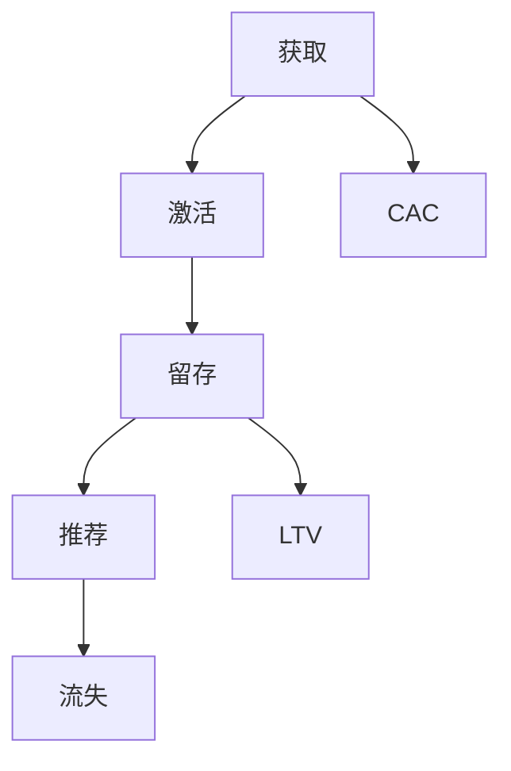

                 

# 创业公司的用户增长黑客策略

> 关键词：用户增长、黑客策略、创业公司、增长模型、算法优化、数据驱动

> 摘要：本文将深入探讨创业公司如何通过实施一系列用户增长黑客策略，快速扩大用户基础，实现持续增长。我们将从核心概念、算法原理、数学模型、实战案例等多个角度展开讨论，帮助创业公司找到最适合其业务发展的用户增长路径。

## 1. 背景介绍

### 1.1 目的和范围

本文旨在为创业公司提供一套系统性、可操作的用户增长策略。通过分析当前市场趋势和成功案例，我们将介绍一系列增长黑客技巧，帮助公司在有限资源下实现用户快速增长。

### 1.2 预期读者

本文适合以下读者群体：

- 创业公司创始人、产品经理、市场营销人员
- 数据分析师、增长黑客、产品工程师
- 对用户增长策略感兴趣的技术从业者

### 1.3 文档结构概述

本文分为以下部分：

1. 背景介绍
2. 核心概念与联系
3. 核心算法原理 & 具体操作步骤
4. 数学模型和公式 & 详细讲解 & 举例说明
5. 项目实战：代码实际案例和详细解释说明
6. 实际应用场景
7. 工具和资源推荐
8. 总结：未来发展趋势与挑战
9. 附录：常见问题与解答
10. 扩展阅读 & 参考资料

### 1.4 术语表

#### 1.4.1 核心术语定义

- **增长黑客**：一种以数据驱动的方式，利用技术和创意手段实现用户增长的方法。
- **用户增长**：指在一定时间内，新用户数量的增加。
- **黑客策略**：指通过巧妙地利用现有技术和资源，实现快速增长的方法。

#### 1.4.2 相关概念解释

- **A/B测试**：一种实验方法，通过将用户分为两组，分别展示不同的产品特性，比较两组用户的反应差异。
- **留存率**：指在一段时间内，仍然使用产品的用户比例。
- **渠道**：指用户获取的途径，如社交媒体、广告、口碑等。

#### 1.4.3 缩略词列表

- **增长黑客**：Growth Hacker
- **用户增长**：User Growth
- **A/B测试**：A/B Testing

## 2. 核心概念与联系

为了更好地理解用户增长黑客策略，我们首先需要了解以下几个核心概念：

1. 用户生命周期
2. 用户获取成本（CAC）
3. 用户留存率
4. 用户价值（LTV）

### 用户生命周期

用户生命周期是指用户从接触到产品到离开产品的整个过程。通常分为以下几个阶段：

1. **获取**：吸引新用户关注产品。
2. **激活**：让新用户开始使用产品。
3. **留存**：保持用户持续使用产品。
4. **推荐**：鼓励用户向他人推荐产品。
5. **流失**：用户停止使用产品。

### 用户获取成本（CAC）

用户获取成本是指公司为获得一个新用户所花费的平均成本。降低CAC是增长黑客的重要目标之一。

### 用户留存率

用户留存率是指在一段时间内，仍然使用产品的用户比例。高留存率意味着用户对产品有较强的依赖和认可。

### 用户价值（LTV）

用户价值是指一个用户在整个生命周期内为公司带来的总价值。LTV是评估用户增长策略的重要指标。

### Mermaid 流程图

以下是一个简化的用户生命周期流程图，展示了各个核心概念之间的联系：



## 3. 核心算法原理 & 具体操作步骤

增长黑客策略的核心在于利用数据驱动的方法，不断优化用户获取、激活、留存等环节。以下是一个基本的用户增长算法框架：

### 3.1 用户获取

**算法原理**：

用户获取是通过各种渠道将潜在用户吸引到产品中。常见的获取渠道包括：

- 社交媒体广告
- 搜索引擎广告
- 口碑传播
- 合作推广

**具体操作步骤**：

1. **确定目标用户群体**：分析目标市场，确定目标用户特征。
2. **选择合适渠道**：根据目标用户特征，选择合适的渠道进行推广。
3. **制定广告策略**：设计有吸引力的广告内容和形式，提高点击率。
4. **监控数据**：通过数据分析，评估渠道效果，优化广告投放策略。

### 3.2 用户激活

**算法原理**：

用户激活是指将潜在用户转化为活跃用户的过程。关键在于提供价值，让用户感受到产品的实用性和吸引力。

**具体操作步骤**：

1. **分析用户行为**：收集用户在产品中的行为数据，分析用户喜好和使用习惯。
2. **优化用户体验**：根据用户行为数据，调整产品设计和功能，提高用户满意度。
3. **推送有针对性的内容**：根据用户特征，推送有针对性的内容，激发用户兴趣。
4. **监测激活效果**：通过数据分析，评估激活策略的效果，持续优化。

### 3.3 用户留存

**算法原理**：

用户留存是指保持用户持续使用产品，避免用户流失。关键在于提高用户黏性，建立用户对产品的依赖。

**具体操作步骤**：

1. **分析留存数据**：收集用户留存数据，分析用户流失原因。
2. **优化产品功能**：根据用户需求，持续优化产品功能，提高用户满意度。
3. **推送有吸引力的内容**：定期推送有价值的内容，激发用户兴趣。
4. **提供激励措施**：通过积分、优惠券等激励措施，提高用户留存率。
5. **监测留存效果**：通过数据分析，评估留存策略的效果，持续优化。

### 3.4 用户推荐

**算法原理**：

用户推荐是指鼓励用户向他人推荐产品，扩大用户群体。关键在于提高用户的满意度和忠诚度。

**具体操作步骤**：

1. **分析推荐数据**：收集用户推荐数据，分析推荐效果。
2. **优化推荐机制**：根据用户特征和推荐效果，优化推荐算法。
3. **提供奖励机制**：为推荐用户和被推荐用户提供奖励，激发推荐意愿。
4. **监测推荐效果**：通过数据分析，评估推荐策略的效果，持续优化。

## 4. 数学模型和公式 & 详细讲解 & 举例说明

在用户增长策略中，数学模型和公式有助于我们更好地理解和评估各种增长指标。以下是一些常见的数学模型和公式：

### 4.1 用户获取成本（CAC）

**公式**：CAC = 总营销成本 / 新增用户数

**详细讲解**：用户获取成本是评估增长策略效果的重要指标。通过计算CAC，我们可以了解公司为获取一个新用户所花费的平均成本。

**举例说明**：假设某创业公司的总营销成本为100万元，新增用户数为1000人，则用户获取成本（CAC）为100万元 / 1000人 = 1000元/人。

### 4.2 用户留存率

**公式**：留存率 = （留存用户数 / 新增用户数）* 100%

**详细讲解**：用户留存率是衡量产品用户黏性的重要指标。通过计算留存率，我们可以了解产品在一段时间内留住用户的能力。

**举例说明**：假设某创业公司在一个月内新增用户数为1000人，其中500人继续使用产品，则留存率为（500人 / 1000人）* 100% = 50%。

### 4.3 用户价值（LTV）

**公式**：LTV = （平均订单价值 * 购买频率 * 留存时间）/ 获客成本

**详细讲解**：用户价值（LTV）是评估用户为公司带来的总价值。通过计算LTV，我们可以了解用户对公司的长期贡献。

**举例说明**：假设某创业公司的平均订单价值为200元，购买频率为每月1次，留存时间为1年，获客成本为1000元。则用户价值（LTV）为（200元 * 1次/月 * 12个月）/ 1000元 = 2.4万元。

### 4.4 贡献率

**公式**：贡献率 = （LTV - CAC）/ CAC * 100%

**详细讲解**：贡献率是衡量用户获取成本收益的重要指标。通过计算贡献率，我们可以了解用户为公司带来的利润。

**举例说明**：假设某创业公司的用户获取成本（CAC）为1000元，用户价值（LTV）为2.4万元。则贡献率为（2.4万元 - 1000元）/ 1000元 * 100% = 240%。

## 5. 项目实战：代码实际案例和详细解释说明

在本节中，我们将通过一个实际案例，展示如何利用Python实现用户增长算法中的用户留存预测。此案例将涵盖数据预处理、模型选择、模型训练和评估等步骤。

### 5.1 开发环境搭建

在开始项目实战之前，我们需要搭建一个Python开发环境。以下是一个基本的Python开发环境搭建步骤：

1. 安装Python 3.8及以上版本。
2. 安装Anaconda或Miniconda，以便管理Python环境和依赖项。
3. 创建一个名为“user_growth”的虚拟环境。
4. 安装必要的依赖项，如NumPy、Pandas、Scikit-learn等。

### 5.2 源代码详细实现和代码解读

以下是一个简单的用户留存预测代码示例：

```python
import pandas as pd
from sklearn.model_selection import train_test_split
from sklearn.ensemble import RandomForestClassifier
from sklearn.metrics import accuracy_score

# 读取数据
data = pd.read_csv('user_data.csv')

# 数据预处理
# ...（数据清洗、特征工程等步骤）

# 划分训练集和测试集
X_train, X_test, y_train, y_test = train_test_split(data.drop('target', axis=1), data['target'], test_size=0.2, random_state=42)

# 模型选择
model = RandomForestClassifier(n_estimators=100, random_state=42)

# 模型训练
model.fit(X_train, y_train)

# 模型评估
predictions = model.predict(X_test)
accuracy = accuracy_score(y_test, predictions)
print(f"Accuracy: {accuracy:.2f}")
```

### 5.3 代码解读与分析

1. **数据读取**：使用Pandas读取用户数据。
2. **数据预处理**：进行数据清洗和特征工程，以准备用于训练的数据集。
3. **划分训练集和测试集**：将数据集划分为训练集和测试集，以便评估模型性能。
4. **模型选择**：选择随机森林分类器作为预测模型。
5. **模型训练**：使用训练集数据训练模型。
6. **模型评估**：使用测试集数据评估模型性能，计算准确率。

通过以上步骤，我们可以实现一个简单的用户留存预测模型。在实际项目中，我们还需要进行更多的特征工程和模型调参，以提高模型性能。

## 6. 实际应用场景

用户增长黑客策略在各个行业和领域都有广泛应用。以下是一些实际应用场景：

### 6.1 社交媒体平台

社交媒体平台通过精准广告投放、用户互动和内容营销等手段，实现用户快速增长。例如，Facebook和Instagram等平台利用用户兴趣和行为数据，进行个性化广告推荐，提高用户获取效率和留存率。

### 6.2 E-commerce平台

电子商务平台通过数据分析、个性化推荐和优惠促销等策略，吸引用户下单并提高复购率。例如，亚马逊利用用户行为数据和算法推荐，实现高效的商品推荐和用户留存。

### 6.3 教育培训行业

教育培训行业通过在线课程、社群互动和直播教学等手段，提高用户参与度和留存率。例如，Coursera和Udemy等平台利用算法优化课程推荐和用户互动，提高用户满意度和留存率。

### 6.4 金融科技行业

金融科技行业通过数据分析、信用评估和风险控制等手段，实现用户快速增长和风险控制。例如，蚂蚁金服和微众银行等平台利用大数据分析和机器学习算法，为用户提供个性化的金融服务。

## 7. 工具和资源推荐

### 7.1 学习资源推荐

#### 7.1.1 书籍推荐

- 《增长黑客：如何低成本实现爆发式增长》
- 《精益创业：新创企业的方法论》
- 《数据挖掘：实用工具与技术》

#### 7.1.2 在线课程

- Coursera上的《数据科学课程》
- Udemy上的《Python数据分析与机器学习》
- Pluralsight上的《增长黑客实战》

#### 7.1.3 技术博客和网站

- Medium上的增长黑客系列文章
- dataquest.io上的数据科学教程
- hacker Noon上的增长黑客新闻和案例分析

### 7.2 开发工具框架推荐

#### 7.2.1 IDE和编辑器

- PyCharm
- Jupyter Notebook
- VS Code

#### 7.2.2 调试和性能分析工具

- Python的pdb调试器
- Jupyter Notebook的Profiler插件
- Py-Spy性能分析工具

#### 7.2.3 相关框架和库

- Scikit-learn
- TensorFlow
- PyTorch

### 7.3 相关论文著作推荐

#### 7.3.1 经典论文

- “A Framework for Growth Hacking: How to Build a Growth Machine?”
- “The Lean Startup: How Today's Entrepreneurs Use Continuous Innovation to Create Radically Successful Businesses”
- “Data Science for Business: What you need to know about data mining and data-analytic thinking”

#### 7.3.2 最新研究成果

- “Growth Hacking: A Data-Driven Approach to Marketing and Sales”
- “The Power of Algorithms: How to Harness the Power of Big Data and Artificial Intelligence”
- “Data Science from Scratch: First Principles with Python”

#### 7.3.3 应用案例分析

- “Growth Hacking Case Studies: How Airbnb, Dropbox, and others grew their businesses”
- “The Data-Driven Growth Playbook: How to Use Data to Create and Scale Your Business”
- “Growth Hacking: How to Unlock Explosive Business Growth Using Data and Creativity”

## 8. 总结：未来发展趋势与挑战

### 8.1 发展趋势

- **数据驱动**：随着大数据和人工智能技术的发展，数据驱动将成为未来用户增长的核心手段。
- **个性化推荐**：个性化推荐将成为提高用户留存和转化率的重要工具。
- **跨界融合**：不同行业之间的融合，将带来新的用户增长机会。

### 8.2 挑战

- **数据隐私**：随着数据隐私法规的不断完善，企业在获取和使用用户数据时面临更多挑战。
- **竞争加剧**：随着用户增长策略的普及，市场竞争将愈发激烈。
- **技术更新**：技术更新速度加快，企业需要不断学习和适应新技术。

## 9. 附录：常见问题与解答

### 9.1 常见问题

- **如何制定有效的用户增长策略？**
- **用户留存率低怎么办？**
- **如何评估用户增长策略的效果？**

### 9.2 解答

- **如何制定有效的用户增长策略？**：制定有效的用户增长策略需要分析目标市场、了解用户需求、选择合适的增长渠道和优化用户体验。具体步骤包括：目标市场分析、用户画像、渠道选择、内容营销、数据分析等。
- **用户留存率低怎么办？**：首先分析用户流失原因，可能包括产品功能不足、用户体验差、竞争压力等。针对不同原因，可以采取以下措施：优化产品功能、提升用户体验、提供激励措施、加强用户互动等。
- **如何评估用户增长策略的效果？**：评估用户增长策略的效果可以通过计算用户获取成本（CAC）、用户留存率（LTV）、贡献率等指标。此外，还可以通过A/B测试、用户反馈等方式，了解策略的实际效果。

## 10. 扩展阅读 & 参考资料

-《增长黑客：如何低成本实现爆发式增长》
-《精益创业：新创企业的方法论》
-《数据科学：从入门到实践》
-《Python数据分析与机器学习》
-《增长黑客实战：如何用数据驱动的方法实现用户增长》
- Medium上的增长黑客系列文章
- hacker noon上的增长黑客新闻和案例分析
- dataquest.io上的数据科学教程
- Coursera上的数据科学课程
- Udemy上的Python数据分析与机器学习课程
- PyCharm官方网站
- Jupyter Notebook官方网站
- VS Code官方网站
- Scikit-learn官方文档
- TensorFlow官方文档
- PyTorch官方文档

### 作者

**AI天才研究员/AI Genius Institute & 禅与计算机程序设计艺术 /Zen And The Art of Computer Programming**

