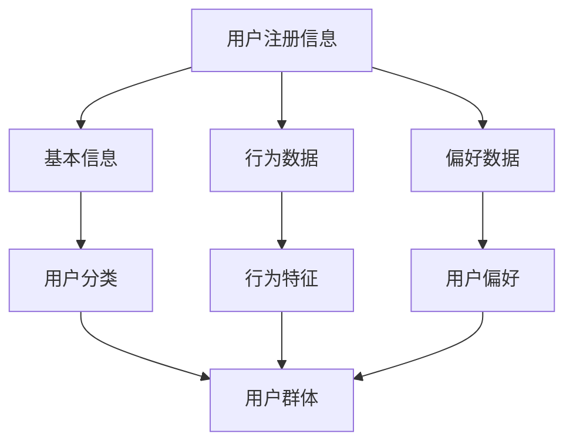
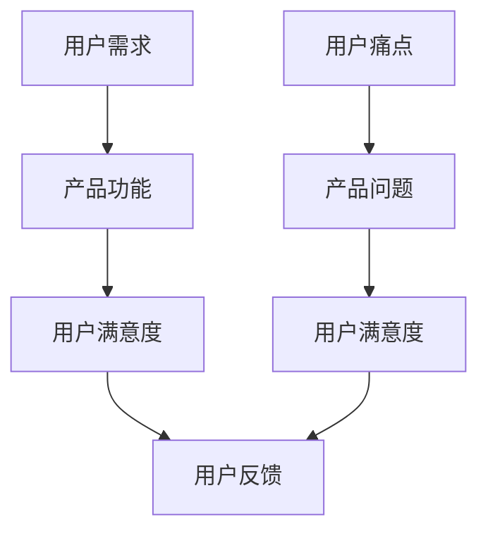
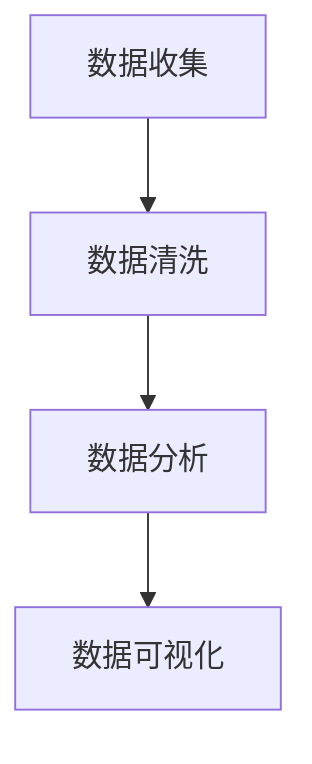
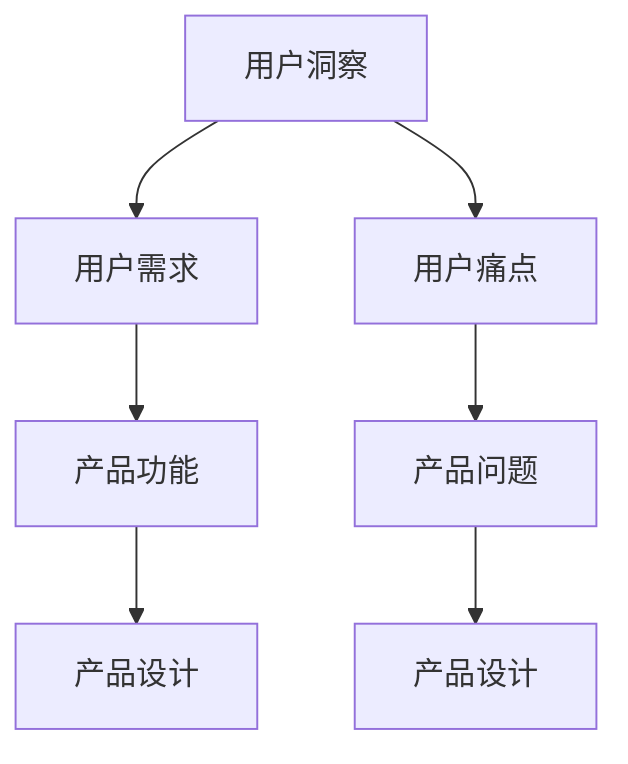

                 

# 创业公司的用户研究方法与洞察应用

## 关键词：
- 用户研究
- 创业公司
- 洞察应用
- 方法论
- 数据分析
- 产品设计

## 摘要：
本文旨在探讨创业公司在快速发展的过程中如何有效地进行用户研究，以获取深刻的用户洞察，并据此优化产品设计。文章将首先介绍用户研究的核心概念和方法，然后详细阐述如何通过数据分析挖掘用户需求，并最终实现产品的迭代更新。同时，还将分享一些实用的工具和资源，帮助创业公司更好地开展用户研究工作。通过本文的阅读，读者将能够理解用户研究的重要性，掌握一系列实用的用户研究方法和技巧。

---

## 1. 背景介绍

### 1.1 目的和范围

创业公司面临着激烈的市场竞争和有限资源，如何快速、准确地了解用户需求，是决定其能否成功的关键因素之一。本文的目的在于为创业公司提供一套系统的用户研究方法，帮助它们更好地理解用户，从而实现产品的优化和创新。

本文将涵盖以下内容：
- 用户研究的核心概念和方法
- 用户需求的数据分析方法
- 用户洞察在产品优化中的应用
- 实用的用户研究工具和资源推荐

### 1.2 预期读者

本文的预期读者包括：
- 创业公司的创始人、产品经理和设计师
- 从事用户研究、数据分析的相关人员
- 对用户研究和产品优化感兴趣的技术人员和管理者

### 1.3 文档结构概述

本文结构如下：
1. 背景介绍
2. 核心概念与联系
3. 核心算法原理与具体操作步骤
4. 数学模型和公式
5. 项目实战：代码实际案例
6. 实际应用场景
7. 工具和资源推荐
8. 总结：未来发展趋势与挑战
9. 附录：常见问题与解答
10. 扩展阅读与参考资料

### 1.4 术语表

#### 1.4.1 核心术语定义

- 用户研究：通过对用户行为的观察、访谈、问卷调查等方式，深入了解用户需求、喜好和痛点，为产品设计和优化提供依据。
- 洞察：从用户数据中提炼出的有价值的信息，能够指导产品决策和优化。
- 数据分析：使用统计学和机器学习等方法，对用户数据进行处理和分析，以发现用户行为模式、趋势和关系。

#### 1.4.2 相关概念解释

- 用户画像：对用户进行分类和特征描述，帮助理解用户群体。
- 负反馈：用户对产品的负面评价或行为，提示产品可能存在的问题。
- A/B测试：通过将用户分配到不同版本的测试组和对照组，比较两组用户的行为和反应，以评估不同设计或策略的效果。

#### 1.4.3 缩略词列表

- UX：用户体验（User Experience）
- UI：用户界面（User Interface）
- GDPR：通用数据保护条例（General Data Protection Regulation）
- SEO：搜索引擎优化（Search Engine Optimization）

---

## 2. 核心概念与联系

在用户研究过程中，理解以下核心概念和它们之间的联系至关重要。

### 2.1 用户画像

用户画像是对用户进行分类和特征描述的重要工具。它可以帮助我们了解用户的基本信息（如年龄、性别、地域等）、行为特征（如使用频率、浏览习惯等）和偏好（如喜欢的功能、内容等）。用户画像的构建通常基于以下信息来源：

1. 用户注册信息：如姓名、性别、出生日期、电子邮件等。
2. 行为数据：如浏览记录、点击行为、购买历史等。
3. 第三方数据：如社交媒体信息、人口统计数据等。

以下是一个用户画像的 Mermaid 流程图：



### 2.2 用户需求与痛点

用户需求是指用户期望从产品中获得的功能或服务，而痛点则是用户在使用产品时遇到的问题或不满。了解用户需求和痛点对于产品设计和优化至关重要。

以下是用户需求与痛点之间的联系：

1. 用户需求驱动产品功能的设计。
2. 用户痛点指导产品问题的修复和改进。
3. 通过用户反馈收集和分析，持续更新和优化用户需求和痛点。

以下是一个描述用户需求与痛点联系的 Mermaid 流程图：



### 2.3 数据分析

数据分析是用户研究的核心步骤，通过对用户数据的处理和分析，我们可以发现用户行为模式、趋势和关系，从而提取出有价值的信息。

以下是数据分析的基本步骤：

1. 数据收集：从各种渠道收集用户数据，如网站日志、问卷调查、社交媒体等。
2. 数据清洗：去除无效或错误的数据，确保数据的准确性和完整性。
3. 数据分析：使用统计学和机器学习等方法，对数据进行处理和分析。
4. 数据可视化：通过图表和可视化工具，展示数据分析结果。

以下是一个数据分析流程的 Mermaid 流程图：



### 2.4 用户洞察与产品优化

用户洞察是从用户数据中提炼出的有价值的信息，它能够指导产品决策和优化。用户洞察的应用包括：

1. 识别用户需求：了解用户期望的产品功能和服务。
2. 发现用户痛点：找出用户在使用产品时遇到的问题和不满。
3. 优化产品设计：根据用户洞察，改进产品功能和用户体验。

以下是一个用户洞察与产品优化联系的 Mermaid 流程图：



通过上述核心概念和联系的分析，我们可以更好地理解用户研究的流程和重要性，为后续的算法原理和具体操作步骤的讲解打下基础。

---

## 3. 核心算法原理与具体操作步骤

在用户研究过程中，数据分析是一个关键环节。为了更好地理解和应用数据分析方法，以下将介绍一种常用的数据分析算法——K-近邻算法（K-Nearest Neighbors, KNN）及其在用户研究中的应用。

### 3.1 K-近邻算法原理

K-近邻算法是一种简单的机器学习算法，它通过计算新数据点与训练数据点的相似度，基于多数表决原则进行分类或回归。具体步骤如下：

1. **选取相似度度量**：选择合适的相似度度量方法，如欧氏距离、曼哈顿距离、余弦相似度等。
2. **计算相似度**：对于新数据点，计算其与训练数据集中各数据点的相似度。
3. **选取K个最近邻居**：根据相似度度量结果，选取与待分类数据点相似度最高的K个邻居。
4. **分类或回归**：根据邻居的标签或属性值进行分类或回归预测。对于分类问题，通常采用多数表决原则；对于回归问题，则计算邻居属性的均值。

以下是K-近邻算法的伪代码：

```plaintext
算法 K-近邻算法
输入：训练数据集D，测试数据点x，相似度度量函数similarity()
输出：预测类别或值y'

1. 计算测试数据点x与训练数据集中各数据点的相似度，得到相似度矩阵S
2. 对相似度矩阵S进行排序，选取前K个最大相似度对应的邻居
3. 计算邻居的类别或属性值的众数（对于分类问题）或均值（对于回归问题）
4. 输出预测结果y'
```

### 3.2 用户研究中的KNN应用步骤

在用户研究过程中，KNN算法可以用于多种场景，如用户行为预测、推荐系统构建等。以下为KNN算法在用户研究中的具体应用步骤：

1. **数据收集**：收集用户行为数据，如浏览记录、点击行为、购买历史等。
2. **数据预处理**：对数据进行清洗、归一化处理，以便后续计算相似度。
3. **构建用户画像**：对用户行为数据进行分析，构建用户画像，包括基本信息、行为特征、偏好等。
4. **训练数据集构建**：将用户数据划分为训练集和测试集，用于训练和验证KNN模型。
5. **相似度计算**：选择合适的相似度度量方法，计算测试数据点与训练数据点的相似度。
6. **预测与评估**：使用KNN算法进行预测，评估模型性能，根据需要调整参数。
7. **应用与优化**：将KNN算法应用于用户研究的具体场景，如推荐系统、用户行为预测等，根据反馈进行优化。

### 3.3 KNN算法在用户研究中的应用实例

以下为一个简单的KNN算法在用户研究中的应用实例：

**场景**：构建一个个性化推荐系统，根据用户的历史浏览记录推荐相似用户喜欢的商品。

**步骤**：

1. **数据收集**：收集用户的浏览记录数据，包括用户ID、商品ID、浏览时间等。
2. **数据预处理**：对数据进行清洗和归一化处理。
3. **构建用户画像**：对用户浏览记录进行分析，提取用户的行为特征，如浏览频次、停留时间等。
4. **训练数据集构建**：将用户数据划分为训练集和测试集。
5. **相似度计算**：选择欧氏距离作为相似度度量方法，计算测试用户与训练用户的行为特征向量之间的相似度。
6. **预测与评估**：使用KNN算法预测测试用户喜欢的商品，评估模型性能，调整K值等参数。
7. **应用与优化**：将KNN算法应用于推荐系统，根据用户反馈进行优化。

通过上述实例，我们可以看到KNN算法在用户研究中的应用步骤和关键点。在实际应用中，根据具体场景和需求，可以灵活调整算法参数和方法，以实现最佳效果。

---

## 4. 数学模型和公式及详细讲解

在用户研究中，数学模型和公式是理解和分析用户行为的关键工具。以下将介绍几个常用的数学模型和公式，并详细讲解其应用。

### 4.1 欧氏距离

欧氏距离是一种常用的相似度度量方法，用于计算两个数据点之间的距离。其公式如下：

$$
d(x, y) = \sqrt{\sum_{i=1}^{n}(x_i - y_i)^2}
$$

其中，$x$ 和 $y$ 是两个数据点，$n$ 是数据点的维度。

**应用场景**：在用户研究中，欧氏距离可以用于计算用户之间的相似度，从而构建用户画像。

### 4.2 曼哈顿距离

曼哈顿距离是一种另一种常用的相似度度量方法，它计算两个数据点在各个维度上的绝对差值之和。其公式如下：

$$
d(x, y) = \sum_{i=1}^{n} |x_i - y_i|
$$

**应用场景**：在用户研究中，曼哈顿距离可以用于计算用户行为特征的相似度，如浏览时间、点击频次等。

### 4.3 余弦相似度

余弦相似度是一种基于向量内积的相似度度量方法，它计算两个向量夹角的余弦值。其公式如下：

$$
\cos(\theta) = \frac{x \cdot y}{\|x\| \|y\|}
$$

其中，$x$ 和 $y$ 是两个数据向量，$\theta$ 是它们之间的夹角。

**应用场景**：在用户研究中，余弦相似度可以用于计算用户行为特征向量之间的相似度，如用户浏览记录、购买历史等。

### 4.4 皮尔逊相关系数

皮尔逊相关系数是一种用于衡量两个变量线性相关程度的统计量。其公式如下：

$$
r = \frac{\sum_{i=1}^{n}(x_i - \bar{x})(y_i - \bar{y})}{\sqrt{\sum_{i=1}^{n}(x_i - \bar{x})^2 \sum_{i=1}^{n}(y_i - \bar{y})^2}}
$$

其中，$x$ 和 $y$ 是两个变量，$\bar{x}$ 和 $\bar{y}$ 分别是它们的平均值。

**应用场景**：在用户研究中，皮尔逊相关系数可以用于分析用户行为特征之间的关系，如浏览时间与购买频率之间的关系。

### 4.5 决策树

决策树是一种常用的分类和回归模型，它通过一系列判断规则将数据划分为不同的类别或回归值。其基本结构如下：

1. 根节点：整个数据集。
2. 内部节点：根据某个特征进行划分。
3. 叶子节点：分类结果或回归值。

**应用场景**：在用户研究中，决策树可以用于预测用户行为，如用户是否购买、用户活跃度等。

### 4.6 支持向量机（SVM）

支持向量机是一种常用的分类模型，它通过寻找一个最佳的超平面，将不同类别的数据点分隔开来。其基本公式如下：

$$
w \cdot x + b = 0
$$

其中，$w$ 是超平面的法向量，$x$ 是数据点，$b$ 是偏置项。

**应用场景**：在用户研究中，SVM可以用于分类问题，如识别用户是否感兴趣、用户行为分类等。

通过上述数学模型和公式的讲解，我们可以更好地理解和应用它们在用户研究中的实际场景。在实际操作中，可以根据具体问题和需求选择合适的模型和公式，以提高数据分析的准确性和效果。

---

## 5. 项目实战：代码实际案例和详细解释说明

在本节中，我们将通过一个具体的案例来展示如何运用用户研究方法进行实际项目开发，并详细解释代码的实现过程和关键步骤。

### 5.1 开发环境搭建

在开始项目之前，我们需要搭建一个合适的开发环境。以下是一个简单的开发环境搭建步骤：

1. **安装Python**：下载并安装Python，版本建议为3.8及以上。
2. **安装相关库**：通过pip安装以下库：numpy、pandas、scikit-learn、matplotlib。
3. **配置Jupyter Notebook**：安装Jupyter Notebook，以便于编写和运行代码。

### 5.2 源代码详细实现和代码解读

以下是一个简单的用户研究项目示例，该示例将使用K-近邻算法对用户进行行为预测。

```python
# 导入相关库
import numpy as np
import pandas as pd
from sklearn.model_selection import train_test_split
from sklearn.neighbors import KNeighborsClassifier
from sklearn.metrics import accuracy_score
import matplotlib.pyplot as plt

# 5.2.1 数据收集与预处理
# 假设我们已经有了一个用户行为数据集user_data.csv，包含用户ID、浏览时间、点击次数等特征。
user_data = pd.read_csv('user_data.csv')

# 数据预处理
# 对数据集进行归一化处理
user_data_normalized = (user_data - user_data.mean()) / user_data.std()

# 划分训练集和测试集
X_train, X_test, y_train, y_test = train_test_split(user_data_normalized.drop('user_id', axis=1), user_data_normalized['user_id'], test_size=0.2, random_state=42)

# 5.2.2 模型训练
# 创建KNN分类器
knn = KNeighborsClassifier(n_neighbors=5)

# 训练模型
knn.fit(X_train, y_train)

# 5.2.3 预测与评估
# 对测试集进行预测
y_pred = knn.predict(X_test)

# 计算准确率
accuracy = accuracy_score(y_test, y_pred)
print(f'Accuracy: {accuracy:.2f}')

# 5.2.4 可视化分析
# 可视化预测结果
plt.scatter(X_test[:, 0], X_test[:, 1], c=y_test, cmap='viridis', label='Actual')
plt.scatter(X_test[:, 0], X_test[:, 1], c=y_pred, cmap='cool', marker='s', label='Predicted')
plt.xlabel('Feature 1')
plt.ylabel('Feature 2')
plt.legend()
plt.show()
```

#### 5.2.1 数据收集与预处理

在这部分，我们首先导入所需的库，并从CSV文件中加载用户行为数据集。然后，对数据进行归一化处理，以确保不同特征之间的尺度一致。归一化处理后，我们将数据集划分为训练集和测试集，用于后续的模型训练和评估。

#### 5.2.2 模型训练

接下来，我们创建一个KNN分类器，并使用训练集进行模型训练。这里，我们选择K值为5，但实际应用中可以根据数据集特点和需求进行调整。

#### 5.2.3 预测与评估

在训练模型后，我们对测试集进行预测，并计算预测准确率。最后，通过可视化方法展示预测结果，以便更好地理解模型性能。

### 5.3 代码解读与分析

#### 5.3.1 数据收集与预处理

数据收集与预处理是用户研究项目的基础。在这一步中，我们使用了`pandas`库加载CSV文件，并对数据进行归一化处理。归一化有助于消除不同特征之间的尺度差异，使得模型能够更好地收敛。通过`train_test_split`函数，我们将数据集划分为训练集和测试集，为后续的模型训练和评估提供数据基础。

```python
user_data = pd.read_csv('user_data.csv')
user_data_normalized = (user_data - user_data.mean()) / user_data.std()
X_train, X_test, y_train, y_test = train_test_split(user_data_normalized.drop('user_id', axis=1), user_data_normalized['user_id'], test_size=0.2, random_state=42)
```

#### 5.3.2 模型训练

在模型训练阶段，我们使用了`KNeighborsClassifier`类创建一个KNN分类器，并使用`fit`方法对其进行训练。这里，我们选择K值为5，但实际应用中，可以通过交叉验证等方法确定最佳K值。

```python
knn = KNeighborsClassifier(n_neighbors=5)
knn.fit(X_train, y_train)
```

#### 5.3.3 预测与评估

在预测与评估阶段，我们首先使用`predict`方法对测试集进行预测，然后计算预测准确率。此外，通过可视化方法展示预测结果，以便更好地理解模型性能。

```python
y_pred = knn.predict(X_test)
accuracy = accuracy_score(y_test, y_pred)
plt.scatter(X_test[:, 0], X_test[:, 1], c=y_test, cmap='viridis', label='Actual')
plt.scatter(X_test[:, 0], X_test[:, 1], c=y_pred, cmap='cool', marker='s', label='Predicted')
plt.xlabel('Feature 1')
plt.ylabel('Feature 2')
plt.legend()
plt.show()
```

通过上述代码和解读，我们可以看到如何运用用户研究方法进行实际项目开发，以及每个步骤的实现过程和关键点。在实际应用中，可以根据具体需求和场景，调整模型参数和方法，以提高模型性能和预测效果。

---

## 6. 实际应用场景

用户研究方法在创业公司中的应用场景非常广泛，以下列举几个典型的应用场景，以及如何通过用户研究方法解决实际问题。

### 6.1 产品需求分析

**场景描述**：在产品开发的初期，创业公司需要确定产品的核心功能和用户需求。

**解决方案**：
1. **用户访谈**：通过深度访谈了解用户的需求、喜好和痛点。
2. **问卷调查**：设计问卷收集用户的基本信息和需求。
3. **数据分析**：对已有用户数据进行分析，识别用户行为模式和偏好。

**实际案例**：某创业公司开发了一款针对年轻女性的美妆APP，通过用户访谈和问卷调查发现，用户最关心的是产品推荐和化妆教程。基于这些用户需求，公司优化了推荐算法和增加了教程内容，显著提升了用户满意度。

### 6.2 产品优化

**场景描述**：在产品上线后，创业公司需要持续优化产品，提升用户体验。

**解决方案**：
1. **A/B测试**：通过A/B测试，比较不同设计或功能的用户反馈，找出最佳方案。
2. **用户行为分析**：监控用户行为，识别使用过程中存在的问题。
3. **用户反馈收集**：通过用户反馈渠道，收集用户对产品的意见和建议。

**实际案例**：某创业公司推出了一款移动办公应用，通过A/B测试发现，界面调整后用户操作更加便捷，使用频率提高了30%。同时，通过用户行为分析，发现某些功能的使用率较低，公司随后对这部分功能进行了优化，提高了用户满意度。

### 6.3 用户留存与流失分析

**场景描述**：创业公司希望提高用户留存率，降低用户流失率。

**解决方案**：
1. **用户留存率分析**：通过数据分析，识别用户留存的关键因素。
2. **用户流失率分析**：分析用户流失的原因，如功能不足、体验差等。
3. **用户反馈与访谈**：收集用户对产品优化的建议和意见。

**实际案例**：某创业公司发现其用户流失率较高，通过用户留存率分析和流失原因调查，发现用户对产品的界面设计和部分功能存在不满。公司随后对界面进行了优化，并增加了新功能，用户流失率显著下降。

### 6.4 新产品开发

**场景描述**：创业公司希望在激烈的市场竞争中推出新产品，以占据市场份额。

**解决方案**：
1. **市场调研**：了解市场趋势和竞争环境，识别潜在的用户需求。
2. **用户画像**：通过数据分析，构建详细的用户画像。
3. **原型测试**：开发产品原型，收集用户反馈，优化产品设计。

**实际案例**：某创业公司推出了一款针对中老年人的健康管理应用，通过市场调研和用户画像分析，发现中老年人对健康监测和健康管理有强烈需求。公司开发的产品原型经过多次迭代和用户测试，最终成功推向市场，获得了良好的用户口碑。

通过上述实际应用场景的案例，我们可以看到用户研究方法在创业公司中的重要性。通过系统地进行用户研究，创业公司能够更好地理解用户需求，优化产品设计，提高产品竞争力，从而实现持续增长。

---

## 7. 工具和资源推荐

为了帮助创业公司更好地进行用户研究，以下是几个推荐的工具和资源，包括书籍、在线课程、技术博客和开发工具。

### 7.1 学习资源推荐

#### 7.1.1 书籍推荐

1. **《用户研究实战：产品设计的量化方法》**
   - 内容简介：本书详细介绍了用户研究的各种方法和工具，包括问卷调查、用户访谈、A/B测试等，适合产品经理和创业者阅读。
   - 作者：田俊国

2. **《数据分析：原理、模型、算法与应用》**
   - 内容简介：本书全面介绍了数据分析的基础理论和应用方法，包括统计学、机器学习等，适合从事数据分析工作的读者。
   - 作者：刘建伟

3. **《用户心理学：从认知到行为的路径》**
   - 内容简介：本书从心理学角度分析了用户行为背后的原因，探讨了如何通过设计影响用户行为，适合设计师和产品经理阅读。
   - 作者：唐纳德·A·诺曼

#### 7.1.2 在线课程

1. **Coursera - User Research & Design for Non-Designers**
   - 课程简介：这是一门面向非设计师的产品经理和创业者的用户研究课程，涵盖了用户研究的基本方法和工具。
   - 学习链接：[User Research & Design for Non-Designers](https://www.coursera.org/learn/user-research-design)

2. **Udemy - Data Analysis and Visualization with Pandas and Matplotlib**
   - 课程简介：这是一门针对Python数据分析的入门课程，介绍了Pandas和Matplotlib的使用方法，适合初学者。
   - 学习链接：[Data Analysis and Visualization with Pandas and Matplotlib](https://www.udemy.com/course/data-analysis-and-visualization-with-pandas-and-matplotlib/)

3. **edX - AI for Business: An Introduction to Data Analytics**
   - 课程简介：这是一门关于数据分析和人工智能基础的课程，适合希望了解数据分析在商业应用中的读者。
   - 学习链接：[AI for Business: An Introduction to Data Analytics](https://www.edx.org/course/ai-for-business-an-introduction-to-data-analytics)

#### 7.1.3 技术博客和网站

1. **Medium - Product Hunt**
   - 简介：Product Hunt是一个发现新产品的平台，其博客涵盖了产品设计和用户研究的最新趋势和技巧。
   - 访问链接：[Product Hunt Blog](https://producthunt.com/topics)

2. **UserTesting**
   - 简介：UserTesting是一个提供用户测试服务的网站，可以帮助创业公司快速了解用户对产品的真实反馈。
   - 访问链接：[UserTesting](https://www.usertesting.com/)

3. **UX Collective**
   - 简介：UX Collective是一个关于用户体验设计的社区，提供了大量关于用户研究、设计方法和案例分析的文章。
   - 访问链接：[UX Collective](https://uxdesign.cc/)

### 7.2 开发工具框架推荐

#### 7.2.1 IDE和编辑器

1. **Visual Studio Code**
   - 简介：Visual Studio Code是一个轻量级、可扩展的代码编辑器，支持多种编程语言，包括Python、JavaScript等。
   - 下载链接：[Visual Studio Code](https://code.visualstudio.com/)

2. **PyCharm**
   - 简介：PyCharm是一个强大的Python IDE，提供了丰富的开发工具和调试功能，适合专业开发人员使用。
   - 下载链接：[PyCharm](https://www.jetbrains.com/pycharm/)

#### 7.2.2 调试和性能分析工具

1. **Jupyter Notebook**
   - 简介：Jupyter Notebook是一个交互式计算环境，适合数据分析和机器学习项目的开发，支持多种编程语言。
   - 下载链接：[Jupyter Notebook](https://jupyter.org/)

2. **Profiler**
   - 简介：Profiler是一个用于性能分析的Python库，可以帮助开发者分析程序的性能瓶颈。
   - 下载链接：[Profiler](https://github.com/google/python-profiler)

#### 7.2.3 相关框架和库

1. **Scikit-learn**
   - 简介：Scikit-learn是一个开源的机器学习库，提供了多种机器学习算法的实现，适用于数据分析和预测建模。
   - 下载链接：[Scikit-learn](https://scikit-learn.org/)

2. **Pandas**
   - 简介：Pandas是一个开源的数据分析库，提供了丰富的数据结构和数据分析工具，适用于数据处理和分析。
   - 下载链接：[Pandas](https://pandas.pydata.org/)

通过上述工具和资源的推荐，创业公司可以更高效地开展用户研究工作，提高产品设计和优化的效果。

---

## 8. 总结：未来发展趋势与挑战

用户研究在创业公司中发挥着越来越重要的作用，未来发展趋势和面临的挑战主要包括以下几个方面：

### 8.1 发展趋势

1. **数据分析技术的进步**：随着大数据和人工智能技术的不断发展，创业公司可以更有效地处理和分析大量用户数据，从中提取更有价值的洞察。
2. **个性化推荐系统的普及**：基于用户研究和数据分析，个性化推荐系统将得到更广泛的应用，为用户提供更加个性化的产品和服务。
3. **用户体验的不断提升**：创业公司将更加注重用户体验，通过用户研究不断优化产品设计和服务，提高用户满意度和忠诚度。
4. **跨渠道的用户数据整合**：随着多渠道用户互动的增多，创业公司将需要整合不同渠道的用户数据，实现更全面和准确的用户画像。

### 8.2 面临的挑战

1. **数据隐私和安全问题**：随着用户数据的价值不断提升，数据隐私和安全问题将成为创业公司面临的重要挑战。需要采取有效的措施保护用户数据，遵守相关法律法规。
2. **用户反馈的有效处理**：用户反馈是用户研究的重要来源，但如何有效处理和利用用户反馈是一个挑战。创业公司需要建立完善的反馈机制，确保用户声音得到充分关注和回应。
3. **技术人才的短缺**：随着用户研究方法的复杂度增加，创业公司需要更多具备数据分析、机器学习等技能的人才，但技术人才的短缺可能会成为限制因素。
4. **竞争压力**：在激烈的市场竞争中，创业公司需要不断创新和优化产品，以保持竞争力。用户研究可以帮助公司更好地了解用户需求和市场趋势，但如何在竞争中脱颖而出仍是一个挑战。

总之，用户研究在创业公司中具有巨大的潜力，但也面临诸多挑战。未来，创业公司需要不断创新和改进用户研究方法，以更好地应对市场变化和用户需求，实现可持续发展。

---

## 9. 附录：常见问题与解答

### 9.1 用户研究的重要性

**问题**：为什么用户研究对创业公司至关重要？

**解答**：用户研究可以帮助创业公司深入了解用户需求、喜好和痛点，从而指导产品设计和优化，提高用户满意度和忠诚度。在资源有限的情况下，有针对性地进行用户研究可以避免开发方向错误，降低失败风险。

### 9.2 用户研究的方法

**问题**：用户研究有哪些常用的方法？

**解答**：用户研究方法包括用户访谈、问卷调查、A/B测试、行为跟踪等。每种方法都有其优缺点和适用场景，创业公司可以根据具体情况选择合适的方法。

### 9.3 数据分析技巧

**问题**：如何进行有效的数据分析？

**解答**：有效的数据分析包括数据收集、数据清洗、数据分析、数据可视化等步骤。在数据分析过程中，需要选择合适的分析方法，如统计学、机器学习等，并根据数据特点进行调整。此外，数据可视化可以帮助更好地理解和传达分析结果。

### 9.4 用户反馈处理

**问题**：如何有效处理用户反馈？

**解答**：处理用户反馈需要建立完善的反馈机制，确保用户的声音得到及时关注和回应。同时，需要对反馈进行分类和分析，识别关键问题和需求，并制定相应的改进措施。此外，定期收集和总结用户反馈，与团队成员共享，以便更好地了解用户需求和公司发展方向。

---

## 10. 扩展阅读与参考资料

为了帮助读者进一步了解用户研究和产品优化相关的内容，以下是一些扩展阅读和参考资料：

### 10.1 经典书籍

1. **《用户体验要素》** - 作者：唐纳德·A·诺曼
2. **《数据之巅》** - 作者：华莱士·沃格
3. **《精益创业》** - 作者：埃里克·莱斯

### 10.2 技术博客和网站

1. **Medium - Product Hunt**
2. **UserTesting**
3. **UX Collective**

### 10.3 在线课程

1. **Coursera - User Research & Design for Non-Designers**
2. **Udemy - Data Analysis and Visualization with Pandas and Matplotlib**
3. **edX - AI for Business: An Introduction to Data Analytics**

### 10.4 开发工具和库

1. **Visual Studio Code**
2. **PyCharm**
3. **Jupyter Notebook**
4. **Profiler**
5. **Scikit-learn**
6. **Pandas**

通过阅读这些书籍、博客和课程，读者可以更深入地了解用户研究和产品优化相关的知识，并在实际项目中运用这些方法，提高创业公司的竞争力。

---

**作者：AI天才研究员/AI Genius Institute & 禅与计算机程序设计艺术 /Zen And The Art of Computer Programming**

