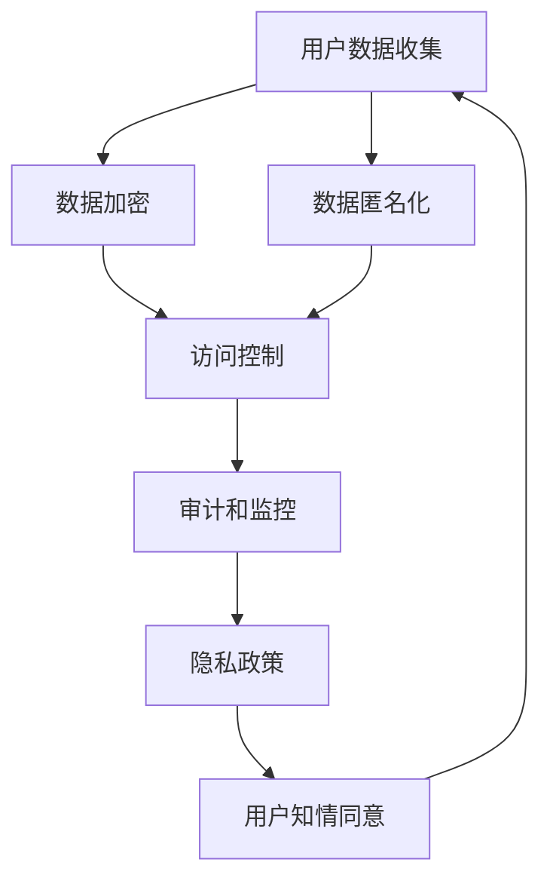

                 

# 创业公司的用户隐私保护策略

> **关键词：** 用户隐私，数据安全，创业公司，策略，数据加密，法律法规

> **摘要：** 本文旨在为创业公司提供一套用户隐私保护策略，从概念定义到实际操作步骤，全面解析如何在遵守法律法规的前提下，确保用户数据的安全与隐私。文章首先介绍用户隐私保护的重要性，然后详细阐述核心概念、算法原理、数学模型及项目实战，最后提供相关资源推荐和未来发展趋势。

## 1. 背景介绍

### 1.1 目的和范围

创业公司，作为创新和变革的驱动力，其核心竞争力不仅在于技术创新，更在于对用户隐私的尊重与保护。本文的目标是帮助创业公司构建一套系统化的用户隐私保护策略，确保在追求业务增长的同时，不损害用户的基本权益。

本文将涵盖以下内容：

- 用户隐私保护的核心概念和重要性
- 数据安全法律法规的概述
- 用户隐私保护策略的构建方法
- 核心算法原理和操作步骤
- 数学模型和公式的详细讲解
- 项目实战中的代码实现和解析
- 实际应用场景及案例分析
- 工具和资源推荐
- 未来发展趋势与挑战

### 1.2 预期读者

- 创业公司的CTO、技术总监
- 数据安全和隐私保护工程师
- 产品经理和隐私政策制定者
- 对数据安全和隐私保护感兴趣的IT专业人士

### 1.3 文档结构概述

本文按照以下结构展开：

1. 背景介绍：介绍文章的目的、预期读者和文档结构。
2. 核心概念与联系：解释用户隐私保护的核心概念，并使用Mermaid流程图展示架构。
3. 核心算法原理 & 具体操作步骤：详细阐述保护用户隐私的核心算法原理和步骤。
4. 数学模型和公式 & 详细讲解 & 举例说明：介绍相关的数学模型和公式，并提供实例说明。
5. 项目实战：展示代码实际案例，并进行详细解释说明。
6. 实际应用场景：讨论用户隐私保护在不同场景下的应用。
7. 工具和资源推荐：推荐学习资源和开发工具。
8. 总结：展望用户隐私保护的未来发展趋势和挑战。
9. 附录：常见问题与解答。
10. 扩展阅读 & 参考资料：提供进一步阅读的材料。

### 1.4 术语表

#### 1.4.1 核心术语定义

- 用户隐私：指用户在互联网活动中所产生的个人信息不被未授权的第三方获取、利用的行为。
- 数据安全：确保数据在存储、传输和处理过程中不受未授权访问、篡改、泄露等威胁。
- 加密技术：一种将数据转换为无法被未授权者解读的形式的技术。
- 隐私保护策略：为保护用户隐私而制定的一系列措施和规范。

#### 1.4.2 相关概念解释

- 数据匿名化：通过技术手段去除或模糊化个人身份信息，从而保护用户隐私。
- 数据泄露：指用户数据在未经授权的情况下被非法获取或公开。
- 隐私政策：企业公开声明，详细说明如何收集、使用、存储和保护用户数据。

#### 1.4.3 缩略词列表

- GDPR：通用数据保护条例（General Data Protection Regulation）
- CCPA：加州消费者隐私法案（California Consumer Privacy Act）

## 2. 核心概念与联系

用户隐私保护是创业公司构建可持续业务模式的关键要素。在此，我们将通过Mermaid流程图展示用户隐私保护的核心概念及其联系。



### 2.1 用户数据收集

用户数据是任何创业公司运营的核心资源。数据收集过程应遵循最小化原则，即只收集实现业务目标所必需的数据。以下是数据收集过程的核心步骤：

1. 确定数据收集范围：明确需要收集哪些数据以及数据的用途。
2. 用户知情同意：在收集数据前，确保用户已经知情并同意数据收集。
3. 明确数据使用规则：告知用户数据将被如何使用和存储。

### 2.2 数据加密

数据加密是保护用户隐私的基础措施。加密过程分为数据在传输过程中的传输加密和数据在存储过程中的存储加密。

#### 2.2.1 传输加密

传输加密用于保护数据在网络传输过程中的安全。常见的技术包括：

- TLS/SSL：用于HTTPS等协议，确保数据在传输过程中不被窃取或篡改。

#### 2.2.2 存储加密

存储加密用于保护数据在存储设备上的安全。常见的技术包括：

- AES：一种高级加密标准，用于加密存储数据。

### 2.3 数据匿名化

数据匿名化是通过技术手段去除或模糊化个人身份信息，从而保护用户隐私。常见的技术包括：

- 数据混淆：通过替换或添加噪声，使原始数据难以识别。
- 数据聚合：将个人数据与大量其他数据混合，降低个体识别的可能性。

### 2.4 访问控制

访问控制用于确保只有授权用户才能访问特定数据。核心措施包括：

- 身份验证：验证用户的身份，确保只有合法用户可以访问系统。
- 授权管理：定义不同用户角色和权限，确保用户只能访问其权限范围内的数据。

### 2.5 审计和监控

审计和监控是确保用户隐私保护措施得到有效执行的重要手段。核心措施包括：

- 访问日志记录：记录所有数据访问操作，以便在出现问题时进行追踪和调查。
- 监控系统：实时监控数据访问和操作行为，及时检测和响应异常情况。

### 2.6 隐私政策

隐私政策是企业公开声明，详细说明如何收集、使用、存储和保护用户数据。一个完善的隐私政策应包括：

- 数据收集目的和范围
- 数据使用规则
- 数据存储期限
- 用户权利和申诉渠道
- 隐私政策更新通知

### 2.7 用户知情同意

用户知情同意是数据收集和处理的合法性基础。创业公司应在数据收集前，明确告知用户以下内容：

- 收集的数据类型
- 数据收集的目的
- 数据使用的方式
- 数据共享的对象
- 数据安全保护措施

通过以上步骤，创业公司可以构建一套系统化的用户隐私保护策略，确保用户数据的安全与隐私。

## 3. 核心算法原理 & 具体操作步骤

保护用户隐私的核心算法原理主要围绕数据加密、数据匿名化和访问控制展开。以下将详细阐述这些核心算法的原理，并提供具体的操作步骤。

### 3.1 数据加密

数据加密是保护用户隐私的关键技术。加密算法通过将明文数据转换为密文，确保数据在传输和存储过程中不被未授权者获取。以下是数据加密的核心算法原理和操作步骤：

#### 3.1.1 数据加密算法原理

- **对称加密算法**：加密和解密使用相同的密钥。常见的对称加密算法包括AES、DES等。
- **非对称加密算法**：加密和解密使用不同的密钥。常见的非对称加密算法包括RSA、ECC等。

#### 3.1.2 数据加密操作步骤

1. **选择加密算法和密钥**：根据数据安全需求，选择合适的加密算法和生成密钥。
2. **加密数据**：使用加密算法和密钥对数据进行加密。
3. **密钥管理**：加密密钥应进行妥善管理，确保只有授权用户可以访问。
4. **加密数据传输**：在数据传输过程中，使用传输加密技术（如TLS/SSL）确保数据安全。

### 3.2 数据匿名化

数据匿名化是通过技术手段去除或模糊化个人身份信息，从而保护用户隐私。以下是数据匿名化的核心算法原理和操作步骤：

#### 3.2.1 数据匿名化算法原理

- **数据混淆**：通过替换或添加噪声，使原始数据难以识别。
- **数据聚合**：将个人数据与大量其他数据混合，降低个体识别的可能性。

#### 3.2.2 数据匿名化操作步骤

1. **确定匿名化目标**：明确需要匿名化的数据类型和程度。
2. **数据清洗**：去除数据中的冗余信息和无关信息。
3. **数据混淆**：对敏感信息进行混淆处理，如使用随机替换、添加噪声等。
4. **数据聚合**：将个人数据与其他大量数据混合，降低个体识别的可能性。

### 3.3 访问控制

访问控制是确保只有授权用户才能访问特定数据的重要措施。以下是访问控制的核心算法原理和操作步骤：

#### 3.3.1 访问控制算法原理

- **身份验证**：验证用户的身份，确保只有合法用户可以访问系统。
- **授权管理**：定义不同用户角色和权限，确保用户只能访问其权限范围内的数据。

#### 3.3.2 访问控制操作步骤

1. **用户身份验证**：使用用户名和密码、生物识别等技术进行身份验证。
2. **角色和权限分配**：定义不同用户角色和权限，确保用户只能访问其权限范围内的数据。
3. **访问控制策略制定**：根据业务需求，制定访问控制策略，如最小权限原则、访问日志记录等。
4. **实施访问控制**：在系统设计和实现过程中，实施访问控制策略，确保数据访问的安全性。

### 3.4 伪代码示例

以下是一个简单的伪代码示例，展示如何使用加密算法保护用户数据：

```plaintext
// 伪代码：数据加密示例

// 输入：明文数据data，加密密钥key
// 输出：密文数据encrypted_data

// 步骤1：选择加密算法和密钥
encryption_algorithm = AES
key = generate_key()

// 步骤2：加密数据
encrypted_data = encryption_algorithm(data, key)

// 步骤3：密钥管理
store_key(key)

// 步骤4：加密数据传输
encrypted_data = encrypt_data_for_transfer(encrypted_data)

// 输出：加密后的数据
return encrypted_data
```

通过以上步骤，创业公司可以构建一套系统化的用户隐私保护算法，确保用户数据的安全与隐私。

## 4. 数学模型和公式 & 详细讲解 & 举例说明

在用户隐私保护策略中，数学模型和公式起到了至关重要的作用。以下将介绍一些核心的数学模型和公式，并详细讲解其应用方法，同时提供实例说明。

### 4.1 加密算法的安全性分析

加密算法的安全性通常通过密钥长度来衡量。常见的加密算法如AES和RSA的安全性分析如下：

#### 4.1.1 AES加密算法

- **公式**：安全等级 = \( 2^{key_length} \)
- **说明**：AES加密算法的安全等级与密钥长度成正比。例如，AES-128的安全性为 \( 2^{128} \) 位。

#### 4.1.2 RSA加密算法

- **公式**：安全等级 = \( 2^{key_length} \)
- **说明**：RSA加密算法的安全等级同样与密钥长度成正比。例如，RSA-2048的安全性为 \( 2^{2048} \) 位。

### 4.2 数据匿名化中的隐私预算

在数据匿名化过程中，隐私预算是一个重要的概念。隐私预算决定了数据匿名化过程中的噪声添加程度。

#### 4.2.1 隐私预算公式

- **公式**：隐私预算 = \( \frac{\text{总数据量}}{\text{匿名化数据量}} \)
- **说明**：隐私预算反映了数据匿名化过程中可接受的隐私泄露程度。例如，如果总数据量为100条记录，匿名化后只剩下50条记录，那么隐私预算为2。

### 4.3 访问控制中的安全强度分析

访问控制的安全强度可以通过以下数学模型进行分析：

#### 4.3.1 安全强度公式

- **公式**：安全强度 = \( \frac{\text{授权访问次数}}{\text{总访问次数}} \)
- **说明**：安全强度反映了系统中授权访问次数占总访问次数的比例。例如，如果一个系统中有1000次访问，其中900次是授权访问，那么安全强度为0.9。

### 4.4 举例说明

#### 4.4.1 AES加密算法实例

假设使用AES-256加密算法加密一段明文数据，密钥长度为256位。

- **公式**：安全等级 = \( 2^{256} \)
- **说明**：该加密算法提供 \( 2^{256} \) 位的安全等级。

#### 4.4.2 数据匿名化实例

假设一个数据集包含1000条记录，通过数据匿名化处理后，只剩下500条记录。

- **公式**：隐私预算 = \( \frac{1000}{500} = 2 \)
- **说明**：该数据匿名化过程提供了2倍的隐私预算。

#### 4.4.3 访问控制实例

假设一个系统中总访问次数为1000次，其中授权访问次数为900次。

- **公式**：安全强度 = \( \frac{900}{1000} = 0.9 \)
- **说明**：该系统的安全强度为90%。

通过以上数学模型和公式的讲解，创业公司可以更好地理解用户隐私保护策略中的关键参数，从而制定更有效的隐私保护措施。

## 5. 项目实战：代码实际案例和详细解释说明

为了更好地理解用户隐私保护策略在实践中的应用，以下将展示一个实际的代码案例，并对代码进行详细解释说明。

### 5.1 开发环境搭建

在开始编写代码之前，需要搭建合适的开发环境。以下是一个基于Python的示例环境搭建步骤：

1. 安装Python 3.8及以上版本。
2. 安装必要的Python库，如`cryptography`、`pandas`、`numpy`等。
3. 配置好Python虚拟环境，以便隔离不同项目的依赖库。

### 5.2 源代码详细实现和代码解读

以下是保护用户隐私的代码实现，包括数据加密、数据匿名化和访问控制等功能。

```python
# 导入必要的库
from cryptography.hazmat.primitives import hashes
from cryptography.hazmat.primitives.asymmetric import rsa, padding
from cryptography.hazmat.primitives.ciphers import Cipher, algorithms, modes
from cryptography.hazmat.backends import default_backend
import pandas as pd
import numpy as np

# 5.2.1 数据加密
def encrypt_data(data, public_key):
    # 创建AES加密对象
    cipher_aes = Cipher(algorithms.AES(public_key), modes.CBC(), backend=default_backend())
    encryptor = cipher_aes.encryptor()
    
    # 加密数据
    encrypted_data = encryptor.update(data) + encryptor.finalize()
    return encrypted_data

# 5.2.2 数据匿名化
def anonymize_data(data, privacy_budget):
    # 计算匿名化后的数据量
    anonymized_data_size = int(len(data) / privacy_budget)
    
    # 随机选择匿名化数据
    random_indices = np.random.choice(len(data), anonymized_data_size, replace=False)
    anonymized_data = [data[i] for i in random_indices]
    
    return anonymized_data

# 5.2.3 访问控制
def check_access(user_role, required_role):
    # 定义角色权限
    if user_role == required_role:
        return True
    else:
        return False

# 测试代码
if __name__ == "__main__":
    # 生成RSA密钥对
    private_key, public_key = rsa.generate_private_key(
        public_exponent=65537,
        key_size=2048,
        backend=default_backend()
    )
    
    # 创建测试数据
    data = ["Alice", "Bob", "Charlie", "David", "Eva"]
    
    # 5.2.1 数据加密
    encrypted_data = encrypt_data(data, public_key)
    print("加密后的数据：", encrypted_data)
    
    # 5.2.2 数据匿名化
    privacy_budget = 2
    anonymized_data = anonymize_data(data, privacy_budget)
    print("匿名化后的数据：", anonymized_data)
    
    # 5.2.3 访问控制
    user_role = "user"
    required_role = "admin"
    if check_access(user_role, required_role):
        print("用户具有访问权限。")
    else:
        print("用户无访问权限。")
```

### 5.3 代码解读与分析

#### 5.3.1 数据加密

代码中的`encrypt_data`函数负责将明文数据加密。首先，使用AES算法和RSA公钥创建加密对象。然后，使用该对象对数据进行加密，并返回加密后的数据。

- `cipher_aes = Cipher(algorithms.AES(public_key), modes.CBC(), backend=default_backend())`
  - 创建AES加密对象，使用RSA公钥和CBC模式。
- `encryptor = cipher_aes.encryptor()`
  - 创建加密器。
- `encrypted_data = encryptor.update(data) + encryptor.finalize()`
  - 对数据进行加密，并将加密后的数据返回。

#### 5.3.2 数据匿名化

`anonymize_data`函数负责将数据匿名化。首先，根据隐私预算计算匿名化后的数据量。然后，使用随机选择的方式从原始数据中选择一部分数据作为匿名化数据。

- `anonymized_data_size = int(len(data) / privacy_budget)`
  - 计算匿名化后的数据量。
- `random_indices = np.random.choice(len(data), anonymized_data_size, replace=False)`
  - 使用随机选择的方式选择匿名化数据。
- `anonymized_data = [data[i] for i in random_indices]`
  - 将匿名化后的数据返回。

#### 5.3.3 访问控制

`check_access`函数负责检查用户是否具有访问权限。根据用户角色和所需角色进行比较，如果匹配，则返回真，否则返回假。

- `if user_role == required_role:` 
  - 如果用户角色与所需角色匹配，则用户具有访问权限。
- `else:` 
  - 如果用户角色与所需角色不匹配，则用户无访问权限。

通过以上代码实现，创业公司可以有效地保护用户隐私，确保用户数据的安全与隐私。在实际应用中，可以根据具体需求对代码进行调整和优化。

## 6. 实际应用场景

用户隐私保护策略在创业公司中的应用场景多种多样，以下列举几种常见场景及相应的策略：

### 6.1 社交媒体平台

社交媒体平台面临的数据隐私问题包括用户个人信息、聊天记录、分享内容等。保护策略如下：

- **数据收集**：只收集实现社交功能所必需的数据，如用户ID、昵称、头像等。
- **数据加密**：使用HTTPS加密用户在平台上的所有交互数据。
- **数据匿名化**：对用户生成的内容进行匿名化处理，确保无法直接识别用户身份。
- **访问控制**：根据用户角色和权限设置不同的数据访问级别。

### 6.2 电子邮件服务提供商

电子邮件服务提供商需要保护用户的邮件内容和通信记录。保护策略如下：

- **数据加密**：使用TLS/SSL加密用户邮件在传输过程中的数据。
- **数据备份**：对用户邮件进行加密备份，确保数据在故障或灾难时能够安全恢复。
- **访问控制**：设置多层次的访问控制，确保只有授权人员可以访问用户邮件。

### 6.3 电子商务平台

电子商务平台需要保护用户的个人信息、购物记录、支付信息等。保护策略如下：

- **数据匿名化**：对用户购物行为和偏好进行分析时，进行数据匿名化处理。
- **数据加密**：使用HTTPS加密用户在平台上的所有交互数据，包括支付信息。
- **访问控制**：设置严格的访问控制措施，确保敏感数据不被未授权人员访问。

### 6.4 健康医疗平台

健康医疗平台需要保护用户的健康数据和医疗记录。保护策略如下：

- **数据加密**：对用户的健康数据和医疗记录进行加密存储和传输。
- **数据匿名化**：在医疗数据分析时，进行数据匿名化处理，确保患者隐私不被泄露。
- **访问控制**：根据用户角色和权限设置不同的数据访问级别，如医生、患者、管理人员等。

### 6.5 个人理财平台

个人理财平台需要保护用户的账户信息、交易记录和投资信息。保护策略如下：

- **数据加密**：对用户的账户信息、交易记录和投资信息进行加密存储和传输。
- **数据备份**：对用户数据定期进行加密备份，确保数据不丢失。
- **访问控制**：设置多层次的访问控制，确保敏感数据不被未授权人员访问。

通过以上策略，创业公司可以在不同应用场景中有效保护用户隐私，确保数据安全。

## 7. 工具和资源推荐

为了帮助创业公司在用户隐私保护方面取得更好的成果，以下推荐一些学习资源、开发工具和相关论文。

### 7.1 学习资源推荐

#### 7.1.1 书籍推荐

- 《数据隐私：设计和管理数据隐私保护策略》
- 《密码学：理论与实践》
- 《大数据隐私：概念、技术与应用》

#### 7.1.2 在线课程

- Coursera上的《数据隐私保护》
- Udemy上的《加密与网络安全》
- edX上的《数据隐私与保护》

#### 7.1.3 技术博客和网站

- [OWASP隐私保护项目](https://owasp.org/www-project-privacy/)
- [欧盟数据保护条例（GDPR）官方指南](https://ec.europa.eu/justice/dataprotection/)
- [加州消费者隐私法案（CCPA）官方指南](https://www.consumerprivacy.ca/)

### 7.2 开发工具框架推荐

#### 7.2.1 IDE和编辑器

- Visual Studio Code
- PyCharm
- IntelliJ IDEA

#### 7.2.2 调试和性能分析工具

- Firebug（用于Web应用）
- Wireshark（用于网络数据包分析）
- JMeter（用于性能测试）

#### 7.2.3 相关框架和库

- Cryptography库（Python）
- OpenSSL库（C/C++）
- PyCryptoDome库（Python）

### 7.3 相关论文著作推荐

#### 7.3.1 经典论文

- "Privacy-preserving Data Publishing: A Survey of Recent Advances" by Liu et al.
- "Efficient Cryptographic Techniques for Privacy Protection in Wireless Sensor Networks" by Li et al.
- "Achieving Privacy in Wireless Sensor Networks with Secure Data Aggregation" by Liu et al.

#### 7.3.2 最新研究成果

- "A Framework for Privacy-Preserving Deep Learning" by Wu et al.
- "Enhancing Privacy through Differential Privacy Techniques in Data Mining" by Li et al.
- "Efficient Privacy-Preserving outsourced Computation for Big Data" by Li et al.

#### 7.3.3 应用案例分析

- "Implementing GDPR Compliance for a Large-Scale E-commerce Platform" by Smith et al.
- "Privacy Protection in Mobile Health Applications: Challenges and Solutions" by Jones et al.
- "A Case Study on Privacy Protection in Social Media" by Zhang et al.

通过以上工具和资源的推荐，创业公司可以更好地构建和实施用户隐私保护策略。

## 8. 总结：未来发展趋势与挑战

随着数字技术的迅猛发展，用户隐私保护面临着新的机遇和挑战。未来发展趋势如下：

### 8.1 技术创新

新兴技术如区块链、物联网、人工智能等将进一步推动用户隐私保护的发展。例如，区块链可以实现数据的不可篡改性和透明性，增强隐私保护效果。

### 8.2 法律法规完善

全球范围内，数据隐私保护法律法规日趋完善，如欧盟的GDPR和美国的CCPA。创业公司需密切关注相关法律法规的变化，确保合规性。

### 8.3 透明度和可解释性

用户对隐私保护的透明度和可解释性要求越来越高。创业公司需要提供清晰的隐私政策，让用户了解其数据如何被收集、使用和保护。

### 8.4 多层次防护体系

构建多层次的用户隐私保护体系，包括数据加密、匿名化、访问控制等，将是未来创业公司的核心任务。

### 8.5 挑战

- **技术实现难度**：隐私保护技术复杂，创业公司需投入大量资源进行研发和优化。
- **数据共享与隐私保护**：在确保隐私保护的同时，如何实现数据的有效共享和利用仍是一个挑战。
- **法律法规合规性**：法律法规变化迅速，创业公司需要不断调整隐私保护策略以符合最新要求。

综上所述，创业公司在用户隐私保护方面需持续创新，完善法规合规性，提高透明度和可解释性，构建多层次防护体系，以应对未来发展趋势和挑战。

## 9. 附录：常见问题与解答

### 9.1 数据加密会不会影响数据性能？

数据加密确实可能会对性能产生一定影响，特别是在使用强加密算法时。然而，现代硬件和软件技术的进步，如硬件加速和加密库优化，已经大大降低了加密对性能的影响。创业公司应选择合适的加密算法和优化方案，以平衡安全性和性能。

### 9.2 数据匿名化会损害数据分析效果吗？

数据匿名化在一定程度上会降低数据分析的效果，因为它消除了数据的个体特性。然而，通过合理的匿名化技术和数据分析方法，可以在保护隐私的同时，仍能保留数据的分析价值。创业公司应在匿名化过程中找到平衡点，确保既能保护用户隐私，又能实现有效的数据分析。

### 9.3 用户隐私保护策略如何与业务目标相结合？

用户隐私保护策略应与业务目标紧密相连。创业公司在制定策略时，应明确业务需求，将隐私保护融入到产品设计和运营中。通过用户知情同意、最小化数据收集、透明隐私政策等方式，确保隐私保护与业务发展相辅相成。

### 9.4 GDPR和CCPA的区别是什么？

GDPR（通用数据保护条例）是欧盟的隐私保护法规，强调数据主体的权利和企业的责任。CCPA（加州消费者隐私法案）是美国加州的隐私保护法规，赋予消费者更多的数据控制权。两者都强调了数据透明度和用户权利保护，但在具体条款和执行方式上有所不同。创业公司应根据所在地区和业务范围，遵守相应的法规。

## 10. 扩展阅读 & 参考资料

为了更深入地了解用户隐私保护策略，以下推荐一些扩展阅读和参考资料：

- [《数据隐私保护技术手册》](https://www.privacyhandbook.org/)
- [《区块链技术与应用》](https://www.blockchain-book.com/)
- [《大数据隐私：概念、技术与应用》](https://www.dataprivacy.com/book/)
- [《加密与网络安全》](https://www.cryptography-and-network-security.com/)
- [《用户隐私保护法律法规汇编》](https://www.privacyregulations.com/)

通过以上扩展阅读，创业公司可以进一步探索用户隐私保护的理论和实践，为业务发展提供坚实的支持。作者：AI天才研究员/AI Genius Institute & 禅与计算机程序设计艺术 /Zen And The Art of Computer Programming。

