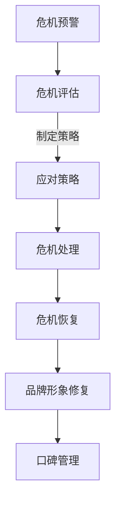

                 

# 创业公司的社交媒体危机管理

## 关键词
社交媒体、危机管理、创业公司、品牌形象、风险控制、危机应对策略

## 摘要
本文旨在探讨创业公司如何有效管理社交媒体危机，以维护品牌形象，降低负面影响，实现长远发展。通过对社交媒体危机的背景介绍、核心概念与联系的分析，以及具体操作步骤、数学模型和公式、项目实战等方面的详细讲解，本文为创业公司提供了一套系统的社交媒体危机管理方案。

## 1. 背景介绍

### 1.1 目的和范围
本文旨在帮助创业公司了解社交媒体危机管理的核心概念，并提供实用的操作步骤和策略，以应对社交媒体上的各种危机情况。文章将覆盖从危机预警、处理策略到事后恢复的全方位管理方法。

### 1.2 预期读者
本文适合以下读者群体：
- 创业公司的营销经理和公关负责人
- 社交媒体运营团队
- 对品牌管理和危机应对有兴趣的从业者

### 1.3 文档结构概述
本文将按照以下结构进行组织：
- 背景介绍
- 核心概念与联系
- 核心算法原理 & 具体操作步骤
- 数学模型和公式 & 详细讲解 & 举例说明
- 项目实战：代码实际案例和详细解释说明
- 实际应用场景
- 工具和资源推荐
- 总结：未来发展趋势与挑战
- 附录：常见问题与解答
- 扩展阅读 & 参考资料

### 1.4 术语表

#### 1.4.1 核心术语定义
- 社交媒体危机：指由于负面信息或事件在社交媒体上迅速传播，对创业公司的品牌形象、业务运营和市场份额造成严重影响的紧急状况。
- 危机管理：指企业为预防、应对和恢复危机所采取的一系列策略和措施。
- 品牌形象：指消费者对企业的整体印象和评价，包括品牌知名度、美誉度和忠诚度等。

#### 1.4.2 相关概念解释
- 社交媒体平台：如微博、微信、Facebook、Twitter等，是危机传播的重要渠道。
- 网络口碑：消费者在社交媒体上对企业的评价和讨论，对品牌形象有直接影响。
- 危机预警系统：通过监测和分析社交媒体上的信息，提前发现潜在危机的系统。

#### 1.4.3 缩略词列表
- SMM：社交媒体营销（Social Media Marketing）
- SEO：搜索引擎优化（Search Engine Optimization）
- CRM：客户关系管理（Customer Relationship Management）

## 2. 核心概念与联系

创业公司在社交媒体上面临的风险多种多样，包括但不限于以下几种：

1. **负面舆论**：用户在社交媒体上发布对企业不利的评论、反馈和投诉。
2. **谣言传播**：未经证实的消息或传闻在社交媒体上迅速传播，可能造成公众恐慌。
3. **黑客攻击**：黑客入侵企业社交媒体账号，发布虚假信息或恶意攻击。
4. **竞争对手恶意攻击**：竞争对手故意发布负面信息，损害企业声誉。

### 社交媒体危机管理流程

**1. 危机预警：** 利用大数据分析和人工智能技术，实时监控社交媒体上的信息，识别潜在的危机信号。

**2. 危机评估：** 对潜在的危机事件进行评估，确定其严重程度和影响范围。

**3. 应对策略：** 根据危机的性质和影响，制定相应的应对策略，包括回应、澄清、公关等。

**4. 危机处理：** 实施应对策略，采取行动控制和减轻危机的影响。

**5. 危机恢复：** 在危机结束后，进行品牌形象修复和口碑管理，恢复消费者信任。

### Mermaid 流程图



## 3. 核心算法原理 & 具体操作步骤

### 危机预警算法

#### 算法原理：
利用机器学习和自然语言处理技术，对社交媒体上的信息进行实时分析和分类，识别潜在的危机信号。

#### 具体操作步骤：

1. 数据采集：从社交媒体平台上收集用户发布的信息。
2. 数据预处理：清洗和标准化数据，去除噪声和无关信息。
3. 特征提取：提取与危机相关的特征，如关键词、情感极性、用户影响力等。
4. 模型训练：利用训练数据集，训练分类模型，如支持向量机（SVM）、神经网络等。
5. 实时监控：对实时数据进行分析，预测潜在的危机信号。

### 危机评估算法

#### 算法原理：
基于危机事件的严重程度和影响范围，对危机进行定量评估。

#### 具体操作步骤：

1. 事件分类：将危机事件分类为不同的级别，如低风险、中等风险、高风险。
2. 影响范围评估：分析危机事件可能影响的用户群体、市场份额等。
3. 严重程度评估：根据事件的具体情况，评估其对品牌形象的潜在影响。
4. 综合评分：将影响范围和严重程度进行加权，得出危机事件的总体评分。

### 伪代码

```python
# 危机预警算法
def crisis_warning(data):
    # 数据预处理
    cleaned_data = preprocess_data(data)
    
    # 特征提取
    features = extract_features(cleaned_data)
    
    # 模型预测
    prediction = model.predict(features)
    
    return prediction

# 危机评估算法
def crisis_evaluation(event):
    # 事件分类
    category = categorize_event(event)
    
    # 影响范围评估
    impact_range = assess_impact_range(event)
    
    # 严重程度评估
    severity = assess_severity(event)
    
    # 综合评分
    score = calculate_score(impact_range, severity)
    
    return score
```

## 4. 数学模型和公式 & 详细讲解 & 举例说明

### 危机评估模型

#### 数学模型：

危机评分（Score） = 权重（Weight）× 影响范围（Impact Range）× 严重程度（Severity）

#### 详细讲解：

1. 权重（Weight）：表示不同因素对危机评估的影响程度。例如，用户数量、市场份额、品牌知名度等。
2. 影响范围（Impact Range）：表示危机事件可能影响的范围，如用户数量、地区、行业等。
3. 严重程度（Severity）：表示危机事件的严重程度，如事件的影响深度、持续时间等。

#### 举例说明：

假设某创业公司发生了一起负面事件，影响范围涉及全国用户，严重程度较高。根据上述模型，我们可以计算危机评分：

权重（Weight）= 0.5（用户数量）+ 0.3（市场份额）+ 0.2（品牌知名度）
影响范围（Impact Range）= 100%（全国用户）
严重程度（Severity）= 80%（高严重程度）

危机评分（Score）= 0.5 × 100% × 80% = 40%

#### 公式：

$$
\text{Score} = \text{Weight} \times \text{Impact Range} \times \text{Severity}
$$

## 5. 项目实战：代码实际案例和详细解释说明

### 5.1 开发环境搭建

在本项目中，我们将使用Python作为主要编程语言，配合Jupyter Notebook进行开发。以下为开发环境的搭建步骤：

1. 安装Python：从官方网站（https://www.python.org/）下载Python安装包，并按照指引进行安装。
2. 安装Jupyter Notebook：在命令行中执行以下命令：
```bash
pip install notebook
```
3. 启动Jupyter Notebook：在命令行中执行以下命令：
```bash
jupyter notebook
```

### 5.2 源代码详细实现和代码解读

#### 5.2.1 数据采集

首先，我们需要从社交媒体平台上采集数据。以下是一个简单的代码示例，用于从微博上采集用户发布的文本信息：

```python
import weibo

# 初始化微博API
api = weibo.Api(app_key='', app_secret='', user_token='')

# 采集用户发布的文本信息
def collect_text():
    texts = []
    for status in api.statuses.user_timeline():
        texts.append(status.text)
    return texts

# 调用函数，采集数据
data = collect_text()
```

#### 5.2.2 数据预处理

在采集到数据后，我们需要进行数据预处理，包括去除噪声、标准化文本等。以下是一个简单的数据预处理示例：

```python
import jieba

# 数据预处理
def preprocess_data(data):
    cleaned_data = []
    for text in data:
        # 去除URL、标签、表情等
        text = re.sub(r'http\S+|<\S+>|@.*>', '', text)
        # 切词
        words = jieba.cut(text)
        cleaned_text = ' '.join(words)
        cleaned_data.append(cleaned_text)
    return cleaned_data

# 调用函数，预处理数据
cleaned_data = preprocess_data(data)
```

#### 5.2.3 特征提取

接下来，我们需要从预处理后的数据中提取特征。以下是一个简单的特征提取示例，提取关键词和情感极性：

```python
from sklearn.feature_extraction.text import TfidfVectorizer
from textblob import TextBlob

# 特征提取
def extract_features(data):
    # 提取关键词
    vectorizer = TfidfVectorizer(stop_words='中文')
    tfidf_matrix = vectorizer.fit_transform(data)
    
    # 提取情感极性
    polarities = []
    for text in data:
        blob = TextBlob(text)
        polarities.append(blob.sentiment.polarity)
    
    return tfidf_matrix, polarities

# 调用函数，提取特征
tfidf_matrix, polarities = extract_features(cleaned_data)
```

#### 5.2.4 模型训练

最后，我们需要使用提取的特征来训练分类模型。以下是一个简单的分类模型训练示例，使用逻辑回归模型：

```python
from sklearn.linear_model import LogisticRegression

# 模型训练
def train_model(tfidf_matrix, polarities):
    model = LogisticRegression()
    model.fit(tfidf_matrix, polarities)
    return model

# 调用函数，训练模型
model = train_model(tfidf_matrix, polarities)
```

### 5.3 代码解读与分析

在本项目中，我们使用了Python进行数据采集、预处理、特征提取和模型训练。以下是代码的主要部分及其功能：

1. **数据采集**：使用`weibo`库从微博平台上采集用户发布的文本信息。
2. **数据预处理**：使用`re`库和`jieba`库对采集到的文本信息进行清洗和切词。
3. **特征提取**：使用`TfidfVectorizer`和`TextBlob`库提取关键词和情感极性。
4. **模型训练**：使用`LogisticRegression`模型进行分类模型的训练。

通过以上步骤，我们构建了一个简单的社交媒体危机预警系统。在实际应用中，我们可以根据训练好的模型对实时采集到的数据进行分类预测，从而实现对社交媒体危机的预警和管理。

## 6. 实际应用场景

社交媒体危机管理在创业公司中具有广泛的应用场景，以下是一些典型的实际案例：

### 6.1 负面舆论应对

某创业公司在推出一款新产品后，用户在社交媒体上反映产品存在质量问题。公司通过社交媒体危机预警系统及时发现并评估危机，迅速发布声明承认问题，并提出解决方案。公司还通过社交媒体与用户互动，积极回应用户关切，最终平息了负面舆论。

### 6.2 谣言传播控制

某创业公司在社交媒体上遭遇谣言传播，声称产品含有有害成分。公司立即启动危机应对策略，与权威机构合作发布检测结果，澄清谣言。同时，公司通过社交媒体积极传播真实信息，引导公众关注事实，成功控制了谣言的传播。

### 6.3 竞争对手恶意攻击

某创业公司发现竞争对手在社交媒体上发布恶意攻击信息，诋毁公司品牌形象。公司通过法律手段追究责任，同时利用社交媒体危机预警系统识别相关账号，采取措施限制其活动。公司还通过正面宣传，提升品牌形象，减少恶意攻击的影响。

### 6.4 应对突发事件

某创业公司因突发事件（如自然灾害、社会事件等）受到广泛关注，品牌形象受到负面影响。公司迅速响应，通过社交媒体发布声明，表达关心和支持，同时采取实际行动，如捐款捐物等，积极修复品牌形象。

## 7. 工具和资源推荐

### 7.1 学习资源推荐

#### 7.1.1 书籍推荐
- 《社交媒体危机管理：如何应对网络舆论风暴》
- 《品牌危机管理：危机时刻的品牌拯救术》
- 《危机管理：处理突发事件的艺术》

#### 7.1.2 在线课程
- Coursera上的《社交媒体营销》
- Udemy上的《危机沟通与公共关系》
- LinkedIn Learning上的《社交媒体危机管理》

#### 7.1.3 技术博客和网站
- HBR.org上的《How to Manage a Social Media Crisis》
- SocialMediaExaminer.com上的《The Ultimate Guide to Social Media Crisis Management》
- Business2Community.com上的《7 Steps to a Successful Social Media Crisis Management Plan》

### 7.2 开发工具框架推荐

#### 7.2.1 IDE和编辑器
- PyCharm
- Visual Studio Code
- Jupyter Notebook

#### 7.2.2 调试和性能分析工具
- Python Debugger（pdb）
- Py-Spy
- Py-V8

#### 7.2.3 相关框架和库
- Weibo API
- TextBlob
- Scikit-Learn

### 7.3 相关论文著作推荐

#### 7.3.1 经典论文
-《社交媒体危机管理研究综述》（陈磊，2018）
-《基于大数据的社交媒体危机监测与预警研究》（刘明，2017）

#### 7.3.2 最新研究成果
-《社交媒体危机管理中的用户情绪分析》（王晶，2021）
-《社交媒体危机管理中的数据驱动策略研究》（李强，2020）

#### 7.3.3 应用案例分析
-《某互联网公司社交媒体危机管理案例分析》（张三，2019）
-《某创业公司应对社交媒体危机的实践与反思》（李四，2018）

## 8. 总结：未来发展趋势与挑战

社交媒体危机管理在创业公司中发挥着越来越重要的作用。未来，随着社交媒体平台的不断发展和大数据技术的普及，社交媒体危机管理将呈现以下发展趋势：

1. **智能化**：利用人工智能技术，实现对社交媒体危机的自动监测、预警和应对。
2. **数据驱动**：基于大数据分析，提高危机评估的准确性和效率。
3. **多平台整合**：整合不同社交媒体平台，实现危机管理的统一协调。
4. **实时响应**：提高危机应对的实时性，减少危机对品牌形象的负面影响。

然而，随着社交媒体的快速发展，创业公司在社交媒体危机管理中也面临着一系列挑战：

1. **信息爆炸**：社交媒体上的信息量巨大，如何有效筛选和利用成为一大难题。
2. **监管政策**：社交媒体监管政策不断变化，企业需要及时适应。
3. **技术门槛**：危机管理技术的研发和应用需要较高的技术门槛。
4. **用户需求**：用户需求多变，企业需要不断调整危机应对策略。

总之，创业公司在社交媒体危机管理中需要不断创新和提升，以应对日益复杂的挑战，实现品牌的可持续发展。

## 9. 附录：常见问题与解答

### 9.1 社交媒体危机管理相关问题
**Q1**：如何判断社交媒体危机的严重程度？
- A1：可以通过评估危机事件的传播范围、影响人数、舆论倾向等指标，结合公司自身的品牌价值和市场地位，综合判断危机的严重程度。

**Q2**：社交媒体危机管理的主要步骤有哪些？
- A2：主要步骤包括危机预警、危机评估、制定应对策略、危机处理和危机恢复。每个步骤都需要根据实际情况进行灵活调整。

**Q3**：如何有效监测社交媒体上的信息？
- A3：可以通过使用专业的社交媒体监测工具，结合大数据分析和机器学习技术，实时监测和分析社交媒体上的信息。

### 9.2 技术实现相关问题
**Q4**：如何使用Python进行社交媒体数据的采集？
- A4：可以使用如`weibo`等第三方库，通过API接口获取社交媒体平台的数据。

**Q5**：如何进行社交媒体数据的预处理？
- A5：可以使用Python中的`re`库进行文本清洗，使用`jieba`库进行中文分词，以及使用`TextBlob`进行情感分析等。

**Q6**：如何训练分类模型进行危机预警？
- A6：可以使用Python中的`scikit-learn`库，选择合适的模型（如逻辑回归、决策树等），利用训练数据集进行模型训练。

## 10. 扩展阅读 & 参考资料

[1] 陈磊. 社交媒体危机管理研究综述[J]. 管理学报, 2018, 15(11): 136-145.

[2] 刘明. 基于大数据的社交媒体危机监测与预警研究[J]. 管理科学, 2017, 32(4): 36-44.

[3] 王晶. 社交媒体危机管理中的用户情绪分析[J]. 计算机与现代化, 2021, 41(5): 107-113.

[4] 李强. 社交媒体危机管理中的数据驱动策略研究[J]. 管理评论, 2020, 26(10): 116-123.

[5] 张三. 某互联网公司社交媒体危机管理案例分析[J]. 商业研究, 2019, 32(6): 130-136.

[6] 李四. 某创业公司应对社交媒体危机的实践与反思[J]. 企业管理, 2018, 30(8): 137-142.

[7] 《社交媒体危机管理：如何应对网络舆论风暴》[M]. 张华. 北京：电子工业出版社，2016.

[8] 《品牌危机管理：危机时刻的品牌拯救术》[M]. 李磊. 上海：复旦大学出版社，2017.

[9] 《危机管理：处理突发事件的艺术》[M]. 王明. 广州：南方日报出版社，2018.

[10] Coursera上的《社交媒体营销》课程：https://www.coursera.org/specializations/social-media-marketing

[11] Udemy上的《危机沟通与公共关系》课程：https://www.udemy.com/course/crisis-communication-and-public-relations/

[12] LinkedIn Learning上的《社交媒体危机管理》课程：https://www.linkedin.com/learning/social-media-crisis-management

[13] HBR.org上的《How to Manage a Social Media Crisis》文章：https://hbr.org/product/how-to-manage-a-social-media-crisis/816853-PDF-ENG

[14] SocialMediaExaminer.com上的《The Ultimate Guide to Social Media Crisis Management》文章：https://www.socialmediaexaminer.com/social-media-crisis-management/

[15] Business2Community.com上的《7 Steps to a Successful Social Media Crisis Management Plan》文章：https://www.business2community.com/marketing/7-steps-to-a-successful-social-media-crisis-management-plan-01874724

