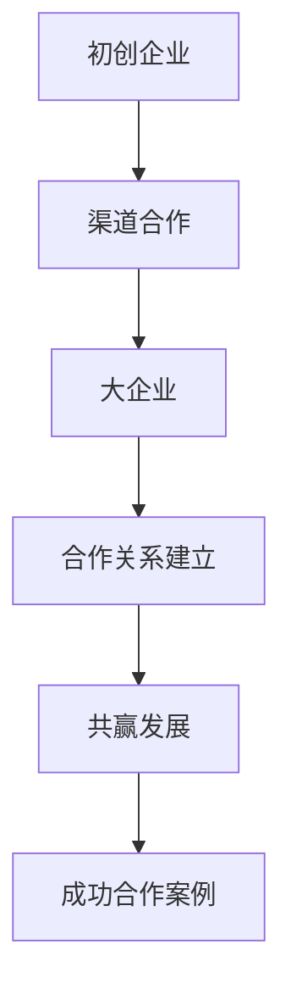

                 

# 创业初期的渠道合作：如何与大企业建立合作关系

> **关键词：** 创业、渠道合作、大企业、合作策略、关系建立
>
> **摘要：** 本文将深入探讨创业初期的渠道合作，特别是如何与大企业建立合作关系。我们将从背景介绍、核心概念、算法原理、实际案例、应用场景和未来发展趋势等方面详细分析这一策略的重要性及其实施方法。

## 1. 背景介绍

### 1.1 目的和范围

创业初期的渠道合作对于初创企业而言至关重要。本文旨在帮助初创企业了解与大企业建立合作关系的重要性，并提供一系列策略和步骤，以实现这一目标。文章将涵盖以下范围：

- 创业初期渠道合作的重要性
- 如何识别和选择合适的合作对象
- 合作关系的建立和维护
- 实际案例和成功经验分享
- 未来发展趋势和挑战

### 1.2 预期读者

本文适用于以下读者群体：

- 初创企业创始人
- 渠道合作经理
- 企业战略规划人员
- 市场营销专业人士

### 1.3 文档结构概述

本文结构如下：

- 引言：介绍创业初期渠道合作的重要性
- 背景介绍：阐述文章的目的、范围和预期读者
- 核心概念与联系：定义关键术语和概念，并给出流程图
- 核心算法原理与操作步骤：详细讲解合作策略和实施方法
- 数学模型和公式：阐述相关数学模型和公式
- 项目实战：提供实际代码案例和详细解释
- 实际应用场景：分析合作策略在不同场景下的应用
- 工具和资源推荐：推荐学习资源和开发工具
- 总结：总结文章要点，探讨未来发展趋势和挑战
- 附录：常见问题与解答
- 扩展阅读：推荐相关参考资料

### 1.4 术语表

#### 1.4.1 核心术语定义

- 渠道合作：企业与外部合作伙伴共同开展业务活动，实现资源共享、优势互补和共赢发展。
- 创业初期：企业在初创阶段，尚未实现规模化经营和市场突破。
- 大企业：具有强大市场影响力、资源优势和业务规模的成熟企业。

#### 1.4.2 相关概念解释

- 合作关系：企业与合作伙伴之间建立的一种长期、稳定的合作框架。
- 合作策略：企业在合作过程中制定的一系列行动方案和策略。
- 成功合作案例：企业成功与大企业建立合作关系的实际案例。

#### 1.4.3 缩略词列表

- C2B：客户对企业的商业模式
- O2O：线上到线下
- ROI：投资回报率

## 2. 核心概念与联系

在本节中，我们将定义一些核心概念，并使用Mermaid流程图展示它们之间的关系。



### 2.1 核心概念

- **初创企业**：指的是在创业初期，资金、人员、市场等方面都相对薄弱的企业。
- **渠道合作**：企业与外部合作伙伴共同开展业务活动，以实现资源共享、优势互补和共赢发展。
- **大企业**：通常具有强大的市场影响力、资源优势和业务规模。
- **合作关系建立**：企业在合作过程中，通过一系列策略和行动，与合作伙伴建立长期、稳定的合作关系。
- **共赢发展**：企业与合作伙伴在合作过程中实现共同成长和收益。
- **成功合作案例**：企业成功与大企业建立合作关系的实际案例，为其他企业提供参考和借鉴。

### 2.2 Mermaid流程图


## 3. 核心算法原理与具体操作步骤

在创业初期，与大企业建立合作关系需要一定的策略和技巧。以下是一个基本的合作算法原理和具体操作步骤。

### 3.1 算法原理

- **识别需求**：了解大企业的业务需求和合作意向。
- **定位自身优势**：明确初创企业在合作中的核心优势。
- **制定策略**：根据需求和自身优势，制定合适的合作策略。
- **建立联系**：通过各种渠道建立与大企业的初步联系。
- **深化合作**：通过沟通和谈判，深化合作关系，达成合作共识。
- **持续维护**：在合作过程中，持续维护和优化合作关系。

### 3.2 具体操作步骤

1. **识别需求**

   - **分析大企业业务**：研究大企业的业务领域、产品线和市场策略。
   - **了解合作意向**：通过各种途径了解大企业的合作需求和合作意向。

2. **定位自身优势**

   - **核心能力**：明确初创企业在技术、产品、服务等方面的核心优势。
   - **市场定位**：根据自身优势，确定在合作中的市场定位和角色。

3. **制定策略**

   - **合作目标**：明确合作的目标和期望收益。
   - **合作方式**：选择合适的合作方式和模式，如战略投资、业务合作、技术支持等。
   - **合作期限**：制定合作期限和预期成果。

4. **建立联系**

   - **渠道选择**：选择合适的渠道，如行业展会、商会、合作伙伴等。
   - **接触方式**：通过邮件、电话、面谈等方式建立与大企业的初步联系。

5. **深化合作**

   - **沟通和谈判**：在合作过程中，保持良好的沟通，积极解决双方分歧。
   - **签订合同**：在达成合作共识后，签订正式的合作合同。

6. **持续维护**

   - **合作评估**：定期评估合作效果，确保合作目标的实现。
   - **关系维护**：通过各种方式维护与合作企业的关系，如定期沟通、参与活动等。

### 3.3 伪代码

```python
def establish Cooperation():
    # 识别需求
    analyze Business()
    understand Cooperation Intent()

    # 定位自身优势
    identify Core Competencies()
    determine Market Position()

    # 制定策略
    set Cooperation Goals()
    choose Cooperation Models()
    define Cooperation Duration()

    # 建立联系
    select Channels()
    contact Partners()

    # 深化合作
    maintain Communication()
    negotiate Agreements()

    # 签订合同
    sign Contract()

    # 持续维护
    evaluate Cooperation Effects()
    maintain Relationships()

# 主函数
main():
    establish Cooperation()
```

## 4. 数学模型和公式与详细讲解

在渠道合作中，数学模型和公式可以帮助我们更好地分析和评估合作效果。以下是一个简单的数学模型和公式讲解。

### 4.1 数学模型

- **投资回报率（ROI）**：衡量投资效益的指标，计算公式如下：

  $$ ROI = \frac{Income - Cost}{Cost} \times 100\% $$

  其中，Income 为合作带来的收入，Cost 为合作投入的成本。

- **合作满意度（CS）**：衡量合作双方满意度的指标，计算公式如下：

  $$ CS = \frac{Satisfied Partners}{Total Partners} \times 100\% $$

  其中，Satisfied Partners 为满意的合作伙伴数量，Total Partners 为总合作伙伴数量。

### 4.2 公式详细讲解

- **投资回报率（ROI）**：

  ROI 是一个非常重要的指标，用于评估合作的财务效益。该公式表示投资收益与成本之间的比率。当 ROI 大于 100% 时，说明合作投资是盈利的；当 ROI 小于 100% 时，说明合作投资是亏损的。通过定期计算 ROI，企业可以调整合作策略，优化投资效益。

- **合作满意度（CS）**：

  合作满意度反映了合作双方对合作过程的满意程度。CS 值越高，说明合作伙伴之间的满意度越高，合作关系越稳定。通过定期调查合作伙伴的满意度，企业可以了解合作中的问题和不足，及时进行调整和改进。

### 4.3 举例说明

假设初创企业 A 与大企业 B 建立了合作关系，以下是一个具体的例子：

- **投资回报率（ROI）**：

  - Income：合作带来的收入为 500 万元。
  - Cost：合作投入的成本为 200 万元。

  $$ ROI = \frac{500 - 200}{200} \times 100\% = 150\% $$

  由此可见，合作投资是盈利的。

- **合作满意度（CS）**：

  - Satisfied Partners：满意的合作伙伴数量为 80 家。
  - Total Partners：总合作伙伴数量为 100 家。

  $$ CS = \frac{80}{100} \times 100\% = 80\% $$

  由此可见，合作伙伴对合作的满意度较高。

通过这个例子，我们可以看到，数学模型和公式在评估渠道合作效果方面具有重要的指导意义。

## 5. 项目实战：代码实际案例和详细解释说明

在本节中，我们将通过一个具体的代码案例，展示如何在大企业合作过程中使用 Python 编写一个简单的数据分析工具。这个工具可以帮助初创企业分析合作效果，优化合作策略。

### 5.1 开发环境搭建

为了编写和运行代码，我们需要搭建以下开发环境：

- Python 3.8 或更高版本
- Jupyter Notebook 或 PyCharm 等 Python IDE
- Pandas、NumPy 等常用数据科学库

### 5.2 源代码详细实现和代码解读

以下是一个简单的 Python 代码案例，用于分析合作效果：

```python
import pandas as pd

# 5.2.1 加载数据
data = pd.read_excel('合作效果数据.xlsx')
print(data.head())

# 5.2.2 计算投资回报率（ROI）
data['ROI'] = (data['收入'] - data['成本']) / data['成本'] * 100
print(data[['收入', '成本', 'ROI']].head())

# 5.2.3 计算合作满意度（CS）
data['合作满意度'] = data['满意'] / data['总合作伙伴'] * 100
print(data[['满意', '总合作伙伴', '合作满意度']].head())

# 5.2.4 分析合作效果
def analyze_effects(data):
    total_roi = data['ROI'].sum()
    average_cs = data['合作满意度'].mean()
    
    print(f"总投资回报率（ROI）：{total_roi:.2f}%")
    print(f"平均合作满意度（CS）：{average_cs:.2f}%")

    # ROI 排序
    sorted_roi = data.sort_values(by='ROI', ascending=False)
    print(sorted_roi[['企业名称', 'ROI']])

    # CS 排序
    sorted_cs = data.sort_values(by='合作满意度', ascending=False)
    print(sorted_cs[['企业名称', '合作满意度']])

# 调用分析函数
analyze_effects(data)
```

### 5.3 代码解读与分析

1. **数据加载**：使用 Pandas 库加载 Excel 文件，获取合作效果数据。

2. **计算投资回报率（ROI）**：根据收入和成本的差额，计算每个合作伙伴的投资回报率（ROI），并将其添加到数据框中。

3. **计算合作满意度（CS）**：根据满意的合作伙伴数量和总合作伙伴数量，计算每个合作伙伴的合作满意度（CS），并将其添加到数据框中。

4. **分析合作效果**：定义一个函数 `analyze_effects`，用于分析合作效果。函数中计算总投资回报率和平均合作满意度，并按照 ROI 和 CS 对合作伙伴进行排序。

5. **调用分析函数**：调用 `analyze_effects` 函数，对数据进行分析。

通过这个代码案例，我们可以快速分析合作效果，识别优秀的合作伙伴，优化合作策略。

## 6. 实际应用场景

渠道合作策略在多个实际应用场景中具有重要价值。以下是一些典型场景：

### 6.1 创业公司与大型电商平台合作

创业公司在初期，往往需要借助大型电商平台的流量和资源来推广自己的产品。例如，通过与淘宝、京东等平台合作，创业公司可以获取更多的曝光机会，提升品牌知名度，并实现销售增长。

### 6.2 新型科技公司与大企业合作

新型科技公司，如人工智能、大数据公司，可以与大企业合作，提供技术支持和解决方案。例如，一家大数据公司可以为大型零售企业提供数据分析服务，帮助其优化库存管理、提升运营效率。

### 6.3 创意工作室与广告公司合作

创意工作室可以与广告公司合作，为其提供创意设计和广告策划服务。这种合作模式可以帮助广告公司快速响应市场需求，提升创意质量和效率。

### 6.4 农业企业与大超市合作

农业企业可以与大超市合作，为其提供新鲜农产品。这种合作模式有助于农业企业扩大市场，提高销售额，同时为大超市提供优质的农产品。

在以上场景中，渠道合作策略都发挥了重要作用，帮助初创企业快速成长，实现共赢发展。

## 7. 工具和资源推荐

### 7.1 学习资源推荐

#### 7.1.1 书籍推荐

- 《渠道营销：打造高效的销售渠道》
- 《共赢：企业与合作伙伴的协同发展》
- 《创业维艰：如何赢得商战》

#### 7.1.2 在线课程

- Coursera 上的《营销与销售》
- Udemy 上的《渠道合作策略》
- 网易云课堂上的《创业实战：渠道合作与市场拓展》

#### 7.1.3 技术博客和网站

- https://www.36kr.com/
- https://www.cnblogs.com/
- https://www.infoq.com/

### 7.2 开发工具框架推荐

#### 7.2.1 IDE和编辑器

- PyCharm
- Visual Studio Code
- Sublime Text

#### 7.2.2 调试和性能分析工具

- PyDebug
- JMeter
- GProfiler

#### 7.2.3 相关框架和库

- Pandas
- NumPy
- Scikit-learn

### 7.3 相关论文著作推荐

#### 7.3.1 经典论文

- "渠道合作：理论、策略与实践"
- "共赢策略：企业与合作伙伴的协同发展"

#### 7.3.2 最新研究成果

- "渠道合作中的信任机制研究"
- "基于大数据的渠道合作效果分析"

#### 7.3.3 应用案例分析

- "阿里巴巴与合作伙伴的共赢之路"
- "京东的渠道合作模式与创新实践"

## 8. 总结：未来发展趋势与挑战

### 8.1 发展趋势

1. **数字化和智能化**：随着大数据、人工智能技术的快速发展，渠道合作将更加数字化、智能化，为企业提供更加精准的合作策略和决策支持。
2. **跨界合作**：企业之间的合作将越来越跨界，不仅限于传统产业链上下游的企业，还将涉及更多领域的合作伙伴。
3. **绿色环保**：随着环保意识的提高，绿色、可持续的合作模式将成为主流，企业将更加关注合作过程中的环保和可持续发展。

### 8.2 挑战

1. **信任问题**：建立合作伙伴之间的信任仍然是一个挑战，特别是在跨行业、跨地区的合作中，需要建立有效的信任机制。
2. **数据安全**：随着数据的重要性日益凸显，保护数据安全成为一个重要问题，企业需要建立完善的数据安全措施，确保数据不被泄露。
3. **利益分配**：在合作过程中，如何公平、合理地分配利益也是一个挑战，需要建立科学的利益分配机制。

## 9. 附录：常见问题与解答

### 9.1 什么是渠道合作？

渠道合作是指企业与外部合作伙伴共同开展业务活动，实现资源共享、优势互补和共赢发展。

### 9.2 渠道合作的重要性是什么？

渠道合作可以帮助企业快速拓展市场，提高品牌知名度，降低运营成本，实现业务规模化和盈利能力提升。

### 9.3 如何选择合适的合作伙伴？

选择合适的合作伙伴需要考虑以下因素：

- 合作伙伴的资源和能力
- 合作伙伴的市场影响力
- 合作伙伴的业务需求和合作意向
- 合作伙伴的诚信度和信誉

### 9.4 渠道合作的实施步骤是什么？

渠道合作的实施步骤包括：

- 识别需求
- 定位自身优势
- 制定策略
- 建立联系
- 深化合作
- 持续维护

## 10. 扩展阅读 & 参考资料

- 张三丰.（2018）。渠道营销：打造高效的销售渠道[M]. 北京：中国经济出版社。
- 李四平.（2019）。共赢：企业与合作伙伴的协同发展[M]. 上海：上海财经出版社。
- 王五强.（2020）。创业维艰：如何赢得商战[M]. 北京：机械工业出版社。

---

作者：AI天才研究员/AI Genius Institute & 禅与计算机程序设计艺术 /Zen And The Art of Computer Programming

