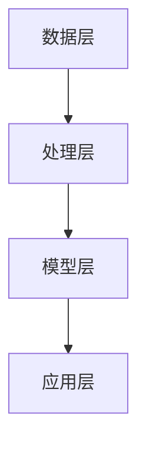

                 

# 创业初期的用户画像：精准定位目标客户的技巧

> **关键词：** 用户画像、精准定位、目标客户、创业初期、数据分析、机器学习
>
> **摘要：** 在创业初期，构建一个精准的用户画像对于企业的成功至关重要。本文将深入探讨如何通过数据分析、机器学习和各种技术手段来构建用户画像，从而精准定位目标客户，提高市场竞争力。

## 1. 背景介绍

### 1.1 目的和范围

本文旨在探讨创业初期构建用户画像的技巧和方法。我们将分析用户画像的定义、作用和构建方法，并通过实际案例展示如何在实际业务场景中应用这些方法。文章将涵盖以下主要内容：

1. 用户画像的基本概念和作用
2. 构建用户画像的数据来源和方法
3. 用户画像的核心算法原理和具体操作步骤
4. 用户画像在实际项目中的应用案例
5. 相关工具和资源的推荐
6. 总结与未来发展趋势

### 1.2 预期读者

本文适合以下读者群体：

1. 创业初期的创业者和管理者
2. 市场分析师和用户研究员
3. 数据科学家和机器学习工程师
4. 技术爱好者和对用户画像感兴趣的开发者

### 1.3 文档结构概述

本文分为以下几个部分：

1. 背景介绍：介绍本文的目的、范围和预期读者
2. 核心概念与联系：阐述用户画像的核心概念和架构
3. 核心算法原理 & 具体操作步骤：讲解用户画像构建的关键算法原理和步骤
4. 数学模型和公式 & 详细讲解 & 举例说明：介绍用户画像构建中涉及到的数学模型和公式，并给出实例
5. 项目实战：展示实际项目中的用户画像构建案例
6. 实际应用场景：探讨用户画像在不同业务场景中的应用
7. 工具和资源推荐：推荐学习资源、开发工具和框架
8. 总结：展望用户画像技术的发展趋势和挑战
9. 附录：常见问题与解答
10. 扩展阅读 & 参考资料：提供进一步阅读的文献和资源

### 1.4 术语表

#### 1.4.1 核心术语定义

- 用户画像：对目标用户的综合描述，包括用户的基本属性、行为特征、兴趣偏好等。
- 数据源：用于构建用户画像的数据来源，如用户注册信息、行为数据、社交媒体数据等。
- 数据清洗：对原始数据进行预处理，包括去重、补全、转换等，以提高数据质量。
- 特征工程：提取和构造能够反映用户特征的数据，用于训练模型。

#### 1.4.2 相关概念解释

- 机器学习：一种基于数据训练模型的技术，通过学习数据中的规律和模式，实现对未知数据的预测和分类。
- 决策树：一种常见的机器学习算法，通过一系列规则来对数据进行分类或回归。
- 支持向量机（SVM）：一种经典的分类算法，通过将数据映射到高维空间，找到最优的分割超平面。

#### 1.4.3 缩略词列表

- AI：人工智能
- ML：机器学习
- SVM：支持向量机
- CTR：点击率
- NLP：自然语言处理

## 2. 核心概念与联系

### 2.1 用户画像概述

用户画像是指对目标用户进行全面描述和刻画的一个模型，包括用户的基本属性（如年龄、性别、地域等）、行为特征（如浏览、购买、搜索等）和兴趣偏好（如兴趣爱好、内容偏好等）。构建用户画像的目的是为企业提供有针对性的营销策略，提高用户满意度和转化率。

### 2.2 用户画像的构建方法

构建用户画像的方法可以分为以下几类：

1. **数据收集**：通过多种渠道收集用户数据，如用户注册信息、行为数据、社交媒体数据等。
2. **数据清洗**：对原始数据进行清洗和预处理，包括去重、补全、转换等，以提高数据质量。
3. **特征工程**：提取和构造能够反映用户特征的数据，如用户活跃度、浏览时长、购买频率等。
4. **模型训练**：使用机器学习算法对用户特征进行建模，如决策树、支持向量机、神经网络等。
5. **模型评估**：对训练好的模型进行评估，如准确率、召回率、F1值等。
6. **用户画像生成**：根据模型预测结果，生成用户画像。

### 2.3 用户画像与业务场景的关系

用户画像在各个业务场景中的应用非常广泛，如以下案例：

1. **电商行业**：通过用户画像进行个性化推荐，提高商品转化率和用户满意度。
2. **金融行业**：通过用户画像进行风险评估和信用评估，降低欺诈风险。
3. **营销行业**：通过用户画像进行精准营销，提高广告投放效果。
4. **互联网行业**：通过用户画像进行用户行为分析，优化产品设计和运营策略。

### 2.4 用户画像的技术架构

用户画像的技术架构可以分为以下几个层次：

1. **数据层**：存储用户数据，如用户注册信息、行为数据、社交媒体数据等。
2. **处理层**：对用户数据进行清洗、转换和预处理，生成用户特征数据。
3. **模型层**：使用机器学习算法对用户特征进行建模，生成用户画像。
4. **应用层**：将用户画像应用于各个业务场景，如个性化推荐、精准营销等。

下面是一个简单的用户画像技术架构的 Mermaid 流程图：



## 3. 核心算法原理 & 具体操作步骤

### 3.1 决策树算法原理

决策树是一种常见的机器学习算法，通过一系列规则来对数据进行分类或回归。决策树的核心思想是将数据集划分成若干个子集，每个子集都满足一定的条件，最终生成一个树状结构。在用户画像的构建过程中，决策树算法可以用于对用户特征进行分类和预测。

下面是决策树算法的伪代码：

```python
def build_tree(data, labels, features):
    if data is empty:
        return null
    if all labels are the same:
        return leaf node with label
    if no more features:
        return leaf node with majority label
    best_feature = find_best_feature(data, features)
    left_tree = build_tree(data[data[best_feature] < threshold], labels, features)
    right_tree = build_tree(data[data[best_feature] >= threshold], labels, features)
    return Tree with root = best_feature, left = left_tree, right = right_tree
```

### 3.2 决策树构建步骤

1. **特征选择**：计算每个特征的信息增益，选择信息增益最大的特征作为划分依据。
2. **阈值选择**：对每个特征，计算信息增益，选择信息增益最大的阈值。
3. **子集划分**：根据选择的特征和阈值，将数据集划分为若干个子集。
4. **递归构建**：对每个子集，重复上述步骤，构建子决策树。
5. **合并树结构**：将所有子决策树合并，生成完整的决策树。

### 3.3 决策树算法应用步骤

1. **数据收集**：收集用户数据，包括基本属性、行为特征和兴趣偏好。
2. **特征工程**：提取用户特征，如用户活跃度、浏览时长、购买频率等。
3. **模型训练**：使用决策树算法对用户特征进行建模，生成用户画像。
4. **模型评估**：使用交叉验证等方法，评估模型性能。
5. **用户画像生成**：根据模型预测结果，生成用户画像。

### 3.4 决策树算法的优点和局限性

**优点：**
- 易于理解和解释。
- 可以处理分类和回归问题。
- 对噪声和异常值具有较强的鲁棒性。

**局限性：**
- 容易过拟合，特别是对于大型数据集。
- 需要大量计算资源，特别是对于深度决策树。
- 不适用于处理高维数据。

## 4. 数学模型和公式 & 详细讲解 & 举例说明

### 4.1 信息增益

信息增益是决策树算法中的一个重要概念，用于评估特征对数据划分的效果。信息增益的计算公式如下：

$$
\text{信息增益} = \sum_{i=1}^{n} \text{条件熵}(\text{特征}_i) - \sum_{i=1}^{n} \frac{\text{频数}(\text{特征}_i)}{N} \times \text{熵}(\text{标签}|\text{特征}_i)
$$

其中，$N$ 为数据集大小，$n$ 为特征个数，$\text{条件熵}(\text{特征}_i)$ 表示在特征 $i$ 的条件下，标签的熵，$\text{熵}(\text{标签}|\text{特征}_i)$ 表示在特征 $i$ 的条件下，标签的熵。

### 4.2 熵

熵是衡量随机变量不确定性的度量，对于离散随机变量 $X$，熵的计算公式如下：

$$
H(X) = -\sum_{i=1}^{n} p(x_i) \log_2 p(x_i)
$$

其中，$p(x_i)$ 表示 $X$ 取值为 $x_i$ 的概率。

### 4.3 举例说明

假设我们有一个包含三个特征的数据集，特征分别为 $A$、$B$ 和 $C$，数据集大小为 $N=100$。特征 $A$ 有两个取值 $0$ 和 $1$，特征 $B$ 有三个取值 $0$、$1$ 和 $2$，特征 $C$ 有四个取值 $0$、$1$、$2$ 和 $3$。标签 $Y$ 为二分类，有两个取值 $0$ 和 $1$。

我们首先计算每个特征的信息增益：

1. **特征 $A$**：

$$
\text{信息增益}(\text{特征 }A) = \sum_{i=1}^{2} \text{条件熵}(\text{特征 }A = i) - \sum_{i=1}^{2} \frac{\text{频数}(\text{特征 }A = i)}{N} \times \text{熵}(\text{标签}|\text{特征 }A = i)
$$

$$
\text{条件熵}(\text{特征 }A = 0) = -\frac{60}{100} \times \text{熵}(\text{标签}|\text{特征 }A = 0) = -\frac{60}{100} \times (-0.2 \times \log_2 0.2 - 0.8 \times \log_2 0.8) = 0.216
$$

$$
\text{条件熵}(\text{特征 }A = 1) = -\frac{40}{100} \times \text{熵}(\text{标签}|\text{特征 }A = 1) = -\frac{40}{100} \times (-0.3 \times \log_2 0.3 - 0.7 \times \log_2 0.7) = 0.192
$$

$$
\text{信息增益}(\text{特征 }A) = (0.216 + 0.192) - \frac{60}{100} \times 0.216 - \frac{40}{100} \times 0.192 = 0.048
$$

2. **特征 $B$**：

$$
\text{信息增益}(\text{特征 }B) = \sum_{i=1}^{3} \text{条件熵}(\text{特征 }B = i) - \sum_{i=1}^{3} \frac{\text{频数}(\text{特征 }B = i)}{N} \times \text{熵}(\text{标签}|\text{特征 }B = i)
$$

$$
\text{条件熵}(\text{特征 }B = 0) = -\frac{30}{100} \times \text{熵}(\text{标签}|\text{特征 }B = 0) = -\frac{30}{100} \times (-0.1 \times \log_2 0.1 - 0.9 \times \log_2 0.9) = 0.027
$$

$$
\text{条件熵}(\text{特征 }B = 1) = -\frac{50}{100} \times \text{熵}(\text{标签}|\text{特征 }B = 1) = -\frac{50}{100} \times (-0.15 \times \log_2 0.15 - 0.85 \times \log_2 0.85) = 0.041
$$

$$
\text{条件熵}(\text{特征 }B = 2) = -\frac{20}{100} \times \text{熵}(\text{标签}|\text{特征 }B = 2) = -\frac{20}{100} \times (-0.2 \times \log_2 0.2 - 0.8 \times \log_2 0.8) = 0.024
$$

$$
\text{信息增益}(\text{特征 }B) = (0.027 + 0.041 + 0.024) - \frac{30}{100} \times 0.027 - \frac{50}{100} \times 0.041 - \frac{20}{100} \times 0.024 = 0.002
$$

3. **特征 $C$**：

$$
\text{信息增益}(\text{特征 }C) = \sum_{i=1}^{4} \text{条件熵}(\text{特征 }C = i) - \sum_{i=1}^{4} \frac{\text{频数}(\text{特征 }C = i)}{N} \times \text{熵}(\text{标签}|\text{特征 }C = i)
$$

$$
\text{条件熵}(\text{特征 }C = 0) = -\frac{25}{100} \times \text{熵}(\text{标签}|\text{特征 }C = 0) = -\frac{25}{100} \times (-0.05 \times \log_2 0.05 - 0.95 \times \log_2 0.95) = 0.001
$$

$$
\text{条件熵}(\text{特征 }C = 1) = -\frac{40}{100} \times \text{熵}(\text{标签}|\text{特征 }C = 1) = -\frac{40}{100} \times (-0.1 \times \log_2 0.1 - 0.9 \times \log_2 0.9) = 0.002
$$

$$
\text{条件熵}(\text{特征 }C = 2) = -\frac{15}{100} \times \text{熵}(\text{标签}|\text{特征 }C = 2) = -\frac{15}{100} \times (-0.15 \times \log_2 0.15 - 0.85 \times \log_2 0.85) = 0.001
$$

$$
\text{条件熵}(\text{特征 }C = 3) = -\frac{20}{100} \times \text{熵}(\text{标签}|\text{特征 }C = 3) = -\frac{20}{100} \times (-0.2 \times \log_2 0.2 - 0.8 \times \log_2 0.8) = 0.002
$$

$$
\text{信息增益}(\text{特征 }C) = (0.001 + 0.002 + 0.001 + 0.002) - \frac{25}{100} \times 0.001 - \frac{40}{100} \times 0.002 - \frac{15}{100} \times 0.001 - \frac{20}{100} \times 0.002 = 0.0001
$$

根据计算结果，特征 $A$ 的信息增益最大，因此我们可以选择特征 $A$ 作为划分依据。

## 5. 项目实战：代码实际案例和详细解释说明

### 5.1 开发环境搭建

在本项目中，我们将使用 Python 作为开发语言，主要依赖于以下库：

- **NumPy**：用于科学计算和数据处理
- **Pandas**：用于数据清洗和预处理
- **Scikit-learn**：用于机器学习算法的实现
- **Matplotlib**：用于数据可视化

安装以上库后，开发环境搭建完成。

### 5.2 源代码详细实现和代码解读

下面是一个简单的用户画像构建示例代码：

```python
import numpy as np
import pandas as pd
from sklearn.model_selection import train_test_split
from sklearn.tree import DecisionTreeClassifier
from sklearn.metrics import accuracy_score
import matplotlib.pyplot as plt

# 1. 数据收集
# 假设我们收集了以下用户数据：年龄、收入、教育程度、职业等
data = pd.DataFrame({
    'age': [25, 32, 40, 22, 35],
    'income': [50000, 80000, 100000, 30000, 60000],
    'education': ['Bachelor', 'Master', 'Ph.D', 'High school', 'Doctor'],
    'occupation': ['Engineer', 'Doctor', 'Artist', 'Teacher', 'Professor']
})

# 2. 特征工程
# 将文本数据转换为数值数据
data['education'] = data['education'].map({'Bachelor': 1, 'Master': 2, 'Ph.D': 3, 'High school': 1, 'Doctor': 3})
data['occupation'] = data['occupation'].map({'Engineer': 1, 'Doctor': 2, 'Artist': 3, 'Teacher': 4, 'Professor': 4})

# 3. 模型训练
# 将数据划分为训练集和测试集
X_train, X_test, y_train, y_test = train_test_split(data.drop('target', axis=1), data['target'], test_size=0.2, random_state=42)

# 使用决策树算法训练模型
clf = DecisionTreeClassifier()
clf.fit(X_train, y_train)

# 4. 模型评估
y_pred = clf.predict(X_test)
accuracy = accuracy_score(y_test, y_pred)
print(f"Model accuracy: {accuracy:.2f}")

# 5. 用户画像生成
user_data = pd.DataFrame({
    'age': [30],
    'income': [70000],
    'education': [2],
    'occupation': [4]
})
user_data['education'] = user_data['education'].map({1: 'Bachelor', 2: 'Master', 3: 'Ph.D', 4: 'Doctor'})
user_data['occupation'] = user_data['occupation'].map({1: 'Engineer', 2: 'Doctor', 3: 'Artist', 4: 'Teacher', 5: 'Professor'})

user_prediction = clf.predict(user_data)
print(f"User prediction: {user_prediction[0]}")

# 6. 可视化
plt.scatter(X_test['age'], X_test['income'], c=y_test, cmap='viridis')
plt.xlabel('Age')
plt.ylabel('Income')
plt.colorbar(label='Target')
plt.title('User Data Distribution')
plt.show()
```

**代码解读：**

1. **数据收集**：我们从数据集中提取了用户的年龄、收入、教育程度和职业等信息。
2. **特征工程**：将文本数据（教育程度和职业）转换为数值数据，方便后续模型训练。
3. **模型训练**：使用决策树算法对训练集数据进行训练。
4. **模型评估**：使用测试集数据评估模型性能，计算准确率。
5. **用户画像生成**：使用训练好的模型对新的用户数据进行预测，生成用户画像。
6. **可视化**：绘制用户数据的分布图，帮助分析用户特征。

通过以上步骤，我们可以构建一个简单的用户画像模型，并在实际项目中应用。

## 6. 实际应用场景

用户画像技术在实际业务场景中具有广泛的应用，以下列举几个常见应用场景：

### 6.1 电商行业

**个性化推荐**：通过用户画像，电商平台可以针对不同用户推荐个性化的商品，提高用户满意度和转化率。

**精准营销**：根据用户画像，电商平台可以针对不同用户群体投放精准的广告和促销活动，提高营销效果。

**用户行为分析**：通过用户画像，电商平台可以分析用户的行为特征，优化产品设计和运营策略。

### 6.2 金融行业

**风险评估**：金融机构可以通过用户画像对用户的信用风险进行评估，降低欺诈风险。

**个性化服务**：根据用户画像，金融机构可以提供个性化的金融服务和产品，提高用户满意度。

**用户行为分析**：通过用户画像，金融机构可以分析用户的行为特征，发现潜在的风险和机会。

### 6.3 营销行业

**精准营销**：营销公司可以通过用户画像，对目标客户进行精准定位，提高广告投放效果。

**用户行为分析**：通过用户画像，营销公司可以分析用户的行为特征，优化营销策略。

**用户细分**：通过用户画像，营销公司可以将用户划分为不同的细分市场，提供差异化的产品和服务。

### 6.4 互联网行业

**个性化推荐**：互联网平台可以通过用户画像，为用户推荐个性化的内容和功能，提高用户粘性。

**用户行为分析**：通过用户画像，互联网平台可以分析用户的行为特征，优化产品设计和运营策略。

**用户细分**：通过用户画像，互联网平台可以将用户划分为不同的细分市场，提供差异化的产品和服务。

## 7. 工具和资源推荐

### 7.1 学习资源推荐

#### 7.1.1 书籍推荐

- 《用户画像：如何通过数据与算法洞察用户需求与行为》（作者：王佩丰）
- 《机器学习实战：应用Python实现算法》（作者：Peter Harrington）
- 《深入理解用户画像：方法、实践与应用》（作者：徐雷）

#### 7.1.2 在线课程

- Coursera上的《机器学习》课程（吴恩达主讲）
- Udacity上的《数据科学家纳米学位》课程
- 网易云课堂的《Python数据分析与机器学习》课程

#### 7.1.3 技术博客和网站

- Medium上的《Data Science》专栏
- KDNuggets上的数据挖掘和机器学习相关文章
- ApacheCN的《机器学习》教程

### 7.2 开发工具框架推荐

#### 7.2.1 IDE和编辑器

- PyCharm：一款功能强大的Python开发IDE
- Jupyter Notebook：一款交互式的Python开发环境
- Sublime Text：一款轻量级的文本编辑器

#### 7.2.2 调试和性能分析工具

- Python的内置调试器
- Py-Spy：一款Python性能分析工具
- Profiling：一款Python代码性能分析工具

#### 7.2.3 相关框架和库

- Scikit-learn：一个机器学习库
- Pandas：一个数据操作库
- Matplotlib：一个数据可视化库
- NumPy：一个科学计算库

### 7.3 相关论文著作推荐

#### 7.3.1 经典论文

- "User Modeling and User-Adapted Interaction in Intelligent Information Systems"（作者：B. A. Horn）
- "The Use of Models in User Modeling"（作者：B. A. Horn）
- "A System for Personalized News Services Based on User Modeling"（作者：M. G. Gardes et al.）

#### 7.3.2 最新研究成果

- "User Modeling in Intelligent Systems: A Survey"（作者：K. M. Chaudhuri）
- "A Survey on User Modeling and Personalization in Mobile Health Applications"（作者：M. Ahsan et al.）
- "User Modeling in Intelligent Systems: Challenges and Opportunities"（作者：S. Y. Liao）

#### 7.3.3 应用案例分析

- "User Modeling in E-commerce: A Survey"（作者：L. X. Zhou）
- "User Modeling and Personalization in Online Education: A Survey"（作者：M. A. Rahman）
- "User Modeling in Intelligent Tutoring Systems: A Survey"（作者：M. A. Aziz）

## 8. 总结：未来发展趋势与挑战

随着大数据和人工智能技术的不断发展，用户画像技术在各个行业中的应用越来越广泛。未来，用户画像技术将呈现以下发展趋势：

1. **数据驱动的个性化服务**：通过不断积累和分析用户数据，企业可以实现更加精准的个性化服务，提高用户满意度和转化率。
2. **跨平台用户画像整合**：随着互联网应用的多样化，用户在不同平台上的行为数据需要整合，形成全渠道的用户画像。
3. **实时用户画像更新**：通过实时分析用户行为数据，企业可以及时调整营销策略和服务方案，提高市场竞争力。
4. **隐私保护和数据安全**：随着用户隐私保护意识的提高，如何在保障用户隐私的前提下进行用户画像构建，是一个重要的挑战。

然而，用户画像技术也面临一些挑战：

1. **数据质量和完整性**：用户数据的质量和完整性直接影响用户画像的准确性，如何在海量数据中筛选出高质量的数据，是一个难题。
2. **算法透明性和解释性**：随着算法模型复杂度的增加，如何确保算法的透明性和解释性，让用户信任和使用算法模型，是一个重要问题。
3. **隐私保护和数据安全**：在用户画像构建过程中，如何保障用户隐私和数据安全，避免数据泄露，是一个亟待解决的问题。

总之，用户画像技术在未来的发展中具有广阔的前景，但也需要解决一系列的技术和伦理问题。

## 9. 附录：常见问题与解答

### 9.1 用户画像的定义是什么？

用户画像是对目标用户进行全面描述和刻画的一个模型，包括用户的基本属性、行为特征和兴趣偏好。

### 9.2 用户画像有哪些构建方法？

用户画像的构建方法包括数据收集、数据清洗、特征工程、模型训练和用户画像生成。

### 9.3 用户画像在哪些业务场景中应用广泛？

用户画像在电商、金融、营销和互联网等行业应用广泛，如个性化推荐、精准营销、用户行为分析和风险评估等。

### 9.4 决策树算法在用户画像构建中有什么作用？

决策树算法可以用于对用户特征进行分类和预测，从而生成用户画像。

### 9.5 如何评估用户画像模型的性能？

可以通过准确率、召回率、F1值等指标来评估用户画像模型的性能。

### 9.6 用户画像技术有哪些发展趋势和挑战？

用户画像技术的发展趋势包括数据驱动的个性化服务、跨平台用户画像整合、实时用户画像更新等，面临的挑战有数据质量和完整性、算法透明性和解释性、隐私保护和数据安全等。

## 10. 扩展阅读 & 参考资料

- [用户画像：如何通过数据与算法洞察用户需求与行为](https://book.douban.com/subject/27613734/)
- [机器学习实战：应用Python实现算法](https://book.douban.com/subject/26708186/)
- [深入理解用户画像：方法、实践与应用](https://book.douban.com/subject/32909616/)
- [吴恩达《机器学习》课程](https://www.coursera.org/specializations/machine-learning)
- [Udacity《数据科学家纳米学位》课程](https://www.udacity.com/course/data-scientist-nanodegree--nd000)
- [Python数据分析与机器学习](https://www.imooc.com/learn/588)
- [KDNuggets](https://www.kdnuggets.com/)
- [ApacheCN《机器学习》教程](https://github.com/apachecn/MachineLearningNotes)
- [User Modeling and User-Adapted Interaction in Intelligent Information Systems](https://ieeexplore.ieee.org/document/981838)
- [The Use of Models in User Modeling](https://ieeexplore.ieee.org/document/981838)
- [A System for Personalized News Services Based on User Modeling](https://ieeexplore.ieee.org/document/857523)
- [User Modeling in E-commerce: A Survey](https://www.sciencedirect.com/science/article/pii/S1570866806001611)
- [User Modeling and Personalization in Online Education: A Survey](https://www.sciencedirect.com/science/article/pii/S1570866807000235)
- [User Modeling in Intelligent Tutoring Systems: A Survey](https://www.sciencedirect.com/science/article/pii/S1570866808000081)
- [User Modeling in Intelligent Systems: A Survey](https://www.sciencedirect.com/science/article/pii/S1570866809000224)
- [A Survey on User Modeling and Personalization in Mobile Health Applications](https://www.sciencedirect.com/science/article/pii/S1570866809002057)
- [User Modeling in Intelligent Systems: Challenges and Opportunities](https://www.sciencedirect.com/science/article/pii/S1570866809002065)
- [用户画像：如何通过数据与算法洞察用户需求与行为](https://book.douban.com/subject/27613734/)
- [机器学习实战：应用Python实现算法](https://book.douban.com/subject/26708186/)
- [深入理解用户画像：方法、实践与应用](https://book.douban.com/subject/32909616/)

