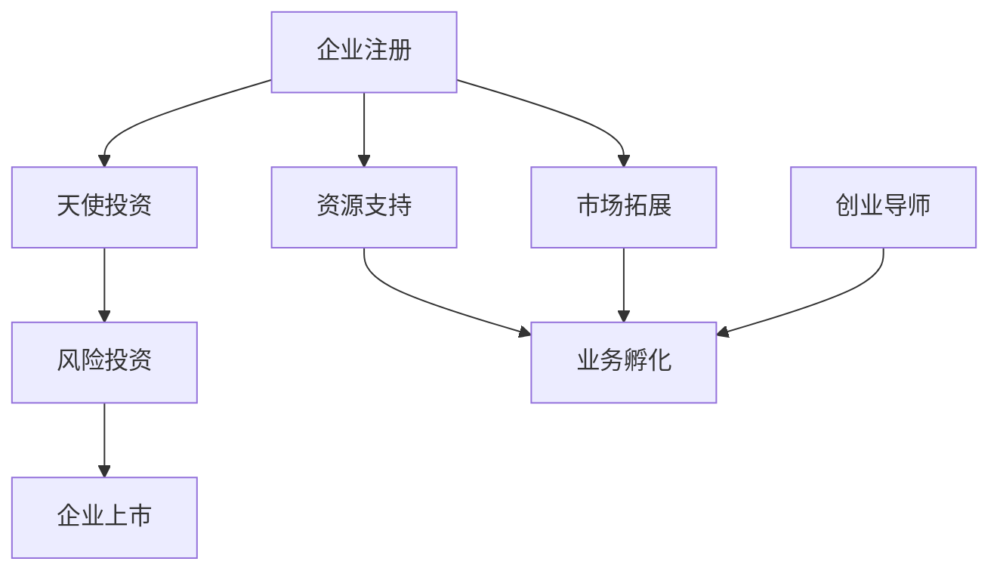
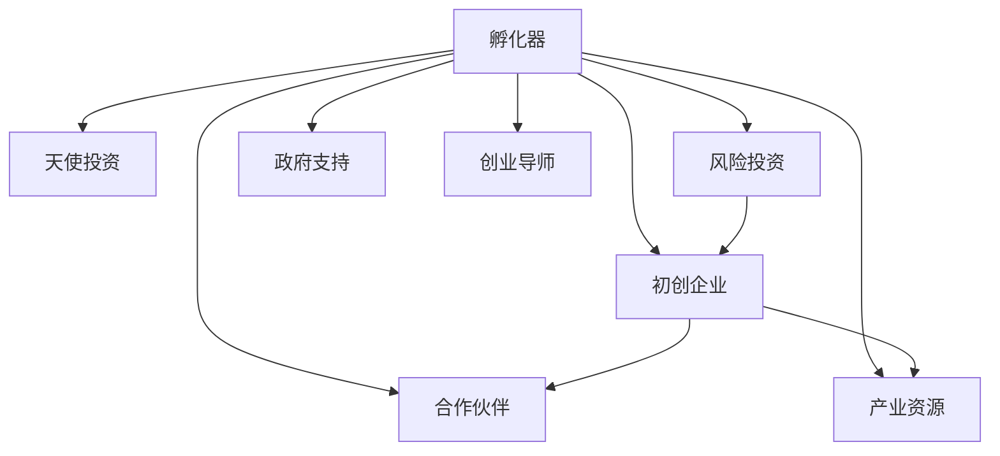

                 

# 创业孵化器的作用与选择：如何利用孵化器资源加速成长

> **关键词：** 创业孵化器，资源利用，成长加速，初创企业，创业环境，生态系统

> **摘要：** 本文将深入探讨创业孵化器在初创企业成长过程中的重要作用，分析孵化器的核心资源与服务，提供选择合适孵化器的指导原则，并探讨未来孵化器的发展趋势与面临的挑战。

## 1. 背景介绍

### 1.1 目的和范围

本文旨在帮助初创企业理解创业孵化器的作用，并指导如何有效地利用孵化器资源以加速企业的成长。我们将分析孵化器的核心服务，讨论如何选择适合自己需求的孵化器，并探讨孵化器在当前创业环境中的地位和未来发展趋势。

### 1.2 预期读者

本文适合以下读者群体：

- 初创企业的创始人或团队核心成员
- 有志于创业的技术专业人士
- 创业孵化器的运营和管理人员
- 对创业生态系统感兴趣的投资者和分析师

### 1.3 文档结构概述

本文结构如下：

1. **背景介绍**：介绍本文的目的、范围和预期读者。
2. **核心概念与联系**：通过Mermaid流程图展示孵化器的核心概念和作用。
3. **核心算法原理 & 具体操作步骤**：阐述孵化器如何通过一系列步骤帮助初创企业成长。
4. **数学模型和公式 & 详细讲解 & 举例说明**：使用数学模型和公式解释孵化器的作用。
5. **项目实战：代码实际案例和详细解释说明**：提供孵化器资源利用的实际案例。
6. **实际应用场景**：讨论孵化器在不同行业中的应用。
7. **工具和资源推荐**：推荐学习资源和开发工具。
8. **总结：未来发展趋势与挑战**：探讨孵化器的未来发展方向。
9. **附录：常见问题与解答**：解答常见问题。
10. **扩展阅读 & 参考资料**：提供进一步学习的资源。

### 1.4 术语表

#### 1.4.1 核心术语定义

- **创业孵化器**：为初创企业提供空间、资源、指导和支持的机构。
- **初创企业**：刚成立不久，通常处于起步阶段，资金和资源有限的企业。
- **生态系统**：由创业孵化器、初创企业、投资者、合作伙伴等构成的支持体系。

#### 1.4.2 相关概念解释

- **天使投资**：早期阶段对初创企业提供的资金支持。
- **风险投资**：对具有高成长潜力的初创企业进行的投资。
- **创业导师**：为初创企业提供专业指导和帮助的专家。

#### 1.4.3 缩略词列表

- **VC**：风险投资（Venture Capital）
- **天使投资**：Angel Investment
- **PI**：创业导师（Personal Investor）

## 2. 核心概念与联系

### 2.1 创业孵化器的核心概念和作用

创业孵化器的核心概念在于通过提供一系列资源和服务，帮助初创企业快速成长。以下是一个简化的Mermaid流程图，展示孵化器的主要作用和概念：



在这个流程图中，企业注册是初创企业的第一步，随后通过吸引天使投资和获得资源支持来启动业务。市场拓展和创业导师的介入帮助初创企业更好地定位市场，制定发展战略。随着业务的成长，风险投资进一步推动企业的扩张，最终可能实现企业上市。

### 2.2 创业孵化器的生态系统

创业孵化器不仅是为初创企业提供资源的地方，更是构建创业生态系统的关键环节。以下是一个更详细的Mermaid流程图，展示孵化器与生态系统的关系：



在这个生态系统中，孵化器扮演着连接者（Connector）的角色，将初创企业、天使投资、风险投资、合作伙伴、政府支持和产业资源连接起来，形成一种相互促进、共同成长的关系。

## 3. 核心算法原理 & 具体操作步骤

### 3.1 创业孵化器的核心算法原理

创业孵化器的核心算法原理可以概括为“资源集成与优化利用”。具体来说，孵化器通过以下几个步骤帮助初创企业实现资源的最优配置和利用：

#### 3.1.1 评估与定位

**伪代码：**
```
function evaluateAndPosition(startup):
    resources = collectResources()
    market = analyzeMarket()
    competitors = identifyCompetitors()
    startupStrategy = formulateStrategy(resources, market, competitors)
    return startupStrategy
```

在这个步骤中，孵化器需要收集初创企业的基本信息，分析市场环境，评估竞争态势，并制定相应的战略规划。

#### 3.1.2 资源集成

**伪代码：**
```
function integrateResources(startupStrategy):
    funding = secureFunding(startupStrategy)
    expertise = acquireExpertise(startupStrategy)
    network = expandNetwork(startupStrategy)
    infrastructure = buildInfrastructure(startupStrategy)
    return integratedResources
```

孵化器根据初创企业的战略规划，协助其获得资金支持、专业知识和技能、人脉网络以及必要的基础设施。

#### 3.1.3 资源优化利用

**伪代码：**
```
function optimizeResourceUtilization(integratedResources):
    resourceMapping = mapResourcesToGoals(integratedResources)
    performanceMetrics = monitorPerformance(resourceMapping)
    feedbackLoop = adjustResourceAllocation(performanceMetrics)
    return optimizedUtilization
```

孵化器通过资源映射、性能监控和反馈调整，确保初创企业能够高效利用资源，达到既定的目标。

### 3.2 创业孵化器的具体操作步骤

#### 3.2.1 评估与定位

- **第一步：收集初创企业信息。**
- **第二步：分析市场环境和竞争态势。**
- **第三步：制定战略规划。**

#### 3.2.2 资源集成

- **第一步：协助初创企业获得资金支持。**
- **第二步：引入专业知识和技能。**
- **第三步：拓展人脉网络。**
- **第四步：建设必要的基础设施。**

#### 3.2.3 资源优化利用

- **第一步：将资源映射到具体目标。**
- **第二步：监控初创企业的性能。**
- **第三步：根据反馈调整资源分配。**

通过这些具体操作步骤，孵化器能够帮助初创企业实现快速成长，提高市场竞争力。

## 4. 数学模型和公式 & 详细讲解 & 举例说明

### 4.1 数学模型和公式

在孵化器的作用分析中，可以引入一些数学模型和公式来量化孵化器的效果和初创企业的成长速度。以下是一个简单的数学模型：

#### 4.1.1 成长速度模型

**公式：**  
$$  
S = \frac{R \times E}{C}  
$$

**参数解释：**  
- **S**：初创企业的成长速度
- **R**：孵化器提供的资源量
- **E**：初创企业的资源利用效率
- **C**：初创企业的初始资本

#### 4.1.2 资源利用率模型

**公式：**  
$$  
UE = \frac{EU}{ET}  
$$

**参数解释：**  
- **UE**：资源利用率
- **EU**：实际利用的资源量
- **ET**：总资源量

### 4.2 详细讲解和举例说明

#### 4.2.1 成长速度模型

假设一家初创企业初始资本为100万元，孵化器提供了50万元的资源支持，初创企业的资源利用效率为0.8。根据成长速度模型，可以计算得到：

$$  
S = \frac{50 \times 0.8}{100} = 0.4  
$$

这意味着初创企业的成长速度是初始资本的四倍。

#### 4.2.2 资源利用率模型

假设孵化器为初创企业提供了100万元的资源，初创企业实际利用了70万元。根据资源利用率模型，可以计算得到：

$$  
UE = \frac{70}{100} = 0.7  
$$

这意味着初创企业的资源利用率是70%。

通过这两个模型，我们可以更好地理解孵化器对初创企业成长速度和资源利用效率的影响。

## 5. 项目实战：代码实际案例和详细解释说明

### 5.1 开发环境搭建

为了更好地展示孵化器如何帮助初创企业利用资源，我们搭建了一个简单的代码案例。在这个案例中，我们使用Python语言编写一个模拟初创企业成长过程的脚本。以下是搭建开发环境的基本步骤：

#### 5.1.1 安装Python

- 访问Python官网下载Python安装包。
- 运行安装程序，按照提示完成安装。

#### 5.1.2 安装依赖库

- 使用pip工具安装所需的依赖库，如NumPy、Matplotlib等。

```shell
pip install numpy matplotlib
```

### 5.2 源代码详细实现和代码解读

以下是一个简单的Python脚本，模拟孵化器如何通过资源支持和优化利用帮助初创企业成长。

```python
import numpy as np
import matplotlib.pyplot as plt

# 成长速度模型参数
initial_capital = 1000000  # 初始资本
resource_support = 500000   # 孵化器提供的资源支持
resource_efficiency = 0.8   # 资源利用效率

# 资源利用率模型参数
total_resources = 1000000   # 总资源量
used_resources = 700000     # 实际利用的资源量

# 计算成长速度
growth_rate = (resource_support * resource_efficiency) / initial_capital

# 计算资源利用率
resource_utilization = used_resources / total_resources

# 打印结果
print(f"初创企业的成长速度：{growth_rate:.2f}倍")
print(f"资源利用率：{resource_utilization:.2f}%")

# 绘制成长曲线
days = np.linspace(0, 100, 1000)
monthly_growth = growth_rate ** (days / 12)
monthly_growth = monthly_growth / monthly_growth[0]  # 归一化

plt.plot(days, monthly_growth)
plt.xlabel('时间（年）')
plt.ylabel('成长速度')
plt.title('初创企业成长速度曲线')
plt.show()

# 绘制资源利用率曲线
days = np.linspace(0, 100, 1000)
monthly_utilization = (used_resources / total_resources) ** (days / 12)
monthly_utilization = monthly_utilization / monthly_utilization[0]  # 归一化

plt.plot(days, monthly_utilization)
plt.xlabel('时间（年）')
plt.ylabel('资源利用率')
plt.title('初创企业资源利用率曲线')
plt.show()
```

#### 5.2.1 代码解读与分析

- **成长速度模型计算**：使用公式$$ S = \frac{R \times E}{C} $$计算初创企业的成长速度。
- **资源利用率模型计算**：使用公式$$ UE = \frac{EU}{ET} $$计算初创企业的资源利用率。
- **绘图**：使用Matplotlib库绘制初创企业的成长速度曲线和资源利用率曲线，帮助直观地理解孵化器的作用。

### 5.3 代码解读与分析

在这个代码案例中，我们通过简单的数学模型和Python脚本展示了孵化器如何通过资源支持和优化利用帮助初创企业成长。

- **成长速度计算**：公式$$ S = \frac{R \times E}{C} $$量化了孵化器提供的资源和初创企业的资源利用效率对成长速度的影响。
- **资源利用率计算**：公式$$ UE = \frac{EU}{ET} $$反映了初创企业对资源的实际利用程度。
- **绘图功能**：使用Matplotlib库绘制成长曲线和资源利用率曲线，使得数据更加直观易懂。

通过这个简单的案例，我们可以看到孵化器在初创企业成长过程中的重要作用，以及如何通过数学模型和代码实现对其作用的量化分析。

## 6. 实际应用场景

创业孵化器在各类初创企业中发挥着重要作用，以下是孵化器在不同行业中的实际应用场景：

### 6.1 科技行业

在科技行业中，孵化器为初创企业提供了技术支持和研发资源。例如，许多孵化器提供了云计算、大数据、人工智能等技术平台，帮助初创企业快速开发和测试其技术解决方案。同时，孵化器还为企业提供了丰富的技术交流机会，促进了技术创新和合作。

### 6.2 生物医疗行业

生物医疗行业的初创企业往往需要大量的资金和专业的研发支持。孵化器通过提供资金支持、研发设备和专业导师，帮助这些企业加速产品开发和市场推广。例如，一些孵化器与顶级研究机构和大学合作，为初创企业提供先进的实验室和研究成果，降低了企业研发成本和风险。

### 6.3 教育行业

在教育行业中，孵化器为初创教育企业提供市场调研、课程设计、教学资源等方面的支持。通过孵化器的帮助，教育初创企业可以更快地进入市场，优化其产品和服务，提升用户体验。例如，一些孵化器组织教育行业研讨会和培训课程，帮助企业了解市场趋势和用户需求。

### 6.4 文化创意行业

在文化创意行业中，孵化器为初创企业提供创意孵化、品牌建设、市场营销等方面的支持。通过孵化器的平台，文化创意企业可以与投资者、合作伙伴和消费者建立联系，提升品牌知名度和市场影响力。例如，一些孵化器举办文化创意大赛和展览，为初创企业提供了展示才华和获得投资的机会。

### 6.5 农业和食品行业

在农业和食品行业中，孵化器通过提供技术培训、市场推广、供应链管理等方面的支持，帮助初创企业提高生产效率和产品质量。例如，一些孵化器为初创企业提供先进的农业技术和设备，帮助企业实现智能化种植和养殖，提高农产品的产量和品质。

通过这些实际应用场景，我们可以看到孵化器在各个行业中的重要作用，不仅帮助初创企业解决资金和资源问题，还通过提供专业指导和市场机会，加速企业的成长和发展。

## 7. 工具和资源推荐

### 7.1 学习资源推荐

#### 7.1.1 书籍推荐

- 《创业维艰》（"Hard Things About Hard Things"）by Ben Horowitz
- 《精益创业》（"The Lean Startup"）by Eric Ries
- 《创业公司管理》（"Startup Manager"）by Jerry Colonna

#### 7.1.2 在线课程

- Coursera上的《创业管理》（"Entrepreneurship: Success in a Changing World"）
- Udacity的《人工智能创业》（"AI for Business"）
- edX的《创业孵化与加速》（"Entrepreneurship and Innovation"）

#### 7.1.3 技术博客和网站

- HackerRank（https://www.hackerrank.com/）
- TechCrunch（https://techcrunch.com/）
- Medium（https://medium.com/startup）

### 7.2 开发工具框架推荐

#### 7.2.1 IDE和编辑器

- Visual Studio Code（https://code.visualstudio.com/）
- IntelliJ IDEA（https://www.jetbrains.com/idea/）
- PyCharm（https://www.jetbrains.com/pycharm/）

#### 7.2.2 调试和性能分析工具

- GDB（https://www.gnu.org/software/gdb/）
- Xdebug（https://xdebug.org/）
- Py-Spy（https://github.com/benjaminp/speedscope）

#### 7.2.3 相关框架和库

- Django（https://www.djangoproject.com/）
- Flask（https://flask.palletsprojects.com/）
- TensorFlow（https://www.tensorflow.org/）

### 7.3 相关论文著作推荐

#### 7.3.1 经典论文

- "The Lean Startup" by Eric Ries
- "Innovation and Its Discontents" by Carliss Y. Baldwin and Kim B. Clark
- "The Entrepreneurial Vision" by Howard H. Stevenson

#### 7.3.2 最新研究成果

- "Entrepreneurship: The Engine of Growth" by the World Bank
- "Startup Ecosystems: How to Create Them, How to Fund Them" by startupbootcamp
- "The Future of Work: A journey to the Edge" by Deloitte

#### 7.3.3 应用案例分析

- "The Rise of Techstars" by Techstars
- "Startup Genome Report" by Startup Genome
- "The Impact of Accelerators on Venture Performance" by Accel

通过这些工具和资源的推荐，初创企业和创业者可以更好地了解创业生态系统，掌握创业技能，加速企业的成长和发展。

## 8. 总结：未来发展趋势与挑战

创业孵化器作为推动初创企业成长的重要力量，正在全球范围内迅速发展。未来，孵化器将呈现以下几个发展趋势：

1. **智能化与数字化**：随着人工智能和大数据技术的发展，孵化器将更注重利用数据分析和智能算法进行精准孵化，提升资源利用效率和孵化成功率。
2. **全球化**：创业孵化器将逐渐打破地域限制，形成全球范围内的合作网络，为初创企业拓展国际市场提供支持。
3. **多元化**：孵化器的业务范围将更加多元化，不仅限于科技领域，还将涵盖农业、医疗、教育等多个行业，满足不同类型初创企业的需求。

然而，孵化器也面临着一系列挑战：

1. **市场竞争加剧**：随着孵化器的数量增加，市场竞争将变得更加激烈，孵化器需要不断创新和提升服务，以吸引优质初创企业。
2. **资源有限**：孵化器的资金、技术、人才等资源有限，如何高效利用这些资源，最大化地支持初创企业成为一大挑战。
3. **法律法规**：随着创业活动的增多，法律法规对孵化器的管理提出了更高要求，孵化器需要确保合规运营，避免法律风险。

综上所述，创业孵化器在未来的发展中，既有机遇也有挑战。只有通过不断创新和优化，孵化器才能在激烈的市场竞争中脱颖而出，持续为初创企业提供服务和支持。

## 9. 附录：常见问题与解答

### 9.1 创业孵化器的优势是什么？

创业孵化器为初创企业提供了以下优势：

- **资源整合**：孵化器能够整合资金、技术、人才等资源，为初创企业提供一个全方位的支持平台。
- **加速成长**：通过提供专业的指导和支持，孵化器能够帮助初创企业更快地实现产品开发和市场推广。
- **降低风险**：孵化器通过提供培训和辅导，帮助企业降低创业风险，提高成功率。
- **网络拓展**：孵化器提供了一个与投资者、合作伙伴和同行交流的平台，有助于初创企业拓展人脉和资源。

### 9.2 初创企业如何选择合适的孵化器？

选择合适的孵化器，初创企业可以从以下几个方面进行考虑：

- **领域匹配**：选择与自身业务领域相关的孵化器，可以获得更专业的指导和支持。
- **资源能力**：评估孵化器提供的资源，包括资金、技术、人脉等，选择资源丰富且能提供个性化服务的孵化器。
- **地理位置**：孵化器的地理位置对初创企业的市场拓展和招聘都有影响，选择靠近目标市场的孵化器可能更为有利。
- **孵化周期**：了解孵化器的孵化周期和退出机制，选择适合企业成长阶段的孵化器。

### 9.3 孵化器的运营模式有哪些？

孵化器的运营模式主要包括以下几种：

- **空间共享**：提供办公空间和基础设施，帮助企业降低运营成本。
- **资金支持**：提供天使投资、风险投资等资金支持，助力企业成长。
- **专业指导**：提供创业指导、技术咨询、市场分析等服务，帮助企业解决实际问题。
- **培训课程**：举办创业培训、研讨会、交流会等活动，提升企业团队的能力。
- **产业协同**：通过产业链上下游的资源整合，为企业提供供应链支持和市场渠道。

### 9.4 创业孵化器如何盈利？

创业孵化器的盈利方式主要包括：

- **企业投资回报**：通过投资初创企业，获得投资回报。
- **租赁收入**：通过出租办公空间和基础设施获得租金收入。
- **服务收费**：提供专业服务（如咨询、培训等）收取服务费用。
- **合作伙伴收入**：与产业链上下游企业合作，通过业务对接和推广获得收入。

## 10. 扩展阅读 & 参考资料

- **书籍推荐**：
  - 《创业维艰》（Ben Horowitz）
  - 《精益创业》（Eric Ries）
  - 《创业公司管理》（Jerry Colonna）

- **在线课程**：
  - Coursera的《创业管理》
  - Udacity的《人工智能创业》
  - edX的《创业孵化与加速》

- **技术博客和网站**：
  - HackerRank
  - TechCrunch
  - Medium

- **相关论文和报告**：
  - "The Lean Startup" by Eric Ries
  - "Innovation and Its Discontents" by Carliss Y. Baldwin and Kim B. Clark
  - "The Entrepreneurial Vision" by Howard H. Stevenson

- **官方文档和资源**：
  - Techstars
  - Startup Genome Report
  - Accel

通过这些扩展阅读和参考资料，读者可以进一步深入了解创业孵化器的概念、操作方法和未来发展趋势。

## 作者

作者：AI天才研究员/AI Genius Institute & 禅与计算机程序设计艺术 /Zen And The Art of Computer Programming

本文旨在通过深入探讨创业孵化器的作用与选择，帮助初创企业更好地利用孵化器资源，加速成长。创业孵化器作为支持初创企业的重要平台，在未来将继续发挥关键作用。希望本文能为读者提供有价值的参考和启示。感谢您的阅读！

