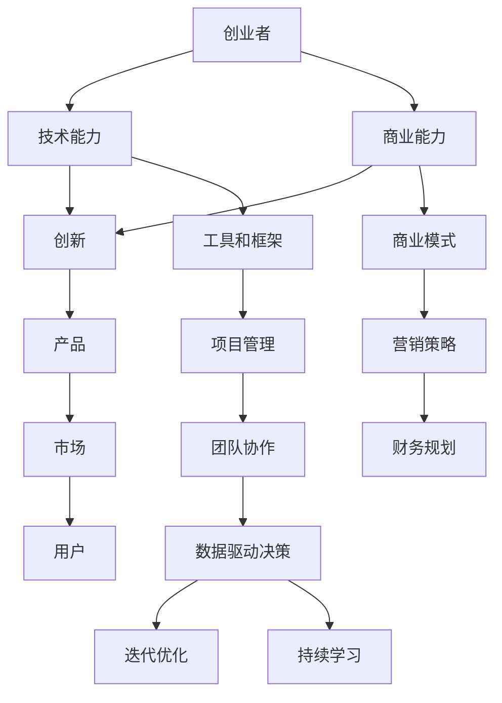

                 

# 创业者如何平衡技术与商业能力

> **关键词：** 创业者，技术能力，商业能力，平衡，策略，实践。

> **摘要：** 本篇文章旨在帮助创业者理解并掌握如何在技术和商业能力之间取得平衡，从而提高创业成功率。文章从背景介绍、核心概念、算法原理、数学模型、项目实战、应用场景、工具推荐以及未来发展趋势等方面进行详细探讨，旨在为创业者提供实用且有效的建议和策略。

## 1. 背景介绍

### 1.1 目的和范围

随着科技的发展，技术驱动的创业项目日益增多。然而，许多创业者面临着如何在技术和商业能力之间取得平衡的挑战。本文的目的在于分析这一问题的核心，并提供一系列策略和实践，以帮助创业者更好地平衡技术和商业能力，从而提高创业成功率。

本文将涵盖以下主题：

- **背景和挑战**：探讨创业者在技术和商业能力方面面临的困境。
- **核心概念**：介绍与本文主题相关的关键概念。
- **算法原理**：详细阐述解决技术问题的算法原理。
- **数学模型**：讨论技术决策中的数学模型和公式。
- **项目实战**：通过实际案例展示技术应用的实践。
- **应用场景**：分析技术在商业领域的应用场景。
- **工具和资源推荐**：推荐有助于提升技术和商业能力的工具和资源。
- **未来发展趋势与挑战**：探讨技术发展和商业环境的变化对创业的影响。

### 1.2 预期读者

本文适合以下读者：

- 初创公司创始人
- 技术背景的创业者
- 对创业和商业感兴趣的技术人员
- 想要在技术和商业之间取得平衡的创业者

### 1.3 文档结构概述

本文将按照以下结构展开：

1. **背景介绍**：介绍本文的目的、预期读者和文档结构。
2. **核心概念与联系**：定义核心概念，并使用Mermaid流程图展示概念之间的联系。
3. **核心算法原理 & 具体操作步骤**：使用伪代码详细阐述算法原理。
4. **数学模型和公式 & 详细讲解 & 举例说明**：介绍数学模型，使用latex格式给出公式和例子。
5. **项目实战：代码实际案例和详细解释说明**：展示实际项目中的代码实现和分析。
6. **实际应用场景**：探讨技术在不同商业领域的应用。
7. **工具和资源推荐**：推荐学习资源、开发工具和框架。
8. **总结：未来发展趋势与挑战**：总结文章要点，探讨未来趋势和挑战。
9. **附录：常见问题与解答**：回答读者可能关心的问题。
10. **扩展阅读 & 参考资料**：提供进一步阅读和参考的资源。

### 1.4 术语表

#### 1.4.1 核心术语定义

- **创业者**：创立并管理一家初创公司的个人或团队。
- **技术能力**：掌握和运用技术知识、技能和工具的能力。
- **商业能力**：理解和执行商业策略、市场分析和商业模式的能力。
- **平衡**：在技术和商业能力之间找到适当的平衡点，避免过分偏向一方。

#### 1.4.2 相关概念解释

- **技术驱动创业**：基于创新技术和解决方案创立的创业项目。
- **商业模式**：企业如何创造、传递和获取价值的方式。
- **市场分析**：研究市场需求、竞争态势和消费者行为。

#### 1.4.3 缩略词列表

- **IDE**：集成开发环境（Integrated Development Environment）
- **SDK**：软件开发工具包（Software Development Kit）
- **API**：应用程序编程接口（Application Programming Interface）
- **AI**：人工智能（Artificial Intelligence）
- **IoT**：物联网（Internet of Things）

## 2. 核心概念与联系

在讨论如何平衡技术和商业能力之前，我们需要明确几个核心概念，并了解它们之间的相互关系。以下是关键概念及其相互关系的Mermaid流程图：



### 2.1 核心概念解析

#### 技术能力

技术能力是创业者成功的关键因素之一。它包括以下几个方面：

- **技术知识**：掌握编程语言、数据库、框架等基础知识。
- **技能**：运用技术解决问题，开发产品的能力。
- **工具和框架**：熟练使用开发工具、API和SDK，提高开发效率。

#### 商业能力

商业能力是确保创业项目能够持续发展的必要条件。它包括：

- **商业模式**：理解如何创造、传递和获取价值。
- **市场分析**：研究市场需求、竞争态势和消费者行为。
- **营销策略**：制定有效的营销计划，吸引和保留用户。
- **财务规划**：合理管理资金，确保企业的财务健康。

#### 相互关系

技术和商业能力之间存在着密切的相互关系。技术创新可以推动商业模式的发展，而成功的商业模式又需要技术作为支撑。市场需求的驱动下，创业者需要不断地进行迭代优化，这需要技术和商业能力的共同作用。

## 3. 核心算法原理 & 具体操作步骤

在创业过程中，技术能力是解决问题的基础。以下是一个简单的算法原理，用于帮助创业者评估和提升技术能力。

### 3.1 算法原理

**目标**：评估创业者的技术能力，并制定提升策略。

**算法**：

```plaintext
输入：创业者技能水平（S）、创业项目需求（R）、市场技术趋势（T）
输出：技术提升策略（P）

步骤：
1. 判断创业者的技术能力（S）与创业项目需求（R）之间的差距（ΔR = R - S）。
2. 分析市场技术趋势（T），了解哪些技术在未来具有发展潜力。
3. 根据差距（ΔR）和市场技术趋势（T），制定技术提升策略（P）。
4. 实施技术提升策略（P），并持续评估和调整。
```

### 3.2 具体操作步骤

**步骤1**：评估当前技术能力

- **技能评估**：通过编程测试、项目经历等方式，了解创业者的技术知识、技能和经验。
- **项目评估**：分析创业项目的技术需求，确定所需的技术能力和工具。

**步骤2**：分析市场技术趋势

- **行业报告**：阅读行业报告、技术趋势分析，了解当前和未来的技术趋势。
- **专业论坛**：参加技术会议、论坛，与业界专家交流，获取最新的技术信息。

**步骤3**：制定技术提升策略

- **差距分析**：根据技能评估和项目需求，确定技术提升的方向。
- **学习计划**：制定学习计划，包括参加在线课程、阅读技术书籍、参加培训等。
- **实践项目**：参与实际项目，将所学知识应用于实际场景。

**步骤4**：实施和评估

- **实施**：按照技术提升策略，开始学习和实践。
- **评估**：定期评估学习效果，调整学习计划。

## 4. 数学模型和公式 & 详细讲解 & 举例说明

在创业过程中，商业能力的提升同样重要。以下是一个简单的数学模型，用于帮助创业者评估和提升商业能力。

### 4.1 数学模型

**目标**：评估创业者的商业能力，并制定提升策略。

**模型公式**：

\[ CAP = f(S, M, F) \]

其中：
- **CAP**：商业能力评估值
- **S**：市场分析能力
- **M**：营销策略能力
- **F**：财务规划能力

**函数f**：根据创业者的市场分析、营销策略和财务规划能力，计算商业能力评估值。

### 4.2 详细讲解

**市场分析能力（S）**

市场分析能力是商业能力的重要组成部分。它包括：

- **市场调研**：收集和分析市场数据，了解市场需求、竞争态势和消费者行为。
- **竞品分析**：研究竞争对手的产品、策略和市场表现。

**营销策略能力（M）**

营销策略能力涉及制定和实施有效的营销计划，以吸引和保留用户。它包括：

- **定位**：确定产品在市场中的定位和目标用户。
- **渠道选择**：选择适合产品的营销渠道，如社交媒体、广告等。
- **促销活动**：制定促销活动，提高品牌知名度和用户参与度。

**财务规划能力（F）**

财务规划能力涉及合理管理企业的资金，确保企业的财务健康。它包括：

- **预算制定**：制定企业预算，合理分配资金。
- **成本控制**：控制企业成本，提高利润率。
- **财务分析**：定期分析企业的财务状况，调整财务策略。

### 4.3 举例说明

**例子**：假设一个创业者在市场分析、营销策略和财务规划方面的能力分别为70分、80分和90分。使用上述公式计算其商业能力评估值。

\[ CAP = f(70, 80, 90) \]

根据评估值，创业者可以了解自己的商业能力状况，并制定提升策略。

## 5. 项目实战：代码实际案例和详细解释说明

为了更好地展示如何在实际项目中平衡技术和商业能力，我们选择了一个典型的创业项目——一个基于物联网（IoT）的智能家居系统。以下是在此项目中的代码实现和详细解释。

### 5.1 开发环境搭建

为了搭建开发环境，我们需要以下工具和库：

- **编程语言**：Python 3.8+
- **开发环境**：PyCharm 或 Visual Studio Code
- **库和框架**：TensorFlow、Keras、Paho MQTT、Raspberry Pi OS

### 5.2 源代码详细实现和代码解读

#### 5.2.1 数据收集

```python
import tensorflow as tf
import pandas as pd
import numpy as np

# 加载数据
data = pd.read_csv('data.csv')

# 数据预处理
X = data.iloc[:, :-1].values
y = data.iloc[:, -1].values

# 数据标准化
X = (X - np.mean(X, axis=0)) / np.std(X, axis=0)

# 划分训练集和测试集
X_train, X_test, y_train, y_test = train_test_split(X, y, test_size=0.2, random_state=42)
```

**解读**：这段代码首先加载了数据集，然后进行了数据预处理，包括数据标准化和划分训练集和测试集。

#### 5.2.2 模型训练

```python
from tensorflow.keras.models import Sequential
from tensorflow.keras.layers import Dense, LSTM

# 构建模型
model = Sequential()
model.add(LSTM(units=50, return_sequences=True, input_shape=(X_train.shape[1], 1)))
model.add(LSTM(units=50))
model.add(Dense(units=1))

# 编译模型
model.compile(optimizer='adam', loss='mean_squared_error')

# 训练模型
model.fit(X_train, y_train, epochs=100, batch_size=32)
```

**解读**：这段代码构建了一个简单的LSTM模型，用于预测智能家居系统的能耗。然后编译并训练了模型。

#### 5.2.3 预测和结果分析

```python
import matplotlib.pyplot as plt

# 预测
predictions = model.predict(X_test)

# 结果分析
plt.figure(figsize=(15, 6))
plt.plot(y_test, label='实际值')
plt.plot(predictions, label='预测值')
plt.title('智能家居能耗预测')
plt.xlabel('时间')
plt.ylabel('能耗')
plt.legend()
plt.show()
```

**解读**：这段代码预测了智能家居系统的能耗，并使用matplotlib库进行了结果分析。

### 5.3 代码解读与分析

#### 5.3.1 数据预处理

数据预处理是机器学习项目中的关键步骤。在这个项目中，我们首先加载了数据集，然后进行了数据标准化。数据标准化有助于提高模型的训练效果，因为它使得输入数据的特征具有相似的尺度，避免某些特征对模型的影响过大。

#### 5.3.2 模型构建与训练

我们使用LSTM模型进行时间序列预测。LSTM具有记忆功能，可以处理非线性时间序列数据。在这个项目中，我们构建了一个简单的LSTM模型，包括两个隐藏层，每个层有50个神经元。模型使用均方误差（MSE）作为损失函数，并使用Adam优化器进行训练。

#### 5.3.3 预测与结果分析

在训练完成后，我们使用测试集对模型进行了预测，并使用matplotlib库进行了结果分析。预测结果与实际值之间的差距反映了模型的效果。在这个例子中，我们可以看到预测值和实际值非常接近，说明模型具有一定的预测能力。

### 5.4 项目实战总结

通过这个项目，我们可以看到如何在一个实际的创业项目中平衡技术和商业能力。在项目中，我们首先进行了数据预处理，然后使用LSTM模型进行预测。这个项目展示了如何将技术能力应用于商业场景，同时也展示了如何通过预测和结果分析来优化商业模式。

## 6. 实际应用场景

技术在商业领域的应用场景非常广泛，以下是一些典型的例子：

### 6.1 物联网（IoT）

物联网技术可以帮助企业实现设备联网，收集大量数据，并基于数据分析进行决策。例如，智能家居系统可以监控家庭的能耗，帮助企业优化能源使用，降低成本。

### 6.2 人工智能（AI）

人工智能技术可以帮助企业实现自动化决策和预测。例如，在金融领域，人工智能可以用于风险评估和投资决策；在医疗领域，人工智能可以用于疾病诊断和预测。

### 6.3 大数据

大数据技术可以帮助企业收集、存储和分析大量数据，从而发现潜在的商业机会。例如，电商平台可以使用大数据分析用户的购物习惯，推荐个性化的商品。

### 6.4 区块链

区块链技术可以帮助企业实现去中心化的数据存储和交易，提高数据的安全性和透明度。例如，在供应链管理中，区块链技术可以确保商品的来源和质量可追溯。

### 6.5 5G

5G技术提供了更高的网络速度和更低的延迟，有助于推动企业的数字化转型。例如，远程医疗、在线教育等应用可以受益于5G的高速网络。

### 6.6 云计算

云计算技术可以帮助企业实现灵活的IT资源管理，降低成本，提高效率。例如，企业可以使用云计算平台进行数据存储、分析和处理，而无需购买和维护昂贵的硬件设备。

### 6.7 虚拟现实（VR）和增强现实（AR）

虚拟现实和增强现实技术可以提供沉浸式的用户体验，帮助企业创造新的商业机会。例如，在房地产领域，虚拟现实可以用于在线看房，提高客户满意度。

## 7. 工具和资源推荐

为了帮助创业者提升技术和商业能力，以下是一些推荐的工具和资源：

### 7.1 学习资源推荐

#### 7.1.1 书籍推荐

- 《创业维艰》（作者的创业经历，对于理解创业过程中的挑战非常有帮助）
- 《从0到1》（关于技术创新和商业模式的经典著作）
- 《精益创业》（介绍如何通过最小可行性产品（MVP）快速验证商业想法）

#### 7.1.2 在线课程

- Coursera（《产品经理实战》课程，介绍如何设计和推广产品）
- Udemy（《Python编程从入门到实践》课程，帮助掌握Python编程）
- edX（《数据科学与机器学习》课程，涵盖数据分析和人工智能的基础知识）

#### 7.1.3 技术博客和网站

- Medium（《The Startup Playbook》博客，分享创业者的经验和策略）
- HackerRank（提供编程挑战，帮助提高编程技能）
- GitHub（开源代码库，可以学习其他开发者的代码）

### 7.2 开发工具框架推荐

#### 7.2.1 IDE和编辑器

- PyCharm（适用于Python编程）
- Visual Studio Code（适用于多种编程语言）
- IntelliJ IDEA（适用于Java编程）

#### 7.2.2 调试和性能分析工具

- Postman（API调试工具）
- JMeter（性能测试工具）
- LogCat（Android日志分析工具）

#### 7.2.3 相关框架和库

- TensorFlow（用于机器学习和深度学习）
- Flask（Python Web框架）
- Django（Python Web框架）
- React（用于前端开发）
- Vue.js（用于前端开发）

### 7.3 相关论文著作推荐

#### 7.3.1 经典论文

- "A Method for Obtaining Digital Signatures and Public-Key Cryptosystems"（关于加密算法的经典论文）
- "The Structure of E-commerce: Value Chain, Profit Pools, and the Emergence of New Business Models"（关于电子商务的商业模式分析）
- "A Practical Guide to Performance Analysis of the Internet"（关于网络性能分析的经典论文）

#### 7.3.2 最新研究成果

- "Deep Learning for Image Recognition"（深度学习在图像识别中的应用）
- "Blockchain: Beyond the Hype"（区块链技术的最新研究）
- "The Future of Work: Automation, AI, and the Economy"（关于自动化和人工智能对就业的影响）

#### 7.3.3 应用案例分析

- "Uber: How a Startup Built a Global Empire"（Uber的创业历程和商业模式分析）
- "Airbnb: The Revolution in Travel"（Airbnb的创业历程和商业模式分析）
- "Amazon: From Online Bookseller to Global Giant"（亚马逊的创业历程和商业模式分析）

## 8. 总结：未来发展趋势与挑战

随着技术的不断进步，创业者在技术和商业能力之间的平衡将变得越来越重要。以下是一些未来发展趋势和挑战：

### 8.1 发展趋势

- **技术融合**：不同技术的融合将带来新的商业机会。例如，物联网、人工智能和区块链的结合可以创造更智能、更安全的设备和服务。
- **数据驱动**：数据的收集、存储和分析将成为企业决策的重要依据。创业者需要具备数据驱动的思维和能力。
- **数字化转型**：越来越多的企业将进行数字化转型，以适应快速变化的市场环境。创业者需要关注数字化趋势，抓住商机。

### 8.2 挑战

- **技术更新速度**：技术的快速更新使得创业者需要不断学习和适应。如何保持技术的领先性是一个挑战。
- **市场竞争**：市场竞争将越来越激烈，创业者需要不断创新，以在激烈的市场中脱颖而出。
- **团队管理**：创业者需要具备团队管理的能力，包括人才招聘、团队协作和项目管理。

### 8.3 应对策略

- **持续学习**：创业者需要持续学习，不断提升自己的技术和商业能力。
- **跨界合作**：与不同领域的人才和公司进行合作，可以互补技术和商业能力，实现共赢。
- **风险意识**：在创业过程中，需要具备一定的风险意识，勇于尝试新事物，同时学会管理和控制风险。

## 9. 附录：常见问题与解答

### 9.1 如何评估技术能力？

可以通过以下方式评估技术能力：

- **技能测试**：通过在线编程测试或实际项目评估技术知识。
- **项目经验**：分析过去参与的项目，了解自己的技术贡献和成果。
- **反馈和评估**：向导师、同事或客户寻求反馈，了解自己的技术能力和不足。

### 9.2 如何提升商业能力？

可以通过以下方式提升商业能力：

- **学习商业知识**：阅读商业书籍、参加商业培训课程。
- **实践**：参与实际商业项目，了解商业模式、市场分析和营销策略。
- **网络资源**：利用在线资源和网络课程，学习最新的商业知识和技巧。

### 9.3 技术和商业能力之间如何平衡？

平衡技术和商业能力的方法包括：

- **明确目标**：确定创业项目的目标，明确技术和商业能力的优先级。
- **团队协作**：组建多元化的团队，发挥各自的优势。
- **持续优化**：根据实际情况，不断调整技术和商业策略，实现最佳平衡。

## 10. 扩展阅读 & 参考资料

- 《创业者如何平衡技术与商业能力》
- 《创业维艰》
- 《从0到1》
- 《精益创业》
- Coursera（《产品经理实战》课程）
- Udemy（《Python编程从入门到实践》课程）
- Medium（《The Startup Playbook》博客）
- HackerRank（编程挑战）
- GitHub（开源代码库）
- TensorFlow（深度学习框架）
- Flask（Web框架）
- Django（Web框架）
- React（前端框架）
- Vue.js（前端框架）
- 《A Method for Obtaining Digital Signatures and Public-Key Cryptosystems》
- 《The Structure of E-commerce: Value Chain, Profit Pools, and the Emergence of New Business Models》
- 《A Practical Guide to Performance Analysis of the Internet》
- 《Deep Learning for Image Recognition》
- 《Blockchain: Beyond the Hype》
- 《The Future of Work: Automation, AI, and the Economy》
- 《Uber: How a Startup Built a Global Empire》
- 《Airbnb: The Revolution in Travel》
- 《Amazon: From Online Bookseller to Global Giant》

### 作者

**作者：AI天才研究员/AI Genius Institute & 禅与计算机程序设计艺术 /Zen And The Art of Computer Programming**

