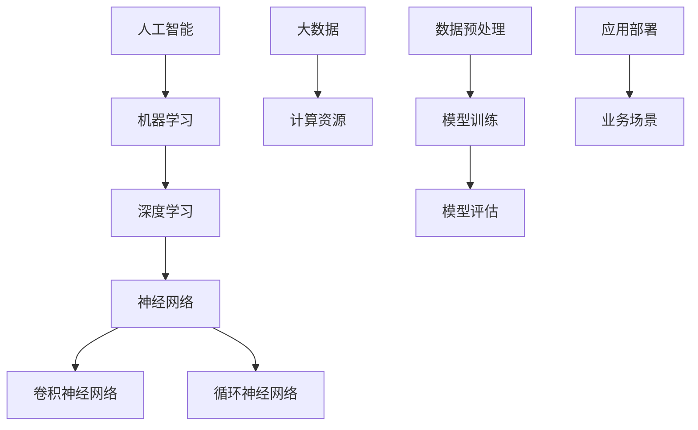

                 

# 创业者布局大模型，抢占AI产业变革风口

> 关键词：AI大模型，创业布局，产业变革，技术趋势，深度学习

> 摘要：本文将探讨创业者如何在当前AI产业变革的风口期，通过布局大模型来抢占市场先机。文章从背景介绍、核心概念、算法原理、数学模型、项目实战、实际应用、工具推荐等多个维度，系统性地解析了创业者在AI大模型领域的布局策略和关键步骤。

## 1. 背景介绍

### 1.1 目的和范围

本文旨在为创业者提供一份关于布局AI大模型的指导性文章。我们将探讨AI大模型的基本概念、技术原理、数学模型，以及如何通过实际项目来实现这些技术。文章将覆盖从技术原理到实际应用的全过程，旨在帮助创业者了解AI大模型在当前产业变革中的重要性，并掌握相应的布局策略。

### 1.2 预期读者

本文预期读者包括对AI技术有一定了解的技术创业者、产品经理、技术架构师，以及希望了解AI大模型技术并希望将其应用于实际业务的读者。

### 1.3 文档结构概述

本文结构如下：

1. 背景介绍
2. 核心概念与联系
3. 核心算法原理 & 具体操作步骤
4. 数学模型和公式 & 详细讲解 & 举例说明
5. 项目实战：代码实际案例和详细解释说明
6. 实际应用场景
7. 工具和资源推荐
8. 总结：未来发展趋势与挑战
9. 附录：常见问题与解答
10. 扩展阅读 & 参考资料

### 1.4 术语表

#### 1.4.1 核心术语定义

- **AI大模型**：指使用大量数据和计算资源训练的、具有强大表示和学习能力的深度学习模型。
- **深度学习**：一种基于人工神经网络的机器学习技术，通过模拟人脑神经网络结构来学习和提取数据特征。
- **人工智能（AI）**：使计算机具备人类智能水平的科学技术，包括机器学习、自然语言处理、计算机视觉等领域。

#### 1.4.2 相关概念解释

- **神经网络**：一种由大量神经元互联构成的计算机模拟模型，用于执行复杂的计算任务。
- **卷积神经网络（CNN）**：一种深度学习模型，常用于图像识别和处理。
- **循环神经网络（RNN）**：一种能够处理序列数据的深度学习模型，适用于自然语言处理和时间序列分析。

#### 1.4.3 缩略词列表

- **AI**：人工智能
- **ML**：机器学习
- **DL**：深度学习
- **GPU**：图形处理器
- **CPU**：中央处理器

## 2. 核心概念与联系

为了更好地理解AI大模型，我们需要先了解一些核心概念及其相互关系。以下是一个简化的Mermaid流程图，用于描述这些概念和它们之间的联系：



### 2.1 人工智能（AI）

人工智能是使计算机模拟人类智能的科学技术。它包括多个子领域，如机器学习、自然语言处理、计算机视觉等。AI的目标是实现自动化和智能化，以提高生产效率和解决复杂问题。

### 2.2 机器学习（ML）

机器学习是AI的一个重要分支，它通过数据驱动的方式使计算机获得知识和技能。机器学习算法可以分为监督学习、无监督学习和强化学习等类型，它们在各类应用场景中发挥了关键作用。

### 2.3 深度学习（DL）

深度学习是机器学习的一种特殊类型，它使用多层神经网络来提取数据特征。深度学习在图像识别、语音识别、自然语言处理等领域取得了显著的突破。

### 2.4 神经网络（Neural Network）

神经网络是一种由大量神经元互联构成的计算模型，用于执行复杂的计算任务。神经网络通过学习大量数据，能够自动提取数据中的特征和规律。

### 2.5 卷积神经网络（CNN）

卷积神经网络是一种专门用于图像识别和处理的深度学习模型。它通过卷积操作来提取图像中的特征，从而实现图像分类、目标检测等任务。

### 2.6 循环神经网络（RNN）

循环神经网络是一种能够处理序列数据的深度学习模型，适用于自然语言处理和时间序列分析。RNN通过记忆序列信息，能够实现语音识别、机器翻译等任务。

### 2.7 大数据和计算资源

大数据和计算资源是深度学习模型训练的基础。大量数据提供了丰富的训练样本，而强大的计算资源则能够加速模型训练和优化过程。

### 2.8 数据预处理、模型训练、模型评估、应用部署

数据预处理、模型训练、模型评估和应用部署是深度学习项目的基本步骤。数据预处理包括数据清洗、归一化等操作，以确保数据质量和模型训练效果。模型训练是通过大量数据训练模型参数，使其能够识别和预测目标。模型评估用于评估模型性能，包括准确率、召回率等指标。应用部署是将训练好的模型应用于实际业务场景，实现智能化的解决方案。

## 3. 核心算法原理 & 具体操作步骤

### 3.1 算法原理

深度学习算法的核心是神经网络。神经网络通过多层节点（神经元）的互联和激活函数，实现数据的输入和输出之间的映射。在训练过程中，神经网络通过不断调整权重和偏置，使模型能够学习到输入数据中的特征和规律。

### 3.2 具体操作步骤

以下是使用伪代码描述的深度学习模型训练的基本步骤：

```python
# 初始化模型参数（权重和偏置）
initialize_weights()

# 循环遍历训练数据集
for each (input_data, target_output) in training_data:

    # 前向传播：计算输出结果
    output_result = forward_pass(input_data)

    # 计算损失函数值
    loss = compute_loss(target_output, output_result)

    # 反向传播：更新模型参数
    backward_pass(loss)

# 重复以上步骤，直到满足训练终止条件（如损失值小于阈值或迭代次数达到最大值）

# 评估模型性能
evaluate_model performance
```

### 3.3 模型训练过程

1. **初始化模型参数**：包括权重（weights）和偏置（biases）。这些参数通常通过随机初始化。
2. **前向传播**：将输入数据输入到模型中，通过多层神经网络传递，最终得到输出结果。
3. **计算损失函数**：通过比较输出结果和目标输出，计算损失函数值。常用的损失函数包括均方误差（MSE）和交叉熵（Cross-Entropy）。
4. **反向传播**：计算损失函数关于模型参数的梯度，并通过梯度下降法（或其他优化算法）更新模型参数。
5. **迭代训练**：重复以上步骤，直到满足训练终止条件（如损失值小于阈值或迭代次数达到最大值）。
6. **评估模型性能**：在测试集上评估模型性能，包括准确率、召回率等指标。

## 4. 数学模型和公式 & 详细讲解 & 举例说明

### 4.1 数学模型

深度学习模型的核心是多层感知机（MLP），其数学模型可以表示为：

$$
y = f(z) = \sigma(\sum_{i=1}^{n} w_i \cdot x_i + b)
$$

其中，$y$ 是输出，$x_i$ 是输入特征，$w_i$ 是权重，$b$ 是偏置，$\sigma$ 是激活函数，通常使用 sigmoid 函数或 ReLU 函数。

### 4.2 激活函数

激活函数是深度学习模型中一个重要的组成部分，它引入了非线性特性，使模型能够学习到复杂的特征和规律。常用的激活函数包括：

- **Sigmoid 函数**：
  $$
  \sigma(z) = \frac{1}{1 + e^{-z}}
  $$
- **ReLU 函数**：
  $$
  \sigma(z) =
  \begin{cases}
  0, & \text{if } z < 0 \\
  z, & \text{if } z \geq 0
  \end{cases}
  $$

### 4.3 举例说明

假设我们有一个包含两个输入特征的简单神经网络，其模型参数和激活函数如下：

$$
y = \sigma(\sum_{i=1}^{2} w_i \cdot x_i + b)
$$

其中，$x_1 = 2$，$x_2 = 3$，$w_1 = 0.5$，$w_2 = 0.7$，$b = 1$，激活函数为 sigmoid 函数。

1. **前向传播**：

   $$
   z = \sum_{i=1}^{2} w_i \cdot x_i + b = 0.5 \cdot 2 + 0.7 \cdot 3 + 1 = 3.9
   $$

   $$
   y = \sigma(z) = \frac{1}{1 + e^{-3.9}} \approx 0.999
   $$

2. **反向传播**：

   $$
   \frac{dy}{dz} = \sigma'(z) = \sigma(z) \cdot (1 - \sigma(z))
   $$

   $$
   \frac{dz}{dw_1} = x_1 = 2
   $$

   $$
   \frac{dz}{dw_2} = x_2 = 3
   $$

   $$
   \frac{dz}{db} = 1
   $$

   根据梯度下降法，更新模型参数：

   $$
   w_1 = w_1 - \alpha \cdot \frac{dy}{dz} \cdot \frac{dz}{dw_1} = 0.5 - 0.001 \cdot 0.999 \cdot 2 \approx 0.498
   $$

   $$
   w_2 = w_2 - \alpha \cdot \frac{dy}{dz} \cdot \frac{dz}{dw_2} = 0.7 - 0.001 \cdot 0.999 \cdot 3 \approx 0.699
   $$

   $$
   b = b - \alpha \cdot \frac{dy}{dz} \cdot \frac{dz}{db} = 1 - 0.001 \cdot 0.999 \approx 0.999
   $$

通过以上步骤，我们可以对模型参数进行更新，从而优化模型性能。

## 5. 项目实战：代码实际案例和详细解释说明

### 5.1 开发环境搭建

在本节中，我们将介绍如何搭建一个用于深度学习模型训练的开发环境。以下是一个简化的步骤：

1. **安装Python环境**：确保已经安装了Python 3.x版本。
2. **安装深度学习库**：使用pip命令安装TensorFlow、Keras等深度学习库。

   ```bash
   pip install tensorflow
   pip install keras
   ```

3. **安装GPU支持**：如果使用GPU加速，需要安装CUDA和cuDNN。

   ```bash
   pip install tensorflow-gpu
   ```

### 5.2 源代码详细实现和代码解读

以下是一个简单的深度学习模型训练代码示例，用于分类任务：

```python
import tensorflow as tf
from tensorflow.keras.models import Sequential
from tensorflow.keras.layers import Dense, Activation

# 定义模型
model = Sequential([
    Dense(units=64, input_shape=(784,)),
    Activation('relu'),
    Dense(units=10),
    Activation('softmax')
])

# 编译模型
model.compile(optimizer='adam',
              loss='categorical_crossentropy',
              metrics=['accuracy'])

# 加载MNIST数据集
mnist = tf.keras.datasets.mnist
(x_train, y_train), (x_test, y_test) = mnist.load_data()

# 数据预处理
x_train = x_train / 255.0
x_test = x_test / 255.0

# 将标签转换为one-hot编码
y_train = tf.keras.utils.to_categorical(y_train, 10)
y_test = tf.keras.utils.to_categorical(y_test, 10)

# 训练模型
model.fit(x_train, y_train, epochs=5, batch_size=32, validation_split=0.1)

# 评估模型
model.evaluate(x_test, y_test)
```

### 5.3 代码解读与分析

1. **定义模型**：使用`Sequential`模型堆叠多层`Dense`层。第一层`Dense`层有64个神经元，输入形状为(784,)，激活函数为ReLU。第二层`Dense`层有10个神经元，用于分类，激活函数为softmax。

2. **编译模型**：设置优化器为`adam`，损失函数为`categorical_crossentropy`（多分类交叉熵损失函数），评估指标为准确率。

3. **加载数据集**：使用`tf.keras.datasets.mnist`加载MNIST数据集。

4. **数据预处理**：将数据缩放到[0, 1]范围内，并使用`to_categorical`函数将标签转换为one-hot编码。

5. **训练模型**：使用`fit`函数训练模型，设置训练轮次为5，批量大小为32，并将10%的数据用于验证。

6. **评估模型**：使用`evaluate`函数在测试集上评估模型性能。

通过以上步骤，我们完成了一个简单的深度学习模型训练项目。创业者可以利用这个项目作为起点，进一步探索和优化模型，以适应不同的业务场景。

## 6. 实际应用场景

AI大模型在众多领域具有广泛的应用，以下列举几个典型的应用场景：

### 6.1 医疗健康

AI大模型在医疗健康领域具有巨大的潜力，可以用于疾病预测、诊断、个性化治疗等方面。例如，通过训练大规模医疗数据集，AI大模型可以辅助医生进行癌症筛查和诊断，提高诊断准确率。

### 6.2 金融科技

金融科技领域广泛采用AI大模型进行风险控制、欺诈检测、投资决策等任务。AI大模型可以通过学习历史金融数据，识别潜在的风险因素，并给出相应的决策建议，从而提高金融机构的运营效率和风险管理能力。

### 6.3 电子商务

电子商务平台可以利用AI大模型进行用户行为分析、商品推荐、价格预测等任务。通过训练大规模用户数据集和商品数据集，AI大模型可以准确预测用户喜好和需求，为商家提供个性化的推荐和优惠策略。

### 6.4 智能制造

智能制造领域采用AI大模型进行设备故障预测、生产优化、供应链管理等任务。通过学习大量生产数据，AI大模型可以提前预测设备故障，优化生产流程，提高生产效率和产品质量。

### 6.5 自动驾驶

自动驾驶领域依赖于AI大模型进行环境感知、决策规划、路径规划等任务。通过训练大规模道路数据集，AI大模型可以准确识别道路上的各种物体和场景，为自动驾驶车辆提供实时决策支持。

### 6.6 自然语言处理

自然语言处理领域采用AI大模型进行文本分类、情感分析、机器翻译等任务。通过训练大规模文本数据集，AI大模型可以准确理解文本含义，为各类应用提供智能化的自然语言交互能力。

## 7. 工具和资源推荐

### 7.1 学习资源推荐

#### 7.1.1 书籍推荐

- **《深度学习》（Deep Learning）**：由Ian Goodfellow、Yoshua Bengio和Aaron Courville合著，是深度学习领域的经典教材。
- **《Python深度学习》（Python Deep Learning）**：由François Chollet著，介绍了使用Python和Keras进行深度学习的实践方法。

#### 7.1.2 在线课程

- **《深度学习专项课程》（Deep Learning Specialization）**：由Andrew Ng教授开设，涵盖深度学习的理论基础和实践应用。
- **《AI大模型实践》（Practical AI with Big Models）**：由Google AI团队开设，介绍了如何使用大规模AI模型解决实际问题。

#### 7.1.3 技术博客和网站

- **TensorFlow官网**：提供丰富的深度学习资源和教程，包括官方文档、API参考和教程等。
- **Keras.io**：Keras的官方网站，提供Keras的安装、配置和使用指南。

### 7.2 开发工具框架推荐

#### 7.2.1 IDE和编辑器

- **PyCharm**：一款功能强大的Python IDE，支持TensorFlow和Keras等深度学习框架。
- **Visual Studio Code**：一款轻量级的开源编辑器，通过安装相应的插件，可以支持深度学习开发。

#### 7.2.2 调试和性能分析工具

- **TensorBoard**：TensorFlow的官方可视化工具，用于监控模型训练过程中的性能指标。
- **NVIDIA Nsight**：一款用于GPU编程和性能优化的工具，适用于深度学习应用。

#### 7.2.3 相关框架和库

- **TensorFlow**：一款开源的深度学习框架，适用于各种深度学习任务。
- **PyTorch**：一款流行的深度学习框架，提供灵活的动态计算图机制，适用于研究和应用开发。

### 7.3 相关论文著作推荐

#### 7.3.1 经典论文

- **“A Learning Algorithm for Continually Running Fully Recurrent Neural Networks”**：由Sepp Hochreiter和Jürgen Schmidhuber发表于1997年，介绍了长短期记忆网络（LSTM）。
- **“Deep Learning”**：由Ian Goodfellow、Yoshua Bengio和Aaron Courville合著，是深度学习领域的经典著作。

#### 7.3.2 最新研究成果

- **“Large-scale Language Modeling in 2018”**：由Alexey Dosovitskiy等人发表于2018年，介绍了使用大规模数据集训练语言模型的最新技术。
- **“Generative Adversarial Nets”**：由Ian Goodfellow等人发表于2014年，介绍了生成对抗网络（GAN）。

#### 7.3.3 应用案例分析

- **“Deep Learning for Natural Language Processing”**：由Koray Kavukcuoglu等人发表于2017年，介绍了深度学习在自然语言处理领域的应用案例。
- **“Deep Learning in Computer Vision: A Comprehensive Review”**：由Weilin Wang等人发表于2018年，介绍了深度学习在计算机视觉领域的应用案例。

## 8. 总结：未来发展趋势与挑战

随着AI技术的不断进步，AI大模型在各个领域的应用前景广阔。然而，在实现AI大模型技术落地和产业化的过程中，仍面临诸多挑战。

### 8.1 发展趋势

1. **数据规模和计算资源的提升**：随着大数据技术的不断发展，数据规模将越来越大，这为AI大模型训练提供了丰富的数据支持。同时，计算资源的提升（如GPU、TPU等）将加速模型训练和优化过程。
2. **多模态数据融合**：AI大模型将能够处理多种类型的数据，如文本、图像、音频等，实现跨模态的数据融合和应用。
3. **模型压缩和优化**：为了降低模型训练和部署的成本，研究者将致力于模型压缩和优化技术，如知识蒸馏、模型剪枝等。
4. **自主学习和推理能力**：未来，AI大模型将具备更强的自主学习和推理能力，能够在动态环境中进行自适应学习和决策。

### 8.2 挑战

1. **数据隐私和安全**：随着AI大模型的应用，数据隐私和安全问题日益凸显。如何在保证数据隐私的前提下，充分利用数据价值，是一个亟待解决的问题。
2. **模型解释性和可解释性**：深度学习模型往往被视为“黑箱”，其决策过程难以解释和理解。为了提高模型的透明度和可信度，研究者将致力于提高模型的可解释性和可解释性。
3. **伦理和法律问题**：AI大模型的应用可能引发伦理和法律问题，如歧视、偏见等。如何制定相应的伦理和法律规范，确保AI大模型的应用符合道德和法律要求，是一个重要挑战。
4. **算法公平性和透明度**：AI大模型在决策过程中可能存在偏见和歧视，如何确保算法的公平性和透明度，提高算法的可靠性和可信度，是一个重要挑战。

总之，AI大模型技术的发展前景广阔，但也面临诸多挑战。创业者需要密切关注技术发展趋势，同时积极应对挑战，以抢占市场先机。

## 9. 附录：常见问题与解答

### 9.1 问题1：如何选择合适的AI大模型框架？

**解答**：选择合适的AI大模型框架需要考虑以下几个方面：

1. **项目需求**：根据项目需求选择适合的框架，如针对图像识别任务，可以选择TensorFlow或PyTorch。
2. **开发经验**：选择熟悉的框架，可以减少学习成本和开发时间。
3. **社区支持**：选择具有强大社区支持的框架，可以获得更多的资源和技术支持。

### 9.2 问题2：如何确保AI大模型训练的效率和性能？

**解答**：以下是一些提高AI大模型训练效率和性能的方法：

1. **数据预处理**：对数据进行预处理，如数据清洗、归一化等，可以提高模型训练速度和效果。
2. **模型优化**：通过模型优化技术，如模型剪枝、量化等，可以降低模型复杂度，提高训练和推理速度。
3. **分布式训练**：利用分布式训练技术，可以加速模型训练过程。
4. **GPU加速**：使用GPU进行模型训练，可以显著提高训练速度。

### 9.3 问题3：如何评估AI大模型性能？

**解答**：评估AI大模型性能可以从以下几个方面进行：

1. **准确率**：用于分类任务的指标，表示模型预测正确的样本占总样本的比例。
2. **召回率**：表示模型预测正确的正样本占总正样本的比例，适用于分类任务。
3. **F1值**：综合考虑准确率和召回率，用于评估分类任务的整体性能。
4. **ROC曲线和AUC值**：用于评估二分类模型的性能，ROC曲线表示真阳性率与假阳性率的关系，AUC值表示曲线下面积。

## 10. 扩展阅读 & 参考资料

### 10.1 相关书籍

- **《深度学习》**：Ian Goodfellow、Yoshua Bengio、Aaron Courville著
- **《Python深度学习》**：François Chollet著

### 10.2 在线课程

- **《深度学习专项课程》**：Andrew Ng教授开设
- **《AI大模型实践》**：Google AI团队开设

### 10.3 技术博客和网站

- **TensorFlow官网**：[https://www.tensorflow.org/](https://www.tensorflow.org/)
- **Keras.io**：[https://keras.io/](https://keras.io/)

### 10.4 相关论文

- **“A Learning Algorithm for Continually Running Fully Recurrent Neural Networks”**：Sepp Hochreiter和Jürgen Schmidhuber
- **“Generative Adversarial Nets”**：Ian Goodfellow等人

### 10.5 应用案例分析

- **“Deep Learning for Natural Language Processing”**：Koray Kavukcuoglu等人
- **“Deep Learning in Computer Vision: A Comprehensive Review”**：Weilin Wang等人

## 作者信息

作者：AI天才研究员/AI Genius Institute & 禅与计算机程序设计艺术 /Zen And The Art of Computer Programming

以上便是本次技术博客文章《创业者布局大模型，抢占AI产业变革风口》的完整内容。希望通过本文，创业者们能够更好地理解AI大模型的技术原理和应用场景，把握市场先机，实现商业成功。

