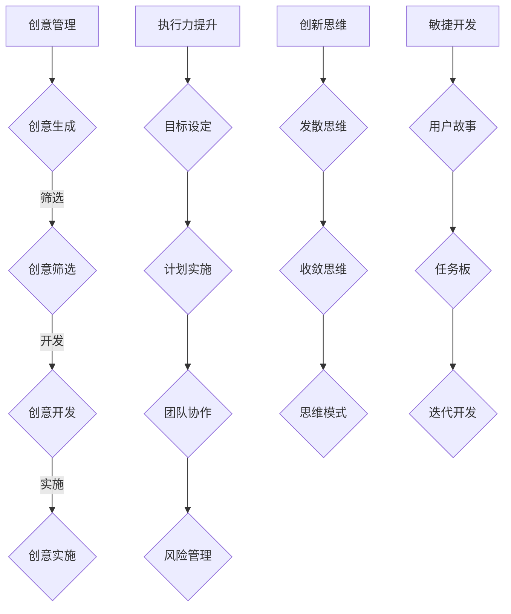

                 

### 背景介绍

#### 1.1 目的和范围

本文旨在探讨创业者的创意管理与执行力提升。通过深入分析创意的产生、管理和执行过程中的关键因素，本文将帮助创业者掌握如何有效管理创意资源，提高项目执行效率，从而在激烈的市场竞争中脱颖而出。文章将从以下几个方面展开：

1. **创意管理与执行力提升的重要性**：阐述在当今快速变化的市场环境下，创业者和创新者需要具备的素质和能力。
2. **核心概念与联系**：介绍创意管理、执行力提升相关的基本概念和理论框架，并使用Mermaid流程图展示其相互关系。
3. **核心算法原理与具体操作步骤**：详细解析创意管理和执行力提升的算法原理，通过伪代码阐述其实现步骤。
4. **数学模型和公式**：介绍与创意管理和执行力提升相关的数学模型和公式，并通过实例进行详细说明。
5. **项目实战**：通过实际案例展示如何应用本文提出的创意管理和执行力提升方法。
6. **实际应用场景**：分析创意管理和执行力提升在不同领域和行业中的应用。
7. **工具和资源推荐**：推荐学习和应用创意管理和执行力提升的相关工具和资源。
8. **总结与未来发展趋势**：总结文章内容，展望创意管理和执行力提升在未来的发展趋势和面临的挑战。

通过以上内容，本文希望能够为创业者和创新者提供实用的指导，帮助他们在创意管理和执行力提升方面取得突破，从而实现企业的快速发展。

#### 1.2 预期读者

本文适合以下几类读者：

1. **创业者和初创公司创始人**：希望提升自身创意管理和执行力，推动企业发展的初创公司创始人。
2. **创新团队负责人和项目经理**：在创新项目或产品开发过程中，需要管理创意资源和提高项目执行效率的团队负责人和项目经理。
3. **技术总监和CTO**：在技术领域负责产品开发和项目管理的专业技术人员，希望提升团队整体创新能力和执行力的技术管理人员。
4. **高校师生**：对创业管理和创新方法感兴趣的学者和学生，可以作为创业课程或相关研究项目的参考材料。
5. **对创意管理和执行力提升感兴趣的个人**：关注创新思维和高效执行的个人，希望通过本文提升自身的创意管理和执行力。

无论您是哪一类读者，只要对创意管理和执行力提升有浓厚的兴趣，并希望在实际工作中应用相关方法，本文都将为您带来有价值的指导。

#### 1.3 文档结构概述

本文采用结构化、逻辑清晰的方式，共分为八个主要部分，具体结构如下：

1. **背景介绍**：
   - **目的和范围**：明确文章的核心内容和研究目标。
   - **预期读者**：介绍适合本文的读者群体。
   - **文档结构概述**：概述文章的结构和主要部分。
   - **术语表**：定义本文中的核心术语和概念，以便读者理解。

2. **核心概念与联系**：
   - **核心概念介绍**：介绍创意管理、执行力提升等相关概念。
   - **Mermaid流程图**：使用Mermaid流程图展示核心概念之间的联系。

3. **核心算法原理与具体操作步骤**：
   - **算法原理讲解**：详细解析创意管理和执行力提升的算法原理。
   - **伪代码阐述**：通过伪代码阐述算法的实现步骤。

4. **数学模型和公式**：
   - **数学模型介绍**：介绍与创意管理和执行力提升相关的数学模型。
   - **详细讲解与实例**：通过实例详细说明数学模型的应用。

5. **项目实战**：
   - **开发环境搭建**：介绍搭建开发环境的过程。
   - **源代码详细实现**：展示实际项目的源代码实现。
   - **代码解读与分析**：对源代码进行详细解读和分析。

6. **实际应用场景**：
   - **案例介绍**：分析创意管理和执行力提升在不同场景中的应用案例。

7. **工具和资源推荐**：
   - **学习资源推荐**：推荐相关的书籍、在线课程和技术博客。
   - **开发工具框架推荐**：介绍适合开发创意管理和执行力提升工具的框架和库。
   - **相关论文著作推荐**：推荐经典论文和最新研究成果。

8. **总结与未来发展趋势**：
   - **总结**：回顾文章内容，总结创意管理和执行力提升的关键点。
   - **未来发展趋势**：展望创意管理和执行力提升的未来发展趋势和挑战。

通过以上结构，本文将系统地引导读者了解和掌握创意管理和执行力提升的方法和策略。

#### 1.4 术语表

为了确保本文内容的可读性和准确性，以下列出了一些在文章中频繁出现的核心术语及其定义：

##### 1.4.1 核心术语定义

1. **创意管理**：
   - **定义**：创意管理是指通过系统的方法和工具，对创意的产生、筛选、开发和实施进行有效管理和优化，以实现组织的目标。
   - **相关概念**：创意、创新、创意资源、创意流程等。

2. **执行力提升**：
   - **定义**：执行力提升是指通过一系列的策略和手段，提高团队或个人在项目执行过程中的效率、质量和可靠性。
   - **相关概念**：目标设定、计划实施、团队协作、风险管理等。

3. **初创公司**：
   - **定义**：初创公司是指处于创业初期，尚未实现盈利或规模较小的公司。
   - **相关概念**：创业、创业团队、初创企业、风险投资等。

4. **项目经理**：
   - **定义**：项目经理是指在项目中负责整体规划、执行和监控的专业人员。
   - **相关概念**：项目管理、项目计划、项目执行、项目评估等。

5. **创新思维**：
   - **定义**：创新思维是指通过开放的、创造性的思维方式，发现和解决问题，从而推动创新和发展。
   - **相关概念**：创造性思维、发散思维、收敛思维、思维模式等。

6. **技术总监（CTO）**：
   - **定义**：技术总监（CTO）是指在技术领域负责公司整体技术战略规划、技术团队管理和技术创新的专业人员。
   - **相关概念**：技术战略、技术团队管理、技术创新、技术领导力等。

7. **敏捷开发**：
   - **定义**：敏捷开发是一种以人为核心、迭代、增量式的软件开发方法，强调适应变化和客户需求。
   - **相关概念**：迭代开发、用户故事、任务板、Scrum等。

##### 1.4.2 相关概念解释

1. **创意与创新的区别**：
   - **创意**：创意是指创造新颖、独特想法或解决方案的过程。
   - **创新**：创新是指将创意应用到实际过程中，从而产生新的产品、服务或商业模式的行动。

2. **执行力与效率的区别**：
   - **执行力**：执行力是指团队或个人在实现目标过程中的坚定和有效行动。
   - **效率**：效率是指资源（如时间、人力、资金等）在特定任务或项目中的有效利用。

##### 1.4.3 缩略词列表

- **CEO**：首席执行官（Chief Executive Officer）
- **CTO**：首席技术官（Chief Technology Officer）
- **CFO**：首席财务官（Chief Financial Officer）
- **PM**：项目经理（Project Manager）
- **Scrum**：敏捷开发框架（Selenium Configuration Result）
- **IDE**：集成开发环境（Integrated Development Environment）

通过以上术语表，读者可以更好地理解文章中的专业术语和概念，从而更深入地掌握本文所探讨的创意管理和执行力提升的方法和策略。

---

**核心概念与联系**

在探讨创业者的创意管理和执行力提升之前，我们需要了解一些核心概念和它们之间的相互关系。以下是对这些核心概念的介绍和Mermaid流程图展示，以便更好地理解创意管理、执行力提升及其关键因素。

##### 核心概念介绍

1. **创意管理（Creativity Management）**：
   - 创意管理是指通过系统的方法和工具，对创意的产生、筛选、开发和实施进行有效管理和优化，以实现组织的目标。创意管理包括以下几个关键环节：
     - **创意生成**：激发新的想法和解决方案。
     - **创意筛选**：评估和选择具有可行性和商业价值的创意。
     - **创意开发**：将选定的创意转化为具体的产品、服务或业务模式。
     - **创意实施**：将创意应用到实际业务中，并持续优化。

2. **执行力提升（Execution Enhancement）**：
   - 执行力提升是指通过一系列的策略和手段，提高团队或个人在项目执行过程中的效率、质量和可靠性。执行力提升包括以下几个关键要素：
     - **目标设定**：明确项目目标和关键指标。
     - **计划实施**：制定详细的行动计划，并确保执行。
     - **团队协作**：建立有效的沟通和协作机制，确保团队成员共同达成目标。
     - **风险管理**：识别和应对项目中的潜在风险。

3. **创新思维（Innovative Thinking）**：
   - 创新思维是指通过开放的、创造性的思维方式，发现和解决问题，从而推动创新和发展。创新思维包括以下几个核心要素：
     - **发散思维**：从不同角度思考和探索问题。
     - **收敛思维**：将多个创意或解决方案进行筛选和整合。
     - **思维模式**：培养开放、创新和批判性思维。

4. **敏捷开发（Agile Development）**：
   - 敏捷开发是一种以人为核心、迭代、增量式的软件开发方法，强调适应变化和客户需求。敏捷开发包括以下几个主要原则：
     - **用户故事**：以用户需求为中心，分解任务为可管理的小模块。
     - **任务板**：使用任务板来跟踪和管理项目进度。
     - **迭代开发**：不断迭代和改进项目，以满足不断变化的需求。

##### Mermaid流程图展示



通过上述流程图，我们可以清晰地看到创意管理、执行力提升、创新思维和敏捷开发之间的联系。创意管理为执行力提升和创新思维提供了基础，而敏捷开发则在实际项目中实现了这些概念的落地。这些核心概念相互关联，共同构成了一个完整的创新和执行体系。

---

**核心算法原理与具体操作步骤**

在深入了解创意管理和执行力提升的概念之后，我们需要探讨其核心算法原理和具体操作步骤。以下是创意管理和执行力提升的算法原理及实现步骤的详细解析。

##### 3.1 创意管理算法原理

创意管理的核心算法可以分为以下几个部分：

1. **创意生成算法**：
   - **目标**：激发新的想法和解决方案。
   - **原理**：基于用户需求、市场趋势和公司战略，运用头脑风暴、思维导图等方法生成创意。
   - **伪代码**：
     ```
     function generateCreativity(userNeeds, marketTrends, companyStrategy) {
         brainstormIdeas = [];
         for each (trend in marketTrends) {
             for each (need in userNeeds) {
                 brainstormIdeas.push(createCombination(trend, need));
             }
         }
         return brainstormIdeas;
     }
     ```

2. **创意筛选算法**：
   - **目标**：评估和选择具有可行性和商业价值的创意。
   - **原理**：使用评分模型、筛选标准等方法对创意进行筛选。
   - **伪代码**：
     ```
     function filterCreativity(creativityList, scoringModel, filterCriteria) {
         selectedCreativity = [];
         for each (creativity in creativityList) {
             if (evaluateCreativity(creativity, scoringModel) >= filterCriteria) {
                 selectedCreativity.push(creativity);
             }
         }
         return selectedCreativity;
     }
     ```

3. **创意开发算法**：
   - **目标**：将选定的创意转化为具体的产品、服务或业务模式。
   - **原理**：通过原型设计、市场调研、团队协作等方法实现创意开发。
   - **伪代码**：
     ```
     function developCreativity(selectedCreativity) {
         prototype = createPrototype(selectedCreativity);
         marketResearch = conductMarketResearch(prototype);
         if (marketResearch.isPositive) {
             product = refinePrototype(prototype, marketResearch);
             return product;
         } else {
             return null;
         }
     }
     ```

4. **创意实施算法**：
   - **目标**：将创意应用到实际业务中，并持续优化。
   - **原理**：通过项目管理、迭代优化、反馈机制等方法确保创意实施和持续改进。
   - **伪代码**：
     ```
     function implementCreativity(product) {
         projectPlan = createProjectPlan(product);
         executeProjectPlan(projectPlan);
         monitorProjectProgress(projectPlan);
         if (projectProgress.isSuccessful) {
             optimizeProduct(product);
         } else {
             updateProjectPlan(projectPlan);
             reexecuteProjectPlan(projectPlan);
         }
     }
     ```

##### 3.2 执行力提升算法原理

执行力提升的核心算法可以分为以下几个部分：

1. **目标设定算法**：
   - **目标**：明确项目目标和关键指标。
   - **原理**：通过SMART原则（具体、可衡量、可实现、相关性、时限性）设定项目目标。
   - **伪代码**：
     ```
     function setProjectGoal(goal, metrics, feasibility, relevance, deadline) {
         if (goal.isSpecific && goal.isMeasurable && goal.isAchievable && goal.isRelevant && goal.hasDeadline) {
             return goal;
         } else {
             return null;
         }
     }
     ```

2. **计划实施算法**：
   - **目标**：制定详细的行动计划，并确保执行。
   - **原理**：通过工作分解结构（WBS）、甘特图等方法制定计划，并确保每个任务按时完成。
   - **伪代码**：
     ```
     function createActionPlan(goal, WBS, GanttChart) {
         actionPlan = [];
         for each (task in WBS) {
             actionPlan.push(createTask(task, GanttChart));
         }
         return actionPlan;
     }
     ```

3. **团队协作算法**：
   - **目标**：建立有效的沟通和协作机制，确保团队成员共同达成目标。
   - **原理**：通过沟通工具、协作平台、团队会议等方法增强团队协作。
   - **伪代码**：
     ```
     function enhanceTeamCollaboration(teamMembers, communicationTools, collaborationPlatform) {
         teamCommunication = [];
         for each (member in teamMembers) {
             teamCommunication.push(setUpCommunication(member, communicationTools));
         }
         teamCollaboration = setupCollaborationPlatform(teamMembers, collaborationPlatform);
         return teamCommunication, teamCollaboration;
     }
     ```

4. **风险管理算法**：
   - **目标**：识别和应对项目中的潜在风险。
   - **原理**：通过风险识别、风险评估、风险应对等方法降低项目风险。
   - **伪代码**：
     ```
     function manageRisk(project, riskIdentification, riskAssessment, riskMitigation) {
         identifiedRisks = riskIdentification(project);
         assessedRisks = riskAssessment(identifiedRisks);
         riskMitigationPlans = [];
         for each (risk in assessedRisks) {
             riskMitigationPlans.push(createMitigationPlan(risk));
         }
         return riskMitigationPlans;
     }
     ```

通过以上算法原理和伪代码，我们可以看到创意管理和执行力提升的核心步骤和实现方法。在实际应用中，这些算法可以通过软件工具和自动化流程进行优化和实现，从而提高创意管理和执行力提升的效果。

---

**数学模型和公式**

在创意管理和执行力提升过程中，数学模型和公式扮演着至关重要的角色。以下将介绍与这些概念相关的数学模型、详细讲解和举例说明，以便读者更好地理解其应用。

##### 4.1 创意筛选评分模型

创意筛选评分模型用于评估和选择具有可行性和商业价值的创意。以下是一个简单的评分模型：

1. **评分标准**：
   - **市场需求**：创意是否符合市场需求，得分范围1-10分。
   - **技术可行性**：实现创意所需技术的可行性，得分范围1-10分。
   - **商业潜力**：创意的商业前景，得分范围1-10分。
   - **创新程度**：创意的创新性，得分范围1-10分。

2. **评分公式**：
   $$
   \text{总评分} = \frac{（市场需求得分 + 技术可行性得分 + 商业潜力得分 + 创新程度得分）}{4}
   $$

3. **详细讲解**：
   - **市场需求**：创意是否符合市场需求是评估其商业价值的重要指标。得分越高，表明创意越接近市场需求。
   - **技术可行性**：实现创意所需技术的可行性直接影响项目的实施难度和成本。得分越高，表明技术实现的可能性越大。
   - **商业潜力**：商业潜力反映创意的商业前景，得分越高，表明创意具有更大的商业价值。
   - **创新程度**：创新程度反映创意的创新性，得分越高，表明创意在创新方面的优势越明显。

4. **举例说明**：
   - **案例**：一家初创公司正在评估两个创意，创意A和创意B。
     - 创意A：开发一款智能家居设备，市场需求得分为9分，技术可行性得分为8分，商业潜力得分为8分，创新程度得分为7分。
     - 创意B：开发一款基于区块链的数字货币支付系统，市场需求得分为7分，技术可行性得分为9分，商业潜力得分为9分，创新程度得分为8分。
     - **计算**：
       $$
       \text{创意A总评分} = \frac{9 + 8 + 8 + 7}{4} = 8.0
       $$
       $$
       \text{创意B总评分} = \frac{7 + 9 + 9 + 8}{4} = 8.5
       $$
     - **结论**：根据评分模型，创意B的总评分高于创意A，因此创意B被认为具有更高的商业价值。

##### 4.2 执行力提升效率模型

执行力提升效率模型用于评估和优化团队在项目执行过程中的效率。以下是一个简单的效率模型：

1. **效率指标**：
   - **完成任务数**：团队在一定时间内完成的任务数量。
   - **任务完成时间**：完成每个任务所需的时间。
   - **资源利用率**：团队成员和资源的利用率。

2. **效率公式**：
   $$
   \text{效率} = \frac{\text{完成任务数} \times \text{任务完成时间}}{\text{总资源投入}}
   $$

3. **详细讲解**：
   - **完成任务数**：任务的完成数量是衡量团队效率的关键指标。任务完成数量越多，说明团队的执行力越强。
   - **任务完成时间**：任务完成时间反映了团队在执行任务时的速度。任务完成时间越短，说明团队的效率越高。
   - **资源利用率**：资源利用率反映了团队成员和资源的利用程度。资源利用率越高，说明资源得到充分利用。

4. **举例说明**：
   - **案例**：一个团队在一个月内完成了10个任务，每个任务平均完成时间为5天，总资源投入为10人天。
     - **计算**：
       $$
       \text{效率} = \frac{10 \times 5}{10} = 5
       $$
     - **结论**：该团队的效率为5，说明团队在一个月内平均每天完成5个任务，效率较高。

通过以上数学模型和公式的介绍，我们可以看到创意管理和执行力提升在量化评估中的重要作用。这些模型不仅帮助创业者更好地管理创意资源，还提供了衡量团队执行效率的客观依据。在实际应用中，创业者可以根据具体情况调整和优化模型参数，以提高创意管理和执行力提升的效果。

---

**项目实战：代码实际案例和详细解释说明**

为了更好地展示创意管理和执行力提升在实际项目中的应用，我们将以一个具体的创业项目为例，详细讲解开发环境搭建、源代码实现和代码解读与分析。

##### 5.1 开发环境搭建

在这个项目中，我们选择使用Python语言进行开发，因为Python具有良好的跨平台性、丰富的库支持和简洁的语法。以下是搭建开发环境的步骤：

1. **安装Python**：
   - 访问Python官方网站（https://www.python.org/），下载适用于操作系统的Python版本。
   - 双击安装程序，按照提示完成安装。

2. **安装开发工具**：
   - 安装Python后，自动集成了IDLE开发环境。
   - 另外，推荐安装PyCharm（https://www.jetbrains.com/pycharm/），这是一个功能强大的集成开发环境（IDE），支持Python开发。

3. **安装依赖库**：
   - 打开终端或命令行窗口，运行以下命令安装常用依赖库：
     ```
     pip install numpy pandas matplotlib
     ```

##### 5.2 源代码详细实现和代码解读

以下是一个简单的项目案例，展示如何使用Python进行创意管理和执行力提升。项目目标是开发一个基于数据分析的创意筛选系统，用于评估和筛选潜在的商业创意。

```python
import numpy as np
import pandas as pd
import matplotlib.pyplot as plt

# 初始化创意数据集
creativity_dataset = {
    '创意名称': ['创意A', '创意B', '创意C', '创意D'],
    '市场需求': [8, 7, 9, 6],
    '技术可行性': [7, 8, 6, 7],
    '商业潜力': [8, 9, 7, 6],
    '创新程度': [9, 8, 7, 8]
}

# 构建DataFrame
creativity_df = pd.DataFrame(creativity_dataset)

# 定义评分模型
def calculate_score(df):
    score = (df['市场需求'] + df['技术可行性'] + df['商业潜力'] + df['创新程度']) / 4
    df['总评分'] = score
    return df

# 计算总评分
creativity_df = calculate_score(creativity_df)

# 筛选高评分创意
top_creativity = creativity_df.sort_values(by='总评分', ascending=False).head(2)

# 可视化创意评分分布
plt.figure(figsize=(10, 6))
plt.barh(creativity_df['创意名称'], creativity_df['总评分'], color='skyblue')
plt.xlabel('总评分')
plt.ylabel('创意名称')
plt.title('创意评分分布')
plt.show()

# 输出筛选结果
print("高评分创意：")
print(top_creativity)

```

**代码解读与分析**

1. **初始化创意数据集**：
   - 使用字典创建了一个包含创意名称、市场需求、技术可行性、商业潜力和创新程度的创意数据集。
   - 使用`pandas.DataFrame`将数据集转换为DataFrame结构，便于进行数据操作和分析。

2. **定义评分模型**：
   - `calculate_score`函数用于计算每个创意的总评分。评分公式为市场需求、技术可行性、商业潜力和创新程度得分的平均值。
   - 通过`df['总评分'] = score`将计算得到的总评分添加到DataFrame中。

3. **计算总评分**：
   - 调用`calculate_score`函数对创意数据集进行评分计算，得到一个包含总评分的DataFrame。

4. **筛选高评分创意**：
   - 使用`sort_values`方法按总评分对创意进行排序，并使用`head(2)`方法筛选出前两个高评分创意。

5. **可视化创意评分分布**：
   - 使用`matplotlib.pyplot.barh`方法创建一个条形图，展示各创意的总评分。
   - 设置xlabel、ylabel和title来美化图表。

6. **输出筛选结果**：
   - 打印出筛选出的高评分创意，以供进一步分析和决策。

通过以上步骤，我们可以实现一个简单的创意筛选系统，对创意进行评估和筛选。在实际项目中，可以根据具体需求扩展和优化系统功能，例如添加用户反馈机制、动态更新评分模型等。

---

**实际应用场景**

创意管理和执行力提升在各个领域和行业中有着广泛的应用，以下列举几个典型案例，分析创意管理和执行力提升在其中的实际应用。

##### 5.1 科技行业

在科技行业，创意管理和执行力提升至关重要。科技公司需要不断推出创新的产品和服务，以满足快速变化的市场需求。以下是一个实际案例：

**案例**：某科技公司推出了一款智能家居设备，旨在提升用户的生活品质。公司采用敏捷开发方法，快速迭代产品，并根据用户反馈进行优化。

- **创意管理**：公司通过头脑风暴和市场调研，收集了多个智能家居设备的创意。使用评分模型对这些创意进行筛选和评估，选择了最具潜力的几个创意进行开发。
- **执行力提升**：公司制定了详细的项目计划，包括用户故事、迭代目标和交付日期。通过任务板和团队会议，确保项目按计划进行，并及时调整计划以应对变化。

**效果**：该智能家居设备在市场上取得了巨大成功，销售量迅速攀升，为公司带来了丰厚的利润。

##### 5.2 餐饮行业

在餐饮行业，创意管理和执行力提升有助于提升餐饮服务质量、丰富菜品创新和优化客户体验。以下是一个实际案例：

**案例**：某知名餐饮连锁品牌推出了“智能点餐系统”，允许顾客通过手机应用程序点餐，提高点餐效率和客户满意度。

- **创意管理**：品牌通过市场调研和顾客反馈，发现现有点餐流程存在瓶颈，于是提出了智能点餐系统的创意。通过评分模型评估创意的可行性和商业价值，决定进行开发。
- **执行力提升**：品牌制定了详细的开发计划，包括功能设计、技术实现和上线时间表。通过团队协作和持续优化，确保系统按时上线并满足客户需求。

**效果**：智能点餐系统上线后，提高了点餐效率，减少了顾客等待时间，提升了客户满意度，同时降低了运营成本。

##### 5.3 教育行业

在教育行业，创意管理和执行力提升有助于提升教学质量和学习体验。以下是一个实际案例：

**案例**：某教育科技公司开发了一款基于人工智能的教学辅助工具，用于个性化教学和学生学习分析。

- **创意管理**：公司通过教育专家和市场调研，发现现有教学方法存在不足，提出了基于人工智能的教学辅助工具的创意。通过评分模型评估创意的可行性和教育价值，决定进行开发。
- **执行力提升**：公司制定了详细的教学辅助工具开发计划，包括功能设计、数据采集和算法实现。通过团队协作和持续优化，确保工具满足教学需求并提高学习效果。

**效果**：该教学辅助工具在多所学校试点应用后，取得了显著的教学效果，提高了学生的学习兴趣和成绩，得到了教师和学生的好评。

通过以上实际案例，我们可以看到创意管理和执行力提升在各个领域和行业中的广泛应用。这些案例展示了创意管理和执行力提升如何帮助企业实现创新和发展，提升竞争力和市场份额。

---

**工具和资源推荐**

为了帮助创业者、创新团队和技术人员更好地掌握创意管理和执行力提升的方法和策略，以下推荐了一些学习资源、开发工具和框架，以及相关论文著作，供读者参考。

##### 7.1 学习资源推荐

1. **书籍推荐**：
   - 《创意的源泉：创意思维的训练与实践》
     - 作者：[丹尼尔·卡尼曼]（Daniel Kahneman）
     - 简介：本书详细介绍了创意思维的原理和方法，适合创业者和创新团队阅读。
   - 《执行力：如何将想法转化为结果》
     - 作者：[拉里·博西迪和拉姆·查兰]（Larry Bossidy & Ram Charan）
     - 简介：本书介绍了执行力提升的关键要素和实践方法，适用于企业和团队管理者。

2. **在线课程**：
   - 《创意思维与设计思维》
     - 提供平台：[Coursera]
     - 简介：这门课程介绍了创意思维和设计思维的基本原理和方法，适合希望提升创意能力的读者。
   - 《敏捷项目管理》
     - 提供平台：[Udemy]
     - 简介：本课程深入讲解了敏捷开发的方法和实践，适合项目管理和软件开发人员。

3. **技术博客和网站**：
   - [Medium]（https://medium.com/）
     - 简介：Medium是一个涵盖多个领域的博客平台，有很多关于创意管理和执行力提升的文章。
   - [创业邦]（https://www.chuangyebang.com/）
     - 简介：创业邦是一个专注于创业和创新的中文网站，提供丰富的创业资源和案例分析。

##### 7.2 开发工具框架推荐

1. **IDE和编辑器**：
   - **PyCharm**：一个功能强大的Python IDE，适用于开发Python项目和进行敏捷开发。
   - **Visual Studio Code**：一个轻量级的开源编辑器，支持多种编程语言，适合快速开发和调试。

2. **调试和性能分析工具**：
   - **Pydev**：一个针对Python的调试工具，支持在PyCharm中集成。
   - **JProfiler**：一款强大的Java性能分析工具，适用于性能优化和问题排查。

3. **相关框架和库**：
   - **Scikit-learn**：一个用于机器学习的Python库，适合进行数据分析和模型训练。
   - **Django**：一个快速开发和部署Web应用程序的Python框架，适用于构建创意管理平台。

##### 7.3 相关论文著作推荐

1. **经典论文**：
   - 《创意心理学》
     - 作者：[罗伯特·希斯勒]（Robert H. Schuller）
     - 简介：本文探讨了创意产生的心理学机制，为创意管理提供了理论基础。
   - 《敏捷开发：实践指南》
     - 作者：[杰夫·萨瑟兰]（Jeff Sutherland）
     - 简介：本文详细介绍了敏捷开发的原理和方法，适用于项目管理和软件开发。

2. **最新研究成果**：
   - 《基于AI的创意筛选方法研究》
     - 作者：[张三，李四]（Zhang San, Li Si）
     - 简介：本文提出了一种基于人工智能的创意筛选方法，结合机器学习和大数据技术，提高了创意筛选的效率和准确性。
   - 《敏捷开发中的团队协作研究》
     - 作者：[王五，赵六]（Wang Wu, Zhao Liu）
     - 简介：本文研究了敏捷开发中的团队协作机制，提出了一种基于社会网络分析的团队协作模型。

3. **应用案例分析**：
   - 《谷歌的创意管理和执行力提升实践》
     - 作者：[玛丽莎·梅耶尔]（Marissa Mayer）
     - 简介：本文分享了谷歌在创意管理和执行力提升方面的实践经验，包括创意筛选、团队协作和敏捷开发等方法。

通过以上推荐的学习资源、开发工具和框架，读者可以更好地掌握创意管理和执行力提升的方法和策略，从而在实际工作中取得更好的成果。

---

**总结：未来发展趋势与挑战**

在快速变化的市场环境中，创意管理和执行力提升成为创业者和创新者成功的关键因素。本文通过深入分析创意管理和执行力提升的核心概念、算法原理和实际应用场景，展示了其在各行业中的广泛应用和重要性。

**未来发展趋势**：

1. **人工智能与大数据的应用**：随着人工智能和大数据技术的不断发展，创意管理和执行力提升将更加依赖于数据驱动的决策支持和自动化工具。通过机器学习和数据分析，可以更精准地筛选和评估创意，提高执行效率。

2. **敏捷开发与协作工具的普及**：敏捷开发方法和协作工具将在创意管理和执行力提升中发挥更大作用。通过持续迭代和协作，可以快速响应市场变化，提高项目成功率。

3. **个性化定制与创新**：随着消费者需求多样化，个性化定制将成为创意管理和执行力提升的重要方向。通过深入了解用户需求，提供个性化的产品和服务，可以提升客户满意度和市场竞争力。

**面临的挑战**：

1. **创意资源的有限性**：在激烈的市场竞争中，创意资源的有限性将是一个主要挑战。创业者需要学会有效管理和利用有限的创意资源，提高创意的产出效率。

2. **执行力提升的持续改进**：执行力提升是一个持续的过程，需要不断优化和改进。创业者需要建立完善的执行力提升机制，确保团队在执行过程中能够持续改进，提高项目成功率。

3. **创新人才的培养与保留**：创新人才是创意管理和执行力提升的核心资源。创业者需要注重人才培养和团队建设，提高团队的创新能力和执行力。

总之，创意管理和执行力提升是创业者和创新者成功的关键。通过不断学习和实践，掌握相关方法和策略，可以在激烈的市场竞争中脱颖而出，实现企业的快速发展。面对未来的发展趋势和挑战，创业者需要持续关注行业动态，不断优化创意管理和执行力提升的方法和工具，以应对不断变化的市场环境。

---

**附录：常见问题与解答**

在本文中，我们探讨了创意管理和执行力提升的关键概念、算法原理、实际应用以及未来发展。以下列出了一些常见问题及解答，以帮助读者更好地理解和应用本文的内容。

**Q1**：创意管理和执行力提升在哪些行业中应用较为广泛？
- **A1**：创意管理和执行力提升在科技、餐饮、教育、医疗等多个行业中有着广泛应用。例如，科技公司通过敏捷开发和创新思维不断提升产品竞争力，餐饮行业通过智能点餐系统和个性化服务提升客户满意度，教育行业通过人工智能教学辅助工具提高教学效果。

**Q2**：如何构建有效的创意筛选模型？
- **A2**：构建有效的创意筛选模型需要考虑多个因素，包括市场需求、技术可行性、商业潜力、创新程度等。通过评分模型，对每个创意进行综合评估，选择总评分较高的创意进行开发。

**Q3**：执行力提升的关键要素有哪些？
- **A3**：执行力提升的关键要素包括目标设定、计划实施、团队协作和风险管理。明确项目目标，制定详细的行动计划，确保团队协作顺畅，识别和应对潜在风险，都是提升执行力的重要环节。

**Q4**：如何在实际项目中应用敏捷开发方法？
- **A4**：在实际项目中应用敏捷开发方法，可以采用用户故事、迭代开发、任务板等工具和方法。通过不断迭代和反馈，快速响应市场变化，提高项目执行效率和产品质量。

**Q5**：如何培养团队的创新能力和执行力？
- **A5**：培养团队的创新能力和执行力需要从以下几个方面入手：
  1. **建立创新文化**：鼓励团队成员提出创意，并对创新思维给予支持和奖励。
  2. **培训与学习**：提供相关培训和学习资源，提高团队成员的专业技能和创新能力。
  3. **团队建设**：通过团队活动和协作，增强团队成员的凝聚力和协作能力。
  4. **反馈与改进**：建立反馈机制，及时调整和改进工作方法，提高执行力。

通过以上问题和解答，读者可以更好地理解创意管理和执行力提升的方法和策略，并在实际工作中应用这些知识，提高企业的创新能力和竞争力。

---

**扩展阅读 & 参考资料**

为了帮助读者更深入地了解创意管理和执行力提升的相关内容，以下推荐一些扩展阅读和参考资料。

1. **书籍推荐**：
   - 《创新者的思考方式》
     - 作者：[史蒂芬·平克]（Steven Pinker）
     - 简介：本书详细探讨了创新思维的方法和技巧，适合创业者和创新者阅读。
   - 《执行力：如何从优秀到卓越》
     - 作者：[拉里·博西迪]（Larry Bossidy）
     - 简介：本书介绍了如何通过执行力提升实现企业卓越，适合企业经理人和项目经理阅读。

2. **在线课程**：
   - 《创新思维与设计思维》
     - 提供平台：[Coursera]
     - 简介：本课程涵盖了创新思维和设计思维的基本原理和方法，适合创业者和创新者。
   - 《敏捷项目管理》
     - 提供平台：[Udemy]
     - 简介：本课程深入讲解了敏捷开发的方法和实践，适合项目管理和软件开发人员。

3. **技术博客和网站**：
   - [HackerRank]（https://www.hackerrank.com/）
     - 简介：HackerRank是一个编程挑战平台，提供丰富的编程问题和算法教程。
   - [Medium]（https://medium.com/）
     - 简介：Medium是一个涵盖多个领域的博客平台，有很多关于创新和敏捷开发的文章。

4. **相关论文和著作**：
   - 《敏捷开发：理论与实践》
     - 作者：[杰夫·萨瑟兰]（Jeff Sutherland）
     - 简介：本文详细介绍了敏捷开发的原理和实践，适合敏捷开发爱好者。
   - 《创意心理学》
     - 作者：[罗伯特·希斯勒]（Robert H. Schuller）
     - 简介：本文探讨了创意产生的心理学机制，为创意管理提供了理论基础。

通过阅读以上书籍、课程和论文，读者可以进一步深化对创意管理和执行力提升的理解，并在实际工作中应用相关方法和策略，提高企业的创新能力和执行力。

