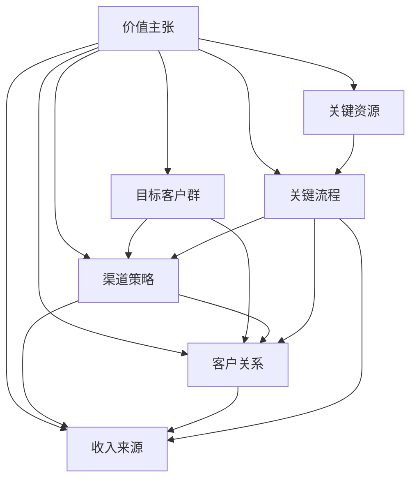

                 

# 创业者的商业模式创新与迭代

> 关键词：商业模式、创新、迭代、创业、战略规划、市场分析

> 摘要：本文旨在探讨创业者在商业模式创新与迭代过程中的关键要素和方法，通过深入分析商业模式的核心概念、创新策略及实施步骤，帮助创业者构建可持续发展的商业模型。文章将结合实际案例，提供实用的工具和资源推荐，帮助读者在创业道路上取得成功。

## 1. 背景介绍

### 1.1 目的和范围

本文旨在为创业者提供一个关于商业模式创新与迭代的全面指导。我们将深入探讨商业模式的定义、核心要素，以及如何在竞争激烈的市场环境中实现商业模式的创新与迭代。通过本文的学习，创业者可以更好地理解商业模式的本质，掌握创新与迭代的方法，从而在创业过程中取得成功。

### 1.2 预期读者

本文主要面向以下几类读者：

1. 初创企业的创始人或核心团队成员
2. 拥有创业梦想，希望进入创业领域的人群
3. 希望提升自身商业敏锐度和创业能力的专业人士

### 1.3 文档结构概述

本文结构如下：

1. 引言：介绍商业模式的定义和重要性
2. 核心概念与联系：分析商业模式的核心要素及其相互关系
3. 核心算法原理与具体操作步骤：讲解商业模式创新的策略和方法
4. 数学模型和公式：探讨商业模式迭代过程中涉及到的关键数学模型和公式
5. 项目实战：通过实际案例展示商业模式创新与迭代的过程
6. 实际应用场景：分析商业模式在不同行业中的应用与挑战
7. 工具和资源推荐：介绍有助于商业模式创新与迭代的学习资源和开发工具
8. 总结：展望商业模式创新与迭代未来的发展趋势与挑战
9. 附录：常见问题与解答
10. 扩展阅读与参考资料

### 1.4 术语表

#### 1.4.1 核心术语定义

- 商业模式：企业为实现价值创造、传递和获取所采取的一套系统化、结构化的方法和策略。
- 创新策略：指企业在竞争环境中，通过创新手段提高核心竞争力，实现商业模式优化和升级的方法。
- 迭代：指对商业模式进行不断改进和优化的过程。

#### 1.4.2 相关概念解释

- 市场需求分析：对目标市场的需求进行深入研究，包括市场规模、增长趋势、用户需求特征等。
- 竞争对手分析：对同行业内的竞争对手进行综合评估，包括产品、市场份额、优势与劣势等。
- 价值链：指企业内部各个环节之间的价值传递过程，包括供应商、生产、销售等各个环节。

#### 1.4.3 缩略词列表

- ROI：投资回报率
- SWOT：优势、劣势、机会、威胁
- VRIO：价值、稀缺性、不可模仿性、组织能力

## 2. 核心概念与联系

### 2.1 商业模式的核心概念

商业模式的核心概念包括：

- **价值主张**：明确企业为客户创造的价值和提供的产品或服务。
- **目标客户群**：企业所服务的客户群体，包括市场需求、消费能力和购买意愿等。
- **渠道策略**：企业如何将产品或服务传递给目标客户，包括销售、营销和客户服务等。
- **客户关系**：企业如何与客户建立和维护长期稳定的合作关系。
- **收入来源**：企业如何从客户获取收入，包括定价策略、支付方式等。
- **关键资源**：企业运营所需的核心资源，如人力资源、财务资源、技术资源等。
- **关键流程**：企业为实现商业模式正常运行所需要的关键流程，如研发、生产、销售等。

### 2.2 商业模式的核心要素及其关系

商业模式的核心要素及其关系可以用以下 Mermaid 流程图表示：



### 2.3 商业模式创新与迭代

商业模式创新与迭代的核心目标是提高企业的竞争力，实现商业模式的持续优化。创新与迭代的方法包括：

1. **市场需求分析**：通过深入研究市场需求，了解客户需求变化，从而调整价值主张和渠道策略。
2. **竞争对手分析**：分析竞争对手的商业模式，发现自身优势与劣势，制定相应的创新策略。
3. **价值链优化**：对企业的价值链进行优化，提高资源利用效率和业务流程的灵活性。
4. **客户关系管理**：加强客户关系管理，提高客户满意度和忠诚度，从而增加收入来源。

## 3. 核心算法原理 & 具体操作步骤

### 3.1 商业模式创新策略

商业模式创新的核心在于找到新的价值主张和收入来源，以下是几种常见的商业模式创新策略：

1. **蓝海战略**：寻找未被竞争者占领的市场空间，创造新的需求和市场。
   ```python
   def blue_ocean_strategy():
       # 研究市场需求
       # 发掘未被满足的客户需求
       # 创造新的产品或服务
       # 构建新的商业模式
   ```

2. **颠覆性创新**：通过创新技术或产品，颠覆现有市场格局。
   ```python
   def disruptive_innovation():
       # 研究现有技术或产品的缺陷
       # 开发更具竞争力的新产品或技术
       # 重新定义市场规则
       # 构建新的商业模式
   ```

3. **模式迁移**：将一种成功的商业模式从一个行业或领域迁移到另一个行业或领域。
   ```python
   def model_migration():
       # 研究目标行业的市场需求和竞争状况
       # 分析成功商业模式的要素和优势
       # 将成功模式迁移到目标行业
       # 调整和优化商业模式
   ```

### 3.2 商业模式迭代过程

商业模式迭代是指在原有商业模式基础上，通过不断优化和改进，实现商业模式的持续发展和升级。以下是商业模式迭代的具体操作步骤：

1. **需求分析**：分析市场需求和客户需求，了解客户痛点，为商业模式迭代提供方向。
   ```python
   def demand_analysis():
       # 收集市场需求数据
       # 分析客户需求
       # 确定客户痛点
       # 确定商业模式迭代方向
   ```

2. **竞争对手分析**：分析竞争对手的商业策略和市场表现，了解竞争对手的优势和劣势，为商业模式迭代提供参考。
   ```python
   def competitor_analysis():
       # 收集竞争对手信息
       # 分析竞争对手策略
       # 确定自身优势和劣势
       # 制定针对性的迭代策略
   ```

3. **价值链优化**：对企业的价值链进行优化，提高资源利用效率和业务流程的灵活性。
   ```python
   def value_chain_optimization():
       # 识别价值链中的瓶颈
       # 优化业务流程
       # 提高资源利用率
       # 降低成本
   ```

4. **客户关系管理**：加强客户关系管理，提高客户满意度和忠诚度，从而增加收入来源。
   ```python
   def customer_relationship_management():
       # 分析客户需求和反馈
       # 提供个性化的产品和服务
       # 加强与客户的沟通和互动
       # 提高客户满意度和忠诚度
   ```

5. **商业模式验证**：通过市场测试和用户反馈，验证商业模式的有效性和可行性。
   ```python
   def business_model_validation():
       # 进行市场测试
       # 收集用户反馈
       # 分析市场表现和用户满意度
       # 调整和优化商业模式
   ```

## 4. 数学模型和公式 & 详细讲解 & 举例说明

### 4.1 ROI 计算模型

ROI（投资回报率）是衡量商业模式优劣的重要指标。其计算公式如下：

\[ ROI = \frac{净利润}{总投资} \times 100\% \]

其中，净利润为企业在一定周期内的利润总额，总投资为企业在该周期内的投资总额。

#### 举例说明：

某创业公司在一年内实现了100万元的净利润，总投资为500万元。则其ROI为：

\[ ROI = \frac{100万元}{500万元} \times 100\% = 20\% \]

#### 分析：

该ROI表明，该公司的投资回报率为20%，说明其商业模式在投资方面具有一定的盈利能力。

### 4.2 SWOT 分析模型

SWOT分析是一种用于评估企业优势、劣势、机会和威胁的数学模型。其公式如下：

\[ SWOT = S + W + O + T \]

其中，S代表优势（Strengths），W代表劣势（Weaknesses），O代表机会（Opportunities），T代表威胁（Threats）。

#### 举例说明：

以某初创企业为例，进行SWOT分析：

- S（优势）：拥有独特的技术创新、高效的团队和良好的市场口碑。
- W（劣势）：市场推广经验不足，资金有限。
- O（机会）：目标市场广阔，行业前景良好。
- T（威胁）：竞争对手众多，技术更新速度快。

通过SWOT分析，企业可以更好地了解自身的优势和劣势，抓住市场机会，应对潜在威胁。

### 4.3 VRIO 分析模型

VRIO分析是一种用于评估企业资源优势的数学模型。其公式如下：

\[ VRIO = V \times R \times I \times O \]

其中，V代表价值（Value），R代表稀缺性（Rarity），I代表不可模仿性（Imitability），O代表组织能力（Organization）。

#### 举例说明：

以某科技公司的核心技术为例，进行VRIO分析：

- V（价值）：核心技术为公司带来了竞争优势和较高的利润。
- R（稀缺性）：核心技术具有稀缺性，市场上难以找到替代品。
- I（不可模仿性）：核心技术具有很高的技术门槛，难以被竞争对手模仿。
- O（组织能力）：公司具备强大的研发能力和创新能力，能够持续优化核心技术。

通过VRIO分析，企业可以更好地识别自身的核心竞争力，制定相应的战略规划。

## 5. 项目实战：代码实际案例和详细解释说明

### 5.1 开发环境搭建

在开始项目实战之前，我们需要搭建一个合适的开发环境。以下是所需的软件和工具：

- **操作系统**：Windows/Linux/MacOS
- **编程语言**：Python
- **开发工具**：PyCharm/Visual Studio Code
- **数据库**：MySQL/PostgreSQL
- **云服务**：AWS/Google Cloud Platform

### 5.2 源代码详细实现和代码解读

以下是一个简单的示例，展示如何使用Python实现一个基于客户关系管理的商业模式创新项目。

```python
# 客户关系管理（CRM）系统示例

import pymysql

# 连接数据库
def connect_database():
    db = pymysql.connect(
        host='localhost',
        user='root',
        password='password',
        database='crm'
    )
    return db

# 添加客户信息
def add_customer(db, customer_info):
    cursor = db.cursor()
    sql = "INSERT INTO customers (name, age, email, phone) VALUES (%s, %s, %s, %s)"
    try:
        cursor.execute(sql, customer_info)
        db.commit()
    except Exception as e:
        db.rollback()
        print("Error: ", e)
    finally:
        cursor.close()

# 查询客户信息
def search_customer(db, customer_id):
    cursor = db.cursor()
    sql = "SELECT * FROM customers WHERE id = %s"
    try:
        cursor.execute(sql, (customer_id,))
        result = cursor.fetchone()
        return result
    except Exception as e:
        print("Error: ", e)
    finally:
        cursor.close()

# 更新客户信息
def update_customer(db, customer_id, customer_info):
    cursor = db.cursor()
    sql = "UPDATE customers SET name=%s, age=%s, email=%s, phone=%s WHERE id = %s"
    try:
        cursor.execute(sql, (customer_info['name'], customer_info['age'], customer_info['email'], customer_info['phone'], customer_id))
        db.commit()
    except Exception as e:
        db.rollback()
        print("Error: ", e)
    finally:
        cursor.close()

# 删除客户信息
def delete_customer(db, customer_id):
    cursor = db.cursor()
    sql = "DELETE FROM customers WHERE id = %s"
    try:
        cursor.execute(sql, (customer_id,))
        db.commit()
    except Exception as e:
        db.rollback()
        print("Error: ", e)
    finally:
        cursor.close()

# 主函数
def main():
    db = connect_database()
    customer_info = {'name': '张三', 'age': 30, 'email': 'zhangsan@example.com', 'phone': '13800138000'}
    
    # 添加客户
    add_customer(db, customer_info)
    
    # 查询客户
    customer = search_customer(db, 1)
    if customer:
        print("查询结果：", customer)
    
    # 更新客户信息
    customer_info['age'] = 31
    update_customer(db, 1, customer_info)
    
    # 删除客户
    delete_customer(db, 1)

    db.close()

if __name__ == '__main__':
    main()
```

#### 5.3 代码解读与分析

该示例代码实现了一个简单的客户关系管理（CRM）系统，主要包括以下功能：

1. **连接数据库**：使用pymysql模块连接MySQL数据库，并创建一个名为`customers`的表，用于存储客户信息。

2. **添加客户信息**：定义`add_customer`函数，用于向数据库中添加客户信息。函数接受一个`customer_info`参数，包含客户的姓名、年龄、电子邮件和电话号码。

3. **查询客户信息**：定义`search_customer`函数，用于根据客户ID查询数据库中的客户信息。

4. **更新客户信息**：定义`update_customer`函数，用于更新数据库中的客户信息。函数接受一个`customer_id`和一个`customer_info`参数，分别表示要更新的客户ID和新的客户信息。

5. **删除客户信息**：定义`delete_customer`函数，用于删除数据库中的客户信息。函数接受一个`customer_id`参数，表示要删除的客户ID。

6. **主函数**：定义`main`函数，用于演示CRM系统的基本功能。在主函数中，首先连接数据库，然后添加、查询、更新和删除客户信息。

通过该示例代码，创业者可以了解如何使用编程语言实现商业需求，从而提高商业模式的可行性和竞争力。

### 5.4 项目实战总结

通过以上示例，创业者可以了解到如何将商业模式创新与迭代的思想应用于实际项目中。在实际开发过程中，创业者需要根据市场需求和客户反馈，不断调整和优化商业模式，以提高项目的成功率和市场竞争力。同时，创业者还需要掌握一定的编程技能，以便在项目中实现商业需求。

## 6. 实际应用场景

商业模式创新与迭代在各个行业中都有着广泛的应用，以下列举几个典型应用场景：

### 6.1 互联网行业

在互联网行业，商业模式创新与迭代尤为重要。以阿里巴巴为例，其通过不断探索新的商业模式，实现了从电商到云计算、金融科技等领域的多元化发展。阿里巴巴通过投资和并购，快速拓展了业务范围，提升了市场竞争力。

### 6.2 制造业

在制造业，商业模式创新与迭代有助于企业实现智能制造和数字化转型。以华为为例，其通过引入物联网、大数据和人工智能技术，打造了“智能制造+服务”的商业模式，提高了生产效率和质量。

### 6.3 零售业

在零售业，商业模式创新与迭代有助于企业实现线上线下融合和智能化运营。以京东为例，其通过自营和平台模式相结合，实现了线上线下的全面覆盖，并通过大数据和人工智能技术，提升了用户体验和运营效率。

### 6.4 健康医疗行业

在健康医疗行业，商业模式创新与迭代有助于企业实现创新药物研发和精准医疗。以药明康德为例，其通过技术创新和商业模式创新，实现了从传统制药企业向创新药研发企业的转型，提高了企业的核心竞争力。

### 6.5 教育行业

在教育行业，商业模式创新与迭代有助于企业实现在线教育和个性化学习。以网易云课堂为例，其通过在线直播、录播和互动教学等多种形式，为学生提供了丰富的学习资源，实现了教育模式的创新和升级。

## 7. 工具和资源推荐

### 7.1 学习资源推荐

#### 7.1.1 书籍推荐

- 《创新者的窘境》：作者克莱顿·克里斯坦森，阐述创新者如何突破困境，实现商业模式的创新。
- 《精益创业》：作者埃里克·莱斯，介绍精益创业方法论，帮助创业者快速验证和迭代商业模式。
- 《商业模式新生代》：作者斯蒂芬·霍夫，系统阐述了商业模式的构建和创新方法。

#### 7.1.2 在线课程

- Coursera上的《商业模式创新》：由斯坦福大学提供，教授商业模式创新的理论和实践方法。
- Udemy上的《从零开始构建商业模式》：教授如何从零开始构建、评估和优化商业模式。
- LinkedIn Learning上的《商业模式设计与创新》：介绍商业模式设计的基本原则和创新方法。

#### 7.1.3 技术博客和网站

- HBR.org：哈佛商业评论官方网站，提供关于商业模式创新的理论和实践文章。
- Entrepreneur.com：创业者网站，分享成功的创业经验和商业模式案例。
- Medium上的《Business & Entrepreneurship》专题：介绍商业模式创新、创业策略等相关内容。

### 7.2 开发工具框架推荐

#### 7.2.1 IDE和编辑器

- PyCharm：适用于Python开发的集成开发环境，功能强大，支持多种编程语言。
- Visual Studio Code：轻量级跨平台代码编辑器，支持多种编程语言，插件丰富。
- IntelliJ IDEA：适用于Java开发的集成开发环境，功能全面，支持多种编程语言。

#### 7.2.2 调试和性能分析工具

- JMeter：适用于性能测试的开源工具，可以模拟大量并发用户，评估系统性能。
- New Relic：适用于应用性能管理的云服务，实时监测应用的性能和健康状态。
- AppDynamics：适用于企业级应用性能管理的解决方案，提供深入的性能分析和诊断功能。

#### 7.2.3 相关框架和库

- Django：适用于Python的Web开发框架，支持快速开发和部署。
- Flask：适用于Python的轻量级Web开发框架，灵活性强，适用于小型项目和快速原型开发。
- Spring Boot：适用于Java的Web开发框架，支持快速开发和部署，功能丰富。

### 7.3 相关论文著作推荐

#### 7.3.1 经典论文

- “Business Model for the Internet Era”（互联网时代的商业模式）：作者克里斯·赞恩伯格，阐述互联网时代的商业模式创新。
- “The Business Model Canvas”（商业模式画布）：作者亚历山大·奥斯特瓦尔德，介绍商业模式画布工具的使用方法。

#### 7.3.2 最新研究成果

- “The Role of Business Model Innovation in Sustainable Competitive Advantage”（商业模式创新在可持续竞争优势中的作用）：作者托马斯·费舍尔，探讨商业模式创新对竞争优势的影响。
- “Business Model Evolution and Its Impact on Company Performance”（商业模式演变及其对企业绩效的影响）：作者菲利普·科特勒，分析商业模式演变对企业绩效的影响。

#### 7.3.3 应用案例分析

- “How Airbnb Transformed Its Business Model”（如何Airbnb转型其商业模式）：分析Airbnb如何通过商业模式创新实现成功。
- “The Rise of the Platform Economy”（平台经济的崛起）：探讨平台经济对传统商业模式的影响。

## 8. 总结：未来发展趋势与挑战

在未来，商业模式创新与迭代将继续成为企业发展的关键驱动力。以下是对未来发展趋势与挑战的展望：

### 发展趋势

1. **数字化转型**：随着大数据、人工智能、物联网等技术的不断发展，企业将更加重视数字化转型，实现商业模式创新。
2. **平台经济**：平台经济将成为主流商业模式，企业将通过平台实现跨界合作，创造更大的商业价值。
3. **可持续发展**：企业将更加关注社会责任和可持续发展，实现商业模式的绿色转型。
4. **跨界融合**：企业将与其他行业实现跨界融合，打造全新的商业模式。

### 挑战

1. **技术创新**：企业需要不断跟进新技术，实现商业模式的创新与迭代。
2. **市场需求变化**：企业需要时刻关注市场需求变化，及时调整商业模式。
3. **竞争加剧**：企业将面临更加激烈的竞争环境，需要不断创新以保持竞争优势。
4. **合规风险**：企业需要关注政策法规变化，确保商业模式符合法律法规要求。

## 9. 附录：常见问题与解答

### 问题1：什么是商业模式？

**解答**：商业模式是企业为实现价值创造、传递和获取所采取的一套系统化、结构化的方法和策略。它包括价值主张、目标客户群、渠道策略、客户关系、收入来源、关键资源和关键流程等核心要素。

### 问题2：商业模式创新与迭代的区别是什么？

**解答**：商业模式创新是指在原有商业模式基础上，通过改变价值主张、客户关系、收入来源等核心要素，实现商业模式的突破性变化。而商业模式迭代是指在原有商业模式基础上，通过不断优化和改进，实现商业模式的持续发展和升级。

### 问题3：如何进行商业模式创新？

**解答**：进行商业模式创新，首先需要对市场需求和竞争对手进行分析，发现机会和挑战。然后，根据分析结果，选择合适的创新策略，如蓝海战略、颠覆性创新、模式迁移等。最后，通过实际操作和验证，不断优化和创新商业模式。

### 问题4：如何进行商业模式迭代？

**解答**：进行商业模式迭代，首先需要分析市场需求和客户反馈，了解商业模式中存在的问题。然后，根据分析结果，对价值主张、客户关系、收入来源等核心要素进行优化和改进。最后，通过实际操作和验证，实现商业模式的持续发展和升级。

## 10. 扩展阅读与参考资料

- 《商业模式创新与设计》：作者斯蒂芬·霍夫，深入探讨商业模式的创新与设计方法。
- 《精益创业方法论》：作者埃里克·莱斯，详细介绍精益创业方法论，帮助创业者快速验证和迭代商业模式。
- 《商业模式画布实践指南》：作者亚历山大·奥斯特瓦尔德，阐述商业模式画布工具的使用方法和案例。
- 《平台战略》：作者唐·泰普斯，探讨平台经济的本质、发展和商业模式创新。

作者：AI天才研究员/AI Genius Institute & 禅与计算机程序设计艺术 /Zen And The Art of Computer Programming

