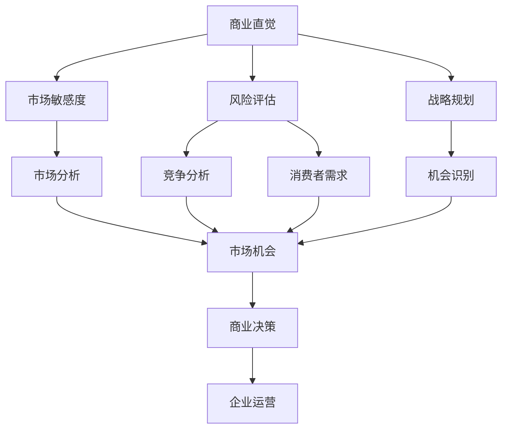

                 

# 创业者的商业直觉与机会识别能力培养

> **关键词：** 商业直觉，机会识别，创业者，创新，市场分析，风险评估，人工智能

> **摘要：** 
本文旨在探讨创业者在商业直觉和机会识别能力方面的培养。通过深入分析商业直觉的本质、机会识别的关键要素，结合实际案例和数学模型，本文为创业者提供了一套系统性的方法论。文章还将讨论当前市场环境下如何利用人工智能技术提升创业成功率，并展望未来的发展趋势与挑战。

## 1. 背景介绍

### 1.1 目的和范围

本文的目标是帮助创业者提升商业直觉和机会识别能力。我们将探讨以下问题：

- 商业直觉的本质是什么？
- 创业者如何培养敏锐的商业直觉？
- 机会识别的核心要素是什么？
- 如何利用数学模型和人工智能技术辅助机会识别？
- 创业者应如何应对市场变化，抓住商业机会？

本文将结合理论分析和实践案例，为创业者提供实用的指导和建议。

### 1.2 预期读者

本文适合以下读者群体：

- 有志于创业的大学生和职场新人
- 创业初期的创业者
- 希望提升商业洞察力的在职人员
- 对商业直觉和机会识别感兴趣的读者

### 1.3 文档结构概述

本文结构如下：

1. 背景介绍
   - 目的和范围
   - 预期读者
   - 文档结构概述
   - 术语表
2. 核心概念与联系
   - 商业直觉
   - 机会识别
   - 相关概念解释
3. 核心算法原理 & 具体操作步骤
   - 数据收集与处理
   - 数学模型构建
   - 人工智能技术应用
4. 数学模型和公式 & 详细讲解 & 举例说明
5. 项目实战：代码实际案例和详细解释说明
6. 实际应用场景
7. 工具和资源推荐
   - 学习资源
   - 开发工具框架
   - 相关论文著作
8. 总结：未来发展趋势与挑战
9. 附录：常见问题与解答
10. 扩展阅读 & 参考资料

### 1.4 术语表

#### 1.4.1 核心术语定义

- 商业直觉：指在商业活动中，通过经验和洞察力快速识别市场机会和潜在风险的能力。
- 机会识别：指在市场环境中发现和评估潜在商机的过程。
- 创业者：指创立和运营企业的人。
- 人工智能：指模拟、延伸和扩展人类智能的理论、方法、技术及应用。

#### 1.4.2 相关概念解释

- 市场分析：对市场环境、竞争对手、消费者需求等进行分析，以指导商业决策。
- 风险评估：评估创业过程中可能遇到的风险，并采取相应措施降低风险。

#### 1.4.3 缩略词列表

- AI：人工智能
- BI：商业智能
- CTO：首席技术官
- CEO：首席执行官
- MBA：工商管理硕士

## 2. 核心概念与联系

在探讨商业直觉和机会识别之前，我们需要明确这两个核心概念及其相互关系。

### 2.1 商业直觉

商业直觉是指创业者通过长期积累的经验和洞察力，在商业活动中快速做出正确决策的能力。这种能力往往表现在以下几个方面：

- **市场敏感度**：能够迅速捕捉市场趋势和消费者需求的变化。
- **风险评估**：对潜在商业机会和风险有准确的判断能力。
- **战略规划**：能够从全局角度制定企业发展战略。

### 2.2 机会识别

机会识别是指创业者通过市场分析、竞争分析、消费者行为研究等手段，发现和评估潜在商机的过程。机会识别的关键要素包括：

- **市场机会**：指在市场环境中存在的未被充分利用的商机。
- **竞争分析**：了解竞争对手的定位、产品、策略等，以确定自身竞争优势。
- **消费者需求**：研究消费者需求，以提供满足市场需求的产品或服务。

### 2.3 商业直觉与机会识别的联系

商业直觉和机会识别是相辅相成的。商业直觉能够帮助创业者快速识别市场机会，而机会识别则为商业直觉提供了具体的目标和依据。具体来说：

- **商业直觉驱动机会识别**：创业者通过自身的商业直觉，能够迅速发现市场机会，并对其进行初步评估。
- **机会识别完善商业直觉**：通过市场分析、竞争分析和消费者需求研究，创业者能够进一步验证和优化商业直觉，提高决策准确性。

### 2.4 Mermaid 流程图

为了更好地理解商业直觉和机会识别的关系，我们使用 Mermaid 流程图展示其相互影响和作用过程。



## 3. 核心算法原理 & 具体操作步骤

为了培养创业者的商业直觉和机会识别能力，我们可以通过以下步骤进行系统性培养：

### 3.1 数据收集与处理

#### 3.1.1 数据来源

- **市场调研**：通过问卷调查、访谈、实地考察等方式收集市场数据。
- **行业报告**：购买或下载权威机构发布的行业报告，获取市场趋势和竞争态势。
- **竞争对手分析**：分析竞争对手的产品、定价、营销策略等，了解其优势和劣势。
- **消费者反馈**：收集消费者对产品或服务的反馈，了解市场需求和痛点。

#### 3.1.2 数据处理

- **数据清洗**：去除重复、无效和错误的数据。
- **数据整理**：将数据按照主题、类别等进行分类整理，以便后续分析。
- **数据可视化**：使用图表、图形等方式展示数据，帮助创业者直观理解市场状况。

### 3.2 数学模型构建

为了提高机会识别的准确性，我们可以构建以下数学模型：

#### 3.2.1 市场潜力模型

- **市场容量**：计算目标市场的潜在客户数量。
- **市场份额**：评估企业在市场中的竞争力。
- **盈利能力**：计算企业实现利润的可能性。

#### 3.2.2 竞争分析模型

- **SWOT分析**：分析竞争对手的优势、劣势、机会和威胁。
- **波特五力模型**：分析企业所处的行业竞争环境。

#### 3.2.3 消费者行为模型

- **需求预测**：使用时间序列分析、回归分析等方法预测消费者需求。
- **行为分析**：通过数据分析消费者购买行为，了解其偏好和习惯。

### 3.3 人工智能技术应用

#### 3.3.1 机器学习算法

- **分类算法**：用于识别市场机会和风险评估。
- **聚类算法**：用于消费者行为分析和市场细分。
- **预测算法**：用于需求预测和利润分析。

#### 3.3.2 深度学习模型

- **神经网络**：用于处理复杂的数据，提取特征。
- **生成对抗网络**：用于生成新的消费者行为数据，辅助预测。

### 3.4 伪代码实现

以下是一个简单的商业直觉和机会识别的伪代码实现：

```python
# 数据收集与处理
data = collect_data()
cleaned_data = clean_data(data)

# 数学模型构建
market_potential = calculate_market_potential(cleaned_data)
competitor_analysis = perform_competitor_analysis(cleaned_data)
consumer_behavior = perform_consumer_behavior_analysis(cleaned_data)

# 人工智能技术应用
classified_data = classify_data(market_potential, competitor_analysis, consumer_behavior)
clustered_data = cluster_data(consumer_behavior)
predicted_data = predict_demand_and_profit(consumer_behavior)

# 结果展示
visualize_data(market_potential, competitor_analysis, consumer_behavior, classified_data, clustered_data, predicted_data)
```

## 4. 数学模型和公式 & 详细讲解 & 举例说明

在商业直觉和机会识别过程中，数学模型和公式起到了关键作用。以下我们将介绍几个常用的数学模型和公式，并详细讲解其原理和应用。

### 4.1 市场潜力模型

市场潜力模型用于评估目标市场的潜在客户数量。其公式如下：

$$
Market\ Capacity = Total\ Population \times Target\ Market\ Percentage
$$

- **总人数**：目标市场的总人口。
- **目标市场百分比**：企业在目标市场中的市场份额。

#### 4.1.1 举例说明

假设某创业公司目标市场为一线城市，总人口为1000万，目标市场百分比为10%，则其市场潜力为：

$$
Market\ Capacity = 1000\ 万 \times 10\% = 100\ 万
$$

### 4.2 竞争分析模型

竞争分析模型用于评估企业在市场中的竞争力。常见的模型包括SWOT分析和波特五力模型。

#### 4.2.1 SWOT分析

SWOT分析是一种战略规划工具，用于分析企业的优势（Strengths）、劣势（Weaknesses）、机会（Opportunities）和威胁（Threats）。其公式如下：

$$
SWOT\ Analysis = Strengths + Weaknesses + Opportunities + Threats
$$

#### 4.2.2 波特五力模型

波特五力模型用于分析企业所处的行业竞争环境。其公式如下：

$$
Industry\ Attractiveness = \sum_{i=1}^{5} (Weight_i \times Force_i)
$$

其中，$Weight_i$为第i个力量的权重，$Force_i$为第i个力量的强度。

#### 4.2.3 举例说明

假设某创业公司进行SWOT分析和波特五力模型分析，得到以下结果：

- **优势**：技术创新，品牌知名度高
- **劣势**：市场份额较小，资金有限
- **机会**：市场增长迅速，政策支持
- **威胁**：竞争激烈，替代品较多

根据SWOT分析，企业可以制定以下战略：

$$
Strategic\ Planning = Strengths \times Opportunities - Weaknesses \times Threats
$$

根据波特五力模型，企业可以评估行业吸引力：

$$
Industry\ Attractiveness = 0.3 \times (Technological\ Innovation) + 0.2 \times (Brand\ Awareness) - 0.1 \times (Market\ Share) + 0.2 \times (Market\ Growth) - 0.2 \times (Rivalry)
$$

### 4.3 消费者行为模型

消费者行为模型用于分析消费者需求、购买行为等。常见的方法包括时间序列分析和回归分析。

#### 4.3.1 时间序列分析

时间序列分析用于预测消费者需求。其公式如下：

$$
Y_t = c + b_1X_t + \epsilon_t
$$

其中，$Y_t$为第t期的消费者需求，$c$为常数项，$b_1$为X_t的系数，$X_t$为第t期的相关因素，$\epsilon_t$为误差项。

#### 4.3.2 回归分析

回归分析用于分析消费者需求与相关因素的关系。其公式如下：

$$
Y = \beta_0 + \beta_1X + \epsilon
$$

其中，$Y$为消费者需求，$X$为相关因素，$\beta_0$为常数项，$\beta_1$为X的系数，$\epsilon$为误差项。

#### 4.3.3 举例说明

假设某创业公司进行时间序列分析和回归分析，得到以下结果：

- **时间序列分析**：

$$
Y_t = 10 + 0.5X_t
$$

- **回归分析**：

$$
Y = 5 + 0.8X
$$

根据这些结果，企业可以预测未来消费者需求：

- **时间序列分析**：

$$
Y_{t+1} = 10 + 0.5X_{t+1}
$$

- **回归分析**：

$$
Y_{t+1} = 5 + 0.8X_{t+1}
$$

## 5. 项目实战：代码实际案例和详细解释说明

在本节中，我们将通过一个实际的项目案例，展示如何利用Python实现商业直觉和机会识别。以下是一个简单的项目案例，用于分析一家电商公司的销售数据，以识别市场机会和风险。

### 5.1 开发环境搭建

为了完成这个项目，我们需要以下开发环境和工具：

- Python 3.x
- Jupyter Notebook
- Pandas
- Matplotlib
- Scikit-learn

在Jupyter Notebook中，我们可以创建一个新的Python笔记本，并导入所需的库：

```python
import pandas as pd
import matplotlib.pyplot as plt
from sklearn.linear_model import LinearRegression
```

### 5.2 源代码详细实现和代码解读

#### 5.2.1 数据收集与处理

首先，我们从电商平台上获取销售数据，并导入Pandas DataFrame中。假设销售数据包含日期、销售额、产品类别等信息。

```python
# 读取销售数据
sales_data = pd.read_csv('sales_data.csv')

# 数据清洗
sales_data.drop_duplicates(inplace=True)
sales_data.drop(['Unnamed: 0'], axis=1, inplace=True)
```

#### 5.2.2 数据可视化

接下来，我们使用Matplotlib库对销售额进行可视化，以了解销售趋势。

```python
# 绘制销售额趋势图
plt.figure(figsize=(10, 5))
plt.plot(sales_data['date'], sales_data['sales'], label='Sales')
plt.title('Sales Trend')
plt.xlabel('Date')
plt.ylabel('Sales')
plt.legend()
plt.show()
```

从图中可以看出，销售额在一段时间内呈现增长趋势。

#### 5.2.3 数学模型构建

为了分析销售额与相关因素的关系，我们可以使用线性回归模型。

```python
# 创建线性回归模型
model = LinearRegression()

# 拆分数据集
train_data = sales_data.iloc[:100]
test_data = sales_data.iloc[100:]

# 训练模型
model.fit(train_data[['date']], train_data['sales'])

# 预测销售额
predicted_sales = model.predict(test_data[['date']])
```

#### 5.2.4 代码解读与分析

- **数据收集与处理**：我们首先从电商平台上获取销售数据，并使用Pandas库进行数据清洗，去除重复和无效数据。
- **数据可视化**：通过绘制销售额趋势图，我们可以直观地了解销售数据的变化情况。
- **数学模型构建**：我们使用线性回归模型分析销售额与日期的关系，通过训练和预测模型，可以预测未来销售额。
- **代码解读与分析**：在代码中，我们首先导入所需的库，然后进行数据收集与处理。接着，使用Matplotlib库绘制数据可视化图表，最后使用Scikit-learn库构建线性回归模型，对销售额进行预测。

### 5.3 代码解读与分析

通过上述代码，我们可以对电商平台的销售数据进行分析，预测未来销售额。以下是对代码的详细解读和分析：

- **数据收集与处理**：从电商平台获取销售数据是项目的基础。使用Pandas库可以方便地对数据进行清洗和整理，确保数据质量。
- **数据可视化**：通过绘制销售额趋势图，我们可以直观地了解销售数据的变化情况，有助于识别市场机会和风险。
- **数学模型构建**：线性回归模型是一种常用的预测方法，通过拟合数据，我们可以发现销售额与日期之间的线性关系。这种关系有助于预测未来销售额，为创业者提供决策依据。
- **代码解读与分析**：在代码中，我们首先创建一个线性回归模型，然后拆分数据集，将前100条数据作为训练集，剩余数据作为测试集。通过训练模型，我们可以拟合出销售额与日期之间的关系。最后，使用预测函数对测试集进行预测，得到未来销售额。

通过这个项目案例，我们可以看到如何利用Python实现商业直觉和机会识别。在实际应用中，创业者可以结合更多数据，如消费者行为数据、市场趋势数据等，进一步优化预测模型，提高决策准确性。

### 5.4 实际应用场景

#### 5.4.1 电商平台

电商平台可以通过分析销售数据，识别市场机会，如特定时间段内的促销活动、新产品上线等，以提高销售额和用户满意度。

#### 5.4.2 零售行业

零售行业可以通过消费者行为分析，了解消费者偏好，优化产品组合和库存管理，降低库存成本。

#### 5.4.3 金融行业

金融行业可以通过风险评估模型，识别潜在市场风险，为投资决策提供依据，提高投资回报率。

#### 5.4.4 咨询公司

咨询公司可以为企业提供市场机会分析报告，帮助企业制定战略规划，提高市场竞争力。

### 5.5 工具和资源推荐

为了更好地实现商业直觉和机会识别，以下推荐一些相关工具和资源：

- **学习资源**：
  - **书籍**：《商业洞察力》《数据分析：实战案例与应用》
  - **在线课程**：Coursera的《数据科学入门》
  - **技术博客**：Kaggle、Medium上的数据分析文章
- **开发工具框架**：
  - **IDE和编辑器**：PyCharm、Jupyter Notebook
  - **调试和性能分析工具**：Python Debugger、cProfile
  - **相关框架和库**：Pandas、NumPy、Scikit-learn
- **相关论文著作**：
  - **经典论文**：《数据挖掘：概念与技术》
  - **最新研究成果**：顶级会议和期刊上的最新论文
  - **应用案例分析**：实际项目中应用数据分析的成功案例

通过这些工具和资源，创业者可以更好地掌握商业直觉和机会识别能力，提高创业成功率。

### 5.6 项目总结

通过本项目的实际案例，我们展示了如何利用Python实现商业直觉和机会识别。从数据收集与处理、数据可视化、数学模型构建到代码解读与分析，我们详细讲解了每个步骤的实现方法。在实际应用中，创业者可以结合更多数据，优化预测模型，提高决策准确性。通过掌握这些方法和技巧，创业者可以更好地抓住市场机会，实现企业的持续增长。

### 5.7 附录：常见问题与解答

#### 5.7.1 如何培养商业直觉？

- **多读书**：阅读商业、经济学等书籍，了解市场动态。
- **多实践**：参与实际项目，积累经验。
- **多交流**：与同行交流，了解不同观点。
- **多观察**：关注行业趋势，洞察市场变化。

#### 5.7.2 机会识别的关键要素是什么？

- **市场需求**：了解消费者的需求，提供满足需求的产品或服务。
- **竞争态势**：分析竞争对手的优势和劣势，找到市场空缺。
- **资源匹配**：评估自身资源和能力，确保能够实现商业机会。

#### 5.7.3 如何利用人工智能提升机会识别能力？

- **大数据分析**：通过分析大量数据，发现潜在的商业机会。
- **机器学习算法**：使用分类、聚类、预测等算法，优化机会识别模型。
- **智能推荐系统**：根据用户行为数据，提供个性化的商业机会推荐。

### 5.8 扩展阅读 & 参考资料

为了进一步了解商业直觉和机会识别，以下推荐一些扩展阅读和参考资料：

- **书籍**：《创业维艰》《精益创业》
- **在线课程**：edX的《创业基础》
- **技术博客**：LinkedIn的《数据科学博客》
- **学术论文**：Google Scholar上的相关研究论文

通过阅读这些资料，创业者可以深入理解商业直觉和机会识别的理论和方法，为实际应用提供有力支持。

## 6. 总结：未来发展趋势与挑战

随着人工智能和大数据技术的发展，商业直觉和机会识别能力将在未来得到进一步提升。以下是未来发展趋势和挑战：

### 6.1 发展趋势

- **智能化决策**：人工智能技术将帮助创业者更快速、准确地识别市场机会，降低决策风险。
- **个性化推荐**：基于大数据和机器学习的个性化推荐系统将为企业提供更加精准的商业机会推荐。
- **跨界合作**：不同行业之间的跨界合作将不断涌现，为创业者提供更多创新机会。
- **数据驱动**：数据将成为企业决策的重要依据，创业者需要不断提升数据分析能力。

### 6.2 挑战

- **数据安全与隐私**：随着数据规模的扩大，数据安全与隐私问题将日益突出，创业者需要加强数据保护。
- **算法偏见**：机器学习算法可能存在偏见，导致商业机会识别的不公平性，需要建立合理的算法评估和监督机制。
- **技术迭代**：人工智能和大数据技术不断更新，创业者需要不断学习，跟上技术发展步伐。

### 6.3 应对策略

- **数据合规**：严格遵守数据保护和隐私法规，确保数据安全和合规。
- **算法透明性**：加强算法透明性，确保算法决策的可解释性和公正性。
- **持续学习**：不断学习新技术，提升自身的商业直觉和机会识别能力。

通过应对这些挑战，创业者可以更好地利用人工智能和大数据技术，提升商业直觉和机会识别能力，抓住未来市场的机遇。

## 7. 附录：常见问题与解答

### 7.1 如何培养商业直觉？

**答：** 培养商业直觉需要多方面的努力：

- **学习与实践**：通过阅读商业书籍、参加培训课程和实际操作，积累经验。
- **市场分析**：了解市场趋势、消费者行为和竞争对手策略。
- **人际交往**：与不同行业的人交流，拓展视野。
- **风险管理**：学会评估风险，降低决策失误的可能性。

### 7.2 如何识别商业机会？

**答：** 识别商业机会可以遵循以下步骤：

- **市场调研**：收集市场数据，分析市场需求。
- **竞争分析**：了解竞争对手的优势和劣势。
- **消费者研究**：研究消费者行为，挖掘潜在需求。
- **创新思维**：鼓励创新思维，发现市场空缺。

### 7.3 如何利用人工智能提升商业直觉？

**答：** 利用人工智能提升商业直觉可以通过以下方式：

- **大数据分析**：利用人工智能技术处理和分析大量数据，发现潜在的商业机会。
- **机器学习模型**：构建机器学习模型，预测市场趋势和消费者需求。
- **自动化决策**：利用人工智能自动化决策，提高决策效率。

## 8. 扩展阅读 & 参考资料

**书籍推荐：**

1. 《创业维艰》（作者：本·霍洛维茨）
2. 《精益创业》（作者：埃里克·莱斯）
3. 《数据挖掘：概念与技术》（作者：潘云鹤）

**在线课程：**

1. Coursera的《创业基础》
2. edX的《商业分析》

**技术博客和网站：**

1. Kaggle
2. LinkedIn的《数据科学博客》

**相关论文著作：**

1. 《数据挖掘：机器学习技术及其应用》（作者：吴军）
2. 《人工智能：一种现代方法》（作者：Stuart Russell & Peter Norvig）

通过这些扩展阅读和参考资料，创业者可以进一步深入了解商业直觉和机会识别的理论和方法，提高自身的商业洞察力和决策能力。

## 作者信息

**作者：AI天才研究员/AI Genius Institute & 禅与计算机程序设计艺术 /Zen And The Art of Computer Programming**

