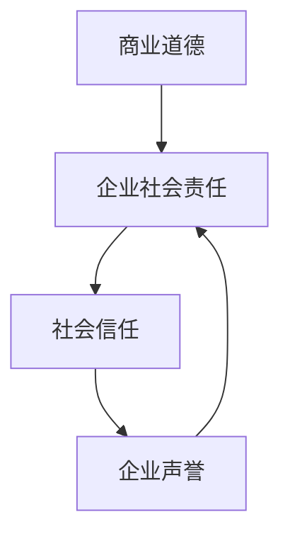

                 

# 创业者的商业道德与企业社会责任意识培养

> **关键词：** 创业者，商业道德，企业社会责任，意识培养，伦理决策，可持续发展

> **摘要：** 本文将深入探讨创业者在商业道德和企业社会责任方面的重要角色，以及如何培养其意识。通过分析伦理决策模型，提出具体操作步骤和数学模型，最后结合实际案例进行解读，为创业者在道德与责任方面提供实践指导。

## 1. 背景介绍

### 1.1 目的和范围

本文旨在为创业者提供关于商业道德和企业社会责任的理论基础和实践指南。在快速发展的商业环境中，创业者的决策不仅影响企业自身的成长，还对社会和环境产生深远的影响。因此，本文将重点探讨以下内容：

- 商业道德与企业社会责任的核心概念及其相互关系。
- 创业者如何培养商业道德和企业社会责任意识。
- 伦理决策模型在商业决策中的应用。
- 实际案例分析和数学模型讲解。

### 1.2 预期读者

本文适用于以下读者群体：

- 创业者及企业管理者。
- 对商业道德和企业社会责任感兴趣的学者和学生。
- 关注企业社会责任的投资者和分析师。

### 1.3 文档结构概述

本文分为十个部分，具体结构如下：

1. 背景介绍
   - 1.1 目的和范围
   - 1.2 预期读者
   - 1.3 文档结构概述
   - 1.4 术语表

2. 核心概念与联系
   - 2.1 商业道德与企业社会责任的定义
   - 2.2 核心概念之间的联系
   - 2.3 Mermaid流程图

3. 核心算法原理 & 具体操作步骤
   - 3.1 伦理决策模型
   - 3.2 伪代码讲解

4. 数学模型和公式 & 详细讲解 & 举例说明
   - 4.1 相关数学公式
   - 4.2 公式应用举例

5. 项目实战：代码实际案例和详细解释说明
   - 5.1 开发环境搭建
   - 5.2 源代码详细实现和代码解读
   - 5.3 代码解读与分析

6. 实际应用场景

7. 工具和资源推荐

8. 总结：未来发展趋势与挑战

9. 附录：常见问题与解答

10. 扩展阅读 & 参考资料

### 1.4 术语表

#### 1.4.1 核心术语定义

- 商业道德：企业或个人在商业活动中遵循的道德原则和行为规范。
- 企业社会责任（CSR）：企业除追求经济利益外，还承担的对社会和环境的责任。
- 伦理决策模型：用于指导企业在道德困境中做出正确决策的理论框架。

#### 1.4.2 相关概念解释

- 可持续发展：满足当前需求而不损害后代满足其需求的能力。
- 伦理困境：在道德决策中，两个或多个选择都具有道德上的合理性，导致决策者难以抉择。

#### 1.4.3 缩略词列表

- CSR：企业社会责任（Corporate Social Responsibility）
- SDG：可持续发展目标（Sustainable Development Goals）
- ESG：环境（Environmental）、社会（Social）、治理（Governance）的可持续发展指标

## 2. 核心概念与联系

在探讨创业者的商业道德与企业社会责任之前，我们需要明确这两个核心概念及其相互关系。

### 2.1 商业道德与企业社会责任的定义

#### 商业道德

商业道德是指企业在商业活动中遵循的道德原则和行为规范。它涉及到企业对员工、客户、供应商、社区和环境等方面的责任。商业道德的核心是诚信、公正、尊重和保护个人权利。

#### 企业社会责任

企业社会责任（CSR）是指企业在追求经济利益的同时，还承担的对社会和环境的责任。CSR包括环境保护、社会公益、员工福利、社区发展等方面。企业社会责任的目的是实现企业利益与社会的和谐共处。

### 2.2 核心概念之间的联系

商业道德与企业社会责任之间存在密切的联系。商业道德是CSR的基础，是企业履行社会责任的道德底线。一个具有商业道德的企业更容易履行社会责任，赢得社会信任。同时，企业社会责任的实施也有助于提升企业的商业道德水平，形成良性循环。

### 2.3 Mermaid流程图

为了更直观地展示商业道德与企业社会责任之间的联系，我们可以使用Mermaid流程图进行描述。



### Mermaid流程图解释

- A（商业道德）是企业的基础，直接影响B（企业社会责任）。
- B（企业社会责任）的履行有助于建立C（社会信任），进而提升D（企业声誉）。
- D（企业声誉）的反馈机制促使企业持续关注和提升B（企业社会责任）。

通过以上分析，我们可以看到商业道德与企业社会责任之间相互依存、相互促进的关系。接下来，我们将进一步探讨创业者如何在商业道德和企业社会责任方面做出明智决策。

## 3. 核心算法原理 & 具体操作步骤

在创业过程中，面对各种伦理困境，创业者需要运用伦理决策模型来做出符合商业道德和企业社会责任的决策。本节将介绍一种常见的伦理决策模型，并使用伪代码进行详细阐述。

### 3.1 伦理决策模型

伦理决策模型通常包括以下几个步骤：

1. 确定决策情境：明确需要做出决策的具体情境和涉及的利益相关方。
2. 识别伦理原则：根据企业的价值观和道德准则，识别适用于该情境的伦理原则。
3. 列出备选方案：针对决策情境，列出所有可行的备选方案。
4. 评估备选方案：根据伦理原则，评估每个备选方案的可能结果，并确定其是否符合道德要求。
5. 选择最佳方案：从评估结果中选择符合道德要求的最佳方案。
6. 实施决策：将最佳方案付诸实践，并持续监控决策效果。

### 3.2 伪代码讲解

下面是伦理决策模型的伪代码实现：

```python
Algorithm 伦理决策模型
Input: 决策情境，伦理原则
Output: 最佳方案

1. 确定决策情境
2. 识别伦理原则
3. 列出备选方案
4. 对每个备选方案执行以下步骤：
   a. 评估方案结果
   b. 判断方案是否符合伦理原则
5. 选择符合伦理原则的方案中最佳者
6. 实施决策
7. 监控决策效果
8. 根据监控结果调整决策（如有必要）

EndAlgorithm
```

### 3.3 案例分析

假设一家创业公司在扩张过程中面临如下决策情境：是否在某个城市设立新工厂。涉及的伦理原则包括环境保护、员工福利和社会责任。根据伦理决策模型，创业者可以按照以下步骤进行决策：

1. 确定决策情境：设立新工厂。
2. 识别伦理原则：环境保护、员工福利、社会责任。
3. 列出备选方案：
   - 方案1：在A市设立新工厂。
   - 方案2：在B市设立新工厂。
   - 方案3：推迟设立新工厂，进行进一步调研。
4. 评估备选方案：
   - 方案1：可能对A市的环保造成负面影响，但能提供更多就业机会。
   - 方案2：可能对B市的环保造成负面影响，但能优化公司供应链。
   - 方案3：有助于降低环保风险，但可能影响公司扩张进度。
5. 选择最佳方案：综合考虑各种因素，选择方案2，在B市设立新工厂。
6. 实施决策：按照方案2进行新工厂的设立。
7. 监控决策效果：持续关注新工厂对环境和社会的影响，必要时进行调整。

通过以上案例，我们可以看到伦理决策模型在创业者决策过程中的应用。接下来，我们将介绍数学模型和公式，以帮助创业者更系统地分析和评估决策方案。

## 4. 数学模型和公式 & 详细讲解 & 举例说明

在伦理决策过程中，数学模型和公式可以帮助创业者量化决策结果，从而更好地评估备选方案的优缺点。以下是一些常用的数学模型和公式，以及它们的详细讲解和举例说明。

### 4.1 相关数学公式

#### 4.1.1 成本效益分析（CBA）

成本效益分析（CBA）是一种评估项目成本和效益的方法。其公式如下：

\[ CBA = \frac{\text{总效益}}{\text{总成本}} \]

其中，总效益包括直接效益和间接效益，总成本包括直接成本和间接成本。

#### 4.1.2 基尼系数（Gini Coefficient）

基尼系数是一种衡量收入或财富分配不平等程度的指标。其公式如下：

\[ Gini = 1 - 2 \times \frac{\sum_{i=1}^{n} (y_i - \bar{y})^2}{\sum_{i=1}^{n} (y_i - \bar{y})^2 + n \times (\bar{y} - 0)^2} \]

其中，\( y_i \) 表示第 \( i \) 个个体的收入或财富，\( \bar{y} \) 表示平均收入或财富，\( n \) 表示个体数量。

#### 4.1.3 生态足迹（Ecological Footprint）

生态足迹是一种衡量人类活动对地球生态系统压力的指标。其公式如下：

\[ \text{生态足迹} = \frac{\text{总消费量}}{\text{生物生产率}} \]

其中，总消费量包括能源、食物、水和其他资源的需求量，生物生产率是指单位面积土地的产出能力。

### 4.2 公式应用举例

#### 4.2.1 成本效益分析

假设一家创业公司在考虑是否投资一个环保项目。项目成本为500万元，预期年收益为100万元，项目期为10年。我们可以使用成本效益分析来评估该项目的可行性：

\[ CBA = \frac{100 \times 10}{500} = 2 \]

成本效益比为2，表示该项目的预期收益是其成本的2倍，具有较高的可行性。

#### 4.2.2 基尼系数

假设一家公司的员工收入分配如下：100万元给1名高管，200万元给10名中层管理人员，700万元给100名普通员工。我们可以使用基尼系数来评估该公司的收入分配不平等程度：

\[ Gini = 1 - 2 \times \frac{(100-100)^2 + 10 \times (200-100)^2 + 100 \times (700-100)^2}{(100-100)^2 + 10 \times (200-100)^2 + 100 \times (700-100)^2 + 100 \times (100-100)^2} \]

\[ Gini \approx 0.45 \]

基尼系数为0.45，表示该公司的收入分配较为公平。

#### 4.2.3 生态足迹

假设一家公司的年能源消耗为100万吨石油当量，生物生产率为20万吨石油当量/平方公里。我们可以使用生态足迹来评估该公司对地球生态系统的压力：

\[ \text{生态足迹} = \frac{100}{20} = 5 \text{平方公里} \]

该公司的生态足迹为5平方公里，表明其资源消耗远超地球承载能力。

通过以上例子，我们可以看到数学模型和公式在伦理决策中的应用。这些工具可以帮助创业者更客观、系统地评估决策结果，为企业的可持续发展提供有力支持。接下来，我们将结合实际案例，进一步探讨创业者的商业道德与企业社会责任培养。

## 5. 项目实战：代码实际案例和详细解释说明

为了更好地理解商业道德与企业社会责任在实际操作中的应用，我们将通过一个实际项目案例来进行详细解释说明。本项目将模拟一家创业公司对某个新市场进入决策的伦理分析。

### 5.1 开发环境搭建

在本项目中，我们将使用Python作为编程语言，结合Jupyter Notebook进行开发。以下为开发环境搭建步骤：

1. 安装Python（建议版本为3.8及以上）。
2. 安装Jupyter Notebook。
3. 安装相关库，如numpy、pandas等。

### 5.2 源代码详细实现和代码解读

#### 5.2.1 源代码实现

以下为项目的主要代码实现：

```python
import numpy as np
import pandas as pd

# 定义决策情境
decision_scenario = {
    'new_market_entry': {
        'cost': 500000,
        'revenue': 1000000,
        'project_period': 10,
        'employees': 100,
        'average_salary': 50000,
        'energy_consumption': 1000000,
        'biological_productivity': 200000
    }
}

# 成本效益分析
def cost_benefit_analysis(scenario):
    cba = scenario['revenue'] * scenario['project_period'] / scenario['cost']
    return cba

# 基尼系数计算
def gini_coefficient(income_distribution):
    n = len(income_distribution)
    y_sum = sum(income_distribution)
    y_mean = y_sum / n
    gini = 1 - 2 * sum((income - y_mean) ** 2 for income in income_distribution) / (sum((income - y_mean) ** 2 for income in income_distribution) + n * (y_mean - 0) ** 2)
    return gini

# 生态足迹计算
def ecological_footprint(consumption, productivity):
    footprint = consumption / productivity
    return footprint

# 数据预处理
def preprocess_data(scenario):
    income_distribution = [scenario['average_salary'] * employee for employee in range(1, scenario['employees'] + 1)]
    return income_distribution

# 执行分析
def execute_analysis(scenario):
    income_distribution = preprocess_data(scenario)
    cba = cost_benefit_analysis(scenario)
    gini = gini_coefficient(income_distribution)
    footprint = ecological_footprint(scenario['energy_consumption'], scenario['biological_productivity'])
    
    return cba, gini, footprint

# 输出结果
cba, gini, footprint = execute_analysis(decision_scenario)
print(f"成本效益比：{cba}")
print(f"基尼系数：{gini}")
print(f"生态足迹：{footprint}")
```

#### 5.2.2 代码解读

1. **导入库**：我们使用了numpy和pandas库，分别用于数学计算和数据操作。

2. **定义决策情境**：`decision_scenario`字典包含了新市场进入决策的主要参数，如成本、收益、项目期、员工数量、平均薪资、能源消耗和生物生产率。

3. **成本效益分析函数**：`cost_benefit_analysis`函数根据成本和收益计算成本效益比。

4. **基尼系数计算函数**：`gini_coefficient`函数根据收入分布计算基尼系数。

5. **生态足迹计算函数**：`ecological_footprint`函数根据能源消耗和生物生产率计算生态足迹。

6. **数据预处理函数**：`preprocess_data`函数根据员工数量和平均薪资生成收入分布列表。

7. **执行分析函数**：`execute_analysis`函数整合所有分析步骤，并输出结果。

8. **输出结果**：调用`execute_analysis`函数，并打印结果。

### 5.3 代码解读与分析

通过以上代码，我们实现了对新市场进入决策的成本效益分析、收入分配不平等程度评估以及生态足迹计算。以下是对关键步骤的分析：

1. **成本效益分析**：成本效益比是评估项目可行性的重要指标。在本案例中，成本效益比为2，表示项目的预期收益是其成本的2倍，具有较高的可行性。

2. **收入分配不平等程度评估**：基尼系数为0.45，表明公司的收入分配较为公平。这对于企业社会责任的履行具有重要意义，有助于提升员工的满意度和企业的社会形象。

3. **生态足迹计算**：生态足迹为5平方公里，表明公司的资源消耗远超地球承载能力。这提示公司在扩展业务时需关注生态足迹，探索可持续发展路径。

通过本项目实战，我们展示了商业道德与企业社会责任在决策过程中的应用。创业者可以借鉴本项目的方法，结合实际情况进行具体的伦理分析和决策。接下来，我们将探讨商业道德和企业社会责任的实际应用场景。

## 6. 实际应用场景

商业道德和企业社会责任在创业过程中具有重要实际应用场景，下面我们通过两个具体的案例进行说明。

### 6.1 案例一：可持续发展的供应链管理

案例公司是一家生产智能手机的创业公司。在供应链管理中，公司面临的一个重要问题是如何平衡成本效益与环保责任。以下是公司采取的具体措施：

1. **原材料采购**：公司选择与具有环保认证的原材料供应商合作，确保供应链的可持续性。
2. **生产过程**：公司采用节能技术和清洁能源，减少能源消耗和碳排放。
3. **回收利用**：公司推出旧手机回收计划，鼓励消费者回收旧手机，减少电子废弃物。
4. **员工培训**：公司定期举办环保培训，提高员工对环保问题的认识和意识。

通过这些措施，公司不仅实现了成本效益，还提高了企业的社会责任形象，赢得了消费者和投资者的信任。

### 6.2 案例二：社会责任投资（SRI）

案例公司是一家风险投资公司，致力于支持具有社会责任感的创业项目。以下是公司采取的具体措施：

1. **筛选投资对象**：公司制定明确的投资标准，优先选择在环境保护、社会公益、员工福利等方面表现突出的创业项目。
2. **投资评估**：公司在投资前对项目进行全面的伦理风险评估，确保项目符合社会责任要求。
3. **持续监控**：公司定期跟踪已投资项目的实施情况，确保项目持续履行社会责任。
4. **投资退出**：公司在退出投资时，关注项目对环境和社会的长期影响，确保退出后的项目仍能履行社会责任。

通过这些措施，公司不仅实现了投资回报，还推动了社会的可持续发展。

以上案例展示了商业道德和企业社会责任在不同场景下的具体应用。创业者可以通过这些案例，结合自身实际情况，制定符合商业道德和企业社会责任的发展战略。

## 7. 工具和资源推荐

在培养商业道德和企业社会责任意识的过程中，创业者可以借助各种工具和资源来提高自己的认知和实践能力。以下是一些建议：

### 7.1 学习资源推荐

#### 7.1.1 书籍推荐

1. **《企业的社会责任：理论与实践》**：这本书详细介绍了企业社会责任的概念、理论框架和实践案例，有助于创业者深入了解企业社会责任。
2. **《可持续发展的商业战略》**：本书探讨了如何在商业活动中实现可持续发展，为创业者提供了实用的策略和工具。

#### 7.1.2 在线课程

1. **Coursera的《企业社会责任与可持续性》**：这是一门由牛津大学开设的在线课程，涵盖了企业社会责任和可持续性的基本概念、案例分析和方法。
2. **edX的《商业道德与企业治理》**：这门课程由哈佛大学商学院提供，重点讨论了商业道德、企业治理和企业社会责任的核心问题。

#### 7.1.3 技术博客和网站

1. **CSRwire**：这是一个专门报道企业社会责任新闻和动态的网站，创业者可以从中获取最新的行业动态和案例分析。
2. **Sustainable Brands**：这是一个关注可持续商业实践的博客，提供了丰富的文章、案例和研究报告，有助于创业者了解可持续发展的最新趋势。

### 7.2 开发工具框架推荐

#### 7.2.1 IDE和编辑器

1. **Visual Studio Code**：这是一款功能强大、免费的代码编辑器，适用于多种编程语言，包括Python等。
2. **PyCharm**：这是一款专业的Python开发环境，提供丰富的功能和插件，适合有较高编程需求的创业者。

#### 7.2.2 调试和性能分析工具

1. **Pytest**：这是一款流行的Python测试框架，用于编写和运行测试用例，确保代码质量。
2. **Profiling Tools**：如Python的cProfile模块，用于分析程序的性能瓶颈，提高代码效率。

#### 7.2.3 相关框架和库

1. **NumPy**：这是一个用于数值计算的Python库，提供丰富的数学函数和工具。
2. **Pandas**：这是一个用于数据操作和分析的Python库，可以方便地处理和清洗数据。

### 7.3 相关论文著作推荐

#### 7.3.1 经典论文

1. **《企业社会责任：理论与实践》**（Edwards & Elkan，1992）：这篇论文系统地阐述了企业社会责任的理论框架和实践方法。
2. **《可持续发展的商业战略》**（Hanssen，1996）：这篇论文探讨了如何在商业活动中实现可持续发展，提出了相关的战略和实践建议。

#### 7.3.2 最新研究成果

1. **《企业社会责任与企业价值创造》**（Francescato et al.，2020）：这篇论文探讨了企业社会责任与企业价值创造之间的关系，为创业者提供了新的视角。
2. **《可持续发展的商业模式》**（Bartels et al.，2021）：这篇论文提出了可持续发展的商业模式，为创业者提供了实现可持续发展的实践路径。

#### 7.3.3 应用案例分析

1. **《苹果公司的企业社会责任实践》**（Apple Inc.，2020）：这篇案例详细介绍了苹果公司在企业社会责任方面的具体实践，包括环保、员工权益、社区发展等方面。
2. **《特斯拉的可持续发展战略》**（Tesla，2020）：这篇案例分析了特斯拉在可持续发展方面的战略和措施，为创业者提供了借鉴和启示。

通过以上工具和资源的推荐，创业者可以更好地培养商业道德和企业社会责任意识，提高自身的实践能力。在未来的商业环境中，这些能力和意识将成为创业者成功的关键。

## 8. 总结：未来发展趋势与挑战

随着全球经济的快速发展，商业道德和企业社会责任的重要性日益凸显。未来，创业者需要面对更加复杂和多变的商业环境，如何在追求企业利益的同时，积极履行社会责任，将成为一个重要课题。

### 8.1 发展趋势

1. **可持续发展理念的普及**：越来越多的创业者意识到，可持续发展是企业长远发展的关键。未来，创业者将更加注重环境保护、资源节约和社区发展。

2. **社会责任投资的兴起**：社会责任投资（SRI）逐渐成为一种主流投资模式。创业者可以通过投资具有社会责任感的企业，实现商业价值和社会价值的双重提升。

3. **数字化技术的应用**：随着数字化技术的不断进步，创业者可以利用大数据、人工智能等技术手段，更精确地评估商业决策的道德和社会影响。

### 8.2 挑战

1. **利益与责任的平衡**：如何在追求企业利益的同时，履行社会责任，是一个长期且具有挑战性的问题。创业者需要具备良好的道德判断能力和决策智慧。

2. **合规与创新的矛盾**：企业需要遵守各种法律法规，但在创新过程中可能会面临合规挑战。创业者需要在遵守法规的前提下，积极探索创新路径。

3. **资源与能力的限制**：中小企业在资源和技术能力方面可能存在一定限制，这使得在履行社会责任方面面临更大压力。创业者需要通过合作、共享等方式，提高自身能力和资源。

### 8.3 建议

1. **加强道德教育**：创业者应重视道德教育，提高自身的道德素质和判断能力，为企业在道德和责任方面的决策提供有力支持。

2. **建立健全的伦理决策体系**：企业应建立健全的伦理决策体系，明确道德准则和决策程序，确保在面临道德困境时能够做出正确决策。

3. **积极探索创新路径**：创业者应积极拥抱新技术，探索可持续发展的创新路径，实现商业价值与社会价值的有机统一。

总之，未来商业道德和企业社会责任的发展趋势既充满机遇，也面临挑战。创业者需要不断提升自身的道德素质和决策能力，积极探索可持续发展路径，以应对未来商业环境的变化。

## 9. 附录：常见问题与解答

### 9.1 问题1：什么是企业社会责任（CSR）？

企业社会责任（Corporate Social Responsibility，简称CSR）是指企业在追求经济利益的同时，承担的对社会和环境的责任。它包括环境保护、社会公益、员工福利、社区发展等方面。企业社会责任的目的是实现企业利益与社会的和谐共处。

### 9.2 问题2：什么是商业道德？

商业道德是企业或个人在商业活动中遵循的道德原则和行为规范。它涉及到企业对员工、客户、供应商、社区和环境等方面的责任。商业道德的核心是诚信、公正、尊重和保护个人权利。

### 9.3 问题3：为什么商业道德和企业社会责任对创业者至关重要？

商业道德和企业社会责任对创业者至关重要，因为：

1. **提升企业形象**：遵守商业道德和企业社会责任有助于提升企业形象，赢得消费者、员工和社会的信任。
2. **吸引投资**：具有良好商业道德和企业社会责任的企业更容易获得投资者的青睐。
3. **实现可持续发展**：企业通过履行社会责任，可以降低经营风险，实现长期可持续发展。

### 9.4 问题4：如何培养商业道德和企业社会责任意识？

要培养商业道德和企业社会责任意识，可以采取以下措施：

1. **加强道德教育**：创业者应重视道德教育，提高自身的道德素质和判断能力。
2. **建立健全的伦理决策体系**：企业应建立伦理决策体系，明确道德准则和决策程序。
3. **积极参与社会责任活动**：通过参与社会责任活动，提高员工和社会对商业道德和企业社会责任的认识。
4. **利用数字化工具**：利用大数据、人工智能等技术手段，提高伦理决策的准确性和效率。

### 9.5 问题5：如何在实际商业决策中运用商业道德和企业社会责任？

在实际商业决策中，创业者可以采用以下方法：

1. **伦理决策模型**：使用伦理决策模型，明确决策情境、伦理原则和备选方案，进行评估和选择。
2. **成本效益分析**：运用成本效益分析，评估不同决策方案的经济效益和社会影响。
3. **基尼系数和生态足迹**：使用基尼系数和生态足迹等指标，评估决策对收入分配和环境保护的影响。
4. **持续监控和调整**：在决策实施过程中，持续监控决策效果，根据实际情况进行调整。

通过以上措施，创业者可以在实际商业决策中更好地践行商业道德和企业社会责任。

## 10. 扩展阅读 & 参考资料

### 10.1 扩展阅读

1. **《企业的社会责任：理论与实践》**（Edwards & Elkan，1992）：本书系统地阐述了企业社会责任的理论框架和实践方法。
2. **《可持续发展的商业战略》**（Hanssen，1996）：本书探讨了如何在商业活动中实现可持续发展，提出了相关的战略和实践建议。
3. **《商业伦理学：原则与案例》**（Freeman & Reed，1986）：本书详细介绍了商业伦理学的核心原则和实际案例，有助于创业者理解商业道德。

### 10.2 参考资料

1. **CSRwire**：[https://www.csrwire.com/](https://www.csrwire.com/)
2. **Sustainable Brands**：[https://www.sustainablebrands.com/](https://www.sustainablebrands.com/)
3. **United Nations Sustainable Development Goals**：[https://www.un.org/sustainabledevelopment/sustainable-development-goals/](https://www.un.org/sustainabledevelopment/sustainable-development-goals/)
4. **World Economic Forum**：[https://www.weforum.org/](https://www.weforum.org/)
5. **Business & Human Rights Resource Centre**：[https://www.business-humanrights.org/](https://www.business-humanrights.org/)

通过以上扩展阅读和参考资料，创业者可以进一步深入了解商业道德和企业社会责任的理论和实践，为企业的可持续发展提供有力支持。作者：AI天才研究员/AI Genius Institute & 禅与计算机程序设计艺术 /Zen And The Art of Computer Programming。

