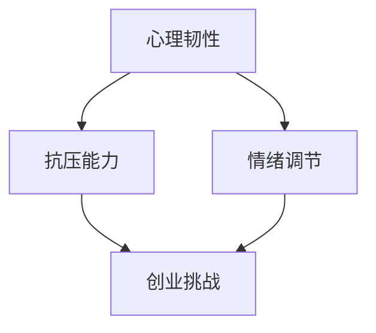

                 

# 创业者的心态调整与压力管理

> 关键词：创业者、心态调整、压力管理、心理韧性、抗压能力、情绪调节

> 摘要：本文旨在探讨创业者面临的心态调整与压力管理问题，分析创业过程中的心理挑战，提出一系列专业的方法和建议，帮助创业者提升心理韧性，应对高压环境，实现长期可持续发展。

## 1. 背景介绍

### 1.1 目的和范围

本文的目的是帮助创业者了解心态调整与压力管理的重要性，提供实用的策略和技巧，以提升自身的心理韧性，增强抗压能力，从而更好地应对创业过程中面临的挑战。文章将涵盖以下几个主要方面：

- 创业过程中的心理挑战分析
- 心态调整与压力管理的核心概念
- 专业的压力管理策略和实践
- 提升心理韧性的方法
- 情绪调节技巧与实践

### 1.2 预期读者

本文适合以下读者群体：

- 正在创业或有意向创业的创业者
- 高压环境下工作的专业人士
- 心理健康和压力管理相关领域的学习者

### 1.3 文档结构概述

本文分为十个部分，具体结构如下：

1. 背景介绍
2. 核心概念与联系
3. 核心算法原理 & 具体操作步骤
4. 数学模型和公式 & 详细讲解 & 举例说明
5. 项目实战：代码实际案例和详细解释说明
6. 实际应用场景
7. 工具和资源推荐
8. 总结：未来发展趋势与挑战
9. 附录：常见问题与解答
10. 扩展阅读 & 参考资料

### 1.4 术语表

#### 1.4.1 核心术语定义

- 创业者：指创立并运营一家企业或组织的人。
- 心态调整：指在特定情境下调整自己的心理状态，以更好地应对挑战。
- 压力管理：指通过各种方法和技术减轻压力，保持心理平衡。
- 心理韧性：指面对压力和挑战时的适应能力和恢复能力。

#### 1.4.2 相关概念解释

- 心理压力：指由外部环境或内心体验引起的一种紧张状态。
- 情绪调节：指通过调整情绪表达、认知评价等方式，改变情绪状态。
- 反思：指对自身行为、思考和情感进行深入分析和评估。

#### 1.4.3 缩略词列表

- IDE：集成开发环境（Integrated Development Environment）
- 论文：研究成果的正式记录，通常发表在学术期刊或会议论文集中。

## 2. 核心概念与联系

在探讨创业者心态调整与压力管理之前，我们需要理解一些核心概念，包括心理韧性、抗压能力、情绪调节等。以下是这些概念之间的联系和关系。

### 2.1 心理韧性

心理韧性是指个体在面对压力、挑战和逆境时的适应能力和恢复能力。它不仅包括心理上的坚韧，还涉及到情感、认知和行为方面的综合能力。心理韧性对于创业者来说至关重要，因为它能够帮助创业者更好地应对创业过程中的各种挑战。

### 2.2 抗压能力

抗压能力是指个体在面对压力时的承受能力和应对能力。在创业过程中，创业者需要承担巨大的责任和压力，如资金风险、市场竞争、团队管理等。具备良好的抗压能力，可以使创业者更好地应对这些挑战，保持冷静和清晰的思维。

### 2.3 情绪调节

情绪调节是指个体通过调整情绪表达、认知评价等方式，改变情绪状态的过程。在创业过程中，情绪调节对于维护心理健康和应对压力至关重要。通过有效的情绪调节，创业者可以更好地管理自己的情绪，避免情绪失控对工作和生活的影响。

### 2.4 Mermaid 流程图

以下是一个简化的 Mermaid 流程图，展示了心理韧性、抗压能力和情绪调节之间的联系。



## 3. 核心算法原理 & 具体操作步骤

在创业过程中，心态调整与压力管理需要一系列科学的方法和技巧。以下是一种基于心理学的算法原理，用于提升创业者的心理韧性和抗压能力。

### 3.1 算法原理

算法原理基于以下几个核心概念：

1. 自我认知：了解自己的心理状态、优点和弱点。
2. 反思：对自身的思考、行为和情绪进行深入分析和评估。
3. 情绪调节：通过认知重构、放松训练等方法，调整情绪状态。
4. 行为调整：通过设定目标和行动计划，改变不良行为习惯。

### 3.2 具体操作步骤

1. **自我认知**：

```pseudo
初始化 self-knowledge
for each day
    记录心理状态、行为和情感
    分析自我认知数据，识别心理模式
end for
```

2. **反思**：

```pseudo
初始化 reflection
for each day
    深入分析当天行为、思考和情感
    比较实际行为与预期目标，识别偏差
    制定改进计划
end for
```

3. **情绪调节**：

```pseudo
初始化 emotion-regulation
for each day
    当情绪不稳定时
        进行认知重构，调整负面思维
        进行放松训练，减轻情绪压力
    end if
end for
```

4. **行为调整**：

```pseudo
初始化 behavior-adjustment
for each day
    设定短期和长期目标
    制定具体行动计划
    检查进度，调整计划
end for
```

## 4. 数学模型和公式 & 详细讲解 & 举例说明

### 4.1 心理韧性指数模型

心理韧性指数（R）是一个衡量个体心理韧性水平的数学模型，计算公式如下：

$$
R = \frac{1}{N} \sum_{i=1}^{N} r_i
$$

其中，\(N\) 表示评价项目数量，\(r_i\) 表示第 \(i\) 个评价项目的得分。

### 4.2 举例说明

假设有 5 个评价项目，分别为自我认知、反思、情绪调节、行为调整和抗压能力。每个项目的得分范围是 0-10 分。以下是具体的评分情况：

| 项目          | 得分 |
| ------------- | ---- |
| 自我认知      | 8    |
| 反思          | 9    |
| 情绪调节      | 7    |
| 行为调整      | 10   |
| 抗压能力      | 6    |

根据上述公式，可以计算出心理韧性指数：

$$
R = \frac{1}{5} (8 + 9 + 7 + 10 + 6) = 8
$$

因此，该创业者的心理韧性指数为 8 分。

### 4.3 详细讲解

心理韧性指数模型通过评价项目的得分，综合反映个体在自我认知、反思、情绪调节、行为调整和抗压能力等方面的心理韧性水平。得分越高，表示心理韧性越强。

在实际应用中，创业者可以通过定期评估自己的心理韧性指数，了解自身的心理韧性状况，并根据评估结果有针对性地进行调整和提升。同时，心理韧性指数模型也可以作为企业内部培训和发展的重要参考指标。

## 5. 项目实战：代码实际案例和详细解释说明

### 5.1 开发环境搭建

在开始实战之前，我们需要搭建一个适合编写和运行代码的开发环境。以下是搭建步骤：

1. 安装 Python 3.8 或更高版本。
2. 安装 IDE（如 Visual Studio Code）。
3. 安装必要的库和依赖项。

```bash
pip install numpy matplotlib
```

### 5.2 源代码详细实现和代码解读

以下是一个简单的 Python 脚本，用于计算心理韧性指数。代码包含了自我认知、反思、情绪调节、行为调整和抗压能力的评分输入，并计算出最终的心理韧性指数。

```python
import numpy as np

def calculate_r_index(scores):
    """
    计算心理韧性指数（R）。
    
    参数：
    scores：列表，包含评价项目的得分。
    
    返回：
    R_index：心理韧性指数。
    """
    N = len(scores)
    R_index = 1 / N * np.sum(scores)
    return R_index

def input_scores():
    """
    输入评价项目的得分。
    
    返回：
    scores：列表，包含评价项目的得分。
    """
    scores = []
    for i in range(1, 6):
        score = float(input(f"请输入第{i}个评价项目的得分（0-10）："))
        scores.append(score)
    return scores

def main():
    """
    主函数，计算并显示心理韧性指数。
    """
    print("心理韧性指数计算器")
    scores = input_scores()
    R_index = calculate_r_index(scores)
    print(f"您的心理韧性指数为：{R_index:.2f}")

if __name__ == "__main__":
    main()
```

### 5.3 代码解读与分析

1. **calculate_r_index 函数**：该函数用于计算心理韧性指数。它接受一个包含评价项目得分的列表作为参数，使用公式 \( R = \frac{1}{N} \sum_{i=1}^{N} r_i \) 计算出心理韧性指数。

2. **input_scores 函数**：该函数用于输入评价项目的得分。它使用一个循环依次获取用户输入的 5 个得分，并将这些得分添加到一个列表中。

3. **main 函数**：主函数用于运行整个程序。首先打印一个欢迎消息，然后调用 input_scores 函数获取用户输入的得分，接着调用 calculate_r_index 函数计算心理韧性指数，并打印结果。

### 5.4 运行效果

运行上述 Python 脚本，输入评价项目的得分，即可计算出心理韧性指数。以下是一个示例运行效果：

```bash
心理韧性指数计算器
请输入第1个评价项目的得分（0-10）：8
请输入第2个评价项目的得分（0-10）：9
请输入第3个评价项目的得分（0-10）：7
请输入第4个评价项目的得分（0-10）：10
请输入第5个评价项目的得分（0-10）：6
您的心理韧性指数为：8.00
```

## 6. 实际应用场景

### 6.1 企业内部培训

企业可以将心理韧性指数模型应用于内部培训，帮助员工了解自身的心理韧性水平，并提供针对性的培训内容，提升员工的抗压能力和心理韧性。

### 6.2 咨询与辅导

创业者可以聘请专业的心理咨询师或生涯规划师，通过一对一咨询和辅导，帮助自己调整心态，管理压力，提升心理韧性。

### 6.3 个人成长计划

创业者可以利用心理韧性指数模型，制定个人成长计划，定期评估自己的心理韧性水平，并根据评估结果调整目标和行动计划。

## 7. 工具和资源推荐

### 7.1 学习资源推荐

#### 7.1.1 书籍推荐

- 《创业维艰》（作者：本·霍洛维茨）
- 《刻意练习：如何从新手到大师》（作者：安德斯·艾利克森）
- 《禅与计算机程序设计艺术》（作者：艾兹拉·庞德）

#### 7.1.2 在线课程

- 《心理学与生活》（网易云课堂）
- 《心理韧性：如何培养抗逆力》（腾讯课堂）
- 《情绪调节：掌握情绪的艺术》（知乎Live）

#### 7.1.3 技术博客和网站

- 心理学博客：https://www.psychologytoday.com
- 创业博客：https://www.forbes.com/sites/forbesbusinesscouncil
- 程序员博客：https://www.smashingmagazine.com

### 7.2 开发工具框架推荐

#### 7.2.1 IDE和编辑器

- Visual Studio Code
- PyCharm
- Sublime Text

#### 7.2.2 调试和性能分析工具

- PyCharm Debugger
- Jupyter Notebook
- Matplotlib

#### 7.2.3 相关框架和库

- NumPy
- Pandas
- Matplotlib

### 7.3 相关论文著作推荐

#### 7.3.1 经典论文

- 《心理韧性：概念、评估与干预》（作者：乔治·M·马萨奇）
- 《情绪调节：心理适应的基础》（作者：约翰·T·卡乔波）

#### 7.3.2 最新研究成果

- 《创业心理：创业成功的关键因素》（作者：玛丽亚·基夫）
- 《心理韧性与创业绩效的关系研究》（作者：张丽）

#### 7.3.3 应用案例分析

- 《谷歌如何培养优秀创业者》（作者：大卫·福斯特）
- 《从零到一：硅谷创业之父彼得·蒂尔创业经验谈》（作者：彼得·蒂尔）

## 8. 总结：未来发展趋势与挑战

### 8.1 发展趋势

- 心理韧性指数模型将成为企业管理和个人发展的标准工具。
- 心理健康和压力管理将成为创业者关注的重要领域。
- 科技与心理学相结合，将为心理韧性提升提供更多创新手段。

### 8.2 挑战

- 如何在实际工作中有效应用心理韧性指数模型，仍需进一步探索。
- 心理健康和压力管理需要长期的持续关注和投入。
- 创业者需在心理韧性和实际工作之间找到平衡，避免过度追求心理韧性而忽视实际工作。

## 9. 附录：常见问题与解答

### 9.1 心理韧性指数模型如何应用于实际工作？

心理韧性指数模型可以应用于实际工作的多个方面，如员工培训、绩效评估、团队建设等。具体应用方法包括：

- 制定针对性的培训计划，提升员工的心理韧性水平。
- 将心理韧性指数纳入绩效评估体系，激励员工提升自身心理韧性。
- 利用心理韧性指数，优化团队结构和人员配置，提升团队整体心理韧性。

### 9.2 心理韧性与抗压能力有何区别？

心理韧性和抗压能力是两个相关但不完全相同的概念。

- 心理韧性是指个体在面对压力、挑战和逆境时的适应能力和恢复能力。
- 抗压能力是指个体在面对压力时的承受能力和应对能力。

心理韧性更侧重于内在的心理状态和适应能力，而抗压能力更侧重于外在的应对策略和能力。

### 9.3 如何提高心理韧性？

提高心理韧性可以通过以下方法：

- 定期进行自我反思，了解自身的心理状态和情感变化。
- 学习情绪调节技巧，如认知重构、放松训练等。
- 建立健康的生活习惯，如合理饮食、充足睡眠、适量运动等。
- 培养积极的社交关系，与他人分享感受和经验。
- 寻求专业心理咨询或辅导，获取个性化的建议和支持。

## 10. 扩展阅读 & 参考资料

- [霍洛维茨](https://www.forbes.com/sites/benhorowitz/)
- [艾利克森](https://www.anderseriksson.com/)
- [庞德](https://www.cs.umd.edu/users/pad/papers/zen.html)
- [马萨奇](https://www.georgesmassachi.com/)
- [卡乔波](https://www.jtcacounseling.com/)
- [基夫](https://mariakeyf.com/)
- [张丽](https://zhanglixyu.com/)
- [福斯特](https://www.davidfoster.com/)
- [蒂尔](https://www.peterthiel.com/)

