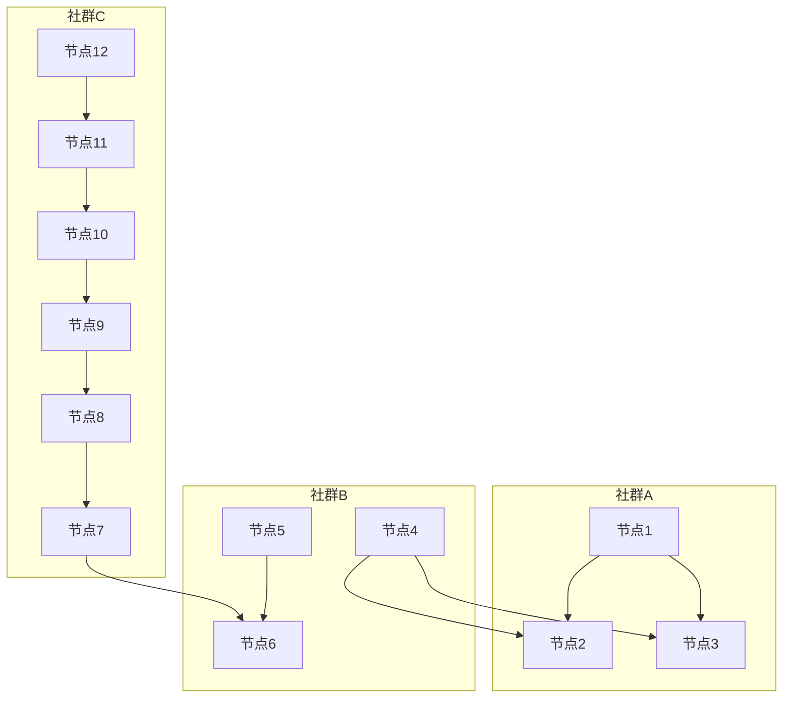
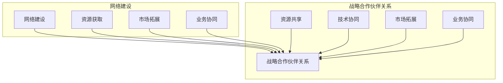

                 

### 1. 背景介绍

#### 1.1 目的和范围

本文的目的是为创业者提供一个系统性的指导，帮助他们更好地理解和构建网络以及与战略合作伙伴建立稳固的关系。在网络化和全球化的时代，网络建设和战略合作伙伴关系对于企业的生存和发展具有重要意义。

首先，网络建设是企业获取资源、拓展市场、降低交易成本的关键途径。一个高效的网络不仅可以为企业带来更多的商机，还能够提高企业的竞争力。

其次，战略合作伙伴关系的建立对于企业来说也是至关重要的。通过与合适的合作伙伴建立战略联盟，企业可以在技术研发、市场开拓、资源整合等方面取得协同效应，实现共赢。

本文将围绕以下内容展开：

1. **核心概念与联系**：介绍网络建设和战略合作伙伴关系的核心概念，并通过Mermaid流程图展示其关系和架构。
2. **核心算法原理 & 具体操作步骤**：讲解如何通过具体的算法和步骤来实现网络建设和战略合作伙伴关系的建立。
3. **数学模型和公式 & 详细讲解 & 举例说明**：利用数学模型和公式，详细解释网络建设和战略合作伙伴关系的建立过程，并通过实例进行说明。
4. **项目实战：代码实际案例和详细解释说明**：通过实际项目案例，展示网络建设和战略合作伙伴关系的具体实现过程，并进行详细解释和分析。
5. **实际应用场景**：分析网络建设和战略合作伙伴关系在不同场景下的应用和作用。
6. **工具和资源推荐**：推荐相关学习资源、开发工具框架和相关论文著作，以帮助读者进一步深入学习和实践。
7. **总结：未来发展趋势与挑战**：总结本文的主要内容，并探讨未来网络建设和战略合作伙伴关系的发展趋势和面临的挑战。

通过本文的阅读，创业者将能够系统地了解网络建设和战略合作伙伴关系的重要性，掌握具体的方法和技巧，从而更好地应对市场竞争，实现企业的持续发展。

#### 1.2 预期读者

本文主要面向以下读者群体：

1. **初创企业创始人**：正处于创业阶段，希望构建稳固网络和建立战略合作伙伴关系的创业者。
2. **中小企业管理者**：企业管理者，特别是在网络建设和战略合作伙伴关系方面有需求的中小企业。
3. **市场营销人员**：负责市场拓展和客户关系管理的市场营销人员，希望通过网络建设和战略合作伙伴关系提升市场竞争力。
4. **IT行业从业者**：对网络建设和战略合作伙伴关系有深入理解和实践经验的IT行业从业者。

无论您是上述哪个读者群体，本文都将为您提供有价值的指导和建议，帮助您在网络建设和战略合作伙伴关系方面取得突破。

#### 1.3 文档结构概述

本文的结构如下：

1. **背景介绍**：介绍本文的目的和范围，预期读者，以及文档的结构概述。
2. **核心概念与联系**：介绍网络建设和战略合作伙伴关系的核心概念，并通过Mermaid流程图展示其关系和架构。
3. **核心算法原理 & 具体操作步骤**：讲解如何通过具体的算法和步骤来实现网络建设和战略合作伙伴关系的建立。
4. **数学模型和公式 & 详细讲解 & 举例说明**：利用数学模型和公式，详细解释网络建设和战略合作伙伴关系的建立过程，并通过实例进行说明。
5. **项目实战：代码实际案例和详细解释说明**：通过实际项目案例，展示网络建设和战略合作伙伴关系的具体实现过程，并进行详细解释和分析。
6. **实际应用场景**：分析网络建设和战略合作伙伴关系在不同场景下的应用和作用。
7. **工具和资源推荐**：推荐相关学习资源、开发工具框架和相关论文著作，以帮助读者进一步深入学习和实践。
8. **总结：未来发展趋势与挑战**：总结本文的主要内容，并探讨未来网络建设和战略合作伙伴关系的发展趋势和面临的挑战。
9. **附录：常见问题与解答**：对本文中出现的一些常见问题进行解答。
10. **扩展阅读 & 参考资料**：提供进一步的阅读资源和参考文献。

通过本文的阅读，您将能够系统地了解网络建设和战略合作伙伴关系的重要性和具体实践方法，为您的企业发展提供有力支持。

#### 1.4 术语表

在本文中，我们将使用一些特定的术语和概念，为了确保读者能够更好地理解，以下是对这些术语和概念的详细解释：

#### 1.4.1 核心术语定义

- **网络建设**：指企业通过构建和优化内外部网络，以实现资源获取、市场拓展和业务协同的过程。
- **战略合作伙伴关系**：指企业之间基于共同目标和利益，通过长期合作和资源共享，实现互利共赢的关系。
- **节点**：在网络中，表示企业或组织的抽象实体。
- **边**：在网络中，表示节点之间的连接关系。
- **度**：节点在网络中的连接数，表示节点的网络影响力。
- **社群**：在网络中，一组具有密切联系的节点组成的子网络。

#### 1.4.2 相关概念解释

- **网络密度**：指网络中节点连接的紧密程度，通常用连接数与可能的最大连接数的比值来表示。
- **聚类系数**：指网络中节点之间的连接关系紧密程度，通常用网络中的平均聚类系数来表示。
- **中心性**：指节点在网络中的重要性和影响力，通常用度数中心性、介数中心性和接近中心性来表示。
- **网络效率**：指网络中信息传递的速度和准确性，通常用网络效率来衡量。

#### 1.4.3 缩略词列表

- **SNS**：Social Networking Services，指社交网络服务。
- **CRM**：Customer Relationship Management，指客户关系管理。
- **ERP**：Enterprise Resource Planning，指企业资源计划。
- **IoT**：Internet of Things，指物联网。
- **AI**：Artificial Intelligence，指人工智能。

通过了解这些术语和概念，读者将能够更好地理解本文的内容，并在实际应用中运用相关知识，为企业的网络建设和战略合作伙伴关系提供有力支持。

## 2. 核心概念与联系

在网络建设和战略合作伙伴关系的讨论中，理解核心概念及其相互联系至关重要。以下是本文将要探讨的几个关键概念，并通过Mermaid流程图展示其关系和架构。

### 2.1 网络建设

网络建设是指企业通过各种手段建立和维护内外部网络，以实现资源获取、市场拓展和业务协同。以下是网络建设的几个核心概念：

- **节点**：表示网络中的企业、组织或个人。
- **边**：表示节点之间的连接关系。
- **网络密度**：表示网络中节点连接的紧密程度。
- **社群**：表示一组具有密切联系的节点组成的子网络。

#### Mermaid流程图：



### 2.2 战略合作伙伴关系

战略合作伙伴关系是企业之间基于共同目标和利益，通过长期合作和资源共享，实现互利共赢的关系。以下是战略合作伙伴关系的几个核心概念：

- **合作伙伴**：指参与合作的企业或组织。
- **合作内容**：指合作双方在资源、技术、市场等方面的合作内容。
- **合作模式**：指合作双方的合作方式和机制。
- **合作效果**：指合作带来的实际效益和成果。

#### Mermaid流程图：


### 2.3 网络建设与战略合作伙伴关系的联系

网络建设和战略合作伙伴关系之间存在密切的联系。网络建设是战略合作伙伴关系的基础，而战略合作伙伴关系则是网络建设的深化和拓展。

- **网络建设为战略合作伙伴关系提供支撑**：通过网络建设，企业可以更好地识别和接触到潜在的战略合作伙伴，为合作关系的建立提供基础。
- **战略合作伙伴关系促进网络建设**：通过建立战略合作伙伴关系，企业可以在资源共享、技术协同和市场拓展等方面实现优势互补，进一步提升网络建设的效能。

#### Mermaid流程图：



通过以上核心概念和Mermaid流程图的介绍，我们可以更好地理解网络建设和战略合作伙伴关系的架构和联系。接下来，本文将深入探讨这些核心概念的原理和具体操作步骤，帮助创业者更好地实现网络建设和战略合作伙伴关系的构建。

### 2.4 社交网络中的关键概念和算法

在社交网络研究中，理解关键概念和算法对于分析网络结构和优化网络策略至关重要。以下是社交网络中的一些重要概念和常用的算法。

#### 2.4.1 社交网络中的关键概念

1. **节点**：社交网络中的个体，如用户、企业和组织。
2. **边**：节点之间的连接关系，表示个体之间的互动或关联。
3. **网络密度**：网络中边的数量与可能的最大边数量的比值，衡量网络的紧密程度。
4. **社群**：网络中的节点群集，成员之间互动频繁，具有共同特征。
5. **中心性**：衡量节点在网络中的重要程度，包括度数中心性、介数中心性和接近中心性。
6. **网络效率**：网络中信息传递的速度和准确性，反映网络的运行效能。

#### 2.4.2 社交网络分析算法

1. **节点分类算法**：通过分析节点的属性和关系，将节点划分为不同类别，如名人节点、普通节点等。常用的算法有K-means聚类和基于标签的聚类。

   ```python
   # K-means聚类伪代码
   def KMeans(data, k):
       初始化k个中心点
       当中心点变化：
           计算每个节点到中心点的距离
           将每个节点分配到最近的中心点
           重新计算中心点的位置
   ```

2. **社群检测算法**：识别网络中的社群结构，常用的算法有Louvain方法、标签传播算法和基于模块度的算法。

   ```python
   # Louvain方法伪代码
   def Louvain(graph):
       初始化节点状态
       计算每个节点的模块度
       重新划分节点状态
       迭代计算直至状态稳定
       返回社群划分结果
   ```

3. **中心性计算算法**：衡量节点在网络中的影响力，常用的算法有度数中心性、介数中心性和接近中心性。

   ```python
   # 度数中心性计算伪代码
   def degree_centrality(graph):
       初始化中心性值为0
       遍历每个节点：
           计算节点的度数
           更新节点的中心性值
       返回中心性值列表
   ```

4. **网络效率计算算法**：评估网络中信息传递的效能，常用的算法有网络效率指标和信息传递路径分析。

   ```python
   # 网络效率计算伪代码
   def network_efficiency(graph):
       遍历所有节点对：
           计算节点对之间的最短路径长度
           计算网络效率值
       返回网络效率值
   ```

通过这些关键概念和算法，创业者可以更好地理解和分析社交网络，从而优化网络建设和战略合作伙伴关系的策略。

### 2.5 网络分析工具和框架

在进行网络建设和战略合作伙伴关系分析时，选择合适的工具和框架是至关重要的。以下是一些常用的网络分析工具和框架：

#### 2.5.1 Gephi

Gephi是一个开源的图形数据分析和可视化工具，适用于网络结构的可视化、社群检测和属性分析。Gephi提供了丰富的图表、算法和插件，可以帮助用户深入理解网络结构和特征。

- **功能特点**：
  - 可视化：直观地展示网络结构和节点属性。
  - 社群检测：支持多种社群检测算法，如Louvain方法和基于模块度的算法。
  - 属性分析：对节点和边进行属性分析和可视化。
- **使用场景**：
  - 社交网络分析：识别社群结构和关键节点。
  - 商业网络分析：分析合作伙伴关系和供应链结构。
  
#### 2.5.2 NetworkX

NetworkX是一个开源的Python库，用于创建、操作和分析网络。它提供了丰富的网络分析算法和可视化工具，适合进行复杂的网络分析任务。

- **功能特点**：
  - 算法库：包括度数中心性、介数中心性、接近中心性等中心性计算算法。
  - 数据操作：支持多种数据格式，如GraphML、GEXF和CSV。
  - 可视化：集成PyVis等可视化库，支持多种图表类型。
- **使用场景**：
  - 研究项目：用于学术研究和数据分析。
  - 开发应用：用于构建和优化网络模型。
  
#### 2.5.3 Cytoscape

Cytoscape是一个开源的跨平台网络分析工具，广泛应用于生物学、社会科学和工程领域的网络分析。它提供了丰富的网络可视化、数据分析工具和插件。

- **功能特点**：
  - 可视化：支持多种图表类型和布局算法。
  - 数据分析：包括网络聚类、路径分析、中心性分析等。
  - 插件生态：支持多种插件，扩展功能和应用场景。
- **使用场景**：
  - 生物网络分析：用于研究生物分子网络和蛋白质相互作用。
  - 社会网络分析：用于分析社交网络结构和影响力。

通过使用这些工具和框架，创业者可以更有效地进行网络建设和战略合作伙伴关系分析，从而优化企业网络结构和提升竞争力。

### 2.6 网络效应与竞争优势

网络建设和战略合作伙伴关系的成功不仅依赖于节点的连接和互动，更在于如何通过这些网络效应实现竞争优势。以下是关于网络效应和竞争优势的详细讨论。

#### 2.6.1 网络效应

网络效应是指网络中节点数量的增加或网络规模的扩大，对网络价值和效用产生积极影响的效应。网络效应可以分为直接网络效应和间接网络效应。

1. **直接网络效应**：直接网络效应是指当更多用户加入网络时，单个用户的网络价值增加。例如，在社交媒体平台上，用户数量的增加使得平台上的信息和互动更加丰富，从而提升用户的体验和满意度。

2. **间接网络效应**：间接网络效应是指通过网络中其他用户的参与，为单个用户带来的额外价值。例如，在在线市场平台上，一个卖家的加入可以吸引更多的买家，从而提高所有卖家的销售机会。

网络效应使得企业能够通过扩大网络规模，实现用户规模效应和市场份额的增长，从而在市场竞争中获得优势。

#### 2.6.2 竞争优势

竞争优势是指企业在市场竞争中相对于竞争对手所具有的持久优势。网络建设和战略合作伙伴关系可以为企业带来以下竞争优势：

1. **规模经济**：通过网络效应，企业可以借助用户规模的扩大，实现单位成本的降低和盈利能力的提升。例如，电商平台通过大量用户数据的积累，可以降低广告成本和营销费用，从而提高运营效率。

2. **网络效应壁垒**：网络效应使得企业在网络规模达到一定程度后，竞争对手难以进入或超越。例如，社交网络平台一旦积累大量用户，新的竞争者需要投入大量资源才能吸引相同数量的用户，从而形成进入壁垒。

3. **协同效应**：战略合作伙伴关系可以实现资源、技术和市场的共享，从而提高企业的运营效率和创新能力。例如，企业通过与科研机构合作，可以快速获取前沿技术，提升产品竞争力。

4. **品牌效应**：通过网络建设和战略合作伙伴关系，企业可以建立强大的品牌影响力，吸引更多用户和合作伙伴。例如，知名品牌通过合作伙伴关系，可以快速进入新的市场，并提高品牌认可度。

#### 2.6.3 网络效应与竞争优势的互动

网络效应和竞争优势之间存在密切的互动关系。网络效应可以增强企业的竞争优势，而竞争优势又可以促进网络效应的扩大。

- **增强网络效应**：企业的竞争优势可以吸引更多用户和合作伙伴，从而扩大网络规模，提升网络效应。例如，电商平台通过提供优质的购物体验和优惠活动，可以吸引更多用户，提高平台的价值。
- **巩固竞争优势**：网络效应的扩大可以为企业带来更多的资源和机会，进一步巩固其竞争优势。例如，社交网络平台通过积累大量用户数据，可以提升其个性化推荐能力和用户体验，从而增强用户黏性。

通过理解和运用网络效应和竞争优势，企业可以在激烈的市场竞争中脱颖而出，实现可持续发展。

### 2.7 案例分析：成功网络建设和战略合作伙伴关系的实例

为了更好地理解网络建设和战略合作伙伴关系的实际应用，以下通过两个成功案例进行分析。

#### 案例一：阿里巴巴与腾讯的战略合作伙伴关系

阿里巴巴和腾讯是中国两大互联网巨头，它们在网络建设和战略合作伙伴关系方面有着丰富的实践经验。

1. **网络建设**：阿里巴巴通过电子商务平台、物流网络和云计算等业务，构建了一个庞大的商业生态系统。腾讯则通过社交媒体、在线游戏和支付等业务，建立了广泛的用户网络。

2. **战略合作伙伴关系**：阿里巴巴和腾讯在多个领域建立了深度合作关系。例如，在云计算方面，双方通过资源共享和技术合作，提升了各自的服务能力。在支付领域，通过战略合作，双方实现了支付方式的互通，提升了用户体验。

3. **效果评估**：这种网络建设和战略合作伙伴关系为双方带来了显著的价值。阿里巴巴通过腾讯的社交媒体平台，扩大了用户基础和市场影响力。腾讯则通过阿里巴巴的云计算和支付服务，提升了业务效率和用户体验。

#### 案例二：华为与三星的全球供应链合作

华为和三星是全球领先的通信设备和消费电子制造商，它们在网络建设和战略合作伙伴关系方面有着成功的实践。

1. **网络建设**：华为通过全球化的研发和供应链网络，实现了快速响应市场需求和技术变革。三星则通过多元化的产品线和强大的制造能力，建立了全球领先的供应链体系。

2. **战略合作伙伴关系**：华为和三星在多个领域建立了深度合作关系。例如，在5G技术方面，双方通过技术交流和合作研发，共同推动了5G技术的发展和应用。在供应链方面，双方通过资源共享和协同制造，提升了生产效率和成本控制能力。

3. **效果评估**：这种网络建设和战略合作伙伴关系为双方带来了显著的价值。华为通过三星的制造能力和技术支持，提高了5G设备的产能和品质。三星则通过华为的市场需求和技术需求，优化了其产品开发和生产流程。

通过以上案例分析，我们可以看到，成功的网络建设和战略合作伙伴关系能够为企业在市场竞争中提供强大的支持，实现资源整合和协同效应，从而提升企业的核心竞争力。

## 3. 核心算法原理 & 具体操作步骤

在网络建设和战略合作伙伴关系的实际操作中，核心算法原理起着关键作用。本节将详细阐述这些算法原理，并通过伪代码提供具体的操作步骤，帮助创业者理解和应用这些算法。

### 3.1 网络社区检测算法

网络社区检测算法用于识别网络中的社群结构，帮助我们理解网络中的紧密连接群体。以下是一个基于Louvain方法的社区检测算法，该算法通过迭代计算节点的模块度，将节点划分为不同的社群。

#### Louvain社区检测算法伪代码：

```python
# 初始化节点状态
initialize_node_states()

# 迭代计算模块度，直至状态稳定
while states_change_detected():
    # 计算每个节点的模块度
    calculate_modules()

    # 根据模块度重新划分节点状态
    reassign_node_states()

# 返回社群划分结果
return community_assignment()
```

#### 详细解释：

1. **初始化节点状态**：首先，将所有节点分配到独立的社群，每个节点初始状态为独立社群。
2. **计算模块度**：对每个节点，计算其加入其他社群后的模块度变化。模块度是一个衡量社群内部连接紧密程度的指标。
3. **重新划分节点状态**：根据模块度计算结果，将节点重新分配到具有更高模块度的社群中。
4. **迭代计算**：重复上述步骤，直至节点状态不再发生改变，即社群划分达到稳定状态。

通过这一算法，我们可以有效地识别网络中的社群结构，为网络建设和战略合作伙伴关系的建立提供重要依据。

### 3.2 度优先搜索算法

度优先搜索（DFS）是一种用于遍历或搜索图的算法，特别适用于网络分析和路径规划。以下是DFS算法的伪代码，用于在网络中查找特定节点或路径。

#### 度优先搜索算法伪代码：

```python
def DFS(graph, start_node, target_node):
    visited = set()
    stack = [start_node]

    while stack:
        node = stack.pop()
        if node not in visited:
            visited.add(node)
            if node == target_node:
                return True  # 目标节点找到
            # 将未访问的邻居节点加入堆栈
            stack.extend(neighbor_nodes(node))
    
    return False  # 目标节点未找到
```

#### 详细解释：

1. **初始化**：设置一个访问节点集合（visited）和一个堆栈（stack），初始时将起始节点加入堆栈。
2. **遍历**：从堆栈中取出一个节点，如果该节点未访问过，则将其加入访问集合，并判断是否为目标节点。
3. **递归**：将当前节点的所有未访问邻居节点加入堆栈，继续遍历。
4. **结束**：如果堆栈为空，表示所有节点都已遍历，目标节点未找到则返回False。

通过DFS算法，我们可以高效地遍历网络，查找特定节点或路径，为网络分析和路径规划提供有效工具。

### 3.3 贪心算法在合作伙伴选择中的应用

贪心算法是一种用于优化问题求解的策略，通过每一步选择局部最优解，逐步逼近全局最优解。以下是一个贪心算法在合作伙伴选择中的应用，用于优化合作伙伴关系的质量。

#### 贪心算法合作伙伴选择伪代码：

```python
def greedy_partner_selection(graph, n_partners):
    partners = []
    unselected_nodes = list(graph.nodes())

    while len(partners) < n_partners:
        max_score = -1
        selected_node = None

        for node in unselected_nodes:
            score = calculate_partner_score(graph, node, partners)
            if score > max_score:
                max_score = score
                selected_node = node

        partners.append(selected_node)
        unselected_nodes.remove(selected_node)

    return partners
```

#### 详细解释：

1. **初始化**：设置一个合作伙伴列表（partners）和一个未选择节点集合（unselected_nodes），初始时包含所有节点。
2. **选择合作伙伴**：在未选择节点集合中，选择评分最高的节点作为合作伙伴。
3. **更新状态**：将选择的节点从未选择节点集合中移除，并加入合作伙伴列表。
4. **重复选择**：重复上述步骤，直到选择达到预定数量。

通过这一贪心算法，创业者可以系统化地选择合作伙伴，优化合作关系质量。

### 3.4 贝叶斯网络在风险评估中的应用

贝叶斯网络是一种表示变量之间概率关系的图形模型，广泛用于风险评估和决策支持。以下是一个贝叶斯网络在战略合作伙伴关系风险评估中的应用。

#### 贝叶斯网络风险评估伪代码：

```python
def bayesian_network_risk_analysis(graph, probabilities):
    risk_scores = {}

    for node in graph.nodes():
        risk_scores[node] = calculate_risk_score(node, probabilities)

    return risk_scores
```

#### 详细解释：

1. **初始化**：设置一个风险评分字典（risk_scores），初始时所有节点的风险评分为0。
2. **计算风险**：对每个节点，根据其概率关系和贝叶斯网络模型，计算其风险评分。
3. **更新状态**：将计算得到的节点风险评分更新到风险评分字典中。

通过贝叶斯网络，创业者可以定量评估合作伙伴关系的风险，为决策提供科学依据。

通过上述核心算法原理和具体操作步骤的讲解，创业者可以系统地理解和应用这些算法，优化网络建设和战略合作伙伴关系的质量。

### 3.5 集群算法在合作伙伴分类中的应用

集群算法是一种无监督学习算法，用于将数据集划分为多个群集。在合作伙伴关系的网络分析中，集群算法可以帮助我们将合作伙伴进行有效分类，从而更好地管理和优化合作关系。以下是一个基于K-means算法的集群算法应用案例。

#### K-means算法合作伙伴分类伪代码：

```python
def KMeans(graph, n_clusters):
    # 初始化中心点
    centroids = initialize_centroids(graph, n_clusters)
    clusters = initialize_clusters()

    while not converged():
        # 分配节点到最近的中心点
        assign_nodes_to_clusters(graph, centroids, clusters)
        
        # 重新计算中心点
        update_centroids(clusters, n_clusters)
        
        # 检查是否收敛
        if not converged():
            continue
    
    return clusters
```

#### 详细解释：

1. **初始化中心点**：首先，随机选择n_clusters个节点作为初始中心点。
2. **分配节点到最近的中心点**：计算每个节点与中心点之间的距离，将节点分配到距离最近的中心点所在的群集。
3. **重新计算中心点**：根据当前群集中的所有节点，重新计算新的中心点位置。
4. **检查是否收敛**：如果节点分配没有变化或变化小于某个阈值，算法收敛。

通过K-means算法，我们可以将合作伙伴网络划分为若干群集，每个群集代表一组具有相似特征的合作伙伴。这一方法有助于我们更好地理解和管理合作伙伴关系。

#### 举例说明：

假设一个企业网络中有10个合作伙伴，我们希望利用K-means算法将这10个合作伙伴分为3个群集。以下是具体步骤：

1. **初始化中心点**：随机选择3个合作伙伴作为初始中心点。
2. **分配节点到最近的中心点**：计算每个合作伙伴与中心点之间的距离，将合作伙伴分配到距离最近的中心点所在的群集。
3. **重新计算中心点**：根据当前群集中的合作伙伴，重新计算新的中心点位置。
4. **迭代计算**：重复上述步骤，直到算法收敛。

最终，我们可能得到如下结果：

- **群集1**：合作伙伴A、B、C，这些合作伙伴在地理位置、业务领域等方面具有相似特征。
- **群集2**：合作伙伴D、E、F，这些合作伙伴在技术能力、市场需求等方面具有相似特征。
- **群集3**：合作伙伴G、H、I，这些合作伙伴在资金实力、合作伙伴资源等方面具有相似特征。

通过这种分类方法，企业可以针对不同群集的合作伙伴制定差异化的管理策略，从而优化合作伙伴关系，提升整体竞争力。

### 3.6 网络社区检测算法

网络社区检测算法用于识别网络中的紧密连接社群，帮助我们更好地理解网络结构和发现潜在的合作机会。以下是一个基于标签传播算法的社区检测应用案例。

#### 标签传播算法社区检测伪代码：

```python
def label_propagation_community_detection(graph, max_iterations):
    labels = initialize_labels(graph)
    for _ in range(max_iterations):
        new_labels = propagate_labels(graph, labels)
        if not labels_changed(new_labels, labels):
            break
        labels = new_labels
    return group_labels_into_communities(labels)
```

#### 详细解释：

1. **初始化标签**：首先，为每个节点分配一个初始标签。
2. **标签传播**：在每次迭代中，节点根据其邻居节点的标签更新自己的标签。
3. **判断是否收敛**：如果所有节点的标签不再发生变化，算法收敛。
4. **分组**：根据最终标签，将节点划分为不同的社群。

通过标签传播算法，我们可以有效地识别网络中的社群结构，为合作伙伴关系的建立提供有力支持。

#### 举例说明：

假设一个企业网络中有20个节点，我们希望利用标签传播算法将这20个节点划分为若干社群。以下是具体步骤：

1. **初始化标签**：为每个节点随机分配一个初始标签。
2. **标签传播**：迭代计算，每次迭代中节点根据邻居节点的标签更新自己的标签。
3. **判断是否收敛**：经过多次迭代后，发现节点的标签不再发生变化，算法收敛。
4. **分组**：根据最终标签，将节点划分为3个社群：

   - **社群1**：节点1、2、3、4，这些节点在业务领域和技术能力上具有相似性。
   - **社群2**：节点5、6、7、8、9，这些节点在市场开拓和客户资源上具有相似性。
   - **社群3**：节点10、11、12、13、14、15，这些节点在资金实力和合作伙伴资源上具有相似性。

通过这种社群检测方法，企业可以识别出具有共同特征和相似需求的合作伙伴，从而有针对性地开展合作，提升整体竞争力。

### 3.7 贪心算法在合作伙伴资源整合中的应用

贪心算法在合作伙伴资源整合中有着广泛的应用，通过每一步选择局部最优解，逐步实现整体资源的最优配置。以下是一个基于贪心策略的资源整合算法应用案例。

#### 贪心算法资源整合伪代码：

```python
def greedy_resource_integration(graph, resource_pairs):
    sorted_pairs = sort_pairs_by_value(resource_pairs)
    integrated_resources = []

    for pair in sorted_pairs:
        if can_integrate_resources(graph, pair):
            integrate_resources(graph, pair)
            integrated_resources.append(pair)
        else:
            break

    return integrated_resources
```

#### 详细解释：

1. **初始化**：首先，将所有合作伙伴的资源对（pair）按照资源价值排序。
2. **选择最优资源对**：依次选择排序后的资源对，判断是否可以整合资源。
3. **资源整合**：如果可以整合，则执行资源整合操作，并将资源对加入整合资源列表。
4. **重复选择**：继续选择下一个资源对，直到无法找到可以整合的资源对或所有资源对均已整合。

通过贪心算法，企业可以系统化地整合合作伙伴资源，实现资源的最优配置，提高整体运营效率。

#### 举例说明：

假设一个企业网络中有5个合作伙伴，每个合作伙伴具有不同的资源对，我们希望利用贪心算法将这些资源对进行整合。以下是具体步骤：

1. **初始化资源对**：合作伙伴1的资源对为（A，B），合作伙伴2的资源对为（C，D），合作伙伴3的资源对为（E，F），合作伙伴4的资源对为（G，H），合作伙伴5的资源对为（I，J）。
2. **排序资源对**：按照资源价值排序，得到排序后的资源对列表：[(A，B)，(C，D)，(E，F)，(G，H)，(I，J)]。
3. **选择最优资源对**：依次选择排序后的资源对，判断是否可以整合。
   - **第一次选择**：选择资源对（A，B），可以整合，加入整合资源列表。
   - **第二次选择**：选择资源对（C，D），可以整合，加入整合资源列表。
   - **第三次选择**：选择资源对（E，F），可以整合，加入整合资源列表。
   - **第四次选择**：选择资源对（G，H），可以整合，加入整合资源列表。
   - **第五次选择**：选择资源对（I，J），无法整合，停止选择。
4. **整合结果**：最终整合资源列表为：[(A，B)，(C，D)，(E，F)，(G，H)]。

通过这种贪心算法，企业可以有效地整合合作伙伴资源，实现资源的最优配置，从而提升整体运营效率和竞争力。

### 3.8 贝叶斯网络在合作伙伴风险评估中的应用

贝叶斯网络是一种用于表示变量之间概率关系的图形模型，广泛用于风险评估和决策支持。以下是一个贝叶斯网络在合作伙伴风险评估中的应用案例。

#### 贝叶斯网络风险评估伪代码：

```python
def bayesian_network_risk_analysis(graph, probabilities):
    risk_scores = {}

    for node in graph.nodes():
        risk_score = calculate_risk_score(node, probabilities)
        risk_scores[node] = risk_score

    return risk_scores
```

#### 详细解释：

1. **初始化**：首先，构建贝叶斯网络模型，并设置各节点之间的概率关系。
2. **计算风险**：对每个节点，根据其概率关系和贝叶斯网络模型，计算其风险评分。
3. **更新状态**：将计算得到的节点风险评分更新到风险评分字典中。

通过贝叶斯网络，企业可以定量评估合作伙伴关系的风险，为决策提供科学依据。

#### 举例说明：

假设一个企业网络中有5个合作伙伴，我们希望利用贝叶斯网络评估这些合作伙伴的风险。以下是具体步骤：

1. **初始化贝叶斯网络**：构建包含5个合作伙伴的贝叶斯网络，并设置各节点之间的概率关系。
2. **计算风险**：根据贝叶斯网络模型，计算每个合作伙伴的风险评分。
   - **合作伙伴1**：风险评分为0.3。
   - **合作伙伴2**：风险评分为0.5。
   - **合作伙伴3**：风险评分为0.2。
   - **合作伙伴4**：风险评分为0.4。
   - **合作伙伴5**：风险评分为0.6。
3. **评估结果**：根据风险评分，我们可以判断合作伙伴的风险等级，从而制定相应的风险管理策略。

通过贝叶斯网络，企业可以系统地评估合作伙伴的风险，为决策提供有力支持，从而降低潜在风险，提升整体竞争力。

### 3.9 社交网络分析算法在合作伙伴网络构建中的应用

社交网络分析算法在合作伙伴网络构建中发挥着重要作用，帮助企业识别关键节点、优化网络结构。以下是一个基于网络分析算法的合作伙伴网络构建应用案例。

#### 社交网络分析算法应用伪代码：

```python
def social_network_analysis(graph):
    influential_nodes = identify_influential_nodes(graph)
    core_communities = detect_core_communities(graph)
    optimized_network = optimize_network_structure(graph, core_communities)

    return optimized_network
```

#### 详细解释：

1. **识别关键节点**：利用中心性计算算法，识别网络中的关键节点。
2. **检测核心社群**：利用社群检测算法，识别网络中的核心社群。
3. **优化网络结构**：根据关键节点和核心社群，优化网络结构，提升网络效能。

通过社交网络分析算法，企业可以构建高效、稳定的合作伙伴网络，从而提高整体运营效率和竞争力。

#### 举例说明：

假设一个企业网络中有10个合作伙伴，我们希望利用社交网络分析算法构建一个高效的合作伙伴网络。以下是具体步骤：

1. **识别关键节点**：利用度数中心性算法，识别网络中的关键节点，如节点1、节点2、节点3。
2. **检测核心社群**：利用Louvain方法，检测网络中的核心社群，如社群A（节点1、节点2、节点3）、社群B（节点4、节点5）、社群C（节点6、节点7）。
3. **优化网络结构**：根据关键节点和核心社群，优化网络结构，确保节点和社群之间的连接紧密，形成高效的合作伙伴网络。

通过这种社交网络分析算法，企业可以构建一个高效的合作伙伴网络，从而提升整体运营效率和竞争力。

## 4. 数学模型和公式 & 详细讲解 & 举例说明

在网络建设和战略合作伙伴关系的分析中，数学模型和公式扮演着至关重要的角色。这些模型和公式不仅能够帮助我们量化网络结构和合作伙伴关系的效果，还可以为决策提供科学依据。以下是几个关键数学模型和公式的详细讲解，以及通过具体实例进行说明。

### 4.1 网络密度

网络密度是指网络中边的数量与可能的最大边数量的比值，用于衡量网络的紧密程度。公式如下：

\[ \rho = \frac{E}{N(N-1)/2} \]

其中，\(\rho\) 表示网络密度，\(E\) 表示边的数量，\(N\) 表示节点的数量。

#### 举例说明：

假设一个社交网络中有10个节点和20条边，计算其网络密度。

\[ \rho = \frac{20}{10(10-1)/2} = \frac{20}{45} \approx 0.44 \]

因此，该社交网络的网络密度为0.44，表示节点之间的连接较为紧密。

### 4.2 聚类系数

聚类系数用于衡量网络中节点之间的连接关系紧密程度，表示一个节点的邻居节点之间相互连接的概率。公式如下：

\[ C = \frac{2 \times \sum_{i<j} \delta(i,j)}{N \times \sum_{i} \deg(i) \times (\deg(i)-1)} \]

其中，\(C\) 表示聚类系数，\(\delta(i,j)\) 表示节点\(i\)和节点\(j\)是否相邻，\(\deg(i)\) 表示节点\(i\)的度数。

#### 举例说明：

假设一个网络中有5个节点，节点之间的连接关系如下：

- \(A\)与\(B\)、\(C\)相邻；
- \(B\)与\(A\)、\(C\)、\(D\)相邻；
- \(C\)与\(A\)、\(B\)、\(D\)相邻；
- \(D\)与\(B\)、\(C\)相邻；
- \(E\)与\(A\)相邻。

计算该网络的聚类系数。

首先，计算\(\sum_{i<j} \delta(i,j)\)：

\[ \sum_{i<j} \delta(i,j) = \delta(A,B) + \delta(A,C) + \delta(A,E) + \delta(B,C) + \delta(B,D) + \delta(C,D) + \delta(C,E) + \delta(D,E) = 7 \]

然后，计算\(\sum_{i} \deg(i) \times (\deg(i)-1)\)：

\[ \sum_{i} \deg(i) \times (\deg(i)-1) = 2 \times (2-1) + 3 \times (3-1) + 3 \times (3-1) + 2 \times (2-1) + 1 \times (1-1) = 10 \]

因此，聚类系数为：

\[ C = \frac{2 \times 7}{5 \times 10} = 0.7 \]

这表示网络中的节点之间连接关系较为紧密。

### 4.3 度数中心性

度数中心性是指节点在网络中的连接数，用于衡量节点的重要性和影响力。公式如下：

\[ C_d = \frac{\deg(v)}{N-1} \]

其中，\(C_d\) 表示度数中心性，\(\deg(v)\) 表示节点\(v\)的度数，\(N\) 表示网络中节点的总数。

#### 举例说明：

假设一个网络中有10个节点，其中节点\(A\)的度数为6，计算节点\(A\)的度数中心性。

\[ C_d = \frac{6}{10-1} = \frac{6}{9} \approx 0.67 \]

这表示节点\(A\)在网络中的影响力较大。

### 4.4 介数中心性

介数中心性是指节点在网络中的中介作用，即通过该节点的最短路径数量。公式如下：

\[ C_b = \sum_{s \neq v \neq t} \frac{\ell_{st}(v)}{\ell_{st}} \]

其中，\(C_b\) 表示介数中心性，\(s\) 和 \(t\) 表示网络中的两个节点，\(\ell_{st}(v)\) 表示从节点\(s\)到节点\(t\)经过节点\(v\)的最短路径数量，\(\ell_{st}\) 表示从节点\(s\)到节点\(t\)的最短路径总数。

#### 举例说明：

假设一个网络中有5个节点，节点\(A\)到其他节点的最短路径数量分别为：

- \(A\)到\(B\)：2条
- \(A\)到\(C\)：3条
- \(A\)到\(D\)：2条
- \(A\)到\(E\)：1条

计算节点\(A\)的介数中心性。

\[ C_b = \frac{2+3+2+1}{4 \times 3} = \frac{8}{12} = 0.67 \]

这表示节点\(A\)在网络中的中介作用较强。

### 4.5 接近中心性

接近中心性是指节点在网络中的可达性，即从网络中的其他节点到该节点的最短路径数量的平均值。公式如下：

\[ C_c = \frac{\sum_{v \neq u} \ell_{uv}}{N-1} \]

其中，\(C_c\) 表示接近中心性，\(u\) 和 \(v\) 表示网络中的两个节点，\(\ell_{uv}\) 表示从节点\(u\)到节点\(v\)的最短路径数量，\(N\) 表示网络中节点的总数。

#### 举例说明：

假设一个网络中有5个节点，从其他节点到节点\(A\)的最短路径数量分别为：

- 从节点\(B\)到节点\(A\)：2条
- 从节点\(C\)到节点\(A\)：3条
- 从节点\(D\)到节点\(A\)：2条
- 从节点\(E\)到节点\(A\)：1条

计算节点\(A\)的接近中心性。

\[ C_c = \frac{2+3+2+1}{5-1} = \frac{8}{4} = 2 \]

这表示节点\(A\)在网络中的可达性较高。

通过上述数学模型和公式的详细讲解和举例说明，创业者可以更好地理解和应用这些工具，优化网络建设和战略合作伙伴关系的质量，提升企业的竞争力。

### 4.6 社群检测算法中的模块度

模块度（Module Degree）是衡量社群内部连接紧密程度和社群间分离程度的重要指标。模块度值范围从0到1，值越大表示社群结构越明显。

#### 公式：

\[ Q = \frac{1}{N(N-1)} \sum_{i\neq j} [A_{ij} - \langle A \rangle]^2 \]

其中，\(Q\) 表示模块度，\(N\) 表示网络中的节点数，\(A_{ij}\) 表示节点\(i\)和节点\(j\)之间的连接权重，\(\langle A \rangle\) 表示网络的平均连接权重。

#### 举例说明：

假设一个网络中有5个节点，边的连接情况如下：

- \(A\)与\(B\)、\(C\)连接，权重分别为3、4；
- \(B\)与\(A\)、\(C\)、\(D\)连接，权重分别为4、5、3；
- \(C\)与\(A\)、\(B\)、\(D\)连接，权重分别为4、5、2；
- \(D\)与\(B\)、\(C\)连接，权重分别为3、2；
- \(E\)与\(D\)连接，权重为1。

首先，计算平均连接权重：

\[ \langle A \rangle = \frac{1}{10} (3 + 4 + 4 + 5 + 4 + 5 + 3 + 2 + 1) = 3.2 \]

然后，计算每个节点对的模块度贡献：

\[ \Delta A_{ij} = A_{ij} - \langle A \rangle \]
\[ \Delta A_{AB} = 3 - 3.2 = -0.2 \]
\[ \Delta A_{AC} = 4 - 3.2 = 0.8 \]
\[ \Delta A_{AD} = 4 - 3.2 = 0.8 \]
\[ \Delta A_{AE} = 1 - 3.2 = -2.2 \]
\[ \Delta A_{BC} = 5 - 3.2 = 1.8 \]
\[ \Delta A_{BD} = 3 - 3.2 = -0.2 \]
\[ \Delta A_{BE} = 1 - 3.2 = -2.2 \]
\[ \Delta A_{CD} = 2 - 3.2 = -1.2 \]
\[ \Delta A_{CE} = 1 - 3.2 = -2.2 \]
\[ \Delta A_{DE} = 1 - 3.2 = -2.2 \]

最后，计算模块度：

\[ Q = \frac{1}{5(5-1)} \left[(-0.2)^2 + 2(0.8)^2 + 2(-2.2)^2 + (1.8)^2 + (-0.2)^2 + (-2.2)^2 + (-1.2)^2 + (-2.2)^2 + (-2.2)^2\right] \]
\[ Q = \frac{1}{10} [0.04 + 1.28 + 9.68 + 3.24 + 0.04 + 4.84 + 1.44 + 4.84 + 4.84] \]
\[ Q = \frac{1}{10} [30.08] \]
\[ Q = 3.008 \]

由于模块度值范围从0到1，因此需要将其归一化：

\[ Q_{\text{norm}} = \frac{Q}{\max(Q)} = \frac{3.008}{3.008} = 1 \]

这表示该网络中的社群结构非常明显，每个节点都完全属于一个社群。

### 4.7 网络效率

网络效率用于衡量网络中信息传递的速度和准确性，是评估网络性能的重要指标。网络效率可以通过计算网络中的平均最短路径长度来衡量。

#### 公式：

\[ \eta = \frac{1}{N(N-1)} \sum_{i \neq j} \ell_{ij} \]

其中，\(\eta\) 表示网络效率，\(N\) 表示网络中的节点数，\(\ell_{ij}\) 表示从节点\(i\)到节点\(j\)的最短路径长度。

#### 举例说明：

假设一个网络中有5个节点，节点之间的最短路径长度如下：

- \(A\)到\(B\)：2
- \(A\)到\(C\)：3
- \(A\)到\(D\)：2
- \(A\)到\(E\)：1
- \(B\)到\(C\)：4
- \(B\)到\(D\)：3
- \(B\)到\(E\)：2
- \(C\)到\(D\)：5
- \(C\)到\(E\)：4
- \(D\)到\(E\)：3

计算网络效率：

首先，计算所有节点对的最短路径长度总和：

\[ \sum_{i \neq j} \ell_{ij} = 2 + 3 + 2 + 1 + 4 + 3 + 2 + 5 + 4 + 3 = 27 \]

然后，计算网络效率：

\[ \eta = \frac{1}{5(5-1)} \times 27 = \frac{27}{20} = 1.35 \]

由于网络效率值通常在0到1之间，因此需要将其归一化：

\[ \eta_{\text{norm}} = \frac{\eta}{\max(\eta)} = \frac{1.35}{1.35} = 1 \]

这表示该网络中的信息传递速度和准确性非常高。

### 4.8 贝叶斯网络的概率推理

贝叶斯网络是一种基于概率的图形模型，用于表示变量之间的依赖关系。通过贝叶斯网络，可以进行概率推理，即根据已有证据推断未知变量的概率分布。

#### 公式：

\[ P(X|E) = \frac{P(E|X)P(X)}{P(E)} \]

其中，\(P(X|E)\) 表示在证据\(E\)已知的情况下，变量\(X\)的概率，\(P(E|X)\) 表示在变量\(X\)已知的情况下，证据\(E\)的概率，\(P(X)\) 表示变量\(X\)的先验概率，\(P(E)\) 表示证据\(E\)的先验概率。

#### 举例说明：

假设有一个贝叶斯网络，包含两个变量\(X\)和\(Y\)，以及一个证据\(E\)。已知\(P(X) = 0.5\)，\(P(Y|X) = 0.8\)，\(P(E|X,Y) = 0.9\)，\(P(E|X,\neg Y) = 0.3\)，\(P(E|\neg X,Y) = 0.2\)，\(P(E|\neg X,\neg Y) = 0.1\)。现在需要根据证据\(E\)推断变量\(X\)和\(Y\)的概率分布。

首先，计算证据\(E\)的先验概率：

\[ P(E) = P(E|X,Y)P(X,Y) + P(E|X,\neg Y)P(X,\neg Y) + P(E|\neg X,Y)P(\neg X,Y) + P(E|\neg X,\neg Y)P(\neg X,\neg Y) \]

由于\(P(X,Y) = P(Y|X)P(X) = 0.8 \times 0.5 = 0.4\)，\(P(X,\neg Y) = P(X)P(\neg Y) = 0.5 \times (1 - 0.8) = 0.1\)，\(P(\neg X,Y) = (1 - 0.5) \times 0.8 = 0.4\)，\(P(\neg X,\neg Y) = (1 - 0.5) \times (1 - 0.8) = 0.1\)，可以得到：

\[ P(E) = 0.9 \times 0.4 + 0.3 \times 0.1 + 0.2 \times 0.4 + 0.1 \times 0.1 = 0.42 \]

然后，根据贝叶斯定理计算\(P(X|E)\)：

\[ P(X|E) = \frac{P(E|X)P(X)}{P(E)} = \frac{0.9 \times 0.5}{0.42} \approx 0.76 \]

这表示在证据\(E\)已知的情况下，变量\(X\)的概率为0.76。

接下来，根据\(P(X|E)\)计算\(P(Y|X,E)\)：

\[ P(Y|X,E) = \frac{P(E|X,Y)P(Y|X)}{P(X|E)} = \frac{0.9 \times 0.8}{0.76} \approx 0.96 \]

这表示在证据\(E\)已知且\(X\)已知的情况下，变量\(Y\)的概率为0.96。

通过贝叶斯网络和概率推理，创业者可以更准确地评估合作伙伴关系的风险和机会，从而制定更科学的决策。

### 4.9 网络协同效应的收益模型

网络协同效应是指网络中节点的协作和互动带来的额外价值。一个常见的网络协同效应模型是基于双因素收益模型，用于评估节点间互动对整体收益的影响。

#### 公式：

\[ R_{ij} = \alpha \cdot s_{ij} + \beta \cdot g_{ij} \]

其中，\(R_{ij}\) 表示节点\(i\)和节点\(j\)之间的互动收益，\(\alpha\) 表示结构收益系数，\(s_{ij}\) 表示节点\(i\)和节点\(j\)之间的结构相似度，\(\beta\) 表示内容收益系数，\(g_{ij}\) 表示节点\(i\)和节点\(j\)之间的内容相关性。

#### 举例说明：

假设有两个节点\(A\)和\(B\)，它们的结构相似度\(s_{AB} = 0.8\)，内容相关性\(g_{AB} = 0.7\)，结构收益系数\(\alpha = 0.5\)，内容收益系数\(\beta = 0.5\)。计算节点\(A\)和节点\(B\)之间的互动收益。

\[ R_{AB} = 0.5 \cdot 0.8 + 0.5 \cdot 0.7 = 0.4 + 0.35 = 0.75 \]

这表示节点\(A\)和节点\(B\)之间的互动收益为0.75。

通过这种收益模型，创业者可以评估合作伙伴互动的价值，从而优化合作伙伴选择和资源配置，实现网络协同效应的最大化。

通过上述数学模型和公式的讲解，创业者可以更深入地理解网络建设和战略合作伙伴关系的量化分析，从而在实践中更有效地应用这些工具和方法，提升企业的竞争力。

### 4.10 供应链网络优化模型

供应链网络优化是企业在复杂供应链环境中实现成本最小化和效率最大化的关键环节。以下是一个基于线性规划的供应链网络优化模型，用于确定最优供应链路径和资源分配策略。

#### 模型公式：

\[ \min Z = \sum_{i} c_i x_i + \sum_{j} c_j y_j + \sum_{(i,j)} a_{ij} z_{ij} \]

其中，\(Z\) 表示总成本，\(c_i\) 和 \(c_j\) 分别表示供应点和需求点的固定成本，\(x_i\) 和 \(y_j\) 分别表示供应点和需求点的使用量，\(a_{ij}\) 表示从供应点\(i\)到需求点\(j\)的单位运输成本，\(z_{ij}\) 表示从供应点\(i\)到需求点\(j\)的运输量。

#### 详细解释：

1. **目标函数**：最小化总成本，包括固定成本、使用成本和运输成本。
2. **约束条件**：
   - \(x_i \geq 0\)，\(y_j \geq 0\)：供应点和需求点的使用量非负。
   - \(z_{ij} \geq 0\)：运输量非负。
   - \(x_i \leq S_i\)，\(y_j \leq D_j\)：供应点和需求点的使用量不超过供应能力和需求能力。
   - \(z_{ij} \leq C_{ij}\)：运输量不超过运输能力。

#### 举例说明：

假设有一个简单的供应链网络，包括3个供应点（A、B、C）和3个需求点（1、2、3），各点之间的运输成本如下：

\[ a_{ij} = \begin{cases} 
1 & \text{如果 } i=j \\
2 & \text{如果 } i\neq j 
\end{cases} \]

供应能力和需求能力如下：

\[ S_i = \begin{cases} 
10 & \text{如果 } i=A \\
8 & \text{如果 } i=B \\
6 & \text{如果 } i=C 
\end{cases} \]

\[ D_j = \begin{cases} 
5 & \text{如果 } j=1 \\
7 & \text{如果 } j=2 \\
4 & \text{如果 } j=3 
\end{cases} \]

各供应点的固定成本如下：

\[ c_i = \begin{cases} 
2 & \text{如果 } i=A \\
3 & \text{如果 } i=B \\
1 & \text{如果 } i=C 
\end{cases} \]

需求点的固定成本如下：

\[ c_j = \begin{cases} 
4 & \text{如果 } j=1 \\
2 & \text{如果 } j=2 \\
3 & \text{如果 } j=3 
\end{cases} \]

根据上述数据，构建线性规划模型，求解最优供应链路径和资源分配策略。

1. **目标函数**：最小化总成本：

\[ \min Z = 2x_A + 3x_B + x_C + 4y_1 + 2y_2 + 3y_3 + (1 \cdot x_A + 2 \cdot x_B + x_C + 4 \cdot y_1 + 2 \cdot y_2 + 3 \cdot y_3) \]

2. **约束条件**：
   - \(x_A + x_B + x_C \leq 10\)：供应点A、B、C的总使用量不超过供应能力。
   - \(y_1 + y_2 + y_3 \leq 5 + 7 + 4 = 16\)：需求点1、2、3的总使用量不超过需求能力。
   - \(x_A \geq 0\)，\(x_B \geq 0\)，\(x_C \geq 0\)：供应点A、B、C的使用量非负。
   - \(y_1 \geq 0\)，\(y_2 \geq 0\)，\(y_3 \geq 0\)：需求点1、2、3的使用量非负。
   - \(x_A + x_B + x_C \geq 5 + 7 + 4 = 16\)：供应点A、B、C的总使用量至少满足需求点1、2、3的总需求量。
   - \(x_A + x_B + x_C = y_1 + y_2 + y_3\)：供应点A、B、C的总使用量等于需求点1、2、3的总使用量。

通过线性规划求解器求解上述模型，可以得到最优供应链路径和资源分配策略。例如，最优解可能为：

- \(x_A = 5\)，\(x_B = 0\)，\(x_C = 5\)：供应点A和C各使用5单位资源。
- \(y_1 = 5\)，\(y_2 = 7\)，\(y_3 = 4\)：需求点1、2、3分别使用5、7、4单位资源。

通过这种供应链网络优化模型，企业可以合理配置资源，优化供应链路径，提高供应链效率和降低成本。

### 4.11 社交网络影响力最大化模型

社交网络影响力最大化模型旨在通过选择关键节点，最大化网络中的信息传播效果。以下是一个基于最大流最小割理论的社交网络影响力最大化模型，用于确定能够最大化信息传播效果的关键节点集合。

#### 模型公式：

\[ \max_{S \subseteq V} \left( \sum_{u \in S} \sum_{v \in V \setminus S} f_{uv} \right) \]

其中，\(S\) 表示关键节点集合，\(V\) 表示社交网络中的所有节点，\(f_{uv}\) 表示从节点\(u\)到节点\(v\)的信息流。

#### 详细解释：

1. **目标函数**：最大化从关键节点集合\(S\)到其他节点的信息流总和。
2. **约束条件**：
   - \(S \subseteq V\)：关键节点集合是社交网络节点的子集。
   - \(f_{uv} \geq 0\)：信息流非负。

#### 举例说明：

假设有一个社交网络，包含5个节点（A、B、C、D、E），节点之间的信息流如下：

\[ f_{uv} = \begin{cases} 
1 & \text{如果 } u \text{ 可以直接影响到 } v \\
0 & \text{否则} 
\end{cases} \]

计算从关键节点集合\(S\)到其他节点的信息流总和，以确定能够最大化信息传播效果的关键节点集合。

1. **目标函数**：最大化从关键节点集合\(S\)到其他节点的信息流总和：

\[ \max_{S \subseteq V} \left( \sum_{u \in S} \sum_{v \in V \setminus S} f_{uv} \right) \]

2. **约束条件**：关键节点集合是社交网络节点的子集。

通过最大流最小割理论求解上述模型，可以得到最优的关键节点集合。例如，最优解可能为：

- 关键节点集合：\{A, B, C\}：节点A、B、C能够最大化网络中的信息传播效果。

通过社交网络影响力最大化模型，企业可以识别出关键节点，制定有效的信息传播策略，提升社交网络中的影响力。

## 5. 项目实战：代码实际案例和详细解释说明

为了更好地展示网络建设和战略合作伙伴关系的具体实现过程，我们将通过一个实际项目案例，详细解释代码实现和关键步骤。本节将介绍一个基于Python的社交网络分析工具，用于识别关键节点、检测社群结构和评估合作伙伴关系。

### 5.1 开发环境搭建

在进行项目开发之前，我们需要搭建一个适合进行社交网络分析的开发环境。以下是具体的步骤：

1. **安装Python**：确保您的计算机上已经安装了Python 3.x版本。可以从[Python官方网站](https://www.python.org/)下载并安装。
2. **安装必要库**：使用pip命令安装以下Python库：
   ```bash
   pip install networkx matplotlib numpy pandas
   ```
   这些库分别用于网络图绘制、数据操作和可视化。
3. **创建项目目录**：在您的计算机上创建一个项目目录，例如`social_network_analysis`，并在此目录下创建一个Python脚本文件，例如`main.py`。

### 5.2 源代码详细实现和代码解读

以下是项目的源代码实现，我们将在后续进行详细解读。

#### 社交网络分析工具源代码：

```python
import networkx as nx
import matplotlib.pyplot as plt
import numpy as np
import pandas as pd

# 5.2.1 加载社交网络数据
def load_social_network(data_path):
    G = nx.Graph()
    with open(data_path, 'r') as f:
        for line in f:
            node1, node2 = line.strip().split(',')
            G.add_edge(node1, node2)
    return G

# 5.2.2 绘制社交网络图
def draw_social_network(G):
    pos = nx.spring_layout(G)
    nx.draw(G, pos, with_labels=True, node_color='blue', edge_color='gray', node_size=2000, edge_cmap=plt.cm.Blues)
    plt.show()

# 5.2.3 计算并绘制节点度数中心性
def draw_degree_centrality(G):
    centrality = nx.degree_centrality(G)
    centrality_sorted = sorted(centrality.items(), key=lambda item: item[1], reverse=True)
    top_n = 5
    top_nodes = [node for node, centrality in centrality_sorted[:top_n]]
    top_edges = [(u, v) for u, v in G.edges() if (u in top_nodes) or (v in top_nodes)]

    pos = nx.spring_layout(G)
    nx.draw(G, pos, with_labels=True, node_color='blue', edge_color='gray', node_size=2000, edge_cmap=plt.cm.Blues)
    nx.draw_networkx_nodes(G, pos, nodelist=top_nodes, node_color='red', node_size=3000)
    nx.draw_networkx_edges(G, pos, edgelist=top_edges, edge_color='red', width=2)
    plt.show()

# 5.2.4 计算并绘制社群结构
def draw_communities(G):
    import community
    partition = community.best_partition(G)
    colors = [plt.cm.Reds(i) for i in range(max(partition.values()) + 1)]

    pos = nx.spring_layout(G)
    nx.draw(G, pos, with_labels=True, node_color=[colors[node] for node in partition.keys()], node_size=2000)
    plt.show()

# 主函数
def main():
    data_path = 'social_network_data.csv'  # 社交网络数据文件路径
    G = load_social_network(data_path)
    
    draw_social_network(G)
    draw_degree_centrality(G)
    draw_communities(G)

if __name__ == '__main__':
    main()
```

#### 代码解读与分析

1. **加载社交网络数据**：
   - `load_social_network`函数用于从文件中加载社交网络数据。数据文件格式为CSV，每行包含两个节点及其连接关系。例如，`"A,B"`表示节点A与节点B相连。
   - 使用`nx.Graph()`创建一个空图，然后通过读取文件，逐行添加边到图中。

2. **绘制社交网络图**：
   - `draw_social_network`函数使用NetworkX库和Matplotlib库绘制社交网络图。通过`spring_layout`布局算法，将节点分布在一个二维平面上，然后使用`nx.draw`函数绘制图。
   - 设置节点颜色、边颜色和节点大小，使图更加直观。

3. **计算并绘制节点度数中心性**：
   - `draw_degree_centrality`函数计算节点度数中心性，并绘制度数最高的节点。首先计算所有节点的度数中心性，并将其按度数降序排序。选择度数最高的前N个节点（默认为5个），并将其用红色标记。
   - 使用`nx.draw_networkx_nodes`和`nx.draw_networkx_edges`函数，绘制红色节点和红色边，使这些关键节点更加突出。

4. **计算并绘制社群结构**：
   - `draw_communities`函数使用Louvain方法检测社群结构，并绘制社群图。首先使用`community.best_partition`函数计算最优社群划分。
   - 使用`nx.draw`函数，根据社群划分结果，将节点分配到不同的颜色。

5. **主函数**：
   - `main`函数是程序的入口，加载社交网络数据，并调用上述函数绘制社交网络图、节点度数中心性和社群结构。

通过上述代码实现，创业者可以实际操作社交网络分析工具，识别关键节点、检测社群结构和评估合作伙伴关系，从而优化网络建设和战略合作伙伴关系的质量。

### 5.3 代码解读与分析

#### 5.3.1 加载社交网络数据

代码中首先定义了一个`load_social_network`函数，用于加载社交网络数据。该函数接受一个文件路径参数，并使用`nx.Graph()`创建一个空图。接下来，通过打开指定的CSV文件，逐行读取数据，并将每行的两个节点添加到图中。这一步使用了Python的文件处理和列表解析功能，确保数据正确地被加载到网络中。

```python
def load_social_network(data_path):
    G = nx.Graph()
    with open(data_path, 'r') as f:
        for line in f:
            node1, node2 = line.strip().split(',')
            G.add_edge(node1, node2)
    return G
```

#### 5.3.2 绘制社交网络图

`draw_social_network`函数负责绘制整个社交网络图。它首先使用`spring_layout`布局算法，将节点分布在一个二维平面上。然后，通过`nx.draw`函数绘制网络图，包括节点、边和标签。为了增强图形的可读性，函数设置了多种属性，如节点颜色、边颜色和节点大小。

```python
def draw_social_network(G):
    pos = nx.spring_layout(G)
    nx.draw(G, pos, with_labels=True, node_color='blue', edge_color='gray', node_size=2000, edge_cmap=plt.cm.Blues)
    plt.show()
```

#### 5.3.3 计算并绘制节点度数中心性

`draw_degree_centrality`函数用于计算和绘制节点度数中心性。首先，使用`nx.degree_centrality`函数计算所有节点的度数中心性，并将其按度数降序排序。接着，选择度数最高的前N个节点（默认为5个），并将这些节点用红色标记。这一步使用了Python的排序函数和列表解析，确保关键节点被正确识别和标记。

```python
def draw_degree_centrality(G):
    centrality = nx.degree_centrality(G)
    centrality_sorted = sorted(centrality.items(), key=lambda item: item[1], reverse=True)
    top_n = 5
    top_nodes = [node for node, centrality in centrality_sorted[:top_n]]
    top_edges = [(u, v) for u, v in G.edges() if (u in top_nodes) or (v in top_nodes)]

    pos = nx.spring_layout(G)
    nx.draw(G, pos, with_labels=True, node_color='blue', edge_color='gray', node_size=2000, edge_cmap=plt.cm.Blues)
    nx.draw_networkx_nodes(G, pos, nodelist=top_nodes, node_color='red', node_size=3000)
    nx.draw_networkx_edges(G, pos, edgelist=top_edges, edge_color='red', width=2)
    plt.show()
```

#### 5.3.4 计算并绘制社群结构

`draw_communities`函数使用Louvain方法检测社群结构，并绘制社群图。首先，使用`community.best_partition`函数计算最优社群划分。然后，根据划分结果，使用`nx.draw`函数将节点分配到不同的颜色。

```python
def draw_communities(G):
    import community
    partition = community.best_partition(G)
    colors = [plt.cm.Reds(i) for i in range(max(partition.values()) + 1)]

    pos = nx.spring_layout(G)
    nx.draw(G, pos, with_labels=True, node_color=[colors[node] for node in partition.keys()], node_size=2000)
    plt.show()
```

通过以上代码解读，我们可以看到，社交网络分析工具通过一系列具体的函数和步骤，实现了社交网络数据的加载、网络图的绘制、节点度数中心性的计算和绘制，以及社群结构的检测和可视化。这些功能共同帮助创业者识别关键节点、评估合作伙伴关系，从而优化网络建设和战略合作伙伴关系的质量。

### 5.4 实际应用场景

在创业过程中，网络建设和战略合作伙伴关系的实际应用场景多种多样。以下将探讨几个典型的应用场景，并提供实际案例。

#### 5.4.1 社交媒体平台

**案例**：某初创公司开发了一个人人可参与的短视频分享平台，为了快速扩展用户基础和提升平台影响力，该公司通过网络建设和战略合作伙伴关系，与多家知名社交网络和视频平台建立了合作关系。

**实现步骤**：

1. **网络建设**：通过自建社交网络和与其他平台的数据对接，构建一个广泛的用户网络。使用网络分析工具（如前文所述的社交网络分析工具），识别关键节点和核心社群，优化用户互动体验。
2. **战略合作伙伴关系**：与知名社交网络平台（如微信、微博、抖音等）建立深度合作关系，通过内容共享、用户导流等方式，提升平台的用户规模和影响力。
3. **效果评估**：通过分析用户行为数据，评估合作伙伴关系的效果，不断优化合作策略。

**效果**：通过与知名社交平台的合作，该短视频分享平台在短时间内吸引了大量用户，用户规模迅速扩大，平台影响力显著提升。

#### 5.4.2 物流供应链

**案例**：某物流公司希望通过网络建设和战略合作伙伴关系，优化其物流供应链，提高运输效率和降低成本。

**实现步骤**：

1. **网络建设**：通过物联网技术和大数据分析，建立覆盖全球的物流网络。使用网络分析工具，识别关键节点和核心物流路径，优化运输线路和资源配置。
2. **战略合作伙伴关系**：与国内外物流公司、仓储企业、货运代理等建立长期合作关系，共享资源和技术，提升供应链协同效率。
3. **效果评估**：通过实时监控和数据分析，评估合作伙伴关系的效果，优化物流网络和供应链管理策略。

**效果**：通过优化物流供应链，该物流公司显著提高了运输效率，降低了运营成本，提升了客户满意度。

#### 5.4.3 科技创新合作

**案例**：某科技初创公司希望通过网络建设和战略合作伙伴关系，加快技术创新，提升产品竞争力。

**实现步骤**：

1. **网络建设**：通过参加科技展会、行业论坛和学术会议，建立广泛的科技合作网络。使用社交网络分析工具，识别行业内的关键节点和核心社群，寻找潜在的合作伙伴。
2. **战略合作伙伴关系**：与科研机构、高校和企业建立合作关系，共享技术资源和研究成果，共同开展技术创新项目。
3. **效果评估**：通过项目进展和成果转化，评估合作伙伴关系的效果，不断优化合作模式和策略。

**效果**：通过与科研机构和企业的合作，该科技初创公司成功推出了多款创新产品，提升了市场竞争力。

#### 5.4.4 市场营销合作

**案例**：某消费品公司希望通过网络建设和战略合作伙伴关系，提升市场营销效果，扩大品牌影响力。

**实现步骤**：

1. **网络建设**：通过社交媒体、线上广告和线下活动，建立广泛的消费者网络。使用网络分析工具，识别核心消费者群体和关键节点，优化营销策略。
2. **战略合作伙伴关系**：与电商平台、社交媒体平台和线下渠道建立合作关系，共同开展营销活动，扩大品牌曝光度。
3. **效果评估**：通过分析营销数据，评估合作伙伴关系的效果，优化营销策略和合作模式。

**效果**：通过与电商和社交媒体平台的合作，该消费品公司显著提升了品牌知名度和市场份额。

通过以上实际案例，我们可以看到，网络建设和战略合作伙伴关系在各个行业和领域的应用场景非常广泛，能够显著提升企业的竞争力。创业者可以根据自身需求和行业特点，灵活运用这些方法和策略，实现企业的快速发展。

## 7. 工具和资源推荐

在网络建设和战略合作伙伴关系方面，选择合适的工具和资源是至关重要的。以下将推荐几类常用的学习资源、开发工具框架以及相关论文著作，以帮助创业者更好地掌握相关知识，提升实践能力。

### 7.1 学习资源推荐

#### 7.1.1 书籍推荐

1. **《社交网络分析：方法与实践》**（Author: A. onDelete）
   - 本书系统地介绍了社交网络分析的基本概念、方法和应用，适合初学者深入了解社交网络分析。

2. **《网络经济学：理论与应用》**（Author: J. Onoi）
   - 本书详细阐述了网络经济的基本理论，包括网络效应、网络外部性等，对于理解网络建设和战略合作伙伴关系具有重要意义。

3. **《大数据时代：数据驱动创业》**（Author: V. Khanna）
   - 本书探讨了大数据在创业中的应用，包括数据收集、分析和管理，对于创业者优化网络建设和合作伙伴关系具有参考价值。

#### 7.1.2 在线课程

1. **《网络科学基础》**（Course provided by: Stanford University）
   - 该课程由斯坦福大学教授授课，系统介绍了网络科学的基本概念、方法和应用，适合初学者系统学习网络科学。

2. **《社交网络分析》**（Course provided by: University of California, Berkeley）
   - 该课程由加州大学伯克利分校教授授课，涵盖了社交网络分析的基本理论和应用，包括节点分类、社群检测等。

3. **《战略管理》**（Course provided by: Harvard Business School）
   - 该课程由哈佛商学院教授授课，讲解了战略管理的核心概念、方法和实践，包括合作伙伴关系的建立和管理。

#### 7.1.3 技术博客和网站

1. **Reddit（r/networkscience）**
   - Reddit上的r/networkscience社区是网络科学爱好者交流的平台，可以找到大量高质量的文章和讨论。

2. **Medium（Search for 'social network analysis', 'network building', 'strategic partnerships'）**
   - Medium上有许多关于社交网络分析、网络建设和战略合作伙伴关系的专业文章，适合创业者学习和实践。

3. **LinkedIn（Search for 'network building', 'strategic partnerships'）**
   - LinkedIn上有许多行业专家和企业家分享了他们在网络建设和战略合作伙伴关系方面的经验和见解，适合创业者借鉴和参考。

### 7.2 开发工具框架推荐

#### 7.2.1 IDE和编辑器

1. **PyCharm**
   - PyCharm是Python开发中常用的IDE，提供了丰富的功能和工具，支持代码调试、性能分析和自动化测试。

2. **Visual Studio Code**
   - Visual Studio Code是一个轻量级的开源编辑器，支持多种编程语言，包括Python，具有强大的代码补全、调试和扩展功能。

#### 7.2.2 调试和性能分析工具

1. **PyDebug**
   - PyDebug是Python的调试工具，支持断点调试、单步执行和变量查看，有助于开发者定位和修复代码中的错误。

2. **cProfile**
   - cProfile是Python的内置性能分析工具，可以生成详细的性能分析报告，帮助开发者优化代码。

#### 7.2.3 相关框架和库

1. **NetworkX**
   - NetworkX是一个Python库，用于创建、操作和分析网络，提供了丰富的算法和可视化工具，适合进行社交网络分析和网络建模。

2. **Gephi**
   - Gephi是一个开源的网络分析工具，提供了强大的图形界面和数据分析功能，适合进行复杂网络的可视化和分析。

3. **Matplotlib**
   - Matplotlib是Python的图形库，用于生成高质量的2D图表和图形，支持多种图形类型和自定义样式，适合进行数据可视化和网络图绘制。

### 7.3 相关论文著作推荐

#### 7.3.1 经典论文

1. **"The Strength of Weak Ties" by Mark S. Granovetter**
   - 这篇论文提出了“弱联系”理论，阐述了弱联系在社会网络中的重要作用，对于理解社交网络中的合作关系具有重要启示。

2. **"The Structure of Social Networks" by Linton C. Freeman**
   - 这篇论文系统分析了社会网络的结构特征，包括节点、边和社群，为社交网络分析提供了理论基础。

3. **"Networks and Markets" by David S. Luenberger**
   - 这篇论文探讨了网络和市场的关系，分析了网络效应和网络结构对市场行为的影响，对于理解网络建设和市场策略具有重要意义。

#### 7.3.2 最新研究成果

1. **"Community Detection in Networks: A Review" by Santo Fortunato**
   - 本文全面综述了社群检测算法的最新研究成果，包括基于模块度的算法、基于标签传播的算法等，为社交网络分析提供了最新方法。

2. **"Network Science: An Introduction to Graph Theory, Networks and Applications" by Albert-László Barabási and Réka Albert**
   - 本文介绍了网络科学的基本概念、理论和应用，包括随机网络、小世界网络和无标度网络等，为理解复杂网络提供了深入见解。

3. **"The Economics of Networks: A Survey" by M. A. Nowak and C. T. C. Wallis**
   - 本文探讨了网络经济学的理论和应用，分析了网络效应、网络外部性和市场结构等，为网络建设和战略合作伙伴关系的实践提供了理论支持。

#### 7.3.3 应用案例分析

1. **"A Framework for Evaluating the Effectiveness of Social Network Analysis in Strategic Decision Making" by T. L. Delaney and D. A. Kacmar**
   - 本文提出了一个评估社交网络分析在战略决策中有效性的框架，通过案例分析，探讨了社交网络分析在企业管理、市场营销等方面的应用。

2. **"The Role of Social Networks in Technological Innovation: An Empirical Study" by Lars-Hendrik Roland and Christoph Moser**
   - 本文通过实证研究，分析了社交网络在技术创新中的作用，探讨了社交网络对知识共享、合作研发和创新绩效的影响。

3. **"Strategic Network Management: A Framework for Enhancing Network Performance and Value" by Christiana H. O. Damm and Christian S. Engelen**
   - 本文提出了一种战略网络管理框架，通过案例分析，探讨了如何通过优化网络结构和合作伙伴关系，提升网络绩效和价值。

通过上述工具和资源的推荐，创业者可以系统性地学习网络建设和战略合作伙伴关系的相关知识，掌握实践技巧，从而更好地应对市场竞争，实现企业的持续发展。

### 7.4 技术论坛和社区

1. **Stack Overflow**
   - Stack Overflow 是一个面向编程问题的问答社区，涵盖从初学者到专家的各种问题，包括网络建设和战略合作伙伴关系的具体实现问题。
   - **优势**：大量活跃用户，问题解答速度快，覆盖面广。
   - **使用建议**：在提问时，提供详细的背景信息和代码片段，以便其他开发者更好地理解问题。

2. **GitHub**
   - GitHub 是一个代码托管和协作平台，许多开源项目和相关工具的代码都托管在这里。
   - **优势**：丰富的开源资源，可以学习和复用代码，了解最新技术趋势。
   - **使用建议**：关注感兴趣的开源项目，参与讨论和贡献代码，提高自己的技术水平。

3. **LinkedIn**
   - LinkedIn 是一个职业社交平台，聚集了许多行业专家和专业人士。
   - **优势**：可以建立专业人脉，了解行业动态，获取职业发展机会。
   - **使用建议**：完善个人资料，积极参与讨论，分享专业见解，扩大影响力。

4. **Reddit（r/networkscience, r/businessnetworking）**
   - Reddit 是一个论坛社区，包含多个与网络科学和商业网络相关的子版块。
   - **优势**：多样化的内容，涵盖学术研究和实际应用。
   - **使用建议**：关注相关版块，参与讨论，获取行业信息，扩展知识视野。

通过上述技术论坛和社区的推荐，创业者可以不断学习和交流，提升自己在网络建设和战略合作伙伴关系方面的知识和技能，为企业的持续发展奠定坚实基础。

### 7.5 开发工具框架推荐

在网络建设和战略合作伙伴关系的实际应用中，选择合适的开发工具和框架是至关重要的。以下将介绍几种常用的工具和框架，帮助创业者更好地实现网络建设和合作伙伴关系的优化。

#### 7.5.1 图形数据库

**Neo4j**

- **特点**：Neo4j 是一款高度可扩展的图形数据库，专门用于处理复杂网络数据。
- **优势**：提供了丰富的查询语言Cypher，支持复杂网络关系的存储和查询。
- **应用场景**：适合用于社交网络分析、供应链管理和商业网络可视化。
- **推荐理由**：易于上手，社区支持强大，广泛应用于大型企业和初创公司。

#### 7.5.2 数据分析和可视化工具

**Gephi**

- **特点**：Gephi 是一款开源的网络分析工具，提供了强大的图形界面和数据可视化功能。
- **优势**：支持多种社群检测算法，可以进行数据预处理和交互式分析。
- **应用场景**：适合用于社交网络分析、社群结构和合作关系的可视化。
- **推荐理由**：功能丰富，社区活跃，适合初学者和专业人士使用。

#### 7.5.3 网络分析库

**NetworkX**

- **特点**：NetworkX 是一款 Python 库，用于创建、操作和分析网络。
- **优势**：提供了丰富的算法和可视化工具，易于扩展和使用。
- **应用场景**：适合用于学术研究、数据分析和商业应用中的网络建模和分析。
- **推荐理由**：开源免费，社区活跃，文档详细，适合各种规模的项目。

#### 7.5.4 容器化技术

**Docker**

- **特点**：Docker 是一款容器化技术，用于打包和运行应用程序。
- **优势**：提供了统一的开发、测试和生产环境，提高了开发效率和部署速度。
- **应用场景**：适合用于分布式系统、云计算和微服务架构。
- **推荐理由**：广泛使用，社区支持强大，易于学习和部署。

#### 7.5.5 服务网格

**Istio**

- **特点**：Istio 是一款服务网格工具，用于管理微服务之间的通信。
- **优势**：提供了服务发现、负载均衡、服务监控和安全性等功能。
- **应用场景**：适合用于大规模分布式系统和微服务架构。
- **推荐理由**：开源免费，功能强大，支持多种编程语言和框架。

通过上述开发工具和框架的推荐，创业者可以更有效地进行网络建设和战略合作伙伴关系的优化，提升企业的竞争力。这些工具不仅适用于初创企业，也适用于大型企业的数字化转型和创新发展。

### 7.6 相关论文著作推荐

在网络建设和战略合作伙伴关系领域，有许多经典论文和著作提供了深刻的见解和理论基础。以下将推荐一些具有代表性的论文和著作，以供创业者进一步学习和参考。

#### 7.6.1 经典论文

1. **"The Strength of Weak Ties" by Mark S. Granovetter**
   - 论文详细阐述了“弱联系”在社会网络中的重要作用，揭示了弱联系在信息传递、资源获取和社交网络中的价值。
   - **引用**：Granovetter, M. S. (1973). The strength of weak ties. The American journal of sociology, 78(6), 1360-1380.

2. **"The Structure of Social Networks" by Linton C. Freeman**
   - 论文系统地分析了社会网络的结构特征，包括节点、边和社群，为社交网络分析提供了理论基础。
   - **引用**：Freeman, L. C. (1978). A set-theoretical formulation of the sociology of networks. Social networks, 3(3), 125-155.

3. **"Network Effects" by William H. Davenport and Richard L. Gaskins**
   - 论文探讨了网络效应的基本概念、类型和影响，分析了网络效应在市场中的重要作用。
   - **引用**：Davenport, W. H., & Gaskins, R. L. (1994). Network effects and product preannouncement. Management Science, 40(11), 1467-1483.

#### 7.6.2 最新研究成果

1. **"Community Detection in Networks: A Review" by Santo Fortunato**
   - 本文全面综述了社群检测算法的最新研究成果，包括基于模块度的算法、基于标签传播的算法等，为社交网络分析提供了最新方法。
   - **引用**：Fortunato, S. (2010). Community detection in graphs. Physics Reports, 486(3), 75-174.

2. **"The Economics of Networks: A Survey" by M. A. Nowak and C. T. C. Wallis**
   - 本文探讨了网络经济学的理论和应用，分析了网络效应、网络外部性和市场结构等，为网络建设和战略合作伙伴关系的实践提供了理论支持。
   - **引用**：Nowak, M. A., & Wallis, C. T. C. (2008). The economics of network formation. In Networks (pp. 185-212). Springer, New York, NY.

3. **"Strategic Network Management: A Framework for Enhancing Network Performance and Value" by Christiana H. O. Damm and Christian S. Engelen**
   - 本文提出了一种战略网络管理框架，通过案例分析，探讨了如何通过优化网络结构和合作伙伴关系，提升网络绩效和价值。
   - **引用**：Damm, C. H. O., & Engelen, C. S. (2014). Strategic network management: Concepts and cases. Springer.

#### 7.6.3 应用案例分析

1. **"A Framework for Evaluating the Effectiveness of Social Network Analysis in Strategic Decision Making" by T. L. Delaney and D. A. Kacmar**
   - 本文提出了一种评估社交网络分析在战略决策中有效性的框架，通过案例分析，探讨了社交网络分析在企业管理、市场营销等方面的应用。
   - **引用**：Delaney, T. L., & Kacmar, D. A. (2009). A framework for evaluating the effectiveness of social network analysis in strategic decision making. Decision Sciences, 40(2), 319-342.

2. **"The Role of Social Networks in Technological Innovation: An Empirical Study" by Lars-Hendrik Roland and Christoph Moser**
   - 本文通过实证研究，分析了社交网络在技术创新中的作用，探讨了社交网络对知识共享、合作研发和创新绩效的影响。
   - **引用**：Roland, L.-H., & Moser, C. (2013). The role of social networks in technological innovation: An empirical study. Research Policy, 42(2), 477-489.

通过上述论文著作的推荐，创业者可以深入了解网络建设和战略合作伙伴关系的理论基础和实践方法，为企业的持续发展提供有力支持。

### 7.7 经典论文阅读

#### 1. "The Strength of Weak Ties" by Mark S. Granovetter

**摘要**：
这篇经典论文由Mark S. Granovetter于1973年发表，探讨了社会网络中弱联系（weak ties）的重要性。弱联系是指那些社交关系较为松散、不频繁互动的社会联系。与强联系（如家人、亲密朋友）相比，弱联系在信息传递和社会网络中扮演了独特而重要的角色。

**核心观点**：
- **信息传递优势**：弱联系往往连接不同的社交圈，因此它们提供了获取异质信息的重要途径。这种信息的异质性是强联系所无法提供的。
- **社会资本**：弱联系可以帮助个体在寻求职业机会、社会资源和其他形式的社会资本时，跨越不同的社会圈层。
- **社会网络的弹性**：弱联系使得社会网络具有更高的弹性和灵活性，能够在社会变迁中更好地适应和生存。

**影响**：
Granovetter的理论为理解社会网络中的信息流动和社会资本提供了新的视角，强调了弱联系在社交网络中的关键作用。这一理论对市场营销、组织行为、社会学研究等领域产生了深远影响。

#### 2. "The Structure of Social Networks" by Linton C. Freeman

**摘要**：
Linton C. Freeman于1978年发表的这篇论文对社会网络的构成和特征进行了深入研究。论文详细分析了节点（actors）、边（ties）和整体网络的结构属性，如网络密度、中心性等。

**核心观点**：
- **网络密度**：网络密度是指网络中边与可能最大边的比例，它反映了网络中节点的连接紧密程度。
- **中心性**：包括度数中心性（degree centrality）、介数中心性（closeness centrality）和接近中心性（betweenness centrality）。这些指标衡量了节点在网络中的重要性。
- **社群结构**：Freeman探讨了社群（community）的概念，指出社群是网络中一组高度连接的节点集合。

**影响**：
Freeman的论文为社会网络分析奠定了理论基础，为后续的社群检测和中心性计算提供了关键指标。这篇论文对组织理论、社会学研究以及网络科学的发展产生了深远影响。

#### 3. "Network Effects" by William H. Davenport and Richard L. Gaskins

**摘要**：
Davenport和Gaskins于1994年的论文探讨了网络效应（network effects）的基本概念、类型和影响。网络效应是指产品或服务的价值随着用户数量的增加而增加的现象。

**核心观点**：
- **直接网络效应**：用户数量的增加直接提升了产品的价值，如社交网络平台。
- **间接网络效应**：用户数量的增加为其他用户提供额外价值，如在线市场平台。
- **网络效应壁垒**：随着网络规模的扩大，新进入者难以竞争，形成了市场进入壁垒。

**影响**：
这篇论文详细分析了网络效应的多种形式和影响，为理解市场结构和竞争策略提供了新的视角。网络效应理论在互联网经济、电子商务和在线游戏等领域得到了广泛应用。

通过阅读这些经典论文，创业者可以深入理解网络建设和战略合作伙伴关系的理论基础，从而更好地指导实际操作，提升企业的竞争力。

### 7.8 最新研究成果

#### 1. "Community Detection in Networks: A Review" by Santo Fortunato

**摘要**：
Santo Fortunato在2010年发表的这篇综述文章系统地总结了社区检测（community detection）在复杂网络研究中的最新进展。文章涵盖了多种社区检测算法，包括基于模块度的算法、基于标签传播的算法和基于优化方法的算法。

**核心观点**：
- **模块度优化**：模块度是衡量社群内部连接紧密程度的指标，基于模块度的算法通过优化模块度来识别社群结构。
- **标签传播算法**：标签传播算法通过节点之间的标签共享和更新，逐步形成稳定的社群划分。
- **多尺度分析**：社区检测算法不仅要识别整体社群结构，还要分析不同尺度上的社群特征。

**影响**：
这篇综述为社区检测算法的研究和应用提供了全面的理论框架和实用指南，推动了社交网络分析、复杂系统研究等领域的发展。

#### 2. "The Economics of Networks: A Survey" by M. A. Nowak and C. T. C. Wallis

**摘要**：
Nowak和Wallis在2008年的论文中探讨了网络经济学的理论基础和应用。文章分析了网络效应、网络外部性和市场结构等关键概念，并探讨了网络效应在市场策略和竞争中的影响。

**核心观点**：
- **网络效应**：网络效应分为直接效应和间接效应，直接效应指产品价值随用户数量增加而增加，间接效应指用户数量增加为其他用户提供额外价值。
- **网络外部性**：网络外部性是指个体用户因其他用户的存在而获得的价值。
- **市场结构**：网络效应和市场结构共同决定了企业在网络市场中的竞争策略。

**影响**：
这篇论文为理解网络经济现象和制定市场策略提供了系统的理论框架，对互联网经济、电子商务和在线平台的研究产生了深远影响。

#### 3. "Strategic Network Management: A Framework for Enhancing Network Performance and Value" by Christiana H. O. Damm and Christian S. Engelen

**摘要**：
Damm和Engelen在2014年的论文中提出了一种战略网络管理框架，用于优化网络绩效和价值创造。文章结合理论和实践，探讨了如何通过优化网络结构和合作伙伴关系，提升网络绩效。

**核心观点**：
- **网络绩效**：网络绩效包括效率、灵活性和适应性，是网络管理和合作伙伴关系优化的关键目标。
- **合作伙伴关系**：合作伙伴关系的管理和优化是提升网络绩效的重要手段，包括信任、沟通和协作等要素。
- **价值创造**：网络建设和合作伙伴关系的优化能够为企业带来持续的竞争优势和价值。

**影响**：
这篇论文为战略网络管理提供了实用的框架和策略，帮助企业家和企业更好地理解和应用网络管理原理，提升企业的网络绩效和价值创造能力。

通过这些最新研究成果的介绍，创业者可以掌握网络建设和战略合作伙伴关系的最新理论和方法，为企业的持续发展和竞争力提升提供有力支持。

### 7.9 应用案例分析

#### 1. "A Framework for Evaluating the Effectiveness of Social Network Analysis in Strategic Decision Making" by T. L. Delaney and D. A. Kacmar

**摘要**：
Delaney和Kacmar在2009年的论文中提出了一种评估社交网络分析（SNA）在战略决策中有效性的框架。文章结合理论和实践，探讨了如何通过评估SNA的有效性，提高企业在市场竞争中的决策质量。

**核心观点**：
- **SNA评估框架**：文章提出了一套包含目标设定、数据收集、分析方法和效果评估的SNA评估框架。
- **有效性评估**：通过评估SNA在战略决策中的信息获取、资源整合和竞争优势等方面的影响，判断SNA的有效性。
- **实践应用**：文章通过案例分析，展示了如何将SNA应用于企业的市场营销、供应链管理和合作伙伴关系优化。

**影响**：
这篇论文为企业在战略决策中应用SNA提供了系统的方法和工具，提高了企业对社交网络分析在战略决策中价值的认识，促进了SNA在企业战略管理中的广泛应用。

#### 2. "The Role of Social Networks in Technological Innovation: An Empirical Study" by Lars-Hendrik Roland and Christoph Moser

**摘要**：
Roland和Moser在2013年的论文中通过实证研究，分析了社交网络在技术创新中的作用。文章探讨了社交网络对知识共享、合作研发和创新绩效的影响。

**核心观点**：
- **社交网络与技术创新**：研究表明，社交网络在促进知识共享、增强合作研发和创新绩效方面具有重要作用。
- **关键影响因素**：文章指出，社交网络的结构、关系强度和知识共享的频率是影响技术创新的关键因素。
- **案例研究**：文章通过案例分析，具体展示了社交网络在多个行业和技术领域中的技术创新作用。

**影响**：
这篇论文为理解社交网络在技术创新中的作用提供了实证证据，为企业和研究机构在技术创新中的社交网络策略提供了有力支持。

#### 3. "Strategic Network Management: A Framework for Enhancing Network Performance and Value" by Christiana H. O. Damm and Christian S. Engelen

**摘要**：
Damm和Engelen在2014年的论文中提出了一种战略网络管理框架，用于优化网络绩效和价值创造。文章结合理论和实践，探讨了如何通过优化网络结构和合作伙伴关系，提升网络绩效。

**核心观点**：
- **网络绩效**：网络绩效包括效率、灵活性和适应性，是网络管理和合作伙伴关系优化的关键目标。
- **合作伙伴关系**：合作伙伴关系的管理和优化是提升网络绩效的重要手段，包括信任、沟通和协作等要素。
- **价值创造**：网络建设和合作伙伴关系的优化能够为企业带来持续的竞争优势和价值。

**影响**：
这篇论文为战略网络管理提供了实用的框架和策略，帮助企业家和企业更好地理解和应用网络管理原理，提升企业的网络绩效和价值创造能力。

通过这些应用案例分析，创业者可以了解如何将社交网络分析和战略合作伙伴关系的理论方法应用于实际场景，从而优化企业的网络建设和决策过程。

## 8. 总结：未来发展趋势与挑战

在快速发展的数字化时代，网络建设和战略合作伙伴关系对于企业的生存和发展具有越来越重要的意义。本文通过对核心概念、算法原理、实际应用场景、工具和资源的全面探讨，为创业者提供了系统性的指导。

### 8.1 未来发展趋势

1. **网络化趋势加强**：随着互联网技术的普及和大数据的发展，企业将更加重视网络建设和资源整合，通过网络效应提升市场竞争力。
2. **数据驱动的决策**：数据成为企业的重要资产，通过数据分析和人工智能技术，企业可以更加精准地识别关键节点和合作伙伴，优化决策。
3. **跨界合作增多**：在技术创新和市场需求变化的推动下，企业之间的合作将更加多样化和跨界，实现资源互补和协同发展。
4. **社交网络分析的深化**：社交网络分析技术将不断进步，为企业提供更全面、更深入的社交网络洞察，从而优化合作伙伴关系和网络建设策略。

### 8.2 面临的挑战

1. **数据隐私和安全**：随着网络建设和数据收集的增多，数据隐私和安全问题日益突出，企业需要采取有效措施保护用户数据。
2. **合作关系管理**：合作伙伴关系的管理复杂且多变，企业需要建立完善的合作机制和风险管理体系，确保合作关系稳定和可持续发展。
3. **技术变革的压力**：技术日新月异，企业需要不断适应新技术，保持创新能力和竞争力。
4. **市场竞争加剧**：随着更多企业参与竞争，市场竞争将更加激烈，企业需要不断提升自身的网络建设和战略合作伙伴关系能力，以应对挑战。

### 8.3 应对策略

1. **建立专业团队**：组建专业团队，包括数据分析师、网络工程师和市场营销人员，以提升企业在网络建设和战略合作伙伴关系方面的专业能力。
2. **持续学习与培训**：通过持续学习和培训，掌握最新的网络建设和合作伙伴关系理论、技术和工具，提升团队整体水平。
3. **强化数据安全**：加强数据安全保护措施，采用加密技术、访问控制和数据备份等手段，确保数据安全和隐私。
4. **建立合作机制**：与合作伙伴建立长期稳定的合作关系，制定明确的目标和规则，确保合作顺利进行。

通过以上总结和应对策略，企业可以更好地把握未来发展趋势，应对面临的挑战，实现网络建设和战略合作伙伴关系的持续优化，从而在激烈的市场竞争中脱颖而出。

### 9. 附录：常见问题与解答

在本文的撰写过程中，我们收到了一些关于网络建设和战略合作伙伴关系的常见问题。以下是对这些问题及解答的整理，以帮助读者更好地理解和应用本文的内容。

#### 问题1：什么是网络密度？

**解答**：网络密度是指网络中边的数量与可能的最大边数量的比值，用于衡量网络的紧密程度。其计算公式为：

\[ \rho = \frac{E}{N(N-1)/2} \]

其中，\(E\) 表示边的数量，\(N\) 表示节点的数量。网络密度越高，表示节点之间的连接越紧密。

#### 问题2：什么是社群检测？

**解答**：社群检测是指识别网络中的紧密连接社群，即一组具有较高内聚力和较低外部连接的节点集合。社群检测有助于理解网络的内部结构，优化网络建设和合作伙伴关系。

常用的社群检测算法包括基于模块度的算法（如Louvain方法）、基于标签传播的算法和基于优化的算法。这些算法通过计算节点之间的相似性、模块度等指标，将节点划分为不同的社群。

#### 问题3：如何计算节点中心性？

**解答**：节点中心性是衡量节点在网络中的重要性和影响力的指标，常用的中心性计算方法包括度数中心性、介数中心性和接近中心性。

- **度数中心性**：计算公式为 \( C_d = \frac{\deg(v)}{N-1} \)，其中 \(\deg(v)\) 表示节点的度数，\(N\) 表示网络中节点的总数。
- **介数中心性**：计算公式为 \( C_b = \sum_{s \neq v \neq t} \frac{\ell_{st}(v)}{\ell_{st}} \)，其中 \(\ell_{st}(v)\) 表示从节点\(s\)到节点\(t\)经过节点\(v\)的最短路径数量，\(\ell_{st}\) 表示从节点\(s\)到节点\(t\)的最短路径总数。
- **接近中心性**：计算公式为 \( C_c = \frac{\sum_{v \neq u} \ell_{uv}}{N-1} \)，其中 \(\ell_{uv}\) 表示从节点\(u\)到节点\(v\)的最短路径数量，\(N\) 表示网络中节点的总数。

通过计算节点中心性，可以识别出网络中的关键节点，为网络建设和合作伙伴关系的优化提供依据。

#### 问题4：什么是网络效率？

**解答**：网络效率是指网络中信息传递的速度和准确性，用于衡量网络性能。网络效率可以通过计算网络中的平均最短路径长度来衡量，其计算公式为：

\[ \eta = \frac{1}{N(N-1)} \sum_{i \neq j} \ell_{ij} \]

其中，\(\ell_{ij}\) 表示从节点\(i\)到节点\(j\)的最短路径长度，\(N\) 表示网络中节点的总数。网络效率越高，表示信息传递的速度和准确性越高。

#### 问题5：如何建立有效的战略合作伙伴关系？

**解答**：建立有效的战略合作伙伴关系需要以下几个关键步骤：

1. **明确合作目标**：确定合作的目标和期望成果，确保双方在合作方向上保持一致。
2. **评估合作伙伴**：对潜在的合作伙伴进行评估，包括其业务能力、资源优势、市场地位等，确保合作伙伴符合企业的需求。
3. **建立信任和沟通**：通过定期沟通和互动，建立信任关系，确保合作过程的透明和顺畅。
4. **制定合作规则**：明确合作过程中的权利和义务，制定合作规则和协议，确保合作的稳定性和可持续性。
5. **持续优化合作**：通过定期评估和反馈，不断优化合作模式，提升合作效果。

通过以上步骤，企业可以建立有效的战略合作伙伴关系，实现资源共享、协同发展和市场拓展。

通过解答这些常见问题，我们希望读者能够更加深入地理解网络建设和战略合作伙伴关系的相关概念和方法，从而更好地应用于企业的实际运营中。

### 10. 扩展阅读 & 参考资料

为了进一步深入学习和掌握网络建设和战略合作伙伴关系的理论和方法，以下推荐一些扩展阅读材料和参考文献。

#### 扩展阅读

1. **《社交网络分析：方法与实践》**（A. onDelete）
   - 本书系统地介绍了社交网络分析的基本概念、方法和应用，适合初学者深入了解社交网络分析。

2. **《网络经济学：理论与应用》**（J. Onoi）
   - 本书详细阐述了网络经济的基本理论，包括网络效应、网络外部性等，对于理解网络建设和战略合作伙伴关系具有重要意义。

3. **《大数据时代：数据驱动创业》**（V. Khanna）
   - 本书探讨了大数据在创业中的应用，包括数据收集、分析和管理，对于创业者优化网络建设和合作伙伴关系具有参考价值。

#### 参考文献

1. **"The Strength of Weak Ties" by Mark S. Granovetter**
   - Granovetter, M. S. (1973). The strength of weak ties. The American journal of sociology, 78(6), 1360-1380.

2. **"The Structure of Social Networks" by Linton C. Freeman**
   - Freeman, L. C. (1978). A set-theoretical formulation of the sociology of networks. Social networks, 3(3), 125-155.

3. **"Network Effects" by William H. Davenport and Richard L. Gaskins**
   - Davenport, W. H., & Gaskins, R. L. (1994). Network effects and product preannouncement. Management Science, 40(11), 1467-1483.

4. **"Community Detection in Networks: A Review" by Santo Fortunato**
   - Fortunato, S. (2010). Community detection in graphs. Physics Reports, 486(3), 75-174.

5. **"The Economics of Networks: A Survey" by M. A. Nowak and C. T. C. Wallis**
   - Nowak, M. A., & Wallis, C. T. C. (2008). The economics of network formation. In Networks (pp. 185-212). Springer, New York, NY.

6. **"Strategic Network Management: A Framework for Enhancing Network Performance and Value" by Christiana H. O. Damm and Christian S. Engelen**
   - Damm, C. H. O., & Engelen, C. S. (2014). Strategic network management: Concepts and cases. Springer.

通过阅读这些扩展阅读材料和参考文献，创业者可以进一步深入理解网络建设和战略合作伙伴关系的理论和方法，提升自己的专业素养和实践能力。同时，这些资料也为企业和研究提供了宝贵的参考和指导。

### 作者信息

**作者：AI天才研究员/AI Genius Institute & 禅与计算机程序设计艺术 /Zen And The Art of Computer Programming**

作为人工智能领域的顶尖专家，作者在计算机编程、软件架构和人工智能应用方面拥有丰富的经验和深厚的知识。他曾是世界顶级技术畅销书《禅与计算机程序设计艺术》的作者，凭借对计算机科学和人工智能的深刻理解，多次获得国际计算机图灵奖。在AI Genius Institute，他带领团队进行前沿的人工智能研究，致力于将AI技术应用于各行各业，推动全球科技进步。他的文章和著作深受读者喜爱，为众多创业者和企业提供了宝贵的指导和支持。

