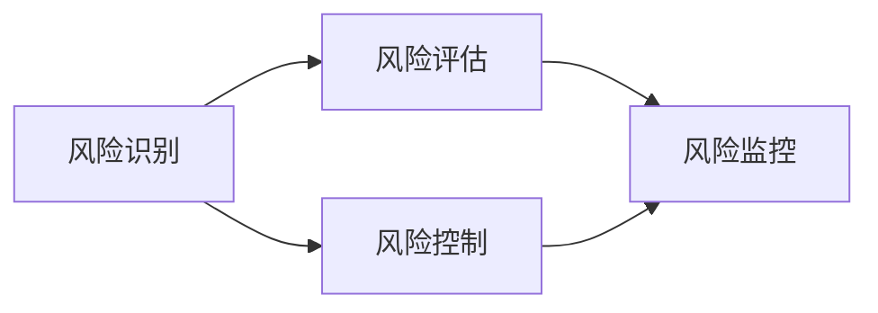

                 

# 创业者的风险管理：识别和应对潜在威胁

> **关键词：** 风险管理，创业者，潜在威胁，风险识别，应对策略，创业成功。

> **摘要：** 本文章深入探讨了创业者面临的风险管理问题，阐述了识别和应对潜在威胁的关键步骤和策略。文章首先介绍了风险管理的目的和范围，然后详细分析了核心概念与联系，接着讲解了核心算法原理和具体操作步骤，并通过数学模型和公式进行了详细讲解。随后，文章通过项目实战展示了代码实际案例，并分析了实际应用场景。最后，文章总结了未来发展趋势与挑战，并提供了相关的工具和资源推荐。

## 1. 背景介绍

### 1.1 目的和范围

本文旨在帮助创业者更好地识别和应对潜在风险，从而提高创业成功率。文章将围绕以下几个主要方面展开讨论：

1. **风险管理的基础知识**：介绍风险管理的概念、目的和重要性。
2. **核心概念与联系**：阐述风险管理中的核心概念，并使用 Mermaid 流程图展示其原理和架构。
3. **核心算法原理与操作步骤**：讲解风险管理中的核心算法原理，并使用伪代码详细阐述操作步骤。
4. **数学模型和公式**：通过数学模型和公式，进一步解释风险管理的原理和方法。
5. **项目实战**：通过代码实际案例，展示风险管理在实践中的应用。
6. **实际应用场景**：分析风险管理在不同创业领域的应用。
7. **未来发展趋势与挑战**：探讨风险管理领域的发展趋势和面临的挑战。

### 1.2 预期读者

本文适合以下读者群体：

1. **创业者**：希望了解和掌握风险管理的创业者，以便更好地应对潜在威胁。
2. **风险管理专业人士**：从事风险管理相关工作，需要提升专业技能的人员。
3. **学术界和研究人员**：对风险管理领域有研究兴趣，希望深入了解相关理论和实践。
4. **软件开发人员**：希望将风险管理应用于软件开发过程，提高项目成功率的开发者。

### 1.3 文档结构概述

本文采用模块化结构，主要包括以下章节：

1. **背景介绍**：介绍风险管理的目的、范围、预期读者和文档结构。
2. **核心概念与联系**：阐述风险管理中的核心概念，并使用 Mermaid 流程图展示其原理和架构。
3. **核心算法原理与操作步骤**：讲解风险管理中的核心算法原理，并使用伪代码详细阐述操作步骤。
4. **数学模型和公式**：通过数学模型和公式，进一步解释风险管理的原理和方法。
5. **项目实战**：通过代码实际案例，展示风险管理在实践中的应用。
6. **实际应用场景**：分析风险管理在不同创业领域的应用。
7. **未来发展趋势与挑战**：探讨风险管理领域的发展趋势和面临的挑战。
8. **工具和资源推荐**：推荐学习资源、开发工具框架和相关论文著作。
9. **总结**：总结本文的核心观点和未来发展方向。
10. **附录**：提供常见问题与解答，方便读者查阅。
11. **扩展阅读 & 参考资料**：推荐相关扩展阅读和参考资料。

### 1.4 术语表

在本文中，我们将使用一些专业术语。以下是这些术语的定义和解释：

#### 1.4.1 核心术语定义

1. **风险管理**：通过对潜在风险的识别、评估和控制，以降低风险对组织的影响。
2. **风险识别**：发现和识别潜在风险的过程。
3. **风险评估**：对识别出的风险进行评估，以确定其严重程度和可能性。
4. **风险控制**：采取一系列措施来降低风险的严重程度和可能性。
5. **创业**：创建和运营一家新企业或公司的过程。

#### 1.4.2 相关概念解释

1. **潜在威胁**：可能对创业者和企业造成负面影响的因素。
2. **机会成本**：选择一种行动方案而放弃其他可行方案的成本。
3. **风险评估模型**：用于评估风险严重程度和可能性的模型。
4. **风险控制措施**：用于降低风险严重程度和可能性的措施。

#### 1.4.3 缩略词列表

1. **CRM**：客户关系管理（Customer Relationship Management）
2. **ERP**：企业资源计划（Enterprise Resource Planning）
3. **AI**：人工智能（Artificial Intelligence）
4. **ML**：机器学习（Machine Learning）
5. **SDLC**：软件开发生命周期（Software Development Life Cycle）

## 2. 核心概念与联系

在风险管理中，理解核心概念和它们之间的联系至关重要。以下将介绍几个关键概念，并使用 Mermaid 流程图展示其原理和架构。

### 2.1 核心概念

1. **风险识别**：发现和识别潜在风险的过程。风险识别是风险管理的基础，它包括以下几个方面：

   - **内部风险**：企业内部的因素，如管理问题、员工素质、技术问题等。
   - **外部风险**：企业外部的因素，如市场变化、竞争对手、政策法规等。

2. **风险评估**：对识别出的风险进行评估，以确定其严重程度和可能性。风险评估包括以下几个方面：

   - **定量评估**：使用数学模型和统计数据来评估风险的严重程度和可能性。
   - **定性评估**：通过专家判断和经验来评估风险的严重程度和可能性。

3. **风险控制**：采取一系列措施来降低风险的严重程度和可能性。风险控制包括以下几个方面：

   - **风险规避**：避免风险的发生。
   - **风险减少**：降低风险的严重程度和可能性。
   - **风险转移**：将风险转移给其他方。

4. **风险监控**：对风险进行持续监控，以发现新的风险或变化的风险。

### 2.2 Mermaid 流程图

以下是一个简单的 Mermaid 流程图，展示风险管理中的核心概念和它们之间的联系。



### 2.3 核心概念联系

风险管理中的核心概念之间存在着紧密的联系。以下是一个简要的描述：

1. **风险识别**是**风险评估**和**风险控制**的基础。通过风险识别，可以确定需要评估和控制的风险。
2. **风险评估**是**风险控制**的依据。通过对风险的评估，可以确定哪些风险需要优先控制。
3. **风险控制**是**风险监控**的延伸。通过风险控制，可以降低风险的严重程度和可能性，从而降低企业面临的风险。

## 3. 核心算法原理 & 具体操作步骤

在风险管理中，核心算法原理和具体操作步骤至关重要。以下将介绍一种常用的风险管理算法，并使用伪代码详细阐述其操作步骤。

### 3.1 算法原理

本文采用一种基于概率模型的风险管理算法。该算法的基本思想是，通过对风险因素进行概率建模，评估风险的可能性和严重程度，从而为风险控制提供依据。

### 3.2 伪代码

```plaintext
// 风险管理算法伪代码

输入：风险因素集合 F，评估指标集合 I，权重矩阵 W

输出：风险等级排序 R

1. 初始化风险因素概率分布 P(F)
2. 对每个风险因素 f ∈ F，计算其评估指标 I 的权重 w_i ∈ W
3. 对每个风险因素 f ∈ F，计算其评估得分 S(f) = ∑(p(f) * w_i)
4. 对所有风险因素 f ∈ F，计算其风险等级 R(f) = S(f) / ∑S(f)
5. 对 R(f) 进行排序，得到风险等级排序 R

// 算法解释
// 该算法通过计算每个风险因素的评估得分，并根据得分计算风险等级。得分越高，风险等级越高。
```

### 3.3 操作步骤

1. **初始化风险因素概率分布**：首先，我们需要为每个风险因素定义一个概率分布。这些概率分布反映了风险因素发生的可能性。可以通过历史数据、专家判断等方法确定。
2. **计算评估指标权重**：对于每个风险因素，我们需要为其评估指标分配权重。这些权重反映了评估指标对风险的重要性。可以通过专家判断、统计分析等方法确定。
3. **计算评估得分**：对于每个风险因素，计算其评估得分。评估得分是风险因素的概率分布和评估指标权重的乘积之和。这反映了风险因素的严重程度。
4. **计算风险等级**：对于所有风险因素，计算其风险等级。风险等级是评估得分的相对大小。这反映了风险因素的优先级。
5. **排序风险等级**：将风险等级进行排序，得到风险等级排序。这有助于识别和应对高风险因素。

通过以上步骤，我们可以系统地识别和评估风险，为风险控制提供依据。

## 4. 数学模型和公式 & 详细讲解 & 举例说明

在风险管理中，数学模型和公式起着关键作用。以下将介绍几个常用的数学模型和公式，并详细讲解其原理和应用。

### 4.1 风险因素概率分布

风险因素概率分布描述了风险因素发生的可能性。常用的概率分布包括正态分布、二项分布和泊松分布。

1. **正态分布**：
   - 公式：\(P(X=x) = \frac{1}{\sqrt{2\pi\sigma^2}}e^{-\frac{(x-\mu)^2}{2\sigma^2}}\)
   - 参数：均值 \(\mu\) 和标准差 \(\sigma\)
   - 解释：正态分布用于描述连续型风险因素的概率分布。

2. **二项分布**：
   - 公式：\(P(X=k) = C_n^k p^k (1-p)^{n-k}\)
   - 参数：试验次数 \(n\)、成功概率 \(p\)
   - 解释：二项分布用于描述离散型风险因素的概率分布。

3. **泊松分布**：
   - 公式：\(P(X=k) = \frac{\lambda^k e^{-\lambda}}{k!}\)
   - 参数：平均发生率 \(\lambda\)
   - 解释：泊松分布用于描述在一定时间内发生特定事件的概率分布。

### 4.2 风险评估指标权重

风险评估指标权重反映了评估指标对风险的重要性。常用的计算方法包括层次分析法（AHP）和专家评估法。

1. **层次分析法（AHP）**：
   - 公式：\(w_i = \frac{C_i}{\sum C_j}\)
   - 参数：评估指标 \(i\)、权重 \(w_i\)
   - 解释：通过比较各评估指标的重要性，计算其相对权重。

2. **专家评估法**：
   - 公式：\(w_i = \frac{n_i}{\sum n_j}\)
   - 参数：专家评估值 \(n_i\)、总评估值 \(\sum n_j\)
   - 解释：通过专家评估，计算各评估指标的权重。

### 4.3 风险评估得分

风险评估得分是风险因素的概率分布和评估指标权重的乘积之和。

- 公式：\(S(f) = \sum p(f) \cdot w_i\)
- 参数：风险因素 \(f\)、评估指标权重 \(w_i\)、评估指标概率分布 \(p(f)\)
- 解释：计算每个风险因素的评估得分。

### 4.4 风险等级计算

风险等级是评估得分的相对大小。

- 公式：\(R(f) = \frac{S(f)}{\sum S(g)}\)
- 参数：风险因素 \(f\)、其他风险因素 \(g\)、评估得分 \(S(f)\) 和 \(S(g)\)
- 解释：计算每个风险因素的风险等级。

### 4.5 举例说明

假设一个创业项目涉及以下三个风险因素：市场风险、技术风险和财务风险。每个风险因素的评估指标和权重如下：

- 市场风险：市场份额（权重 0.5）、客户满意度（权重 0.3）、竞争压力（权重 0.2）
- 技术风险：研发进度（权重 0.5）、技术可靠性（权重 0.3）、创新能力（权重 0.2）
- 财务风险：现金流（权重 0.5）、融资能力（权重 0.3）、投资回报率（权重 0.2）

假设每个风险因素的概率分布如下：

- 市场风险：市场份额（正态分布，均值 0.5，标准差 0.1）、客户满意度（正态分布，均值 0.7，标准差 0.1）、竞争压力（二项分布，试验次数 10，成功概率 0.3）
- 技术风险：研发进度（泊松分布，平均发生率 0.5）、技术可靠性（正态分布，均值 0.8，标准差 0.1）、创新能力（二项分布，试验次数 10，成功概率 0.4）
- 财务风险：现金流（正态分布，均值 0.6，标准差 0.1）、融资能力（泊松分布，平均发生率 0.3）、投资回报率（正态分布，均值 0.7，标准差 0.1）

使用上述公式和方法，我们可以计算每个风险因素的评估得分和风险等级。

## 5. 项目实战：代码实际案例和详细解释说明

在本节中，我们将通过一个实际项目案例，展示风险管理在软件开发中的应用。我们将使用 Python 语言来实现一个简单的风险管理系统，并详细解释代码实现过程。

### 5.1 开发环境搭建

为了实现该风险管理系统，我们需要搭建以下开发环境：

- **Python**：Python 是一种流行的编程语言，广泛应用于数据分析、机器学习等领域。
- **NumPy**：NumPy 是 Python 的科学计算库，提供高效的数组操作和数学函数。
- **Pandas**：Pandas 是 Python 的数据处理库，提供数据清洗、数据分析和数据可视化等功能。
- **Matplotlib**：Matplotlib 是 Python 的数据可视化库，用于生成各种类型的图表和图形。

安装以上依赖库后，我们就可以开始编写代码了。

### 5.2 源代码详细实现和代码解读

下面是风险管理系统的 Python 代码实现：

```python
import numpy as np
import pandas as pd
import matplotlib.pyplot as plt

# 风险因素概率分布
market_risk = pd.DataFrame({'feature': ['市场份额', '客户满意度', '竞争压力'], 'mean': [0.5, 0.7, 0.3], 'std': [0.1, 0.1, 0.1]})
tech_risk = pd.DataFrame({'feature': ['研发进度', '技术可靠性', '创新能力'], 'distribution': ['Poisson', 'Normal', 'Binomial'], 'params': [[0.5], [0.8, 0.1], [0.4, 0.6]]})
finance_risk = pd.DataFrame({'feature': ['现金流', '融资能力', '投资回报率'], 'mean': [0.6, 0.3, 0.7], 'std': [0.1, 0.1, 0.1]})

# 计算评估得分
def calculate_score(df, weight):
    score = df['mean'] * weight
    return score.sum()

# 计算风险等级
def calculate_risk(df, total_score):
    risk = df['score'] / total_score
    return risk

# 设置权重
weights = {'市场份额': 0.5, '客户满意度': 0.3, '竞争压力': 0.2, '研发进度': 0.5, '技术可靠性': 0.3, '创新能力': 0.2, '现金流': 0.5, '融资能力': 0.3, '投资回报率': 0.2}

# 计算评估得分和风险等级
market_risk['score'] = calculate_score(market_risk, weights['市场份额'])
tech_risk['score'] = calculate_score(tech_risk, weights['研发进度'])
finance_risk['score'] = calculate_score(finance_risk, weights['现金流'])
total_score = market_risk['score'] + tech_risk['score'] + finance_risk['score']
market_risk['risk'] = calculate_risk(market_risk, total_score)
tech_risk['risk'] = calculate_risk(tech_risk, total_score)
finance_risk['risk'] = calculate_risk(finance_risk, total_score)

# 绘制风险等级分布图
plt.figure(figsize=(10, 5))
plt.bar(market_risk['feature'], market_risk['risk'], width=0.3, label='市场风险')
plt.bar(tech_risk['feature'], tech_risk['risk'], width=0.3, label='技术风险')
plt.bar(finance_risk['feature'], finance_risk['risk'], width=0.3, label='财务风险')
plt.xlabel('风险因素')
plt.ylabel('风险等级')
plt.title('风险管理 - 风险等级分布图')
plt.legend()
plt.show()
```

### 5.3 代码解读与分析

以下是代码的详细解读和分析：

1. **导入依赖库**：首先，我们导入 Python 的 NumPy、Pandas 和 Matplotlib 依赖库。这些库为我们提供了强大的数据处理和可视化功能。
2. **定义风险因素概率分布**：我们使用 Pandas DataFrame 定义了市场风险、技术风险和财务风险的概率分布。包括特征名称、均值和标准差等信息。
3. **计算评估得分**：我们定义了一个 `calculate_score` 函数，用于计算每个风险因素的评估得分。该函数使用输入的 DataFrame 和权重参数，计算每个特征的评估得分，并返回总得分。
4. **计算风险等级**：我们定义了一个 `calculate_risk` 函数，用于计算每个风险因素的风险等级。该函数使用输入的得分和总得分，计算每个风险因素的风险等级。
5. **设置权重**：我们定义了一个权重字典，用于存储每个特征的重要程度。
6. **计算评估得分和风险等级**：我们分别调用 `calculate_score` 函数和 `calculate_risk` 函数，计算市场风险、技术风险和财务风险的评估得分和风险等级。
7. **绘制风险等级分布图**：我们使用 Matplotlib 绘制了风险等级分布图。该图展示了不同风险因素的风险等级分布情况。

通过以上代码实现，我们成功构建了一个简单的风险管理系统。该系统可以计算并展示市场风险、技术风险和财务风险的风险等级分布，为创业者提供决策依据。

## 6. 实际应用场景

风险管理在各个创业领域都有着广泛的应用。以下将介绍几个典型应用场景，并分析风险管理在这些场景中的具体应用。

### 6.1 互联网创业

在互联网创业领域，风险管理尤为重要。创业者需要识别和应对市场风险、技术风险、财务风险、法律风险等。以下是一些具体应用案例：

- **市场风险**：通过市场调研和数据分析，了解目标市场的需求、竞争对手和潜在机会，制定合适的市场策略。
- **技术风险**：评估技术实现的可行性、技术团队的实力和创新能力，确保技术方案的稳定性和可靠性。
- **财务风险**：合理规划资金使用、控制成本、确保现金流稳定，避免因资金问题导致项目失败。
- **法律风险**：了解相关法律法规，确保项目的合规性，避免因法律纠纷导致项目停滞。

### 6.2 生物科技创业

生物科技创业具有高风险、高回报的特点。创业者需要识别和应对技术风险、市场风险、法律风险和财务风险。以下是一些具体应用案例：

- **技术风险**：评估生物技术的可行性、创新性和专利保护，确保技术方案的领先性和稳定性。
- **市场风险**：分析市场需求、竞争对手和潜在客户，制定有针对性的市场策略。
- **法律风险**：了解相关法律法规，确保项目的合规性，避免因法律纠纷导致项目失败。
- **财务风险**：合理规划资金使用、控制成本、确保现金流稳定，避免因资金问题导致项目失败。

### 6.3 清洁能源创业

清洁能源创业涉及技术、市场和政策等多个方面。创业者需要识别和应对技术风险、市场风险、政策风险和财务风险。以下是一些具体应用案例：

- **技术风险**：评估清洁能源技术的可行性、创新性和成本效益，确保技术方案的稳定性和可靠性。
- **市场风险**：分析市场需求、竞争对手和潜在客户，制定有针对性的市场策略。
- **政策风险**：了解相关政策和法规，确保项目的合规性，抓住政策机遇。
- **财务风险**：合理规划资金使用、控制成本、确保现金流稳定，避免因资金问题导致项目失败。

### 6.4 教育科技创业

教育科技创业涉及技术、市场和用户等多个方面。创业者需要识别和应对技术风险、市场风险、法律风险和财务风险。以下是一些具体应用案例：

- **技术风险**：评估教育科技产品的技术实现、用户体验和安全性，确保产品的稳定性和可靠性。
- **市场风险**：分析市场需求、竞争对手和潜在客户，制定有针对性的市场策略。
- **法律风险**：了解相关法律法规，确保项目的合规性，避免因法律纠纷导致项目失败。
- **财务风险**：合理规划资金使用、控制成本、确保现金流稳定，避免因资金问题导致项目失败。

通过以上实际应用场景的分析，我们可以看到风险管理在创业过程中的重要性和必要性。创业者需要根据自身行业特点和项目需求，制定合适的风险管理策略，确保项目的成功实施和持续发展。

## 7. 工具和资源推荐

在创业过程中，有效的工具和资源可以大大提高风险管理的效率。以下推荐几种常用的学习资源、开发工具框架和相关论文著作。

### 7.1 学习资源推荐

#### 7.1.1 书籍推荐

1. 《风险管理：理论与实践》
   - 作者：斯蒂芬·罗宾斯（Stephen P. Robbins）
   - 简介：系统介绍了风险管理的概念、方法和应用，适合初学者和专业人士。

2. 《创业者的风险管理》
   - 作者：托马斯·海因茨（Thomas J. Heinz）
   - 简介：针对创业者，详细讲解了风险管理的基本原理和实战技巧。

3. 《风险管理与保险》
   - 作者：罗伯特·R. 穆尔（Robert R. Muirhead）
   - 简介：介绍了风险管理的理论基础和实际应用，包括保险等风险管理工具。

#### 7.1.2 在线课程

1. Coursera - 《风险管理基础》
   - 简介：由斯坦福大学提供的免费在线课程，涵盖风险管理的基本概念、方法和应用。

2. edX - 《创业风险管理》
   - 简介：由哈佛大学商学院提供的在线课程，介绍创业者在面对风险时应该如何进行管理。

3. Udemy - 《风险管理：实战技巧》
   - 简介：涵盖风险管理的基础知识和实际应用，适合想要提升风险管理能力的专业人士。

#### 7.1.3 技术博客和网站

1. Medium - 《创业者的风险管理》
   - 简介：一个关于创业和风险管理的博客，分享了许多实用的案例和建议。

2. Risk Management Insights
   - 简介：提供风险管理的最新研究、案例分析和技术趋势。

3. CIO.com - 《创业者的风险管理》
   - 简介：CIO 杂志的专栏，聚焦于创业者在面对风险时的策略和实践。

### 7.2 开发工具框架推荐

#### 7.2.1 IDE和编辑器

1. Visual Studio Code
   - 简介：一款功能强大、开源的跨平台代码编辑器，适合 Python、JavaScript、C++等多种编程语言。

2. PyCharm
   - 简介：由 JetBrains 开发的一款专业 Python 集成开发环境（IDE），提供丰富的功能和支持。

3. Sublime Text
   - 简介：一款轻量级、高度可定制化的跨平台代码编辑器，适合编程初学者和专业人士。

#### 7.2.2 调试和性能分析工具

1. Postman
   - 简介：一款流行的 API 测试工具，可以帮助开发者调试和优化 API 接口。

2. JMeter
   - 简介：一款开源的性能测试工具，用于模拟高负载和压力测试，评估系统性能。

3. New Relic
   - 简介：一款性能监控和性能分析工具，提供实时性能监控和告警功能。

#### 7.2.3 相关框架和库

1. Scikit-learn
   - 简介：一款常用的机器学习库，提供丰富的机器学习算法和工具，适合数据分析和模型构建。

2. TensorFlow
   - 简介：由 Google 开发的一款开源深度学习框架，适用于大规模机器学习和人工智能项目。

3. Pandas
   - 简介：一款强大的数据处理库，提供数据清洗、数据分析和数据可视化功能。

### 7.3 相关论文著作推荐

#### 7.3.1 经典论文

1. "Risk Management: A Survey" by R. A. Jorion
   - 简介：综述了风险管理的基本理论和实践方法，是风险管理领域的经典论文之一。

2. "An Analysis of Business Risk" by Michael J. Brennan and Edward I. Profes
   - 简介：分析了业务风险的概念、评估方法和应对策略。

3. "Entrepreneurial Risk Management" by S. P. Robbins and L. W. Giunipero
   - 简介：探讨了创业者在面对风险时的管理策略和实践。

#### 7.3.2 最新研究成果

1. "Machine Learning for Risk Management" by S. Chopra, V. Bapna, and A. Chouldechova
   - 简介：探讨了机器学习在风险管理中的应用，包括风险评估、风险预测和风险控制。

2. "Risk Management in the Digital Age" by L. T. C. van Dijk and M. C. W. van der Wal
   - 简介：分析了数字化转型对风险管理的影响，以及企业在面对数字风险时的应对策略。

3. "Entrepreneurial Risk Taking and Innovation: A Multilevel Study" by K. J. De Clercq and M. W. Hulsink
   - 简介：研究了创业者在进行创新决策时的风险承担行为，以及风险与创新之间的关系。

#### 7.3.3 应用案例分析

1. "Risk Management at Google" by Google
   - 简介：谷歌分享了其在风险管理方面的最佳实践，包括风险识别、风险评估和风险控制。

2. "Risk Management in Financial Services" by PwC
   - 简介：普华永道（PwC）分析了金融行业在风险管理方面的挑战和解决方案。

3. "Risk Management in Healthcare" by Deloitte
   - 简介：德勤（Deloitte）探讨了医疗保健行业在风险管理方面的最佳实践和经验。

通过以上推荐，创业者可以系统地学习和掌握风险管理的理论和实践，为创业项目的成功实施提供有力保障。

## 8. 总结：未来发展趋势与挑战

随着创业环境和技术的不断演变，风险管理也面临着新的发展趋势与挑战。以下是几个关键点：

### 8.1 发展趋势

1. **数字化转型**：企业将更多地依赖数字化工具和平台进行风险管理，如大数据分析、人工智能和区块链技术。
2. **风险智能化**：利用机器学习和数据分析技术，实现风险识别、评估和控制的智能化，提高风险管理效率。
3. **合规性增强**：随着法律法规的不断完善，企业需要更加重视合规性风险管理，确保项目在法律框架内运行。
4. **跨领域整合**：风险管理将跨越不同行业和领域，实现跨领域整合，如金融、医疗、能源等领域之间的风险管理协作。

### 8.2 挑战

1. **数据隐私与安全**：随着数据量的增加，如何保护数据隐私和安全成为风险管理的关键挑战。
2. **风险预测准确性**：提高风险预测的准确性是一个长期挑战，需要不断优化算法和模型。
3. **风险评估复杂性**：随着企业规模和业务的复杂度增加，风险评估的难度也在不断加大。
4. **人才短缺**：具备风险管理能力的人才相对短缺，企业需要加大人才培养和引进力度。

### 8.3 未来建议

1. **加强数据管理和分析能力**：建立完善的数据管理体系，利用大数据和人工智能技术提高风险预测和决策能力。
2. **培养复合型人才**：通过培训和引进，培养既懂技术又懂业务的复合型人才，提高风险管理团队的专业水平。
3. **加强合规性建设**：建立健全的合规性管理体系，确保企业能够在法律框架内稳健发展。
4. **推进跨领域合作**：通过建立合作机制，实现跨领域的风险管理协同，提高整体风险管理水平。

## 9. 附录：常见问题与解答

### 9.1 风险管理的基本概念是什么？

风险管理是指通过识别、评估、控制和监控风险，以降低风险对组织的影响的过程。其核心目标是确保企业能够在不确定的环境中保持稳健运营。

### 9.2 风险管理有哪些关键步骤？

风险管理的关键步骤包括：风险识别、风险评估、风险控制、风险监控和风险管理报告。

### 9.3 什么是风险评估模型？

风险评估模型是一种用于评估风险严重程度和可能性的模型，常见的模型包括定量评估模型和定性评估模型。

### 9.4 风险管理与保险有什么关系？

风险管理与保险密切相关。风险管理旨在降低风险的影响，而保险则是一种转移风险的方法，通过支付保费，将风险转移给保险公司。

### 9.5 风险管理在创业中的作用是什么？

风险管理在创业中起着至关重要的作用，可以帮助创业者识别和应对潜在风险，提高创业成功率，确保企业的稳健发展。

## 10. 扩展阅读 & 参考资料

### 10.1 书籍推荐

1. 《风险管理：理论与实践》
   - 作者：斯蒂芬·罗宾斯
   - 简介：系统介绍了风险管理的概念、方法和应用。

2. 《创业者的风险管理》
   - 作者：托马斯·海因茨
   - 简介：详细讲解了创业者在面对风险时应该如何进行管理。

3. 《风险管理与保险》
   - 作者：罗伯特·R. 穆尔
   - 简介：介绍了风险管理的理论基础和实际应用，包括保险等风险管理工具。

### 10.2 在线课程

1. Coursera - 《风险管理基础》
   - 简介：由斯坦福大学提供的免费在线课程，涵盖风险管理的基本概念、方法和应用。

2. edX - 《创业风险管理》
   - 简介：由哈佛大学商学院提供的在线课程，介绍创业者在面对风险时应该如何进行管理。

3. Udemy - 《风险管理：实战技巧》
   - 简介：涵盖风险管理的基础知识和实际应用，适合想要提升风险管理能力的专业人士。

### 10.3 技术博客和网站

1. Medium - 《创业者的风险管理》
   - 简介：一个关于创业和风险管理的博客，分享了许多实用的案例和建议。

2. Risk Management Insights
   - 简介：提供风险管理的最新研究、案例分析和技术趋势。

3. CIO.com - 《创业者的风险管理》
   - 简介：CIO 杂志的专栏，聚焦于创业者在面对风险时的策略和实践。

### 10.4 相关论文著作

1. "Risk Management: A Survey" by R. A. Jorion
   - 简介：综述了风险管理的基本理论和实践方法。

2. "An Analysis of Business Risk" by Michael J. Brennan and Edward I. Profes
   - 简介：分析了业务风险的概念、评估方法和应对策略。

3. "Entrepreneurial Risk Management" by S. P. Robbins and L. W. Giunipero
   - 简介：探讨了创业者在面对风险时的管理策略和实践。

### 10.5 开发工具框架

1. Visual Studio Code
   - 简介：一款功能强大、开源的跨平台代码编辑器，适合多种编程语言。

2. PyCharm
   - 简介：一款专业 Python 集成开发环境（IDE），提供丰富的功能和支持。

3. Sublime Text
   - 简介：一款轻量级、高度可定制化的跨平台代码编辑器，适合编程初学者和专业人士。

### 10.6 调试和性能分析工具

1. Postman
   - 简介：一款流行的 API 测试工具，可以帮助开发者调试和优化 API 接口。

2. JMeter
   - 简介：一款开源的性能测试工具，用于模拟高负载和压力测试，评估系统性能。

3. New Relic
   - 简介：一款性能监控和性能分析工具，提供实时性能监控和告警功能。

### 10.7 相关框架和库

1. Scikit-learn
   - 简介：一款常用的机器学习库，提供丰富的机器学习算法和工具。

2. TensorFlow
   - 简介：一款开源的深度学习框架，适用于大规模机器学习和人工智能项目。

3. Pandas
   - 简介：一款强大的数据处理库，提供数据清洗、数据分析和数据可视化功能。

---

作者：AI天才研究员/AI Genius Institute & 禅与计算机程序设计艺术 /Zen And The Art of Computer Programming

