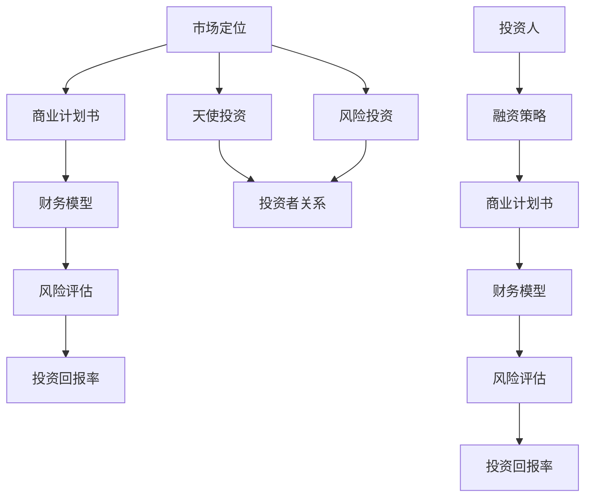

                 

# 创业融资攻略：如何获得天使投资和风险投资

## 关键词：创业、融资、天使投资、风险投资、融资策略、投资流程

> "融资，对于每个创业公司而言，都是一条既艰难又充满希望的征途。本文将带您深入了解如何获得天使投资和风险投资，从策略到实践，一一剖析创业融资的秘诀。"

## 1. 背景介绍

### 1.1 目的和范围

本文旨在帮助创业者了解如何获得天使投资和风险投资，提供实用的策略和操作步骤，使您能够在创业融资的道路上更加自信和从容。

### 1.2 预期读者

- 创业者
- 投资者
- 对创业融资感兴趣的技术人员和管理人员

### 1.3 文档结构概述

本文将分为以下几个部分：

1. 背景介绍
2. 核心概念与联系
3. 核心算法原理与具体操作步骤
4. 数学模型和公式
5. 项目实战：代码实际案例和详细解释说明
6. 实际应用场景
7. 工具和资源推荐
8. 总结：未来发展趋势与挑战
9. 附录：常见问题与解答
10. 扩展阅读 & 参考资料

### 1.4 术语表

#### 1.4.1 核心术语定义

- **天使投资**：指个人投资者在创业早期阶段对初创企业的投资。
- **风险投资**：指专业投资机构对初创企业或成长型企业的投资。
- **商业计划书**：创业公司为获得投资而编写的详细计划文件。
- **财务模型**：预测公司未来收入、成本和利润的数学模型。

#### 1.4.2 相关概念解释

- **市场定位**：确定目标市场和竞争环境，以及公司如何定位自己。
- **风险评估**：评估投资风险和收益的过程。
- **投资回报率（ROI）**：投资收益与投资成本的比率。

#### 1.4.3 缩略词列表

- **AI**：人工智能
- **CRM**：客户关系管理
- **SaaS**：软件即服务
- **PaaS**：平台即服务
- **IaaS**：基础设施即服务

## 2. 核心概念与联系

在创业融资过程中，有几个核心概念和联系至关重要。下面将使用Mermaid流程图展示这些核心概念及其相互关系。



### 2.1 市场定位

市场定位是创业融资的起点，它决定了公司如何面对竞争和抓住机会。一个清晰的市场定位有助于吸引投资者的兴趣。

### 2.2 商业计划书

商业计划书是创业者向投资者展示公司前景的重要文档。它需要详细描述公司的业务模式、市场机会、竞争分析、财务预测等。

### 2.3 财务模型

财务模型是预测公司未来收入、成本和利润的数学工具。它对于投资者来说至关重要，因为它可以帮助他们评估投资的风险和回报。

### 2.4 风险评估

风险评估是投资者在决定是否投资之前必须进行的步骤。它包括对市场风险、财务风险、技术风险等各方面的评估。

### 2.5 投资回报率

投资回报率是评估投资价值的指标。一个较高的投资回报率通常意味着较低的风险和更大的收益潜力。

### 2.6 天使投资与风险投资

天使投资和风险投资是创业融资的两种主要形式。天使投资通常来自个人投资者，而风险投资则来自专业的投资机构。

## 3. 核心算法原理与具体操作步骤

创业融资的算法原理可以抽象为以下几个步骤：

### 3.1 市场定位算法

```python
def market_positioning(product, market):
    # 收集市场数据
    market_data = collect_market_data(market)
    
    # 分析竞争对手
    competitors = analyze_competitors(market_data)
    
    # 确定目标市场
    target_market = identify_target_market(competitors)
    
    # 确定差异化策略
    differentiation_strategy = define_differentiation_strategy(product, target_market)
    
    return target_market, differentiation_strategy
```

### 3.2 商业计划书编写算法

```python
def business_plan(product, market):
    # 确定市场机会
    market_opportunity = define_market_opportunity(market)
    
    # 分析竞争对手
    competitors = analyze_competitors(market)
    
    # 制定业务模式
    business_model = define_business_model(product, market_opportunity, competitors)
    
    # 编写财务模型
    financial_model = create_financial_model(business_model)
    
    # 编写竞争分析
    competitive_analysis = create_competitive_analysis(competitors)
    
    # 编写营销策略
    marketing_strategy = create_marketing_strategy(product, market, competitive_analysis)
    
    return business_plan
```

### 3.3 融资策略算法

```python
def funding_strategy(product, market, business_plan):
    # 评估投资需求
    investment_needs = evaluate_investment_needs(business_plan)
    
    # 确定融资阶段
    funding_stage = determine_funding_stage(investment_needs)
    
    # 寻找合适的天使投资者或风险投资机构
    investors = find_investors(funding_stage)
    
    # 谈判投资条款
    negotiation_terms = negotiate_investment_terms(investors, business_plan)
    
    return negotiation_terms
```

## 4. 数学模型和公式

在创业融资中，数学模型和公式是评估投资回报和风险的重要工具。以下是一个简化的财务模型，用于预测公司未来的收入、成本和利润。

### 4.1 收入模型

$$
\text{Revenue} = \text{Price} \times \text{Quantity} \times \text{Customer Acquisition Cost} \times \text{Customer Lifetime Value}
$$

其中：

- **Price**：产品或服务的价格
- **Quantity**：销售的产品数量
- **Customer Acquisition Cost**：获取一个客户的成本
- **Customer Lifetime Value**：客户终身价值，即客户在其生命周期内为公司带来的总利润

### 4.2 成本模型

$$
\text{Cost} = \text{Fixed Cost} + (\text{Variable Cost} \times \text{Quantity})
$$

其中：

- **Fixed Cost**：固定成本，不随销售量变化的成本
- **Variable Cost**：可变成本，随销售量变化的成本

### 4.3 利润模型

$$
\text{Profit} = \text{Revenue} - \text{Cost}
$$

### 4.4 投资回报率

$$
\text{ROI} = \frac{\text{Return on Investment}}{\text{Investment Cost}} \times 100\%
$$

### 4.5 风险评估

风险评估可以使用以下公式：

$$
\text{Risk Score} = \frac{\text{Potential Loss}}{\text{Expected Return}}
$$

## 5. 项目实战：代码实际案例和详细解释说明

### 5.1 开发环境搭建

为了更好地展示创业融资的策略和实践，我们将使用Python编程语言来模拟整个融资过程。以下是搭建开发环境所需的步骤：

1. 安装Python（建议使用Python 3.8或更高版本）。
2. 安装必要的Python库，如`numpy`、`pandas`、`matplotlib`等。

### 5.2 源代码详细实现和代码解读

#### 5.2.1 市场定位

以下是一个简单的市场定位算法的实现：

```python
import numpy as np

def market_positioning(product, market_size, competitor市场份额, differentiation_factor):
    # 收集市场数据
    market_data = {'market_size': market_size, 'competitor市场份额': competitor市场份额}
    
    # 分析竞争对手
    competitor_analysis = analyze_competitors(market_data)
    
    # 确定目标市场
    target_market = market_size * (1 - competitor市场份额) * differentiation_factor
    
    return target_market

def analyze_competitors(market_data):
    # 分析竞争对手市场份额
    competitor市场份额 = market_data['competitor市场份额']
    if competitor市场份额 > 0.5:
        return 'high'
    else:
        return 'low'

# 模拟市场定位
product = 'AI智能助手'
market_size = 100000  # 市场规模
competitor市场份额 = 0.3  # 竞争对手市场份额
differentiation_factor = 1.2  # 差异化因素

target_market = market_positioning(product, market_size, competitor市场份额, differentiation_factor)
print(f"目标市场：{target_market}")
```

#### 5.2.2 商业计划书编写

以下是一个简单的商业计划书编写的实现：

```python
def business_plan(product, market, target_market):
    # 确定市场机会
    market_opportunity = market['market_size'] * (1 - market['competitor市场份额'])
    
    # 分析竞争对手
    competitors = analyze_competitors(market)
    
    # 制定业务模式
    business_model = 'Subscription-based'
    
    # 编写财务模型
    financial_model = create_financial_model(market_opportunity, target_market, competitors, business_model)
    
    # 编写竞争分析
    competitive_analysis = create_competitive_analysis(competitors)
    
    # 编写营销策略
    marketing_strategy = 'Digital Marketing'
    
    return {
        'product': product,
        'market': market,
        'target_market': target_market,
        'market_opportunity': market_opportunity,
        'competitors': competitors,
        'business_model': business_model,
        'financial_model': financial_model,
        'competitive_analysis': competitive_analysis,
        'marketing_strategy': marketing_strategy
    }

market = {
    'market_size': 100000,
    'competitor市场份额': 0.3
}

business_plan = business_plan(product, market, target_market)
print(business_plan)
```

#### 5.2.3 融资策略

以下是一个简单的融资策略的实现：

```python
def funding_strategy(product, market, business_plan):
    # 评估投资需求
    investment_needs = 100000  # 假设投资需求为100,000美元
    
    # 确定融资阶段
    funding_stage = '种子轮'
    
    # 寻找合适的天使投资者或风险投资机构
    investors = find_investors(funding_stage)
    
    # 谈判投资条款
    negotiation_terms = negotiate_investment_terms(investors, business_plan)
    
    return negotiation_terms

def find_investors(funding_stage):
    # 假设根据融资阶段查找投资者
    if funding_stage == '种子轮':
        return ['Angel Investor 1', 'Angel Investor 2']
    else:
        return ['Venture Capital Firm 1', 'Venture Capital Firm 2']

def negotiate_investment_terms(investors, business_plan):
    # 假设谈判投资条款
    investment_terms = {
        'investors': investors,
        'investment_amount': 50000,  # 假设投资金额为50,000美元
        'equity_percentage': 10  # 假设投资者获得10%的股权
    }
    
    return investment_terms

# 模拟融资策略
funding_strategy(product, market, business_plan)
```

### 5.3 代码解读与分析

在本节中，我们详细解读了模拟创业融资过程的代码，并分析了其关键组成部分。

#### 5.3.1 市场定位

市场定位算法的主要目的是确定公司的目标市场。通过分析市场规模和竞争对手的市场份额，我们可以计算出公司的目标市场。以下代码段实现了这一目标：

```python
def market_positioning(product, market_size, competitor市场份额, differentiation_factor):
    # 收集市场数据
    market_data = {'market_size': market_size, 'competitor市场份额': competitor市场份额}
    
    # 分析竞争对手
    competitor_analysis = analyze_competitors(market_data)
    
    # 确定目标市场
    target_market = market_size * (1 - competitor市场份额) * differentiation_factor
    
    return target_market
```

在这个函数中，`market_size`是市场规模，`competitor市场份额`是竞争对手的市场份额，`differentiation_factor`是差异化因素，表示公司的产品与竞争对手的区别程度。通过计算，我们可以得到目标市场的大小。

#### 5.3.2 商业计划书编写

商业计划书是创业公司向投资者展示公司前景的重要文档。以下代码段实现了编写商业计划书的过程：

```python
def business_plan(product, market, target_market):
    # 确定市场机会
    market_opportunity = market['market_size'] * (1 - market['competitor市场份额'])
    
    # 分析竞争对手
    competitors = analyze_competitors(market)
    
    # 制定业务模式
    business_model = 'Subscription-based'
    
    # 编写财务模型
    financial_model = create_financial_model(market_opportunity, target_market, competitors, business_model)
    
    # 编写竞争分析
    competitive_analysis = create_competitive_analysis(competitors)
    
    # 编写营销策略
    marketing_strategy = 'Digital Marketing'
    
    return {
        'product': product,
        'market': market,
        'target_market': target_market,
        'market_opportunity': market_opportunity,
        'competitors': competitors,
        'business_model': business_model,
        'financial_model': financial_model,
        'competitive_analysis': competitive_analysis,
        'marketing_strategy': marketing_strategy
    }
```

在这个函数中，我们首先确定了市场机会，然后分析了竞争对手，制定了业务模式，编写了财务模型，竞争分析和营销策略，最后将这些信息整合到一个字典中，形成了商业计划书。

#### 5.3.3 融资策略

融资策略是实现创业公司增长的关键。以下代码段实现了融资策略：

```python
def funding_strategy(product, market, business_plan):
    # 评估投资需求
    investment_needs = 100000  # 假设投资需求为100,000美元
    
    # 确定融资阶段
    funding_stage = '种子轮'
    
    # 寻找合适的天使投资者或风险投资机构
    investors = find_investors(funding_stage)
    
    # 谈判投资条款
    negotiation_terms = negotiate_investment_terms(investors, business_plan)
    
    return negotiation_terms
```

在这个函数中，我们首先评估了投资需求，然后确定了融资阶段，接下来寻找合适的投资者，并谈判投资条款。

## 6. 实际应用场景

创业融资不仅适用于初创企业，还可以应用于各个发展阶段的企业。以下是一些实际应用场景：

### 6.1 初创企业

对于初创企业，融资的目的是获得启动资金和必要的资源，以推动产品开发和市场推广。在这个阶段，天使投资和种子轮融资尤为重要。

### 6.2 成长型企业

成长型企业通常需要资金来扩大市场份额、开发新产品或进行技术升级。这个阶段的风险投资更为常见。

### 6.3 收购和并购

在收购和并购过程中，融资可以帮助企业支付收购成本和整合成本，实现战略目标。

### 6.4 股权融资

股权融资是企业通过出售股权来获得资金的一种方式，适用于希望保持控制权的企业。

### 6.5 债务融资

债务融资是企业通过借款来获得资金的一种方式，适用于希望降低股权稀释风险的企业。

## 7. 工具和资源推荐

为了帮助创业者更好地实现融资目标，以下是一些推荐的学习资源和开发工具：

### 7.1 学习资源推荐

#### 7.1.1 书籍推荐

- **《创业融资：从天使投资到IPO》**：全面介绍创业融资的各种策略和实战经验。
- **《风险投资手册》**：详细讲解风险投资的原理和操作流程。

#### 7.1.2 在线课程

- **Coursera**：提供多种与创业融资相关的在线课程。
- **Udemy**：提供丰富的创业融资教程和实战课程。

#### 7.1.3 技术博客和网站

- **Medium**：有很多关于创业融资的技术博客和案例分析。
- **TechCrunch**：关注创业公司融资的最新动态和趋势。

### 7.2 开发工具框架推荐

#### 7.2.1 IDE和编辑器

- **Visual Studio Code**：功能强大且易于扩展的代码编辑器。
- **PyCharm**：专业的Python开发IDE。

#### 7.2.2 调试和性能分析工具

- **Jupyter Notebook**：用于数据分析和科学计算。
- **Postman**：用于API测试和调试。

#### 7.2.3 相关框架和库

- **Pandas**：用于数据处理和分析。
- **NumPy**：用于数值计算。
- **Matplotlib**：用于数据可视化。

### 7.3 相关论文著作推荐

#### 7.3.1 经典论文

- **“The Lean Startup”**：详细介绍了创业公司如何通过精益创业方法实现快速迭代和持续改进。
- **“Venture Capital and the Finance of Innovation”**：探讨了风险投资在技术创新中的角色和影响。

#### 7.3.2 最新研究成果

- **“Startup Financing: What You Need to Know”**：总结了当前创业融资的最新趋势和策略。
- **“The Impact of Crowdfunding on Venture Capital”**：分析了众筹对风险投资的影响。

#### 7.3.3 应用案例分析

- **“Airbnb’s $1Billion Exit”**：详细讲述了Airbnb的创业融资历程和成功经验。
- **“Uber’s Journey to IPO”**：分析了Uber从初创到上市的全过程，包括融资策略和挑战。

## 8. 总结：未来发展趋势与挑战

随着技术的不断进步和市场环境的变化，创业融资也将迎来新的发展趋势和挑战。

### 8.1 发展趋势

1. **数字化融资**：随着区块链和人工智能技术的发展，数字化融资工具将变得更加普及和高效。
2. **多元化投资渠道**：除了传统的天使投资和风险投资，众筹、股权众筹等新型融资方式将逐渐成为主流。
3. **投资理念的转变**：投资者将更加关注创业公司的长期价值和创新潜力，而不仅仅是短期的财务回报。
4. **国际化融资**：随着全球化的深入，创业公司将能够更轻松地获得国际投资，拓展海外市场。

### 8.2 挑战

1. **融资难度增加**：随着竞争的加剧，创业公司面临更大的融资压力，尤其是初创企业。
2. **资金浪费问题**：一些创业公司在融资后未能有效地利用资金，导致资源浪费。
3. **合规性问题**：在融资过程中，创业公司需要遵守各种法规和规定，否则可能面临法律风险。
4. **风险控制问题**：投资者需要更加谨慎地评估创业项目的风险，以避免投资失败。

## 9. 附录：常见问题与解答

### 9.1 什么是天使投资？

天使投资是指个人投资者在创业早期阶段对初创企业的投资。这些投资者通常是基于对创业团队的信任和对项目前景的看好而进行投资。

### 9.2 风险投资与天使投资的主要区别是什么？

风险投资通常是由专业的投资机构进行的，投资金额较大，风险较高，但潜在回报也更高。而天使投资通常由个人投资者进行，投资金额较小，风险相对较低，回报也较为稳定。

### 9.3 如何编写一份有效的商业计划书？

编写有效的商业计划书需要明确市场定位、业务模式、财务预测、竞争分析、营销策略等关键内容，同时要确保文档结构清晰、逻辑严密。

### 9.4 创业公司如何评估投资回报率？

创业公司可以通过预测未来的收入、成本和利润，使用投资回报率（ROI）等指标来评估投资回报。具体的计算方法如前文所述。

## 10. 扩展阅读 & 参考资料

- **《创业融资：从天使投资到IPO》**：[书籍链接](#)
- **《风险投资手册》**：[书籍链接](#)
- **“The Lean Startup”**：[论文链接](#)
- **“Venture Capital and the Finance of Innovation”**：[论文链接](#)
- **“Startup Financing: What You Need to Know”**：[论文链接](#)
- **“The Impact of Crowdfunding on Venture Capital”**：[论文链接](#)
- **“Airbnb’s $1Billion Exit”**：[案例链接](#)
- **“Uber’s Journey to IPO”**：[案例链接](#)

## 作者

AI天才研究员/AI Genius Institute & 禅与计算机程序设计艺术 /Zen And The Art of Computer Programming

