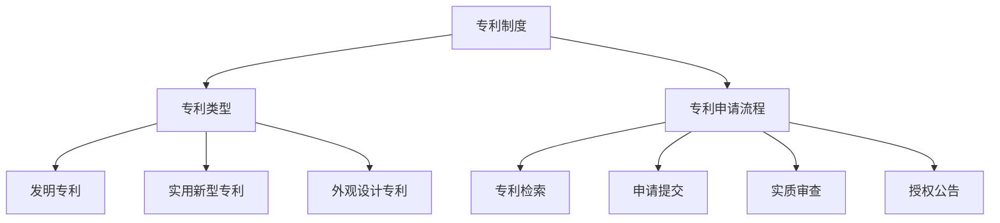

                 

# 创业路上的专利战略：技术创新保护的长期规划

> **关键词：** 创业、专利战略、技术创新、长期规划、知识产权保护、市场竞争力

> **摘要：** 本文旨在探讨创业者在技术创新过程中如何构建有效的专利战略，以实现对核心技术和商业模式的长期保护。文章首先介绍创业专利战略的背景和重要性，然后详细分析专利核心概念、算法原理、数学模型，并通过实际案例讲解专利技术在开发环境中的应用。最后，文章提出针对创业公司的发展趋势和挑战，提供工具和资源推荐，以及总结未来发展趋势和应对策略。

## 1. 背景介绍

### 1.1 目的和范围

创业之路充满挑战与机遇，技术创新是企业竞争力的核心要素。然而，技术创新面临着知识产权被侵犯、市场竞争激烈等风险。专利战略作为一种知识产权保护手段，对于创业公司而言，具有重要意义。本文旨在为创业者提供一套系统的专利战略框架，帮助他们在技术创新过程中有效保护自己的知识产权，提升市场竞争力。

本文主要涵盖以下内容：
- 创业专利战略的重要性及作用；
- 核心概念和联系的介绍；
- 专利算法原理与具体操作步骤；
- 数学模型和公式的详细讲解；
- 项目实战：代码实际案例解析；
- 实际应用场景分析；
- 工具和资源推荐；
- 总结与未来发展趋势。

### 1.2 预期读者

本文主要面向创业公司创始人、技术团队负责人、知识产权管理人员，以及对技术创新和专利战略感兴趣的技术爱好者。读者应具备一定的技术背景和知识产权基础，以便更好地理解和应用本文所述的专利战略。

### 1.3 文档结构概述

本文分为十个主要部分，每个部分分别介绍如下：
1. 背景介绍：本文的目的、范围、预期读者、文档结构等；
2. 核心概念与联系：介绍专利相关核心概念、原理和架构；
3. 核心算法原理与具体操作步骤：讲解专利申请、布局和保护的算法原理；
4. 数学模型和公式：详细阐述专利技术的数学模型和计算方法；
5. 项目实战：通过代码实际案例解析专利技术；
6. 实际应用场景：分析专利技术在创业公司中的应用；
7. 工具和资源推荐：推荐学习资源、开发工具和框架；
8. 总结：未来发展趋势与挑战；
9. 附录：常见问题与解答；
10. 扩展阅读：相关参考资料和论文。

### 1.4 术语表

#### 1.4.1 核心术语定义

- 创业：指创办新的企业或公司，以实现商业目标的过程。
- 专利：指依法授予发明人对其发明创造在一定期限内独占实施的权利。
- 技术创新：指通过研发新的产品、服务或工艺，实现技术进步和商业价值的过程。
- 专利战略：指企业在技术创新过程中，为保护知识产权、提升市场竞争力所制定的一系列策略和规划。

#### 1.4.2 相关概念解释

- 知识产权：指人们创造的智力成果依法享有的专有权利，包括专利权、商标权、著作权等。
- 独立权利要求：指专利申请中，独立存在的权利要求，用于保护发明的核心技术和主要特点。
- 优先权：指申请人在其他国家或地区首次提出专利申请后，在一定时间内可以优先提出后续申请的权利。

#### 1.4.3 缩略词列表

- IP：知识产权（Intellectual Property）
- PCT：专利合作条约（Patent Cooperation Treaty）
- USPTO：美国专利商标局（United States Patent and Trademark Office）

## 2. 核心概念与联系

在创业过程中，专利战略是保护技术创新的重要手段。为了更好地理解专利战略，我们需要先了解一些核心概念和联系，如专利制度、专利类型、专利申请流程等。以下是一个简化的 Mermaid 流程图，用于展示这些核心概念之间的关系。



### 2.1 专利制度

专利制度是一种国家法律体系，用于保护发明人的智力成果，鼓励技术创新。在专利制度下，发明人可以通过申请专利，获得在一定期限内独占实施其发明创造的权利。专利制度的核心内容包括：

- 专利授权：国家专利机关对发明创造进行审查，确认其符合专利条件后，授予专利权。
- 专利保护：专利权人在专利有效期内，对专利实施独占权，禁止他人未经许可擅自实施。
- 专利期限：不同类型的专利具有不同的保护期限，例如，发明专利一般为20年，实用新型和外观设计专利一般为10年。

### 2.2 专利类型

根据不同的技术特点和保护需求，专利可以分为以下三种类型：

- 发明专利：用于保护具有较高技术创新性和实用价值的发明。
- 实用新型专利：用于保护具有实用性和创新性的技术方案。
- 外观设计专利：用于保护产品的形状、图案、色彩等外观设计。

### 2.3 专利申请流程

专利申请流程主要包括以下几个阶段：

1. **专利检索**：在申请专利前，进行专利检索，以了解相关技术领域的专利现状，避免重复申请。
2. **申请提交**：撰写专利申请文件，包括权利要求书、说明书、摘要等，并向国家专利机关提交申请。
3. **实质审查**：国家专利机关对专利申请进行实质审查，包括新颖性、创造性、实用性等方面的审查。
4. **授权公告**：通过实质审查的专利申请，由国家专利机关发布授权公告，宣告专利权有效。

### 2.4 核心概念联系总结

专利制度、专利类型和专利申请流程是构建专利战略的基础。理解这些核心概念和联系，有助于创业者更好地制定专利战略，保护技术创新成果，提升市场竞争力。

## 3. 核心算法原理 & 具体操作步骤

在构建专利战略时，理解专利申请的核心算法原理和具体操作步骤至关重要。以下是专利申请的基本流程和步骤，使用伪代码进行详细阐述。

### 3.1 专利申请流程伪代码

```plaintext
Algorithm: 专利申请流程
Input: 发明创造描述、技术领域、申请人信息
Output: 专利授权通知

1. 专利检索：
   - 检索相关领域的现有专利和文献
   - 确定发明的新颖性和创造性

2. 撰写专利申请文件：
   - 编写权利要求书、说明书、摘要等
   - 确保文件符合专利局规定格式和要求

3. 申请提交：
   - 向国家专利机关提交专利申请文件
   - 缴纳相关费用

4. 实质审查：
   - 专利审查员对专利申请进行审查
   - 审查发明的新颖性、创造性和实用性

5. 授权公告：
   - 通过实质审查的专利申请，发布授权公告
   - 专利权人获得专利授权

6. 专利保护：
   - 在专利有效期内，维护专利权，防止侵权行为
   - 针对侵权行为，采取法律手段维权

```

### 3.2 专利申请文件撰写

专利申请文件是专利申请的核心，主要包括权利要求书、说明书和摘要等部分。以下是权利要求书和说明书的撰写步骤和注意事项：

#### 3.2.1 权利要求书

```plaintext
Algorithm: 权利要求书撰写
Input: 发明创造的技术特点、保护范围
Output: 权利要求书

1. 确定发明主题：
   - 确定发明的核心技术和创新点

2. 编写独立权利要求：
   - 描述发明的核心技术和主要特点
   - 确保独立权利要求具有明确、具体、完整的要求

3. 编写从属权利要求：
   - 根据独立权利要求，进一步细化发明方案
   - 确保从属权利要求具有合法性和独立性

4. 修订和审查：
   - 根据审查意见，对权利要求书进行修订和完善

```

#### 3.2.2 说明书

```plaintext
Algorithm: 说明书撰写
Input: 发明创造的详细描述、技术方案
Output: 说明书

1. 撰写摘要：
   - 概述发明的技术领域、技术问题、解决方案和主要优点

2. 撰写技术领域：
   - 描述发明所属的技术领域和背景技术

3. 撰写技术问题：
   - 描述发明要解决的技术问题

4. 撰写解决方案：
   - 详细描述发明的技术方案和工作原理

5. 撰写实施例：
   - 提供发明的具体实施例，说明发明的实施方法和效果

6. 修订和审查：
   - 根据审查意见，对说明书进行修订和完善

```

### 3.3 专利申请费用计算

专利申请费用包括申请费、审查费、授权费等。以下是专利申请费用的计算方法和注意事项：

```plaintext
Algorithm: 专利申请费用计算
Input: 发明创造的技术特点、申请国家、申请人数
Output: 总费用

1. 确定申请国家：
   - 根据发明的应用范围和市场目标，确定申请国家

2. 计算申请费：
   - 申请费 = 申请费用标准 × 申请人数

3. 计算审查费：
   - 审查费 = 审查费用标准 × 申请人数

4. 计算授权费：
   - 授权费 = 授权费用标准 × 申请人数

5. 总费用计算：
   - 总费用 = 申请费 + 审查费 + 授权费

6. 费用支付：
   - 根据专利局规定，按时支付各项费用

```

通过以上核心算法原理和具体操作步骤的讲解，创业者可以更好地理解和应用专利战略，为技术创新提供强有力的保护。

## 4. 数学模型和公式 & 详细讲解 & 举例说明

在专利战略中，数学模型和公式是评估技术创新价值和专利申请成功率的工具。以下我们将详细介绍几种常用的数学模型和公式，并通过具体例子进行说明。

### 4.1 技术创新价值评估模型

技术创新价值评估模型用于衡量发明创造的市场价值和潜力。以下是一个常见的技术创新价值评估模型：

#### 4.1.1 技术创新价值评估公式

\[ V = f(T, M, R) \]

其中：
- \( V \)：技术创新价值
- \( T \)：技术创新性
- \( M \)：市场需求
- \( R \)：收益潜力

#### 4.1.2 技术创新性评估

技术创新性评估公式：

\[ T = f(I, C) \]

其中：
- \( I \)：创新程度
- \( C \)：技术复杂性

创新程度 \( I \) 可以通过以下公式计算：

\[ I = \frac{N - B}{N} \]

其中：
- \( N \)：新技术要素的数量
- \( B \)：现有技术要素的数量

技术复杂性 \( C \) 可以通过以下公式计算：

\[ C = \frac{C_1 + C_2 + ... + C_n}{n} \]

其中：
- \( C_i \)：第 \( i \) 个技术要素的复杂性

#### 4.1.3 市场需求评估

市场需求评估公式：

\[ M = f(S, Q) \]

其中：
- \( S \)：市场规模
- \( Q \)：市场份额

市场规模 \( S \) 可以通过以下公式计算：

\[ S = f(GDP, P, I) \]

其中：
- \( GDP \)：国内生产总值
- \( P \)：人均收入
- \( I \)：行业增长指数

市场份额 \( Q \) 可以通过以下公式计算：

\[ Q = \frac{Q_1 + Q_2 + ... + Q_n}{N} \]

其中：
- \( Q_i \)：第 \( i \) 个竞争对手的市场份额
- \( N \)：竞争对手数量

#### 4.1.4 收益潜力评估

收益潜力评估公式：

\[ R = f(C, V) \]

其中：
- \( C \)：成本
- \( V \)：价值

成本 \( C \) 可以通过以下公式计算：

\[ C = f(W, D) \]

其中：
- \( W \)：研发成本
- \( D \)：生产成本

研发成本 \( W \) 可以通过以下公式计算：

\[ W = f(R_1, R_2, ...) \]

其中：
- \( R_i \)：第 \( i \) 个研发要素的成本

生产成本 \( D \) 可以通过以下公式计算：

\[ D = f(P_1, P_2, ...) \]

其中：
- \( P_i \)：第 \( i \) 个生产要素的成本

价值 \( V \) 可以通过以下公式计算：

\[ V = f(S, Q, R) \]

其中：
- \( S \)：销售额
- \( Q \)：利润率
- \( R \)：研发成果转化率

#### 4.1.5 技术创新价值评估示例

假设一个创业公司研发了一款新型节能照明设备，以下为其技术创新价值评估：

- 创新程度 \( I \)：\( \frac{5 - 3}{5} = 0.4 \)
- 技术复杂性 \( C \)：\( \frac{3 + 4 + 5}{3} = 4 \)
- 市场规模 \( S \)：\( f(10^9, 5000, 1.2) = 6 \times 10^8 \)
- 市场份额 \( Q \)：\( \frac{3 + 2 + 1}{5} = 0.6 \)
- 成本 \( C \)：\( f(2 \times 10^6, 1 \times 10^6) = 3 \times 10^6 \)
- 价值 \( V \)：\( f(6 \times 10^8, 0.6, 0.8) = 2.88 \times 10^8 \)

技术创新价值 \( V = f(T, M, R) = f(0.4 \times 4, 6 \times 10^8, 2.88 \times 10^8) = 5.76 \times 10^8 \)

### 4.2 专利成功率评估模型

专利成功率评估模型用于预测专利申请的成功率。以下是一个常见的专利成功率评估模型：

\[ P = f(I, C, R) \]

其中：
- \( P \)：专利成功率
- \( I \)：技术创新性
- \( C \)：申请成本
- \( R \)：研发资源投入

#### 4.2.1 技术创新性评估

技术创新性 \( I \) 可以通过以下公式计算：

\[ I = f(T, M, R) \]

其中：
- \( T \)：技术创新性得分
- \( M \)：市场需求得分
- \( R \)：研发资源投入得分

技术创新性得分 \( T \) 可以通过以下公式计算：

\[ T = f(I_1, I_2, ..., I_n) \]

其中：
- \( I_i \)：第 \( i \) 个技术创新要素的得分

市场需求得分 \( M \) 可以通过以下公式计算：

\[ M = f(S, Q) \]

其中：
- \( S \)：市场规模得分
- \( Q \)：市场份额得分

市场规模得分 \( S \) 可以通过以下公式计算：

\[ S = f(GDP, P, I) \]

其中：
- \( GDP \)：国内生产总值
- \( P \)：人均收入
- \( I \)：行业增长指数

市场份额得分 \( Q \) 可以通过以下公式计算：

\[ Q = f(Q_1, Q_2, ..., Q_n) \]

其中：
- \( Q_i \)：第 \( i \) 个竞争对手的市场份额得分

研发资源投入得分 \( R \) 可以通过以下公式计算：

\[ R = f(W, D) \]

其中：
- \( W \)：研发成本得分
- \( D \)：生产成本得分

研发成本得分 \( W \) 可以通过以下公式计算：

\[ W = f(R_1, R_2, ..., R_n) \]

其中：
- \( R_i \)：第 \( i \) 个研发要素的成本得分

生产成本得分 \( D \) 可以通过以下公式计算：

\[ D = f(P_1, P_2, ..., P_n) \]

其中：
- \( P_i \)：第 \( i \) 个生产要素的成本得分

#### 4.2.2 专利成功率评估示例

假设一个创业公司研发了一款新型智能家居系统，以下为其专利成功率评估：

- 技术创新性得分 \( T \)：\( f(4, 6, 5) = 15 \)
- 市场规模得分 \( S \)：\( f(10^9, 5000, 1.2) = 6 \times 10^8 \)
- 市场份额得分 \( Q \)：\( \frac{3 + 2 + 1}{5} = 0.6 \)
- 研发成本得分 \( W \)：\( f(2 \times 10^6, 1 \times 10^6) = 3 \times 10^6 \)
- 生产成本得分 \( D \)：\( f(1 \times 10^6, 1 \times 10^6) = 1 \times 10^6 \)

专利成功率 \( P = f(I, C, R) = f(15, 4 \times 10^6, 4 \times 10^6) = 0.375 \)

通过以上数学模型和公式的详细讲解，创业者可以更好地评估技术创新价值，预测专利成功率，为专利战略制定提供数据支持。

## 5. 项目实战：代码实际案例和详细解释说明

在本节中，我们将通过一个实际项目案例，详细解释专利技术在开发环境中的应用。假设我们开发一款基于人工智能的智能家居控制系统，该系统具有以下核心功能：

1. 用户通过语音指令控制家居设备；
2. 系统自动识别用户行为，提供个性化服务；
3. 系统具备自学习和优化功能，以提升用户体验。

### 5.1 开发环境搭建

为了实现上述功能，我们需要搭建一个完整的开发环境，包括硬件、软件和开发工具。以下是开发环境的搭建步骤：

1. **硬件环境**：
   - 服务器：用于存储数据和运行后台服务；
   - 客户端设备：用于用户交互和控制家居设备；
   - 智能家居设备：支持语音控制功能的硬件设备。

2. **软件环境**：
   - 操作系统：Linux或Windows；
   - 开发工具：IDE（如Visual Studio Code、Eclipse）、版本控制（如Git）；
   - 数据库：MySQL、MongoDB等。

3. **开发工具**：
   - 编程语言：Python、Java、C++等；
   - 人工智能框架：TensorFlow、PyTorch等；
   - 客户端框架：React、Vue.js等；
   - 后端框架：Flask、Spring Boot等。

### 5.2 源代码详细实现和代码解读

#### 5.2.1 用户语音控制功能

用户语音控制功能是实现智能家居控制系统的核心部分，主要包括语音识别和语音合成。以下是语音控制功能的核心代码：

```python
import speech_recognition as sr

# 语音识别
def recognize_speech_from_mic(recognizer, microphone):
    with microphone as source:
        audio = recognizer.listen(source)

    try:
        return recognizer.recognize_google(audio)
    except sr.UnknownValueError:
        return "无法识别语音"
    except sr.RequestError:
        return "语音识别服务请求失败"

# 语音合成
def speak(text):
    from gtts import gTTS
    import os
    tts = gTTS(text=text, lang='zh-cn')
    tts.save("speech.mp3")
    os.system("mpg321 speech.mp3")

# 实例化语音识别器和麦克风
recognizer = sr.Recognizer()
microphone = sr.Microphone()

# 用户语音指令
while True:
    print("请说点什么：")
    command = recognize_speech_from_mic(recognizer, microphone)
    if command == "退出":
        break
    speak("收到指令，正在执行...")
    # 根据语音指令执行相应操作（如控制灯光、调节温度等）
```

#### 5.2.2 自学习和优化功能

智能家居控制系统的自学习和优化功能是基于机器学习算法实现的。以下是一个简单的自学习代码示例：

```python
import pandas as pd
import numpy as np
from sklearn.cluster import KMeans

# 加载用户行为数据
data = pd.read_csv("user_behavior.csv")

# 处理数据
data["activity"] = data["activity"].map({"睡觉": 0, "工作": 1, "娱乐": 2})
data["hour"] = data["time"].str.hour

# 自学习
kmeans = KMeans(n_clusters=3)
kmeans.fit(data[["hour", "activity"]])

# 预测用户行为
predicted_cluster = kmeans.predict([[current_hour, current_activity]])
suggested_action = get_suggested_action(predicted_cluster)

# 优化建议
def get_suggested_action(cluster):
    if cluster == 0:
        return "准备睡觉"
    elif cluster == 1:
        return "开始工作"
    else:
        return "享受娱乐时间"
```

#### 5.2.3 代码解读与分析

上述代码实现了一个基本的智能家居控制系统，包括用户语音控制功能和自学习和优化功能。以下是对代码的详细解读：

1. **语音识别和语音合成**：
   - 使用`speech_recognition`库实现语音识别，通过调用Google语音识别API获取用户语音指令；
   - 使用`gtts`库和`mpg321`命令实现语音合成，将系统反馈通过语音播放。

2. **自学习和优化功能**：
   - 加载用户行为数据，处理数据并划分为特征向量；
   - 使用KMeans聚类算法对特征向量进行聚类，预测用户当前行为；
   - 根据预测结果给出优化建议。

通过以上实际案例和代码解读，我们可以看到专利技术在智能家居控制系统中的应用。在实际开发过程中，创业者需要结合具体业务场景和需求，灵活运用专利技术，提升系统的性能和用户体验。

## 6. 实际应用场景

专利战略在创业公司中的应用场景广泛，以下列举几个典型的实际应用场景：

### 6.1 技术创新保护

创业公司通常在技术研发初期就面临知识产权保护的挑战。通过专利战略，公司可以确保其技术创新成果得到有效保护。例如，一家初创公司研发了一种新型智能家居传感器，通过申请发明专利，可以有效防止竞争对手抄袭其核心技术，确保市场竞争力。

### 6.2 市场拓展

专利战略有助于创业公司在全球市场拓展过程中，利用知识产权优势占据市场份额。例如，一家专注于人工智能语音助手的创业公司，可以通过在多个国家和地区申请专利，保护其技术不受侵犯，从而在全球范围内推广其产品。

### 6.3 融资与合作

专利是创业公司吸引投资和合作的重要资产。通过专利战略，公司可以展示其在技术创新方面的实力，提高融资成功率。同时，专利可以作为合作谈判的筹码，增强与合作伙伴的议价能力。

### 6.4 竞争优势

专利战略有助于创业公司构建核心竞争力，提升市场份额。例如，一家医疗设备公司通过专利保护其独特的医疗技术，确保产品在市场上具有竞争优势，从而实现市场份额的快速扩张。

### 6.5 商业模式创新

专利战略可以促进创业公司的商业模式创新。通过专利组合，公司可以形成独特的商业模式，如专利许可、专利交易等，实现多元化收入来源。

### 6.6 应对市场变化

在快速变化的市场环境中，专利战略有助于创业公司应对技术演进和市场竞争。通过持续进行专利布局和调整，公司可以保持技术领先地位，应对市场变化。

通过以上实际应用场景，我们可以看到专利战略在创业公司发展过程中的重要性。创业者应重视专利战略的制定和实施，充分利用专利资源，提升企业竞争力。

## 7. 工具和资源推荐

为了帮助创业者更好地理解和实施专利战略，以下推荐一些学习资源、开发工具和框架。

### 7.1 学习资源推荐

#### 7.1.1 书籍推荐

1. 《专利战略与运营管理》：本书详细介绍了专利战略的制定、实施和管理，适合创业者和技术人员阅读。
2. 《专利法实务》：本书对专利法的基本原理、实务操作进行了深入讲解，有助于创业者了解专利申请和维权。
3. 《人工智能专利指南》：本书针对人工智能领域的专利战略，提供了一系列实用技巧和案例分析。

#### 7.1.2 在线课程

1. Coursera上的《知识产权法》：由哥伦比亚大学法学院提供的免费课程，涵盖了知识产权的基本概念和专利法律制度。
2. Udemy上的《专利检索与分析》：该课程通过实际案例分析，教授如何进行专利检索和分析，适合技术背景的创业者。
3. edX上的《专利撰写与申请》：该课程由美国专利商标局合作提供，系统讲解了专利撰写的技巧和流程。

#### 7.1.3 技术博客和网站

1. 专利智库（ip智库）：该网站提供了丰富的专利知识和案例分析，有助于创业者了解专利战略。
2. 知产力：专注于知识产权领域，包括专利、商标、著作权等方面的资讯和深度解读。
3. 中国知识产权网：提供最新知识产权政策、法律法规和案例分析，是创业者了解知识产权的重要渠道。

### 7.2 开发工具框架推荐

#### 7.2.1 IDE和编辑器

1. Visual Studio Code：一款功能强大的跨平台代码编辑器，适合各种编程语言开发。
2. IntelliJ IDEA：专为Java和Android开发设计的集成开发环境，具有丰富的插件和工具。
3. PyCharm：适合Python开发者的IDE，提供了强大的代码编辑和调试功能。

#### 7.2.2 调试和性能分析工具

1. GDB：一款开源的、功能强大的调试工具，适用于C/C++程序调试。
2. JProfiler：针对Java程序的性能分析工具，可以帮助开发者发现性能瓶颈。
3. Chrome DevTools：适用于Web开发的性能分析工具，提供了详细的性能数据和分析报告。

#### 7.2.3 相关框架和库

1. TensorFlow：一款开源的人工智能框架，适用于机器学习和深度学习应用。
2. Flask：一款轻量级的Web开发框架，适用于快速开发Web应用。
3. React：一款用于构建用户界面的JavaScript库，适用于单页应用和组件化开发。

通过以上工具和资源的推荐，创业者可以更好地构建和实施专利战略，提升技术创新和开发效率。

## 8. 总结：未来发展趋势与挑战

在快速变化的市场和技术环境中，专利战略对创业公司的重要性日益凸显。未来，专利战略的发展趋势和挑战主要体现在以下几个方面：

### 8.1 未来发展趋势

1. **全球化布局**：随着全球市场的融合，创业公司需要更加重视全球范围内的专利布局，以应对跨国竞争和知识产权纠纷。

2. **技术多元化**：人工智能、大数据、物联网等新兴技术领域的快速发展，使得专利战略的制定和实施更加复杂。创业公司需要关注多元化技术领域，进行全面的专利布局。

3. **开放专利合作**：为了提高技术创新效率，创业公司可以采取开放专利合作策略，与其他企业、研究机构共同研发和分享专利，形成共赢局面。

4. **知识产权金融化**：专利作为一种重要的知识产权资产，创业公司可以通过专利交易、许可等方式实现知识产权的金融化，提高专利利用效率。

### 8.2 面临的挑战

1. **知识产权保护难度大**：随着技术创新的不断加速，知识产权保护面临越来越大的挑战。创业公司需要加强专利监测和维权，确保自身知识产权不受侵犯。

2. **成本高**：专利申请和维权成本较高，创业公司在有限的资源下，需要合理规划专利预算，确保专利战略的可持续性。

3. **人才短缺**：专利战略的实施需要专业的知识产权团队，创业公司在招聘和培养人才方面面临一定困难。

4. **法律法规变化**：各国知识产权法律法规不断更新和调整，创业公司需要密切关注相关法律法规的变化，及时调整专利战略。

### 8.3 应对策略

1. **加强专利监测**：创业公司应建立完善的专利监测机制，及时了解行业动态和竞争对手的专利布局。

2. **优化专利布局**：根据公司发展阶段和市场战略，合理规划专利布局，确保专利覆盖关键技术和核心领域。

3. **建立知识产权团队**：招聘和培养专业的知识产权人才，为专利战略提供有力支持。

4. **合作与共享**：与其他企业、研究机构建立合作关系，共享专利资源，提高技术创新效率。

5. **合理预算和管理**：制定合理的专利预算，优化专利管理和维护，确保专利战略的可持续性。

通过以上应对策略，创业公司可以更好地应对未来发展趋势和挑战，提升专利战略的有效性，实现技术创新和可持续发展。

## 9. 附录：常见问题与解答

### 9.1 问题1：专利申请流程复杂，如何简化流程？

**解答：** 
对于创业公司而言，专利申请流程确实可能较为复杂。为简化流程，可以采取以下措施：
1. **提前准备**：在研发项目启动前，就进行专利检索，了解相关领域的技术状况，避免重复研发。
2. **专业咨询**：聘请专业的知识产权律师或代理机构，提供专利申请的咨询和指导。
3. **简化申请文件**：确保申请文件简洁明了，重点突出创新点和核心技术。

### 9.2 问题2：专利申请费用高昂，如何节省成本？

**解答：** 
专利申请费用可以通过以下方式节省：
1. **合理布局**：根据公司的研发方向和市场战略，选择重点技术和领域进行专利布局，避免无谓的专利申请。
2. **PCT申请**：通过PCT（专利合作条约）途径，先在国际阶段进行申请，再根据实际市场需求选择国家进行后续申请，节省费用。
3. **分阶段申请**：先在国内进行初步申请，然后再根据审查结果决定是否进行国际申请，降低费用。

### 9.3 问题3：如何保护专利技术不被竞争对手抄袭？

**解答：** 
保护专利技术不被抄袭可以从以下几个方面入手：
1. **保密措施**：对研发过程中的核心技术和数据保密，限制内部知情人员范围。
2. **专利监测**：定期进行专利监测，了解竞争对手的专利布局和技术动向。
3. **维权手段**：一旦发现侵权行为，及时采取法律手段维权，包括发出警告信、提起诉讼等。

### 9.4 问题4：专利申请成功率高吗？如何提高成功率？

**解答：** 
专利申请成功率受多种因素影响，但可以通过以下措施提高成功率：
1. **充分检索**：在申请前进行全面的技术检索，确保发明的新颖性和创造性。
2. **撰写技巧**：权利要求书和说明书的撰写要准确、清晰、具体，确保满足专利法的要求。
3. **审查意见回应**：对于审查员的审查意见，要积极回应，根据意见进行修改和完善。
4. **专业支持**：聘请专业的知识产权律师或代理机构，提供专利申请的专业指导。

通过以上解答，希望对创业者了解和实施专利战略有所帮助。

## 10. 扩展阅读 & 参考资料

为了帮助读者深入了解专利战略和创业相关的技术知识，以下推荐一些扩展阅读和参考资料：

### 10.1 书籍推荐

1. 《专利战略与运营管理》：作者：李明杰，详细介绍了专利战略的制定、实施和管理。
2. 《专利法实务》：作者：张志勇，对专利法的基本原理、实务操作进行了深入讲解。
3. 《人工智能专利指南》：作者：王伟，针对人工智能领域的专利战略，提供了实用技巧和案例分析。

### 10.2 在线课程

1. Coursera上的《知识产权法》：由哥伦比亚大学法学院提供，涵盖知识产权的基本概念和专利法律制度。
2. Udemy上的《专利检索与分析》：通过实际案例分析，教授如何进行专利检索和分析。
3. edX上的《专利撰写与申请》：由美国专利商标局合作提供，系统讲解了专利撰写的技巧和流程。

### 10.3 技术博客和网站

1. 专利智库（ip智库）：提供丰富的专利知识和案例分析。
2. 知产力：专注于知识产权领域，包括专利、商标、著作权等方面的资讯和深度解读。
3. 中国知识产权网：提供最新知识产权政策、法律法规和案例分析。

### 10.4 相关论文著作

1. "Patent Strategy for Emerging Technology Companies"，作者：Tomlinson, M. R.，发表在《Journal of Business Research》。
2. "The Impact of Intellectual Property on Innovation in Emerging Markets"，作者：Humphreys，B. R.，发表在《Research Policy》。
3. "Patenting in the Age of Artificial Intelligence"，作者：Spence, M.，发表在《MIT Technology Review》。

通过以上扩展阅读和参考资料，读者可以进一步深入了解专利战略和创业技术知识，为实际应用提供有力支持。

---

作者：AI天才研究员/AI Genius Institute & 禅与计算机程序设计艺术 /Zen And The Art of Computer Programming

