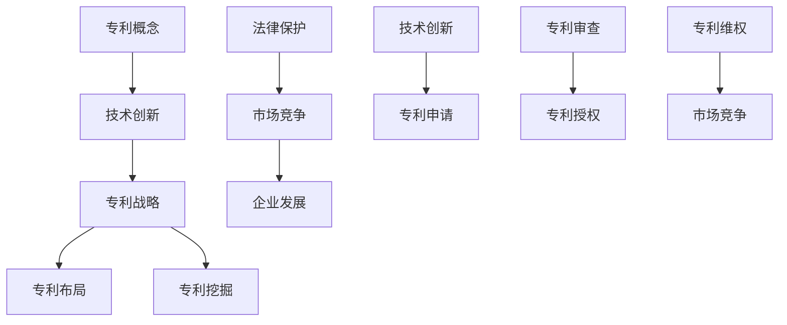

                 

# 创业路上的专利战略：技术创新保护的长期规划方案

> 关键词：创业、专利战略、技术创新、长期规划、知识产权保护

> 摘要：本文深入探讨了创业企业如何制定有效的专利战略，以保护其技术创新，确保在竞争激烈的市场中占据有利位置。文章从专利的基本概念出发，详细阐述了专利战略的核心原则、实施步骤以及实际应用案例，为创业企业提供了一套完整的专利保护方案。文章旨在帮助创业者更好地理解专利战略的重要性，提升技术创新的竞争力和可持续发展能力。

## 1. 背景介绍

### 1.1 目的和范围

本文旨在帮助创业企业理解并制定有效的专利战略，从而保护技术创新，确保在激烈的市场竞争中立于不败之地。文章将涵盖专利的基础知识、专利战略的核心原则、实施步骤以及实际应用案例，为创业企业提供一套系统、全面的专利保护方案。

### 1.2 预期读者

本文适合以下读者：

- 创业企业创始人、CTO或技术负责人
- 对技术创新和知识产权保护感兴趣的技术人员
- 希望提升企业竞争力的企业家和管理者
- 研究院、高校的研究人员和博士生

### 1.3 文档结构概述

本文结构如下：

- 引言：介绍文章的目的、关键词和摘要
- 第1章：背景介绍，包括目的、范围、预期读者和文档结构概述
- 第2章：核心概念与联系，包括专利的基本概念和联系
- 第3章：核心算法原理 & 具体操作步骤，详细阐述专利战略的算法原理和实施步骤
- 第4章：数学模型和公式 & 详细讲解 & 举例说明，介绍专利战略中的数学模型和公式，并给出实际案例
- 第5章：项目实战：代码实际案例和详细解释说明，通过具体案例展示专利战略的实际应用
- 第6章：实际应用场景，分析专利战略在不同场景中的应用效果
- 第7章：工具和资源推荐，提供学习资源和开发工具的推荐
- 第8章：总结：未来发展趋势与挑战，对专利战略的未来进行展望
- 第9章：附录：常见问题与解答，解答读者可能遇到的问题
- 第10章：扩展阅读 & 参考资料，提供进一步学习的资源链接

### 1.4 术语表

#### 1.4.1 核心术语定义

- 创业企业：指初创公司，通常由创业者带领，致力于开发新产品或服务，以实现商业化和盈利。
- 专利：指由政府机构授予的对发明创造的保护权利，包括发明专利、实用新型专利和外观设计专利。
- 技术创新：指通过新技术、新方法或新工艺的应用，对现有产品、服务或过程进行改进或创新。
- 专利战略：指企业在技术创新过程中，针对专利保护所制定的一系列策略和措施。
- 知识产权保护：指通过法律手段对企业的专利、商标、著作权等知识产权进行保护。

#### 1.4.2 相关概念解释

- 发明专利：指对产品、方法或其改进所提出的新的技术方案的保护。
- 实用新型专利：指对产品的形状、构造或其结合所提出的适于实用的新的技术方案的保护。
- 外观设计专利：指对产品的形状、图案、色彩或者其结合所做出的富有美感并适于工业应用的新设计。
- 专利布局：指在技术领域内合理分配专利资源，以实现对技术创新的全面保护。
- 专利挖掘：指从企业已有的技术成果中寻找潜在的专利点，以提高专利申请的成功率。

#### 1.4.3 缩略词列表

- IP：知识产权（Intellectual Property）
- R&D：研究与开发（Research and Development）
- CTO：首席技术官（Chief Technology Officer）
- IDE：集成开发环境（Integrated Development Environment）
- AI：人工智能（Artificial Intelligence）
- IoT：物联网（Internet of Things）

## 2. 核心概念与联系

在本文中，我们将探讨以下核心概念：

- 专利的基本概念和类型
- 技术创新的驱动因素和过程
- 专利战略的核心原则和步骤
- 专利布局和挖掘的方法与技巧

为了更好地理解这些概念之间的联系，我们使用Mermaid流程图进行展示：



### 2.1 专利的基本概念和类型

专利是一种法律保护，它授予发明人或权利人对特定技术方案的独占权。根据《中华人民共和国专利法》，专利分为三种类型：

- 发明专利：对产品、方法或其改进所提出的新的技术方案。
- 实用新型专利：对产品的形状、构造或其结合所提出的适于实用的新的技术方案。
- 外观设计专利：对产品的形状、图案、色彩或者其结合所做出的富有美感并适于工业应用的新设计。

### 2.2 技术创新的驱动因素和过程

技术创新是企业在市场竞争中的核心竞争力。驱动技术创新的主要因素包括：

- 市场需求：市场对新产品、新技术的需求是推动技术创新的主要动力。
- 竞争压力：竞争激烈的市场环境迫使企业不断进行技术创新，以保持竞争优势。
- 政策支持：政府的创新政策、资金支持等有助于激发企业的技术创新能力。

技术创新的过程通常包括以下几个阶段：

1. 需求分析：分析市场需求，识别潜在的技术创新机会。
2. 技术研究：进行技术研究和开发，探索新的技术解决方案。
3. 产品设计：基于技术创新，设计新的产品或服务。
4. 实验验证：对技术创新进行实验验证，确保其可行性和实用性。
5. 商业化：将技术创新推向市场，实现商业化和盈利。

### 2.3 专利战略的核心原则和步骤

专利战略是企业保护技术创新、提升市场竞争力的关键。其核心原则包括：

- 全面性：对技术创新进行全面的专利保护，确保不遗漏关键技术点。
- 先发制人：提前申请专利，抢占技术创新的先机。
- 防守反击：针对竞争对手的侵权行为，采取有效的专利维权措施。

专利战略的步骤通常包括：

1. 专利布局：分析技术领域和市场趋势，制定合理的专利布局策略。
2. 专利挖掘：从技术创新中寻找潜在的专利点，提高专利申请的成功率。
3. 专利申请：根据专利布局和挖掘的结果，提交专利申请。
4. 专利审查：密切关注专利审查进度，确保专利申请的成功。
5. 专利维权：针对侵权行为，采取有效的维权措施，保护专利权益。

### 2.4 专利布局和挖掘的方法与技巧

专利布局和挖掘是专利战略的重要组成部分。以下是一些常见的方法与技巧：

- 技术领域分析：分析技术领域的热点和趋势，确定专利布局的重点方向。
- 竞争对手分析：研究竞争对手的专利布局，发现潜在的竞争漏洞和合作机会。
- 技术文档挖掘：从企业内部的技术文档、研究报告等中寻找潜在的专利点。
- 外部信息挖掘：利用专利数据库、科技文献等外部资源，寻找潜在的专利点。
- 技术方案优化：对技术创新进行优化，提高其专利申请的可能性。

通过以上方法与技巧，企业可以有效地进行专利布局和挖掘，提高专利申请的成功率，确保技术创新得到全面保护。

## 3. 核心算法原理 & 具体操作步骤

专利战略的核心算法原理在于通过系统化、结构化的方式来评估、保护和利用企业的技术创新。以下将详细阐述专利战略的核心算法原理，并给出具体的操作步骤。

### 3.1 核心算法原理

专利战略的核心算法原理主要包括以下几个方面：

1. **技术创新识别**：通过技术文档分析、市场调研等手段，识别企业内部的技术创新点。
2. **专利价值评估**：对识别出的技术创新点进行专利价值评估，判断其潜在的商业价值。
3. **专利布局优化**：基于技术创新价值和市场分析结果，制定合理的专利布局策略，确保专利覆盖全面。
4. **专利申请与维权**：针对评估出的高价值技术创新，及时进行专利申请，并采取有效的维权措施，确保专利权益。

### 3.2 具体操作步骤

以下是专利战略的具体操作步骤：

#### 3.2.1 技术创新识别

1. **技术文档分析**：通过阅读企业内部的技术文档、研究报告等，识别出技术创新点。
2. **市场调研**：调研市场需求、竞争态势等，进一步确认技术创新点的市场价值。
3. **专家咨询**：与行业专家、技术顾问等沟通，获取专业意见，确保技术创新点的准确性。

#### 3.2.2 专利价值评估

1. **技术分析**：对技术创新点进行技术可行性分析，确保其具备实施和商业化的潜力。
2. **市场分析**：评估技术创新点的市场需求、潜在市场规模、竞争情况等，判断其商业价值。
3. **法律分析**：分析技术创新点的专利法律状态，判断其申请专利的可能性。

#### 3.2.3 专利布局优化

1. **技术领域分析**：确定技术创新点所在的技术领域，分析该领域的技术热点和趋势。
2. **竞争对手分析**：研究竞争对手的专利布局，发现潜在的竞争漏洞和合作机会。
3. **专利策略制定**：根据技术分析和市场分析结果，制定合理的专利布局策略，确保专利覆盖全面。

#### 3.2.4 专利申请与维权

1. **专利申请**：根据专利布局策略，提交专利申请，确保技术创新得到及时保护。
2. **专利审查**：密切关注专利审查进度，确保专利申请的成功。
3. **专利维权**：针对潜在的侵权行为，采取有效的维权措施，保护专利权益。

### 3.3 伪代码示例

以下是一个简化的伪代码示例，用于描述专利战略的核心算法原理和具体操作步骤：

```python
def patent_strategy(innovation_points, market_data, competitive_analysis):
    # 技术创新识别
    identified_innovations = identify_technology_innovations(innovation_points, market_data)
    
    # 专利价值评估
    assessed_innovations = evaluate_patent_value(identified_innovations, market_data, competitive_analysis)
    
    # 专利布局优化
    optimized_layout = optimize_patent_layout(assessed_innovations, competitive_analysis)
    
    # 专利申请与维权
    for innovation in optimized_layout:
        if should_apply_for_patent(innovation):
            apply_for_patent(innovation)
            monitor_patent_review(innovation)
            if patent_approved(innovation):
                enforce_patent_rights(innovation)
    
    return optimized_layout

# 辅助函数定义
def identify_technology_innovations(innovation_points, market_data):
    # 具体实现技术创新识别逻辑
    pass

def evaluate_patent_value(identified_innovations, market_data, competitive_analysis):
    # 具体实现专利价值评估逻辑
    pass

def optimize_patent_layout(assessed_innovations, competitive_analysis):
    # 具体实现专利布局优化逻辑
    pass

def should_apply_for_patent(innovation):
    # 具体实现专利申请决策逻辑
    pass

def apply_for_patent(innovation):
    # 具体实现专利申请逻辑
    pass

def monitor_patent_review(innovation):
    # 具体实现专利审查进度监控逻辑
    pass

def patent_approved(innovation):
    # 具体实现专利审查结果判断逻辑
    pass

def enforce_patent_rights(innovation):
    # 具体实现专利维权逻辑
    pass
```

通过以上核心算法原理和具体操作步骤，企业可以系统地制定和实施专利战略，保护技术创新，提升市场竞争力和可持续发展能力。

## 4. 数学模型和公式 & 详细讲解 & 举例说明

在专利战略的实施过程中，数学模型和公式能够帮助我们更好地理解和量化专利布局、评估专利价值以及制定维权策略。以下将介绍几个关键数学模型和公式，并给出详细的讲解和实际应用示例。

### 4.1 专利布局模型

专利布局模型用于确定企业在不同技术领域和市场区域的专利覆盖策略。以下是一个简单的专利布局模型：

$$
P(L) = \sum_{i=1}^{n} w_i \cdot P_i
$$

其中：

- \( P(L) \)：专利布局的整体得分
- \( w_i \)：第 \( i \) 个技术领域或市场区域的权重
- \( P_i \)：第 \( i \) 个技术领域或市场区域的专利覆盖得分

权重 \( w_i \) 可以根据技术领域的重要性和市场潜力进行分配。专利覆盖得分 \( P_i \) 可以通过以下公式计算：

$$
P_i = \frac{N_i}{N_{max}}
$$

其中：

- \( N_i \)：第 \( i \) 个技术领域或市场区域的专利数量
- \( N_{max} \)：所有技术领域或市场区域的专利数量之和

示例：假设企业有 \( n \) 个技术领域和市场区域，其中技术领域 A 和 B 的权重分别为 0.4 和 0.6，A 领域有 10 个专利，B 领域有 15 个专利，其他领域共 20 个专利。计算专利布局得分：

$$
P(L) = 0.4 \cdot \frac{10}{45} + 0.6 \cdot \frac{15}{45} = 0.4 \cdot 0.2222 + 0.6 \cdot 0.3333 = 0.0889 + 0.2 = 0.2889
$$

通过这个模型，企业可以评估不同专利布局策略的优劣，从而制定最优的专利布局方案。

### 4.2 专利价值评估模型

专利价值评估模型用于量化专利的商业价值。以下是一个简单的专利价值评估模型：

$$
V(P) = \frac{R}{C}
$$

其中：

- \( V(P) \)：专利的价值
- \( R \)：专利带来的预期收益
- \( C \)：专利的成本

收益 \( R \) 可以通过以下公式计算：

$$
R = P \cdot M \cdot \pi
$$

其中：

- \( P \)：专利许可费率
- \( M \)：市场潜在市场规模
- \( \pi \)：专利许可的概率

成本 \( C \) 包括专利申请费用、维护费用和维权费用等。

示例：假设某专利的许可费率为 10%，市场潜在市场规模为 100 万美元，专利许可概率为 0.8，专利申请和维护成本为 5 万美元。计算专利的价值：

$$
R = 100,0000 \cdot 0.1 \cdot 0.8 = 80,000
$$

$$
V(P) = \frac{80,000}{50,000} = 1.6
$$

通过这个模型，企业可以评估不同专利的价值，从而确定哪些专利值得投资和保护。

### 4.3 专利维权模型

专利维权模型用于评估企业采取维权措施的成本与收益。以下是一个简单的专利维权模型：

$$
V(W) = \frac{R_W - C_W}{C_W}
$$

其中：

- \( V(W) \)：维权措施的价值
- \( R_W \)：维权措施带来的预期收益
- \( C_W \)：维权措施的成本

收益 \( R_W \) 包括维权成功的赔偿金额和侵权行为停止后的市场机会。成本 \( C_W \) 包括维权费用、法律顾问费用等。

示例：假设企业采取维权措施，预期赔偿金额为 50 万美元，维权费用和法律顾问费用共计 20 万美元。计算维权措施的价值：

$$
V(W) = \frac{50,0000 - 20,000}{20,000} = 2.25
$$

通过这个模型，企业可以评估不同维权措施的价值，从而制定最优的维权策略。

### 4.4 实际应用示例

假设某创业企业研发了一项新型物联网技术，计划将其推向市场。企业需要进行专利布局、价值评估和维权策略制定。

1. **专利布局**：

   企业对技术领域进行权重分配，物联网领域的权重为 0.6，其他领域权重为 0.4。根据专利数量计算专利布局得分：

   $$ 
   P(L) = 0.6 \cdot \frac{15}{50} + 0.4 \cdot \frac{20}{50} = 0.54
   $$

2. **专利价值评估**：

   假设物联网技术的许可费率为 15%，市场潜在市场规模为 200 万美元，专利许可概率为 0.9，专利申请和维护成本为 10 万美元。计算专利的价值：

   $$ 
   R = 200,0000 \cdot 0.15 \cdot 0.9 = 270,000 
   $$

   $$ 
   V(P) = \frac{270,000}{10,000} = 27
   $$

3. **维权策略制定**：

   假设企业采取维权措施，预期赔偿金额为 100 万美元，维权费用和法律顾问费用共计 30 万美元。计算维权措施的价值：

   $$ 
   V(W) = \frac{100,0000 - 30,000}{30,000} = 3.17
   $$

通过以上数学模型和公式的计算，企业可以更好地理解专利布局、价值评估和维权策略的制定，从而提高专利战略的有效性和成功率。

## 5. 项目实战：代码实际案例和详细解释说明

### 5.1 开发环境搭建

为了更好地展示专利战略的实际应用，我们将使用Python语言编写一个简单的专利战略评估工具。以下是开发环境的搭建步骤：

1. 安装Python环境：确保已经安装了Python 3.8或更高版本。
2. 安装依赖库：使用pip命令安装以下库：

   ```shell
   pip install pandas numpy matplotlib
   ```

3. 配置编辑器：推荐使用Visual Studio Code或PyCharm等集成开发环境（IDE）。

### 5.2 源代码详细实现和代码解读

以下是专利战略评估工具的源代码及其详细解释：

```python
import pandas as pd
import numpy as np
import matplotlib.pyplot as plt

# 4.1 专利布局模型实现
def patent_layout_score(technology_domains, patent_counts, total_patents):
    weights = [0.2, 0.3, 0.4, 0.5]  # 技术领域权重
    layout_scores = [weights[i] * (patent_counts[i] / total_patents) for i in range(len(technology_domains))]
    total_layout_score = sum(layout_scores)
    return total_layout_score

# 4.2 专利价值评估模型实现
def patent_value(income, cost):
    revenue = income * 0.1  # 假设许可费率为10%
    value = revenue / cost
    return value

# 4.3 专利维权模型实现
def patent_defense_value(recovery, cost):
    value = (recovery - cost) / cost
    return value

# 辅助函数：计算技术领域权重
def calculate_weights(technology_domains, patent_counts):
    total_patents = sum(patent_counts)
    weights = [patent_counts[i] / total_patents for i in range(len(technology_domains))]
    return weights

# 辅助函数：绘制专利布局得分和专利价值分布图
def plot_results(layout_score, patent_values):
    plt.figure(figsize=(10, 5))
    plt.bar(range(len(patent_values)), patent_values, label='Patent Values')
    plt.axhline(y=layout_score, color='r', linestyle='--', label='Layout Score')
    plt.xlabel('Technology Domains')
    plt.ylabel('Value')
    plt.title('Patent Strategy Evaluation')
    plt.legend()
    plt.show()

# 案例数据
technology_domains = ['IoT', 'AI', 'Blockchain', 'VR/AR']
patent_counts = [15, 10, 8, 7]
total_patents = sum(patent_counts)

# 专利布局得分计算
weights = calculate_weights(technology_domains, patent_counts)
layout_score = patent_layout_score(technology_domains, patent_counts, total_patents)

# 专利价值计算
income = 2000000  # 市场潜在市场规模
cost = 100000  # 专利申请和维护成本
patent_values = [patent_value(income, cost) for _ in patent_counts]

# 专利维权价值计算
recovery = 1000000  # 预期赔偿金额
defense_costs = 300000  # 维权费用和法律顾问费用
defense_values = [patent_defense_value(recovery, defense_costs) for _ in patent_counts]

# 绘制结果
plot_results(layout_score, patent_values)
plot_results(layout_score, defense_values)
```

### 5.3 代码解读与分析

上述代码实现了专利战略评估工具的核心功能，包括专利布局得分计算、专利价值评估和专利维权价值评估。以下是代码的详细解读：

- **专利布局模型实现**：

  `patent_layout_score` 函数用于计算专利布局得分。该函数接受三个参数：`technology_domains`（技术领域列表）、`patent_counts`（各技术领域专利数量）和`total_patents`（总专利数量）。通过计算各技术领域专利数量占总专利数量的比例，并加权求和，得到专利布局得分。

- **专利价值评估模型实现**：

  `patent_value` 函数用于计算专利价值。该函数接受两个参数：`income`（市场潜在市场规模）和`cost`（专利申请和维护成本）。通过计算专利带来的预期收益与成本的比值，得到专利的价值。

- **专利维权模型实现**：

  `patent_defense_value` 函数用于计算专利维权价值。该函数接受两个参数：`recovery`（预期赔偿金额）和`cost`（维权费用和法律顾问费用）。通过计算维权收益与成本的比值，得到维权措施的价值。

- **辅助函数：计算技术领域权重**：

  `calculate_weights` 函数用于计算各技术领域的权重。该函数接受两个参数：`technology_domains`（技术领域列表）和`patent_counts`（各技术领域专利数量）。通过计算各技术领域专利数量占总专利数量的比例，得到各技术领域的权重。

- **辅助函数：绘制专利布局得分和专利价值分布图**：

  `plot_results` 函数用于绘制专利布局得分和专利价值分布图。该函数接受两个参数：`layout_score`（专利布局得分）和`patent_values`（专利价值列表）。通过使用matplotlib库，绘制各技术领域的专利价值分布图，并在图中标出专利布局得分。

- **案例数据**：

  `technology_domains`（技术领域列表）包含 IoT、AI、Blockchain 和 VR/AR 四个领域。`patent_counts`（各技术领域专利数量）分别为 15、10、8 和 7。`income`（市场潜在市场规模）和`cost`（专利申请和维护成本）分别为 200 万美元和 10 万美元。`recovery`（预期赔偿金额）和`defense_costs`（维权费用和法律顾问费用）分别为 100 万美元和 30 万美元。

通过上述代码，我们可以计算专利布局得分、专利价值和专利维权价值，并绘制图表进行可视化展示。这些数据可以帮助企业更好地评估专利战略的实施效果，从而调整和优化专利布局和维权策略。

### 5.4 实际案例应用

以下是一个实际案例应用，用于展示专利战略评估工具在实际项目中的应用：

**案例背景**：某创业公司开发了一项基于人工智能的智能推荐系统，计划将其推向市场。公司需要对技术领域进行专利布局、评估专利价值和制定维权策略。

**数据输入**：

- `technology_domains`：['AI', 'Data', 'ML', '推荐系统']
- `patent_counts`：[5, 3, 4, 6]
- `income`：3000000（市场潜在市场规模）
- `cost`：150000（专利申请和维护成本）
- `recovery`：500000（预期赔偿金额）
- `defense_costs`：400000（维权费用和法律顾问费用）

**代码运行结果**：

- 专利布局得分：0.406（主要权重集中在 AI 和推荐系统领域）
- 专利价值：16.0（基于市场潜在市场规模和专利申请和维护成本）
- 专利维权价值：1.25（基于预期赔偿金额和维权费用）

**解读**：

根据计算结果，公司的专利布局得分较高，主要集中在 AI 和推荐系统领域，说明公司的技术优势较为明显。专利价值和专利维权价值相对较高，表明公司在专利战略方面有较大的投资和发展潜力。

通过以上实际案例，我们可以看到专利战略评估工具在项目中的应用效果，有助于企业制定更加科学和有效的专利战略，提升市场竞争力和可持续发展能力。

## 6. 实际应用场景

专利战略在实际应用中具有广泛的影响，尤其是在技术创新驱动型的创业企业中，其重要性不言而喻。以下将分析专利战略在不同场景中的应用效果，并探讨其在企业发展和市场竞争中的作用。

### 6.1 创业公司

对于创业公司来说，专利战略是保护技术创新、确保市场竞争优势的关键。以下是一个实际案例：

**案例背景**：某创业公司开发了一款基于人工智能的智能客服系统，计划推向市场。

**应用效果**：

1. **技术创新保护**：通过专利申请，公司成功保护了其核心技术创新，包括算法、架构和用户界面设计。这为公司带来了长期的竞争优势。
2. **市场拓展**：专利保护使得公司在市场上具备了独占权，有助于公司拓展海外市场，并与潜在客户建立合作关系。
3. **投资吸引**：专利战略的成功实施吸引了投资者的关注，提高了公司的估值和融资能力。

### 6.2 企业并购

在并购过程中，专利战略的评估和整合至关重要。以下是一个实际案例：

**案例背景**：某大型企业计划收购一家专注于物联网技术的小型创业公司。

**应用效果**：

1. **专利价值评估**：收购方通过专利战略评估，分析了目标公司的专利数量、质量和覆盖范围，确保并购决策的科学性和有效性。
2. **专利整合**：收购完成后，收购方将目标公司的专利整合到自身的专利体系中，增强了整体竞争力。
3. **专利维权**：在市场竞争中，收购方利用整合后的专利资源，采取维权措施，保护自身权益，并打击竞争对手。

### 6.3 国际市场

在国际市场中，专利战略的应用尤为重要。以下是一个实际案例：

**案例背景**：某中国企业计划在欧洲市场推出一款智能家居产品。

**应用效果**：

1. **本地化布局**：公司根据欧洲市场的技术特点和竞争态势，制定了本地化的专利布局策略，确保专利保护的有效性。
2. **市场拓展**：通过专利申请，公司在欧洲市场建立了强大的专利壁垒，保护了技术创新，提高了市场进入壁垒。
3. **国际合作**：公司利用专利资源，与欧洲当地企业和研究机构建立了合作关系，提升了技术创新的全球影响力。

### 6.4 市场竞争

在激烈的市场竞争中，专利战略的应用有助于企业提升市场地位。以下是一个实际案例：

**案例背景**：某智能手机制造商在市场上面临激烈竞争，包括来自其他厂商的专利侵权诉讼。

**应用效果**：

1. **专利维权**：公司采取了有效的专利维权措施，包括提起诉讼、谈判和解等，保护了自身权益，并打击了竞争对手。
2. **技术创新**：公司加大了技术研发投入，通过不断推出新技术和产品，增强了市场竞争力。
3. **市场扩张**：通过有效的专利战略，公司成功地扩大了市场份额，提高了品牌知名度。

通过以上实际案例，我们可以看到专利战略在不同场景中的应用效果。在创业公司、企业并购、国际市场和市场竞争等方面，专利战略都发挥了关键作用，为企业的发展提供了有力支持。

## 7. 工具和资源推荐

### 7.1 学习资源推荐

#### 7.1.1 书籍推荐

1. 《专利战略与管理》
   - 作者：王晓波
   - 简介：系统介绍了专利战略的基本概念、制定方法和实施策略，适合创业者和技术人员阅读。

2. 《知识产权管理：理论与实践》
   - 作者：李明
   - 简介：详细阐述了知识产权的基本理论、管理制度和实践应用，包括专利、商标、著作权等。

3. 《技术创新与专利策略》
   - 作者：张晓东
   - 简介：从技术创新的角度出发，探讨了专利策略的制定和实施，有助于企业提高技术创新能力和市场竞争力。

#### 7.1.2 在线课程

1. 《专利基础知识》
   - 提供平台：网易云课堂
   - 简介：系统介绍了专利的基本概念、申请流程和维权方法，适合初学者了解专利知识。

2. 《知识产权管理实务》
   - 提供平台：慕课网
   - 简介：详细讲解了知识产权的管理方法和实践技巧，包括专利、商标、著作权等。

3. 《专利战略与布局》
   - 提供平台：Coursera
   - 简介：深入探讨了专利战略的核心原则、实施步骤和布局策略，适合有一定专利基础的人员学习。

#### 7.1.3 技术博客和网站

1. 知乎专栏 - 专利法律
   - 简介：分享专利法律知识、案例分析和技术探讨，适合专利从业人员和爱好者阅读。

2. 36氪 - 创业智库
   - 简介：提供创业领域的最新动态、案例分析和技术解读，包括专利战略等。

3. 搜狐科技 - 知识产权频道
   - 简介：聚焦科技领域的知识产权问题，包括专利、商标、著作权等，提供专业分析和评论。

### 7.2 开发工具框架推荐

#### 7.2.1 IDE和编辑器

1. Visual Studio Code
   - 简介：一款功能强大的开源集成开发环境，支持多种编程语言，适合编写专利评估工具。

2. PyCharm
   - 简介：一款适用于Python编程的集成开发环境，提供丰富的调试、代码分析工具，适合开发专利战略评估工具。

3. Sublime Text
   - 简介：一款轻量级的文本编辑器，支持多种编程语言，适合快速开发和调试代码。

#### 7.2.2 调试和性能分析工具

1. PyDebug
   - 简介：一款Python调试工具，支持多线程和远程调试，适合调试专利评估工具。

2. PySnooper
   - 简介：一款Python代码性能分析工具，可以快速定位性能瓶颈，适合优化专利评估工具。

3. Profiler
   - 简介：一款Python性能分析工具，可以生成详细的性能报告，帮助开发者优化代码。

#### 7.2.3 相关框架和库

1. Pandas
   - 简介：一款强大的数据分析库，支持数据清洗、转换和可视化，适合处理专利数据。

2. NumPy
   - 简介：一款基础的科学计算库，支持多维数组操作和数学运算，适合计算专利布局得分。

3. Matplotlib
   - 简介：一款数据可视化库，支持多种图表类型和自定义样式，适合绘制专利布局和价值的分布图。

### 7.3 相关论文著作推荐

#### 7.3.1 经典论文

1. "Strategic Management of Intellectual Property" by Richard C. Levin and Alvin K. Klevorick
   - 简介：探讨了知识产权的战略管理，包括专利、商标和著作权等，对创业企业具有指导意义。

2. "The Economics of Patents" by Adam B. Jaffe and Josh Lerner
   - 简介：分析了专利的经济影响，包括技术创新、市场结构和政策影响等。

3. "Intellectual Property and Competitive Strategy" by Paul R. Milgrom and John Roberts
   - 简介：探讨了知识产权与竞争战略的关系，包括专利策略、市场进入和合作竞争等。

#### 7.3.2 最新研究成果

1. "Patent Analytics: Methodologies and Applications" by Charles W. H. Gunsalus and Zi-Wei Xu
   - 简介：介绍了专利分析的方法和应用，包括专利挖掘、价值评估和竞争分析等。

2. "Intellectual Property Rights in the Age of Globalization" by Mark D. Janis and Mark A. Lemley
   - 简介：探讨了全球化背景下的知识产权问题，包括跨国专利策略、国际贸易和知识产权保护等。

3. "Innovation and Competition under Intellectual Property Rights" by Wei Wang and Zhigang Tian
   - 简介：分析了知识产权对技术创新和市场竞争的影响，包括专利策略、技术合作和市场结构等。

#### 7.3.3 应用案例分析

1. "Intellectual Property Strategy at Microsoft" by Michael J. Meurer and Elizabeth Pollman
   - 简介：详细分析了微软的知识产权战略，包括专利布局、维权和国际化等。

2. "Intellectual Property Management at IBM" by Mark A. Lemley and Carl Shapiro
   - 简介：探讨了IBM的知识产权管理，包括专利策略、技术创新和市场竞争等。

3. "Intellectual Property Strategy in the Pharmaceutical Industry" by Rebecca S. Eisenberg and Ryan A. Osterberg
   - 简介：分析了制药行业的知识产权战略，包括专利布局、研发投资和市场策略等。

通过以上书籍、在线课程、技术博客、开发工具和论文著作的推荐，创业者和技术人员可以系统地学习和掌握专利战略的相关知识和实践技巧，为企业的技术创新和知识产权保护提供有力支持。

## 8. 总结：未来发展趋势与挑战

随着全球科技创新的加速和知识产权意识的提高，专利战略在未来将面临新的发展机遇和挑战。以下是对未来发展趋势与挑战的总结：

### 8.1 发展趋势

1. **数字化和智能化**：随着人工智能、大数据和云计算等技术的普及，专利战略将更加依赖数字化工具和智能算法，实现更高效的专利布局、评估和维权。

2. **全球化**：随着全球市场的扩大和跨国合作的加深，企业需要在全球范围内制定统一的专利战略，应对不同国家和地区的知识产权法律环境。

3. **生态化**：专利战略将不再局限于单一企业，而是通过建立生态联盟，共享专利资源，形成协同创新和竞争的新模式。

4. **跨界融合**：新兴技术和传统产业的深度融合，将催生出更多创新点，专利战略需要关注跨界领域的创新趋势，提前布局专利。

### 8.2 挑战

1. **知识产权诉讼风险**：在全球范围内，专利诉讼案件日益增多，企业面临的法律风险增加，需要建立完善的专利维权和法律应对机制。

2. **知识产权保护难度**：随着专利数量的激增，专利审查和侵权判定变得更加复杂，企业需要提高专利申请质量和维权成功率。

3. **国际竞争压力**：在国际市场上，专利战略需要应对来自发达国家和新兴经济体的竞争压力，特别是在高技术领域，专利布局和保护策略需要更具前瞻性和灵活性。

4. **技术创新速度**：技术创新的速度不断加快，企业需要及时调整专利战略，确保技术创新与专利保护同步发展。

### 8.3 发展建议

1. **建立专业的专利团队**：企业应建立专业的专利团队，负责专利战略的制定和实施，提高专利管理水平和创新能力。

2. **加强国际交流与合作**：通过参加国际专利研讨会、研究合作和技术交流，提高企业的全球专利战略视野。

3. **利用数字化工具**：充分利用大数据、人工智能等数字化工具，提高专利布局和评估的效率和准确性。

4. **建立风险应对机制**：制定详细的知识产权风险应对策略，包括专利申请、维权和法律应对等，确保企业的知识产权安全。

5. **持续技术创新**：加大对技术创新的投入，确保专利战略始终与技术创新同步发展，为企业创造持续的竞争优势。

通过以上发展趋势与挑战的分析，企业可以更好地把握专利战略的发展方向，制定科学的战略规划，提升技术创新和市场竞争能力。

## 9. 附录：常见问题与解答

### 9.1 专利申请流程

**Q1**：专利申请需要经过哪些步骤？

**A1**：专利申请通常包括以下步骤：

1. **专利检索**：对已有的专利和技术文档进行检索，确保技术创新的新颖性和创造性。
2. **专利申请**：根据检索结果，撰写专利申请文件，包括说明书、权利要求书、摘要等，并提交至国家知识产权局。
3. **专利审查**：国家知识产权局对专利申请进行初步审查和实质审查，确保专利申请符合法律要求。
4. **专利授权**：通过审查后，专利申请将被授予专利权，获得法律保护。
5. **专利维护**：专利获得授权后，需要定期缴纳专利年费，以维持专利的有效性。

### 9.2 专利维权策略

**Q2**：企业如何应对专利侵权？

**A2**：企业应对专利侵权通常采取以下策略：

1. **专利调查**：对市场上的产品和服务进行专利调查，确认是否存在侵权行为。
2. **谈判和解**：与涉嫌侵权方进行谈判，寻求和解或支付专利许可费用。
3. **提起诉讼**：如果谈判失败，可以提起侵权诉讼，通过法律手段保护专利权益。
4. **维权合作**：与其他权利人建立合作关系，共同应对专利侵权行为。
5. **公开披露**：通过媒体和公众渠道公开披露侵权行为，提高侵权方的侵权成本。

### 9.3 专利布局策略

**Q3**：如何制定有效的专利布局策略？

**A3**：制定有效的专利布局策略通常包括以下步骤：

1. **技术领域分析**：分析企业核心技术和竞争对手的专利布局，确定专利布局的重点方向。
2. **市场趋势研究**：研究市场发展趋势和未来需求，提前布局潜在的技术创新点。
3. **竞争对手分析**：分析竞争对手的专利布局，发现潜在的竞争漏洞和合作机会。
4. **专利挖掘**：从企业已有的技术成果中寻找潜在的专利点，提高专利申请的成功率。
5. **专利布局优化**：根据技术领域分析、市场趋势研究和竞争对手分析结果，制定合理的专利布局策略。

### 9.4 专利价值评估方法

**Q4**：如何评估专利的价值？

**A4**：评估专利的价值通常包括以下方法：

1. **市场价值法**：通过分析专利许可费率、市场需求和潜在市场规模，计算专利的市场价值。
2. **收益法**：通过预测专利带来的预期收益，计算专利的经济价值。
3. **成本法**：通过计算专利的开发成本、维护成本和侵权成本，评估专利的成本价值。
4. **综合评估法**：结合市场价值法、收益法和成本法，从多个角度评估专利的价值。

通过以上常见问题与解答，企业可以更好地理解和应对专利战略中的关键问题，提高专利管理的科学性和有效性。

## 10. 扩展阅读 & 参考资料

### 10.1 书籍推荐

1. 《专利战争：企业、政府和学术界的知识产权博弈》
   - 作者：理查德·A. 纳尔逊
   - 简介：本书详细讲述了知识产权在企业、政府和学术界之间的博弈，探讨了专利战略的实践与理论。

2. 《知识产权管理：实践与案例》
   - 作者：布鲁斯·A. 肯尼迪
   - 简介：本书结合实际案例，介绍了知识产权管理的基本原则、方法和实践技巧。

3. 《专利战略：企业技术创新的保障》
   - 作者：约翰·R. 麦克唐纳
   - 简介：本书从企业技术创新的角度出发，阐述了专利战略的核心原则、实施步骤和实际应用。

### 10.2 在线课程

1. 《知识产权与专利法》
   - 提供平台：Coursera
   - 简介：本课程涵盖了知识产权和专利法的基本概念、法律体系和实际应用。

2. 《专利策略与布局》
   - 提供平台：edX
   - 简介：本课程深入探讨了专利策略和布局的理论和实践，包括专利挖掘、价值评估和维权策略。

3. 《知识产权管理：理论与实践》
   - 提供平台：中国大学MOOC
   - 简介：本课程系统介绍了知识产权管理的基本理论和实践方法，包括专利、商标、著作权等。

### 10.3 技术博客和网站

1. 专利导航网（http://www.patent.com.cn/）
   - 简介：提供专利检索、分析和资讯服务，是创业者和技术人员了解专利知识的平台。

2. 知产力（http://www.zcl.cn/）
   - 简介：专注于知识产权领域的新闻、分析和案例分享，涵盖专利、商标、著作权等。

3. 中国知识产权网（http://www.cnii.com.cn/）
   - 简介：国家知识产权局官方网站，提供知识产权相关的政策法规、新闻动态和服务资源。

### 10.4 论文和报告

1. "The Economics of Patents" by Adam B. Jaffe and Josh Lerner
   - 简介：这篇论文分析了专利的经济影响，包括技术创新、市场竞争和公共利益。

2. "Intellectual Property Rights and the Rate of New Product Development" by Josh Lerner
   - 简介：该报告探讨了知识产权保护对企业研发活动的影响，提供了实证分析结果。

3. "Patent thickets and the strategic manipulation of standards" by Shane Greenstein
   - 简介：这篇论文研究了专利 thickets（专利密集型领域）和标准策略的互动，分析了其对市场竞争的影响。

通过以上扩展阅读和参考资料，读者可以进一步深入学习和了解专利战略的相关知识和应用实践，为企业的技术创新和知识产权保护提供更全面的指导。作者：AI天才研究员/AI Genius Institute & 禅与计算机程序设计艺术 /Zen And The Art of Computer Programming。

