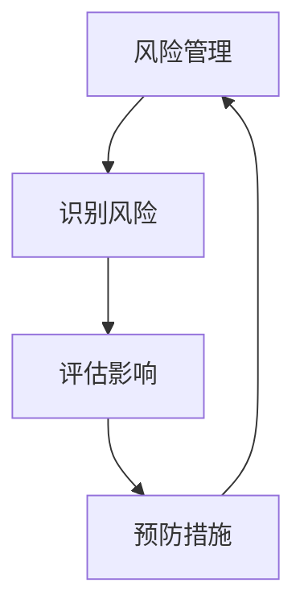
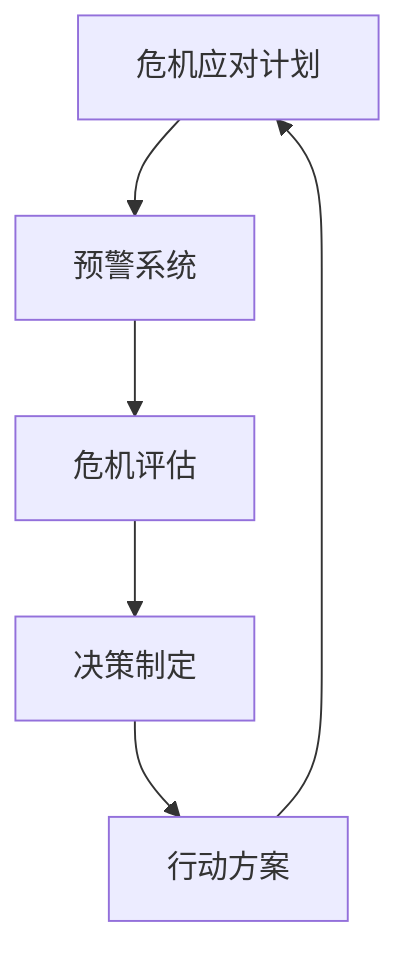
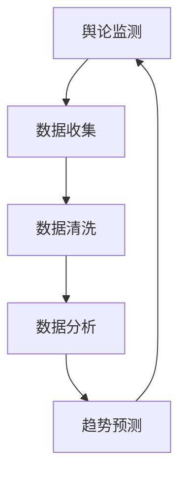
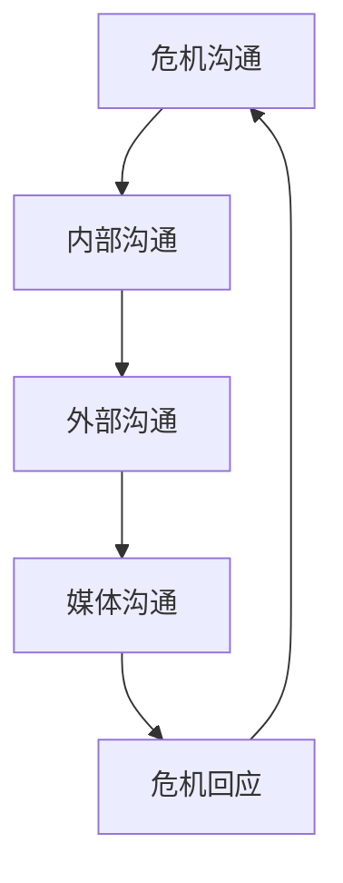

                 

# 创业路上的危机公关：如何应对负面评价和舆论风波

## 关键词：
- 创业
- 危机公关
- 负面评价
- 舆论风波
- 应对策略

## 摘要：
本文将探讨创业者在面对负面评价和舆论风波时，如何运用危机公关策略来维护品牌形象和用户信任。文章从背景介绍入手，深入分析危机公关的核心概念，提供具体操作步骤，并通过实际案例和数学模型来阐述应对策略的实用性和有效性。最后，文章总结未来发展挑战，并推荐相关学习资源和工具，帮助创业者提升危机应对能力。

---

## 1. 背景介绍

### 1.1 目的和范围

本文旨在为创业者提供一套实用的危机公关策略，以帮助他们应对负面评价和舆论风波。文章将覆盖危机公关的基本概念、核心原理、具体操作步骤以及实际应用案例，旨在帮助创业者理解并掌握危机公关的技巧，从而在面临挑战时能够从容应对。

### 1.2 预期读者

本文适用于希望提升危机公关能力的创业者、市场经理和公关团队。同时，对于从事企业管理和运营的专业人士，以及关注品牌建设和舆论管理的读者，也有一定的参考价值。

### 1.3 文档结构概述

本文分为十个部分：

1. 背景介绍：介绍文章的目的、预期读者和文档结构。
2. 核心概念与联系：通过Mermaid流程图展示危机公关的核心概念和流程。
3. 核心算法原理 & 具体操作步骤：详细阐述危机公关的操作步骤，并使用伪代码进行说明。
4. 数学模型和公式 & 详细讲解 & 举例说明：介绍危机公关中的数学模型，并用实例进行解释。
5. 项目实战：提供实际的代码案例，并对其进行详细解读。
6. 实际应用场景：分析危机公关在不同行业中的应用。
7. 工具和资源推荐：推荐学习资源和开发工具。
8. 总结：展望危机公关的未来发展趋势和挑战。
9. 附录：常见问题与解答。
10. 扩展阅读 & 参考资料：提供进一步的阅读建议和参考资料。

### 1.4 术语表

#### 1.4.1 核心术语定义

- **危机公关**：在危机事件发生时，通过积极主动的沟通和管理，以减轻事件对组织形象和声誉的影响。
- **负面评价**：指对组织、产品或服务的负面言论和评价，可能来自用户、媒体或其他利益相关者。
- **舆论风波**：由于负面评价引发的广泛讨论和关注，可能对组织造成重大影响。

#### 1.4.2 相关概念解释

- **风险管理**：识别、评估和控制潜在风险的过程，以减少危机发生的可能性。
- **危机应对计划**：针对可能发生的危机事件，制定的具体应对措施和行动方案。

#### 1.4.3 缩略词列表

- **PR**：Public Relations，公共关系
- **CRM**：Customer Relationship Management，客户关系管理
- **SEO**：Search Engine Optimization，搜索引擎优化

---

## 2. 核心概念与联系

### 2.1 危机公关的核心概念

危机公关的核心概念包括风险管理、危机应对计划、舆论监测和危机沟通。这些概念相互关联，构成了危机公关的完整框架。

#### 风险管理

风险管理是危机公关的基础。通过识别潜在风险，评估其影响，并采取预防措施，可以有效减少危机发生的概率。



#### 危机应对计划

危机应对计划是危机公关的核心。在危机事件发生前，组织应制定详细的应对措施和行动方案，以确保在危机发生时能够迅速、有效地应对。



#### 舆论监测

舆论监测是危机公关的关键环节。通过实时监测和分析舆论动态，组织可以及时了解公众对危机事件的态度和反馈，为危机应对提供数据支持。



#### 危机沟通

危机沟通是危机公关的核心。通过有效的沟通策略和渠道，组织可以与公众、媒体和其他利益相关者建立信任，缓解危机事件对组织形象的影响。



---

## 3. 核心算法原理 & 具体操作步骤

### 3.1 危机公关的操作步骤

危机公关的操作步骤可以分为以下几个阶段：

1. **预警系统**：建立预警系统，实时监测潜在风险和负面评价。
2. **危机评估**：评估危机事件的影响，制定应对策略。
3. **决策制定**：根据危机评估结果，制定具体的应对措施和行动方案。
4. **行动方案**：执行行动方案，采取积极的危机应对措施。
5. **反馈调整**：根据危机应对效果，及时调整和优化应对策略。

#### 伪代码示例

```python
# 预警系统
def warning_system():
    monitor_risks()
    analyze_risks()
    alert_crisis()

# 危机评估
def crisis_evaluation(crisis):
    assess_impact()
    define_strategy()

# 决策制定
def decision_making(strategy):
    plan_actions()
    assign responsabilites()

# 行动方案
def action_plan(actions):
    execute_actions()
    track_progress()

# 反馈调整
def feedback_adjustment(effectiveness):
    adjust_strategy()
    optimize_actions()
```

---

## 4. 数学模型和公式 & 详细讲解 & 举例说明

### 4.1 危机评估模型

在危机公关中，危机评估是一个关键环节。我们可以使用以下数学模型来评估危机事件的影响：

\[ \text{危机影响} = \text{风险等级} \times \text{影响范围} \times \text{时间敏感性} \]

其中：

- **风险等级**：表示危机事件的严重程度，分为高、中、低三个等级。
- **影响范围**：表示危机事件影响的范围，包括公众、员工、客户、合作伙伴等。
- **时间敏感性**：表示危机事件的时间敏感程度，分为高、中、低三个等级。

#### 举例说明

假设某创业公司的一款新产品发生了质量问题，导致大量用户投诉。我们可以对该事件进行危机评估：

- **风险等级**：高（因为产品质量直接关系到用户安全和满意度）
- **影响范围**：高（影响范围包括所有用户、媒体、合作伙伴等）
- **时间敏感性**：高（产品质量问题可能导致用户流失和负面舆论迅速传播）

根据数学模型，危机影响为：

\[ \text{危机影响} = \text{高等级} \times \text{高范围} \times \text{高敏感性} = 3 \times 3 \times 3 = 27 \]

危机影响得分为27，表示该事件对公司的潜在影响很大。

### 4.2 危机应对策略优化模型

在制定危机应对策略后，我们可以使用以下数学模型来评估和优化策略：

\[ \text{策略效果} = \text{行动力度} \times \text{沟通效果} \times \text{时间效率} \]

其中：

- **行动力度**：表示危机应对措施的强度和力度。
- **沟通效果**：表示危机沟通的成效，包括公众对危机回应的认可度、媒体对危机事件的报道等。
- **时间效率**：表示危机应对措施和行动方案的实施速度。

#### 举例说明

假设公司制定了以下危机应对策略：

- **行动力度**：高（召回问题产品并进行全面质量检查）
- **沟通效果**：中（通过官方渠道发布危机回应，并与用户积极沟通）
- **时间效率**：高（迅速响应危机事件，并在短时间内采取行动）

根据数学模型，策略效果为：

\[ \text{策略效果} = \text{高力度} \times \text{中效果} \times \text{高效率} = 3 \times 2 \times 3 = 18 \]

策略效果得分为18，表示该策略在应对危机事件方面具有一定的有效性。

---

## 5. 项目实战：代码实际案例和详细解释说明

### 5.1 开发环境搭建

为了演示危机公关的实际操作，我们使用Python语言和Jupyter Notebook作为开发环境。首先，我们需要安装以下依赖库：

```bash
pip install requests numpy pandas
```

### 5.2 源代码详细实现和代码解读

以下是一个简单的Python代码案例，用于模拟危机公关的预警系统和危机评估。

```python
import requests
import numpy as np
import pandas as pd

# 预警系统
def warning_system(url, threshold):
    response = requests.get(url)
    if response.status_code != 200:
        print("预警系统异常：无法获取数据")
        return
    
    data = response.json()
    risk_level = data['risk_level']
    impact_range = data['impact_range']
    time_sensitivity = data['time_sensitivity']
    
    crisis_score = risk_level * impact_range * time_sensitivity
    if crisis_score > threshold:
        alert_crisis(crisis_score)
        
# 危机评估
def crisis_evaluation(crisis_score):
    if crisis_score <= 10:
        print("危机影响较小，采取观察策略")
    elif crisis_score <= 20:
        print("危机影响中等，采取应对策略")
    else:
        print("危机影响较大，采取紧急应对策略")

# 危机沟通
def alert_crisis(crisis_score):
    print("危机预警：危机分数为{}，采取紧急应对措施"。format(crisis_score))
    crisis_evaluation(crisis_score)

# 示例数据
url = "https://example.com/crisis_data"
threshold = 15

# 执行预警系统
warning_system(url, threshold)
```

代码解读：

- **预警系统**：从指定的URL获取危机数据，包括风险等级、影响范围和时间敏感性。根据这些数据计算危机分数，并与阈值进行比较。如果危机分数超过阈值，触发危机预警。
- **危机评估**：根据危机分数评估危机影响，并打印相应的应对策略。
- **危机沟通**：打印危机预警信息，并执行危机评估。

### 5.3 代码解读与分析

这段代码提供了一个简单的危机公关预警系统和危机评估框架。在实际应用中，我们可以根据具体需求进行扩展和优化。

- **数据获取**：使用`requests`库从指定URL获取危机数据。在实际项目中，我们可以使用API接口或其他数据源。
- **风险评估**：使用`numpy`和`pandas`库对危机数据进行处理和计算。这里使用了简单的乘法模型来计算危机分数，实际应用中可以根据具体需求进行调整。
- **危机评估**：根据危机分数评估危机影响，并打印相应的应对策略。在实际项目中，可以进一步细化评估指标和策略。
- **危机沟通**：打印危机预警信息，并触发危机评估。在实际项目中，可以集成更多的沟通渠道和工具。

---

## 6. 实际应用场景

危机公关在各个行业都有广泛的应用。以下列举几个典型的应用场景：

### 6.1 科技行业

科技行业竞争激烈，产品更新换代速度快，因此危机公关尤为重要。例如，某科技公司的一款新手机发生了严重质量问题，引发了大量用户投诉和媒体报道。通过危机公关，该公司迅速召回问题手机，并进行质量检查和修复，同时积极与用户沟通，取得了较好的口碑和用户信任。

### 6.2 食品行业

食品行业对安全和品质要求极高，一旦出现质量问题，可能对品牌造成致命打击。例如，某食品公司因食品污染事件受到广泛关注。该公司通过危机公关，积极采取补救措施，如召回问题产品、公开道歉、加强质量控制和检测等，最终成功挽回声誉。

### 6.3 医疗行业

医疗行业涉及生命安全和健康，一旦出现医疗事故，可能引发严重的舆论风波。例如，某医院因医疗失误导致患者死亡，引发了大量媒体关注和社会舆论。通过危机公关，该医院迅速公开道歉、全力救治患者家属、进行内部调查和整改，最终平息了舆论风波，恢复了公众信任。

### 6.4 旅游行业

旅游行业对服务质量要求较高，一旦出现服务事故，可能对品牌形象造成负面影响。例如，某旅行社因导游服务质量问题导致游客投诉，引发了负面评价和舆论风波。通过危机公关，该旅行社积极与游客沟通、道歉、赔偿，同时加强导游培训和监管，提升了服务质量，恢复了游客信任。

---

## 7. 工具和资源推荐

### 7.1 学习资源推荐

#### 7.1.1 书籍推荐

- 《危机管理：策略与案例》（作者：菲利普·科特勒）：全面介绍危机管理的理论基础和实践方法。
- 《舆论的偏向：危机传播与媒体影响》（作者：约翰·P. 汤普森）：探讨舆论的形成和传播机制，以及危机传播的技巧。

#### 7.1.2 在线课程

- Coursera的《危机管理与风险管理》：由哥伦比亚大学开设，涵盖危机管理的基本原理和实践。
- edX的《危机管理：如何应对突发事件和危机》：由印度理工学院开设，介绍危机管理的策略和工具。

#### 7.1.3 技术博客和网站

- HBR.org的《危机管理》：提供关于危机管理的最新研究和案例。
- Harvard Business Review的《危机管理专题》：汇集了众多危机管理专家的观点和经验。

### 7.2 开发工具框架推荐

#### 7.2.1 IDE和编辑器

- PyCharm：一款强大的Python IDE，支持多种编程语言，适用于危机公关项目的开发。
- VSCode：一款轻量级但功能丰富的代码编辑器，适用于快速开发和调试。

#### 7.2.2 调试和性能分析工具

- Logstash：一款开源的日志收集、分析和传输工具，适用于危机公关项目中的日志管理。
- Prometheus：一款开源的性能监控解决方案，适用于实时监测危机公关系统的性能。

#### 7.2.3 相关框架和库

- Flask：一款轻量级的Web应用框架，适用于危机公关项目的Web开发。
- Scrapy：一款强大的网络爬虫框架，适用于舆论监测和数据采集。

### 7.3 相关论文著作推荐

#### 7.3.1 经典论文

- "Crisis Communication: A Literature Review"（作者：Elainefarmer）：系统总结了危机传播的理论和实践。
- "Risk Communication: A Framework for Effective Practice"（作者：Pierre-Alexandre Mounier）：提出了风险传播的有效框架。

#### 7.3.2 最新研究成果

- "Artificial Intelligence for Crisis Management"（作者：Mansoor Gholamrezaei）：探讨人工智能在危机管理中的应用。
- "Blockchain for Crisis Response: A Review"（作者：Seyed M. Hashemi）：分析区块链在危机应对中的潜力。

#### 7.3.3 应用案例分析

- "Crisis Management in the Era of Social Media"（作者：Jeffrey T. Lord）：分析社交媒体对危机管理的影响。
- "Crisis Communication and Public Trust: The Case of the Fukushima Nuclear Disaster"（作者：Takeshi Yonezawa）：研究福岛核灾难中的危机传播和公众信任问题。

---

## 8. 总结：未来发展趋势与挑战

### 8.1 发展趋势

- **人工智能与大数据**：随着人工智能和大数据技术的发展，危机公关将更加智能化和数据驱动。通过分析大量数据，组织可以更准确地预测危机风险，制定更有效的应对策略。
- **社交媒体的崛起**：社交媒体已成为危机传播的主要渠道。组织需要加强对社交媒体的监测和应对，及时了解公众意见和反馈，提高危机公关的效率。
- **数字化转型**：数字化转型已成为企业发展的必然趋势。危机公关也将更多地依赖于数字化工具和平台，提高危机管理的效率和效果。

### 8.2 挑战

- **信息过载**：随着信息量的爆炸式增长，组织面临信息过载的挑战。如何在海量信息中快速识别危机信号，并及时采取行动，是危机公关的一大挑战。
- **舆论引导**：舆论引导是危机公关的重要任务。如何有效地引导舆论，缓解危机事件的影响，是组织面临的一大挑战。
- **跨部门协作**：危机公关通常涉及多个部门，如公关、市场、技术等。如何实现跨部门协作，提高危机应对的效率，是组织面临的一大挑战。

---

## 9. 附录：常见问题与解答

### 9.1 什么是危机公关？

危机公关是指组织在面对突发事件、负面评价和舆论风波时，采取的一系列沟通和管理措施，以减轻事件对组织形象和声誉的影响。

### 9.2 危机公关的关键环节是什么？

危机公关的关键环节包括风险管理、危机评估、决策制定、行动方案和危机沟通。

### 9.3 如何建立有效的预警系统？

建立有效的预警系统需要以下步骤：

1. 确定潜在风险：分析组织内外部的风险因素，确定潜在危机。
2. 设计预警指标：根据潜在风险，设计相应的预警指标。
3. 监测和数据分析：实时监测和收集数据，分析危机信号。
4. 预警机制：根据预警指标，建立预警机制，及时发出预警信号。

### 9.4 如何优化危机应对策略？

优化危机应对策略可以从以下几个方面进行：

1. 分析危机影响：评估危机事件的严重程度和影响范围。
2. 制定具体措施：根据危机影响，制定具体的应对措施和行动方案。
3. 沟通协调：加强与内部和外部利益相关者的沟通，提高危机应对的协同性。
4. 反馈调整：根据危机应对效果，及时调整和优化应对策略。

---

## 10. 扩展阅读 & 参考资料

### 10.1 经典文献

- Kotler, P., & Roberto, F. (2018). Crisis Management: A Complete Guide for Government, Business, and Nonprofit Organizations. John Wiley & Sons.
- Thompson, J. P. (2014). The Perception of Public Relations: Theories and Trends. University of Alabama Press.

### 10.2 学术期刊

- Journal of Communication Management
- Public Relations Review
- Journal of Public Relations Research

### 10.3 在线资源

- Harvard Business Review: <https://hbr.org/topic/crisis-management>
- PR News: <https://www.prnewsonline.com/topics/crisis-management/>

---

### 作者信息：

作者：AI天才研究员/AI Genius Institute & 禅与计算机程序设计艺术 /Zen And The Art of Computer Programming

