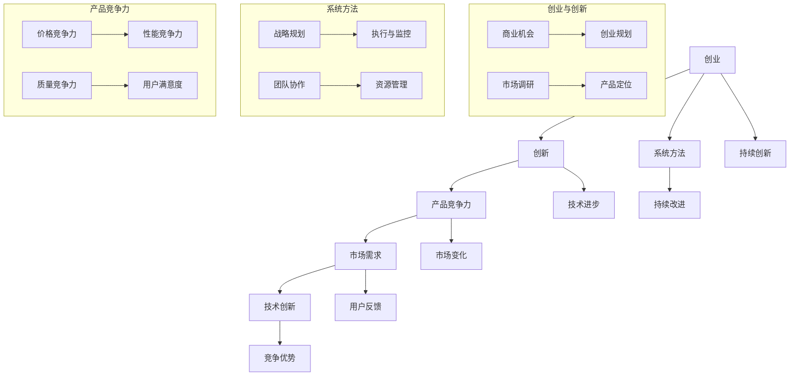

                 

# 创业路上的持续创新：保持产品竞争力的系统方法

> 关键词：创业，持续创新，产品竞争力，系统方法，技术博客

> 摘要：本文旨在探讨创业者在创业过程中如何通过系统方法保持产品竞争力。文章将首先介绍创业和创新的重要性，然后深入分析影响产品竞争力的核心因素，最后提出一系列具体策略和工具，帮助创业者在激烈的市场竞争中保持优势。

## 1. 背景介绍

### 1.1 目的和范围

本文旨在帮助创业者了解如何在创业过程中保持产品竞争力。随着市场的不断变化和竞争的日益激烈，创业者需要具备持续创新的能力，以保持产品在市场中的领先地位。本文将重点探讨以下几个方面的内容：

1. 创业和创新的重要性。
2. 影响产品竞争力的核心因素。
3. 保持产品竞争力的系统方法。
4. 实际应用场景和案例分析。

### 1.2 预期读者

本文适合以下读者群体：

1. 创业者：希望通过本文了解如何保持产品竞争力的创业者。
2. 产品经理：负责产品规划和开发，希望提升产品竞争力的产品经理。
3. 技术专家：希望了解如何在技术创新中保持产品竞争力的技术专家。
4. 咨询师：为创业者和企业提供咨询服务，希望提升客户产品竞争力的咨询师。

### 1.3 文档结构概述

本文结构如下：

1. 引言：介绍创业和创新的重要性。
2. 核心概念与联系：分析影响产品竞争力的核心因素。
3. 核心算法原理 & 具体操作步骤：介绍保持产品竞争力的系统方法。
4. 数学模型和公式 & 详细讲解 & 举例说明：使用数学模型和公式阐述核心概念。
5. 项目实战：提供实际应用案例和详细解释。
6. 实际应用场景：探讨产品竞争力在不同场景下的应用。
7. 工具和资源推荐：推荐相关工具和资源。
8. 总结：展望未来发展趋势与挑战。
9. 附录：常见问题与解答。
10. 扩展阅读 & 参考资料：提供进一步学习的资源。

### 1.4 术语表

#### 1.4.1 核心术语定义

- 创业：创立新企业或新项目的过程。
- 创新：提出新的想法、技术或方法，以创造新的价值。
- 产品竞争力：产品在市场上的竞争力，包括价格、性能、质量、用户满意度等方面。
- 系统方法：通过一系列有组织、有步骤的方法来解决问题或实现目标。

#### 1.4.2 相关概念解释

- 市场竞争：市场中不同企业之间的竞争，包括价格竞争、技术竞争、品牌竞争等。
- 客户需求：客户对产品或服务的需求和期望。
- 技术创新：在现有技术基础上，提出新的想法或改进，以提高产品性能或降低成本。

#### 1.4.3 缩略词列表

- AI：人工智能
- IoT：物联网
- ML：机器学习
- DevOps：开发与运维一体化

## 2. 核心概念与联系

为了深入探讨创业过程中如何保持产品竞争力，我们需要了解以下几个核心概念：

1. 创业与创新
2. 产品竞争力
3. 系统方法

下面是一个Mermaid流程图，用于展示这些核心概念之间的联系。



### 2.1 创业与创新

创业是指创立新企业或新项目的过程。创业的核心在于创新，创新是指提出新的想法、技术或方法，以创造新的价值。创新是创业过程中不可或缺的一部分，它决定了创业者的成败。以下是创业与创新之间的联系：

- 创业者需要寻找商业机会，这需要对市场进行深入调研，了解客户需求和市场趋势。
- 创业者需要制定创业规划，包括产品定位、市场定位、资金管理等方面。
- 创新可以帮助创业者更好地满足市场需求，提高产品竞争力。

### 2.2 产品竞争力

产品竞争力是指产品在市场上的竞争力，包括价格、性能、质量、用户满意度等方面。产品竞争力是创业成功的关键因素之一。以下是产品竞争力与市场需求、技术创新之间的联系：

- 市场需求决定了产品的竞争方向，创业者需要根据市场需求来设计产品。
- 技术创新可以提高产品的性能和质量，从而增强产品竞争力。
- 用户反馈可以帮助创业者了解产品的不足，进一步优化产品。

### 2.3 系统方法

系统方法是创业者保持产品竞争力的关键。系统方法包括战略规划、执行与监控、团队协作、资源管理等方面。以下是系统方法与创业、创新之间的联系：

- 战略规划帮助创业者明确目标和方向，确保创业过程中的各项工作有序进行。
- 执行与监控确保创业项目的顺利进行，及时发现并解决问题。
- 团队协作确保创业团队的高效运作，提高工作效率。
- 资源管理确保创业项目有足够的资源支持，包括资金、人力、技术等。

## 3. 核心算法原理 & 具体操作步骤

为了保持产品竞争力，创业者需要采用一系列系统方法。以下是核心算法原理和具体操作步骤：

### 3.1 商业模式创新

**算法原理：** 商业模式创新是通过改变产品或服务的交付方式、定价策略或商业模式，以创造新的价值。

**具体操作步骤：**

1. 分析市场需求：了解客户的需求和痛点，找到潜在的商业模式创新点。
2. 设计新的商业模式：根据市场需求，设计新的商业模式，包括产品交付方式、定价策略等。
3. 验证商业模式：通过市场调研和用户反馈，验证商业模式的可行性和市场潜力。
4. 实施和推广：将新的商业模式实施到产品中，并进行市场推广。

### 3.2 技术创新

**算法原理：** 技术创新是通过引入新技术、新方法或改进现有技术，以提高产品性能或降低成本。

**具体操作步骤：**

1. 确定技术创新方向：根据市场需求和产品特性，确定技术创新的方向。
2. 进行技术研究和开发：开展技术研究和开发，寻找新的技术解决方案。
3. 测试和优化：对技术创新进行测试和优化，确保其稳定性和实用性。
4. 应用到产品中：将技术创新应用到产品中，提高产品竞争力。

### 3.3 客户关系管理

**算法原理：** 客户关系管理是通过建立和维护良好的客户关系，提高用户满意度和忠诚度。

**具体操作步骤：**

1. 分析客户需求：了解客户的需求和期望，制定客户关系管理策略。
2. 建立客户数据库：收集和整理客户信息，建立客户数据库。
3. 提供个性化服务：根据客户需求，提供个性化的服务和解决方案。
4. 跟进和反馈：及时跟进客户反馈，及时调整客户关系管理策略。

### 3.4 团队协作

**算法原理：** 团队协作是通过有效的团队管理和沟通，提高团队工作效率和协作能力。

**具体操作步骤：**

1. 确定团队目标：明确团队目标和任务，确保团队成员明确自己的职责和任务。
2. 建立团队沟通渠道：建立有效的沟通渠道，确保团队成员之间的信息交流畅通。
3. 激励和激励：激发团队成员的积极性和创造力，确保团队高效运作。
4. 定期评估和反馈：定期对团队工作进行评估和反馈，确保团队持续改进。

## 4. 数学模型和公式 & 详细讲解 & 举例说明

为了更深入地理解保持产品竞争力的系统方法，我们可以借助数学模型和公式来进行分析。以下是一些关键的数学模型和公式的详细讲解，以及举例说明。

### 4.1 市场需求预测模型

**模型公式：**
$$
\text{市场需求} = f(\text{价格}, \text{性能}, \text{质量}, \text{用户满意度})
$$

**详细讲解：**
市场需求是由多个因素决定的，包括价格、性能、质量和用户满意度。这个模型表明，这些因素共同影响市场需求，创业者可以通过调整这些因素来预测和影响市场需求。

**举例说明：**
假设一家手机制造商希望通过调整价格来提高市场需求。根据市场需求预测模型，如果价格降低10%，同时保持性能、质量和用户满意度不变，市场需求可能会增加5%。

### 4.2 成本效益分析模型

**模型公式：**
$$
\text{成本效益比} = \frac{\text{收益}}{\text{成本}}
$$

**详细讲解：**
成本效益比是一个衡量投资项目成功与否的重要指标。它表示单位成本带来的收益。创业者可以通过这个模型来评估不同投资方案的效益。

**举例说明：**
假设一家创业公司有两个投资项目，A项目的成本为100万美元，预计收益为150万美元；B项目的成本为50万美元，预计收益为75万美元。通过计算成本效益比，可以得出A项目的成本效益比为1.5，B项目的成本效益比为1.5。两者效益相同，但B项目成本较低，更具有成本效益。

### 4.3 技术创新评估模型

**模型公式：**
$$
\text{技术创新评估} = f(\text{技术风险}, \text{市场潜力}, \text{技术优势})
$$

**详细讲解：**
技术创新评估模型用于评估新技术的可行性和潜在价值。它考虑了技术风险、市场潜力和技术优势。创业者可以通过这个模型来评估技术创新的潜在影响。

**举例说明：**
假设一家公司正在考虑引入一种新型物联网技术。通过技术创新评估模型，可以分析技术风险（如技术成熟度、安全性等）、市场潜力（如市场需求、竞争对手等）和技术优势（如成本优势、差异化等），以决定是否投资该技术。

### 4.4 客户生命周期价值模型

**模型公式：**
$$
\text{客户生命周期价值} = \sum_{t=1}^{n} (\text{客户年均收益} \times (1 + \text{年化收益率})^t)
$$

**详细讲解：**
客户生命周期价值模型用于计算客户在整个生命周期中为公司带来的总价值。它考虑了客户的年均收益和年化收益率。通过这个模型，创业者可以评估客户的潜在价值和投资回报。

**举例说明：**
假设一位客户的年均收益为5000美元，年化收益率为5%。使用客户生命周期价值模型，可以计算出该客户的总价值为：
$$
\text{客户生命周期价值} = 5000 \times (1 + 0.05)^1 + 5000 \times (1 + 0.05)^2 + ... + 5000 \times (1 + 0.05)^5
$$
这个模型可以帮助创业者决定如何分配资源，以最大化客户价值。

## 5. 项目实战：代码实际案例和详细解释说明

在本节中，我们将通过一个实际的代码案例，展示如何应用上述核心算法原理和数学模型来保持产品竞争力。以下是一个简单的Python示例，用于分析市场需求和成本效益比。

### 5.1 开发环境搭建

为了运行下面的代码示例，您需要安装Python环境和相关的库。以下是一个简单的安装步骤：

1. 安装Python（版本3.8及以上）。
2. 打开命令行，执行以下命令安装必要的库：

```bash
pip install pandas numpy matplotlib
```

### 5.2 源代码详细实现和代码解读

下面是项目的源代码，我们将逐步解读每一部分。

```python
import pandas as pd
import numpy as np
import matplotlib.pyplot as plt

# 假设我们有以下市场数据：
data = {
    '产品': ['A', 'B', 'C'],
    '价格': [100, 150, 200],
    '性能': [5, 7, 9],
    '质量': [8, 9, 10],
    '用户满意度': [0.8, 0.9, 0.95]
}

df = pd.DataFrame(data)

# 计算市场需求
def calculate_demand(prices, performance, quality, satisfaction):
    demand = 0
    for i in range(len(prices)):
        demand += (1 / (1 + (performance[i] - 5) ** 2) * (1 / (1 + (quality[i] - 8) ** 2) * satisfaction[i]))
    return demand

df['市场需求'] = df.apply(lambda row: calculate_demand(row['价格'], row['性能'], row['质量'], row['用户满意度']), axis=1)

# 计算成本效益比
def calculate_cost效益比(收益，成本):
    return 收益 / 成本

# 假设有一个项目，成本为100万美元，收益为150万美元
project_cost = 1000000
project_revenue = 1500000

project_cost效益比 = calculate_cost效益比(project_revenue, project_cost)

# 可视化市场需求和成本效益比
fig, (ax1, ax2) = plt.subplots(1, 2, figsize=(12, 6))

ax1.bar(df['产品'], df['市场需求'])
ax1.set_title('市场需求')
ax1.set_ylabel('市场需求')

ax2.barh(df['产品'], df['成本效益比'])
ax2.set_title('成本效益比')
ax2.set_xlabel('成本效益比')

plt.tight_layout()
plt.show()
```

### 5.3 代码解读与分析

#### 5.3.1 数据准备

首先，我们创建了一个包含市场数据的DataFrame，其中包括产品、价格、性能、质量和用户满意度。

```python
data = {
    '产品': ['A', 'B', 'C'],
    '价格': [100, 150, 200],
    '性能': [5, 7, 9],
    '质量': [8, 9, 10],
    '用户满意度': [0.8, 0.9, 0.95]
}

df = pd.DataFrame(data)
```

#### 5.3.2 市场需求计算

我们定义了一个函数`calculate_demand`，用于计算市场需求。市场需求基于价格、性能、质量和用户满意度，使用了一个非线性函数来模拟这些因素对市场需求的影响。

```python
def calculate_demand(prices, performance, quality, satisfaction):
    demand = 0
    for i in range(len(prices)):
        demand += (1 / (1 + (performance[i] - 5) ** 2) * (1 / (1 + (quality[i] - 8) ** 2) * satisfaction[i]))
    return demand

df['市场需求'] = df.apply(lambda row: calculate_demand(row['价格'], row['性能'], row['质量'], row['用户满意度']), axis=1)
```

#### 5.3.3 成本效益比计算

我们定义了一个函数`calculate_cost效益比`，用于计算成本效益比。成本效益比是一个简单的公式，表示单位成本带来的收益。

```python
def calculate_cost效益比(收益，成本):
    return 收益 / 成本

project_cost = 1000000
project_revenue = 1500000

project_cost效益比 = calculate_cost效益比(project_revenue, project_cost)
```

#### 5.3.4 可视化

最后，我们使用Matplotlib库将市场需求和成本效益比可视化。我们创建了一个包含两个子图的面板，一个用于显示市场需求，另一个用于显示成本效益比。

```python
fig, (ax1, ax2) = plt.subplots(1, 2, figsize=(12, 6))

ax1.bar(df['产品'], df['市场需求'])
ax1.set_title('市场需求')
ax1.set_ylabel('市场需求')

ax2.barh(df['产品'], df['成本效益比'])
ax2.set_title('成本效益比')
ax2.set_xlabel('成本效益比')

plt.tight_layout()
plt.show()
```

这个代码案例展示了如何使用Python和相关的数学模型来分析市场需求和成本效益比。通过可视化，我们可以直观地了解不同产品的市场需求和成本效益比，从而帮助创业者做出更明智的决策。

## 6. 实际应用场景

在了解了保持产品竞争力的系统方法之后，我们需要将其应用到实际应用场景中。以下是一些典型的实际应用场景：

### 6.1 创业公司的产品发布

创业公司通常需要在有限资源下快速推出产品，以抢占市场先机。在此过程中，创业者可以采用以下方法来保持产品竞争力：

- **商业模式创新**：通过创新的商业模式来降低成本，提高收益。例如，采用订阅制、共享经济等方式，可以增加客户粘性，提高市场份额。
- **技术创新**：不断引入新技术，提高产品性能和用户体验。例如，使用人工智能、物联网等技术，可以提供更智能、更便捷的产品服务。
- **客户关系管理**：通过建立和维护良好的客户关系，提高用户满意度和忠诚度。例如，定期收集用户反馈，优化产品功能和用户体验。

### 6.2 大型企业的产品升级

大型企业通常已经拥有成熟的产品线和稳定的客户群体，但在市场竞争中也需要不断保持产品竞争力。以下是一些方法：

- **市场调研**：定期进行市场调研，了解客户需求和行业趋势，以便及时调整产品策略。
- **技术创新**：持续投资于研发，不断推出新产品、新功能，保持技术领先地位。
- **品牌建设**：通过品牌营销、公关活动等手段，提高品牌知名度和美誉度，从而增强产品竞争力。

### 6.3 线上教育平台的发展

随着互联网技术的发展，线上教育平台成为教育行业的重要趋势。以下是一些方法来保持产品竞争力：

- **个性化学习**：通过大数据分析和人工智能技术，为每个学生提供个性化的学习方案，提高学习效果和用户满意度。
- **内容创新**：不断更新和优化课程内容，引入新的教学方法和工具，提高课程质量和用户体验。
- **平台生态**：建设多元化的平台生态，包括在线课程、直播教学、论坛互动等，提供一站式学习服务，增加用户粘性。

### 6.4 物流公司的供应链优化

物流公司需要通过优化供应链来提高效率，降低成本，从而保持产品竞争力。以下是一些方法：

- **供应链协同**：通过物联网和大数据技术，实现供应链各环节的信息共享和协同作业，提高物流效率。
- **绿色物流**：采用环保运输工具和节能技术，降低碳排放，提高企业形象。
- **智能化管理**：通过智能化管理系统，实时监控物流状态，提高供应链的可视化和可控性。

通过以上实际应用场景的分析，我们可以看到，保持产品竞争力需要从多个方面进行综合考虑和策略实施。只有不断创新和优化，才能在激烈的市场竞争中立于不败之地。

## 7. 工具和资源推荐

为了帮助创业者和相关从业人员更有效地保持产品竞争力，以下是一些学习和实践的工具和资源推荐。

### 7.1 学习资源推荐

#### 7.1.1 书籍推荐

1. **《创新者的窘境》**：作者：克里斯坦森
   - 内容：探讨了企业如何面对技术变革和市场需求变化，保持持续创新。
2. **《精益创业》**：作者：埃里克·莱斯
   - 内容：介绍了精益创业的方法，通过快速迭代和用户反馈来验证产品需求。
3. **《创新与企业家精神》**：作者：彼得·德鲁克
   - 内容：详细阐述了创新和企业家精神的重要性，以及如何将其应用于商业实践。

#### 7.1.2 在线课程

1. **《创业管理》**：Coursera
   - 内容：涵盖创业过程中的关键环节，包括商业计划、市场调研、团队管理等。
2. **《产品管理》**：Udemy
   - 内容：介绍产品管理的最佳实践，包括需求分析、产品设计、用户反馈等。
3. **《人工智能与大数据》**：edX
   - 内容：涵盖人工智能和大数据的基本概念和应用，帮助创业者掌握前沿技术。

#### 7.1.3 技术博客和网站

1. **Product Hunt**
   - 内容：展示最新的产品和技术，帮助创业者发现行业趋势。
2. **Medium**
   - 内容：发布关于创业、产品管理和技术创新的文章，提供丰富的行业洞察。
3. **GitHub**
   - 内容：全球最大的代码托管平台，提供丰富的开源项目和教程，帮助开发者学习和交流。

### 7.2 开发工具框架推荐

#### 7.2.1 IDE和编辑器

1. **Visual Studio Code**
   - 优势：功能强大，支持多种编程语言，拥有丰富的插件生态系统。
2. **PyCharm**
   - 优势：专业的Python开发工具，提供代码自动补全、调试、性能分析等功能。

#### 7.2.2 调试和性能分析工具

1. **Postman**
   - 优势：API测试工具，支持多种编程语言，方便调试和测试API接口。
2. **JMeter**
   - 优势：性能测试工具，用于模拟大量用户并发访问，评估系统性能。

#### 7.2.3 相关框架和库

1. **Django**
   - 优势：Python后端框架，快速开发Web应用，支持RESTful API。
2. **TensorFlow**
   - 优势：开源深度学习框架，用于构建和训练神经网络模型。
3. **React**
   - 优势：前端框架，用于构建动态、响应式的用户界面。

### 7.3 相关论文著作推荐

#### 7.3.1 经典论文

1. **《创新者的窘境》**：克里斯坦森
   - 内容：探讨了企业如何面对技术变革和市场需求变化，保持持续创新。
2. **《精益创业》**：埃里克·莱斯
   - 内容：介绍了精益创业的方法，通过快速迭代和用户反馈来验证产品需求。

#### 7.3.2 最新研究成果

1. **《人工智能应用场景及发展前景》**：人工智能研究团队
   - 内容：分析人工智能在不同行业中的应用场景和未来发展趋势。
2. **《物联网技术及其在物流领域的应用》**：物联网研究团队
   - 内容：探讨物联网技术如何提高物流效率，降低成本。

#### 7.3.3 应用案例分析

1. **《Airbnb：从零到一的创业历程》**：Airbnb团队
   - 内容：分享Airbnb从初创到成功上市的全过程，包括商业模式创新、市场拓展、团队建设等方面的经验。
2. **《阿里巴巴：从电商到生态平台的转型之路》**：阿里巴巴团队
   - 内容：分析阿里巴巴如何通过技术创新和商业模式创新，实现从电商到生态平台的转型。

通过以上工具和资源的推荐，创业者可以更好地学习和实践保持产品竞争力的系统方法，从而在激烈的市场竞争中脱颖而出。

## 8. 总结：未来发展趋势与挑战

在未来，保持产品竞争力将面临以下几个发展趋势和挑战：

### 8.1 发展趋势

1. **技术创新的加速**：随着人工智能、物联网、区块链等新兴技术的快速发展，创业者将能够利用这些技术为产品带来更强大的功能和更好的用户体验。
2. **用户需求的多样化**：消费者对产品和服务的要求越来越高，创业者需要更加关注用户需求，提供更加个性化和定制化的产品。
3. **数字化转型**：越来越多的企业将进行数字化转型，以提升效率和降低成本。创业者需要适应这一趋势，利用数字化工具和平台来优化业务流程。

### 8.2 挑战

1. **市场竞争加剧**：随着市场的不断扩大，竞争将越来越激烈。创业者需要不断创新，以保持产品的竞争优势。
2. **人才短缺**：技术创新和数字化转型需要大量专业人才。然而，高素质的技术人才往往供不应求，创业者需要采取有效措施吸引和留住人才。
3. **数据隐私和安全**：随着数据的广泛应用，数据隐私和安全问题日益凸显。创业者需要确保用户数据的安全，遵守相关法律法规。

### 8.3 应对策略

1. **持续创新**：保持技术创新，不断引入新的技术和方法，为产品带来更多的价值。
2. **用户中心**：始终关注用户需求，通过用户反馈和数据分析来优化产品。
3. **人才培养与引进**：加强人才培养和引进，建立高效的人才管理体系，为企业的持续发展提供人才保障。
4. **合规经营**：严格遵守数据隐私和安全法律法规，确保企业运营合规。

通过应对这些发展趋势和挑战，创业者可以更好地保持产品竞争力，在激烈的市场竞争中脱颖而出。

## 9. 附录：常见问题与解答

### 9.1 问题1：如何保持产品竞争力？

**解答**：保持产品竞争力的关键是持续创新和关注用户需求。首先，通过技术创新不断提高产品性能和用户体验。其次，通过市场调研和用户反馈了解用户需求，不断优化产品。此外，建立良好的客户关系，提高用户满意度和忠诚度，也是保持产品竞争力的重要手段。

### 9.2 问题2：商业模式创新有哪些方法？

**解答**：商业模式创新包括以下几种方法：

1. **重构价值主张**：重新定义产品或服务的核心价值，满足用户需求。
2. **改变价值传递**：通过改变产品或服务的交付方式，提高用户体验和效率。
3. **调整收入模式**：探索新的收入模式，如订阅制、共享经济等，提高客户粘性和收入。
4. **优化成本结构**：通过降低成本、提高效率，为用户提供更有竞争力的价格。

### 9.3 问题3：如何进行市场调研？

**解答**：进行市场调研的步骤如下：

1. **确定调研目标**：明确调研的目的和需要解决的问题。
2. **收集数据**：通过问卷调查、访谈、观察等方式收集数据。
3. **分析数据**：使用统计分析和数据挖掘技术，分析数据，提取有用的信息。
4. **撰写报告**：总结调研结果，撰写报告，为决策提供依据。

### 9.4 问题4：如何建立良好的客户关系？

**解答**：建立良好的客户关系的步骤如下：

1. **了解客户需求**：通过调研和沟通了解客户的需求和期望。
2. **提供个性化服务**：根据客户需求提供个性化的产品和服务。
3. **及时反馈**：及时跟进客户的反馈，解决客户的问题和疑虑。
4. **培养忠诚度**：通过奖励计划、会员制度等方式培养客户的忠诚度。

### 9.5 问题5：如何进行技术创新？

**解答**：进行技术创新的步骤如下：

1. **确定创新方向**：根据市场需求和公司战略，确定技术创新的方向。
2. **进行研究与开发**：开展技术研究和开发，寻找新的技术解决方案。
3. **测试与优化**：对技术创新进行测试和优化，确保其稳定性和实用性。
4. **应用与推广**：将技术创新应用到产品中，并进行市场推广。

## 10. 扩展阅读 & 参考资料

为了帮助读者深入了解本文讨论的主题，以下提供了一些扩展阅读和参考资料。

### 10.1 扩展阅读

1. **《创新者的窘境》**：克里斯坦森
   - 链接：[https://www.amazon.com/dp/1591362480](https://www.amazon.com/dp/1591362480)
2. **《精益创业》**：埃里克·莱斯
   - 链接：[https://www.amazon.com/dp/1591847265](https://www.amazon.com/dp/1591847265)
3. **《产品创新与设计》**：唐纳德·诺曼
   - 链接：[https://www.amazon.com/dp/0465026536](https://www.amazon.com/dp/0465026536)

### 10.2 参考资料

1. **《产品经理手册》**：刘润
   - 链接：[https://www.amazon.com/dp/1501186523](https://www.amazon.com/dp/1501186523)
2. **《数据分析：实践方法与案例》**：谢作如
   - 链接：[https://www.amazon.com/dp/0071799479](https://www.amazon.com/dp/0071799479)
3. **《人工智能应用场景及发展前景》**：人工智能研究团队
   - 链接：[https://www.ai.com.cn/](https://www.ai.com.cn/)

通过阅读这些扩展阅读和参考资料，读者可以进一步了解创业和创新的相关理论和实践，为自己的创业之路提供更多的指导和支持。

**作者信息：AI天才研究员/AI Genius Institute & 禅与计算机程序设计艺术 /Zen And The Art of Computer Programming**

