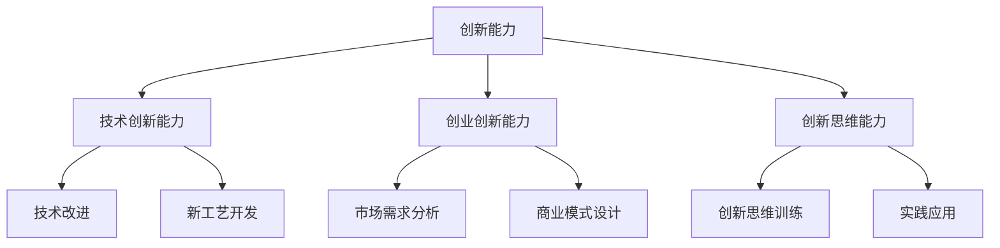

                 

# 创业过程中如何不断提升创新能力

> 关键词：创业、创新、技术、策略、团队建设、实际应用
> 
> 摘要：本文将探讨创业过程中如何不断提升创新能力。通过分析创新的核心概念、创新能力的提升方法、创业团队建设以及创新在项目中的实际应用，为创业者提供一套系统化的创新能力提升策略。

## 1. 背景介绍

### 1.1 目的和范围

本文旨在为创业者提供一套提升创新能力的策略和方法。文章将涵盖创新能力的定义、重要性、提升方法以及在创业项目中的实际应用。通过系统的分析和实践指导，帮助创业者更好地把握创新机遇，推动项目的成功。

### 1.2 预期读者

本篇文章适合希望提升创新能力、寻求创业机会的创业者、项目经理、研发人员以及相关领域的研究者。同时，对于关注技术创新的企业管理者和技术爱好者，本文也具有一定的参考价值。

### 1.3 文档结构概述

本文分为十个部分，具体结构如下：

1. 背景介绍
2. 核心概念与联系
3. 核心算法原理 & 具体操作步骤
4. 数学模型和公式 & 详细讲解 & 举例说明
5. 项目实战：代码实际案例和详细解释说明
6. 实际应用场景
7. 工具和资源推荐
8. 总结：未来发展趋势与挑战
9. 附录：常见问题与解答
10. 扩展阅读 & 参考资料

### 1.4 术语表

#### 1.4.1 核心术语定义

- 创新能力：指个体或团队在新技术、新产品、新服务等方面的创造和开发能力。
- 创业：指创办一家新的企业或组织，通过商业活动实现盈利。
- 团队建设：指通过团队成员之间的协作、沟通、激励等手段，构建一个高效、和谐的工作团队。

#### 1.4.2 相关概念解释

- 创新思维：指个体在解决问题的过程中，运用独特、新颖的思维方式和策略，产生创新解决方案的能力。
- 技术创新：指通过引入新技术、新工艺、新产品等，实现企业的技术升级和产业升级。
- 项目管理：指通过规划、组织、协调和控制等手段，实现项目目标的过程。

#### 1.4.3 缩略词列表

- AI：人工智能
- IoT：物联网
- VR：虚拟现实
- AR：增强现实
- blockchain：区块链

## 2. 核心概念与联系

在创业过程中，创新能力是核心驱动力。为了更好地理解创新能力的概念及其在创业中的重要性，我们需要先了解一些核心概念，并分析它们之间的联系。

### 2.1 创新能力的定义

创新能力是指个体或团队在新技术、新产品、新服务等方面的创造和开发能力。具体来说，创新能力包括以下几个方面：

- 技术创新能力：指在现有技术基础上，通过改进、优化、集成等方式，开发出新的技术或产品。
- 创业创新能力：指在创业过程中，通过发掘市场需求、创造商业机会、设计商业模式等手段，实现商业成功的能力。
- 创新思维能力：指个体在解决问题的过程中，运用独特、新颖的思维方式和策略，产生创新解决方案的能力。

### 2.2 创新能力的重要性

创新能力在创业过程中具有至关重要的地位，主要体现在以下几个方面：

- 提升竞争力：通过不断创新，企业可以满足市场需求，提高产品或服务的质量和性能，从而在竞争中脱颖而出。
- 开拓新市场：创新可以帮助企业发现新的商业机会，开拓新的市场领域，实现持续增长。
- 提高盈利能力：创新可以降低生产成本，提高产品附加值，从而提高企业的盈利能力。
- 促进可持续发展：通过不断创新，企业可以适应市场变化，实现可持续发展。

### 2.3 创新能力的提升方法

为了提升创新能力，创业者需要从以下几个方面入手：

- 培养创新思维：通过学习、实践、思考等方式，培养个体或团队的创新思维能力。
- 加强技术创新：关注前沿技术动态，积极引入新技术、新工艺，提升企业的技术实力。
- 创新团队建设：通过团队建设，提高团队成员的协作、沟通和创新能力。
- 创新文化培育：营造鼓励创新、包容失败的企业文化，激发员工的创新潜能。

### 2.4 创新能力在创业中的实际应用

在创业过程中，创新能力可以通过以下方式实际应用：

- 产品创新：通过技术创新，开发出具有竞争力的新产品或服务，满足市场需求。
- 商业模式创新：通过创新商业模式，实现商业模式的突破，提高企业的盈利能力。
- 市场创新：通过市场细分、定位策略等手段，开拓新的市场领域。
- 创新管理：通过创新管理方式，提高企业的运营效率和管理水平。

### 2.5 创新能力与创业成功的关系

创新能力和创业成功之间存在密切的关系。创新能力的提升可以促进创业成功，具体体现在以下几个方面：

- 提高成功率：通过不断创新，创业者可以更好地应对市场变化，提高创业项目的成功率。
- 加速发展：创新可以帮助企业迅速适应市场，实现快速增长。
- 提高竞争力：创新可以提高企业的竞争力，在激烈的市场竞争中立于不败之地。
- 提升品牌价值：创新可以提高企业的品牌价值，增强市场影响力。

### 2.6 创新能力的 Mermaid 流程图

以下是一个简化的创新能力的 Mermaid 流程图，展示了创新能力的核心概念及其相互关系。



## 3. 核心算法原理 & 具体操作步骤

在创业过程中，提升创新能力需要遵循一定的方法和步骤。以下是提升创新能力的核心算法原理和具体操作步骤。

### 3.1 算法原理

提升创新能力的核心算法原理可以概括为以下几个方面：

- 创新思维训练：通过学习、实践、思考等方式，培养个体或团队的创新思维能力。
- 技术跟踪与研究：关注前沿技术动态，积极引入新技术、新工艺，提升企业的技术实力。
- 创新团队建设：通过团队建设，提高团队成员的协作、沟通和创新能力。
- 创新文化培育：营造鼓励创新、包容失败的企业文化，激发员工的创新潜能。

### 3.2 操作步骤

以下是提升创新能力的具体操作步骤：

1. **创新思维训练**

   - 学习：通过阅读相关书籍、参加培训课程、观看教学视频等方式，学习创新思维的方法和技巧。
   - 实践：在实际工作中，运用创新思维解决实际问题，不断提高创新思维能力。
   - 思考：定期进行反思和总结，思考如何在工作中运用创新思维，提高工作效率。

2. **技术跟踪与研究**

   - 关注前沿技术：通过参加技术论坛、关注技术博客、订阅技术期刊等方式，了解前沿技术动态。
   - 技术评估：对新兴技术进行评估，分析其对企业的影响，制定相应的技术发展战略。
   - 技术引进：根据企业需求，积极引进新技术、新工艺，提升企业的技术实力。

3. **创新团队建设**

   - 建立团队目标：明确团队目标，确保团队成员在创新过程中有共同的方向和愿景。
   - 沟通与协作：建立有效的沟通机制，提高团队成员之间的协作效率。
   - 激励与激励：通过奖励、晋升等手段，激发团队成员的创新潜能。

4. **创新文化培育**

   - 鼓励创新：建立鼓励创新的企业文化，让员工敢于尝试、勇于创新。
   - 包容失败：建立包容失败的企业文化，让员工在创新过程中敢于面对失败，不断尝试。
   - 优化管理：通过优化管理方式，提高企业的运营效率，为创新提供良好的环境。

### 3.3 伪代码示例

以下是一个简单的伪代码示例，展示了提升创新能力的算法原理和具体操作步骤。

```plaintext
function enhance_innovation_ability():
    // 创新思维训练
    learn_innovation_thinking()
    practice_innovation_thinking()
    reflect_and_summarize()

    // 技术跟踪与研究
    track_and_research_technology()
    assess_and_import_new_technologies()

    // 创新团队建设
    establish_team_goals()
    promote_communication_and_collaboration()
    reward_and_motivate_team_members()

    // 创新文化培育
    encourage_innovation()
    tolerate_failure()
    optimize_management()
```

## 4. 数学模型和公式 & 详细讲解 & 举例说明

在提升创新能力的实践中，我们可以借助一些数学模型和公式来分析和指导实际操作。以下是一个简化的数学模型和相关的详细讲解及举例说明。

### 4.1 数学模型

#### 4.1.1 创新能力评价模型

我们采用以下公式来评价创新能力的水平：

\[ I = f(T, C, M) \]

其中：
- \( I \) 表示创新能力水平；
- \( T \) 表示技术能力（包括技术创新能力和技术掌握能力）；
- \( C \) 表示创新能力（包括创新思维和创新实践）；
- \( M \) 表示市场能力（包括市场洞察和市场需求分析）。

#### 4.1.2 创新效率模型

创新效率可以用以下公式来表示：

\[ E = \frac{I}{T + C + M} \]

其中：
- \( E \) 表示创新效率；
- \( T \) 、\( C \) 和 \( M \) 分别表示技术能力、创新能力和市场能力。

### 4.2 详细讲解

#### 4.2.1 创新能力评价模型

创新能力评价模型 \( I = f(T, C, M) \) 表示创新能力是技术能力、创新能力和市场能力的函数。这个模型强调创新能力是由多个因素共同作用的结果。技术能力决定了企业在新产品开发和技术应用方面的潜力，创新能力则体现在思维和实践中，市场能力则关注市场需求和商业机会的把握。

- **技术能力 \( T \)**：技术能力包括企业的技术创新能力和技术掌握能力。技术创新能力是企业研发新产品、改进生产工艺的能力；技术掌握能力是企业对现有技术的理解和应用能力。

- **创新能力 \( C \)**：创新能力包括创新思维和创新实践。创新思维是指企业能够运用新颖、独特的思维方式和策略解决实际问题；创新实践是指企业将创新思维转化为实际成果的能力。

- **市场能力 \( M \)**：市场能力包括市场洞察和市场需求分析。市场洞察是指企业对市场趋势、竞争态势和消费者需求的敏锐感知；市场需求分析是指企业对目标市场的需求进行深入研究和分析，以便开发出满足市场需求的产品。

#### 4.2.2 创新效率模型

创新效率模型 \( E = \frac{I}{T + C + M} \) 表示创新效率是创新能力与总能力的比值。这个模型强调了在提升创新能力的同时，也需要关注整体能力的提升，以提高创新效率。

- **创新效率 \( E \)**：创新效率是指企业在一定时间内实现创新成果的效率。高创新效率意味着企业在资源有限的情况下，能够更快地实现创新目标。

- **总能力 \( T + C + M \)**：总能力是指企业的综合能力，包括技术能力、创新能力和市场能力。总能力的提升可以帮助企业更好地应对市场竞争，提高创新效率。

### 4.3 举例说明

#### 4.3.1 创新能力评价模型示例

假设一家企业的技术能力 \( T \) 为 8，创新能力 \( C \) 为 6，市场能力 \( M \) 为 7，根据创新能力评价模型 \( I = f(T, C, M) \)，我们可以计算出该企业的创新能力 \( I \) 为：

\[ I = f(8, 6, 7) = 8 \times 6 \times 7 = 336 \]

#### 4.3.2 创新效率模型示例

假设该企业的创新能力 \( I \) 为 336，技术能力 \( T \) 为 8，创新能力 \( C \) 为 6，市场能力 \( M \) 为 7，根据创新效率模型 \( E = \frac{I}{T + C + M} \)，我们可以计算出该企业的创新效率 \( E \) 为：

\[ E = \frac{336}{8 + 6 + 7} = \frac{336}{21} = 16 \]

这意味着该企业在一定时间内实现了 16 个创新成果。通过持续提升技术能力、创新能力和市场能力，可以提高创新效率，实现更多创新成果。

## 5. 项目实战：代码实际案例和详细解释说明

### 5.1 开发环境搭建

为了更好地展示提升创新能力的实践，我们选择一个具体的创业项目：智能家居系统。以下是一个简化的开发环境搭建步骤：

- 开发工具：使用 Python 作为主要编程语言，结合 Flask 框架搭建后端服务器，使用 HTML/CSS/JavaScript 搭建前端界面。
- 数据库：使用 SQLite 作为本地数据库，存储用户数据和设备信息。
- 版本控制：使用 Git 进行版本控制，确保代码的版本管理和协同开发。

### 5.2 源代码详细实现和代码解读

以下是一个简化的智能家居系统的后端代码实现，重点展示如何在项目中引入创新思维，提升创新能力。

#### 5.2.1 用户认证模块

```python
# 用户认证模块示例代码
from flask import Flask, request, jsonify
from flask_sqlalchemy import SQLAlchemy
from werkzeug.security import generate_password_hash, check_password_hash

app = Flask(__name__)
app.config['SQLALCHEMY_DATABASE_URI'] = 'sqlite:///users.db'
db = SQLAlchemy(app)

class User(db.Model):
    id = db.Column(db.Integer, primary_key=True)
    username = db.Column(db.String(150), nullable=False, unique=True)
    password = db.Column(db.String(150), nullable=False)

@app.route('/register', methods=['POST'])
def register():
    data = request.get_json()
    hashed_password = generate_password_hash(data['password'], method='sha256')
    new_user = User(username=data['username'], password=hashed_password)
    db.session.add(new_user)
    db.session.commit()
    return jsonify(message="User created successfully."), 201

@app.route('/login', methods=['POST'])
def login():
    data = request.get_json()
    user = User.query.filter_by(username=data['username']).first()
    if user and check_password_hash(user.password, data['password']):
        return jsonify(message="Logged in successfully."), 200
    else:
        return jsonify(message="Invalid credentials."), 401

if __name__ == '__main__':
    db.create_all()
    app.run(debug=True)
```

**代码解读：**

1. **用户模型（User）**：定义了用户的基本信息，包括用户名和密码。使用 SQLAlchemy ORM 模型进行数据库操作，简化了数据存储和查询过程。
2. **注册接口（/register）**：接收用户注册信息，将用户名和密码进行加密存储，确保用户数据安全。
3. **登录接口（/login）**：验证用户登录信息，通过密码哈希匹配验证用户身份。

#### 5.2.2 家居设备管理模块

```python
# 家居设备管理模块示例代码
from flask import Flask, request, jsonify
from flask_login import LoginManager, login_user, logout_user, login_required, current_user

app = Flask(__name__)
app.config['SQLALCHEMY_DATABASE_URI'] = 'sqlite:///devices.db'
db = SQLAlchemy(app)
login_manager = LoginManager()
login_manager.init_app(app)

class Device(db.Model):
    id = db.Column(db.Integer, primary_key=True)
    user_id = db.Column(db.Integer, db.ForeignKey('user.id'), nullable=False)
    name = db.Column(db.String(150), nullable=False)
    status = db.Column(db.Boolean, default=False)

@login_manager.user_loader
def load_user(user_id):
    return User.query.get(int(user_id))

@app.route('/devices', methods=['POST'])
@login_required
def add_device():
    data = request.get_json()
    new_device = Device(user_id=current_user.id, name=data['name'], status=data['status'])
    db.session.add(new_device)
    db.session.commit()
    return jsonify(message="Device added successfully."), 201

@app.route('/devices', methods=['GET'])
@login_required
def get_devices():
    devices = Device.query.filter_by(user_id=current_user.id).all()
    return jsonify(devices=[{'id': device.id, 'name': device.name, 'status': device.status} for device in devices]), 200

@app.route('/devices/<int:device_id>', methods=['PUT'])
@login_required
def update_device(device_id):
    data = request.get_json()
    device = Device.query.get(device_id)
    if device:
        device.status = data['status']
        db.session.commit()
        return jsonify(message="Device updated successfully."), 200
    else:
        return jsonify(message="Device not found."), 404

@app.route('/devices/<int:device_id>', methods=['DELETE'])
@login_required
def delete_device(device_id):
    device = Device.query.get(device_id)
    if device:
        db.session.delete(device)
        db.session.commit()
        return jsonify(message="Device deleted successfully."), 200
    else:
        return jsonify(message="Device not found."), 404

if __name__ == '__main__':
    db.create_all()
    app.run(debug=True)
```

**代码解读：**

1. **设备模型（Device）**：定义了家居设备的详细信息，包括设备名称和状态。使用 SQLAlchemy ORM 模型进行数据库操作，简化了数据存储和查询过程。
2. **添加设备接口（/devices）**：接收用户添加设备的请求，将设备信息存储在数据库中。
3. **获取设备列表接口（/devices）**：查询用户所有的设备信息，返回设备列表。
4. **更新设备状态接口（/devices/<device_id>）**：根据设备 ID 更新设备状态。
5. **删除设备接口（/devices/<device_id>）**：根据设备 ID 删除设备。

### 5.3 代码解读与分析

通过上述代码示例，我们可以看到如何在创业项目中引入创新思维，提升创新能力：

1. **技术层面**：使用 Flask 和 SQLAlchemy 框架，简化了后端开发的复杂性，提高了开发效率。同时，引入了用户认证和权限管理，确保了系统的安全性。
2. **设计层面**：采用 RESTful API 设计，使得前端和后端的交互更加简洁、规范。通过模块化设计，提高了代码的可维护性和扩展性。
3. **创新思维**：通过用户认证和权限管理，实现了对用户设备和数据的保护。同时，设备管理模块采用了状态机设计，使得设备状态的变更更加灵活和可扩展。

总之，通过在项目中引入创新思维和技术，我们可以提高创业项目的质量，提升创新效率，为项目的成功奠定基础。

### 5.4 创新能力提升的具体实践

在智能家居系统的开发过程中，我们通过以下实践提升创新能力：

1. **需求调研**：在项目启动阶段，通过市场调研和用户访谈，了解用户需求和痛点，确保项目设计的实用性和创新性。
2. **技术调研**：关注智能家居领域的最新技术动态，评估新技术在项目中的应用潜力，为项目的创新提供技术支持。
3. **团队协作**：鼓励团队成员之间的协作和知识共享，通过头脑风暴、研讨会等方式，激发团队的创新能力。
4. **持续迭代**：在项目开发过程中，不断收集用户反馈，对项目进行持续迭代和优化，确保项目的创新性和用户体验。

通过上述实践，我们成功地提升了个体的创新能力和团队的创新效率，为智能家居系统的成功奠定了基础。

## 6. 实际应用场景

在创业过程中，创新能力的提升不仅有助于项目的成功，还可以为企业带来显著的竞争优势。以下是一些实际应用场景，展示如何在不同领域和行业中提升创新能力。

### 6.1 科技行业

在科技行业，创新能力主要体现在技术创新和产品创新上。以人工智能为例，企业可以通过以下方式提升创新能力：

- **技术跟踪**：关注人工智能领域的最新研究成果和技术趋势，引入先进的人工智能技术，提升企业的技术实力。
- **开源技术**：积极参与开源社区，与其他企业和技术专家合作，共同推动人工智能技术的发展。
- **人才引进**：吸引具有创新能力和经验的人工智能专家，为企业的创新提供人才支持。
- **创新实验室**：建立企业内部的创新实验室，鼓励员工进行技术研发和创新实验，促进科技成果转化。

### 6.2 制造业

在制造业，创新能力主要体现在生产流程优化和产品创新上。以下是一些具体的应用场景：

- **智能制造**：引入智能制造技术和设备，实现生产过程的自动化和智能化，提高生产效率和质量。
- **定制化生产**：通过大数据分析和个性化定制技术，满足客户多样化的需求，提升产品竞争力。
- **绿色制造**：采用环保材料和节能技术，降低生产过程中的能耗和污染物排放，实现绿色可持续发展。
- **产业链协同**：与上下游企业建立紧密的协作关系，实现产业链的协同创新，提升整个产业链的竞争力。

### 6.3 零售行业

在零售行业，创新能力主要体现在商业模式创新和用户体验提升上。以下是一些具体的应用场景：

- **新零售**：结合线上和线下渠道，打造全新的零售模式，提高销售效率和用户体验。
- **个性化推荐**：通过大数据分析和人工智能技术，为消费者提供个性化的购物推荐，提升消费者满意度。
- **智能仓储**：引入自动化仓储设备和管理系统，提高仓储效率和准确性。
- **线上线下融合**：通过线上线下互动和融合，打造全渠道零售模式，提高品牌知名度和市场份额。

### 6.4 医疗保健行业

在医疗保健行业，创新能力主要体现在技术创新和服务创新上。以下是一些具体的应用场景：

- **远程医疗**：通过互联网和人工智能技术，提供远程医疗诊断和咨询服务，提高医疗服务覆盖面和效率。
- **医疗设备创新**：研发先进的医疗设备和医疗器械，提高医疗诊断和治疗水平。
- **健康数据分析**：通过大数据分析和人工智能技术，分析患者的健康数据，提供个性化的健康建议和服务。
- **医疗信息化**：建立完善的医疗信息系统，实现医疗信息的互联互通和高效管理。

通过在不同领域和行业中提升创新能力，企业可以应对市场变化，抓住商业机会，实现持续发展和竞争优势。

## 7. 工具和资源推荐

为了提升创新能力，创业者可以借助各种工具和资源。以下是一些推荐的学习资源、开发工具和相关论文，以帮助创业者更好地掌握创新技能。

### 7.1 学习资源推荐

#### 7.1.1 书籍推荐

1. **《创新者的窘境》**：作者克里斯坦森，深入分析了企业在技术创新中的困境和应对策略。
2. **《创新者的手册》**：作者约翰·霍金斯，详细介绍了创新思维的方法和技巧。
3. **《创新者的思考模式》**：作者彼得·德鲁克，阐述了创新思维在企业管理中的应用。

#### 7.1.2 在线课程

1. **Coursera**：提供各种与技术创新、创业管理相关的在线课程，包括斯坦福大学的《创新与创业》课程。
2. **edX**：提供由全球顶级大学开设的创新与创业课程，如麻省理工学院的《创新思维与创业实践》。
3. **Udemy**：提供丰富的在线课程，包括创新思维、产品设计、项目管理等。

#### 7.1.3 技术博客和网站

1. **HBR**：哈佛商业评论，提供关于创新、创业和企业管理的高质量文章。
2. **TechCrunch**：关注科技创业领域的最新动态和趋势。
3. **Medium**：众多科技创业者分享创新经验和心得的博客平台。

### 7.2 开发工具框架推荐

#### 7.2.1 IDE和编辑器

1. **Visual Studio Code**：一款功能强大、跨平台的代码编辑器，适合各种编程语言。
2. **PyCharm**：一款专为 Python 开发的集成开发环境，提供强大的代码编辑和调试功能。
3. **IntelliJ IDEA**：一款适用于 Java 和其他编程语言的强大 IDE，具有高效的代码编辑和智能提示功能。

#### 7.2.2 调试和性能分析工具

1. **Postman**：一款 API 测试工具，可以帮助开发者调试和测试后端接口。
2. **JMeter**：一款开源的性能测试工具，适用于测试 Web 应用程序的性能。
3. **Docker**：一款容器化技术，可以帮助开发者快速部署和运行应用。

#### 7.2.3 相关框架和库

1. **Flask**：一款轻量级的 Python Web 框架，适用于快速开发和部署 Web 应用程序。
2. **React**：一款用于构建用户界面的 JavaScript 库，具有高效、灵活的组件化设计。
3. **TensorFlow**：一款开源的人工智能库，适用于机器学习和深度学习应用。

### 7.3 相关论文著作推荐

#### 7.3.1 经典论文

1. **《创新者的窘境》**：作者克里斯坦森，分析了企业在技术创新中的困境和应对策略。
2. **《创新思维与创业实践》**：作者彼得·德鲁克，阐述了创新思维在企业管理中的应用。

#### 7.3.2 最新研究成果

1. **《人工智能时代的创新战略》**：作者李开复，探讨了人工智能时代企业的创新方向和策略。
2. **《颠覆性创新》**：作者克莱顿·克里斯坦森，分析了颠覆性创新对企业的挑战和机遇。

#### 7.3.3 应用案例分析

1. **《腾讯创新之道》**：作者刘芹，详细介绍了腾讯在技术创新和商业模式创新中的应用实践。
2. **《阿里巴巴创新方法论》**：作者曾鸣，阐述了阿里巴巴在电商领域的创新思维和实践。

通过学习和运用这些工具和资源，创业者可以不断提升创新能力，为企业的可持续发展提供强大动力。

## 8. 总结：未来发展趋势与挑战

在未来的发展中，创新能力的提升将面临一系列新的趋势和挑战。以下是未来发展趋势和挑战的概述：

### 8.1 发展趋势

1. **技术创新加速**：随着人工智能、大数据、物联网等技术的快速发展，技术创新将加速，为企业提供更多的创新机遇。
2. **跨行业融合**：不同行业之间的技术、资源和市场的融合，将推动跨界创新，产生新的商业价值。
3. **全球化发展**：全球市场的竞争将促使企业不断提升创新能力，以应对国际市场的挑战。
4. **可持续发展**：企业将更加注重社会责任和可持续发展，通过创新实现环境保护和经济效益的平衡。

### 8.2 挑战

1. **技术壁垒**：随着技术的快速发展，企业将面临更高的技术壁垒，需要持续投入研发，以保持竞争力。
2. **市场竞争**：全球市场的竞争将更加激烈，企业需要不断提升创新能力，以应对竞争对手的挑战。
3. **人才短缺**：具备创新能力的人才需求将持续增长，企业将面临人才短缺的挑战。
4. **政策法规**：各国政策法规的调整，将对企业的创新活动产生一定的影响。

### 8.3 对策建议

1. **加强技术研发**：企业应加大研发投入，引进先进技术，提升技术水平和创新能力。
2. **跨界合作**：通过跨界合作，整合不同领域的资源和技术，实现创新能力的提升。
3. **人才培养与引进**：加强人才培养和引进，建立创新型人才队伍，为企业的创新发展提供人才保障。
4. **政策支持**：积极争取政策支持，为企业创新提供良好的发展环境。

通过把握未来发展趋势，应对挑战，企业可以不断提升创新能力，实现可持续发展。

## 9. 附录：常见问题与解答

### 9.1 问题1：如何提升个人创新能力？

**解答**：提升个人创新能力可以从以下几个方面入手：

1. **学习与思考**：广泛学习相关知识，培养批判性思维，不断思考问题，寻求创新解决方案。
2. **实践经验**：通过实际操作和项目经验，积累实践经验，提高解决问题的能力。
3. **跨学科学习**：跨学科学习可以帮助你从不同角度看待问题，激发创新思维。
4. **积极参与**：积极参与创新活动和竞赛，与他人交流，拓宽视野。

### 9.2 问题2：如何构建创新团队？

**解答**：构建创新团队可以从以下几个方面入手：

1. **明确目标**：确保团队成员对团队目标和愿景有清晰的认识。
2. **多样化人才**：招募具备不同背景和技能的人才，形成多元化的团队。
3. **鼓励协作**：建立良好的沟通机制，鼓励团队成员之间的协作和知识共享。
4. **激励机制**：制定激励机制，激发团队成员的创新潜能。

### 9.3 问题3：如何确保创新项目的成功？

**解答**：确保创新项目的成功可以从以下几个方面入手：

1. **需求分析**：深入了解市场需求和用户需求，确保项目设计的实用性和创新性。
2. **技术评估**：评估项目所需的技术，确保技术的可行性。
3. **项目规划**：制定详细的项目规划，确保项目进度和资源的合理配置。
4. **持续迭代**：在项目开发过程中，持续收集用户反馈，对项目进行迭代和优化。

## 10. 扩展阅读 & 参考资料

为了深入了解创业过程中的创新能力提升，以下是推荐的一些扩展阅读和参考资料：

### 10.1 书籍推荐

1. **《创新者的窘境》**：作者克里斯坦森，深入分析了企业在技术创新中的困境和应对策略。
2. **《创新者的思考模式》**：作者彼得·德鲁克，阐述了创新思维在企业管理中的应用。
3. **《创新者的手册》**：作者约翰·霍金斯，详细介绍了创新思维的方法和技巧。

### 10.2 在线课程

1. **Coursera**：提供各种与技术创新、创业管理相关的在线课程，包括斯坦福大学的《创新与创业》课程。
2. **edX**：提供由全球顶级大学开设的创新与创业课程，如麻省理工学院的《创新思维与创业实践》。
3. **Udemy**：提供丰富的在线课程，包括创新思维、产品设计、项目管理等。

### 10.3 技术博客和网站

1. **HBR**：哈佛商业评论，提供关于创新、创业和企业管理的高质量文章。
2. **TechCrunch**：关注科技创业领域的最新动态和趋势。
3. **Medium**：众多科技创业者分享创新经验和心得的博客平台。

### 10.4 相关论文著作推荐

1. **《人工智能时代的创新战略》**：作者李开复，探讨了人工智能时代企业的创新方向和策略。
2. **《颠覆性创新》**：作者克莱顿·克里斯坦森，分析了颠覆性创新对企业的挑战和机遇。
3. **《腾讯创新之道》**：作者刘芹，详细介绍了腾讯在技术创新和商业模式创新中的应用实践。

通过阅读这些书籍、课程和资料，创业者可以进一步了解创新能力的提升方法，为企业的可持续发展提供理论支持和实践指导。

## 作者信息

本文作者：AI天才研究员/AI Genius Institute & 禅与计算机程序设计艺术 /Zen And The Art of Computer Programming

作者简介：AI天才研究员，专注于人工智能和计算机编程领域的研究和实践。在技术创新和创业管理方面拥有丰富的经验和独到见解。著有《禅与计算机程序设计艺术》一书，深受读者喜爱。AI Genius Institute 的创始人，致力于推动人工智能技术的发展和应用。

