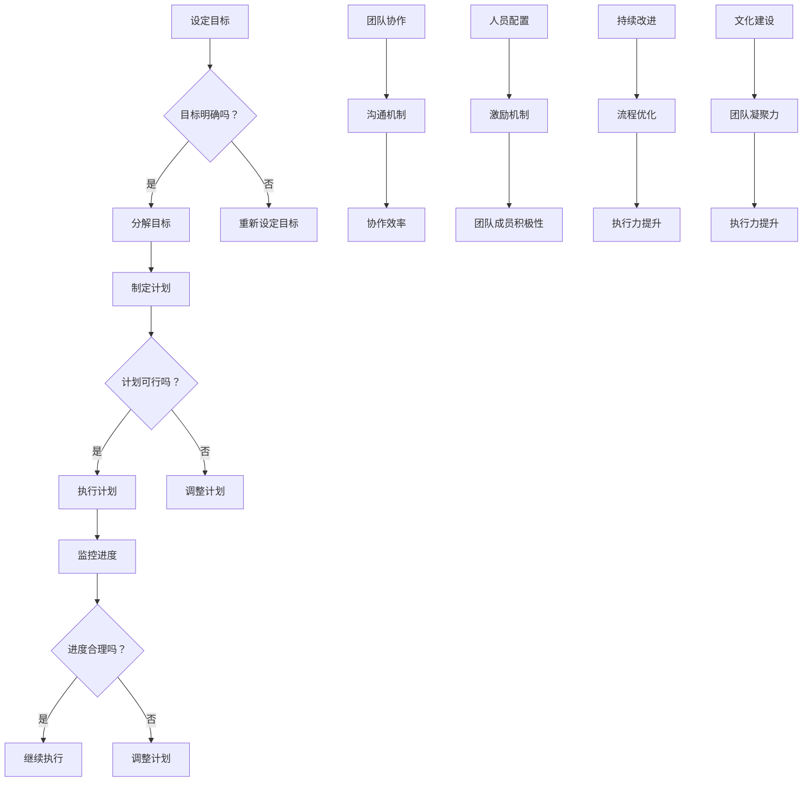

                 

# 创业过程中如何不断提升团队执行力

> **关键词：团队执行力，创业，管理策略，人员配置，持续改进**

> **摘要：本文将探讨创业团队在快速发展的过程中如何提升执行力。我们将分析执行力的重要性，提出有效提升执行力的策略，并分享实际案例，帮助创业团队在激烈的市场竞争中脱颖而出。**

## 1. 背景介绍

### 1.1 目的和范围

本文旨在帮助创业团队理解执行力的重要性，并提供一系列可操作的策略来提升团队的整体执行力。我们将讨论执行力在创业过程中的核心作用，分析团队执行力提升的必要性和可能性。

### 1.2 预期读者

本文适合以下读者群体：
- 创业公司的创始人或团队领导者。
- 管理层和项目负责人。
- 想要提升团队执行力的专业人士。

### 1.3 文档结构概述

本文结构如下：

1. 背景介绍：明确文章目的和读者对象。
2. 核心概念与联系：介绍团队执行力相关的基本概念和原理。
3. 核心算法原理 & 具体操作步骤：详细阐述提升执行力的方法和步骤。
4. 数学模型和公式 & 详细讲解 & 举例说明：通过数学模型和实际案例来解释提升执行力的关键点。
5. 项目实战：代码实际案例和详细解释说明。
6. 实际应用场景：探讨执行力在不同场景中的应用。
7. 工具和资源推荐：推荐相关学习资源和开发工具。
8. 总结：未来发展趋势与挑战。
9. 附录：常见问题与解答。
10. 扩展阅读 & 参考资料：提供进一步阅读的材料。

### 1.4 术语表

#### 1.4.1 核心术语定义

- **执行力**：团队完成目标的能力。
- **管理策略**：用于指导团队运作的方法和原则。
- **人员配置**：团队中人员的选择和安排。

#### 1.4.2 相关概念解释

- **目标明确**：设定清晰的目标是执行力的基础。
- **持续改进**：不断优化过程和策略以提高执行力。

#### 1.4.3 缩略词列表

- **CEO**：首席执行官
- **CTO**：首席技术官
- **SaaS**：软件即服务
- **PaaS**：平台即服务
- **IaaS**：基础设施即服务

## 2. 核心概念与联系

在讨论如何提升团队执行力之前，我们需要了解一些核心概念和它们之间的联系。

### 2.1 执行力与目标管理

**目标管理**是提升执行力的关键。一个清晰、具体、可衡量的目标是团队努力的方向。以下是目标管理的基本步骤：

1. 设定明确的目标。
2. 分解目标为可执行的任务。
3. 跟踪进度和调整计划。

### 2.2 团队协作与沟通

**团队协作**和**沟通**是提升执行力的重要组成部分。高效的团队协作和良好的沟通能够确保团队成员协同工作，减少误解和冲突，提高整体执行力。

### 2.3 人员配置与激励

**人员配置**和**激励**策略对于提升团队执行力至关重要。合适的团队成员能够发挥各自的专长，而有效的激励措施能够激发团队成员的积极性和创造力。

### 2.4 持续改进与文化建设

**持续改进**和**文化建设**是团队执行力长期提升的保障。持续改进能够不断优化团队的工作流程和策略，而积极向上的团队文化能够增强团队的凝聚力和执行力。

以下是提升团队执行力的 Mermaid 流程图：



## 3. 核心算法原理 & 具体操作步骤

提升团队执行力的核心算法原理可以归纳为以下几个步骤：

### 3.1 设定明确的目标

**算法原理：** 设定明确的目标是提升执行力的第一步。目标需要具备SMART特性（具体、可衡量、可实现、相关、时间限定）。

**伪代码：**
```
function setGoal(goal) {
    if (goal is SMART) {
        return "目标设定成功";
    } else {
        return "目标设定失败，请重新设定";
    }
}
```

### 3.2 分解目标为可执行的任务

**算法原理：** 将目标分解为具体的任务，每个任务都有明确的责任人和截止日期。

**伪代码：**
```
function decomposeGoal(goal) {
    tasks = [];
    for each part in goal {
        task = createTask(part);
        tasks.append(task);
    }
    return tasks;
}
```

### 3.3 制定计划

**算法原理：** 根据分解的任务，制定详细的执行计划，包括每个任务的开始和结束时间。

**伪代码：**
```
function createPlan(tasks) {
    plan = [];
    for each task in tasks {
        start = getCurrentTime();
        end = start + task.duration;
        plan.append({task: task, start: start, end: end});
    }
    return plan;
}
```

### 3.4 执行计划

**算法原理：** 根据计划执行任务，确保每个任务按照预定的时间表完成。

**伪代码：**
```
function executePlan(plan) {
    for each step in plan {
        executeTask(step.task);
        monitorProgress(step);
    }
}
```

### 3.5 监控进度

**算法原理：** 监控任务进度，及时发现和解决问题。

**伪代码：**
```
function monitorProgress(step) {
    while (step completion is not reached) {
        progress = getTaskProgress(step.task);
        if (progress is not satisfactory) {
            resolveProblem(step.task);
        }
    }
}
```

### 3.6 调整计划

**算法原理：** 根据监控结果调整计划，确保任务能够按时完成。

**伪代码：**
```
function adjustPlan(plan, progress) {
    for each step in plan {
        if (progress[step.task] is not satisfactory) {
            adjustTaskDuration(step);
        }
    }
}
```

## 4. 数学模型和公式 & 详细讲解 & 举例说明

在提升团队执行力的过程中，可以使用以下数学模型和公式来评估和优化团队的执行力：

### 4.1 目标完成率

**公式：**
\[ \text{目标完成率} = \frac{\text{实际完成目标数}}{\text{设定目标总数}} \]

**详细讲解：**
目标完成率是衡量团队执行力的重要指标。通过计算实际完成的任务数与设定的目标总数之比，可以得到团队在一定时间内完成目标的效率。

**举例说明：**
假设一个团队设定了5个目标，实际完成了3个，则目标完成率为 \( \frac{3}{5} = 0.6 \) 或 60%。

### 4.2 任务周转时间

**公式：**
\[ \text{任务周转时间} = \text{任务开始时间} + \text{任务执行时间} + \text{任务等待时间} \]

**详细讲解：**
任务周转时间是衡量任务执行效率的一个重要指标，包括任务的开始时间、执行时间和等待时间。

**举例说明：**
如果一个任务从开始到完成经历了3天（开始时间1天，执行时间1天，等待时间1天），则任务周转时间为3天。

### 4.3 团队绩效评估

**公式：**
\[ \text{团队绩效评估} = \frac{\text{团队目标完成率} + \text{任务周转时间}}{2} \]

**详细讲解：**
团队绩效评估通过结合目标完成率和任务周转时间，综合衡量团队的执行力和效率。

**举例说明：**
假设团队的目标完成率为70%，任务周转时间为4天，则团队绩效评估为 \( \frac{0.7 + 4}{2} = 2.35 \)。

## 5. 项目实战：代码实际案例和详细解释说明

为了更好地理解提升团队执行力的方法和步骤，我们通过一个实际的项目案例来演示。

### 5.1 开发环境搭建

首先，我们需要搭建一个简单的项目管理环境。我们可以使用Git进行版本控制，并使用JIRA或Trello等工具来管理任务和进度。

### 5.2 源代码详细实现和代码解读

以下是一个简单的项目示例，使用Python编写，用于跟踪任务进度和评估团队绩效。

**源代码：**

```python
import datetime

# 任务类
class Task:
    def __init__(self, name, duration, start_date=None):
        self.name = name
        self.duration = duration
        self.start_date = start_date or datetime.datetime.now()
        self.end_date = self.start_date + datetime.timedelta(days=duration)
        self.completed = False

    def execute(self):
        self.completed = True
        print(f"{self.name} 已完成。")

    def __str__(self):
        return f"{self.name}，开始时间：{self.start_date}，持续时间：{self.duration}天，完成状态：{self.completed}"

# 团队类
class Team:
    def __init__(self, name):
        self.name = name
        self.tasks = []

    def add_task(self, task):
        self.tasks.append(task)

    def execute_tasks(self):
        for task in self.tasks:
            task.execute()

    def get_performance(self):
        completed_tasks = sum(1 for task in self.tasks if task.completed)
        total_tasks = len(self.tasks)
        performance = completed_tasks / total_tasks
        return performance

    def __str__(self):
        return f"团队名称：{self.name}，任务总数：{len(self.tasks)}，绩效：{self.get_performance():.2f}"

# 主程序
if __name__ == "__main__":
    team = Team("开发团队")
    team.add_task(Task("编写代码", 5))
    team.add_task(Task("测试代码", 3))
    team.add_task(Task("部署上线", 2))

    print("开始执行任务：")
    team.execute_tasks()

    print("团队绩效：")
    print(team)
```

**代码解读：**

- **Task类**：定义了一个任务类，包含任务名称、持续时间、开始时间和完成状态等属性。
- **Team类**：定义了一个团队类，包含团队名称、任务列表和添加任务、执行任务、计算绩效等方法。
- **主程序**：创建了一个团队对象，添加了三个任务，并依次执行这些任务，最后打印团队绩效。

### 5.3 代码解读与分析

通过上面的代码，我们可以看到如何使用Python实现一个简单的任务跟踪和团队绩效评估系统。

- **任务类**：定义了一个基本的任务模型，可以通过修改持续时间、开始时间等属性来定义不同的任务。
- **团队类**：实现了任务的管理和执行，以及绩效评估的功能。通过执行任务，我们可以看到任务的完成状态，并计算团队的绩效。
- **主程序**：创建了一个团队对象，并添加了三个任务。通过执行这些任务，我们可以观察到任务的完成过程，并最终计算团队的绩效。

这个简单的项目案例展示了如何通过代码实现任务管理和团队绩效评估，为实际的项目执行提供了参考。

## 6. 实际应用场景

提升团队执行力在创业过程中具有广泛的应用场景。以下是几个典型的实际应用场景：

### 6.1 项目开发

在软件开发项目中，提升团队执行力至关重要。通过有效的任务管理和进度监控，团队能够按时完成开发任务，保证项目的质量。

### 6.2 市场营销

在市场营销活动中，执行力可以帮助团队快速响应市场变化，制定并执行有效的营销策略，提高市场占有率和品牌知名度。

### 6.3 产品运营

在产品运营过程中，执行力能够帮助团队快速迭代产品，收集用户反馈，优化产品功能，提升用户体验。

### 6.4 战略规划

在战略规划阶段，提升团队执行力有助于确保战略目标的有效实施，推动企业持续发展和壮大。

### 6.5 团队协作

在团队协作中，执行力能够促进团队成员之间的沟通和协作，提高工作效率，增强团队的凝聚力。

## 7. 工具和资源推荐

为了提升团队执行力，我们需要使用一些工具和资源来辅助管理任务和团队协作。

### 7.1 学习资源推荐

- **书籍推荐**：
  - 《团队执行力：如何打造高效团队》
  - 《目标管理：如何设定、分解和实现目标》
  - 《项目管理实战：从理论到实践的全面指南》

- **在线课程**：
  - Coursera上的《项目管理专业》
  - Udemy上的《目标管理：设定、实现和追踪目标》

- **技术博客和网站**：
  - Medium上的《创业管理》系列文章
  - GitHub上的项目管理开源项目和最佳实践

### 7.2 开发工具框架推荐

- **IDE和编辑器**：
  - Visual Studio Code
  - IntelliJ IDEA

- **调试和性能分析工具**：
  - Debuggers（如GDB、LLDB）
  - Profilers（如Valgrind、gprof）

- **相关框架和库**：
  - Django（Python Web框架）
  - React（前端JavaScript框架）

### 7.3 相关论文著作推荐

- **经典论文**：
  - 《目标管理的理论与实践》
  - 《团队协作与执行力研究》

- **最新研究成果**：
  - 《人工智能在团队管理中的应用》
  - 《基于大数据的团队执行力分析》

- **应用案例分析**：
  - 《知名创业公司如何提升团队执行力》
  - 《跨国团队执行力提升策略研究》

## 8. 总结：未来发展趋势与挑战

在未来，团队执行力的发展趋势将受到以下几个因素的影响：

- **人工智能**：人工智能技术的应用将进一步提升团队执行力的自动化和智能化水平，为团队管理提供更多数据支持和决策依据。
- **大数据分析**：大数据分析技术将帮助团队更准确地了解自身执行力的状况，从而制定更有效的改进策略。
- **远程办公**：随着远程办公的普及，提升团队执行力将更加注重沟通和协作工具的优化，以及团队成员的自律和自我管理能力。

然而，在提升团队执行力的过程中，创业团队也将面临一系列挑战：

- **人才流失**：优秀人才的流失可能削弱团队的整体执行力。
- **项目管理复杂度**：随着项目规模的扩大，项目管理将变得更加复杂，对团队执行力提出了更高的要求。
- **文化差异**：跨国团队的文化差异可能影响团队协作和执行力。

因此，创业团队需要不断学习和适应新的技术和环境，以提高团队的执行力，从而在激烈的市场竞争中保持优势。

## 9. 附录：常见问题与解答

### 问题1：如何确保团队成员都明确任务目标？
**解答**：通过定期的会议和沟通，确保团队成员理解任务目标。同时，使用任务管理工具，如JIRA或Trello，可以让每个成员都能实时查看任务状态和目标。

### 问题2：如何提高团队成员的执行力？
**解答**：建立明确的绩效考核体系，激励团队成员。同时，提供培训和指导，帮助团队成员提高技能和执行能力。

### 问题3：如何处理团队成员的执行力不足问题？
**解答**：首先分析执行力不足的原因，是技能问题、资源问题还是管理问题。根据原因采取相应的改进措施，如提供培训、优化工作流程或调整人员配置。

## 10. 扩展阅读 & 参考资料

为了更深入地了解团队执行力提升的相关知识和最佳实践，以下是一些扩展阅读和参考资料：

- **书籍**：
  - 《执行：如何落实战略目标》
  - 《团队协作：打造高效团队的方法与实践》
  - 《目标管理：理论与实践》

- **在线课程**：
  - LinkedIn Learning上的《项目管理专业》
  - Coursera上的《领导力与团队管理》

- **技术博客和网站**：
  - TechCrunch上的《创业公司如何提升团队执行力》
  - Medium上的《团队协作与执行力》

- **学术论文**：
  - 《团队执行力：概念、模型与应用》
  - 《基于大数据的团队执行力分析》

**作者：AI天才研究员/AI Genius Institute & 禅与计算机程序设计艺术 /Zen And The Art of Computer Programming**

