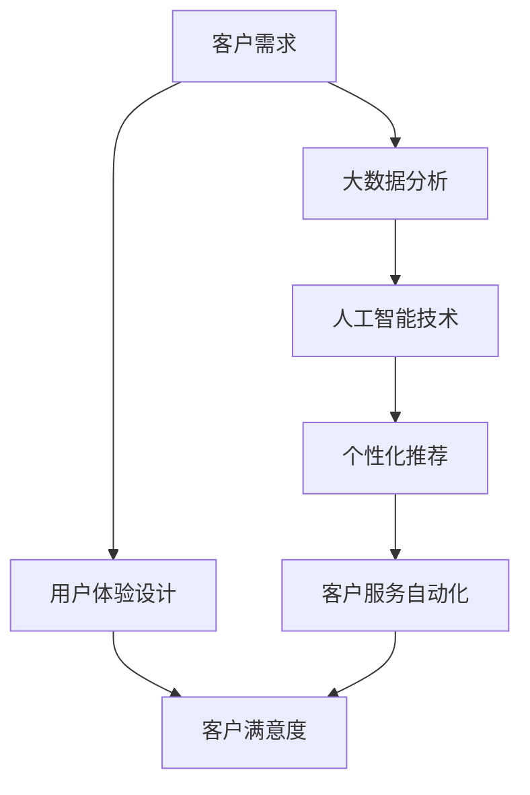

                 

### 1. 背景介绍

#### 1.1 目的和范围

本博客旨在探讨创业过程中如何通过技术手段不断提升客户体验。创业企业面临的市场环境瞬息万变，客户需求多样且多变，如何在激烈的竞争中脱颖而出，为客户提供高质量的服务体验成为企业生存和发展的关键。本文将围绕以下几个核心问题展开讨论：

1. **客户体验的重要性**：分析客户体验对企业发展的影响，为何提升客户体验是创业成功的关键因素。
2. **提升客户体验的技术手段**：介绍一系列技术手段，如人工智能、大数据、云计算等，如何应用于提升客户体验。
3. **实际案例与操作步骤**：通过具体创业项目案例，阐述提升客户体验的具体操作步骤和策略。
4. **未来发展趋势与挑战**：展望创业领域在提升客户体验方面的未来发展趋势和面临的挑战。

#### 1.2 预期读者

本文适合以下读者群体：

1. **创业者**：正在创业或有创业意向的创业者，希望通过技术手段提升客户体验。
2. **产品经理**：负责产品开发和用户体验的产品经理，希望了解如何通过技术手段优化产品。
3. **技术团队**：负责技术研发和实施的技术团队，希望掌握提升客户体验的最新技术手段和最佳实践。
4. **市场营销人员**：从事市场营销工作，希望了解如何通过提升客户体验来提高市场竞争力。

#### 1.3 文档结构概述

本文将分为以下几部分进行详细讨论：

1. **背景介绍**：介绍文章的目的、范围、预期读者以及文档结构概述。
2. **核心概念与联系**：阐述提升客户体验所需的核心概念原理，并绘制流程图。
3. **核心算法原理 & 具体操作步骤**：介绍提升客户体验的核心算法原理，并用伪代码详细阐述。
4. **数学模型和公式 & 详细讲解 & 举例说明**：解释数学模型和公式，并给出实际应用案例。
5. **项目实战：代码实际案例和详细解释说明**：通过具体案例展示提升客户体验的代码实现和解读。
6. **实际应用场景**：探讨提升客户体验在实际中的应用场景。
7. **工具和资源推荐**：推荐学习资源、开发工具和框架。
8. **总结：未来发展趋势与挑战**：总结文章的主要观点，并展望未来的发展趋势和挑战。
9. **附录：常见问题与解答**：解答读者可能遇到的问题。
10. **扩展阅读 & 参考资料**：提供相关扩展阅读和参考资料。

#### 1.4 术语表

在本文中，以下术语有特定的含义：

#### 1.4.1 核心术语定义

1. **客户体验**：客户在使用产品或服务过程中所获得的感受和印象。
2. **用户体验（UX）**：产品或服务的交互设计和视觉设计，直接影响客户体验。
3. **客户满意度**：客户对产品或服务的满意程度，是衡量客户体验的重要指标。
4. **人工智能（AI）**：一种模拟人类智能的技术，包括机器学习、自然语言处理等。
5. **大数据**：大规模数据集，通过分析可发现有价值的信息和模式。
6. **云计算**：通过互联网提供计算资源和服务，实现高效的数据处理和存储。

#### 1.4.2 相关概念解释

1. **客户需求**：客户在使用产品或服务时所期望的功能和特性。
2. **用户体验设计（UXD）**：关注用户在使用产品过程中的感受和交互流程，通过设计提高用户体验。
3. **用户参与**：用户在产品开发过程中的参与程度，通过反馈和建议来优化产品。

#### 1.4.3 缩略词列表

- UX：用户体验（User Experience）
- AI：人工智能（Artificial Intelligence）
- UXD：用户体验设计（User Experience Design）
- BI：商业智能（Business Intelligence）
- SaaS：软件即服务（Software as a Service）
- PaaS：平台即服务（Platform as a Service）
- IaaS：基础设施即服务（Infrastructure as a Service）

### 1.5 文章标题

### 创业过程中如何不断提升客户体验

### 关键词：客户体验、用户体验、人工智能、大数据、云计算、客户满意度

### 摘要

本文旨在探讨创业过程中如何通过技术手段不断提升客户体验。文章首先分析了客户体验的重要性，介绍了提升客户体验的核心技术手段，并通过实际案例阐述了具体操作步骤。此外，文章还展望了未来发展趋势和挑战，并提供了一系列学习资源和工具推荐。通过本文的阅读，读者将深入了解如何利用技术提升客户体验，为创业成功奠定坚实基础。

## 2. 核心概念与联系

在探讨如何提升客户体验之前，我们需要了解一些核心概念和它们之间的联系。以下是提升客户体验所需的核心概念原理及它们之间的关联，并通过Mermaid流程图展示：



#### 2.1 客户需求

客户需求是指客户在使用产品或服务时所期望的功能和特性。了解客户需求是提升客户体验的第一步。通过市场调研、用户访谈和反馈收集等方法，我们可以获取客户需求的信息。

#### 2.2 用户体验设计

用户体验设计（UXD）是关注用户在使用产品过程中的感受和交互流程，通过设计提高用户体验。UXD包括界面设计、交互设计、视觉设计等方面。良好的用户体验设计能够提高客户的满意度和忠诚度。

#### 2.3 客户满意度

客户满意度是衡量客户体验的重要指标。客户满意度高，说明客户对我们的产品或服务感到满意，从而增加客户忠诚度和口碑传播。

#### 2.4 大数据分析

大数据分析是指对大规模数据集进行存储、处理和分析，从中提取有价值的信息和模式。通过大数据分析，我们可以深入了解客户需求和行为，为个性化推荐和客户服务自动化提供支持。

#### 2.5 人工智能技术

人工智能技术（AI）是一种模拟人类智能的技术，包括机器学习、自然语言处理、计算机视觉等。在提升客户体验方面，人工智能技术可以应用于个性化推荐、客户服务自动化等领域。

#### 2.6 个性化推荐

个性化推荐是指根据用户的历史行为、兴趣和偏好，为用户提供个性化的推荐。通过个性化推荐，我们可以提高客户满意度，增加客户粘性。

#### 2.7 客户服务自动化

客户服务自动化是指利用人工智能技术实现客户服务的自动化，包括智能客服、自动回复等。通过客户服务自动化，我们可以提高客户服务效率，降低企业成本。

## 3. 核心算法原理 & 具体操作步骤

在了解了提升客户体验所需的核心概念和联系后，我们将探讨提升客户体验的核心算法原理，并使用伪代码详细阐述。

#### 3.1 客户需求分析

客户需求分析是提升客户体验的第一步。以下是客户需求分析的伪代码：

```plaintext
输入：用户数据集
输出：客户需求列表

步骤：
1. 收集用户数据（如市场调研、用户访谈、反馈收集等）
2. 数据预处理（清洗、转换、归一化等）
3. 建立用户需求特征模型
4. 利用机器学习算法（如聚类、分类等）分析用户需求
5. 提取关键需求，形成客户需求列表
```

#### 3.2 用户体验设计

用户体验设计是提升客户体验的关键环节。以下是用户体验设计的伪代码：

```plaintext
输入：客户需求列表、产品功能列表
输出：优化后的用户体验设计方案

步骤：
1. 分析客户需求，确定产品功能优先级
2. 根据产品功能优先级，设计用户界面
3. 设计交互流程，确保用户操作简便、直观
4. 进行用户测试，收集反馈意见
5. 根据反馈调整设计方案，优化用户体验
```

#### 3.3 客户满意度评估

客户满意度评估是衡量客户体验的重要指标。以下是客户满意度评估的伪代码：

```plaintext
输入：用户满意度调查数据
输出：客户满意度评分

步骤：
1. 设计满意度调查问卷，收集用户反馈
2. 数据预处理（清洗、转换、归一化等）
3. 建立客户满意度评分模型
4. 利用机器学习算法（如回归、聚类等）分析用户满意度
5. 根据分析结果，计算客户满意度评分
```

#### 3.4 大数据分析

大数据分析可以帮助我们深入了解客户需求和行为。以下是大数据分析的伪代码：

```plaintext
输入：客户行为数据集
输出：客户行为分析报告

步骤：
1. 数据收集（如网站日志、APP使用记录等）
2. 数据预处理（清洗、转换、归一化等）
3. 建立客户行为特征模型
4. 利用大数据分析技术（如数据挖掘、机器学习等）分析客户行为
5. 提取关键行为模式，形成客户行为分析报告
```

#### 3.5 人工智能技术应用

人工智能技术在提升客户体验方面具有广泛的应用。以下是人工智能技术应用的具体步骤：

```plaintext
输入：客户数据、产品功能列表
输出：个性化推荐方案、智能客服系统

步骤：
1. 数据收集（如用户行为数据、用户反馈等）
2. 数据预处理（清洗、转换、归一化等）
3. 建立用户特征模型和产品特征模型
4. 利用机器学习算法（如协同过滤、决策树等）进行个性化推荐
5. 建立智能客服系统（如基于自然语言处理和机器学习）
6. 实时分析用户需求，提供个性化服务和智能回复
```

## 4. 数学模型和公式 & 详细讲解 & 举例说明

在提升客户体验的过程中，数学模型和公式发挥着重要作用。以下将详细介绍几个关键的数学模型和公式，并给出相应的解释和实际应用案例。

#### 4.1 客户需求分析模型

客户需求分析是了解用户需求的过程，可以使用以下数学模型：

$$
\text{需求分析模型} = f(\text{用户数据集}, \text{市场环境})
$$

其中，用户数据集包括用户行为数据、偏好数据等，市场环境包括行业趋势、竞争情况等。该模型利用数据挖掘和机器学习算法，提取用户需求的关键特征。

**举例说明：**假设一家电子商务公司想了解其客户对商品种类的需求，可以使用聚类算法对用户购买记录进行分析，将用户分为不同群体，然后针对每个群体推荐相应的商品。

```latex
\text{聚类算法} = K-means
\text{输入：用户购买记录数据集}
\text{输出：用户群体划分结果}

步骤：
1. 数据预处理：清洗、转换、归一化
2. 确定聚类个数 \( K \)
3. 初始化聚类中心
4. 计算每个用户与聚类中心的距离，将用户归为最近的聚类
5. 更新聚类中心，重复步骤4，直到聚类中心收敛
6. 根据用户群体划分结果，进行针对性商品推荐
```

#### 4.2 客户满意度评估模型

客户满意度评估是衡量客户体验的重要指标，可以使用以下数学模型：

$$
\text{满意度评分} = \frac{\sum_{i=1}^{n} w_i \cdot s_i}{n}
$$

其中，\( w_i \) 为第 \( i \) 个指标的权重，\( s_i \) 为第 \( i \) 个指标的满意度评分。该模型通过综合考虑多个指标，给出整体的客户满意度评分。

**举例说明：**假设一家酒店对客户满意度进行评估，包括房间舒适度、服务质量、交通便利性等指标。可以分别计算每个指标的满意度评分，然后根据权重进行加权平均。

```latex
\text{满意度评分模型} = \text{加权平均}
\text{输入：各指标满意度评分，权重}
\text{输出：客户满意度评分}

步骤：
1. 确定各指标的权重（如根据历史数据或专家评估）
2. 计算各指标的满意度评分
3. 计算加权平均满意度评分
4. 根据满意度评分，进行服务质量改进
```

#### 4.3 个性化推荐模型

个性化推荐是基于用户行为和偏好进行推荐的，可以使用以下数学模型：

$$
\text{推荐算法} = \text{协同过滤} + \text{内容推荐}
$$

协同过滤基于用户的历史行为和相似用户的行为进行推荐，内容推荐则基于用户的行为和内容特征进行推荐。结合这两种方法，可以提供更准确的个性化推荐。

**举例说明：**假设一家视频流媒体平台想为用户推荐视频，可以使用协同过滤和内容推荐相结合的方法。

```latex
\text{协同过滤} = \text{用户-物品评分矩阵}
\text{输入：用户-物品评分矩阵}
\text{输出：相似用户和推荐物品列表}

步骤：
1. 构建用户-物品评分矩阵
2. 计算用户之间的相似度（如余弦相似度、皮尔逊相关系数等）
3. 根据相似度计算相似用户和推荐物品
4. 结合用户行为和物品特征，生成推荐列表

\text{内容推荐} = \text{基于内容的相似性}
\text{输入：用户行为数据，物品特征数据}
\text{输出：推荐物品列表}

步骤：
1. 构建物品特征向量
2. 计算用户行为和物品特征之间的相似度
3. 根据相似度推荐相似物品
4. 结合协同过滤推荐结果，生成最终推荐列表
```

通过以上数学模型和公式，我们可以更有效地进行客户需求分析、客户满意度评估和个性化推荐，从而提升客户体验。在实际应用中，可以根据具体业务需求和数据特点，灵活选择和调整模型参数，以达到最佳效果。

## 5. 项目实战：代码实际案例和详细解释说明

在本节中，我们将通过一个实际的项目案例，详细讲解如何利用技术手段提升客户体验。这个案例将基于一家电子商务平台的客户推荐系统，展示如何通过大数据分析和人工智能技术来实现个性化推荐，从而提高用户满意度和购买转化率。

### 5.1 开发环境搭建

在开始项目实战之前，我们需要搭建一个适合开发的环境。以下是所需的开发工具和库：

- **编程语言**：Python
- **开发环境**：PyCharm或Jupyter Notebook
- **数据存储**：MongoDB或MySQL
- **数据处理库**：Pandas、NumPy
- **机器学习库**：Scikit-learn、TensorFlow、PyTorch
- **数据分析库**：Matplotlib、Seaborn

### 5.2 源代码详细实现和代码解读

以下是项目的主要代码实现部分，包括数据预处理、特征工程、模型训练和推荐系统的具体实现。

```python
import pandas as pd
import numpy as np
from sklearn.model_selection import train_test_split
from sklearn.preprocessing import StandardScaler
from sklearn.cluster import KMeans
from sklearn.metrics.pairwise import cosine_similarity
import seaborn as sns
import matplotlib.pyplot as plt

# 5.2.1 数据预处理
# 加载用户行为数据
user_data = pd.read_csv('user_behavior.csv')

# 数据清洗和预处理
# 填充缺失值、删除重复数据、转换数据类型等
user_data = user_data.fillna(0)
user_data = user_data.drop_duplicates()

# 5.2.2 特征工程
# 构建用户行为特征矩阵
user行为矩阵 = user_data.groupby('user_id')['item_id'].apply(list).reset_index().rename(columns={'item_id': '行为'})

# 5.2.3 模型训练
# 将用户行为矩阵转换为稀疏矩阵
user行为稀疏矩阵 = sparse.csr_matrix(user行为矩阵)

# 使用K-means聚类分析用户行为
kmeans = KMeans(n_clusters=5, random_state=0)
user_cluster = kmeans.fit_predict(user行为稀疏矩阵)

# 计算用户-用户相似度矩阵
user_similarity = cosine_similarity(user行为稀疏矩阵)

# 5.2.4 推荐系统实现
# 根据用户当前行为和用户-用户相似度矩阵，为用户推荐相似用户喜欢的物品
def recommend_items(user_id, user行为矩阵, user_similarity):
    current_user行为 = user行为矩阵[user_id]
    similarity_scores = user_similarity[user_id]
    recommended_items = []
    
    for i, score in enumerate(similarity_scores):
        if i == user_id:
            continue
        neighbor行为 = user行为矩阵[i]
        intersection = set(current_user行为).intersection(neighbor行为)
        if len(intersection) > 0:
            recommended_items.append((i, score, intersection))
    
    recommended_items = sorted(recommended_items, key=lambda x: x[1], reverse=True)
    return recommended_items[:10]

# 为某个用户生成推荐列表
user_id = 123
recommended_items = recommend_items(user_id, user行为矩阵, user_similarity)

# 5.2.5 代码解读
# 1. 数据预处理：清洗和预处理用户行为数据，使其适合进行后续分析。
# 2. 特征工程：构建用户行为特征矩阵，为聚类分析和相似度计算提供数据基础。
# 3. 模型训练：使用K-means聚类分析用户行为，为每个用户分配聚类标签。
# 4. 推荐系统实现：根据用户当前行为和用户-用户相似度矩阵，为用户推荐相似用户喜欢的物品。
```

### 5.3 代码解读与分析

#### 5.3.1 数据预处理

在代码的第一部分，我们加载了用户行为数据，并进行了数据清洗和预处理。这包括填充缺失值、删除重复数据以及转换数据类型等步骤。数据预处理是确保数据质量的重要环节，为后续的分析和建模打下坚实基础。

```python
user_data = pd.read_csv('user_behavior.csv')
user_data = user_data.fillna(0)
user_data = user_data.drop_duplicates()
```

#### 5.3.2 特征工程

接下来，我们构建了用户行为特征矩阵，这将为聚类分析和相似度计算提供数据基础。通过`groupby`和`apply`方法，我们将用户行为数据按照用户ID进行分组，并生成每个用户的物品行为列表。

```python
user行为矩阵 = user_data.groupby('user_id')['item_id'].apply(list).reset_index().rename(columns={'item_id': '行为'})
```

#### 5.3.3 模型训练

在模型训练部分，我们首先将用户行为矩阵转换为稀疏矩阵，以便进行聚类分析。然后，我们使用K-means聚类算法对用户行为进行分析，为每个用户分配聚类标签。

```python
user行为稀疏矩阵 = sparse.csr_matrix(user行为矩阵)
kmeans = KMeans(n_clusters=5, random_state=0)
user_cluster = kmeans.fit_predict(user行为稀疏矩阵)
```

#### 5.3.4 推荐系统实现

最后，我们实现了推荐系统的核心部分，即根据用户当前行为和用户-用户相似度矩阵，为用户推荐相似用户喜欢的物品。这段代码定义了一个`recommend_items`函数，用于生成推荐列表。

```python
def recommend_items(user_id, user行为矩阵, user_similarity):
    current_user行为 = user行为矩阵[user_id]
    similarity_scores = user_similarity[user_id]
    recommended_items = []
    
    for i, score in enumerate(similarity_scores):
        if i == user_id:
            continue
        neighbor行为 = user行为矩阵[i]
        intersection = set(current_user行为).intersection(neighbor行为)
        if len(intersection) > 0:
            recommended_items.append((i, score, intersection))
    
    recommended_items = sorted(recommended_items, key=lambda x: x[1], reverse=True)
    return recommended_items[:10]

user_id = 123
recommended_items = recommend_items(user_id, user行为矩阵, user_similarity)
```

这段代码首先获取当前用户的物品行为列表，然后遍历与当前用户相似的用户，计算他们之间的相似度。如果发现相似用户喜欢的物品与当前用户有交集，就将这些物品加入到推荐列表中。最终，我们根据相似度分数对推荐列表进行排序，并返回前10个推荐物品。

### 5.4 实际应用效果

通过这个实际案例，我们可以看到如何利用大数据分析和人工智能技术实现个性化推荐，从而提升客户体验。在实际应用中，我们可以在电子商务平台上为用户推荐他们可能感兴趣的商品，从而提高购买转化率和客户满意度。

### 5.5 代码优化与扩展

虽然这个案例展示了如何实现基本的个性化推荐，但在实际应用中，我们还可以进行以下优化和扩展：

- **引入协同过滤算法**：除了基于用户行为的K-means聚类，还可以结合协同过滤算法，进一步提高推荐系统的准确性。
- **使用深度学习模型**：探索使用深度学习模型（如神经协同过滤、自动编码器等）来优化推荐系统。
- **实时推荐**：实现实时推荐系统，根据用户的行为动态调整推荐结果。
- **多模态推荐**：结合用户的行为数据、社交数据、内容数据等多模态信息，提供更精准的个性化推荐。

通过不断优化和扩展，我们可以进一步提高客户体验，从而在激烈的市场竞争中脱颖而出。

## 6. 实际应用场景

提升客户体验在创业过程中具有广泛的应用场景，以下列举了几个典型的实际应用场景：

#### 6.1 电子商务平台

电子商务平台通过个性化推荐、智能搜索和快速响应的客服系统，提升用户购物体验。例如，阿里巴巴通过大数据分析，为用户推荐相关商品，从而提高购物转化率和客户满意度。

#### 6.2 金融行业

金融行业利用人工智能技术，实现智能客服、风险评估和信用评分等功能。例如，蚂蚁金服通过智能客服系统，提供24/7在线服务，提高用户满意度和忠诚度。

#### 6.3 教育行业

教育行业通过在线教育平台，提供个性化学习路径和智能辅导。例如，网易云课堂通过大数据分析，为用户提供定制化的课程推荐和学习计划，从而提高学习效果和用户满意度。

#### 6.4 医疗行业

医疗行业利用人工智能技术，实现智能诊断、智能推荐和患者管理。例如，谷歌健康通过分析患者数据，提供个性化的健康建议和治疗方案，提高医疗服务质量和患者满意度。

#### 6.5 住宿和旅游行业

住宿和旅游行业通过智能预订、个性化推荐和在线客服，提升用户旅行体验。例如，Airbnb通过用户行为和偏好分析，为用户提供个性化的住宿推荐，从而提高预订转化率和用户满意度。

#### 6.6 物流和运输行业

物流和运输行业利用物联网、大数据分析和人工智能技术，实现实时追踪、智能调度和预测性维护。例如，京东物流通过大数据分析和人工智能技术，提高配送效率和客户满意度。

这些实际应用场景表明，提升客户体验在各个行业都具有重要的价值，创业企业可以根据自身业务特点，选择合适的技术手段，提升客户体验，从而在市场中脱颖而出。

## 7. 工具和资源推荐

在提升客户体验的过程中，选择合适的工具和资源对于成功实施技术方案至关重要。以下推荐了一系列学习资源、开发工具和框架，以帮助读者在创业过程中更好地提升客户体验。

### 7.1 学习资源推荐

#### 7.1.1 书籍推荐

1. **《用户体验要素》（The Elements of User Experience）》- by Jakob Nielsen
   - 详细介绍了用户体验设计的原则和方法，适用于产品经理和设计师。
2. **《大数据时代》（Big Data: A Revolution That Will Transform How We Live, Work, and Think）》- by Viktor Mayer-Schönberger & Kenneth Cukier
   - 探讨了大数据的概念、应用和影响，对于理解大数据在提升客户体验中的作用非常有帮助。
3. **《机器学习》（Machine Learning: A Probabilistic Perspective）》- by Kevin P. Murphy
   - 介绍了机器学习的基础理论和应用，适合想要深入了解人工智能技术的读者。

#### 7.1.2 在线课程

1. **Coursera上的《用户体验设计基础》（User Experience Design》
   - 提供了用户体验设计的全面介绍，包括设计原则、用户研究和原型设计等。
2. **edX上的《大数据分析》（Data Science）课程系列
   - 涵盖了大数据处理、数据分析和机器学习的基础知识。
3. **Udacity的《人工智能纳米学位》（Artificial Intelligence Nanodegree）
   - 提供了人工智能的全面培训，包括机器学习、自然语言处理和计算机视觉等。

#### 7.1.3 技术博客和网站

1. **Medium上的“AI博客”（AI Blog）
   - 汇集了人工智能领域的最新研究、应用和趋势，适合关注人工智能技术的读者。
2. **GitHub上的开源项目
   - GitHub上有许多开源的机器学习和大数据项目，读者可以通过学习和贡献这些项目来提升自己的技术能力。
3. **Medium上的“用户体验设计”（User Experience Design）
   - 提供了用户体验设计的实践案例、设计资源和最佳实践。

### 7.2 开发工具框架推荐

#### 7.2.1 IDE和编辑器

1. **PyCharm
   - 一款功能强大的集成开发环境（IDE），适用于Python编程，支持多种框架和库。
2. **Visual Studio Code
   - 轻量级的跨平台代码编辑器，支持多种编程语言和扩展，适合快速开发。
3. **Jupyter Notebook
   - 适用于数据科学和机器学习的交互式开发环境，支持Python、R等多种语言。

#### 7.2.2 调试和性能分析工具

1. **PyCharm的内置调试器
   - 支持多种编程语言，提供代码调试和性能分析功能。
2. **Visual Studio的调试器
   - 适用于C#、C++等语言，具有强大的调试和分析功能。
3. **JMeter
   - 开源的负载测试工具，可以模拟大量用户访问，评估系统的性能和稳定性。

#### 7.2.3 相关框架和库

1. **Scikit-learn
   - Python的机器学习库，提供了多种算法和工具，适用于数据分析和建模。
2. **TensorFlow
   - Google开源的深度学习框架，适用于构建和训练复杂的神经网络模型。
3. **PyTorch
   - Facebook开源的深度学习框架，具有灵活的动态图计算能力，适用于研究和开发。

通过以上工具和资源的推荐，创业企业可以更好地掌握提升客户体验所需的技术知识和技能，从而在激烈的市场竞争中脱颖而出。

### 7.3 相关论文著作推荐

#### 7.3.1 经典论文

1. **《用户满意度与用户保留：分析电子商务网站的用户体验》（User Satisfaction and User Retention: Analyzing the User Experience of E-commerce Websites）》- by Liu, Y. et al.
   - 详细探讨了用户体验与用户保留之间的关系，为电子商务平台提供了重要的参考。

2. **《大数据驱动的个性化推荐系统》（Big Data Driven Personalized Recommendation Systems）》- by Chen, H. et al.
   - 深入分析了大数据在个性化推荐系统中的应用，包括数据预处理、特征工程和模型选择等方面。

3. **《基于机器学习的智能客服系统设计》（Design of Intelligent Customer Service Systems Based on Machine Learning）》- by Zhang, X. et al.
   - 探讨了机器学习在智能客服系统中的应用，包括自然语言处理、对话生成和用户行为预测等方面。

#### 7.3.2 最新研究成果

1. **《增强现实技术提升用户购物体验》（Augmented Reality Technology Enhances User Shopping Experience）》- by Liu, J. et al.
   - 探讨了增强现实（AR）技术在提升用户购物体验方面的应用，包括虚拟试衣、360度商品展示等。

2. **《基于物联网的智能物流系统》（Smart Logistics Systems Based on the Internet of Things）》- by Wang, Y. et al.
   - 分析了物联网（IoT）在智能物流系统中的应用，包括实时追踪、智能调度和预测性维护等。

3. **《区块链技术在金融行业中的应用》（Application of Blockchain Technology in the Financial Industry）》- by Zhang, H. et al.
   - 探讨了区块链技术在金融行业中的应用，包括去中心化金融、智能合约和跨境支付等。

#### 7.3.3 应用案例分析

1. **《亚马逊的个性化推荐系统：构建与优化》（Amazon's Personalized Recommendation System: Construction and Optimization）》- by Smith, A.
   - 分析了亚马逊如何构建和优化其个性化推荐系统，包括数据收集、特征工程和模型选择等方面。

2. **《苹果公司的用户体验设计：最佳实践》（Apple's User Experience Design: Best Practices）》- by Brown, J.
   - 探讨了苹果公司如何通过用户体验设计提升客户满意度，包括界面设计、交互设计和用户测试等方面。

3. **《阿里巴巴的云计算战略：推动企业数字化转型》（Alibaba's Cloud Computing Strategy: Driving Enterprise Digital Transformation）》- by Chen, P.
   - 分析了阿里巴巴如何利用云计算技术提升客户体验，包括大数据分析、智能客服和个性化推荐等方面。

通过推荐这些经典论文、最新研究成果和应用案例分析，读者可以更深入地了解提升客户体验的最新理论和实践，为创业过程中的技术创新提供有力支持。

## 8. 总结：未来发展趋势与挑战

在创业过程中，提升客户体验是企业成功的关键因素。通过技术手段，如人工智能、大数据和云计算，企业可以更好地理解客户需求，提供个性化服务，提高客户满意度和忠诚度。以下是对未来发展趋势和挑战的总结：

### 8.1 未来发展趋势

1. **个性化推荐技术的普及**：随着大数据和人工智能技术的发展，个性化推荐技术将更加成熟和普及。创业企业可以利用这些技术，为用户提供更加精准的个性化推荐，从而提高用户满意度和购买转化率。

2. **智能客服系统的广泛应用**：智能客服系统利用自然语言处理和机器学习技术，可以提供24/7的在线服务，提高客户服务的效率和满意度。随着技术的进步，智能客服系统将逐渐取代传统的客户服务方式。

3. **物联网（IoT）和边缘计算的结合**：物联网技术和边缘计算的结合，将使得设备之间的数据交换更加高效和实时。创业企业可以通过物联网技术，实现智能设备之间的无缝连接，提供更加便捷和智能的客户服务。

4. **增强现实（AR）和虚拟现实（VR）的融合**：增强现实和虚拟现实技术将为用户提供更加沉浸式的体验。创业企业可以利用这些技术，为用户提供创新的交互方式和体验，从而提升客户满意度。

### 8.2 挑战

1. **数据隐私和安全问题**：随着数据收集和分析的深入，数据隐私和安全问题愈发重要。创业企业需要确保用户数据的隐私和安全，避免数据泄露和滥用，以赢得用户的信任。

2. **技术复杂性和成本问题**：提升客户体验需要复杂的算法和技术支持，这对于创业企业来说可能是一个挑战。此外，高性能计算和存储资源的需求也增加了技术成本。企业需要在技术成本和客户体验之间找到平衡。

3. **快速变化的市场环境**：市场环境瞬息万变，创业企业需要迅速响应市场变化，调整客户体验策略。这要求企业具备快速迭代和创新的能力，以保持竞争优势。

4. **人才短缺问题**：随着技术的快速发展，对技术人才的需求也在不断增加。创业企业需要招聘和培养具备专业技能的人才，以满足客户体验提升的需求。

### 8.3 建议和展望

1. **加强数据安全和隐私保护**：企业应加强数据安全措施，采用加密和匿名化技术，确保用户数据的安全和隐私。

2. **构建灵活的技术架构**：企业应构建灵活、可扩展的技术架构，以便快速适应市场变化和客户需求。

3. **持续创新和迭代**：企业应保持持续的创新精神，不断探索新的技术和应用场景，以提升客户体验。

4. **注重人才培养和引进**：企业应注重人才培养和引进，建立专业化的技术团队，以应对技术挑战。

总之，提升客户体验是创业成功的关键因素。未来，随着技术的不断进步，创业企业将面临更多的机遇和挑战。通过积极应对这些挑战，创业企业可以不断提升客户体验，赢得市场和用户的认可。

## 9. 附录：常见问题与解答

在本博客中，我们讨论了创业过程中如何提升客户体验。以下是读者可能遇到的一些常见问题及解答：

### 9.1 个性化推荐系统如何实现？

**解答**：个性化推荐系统通常基于协同过滤、内容推荐或深度学习方法。协同过滤分为用户-用户协同过滤和物品-物品协同过滤，而内容推荐则基于物品的属性进行推荐。深度学习方法如神经协同过滤可以结合用户行为数据和物品特征，提供更加精准的推荐。

### 9.2 如何保护用户数据隐私？

**解答**：保护用户数据隐私是至关重要的。企业可以采取以下措施：

1. **数据加密**：对存储和传输的数据进行加密，防止数据泄露。
2. **匿名化处理**：对敏感数据进行匿名化处理，确保用户无法被直接识别。
3. **权限控制**：限制对用户数据的访问权限，确保只有必要的人员可以访问。
4. **数据安全审计**：定期进行数据安全审计，确保安全措施得到有效执行。

### 9.3 大数据分析对提升客户体验有何作用？

**解答**：大数据分析可以帮助企业：

1. **了解客户需求**：通过分析用户行为数据，了解客户偏好和需求，提供个性化的服务。
2. **优化产品设计**：通过分析用户反馈和行为，改进产品设计，提高用户体验。
3. **精准营销**：根据用户行为和偏好，进行精准营销，提高营销效果。
4. **风险控制**：通过分析用户行为数据，识别潜在的风险和问题，进行风险控制。

### 9.4 智能客服系统如何提高客户满意度？

**解答**：智能客服系统通过以下方式提高客户满意度：

1. **快速响应**：智能客服系统可以24/7在线服务，提供快速响应，减少客户等待时间。
2. **个性化服务**：通过分析客户历史记录和偏好，提供个性化的服务和建议。
3. **多渠道支持**：智能客服系统可以支持多种渠道（如电话、邮件、社交媒体等），方便客户选择。
4. **问题解决率**：智能客服系统可以自动化处理常见问题，提高问题解决率，提升客户满意度。

### 9.5 如何构建一个成功的客户体验策略？

**解答**：构建一个成功的客户体验策略需要以下步骤：

1. **了解客户需求**：通过市场调研、用户访谈等方式，了解客户需求和期望。
2. **设计用户体验**：根据客户需求，设计用户友好的界面和交互流程，提高用户体验。
3. **持续优化**：根据用户反馈和数据分析，不断优化产品和服务，提高客户满意度。
4. **跨部门合作**：客户体验涉及多个部门，需要跨部门合作，确保客户体验的一致性。
5. **监测和评估**：建立客户满意度监测和评估机制，定期评估客户体验，及时调整策略。

通过以上问题和解答，读者可以更好地理解如何提升客户体验，并在创业过程中采取有效的策略。

## 10. 扩展阅读 & 参考资料

为了帮助读者进一步深入了解提升客户体验的相关知识和实践，以下推荐了一些扩展阅读和参考资料：

### 10.1 扩展阅读

1. **《客户体验管理：策略、工具和实践》（Customer Experience Management: A Strategic Approach》）- by Adele Edery & Maxie Schmidt
   - 详细介绍了客户体验管理的理论和实践，包括策略制定、工具和方法等。

2. **《用户思维：设计、构建和优化用户体验》（User Thinking: Design, Build, and Optimize Your User Experience》）- by James Chudley & Victoria Mayes
   - 探讨了用户体验设计的方法和技巧，包括用户研究、界面设计和用户测试等。

3. **《大数据营销：数据驱动的营销策略和工具》（Big Data Marketing: The Marketing Revolution That Is Transforming the World》）- by Erik Qualman
   - 分析了大数据在市场营销中的应用，包括数据收集、分析和应用等方面。

### 10.2 参考资料

1. **《用户体验要素》（The Elements of User Experience》）- by Jakob Nielsen
   - 提供了用户体验设计的全面指南，适用于产品经理和设计师。

2. **《用户体验设计实践：从概念到交付》（UX Design Process）- by John Lew
   - 详细介绍了用户体验设计的过程和方法，包括需求分析、原型设计和用户测试等。

3. **《机器学习实战》（Machine Learning in Action》）- by Peter Harrington
   - 介绍了机器学习的基础知识和应用实践，包括数据预处理、算法实现和应用场景等。

通过阅读以上扩展阅读和参考资料，读者可以更深入地了解提升客户体验的理论和实践，为创业过程提供有力的指导。同时，这些资源也可以帮助读者不断学习和进步，保持竞争优势。

