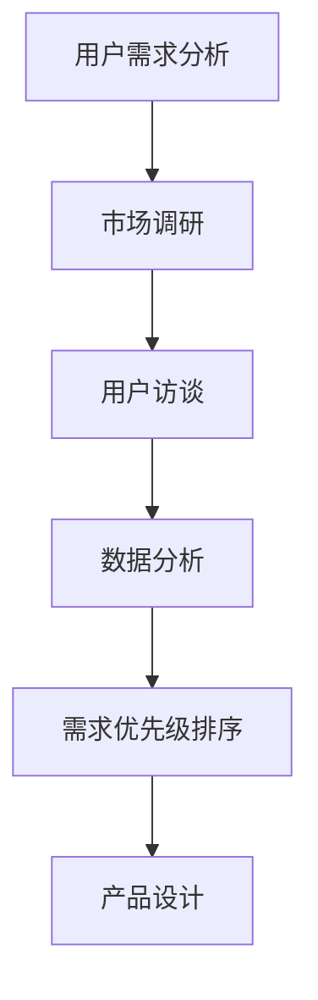
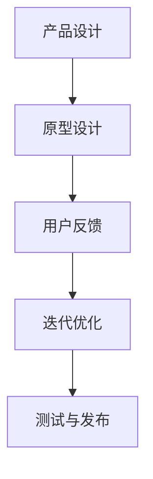
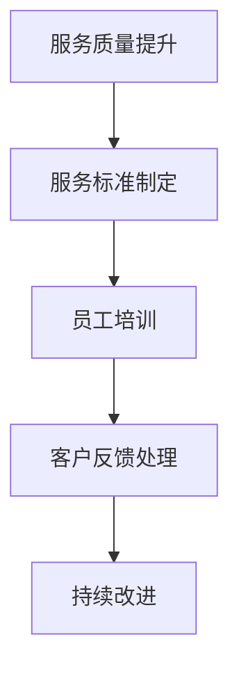
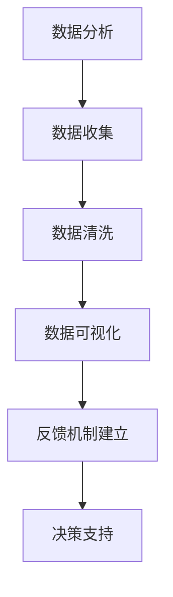
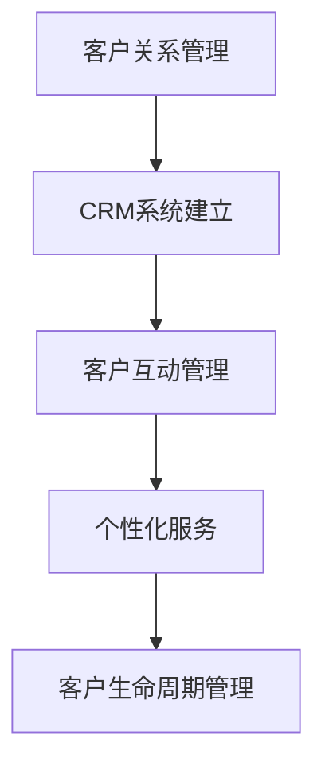
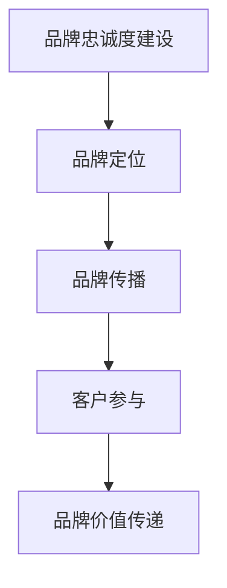

                 

# 创业过程中如何不断提升客户满意度

> 关键词：创业、客户满意度、用户体验、数据分析、运营策略
> 
> 摘要：本文将深入探讨创业过程中如何通过多角度策略不断提升客户满意度。从用户需求分析、产品设计、服务质量到数据分析与反馈机制，通过系统的步骤和方法，帮助创业者构建良好的客户关系，增强品牌忠诚度，实现可持续发展。

## 1. 背景介绍

### 1.1 目的和范围

本文旨在为创业者和初创团队提供一套实用的方法和策略，以不断提升客户满意度为目标，通过系统化的分析和实践，帮助创业项目在竞争激烈的市场中脱颖而出。文章将涵盖以下几个方面：

1. 用户需求分析
2. 产品设计与迭代
3. 服务质量提升
4. 数据分析与反馈机制
5. 客户关系管理
6. 品牌忠诚度建设
7. 创业过程中的实际案例分析

### 1.2 预期读者

本篇文章适用于以下读者群体：

1. 创业初期的创业者
2. 初创团队的成员
3. 产品经理和用户体验设计师
4. 市场营销和运营人员
5. 对客户满意度提升感兴趣的技术从业者

### 1.3 文档结构概述

本文将采用逻辑清晰、结构紧凑的方式，分为以下几个主要部分：

1. 背景介绍：包括目的和范围、预期读者以及文档结构概述。
2. 核心概念与联系：介绍与客户满意度相关的核心概念和原理。
3. 核心算法原理 & 具体操作步骤：详细阐述提升客户满意度的算法和操作步骤。
4. 数学模型和公式 & 详细讲解 & 举例说明：通过数学模型和公式解释客户满意度的关键因素。
5. 项目实战：实际案例分析和代码实现。
6. 实际应用场景：探讨客户满意度提升在不同场景下的应用。
7. 工具和资源推荐：推荐相关学习资源和开发工具。
8. 总结：未来发展趋势与挑战。
9. 附录：常见问题与解答。
10. 扩展阅读 & 参考资料：提供进一步学习的资源。

### 1.4 术语表

#### 1.4.1 核心术语定义

- **客户满意度**：客户对产品或服务满足其需求和期望的程度。
- **用户体验**：用户在使用产品或服务过程中所感受到的整体感受。
- **客户关系管理（CRM）**：通过系统化方法管理和维护与客户的互动，以提升客户满意度和忠诚度。
- **数据分析**：利用统计和数学方法，对大量数据进行处理和分析，以提取有价值的信息。

#### 1.4.2 相关概念解释

- **用户需求**：用户对产品或服务的具体期望和需求。
- **服务质量**：产品或服务在满足用户需求和期望方面的表现。
- **品牌忠诚度**：客户对品牌长期保持信任和偏好的程度。

#### 1.4.3 缩略词列表

- **CRM**：Customer Relationship Management，客户关系管理
- **UX**：User Experience，用户体验
- **UI**：User Interface，用户界面

## 2. 核心概念与联系

在探讨如何提升客户满意度的过程中，我们需要理解以下几个核心概念：

### 2.1 用户需求分析

用户需求分析是提升客户满意度的第一步。理解用户的需求，可以帮助我们设计出更加符合用户期望的产品和服务。



### 2.2 产品设计与迭代

产品设计是满足用户需求的关键。通过迭代过程，不断优化产品，以提升用户体验。



### 2.3 服务质量提升

服务质量直接影响到客户满意度。通过提高服务效率、提升客户服务质量，可以增强客户对品牌的信任和忠诚度。



### 2.4 数据分析与反馈机制

数据分析是了解客户满意度的重要手段。通过收集和分析用户反馈数据，可以及时发现问题和改进机会。



### 2.5 客户关系管理

客户关系管理是提升客户满意度的长期策略。通过建立和维护良好的客户关系，可以提高客户忠诚度和品牌价值。



### 2.6 品牌忠诚度建设

品牌忠诚度是客户满意度的重要指标。通过提供高质量的产品和服务，建立品牌信任，可以培养客户的忠诚度。



通过以上核心概念的介绍，我们可以看到，提升客户满意度是一个系统性工程，需要从多个方面进行综合分析和策略实施。接下来，我们将进一步探讨提升客户满意度的具体算法原理和操作步骤。

## 3. 核心算法原理 & 具体操作步骤

在提升客户满意度的过程中，算法原理和具体操作步骤是关键。以下是一种系统化的提升客户满意度的算法原理，以及具体的操作步骤。

### 3.1 算法原理

提升客户满意度的核心算法可以概括为以下四个步骤：

1. **用户需求分析**：通过市场调研和用户访谈，收集和分析用户需求。
2. **产品设计**：根据用户需求，设计出符合用户期望的产品和服务。
3. **服务质量提升**：通过制定服务标准和员工培训，提高服务质量。
4. **数据分析与反馈**：收集用户反馈数据，进行数据分析和反馈机制建立。

### 3.2 具体操作步骤

#### 3.2.1 用户需求分析

**步骤 1**：市场调研

- **目的**：了解市场趋势和竞争对手情况。
- **方法**：通过文献调研、行业报告和在线调查等方式收集数据。

**步骤 2**：用户访谈

- **目的**：直接了解用户的需求和期望。
- **方法**：通过面对面访谈、在线问卷等方式收集用户反馈。

**步骤 3**：数据分析

- **目的**：提取用户需求的关键点。
- **方法**：使用数据分析工具，如Excel或Python进行数据整理和分析。

**伪代码示例**：

```python
def analyze_user_needs(data):
    # 数据预处理
    cleaned_data = preprocess_data(data)
    # 提取关键需求
    key需求的列表 = extract_key需求的(cleaned_data)
    return key需求的列表
```

#### 3.2.2 产品设计

**步骤 1**：原型设计

- **目的**：创建产品的初步原型。
- **方法**：使用工具如Axure或Figma进行原型设计。

**步骤 2**：用户反馈

- **目的**：获取用户对原型的反馈。
- **方法**：通过用户测试和问卷调查收集反馈。

**步骤 3**：迭代优化

- **目的**：根据用户反馈，优化产品原型。
- **方法**：重复用户测试和原型设计，不断迭代。

**伪代码示例**：

```python
def design_product prototype(用户反馈):
    # 设计原型
    product_prototype = create_prototype(用户反馈)
    # 收集用户反馈
    user_feedback = collect_user_feedback(product_prototype)
    # 优化原型
    optimized_prototype = iterate_prototype(product_prototype, user_feedback)
    return optimized_prototype
```

#### 3.2.3 服务质量提升

**步骤 1**：制定服务标准

- **目的**：明确服务质量的要求。
- **方法**：制定详细的服务标准文档。

**步骤 2**：员工培训

- **目的**：提高员工的服务技能。
- **方法**：组织培训课程，如客户服务培训、沟通技巧培训等。

**步骤 3**：客户反馈处理

- **目的**：及时处理客户的问题和投诉。
- **方法**：建立反馈机制，如在线客服系统、投诉处理流程等。

**伪代码示例**：

```python
def improve_service_quality(service_standard, employees):
    # 制定服务标准
    service_standard = define_service_standard()
    # 培训员工
    employees = train_employees(service_standard)
    # 处理客户反馈
    handle_customer_feedback = create_feedback_handling_process()
    return service_standard, employees, handle_customer_feedback
```

#### 3.2.4 数据分析与反馈

**步骤 1**：数据收集

- **目的**：收集用户行为数据和反馈数据。
- **方法**：使用数据分析工具，如Google Analytics、CRM系统等。

**步骤 2**：数据清洗

- **目的**：确保数据的准确性和一致性。
- **方法**：清洗数据，去除错误和不完整的数据。

**步骤 3**：数据可视化

- **目的**：通过可视化工具，呈现数据分析结果。
- **方法**：使用工具如Tableau、Power BI等进行数据可视化。

**步骤 4**：建立反馈机制

- **目的**：及时反馈分析结果，指导决策。
- **方法**：建立反馈报告和会议机制。

**伪代码示例**：

```python
def data_analysis_and_feedback(data):
    # 数据收集
    collected_data = collect_data()
    # 数据清洗
    cleaned_data = clean_data(collected_data)
    # 数据可视化
    visualization = visualize_data(cleaned_data)
    # 建立反馈机制
    feedback_report = create_feedback_report(visualization)
    return feedback_report
```

通过以上算法原理和具体操作步骤，创业者可以系统地提升客户满意度，从而在激烈的市场竞争中取得优势。在接下来的章节中，我们将进一步探讨如何通过数学模型和公式，深入理解客户满意度的关键因素。

## 4. 数学模型和公式 & 详细讲解 & 举例说明

在提升客户满意度的过程中，数学模型和公式能够帮助我们量化分析客户满意度的关键因素，并提供有效的决策支持。以下是一些常用的数学模型和公式，以及它们的详细讲解和举例说明。

### 4.1 期望效用模型（Expected Utility Model）

期望效用模型用于评估用户对产品或服务的总体满意度。它基于用户的期望和实际体验，计算出一个效用值。

**公式**：

\[ EU = \sum_{i=1}^{n} (p_i \times u_i) \]

其中：
- \( EU \) 表示总体效用值。
- \( p_i \) 表示第 \( i \) 个功能或服务的概率。
- \( u_i \) 表示第 \( i \) 个功能或服务的效用值。

**详细讲解**：

期望效用模型通过计算用户对每个功能或服务的期望效用，再根据其概率加权求和，得到总体效用值。效用值可以通过用户调查或实验数据获得。

**举例说明**：

假设一个用户使用的一款应用有三个主要功能：通讯、社交和娱乐。用户对这些功能的期望效用值分别为 0.8、0.7 和 0.6，使用这些功能的概率分别为 0.3、0.4 和 0.3。根据期望效用模型，总体效用值计算如下：

\[ EU = (0.3 \times 0.8) + (0.4 \times 0.7) + (0.3 \times 0.6) = 0.24 + 0.28 + 0.18 = 0.70 \]

因此，该用户对该应用的总体效用值为 0.70。

### 4.2 客户满意度指数（Customer Satisfaction Index,CSI）

客户满意度指数用于衡量用户对产品或服务的整体满意度。它是一个从 0 到 1 的指标，值越高表示用户越满意。

**公式**：

\[ CSI = \frac{\sum_{i=1}^{n} (s_i \times w_i)}{\sum_{i=1}^{n} w_i} \]

其中：
- \( CSI \) 表示客户满意度指数。
- \( s_i \) 表示第 \( i \) 个指标的用户满意度评分。
- \( w_i \) 表示第 \( i \) 个指标的权重。

**详细讲解**：

客户满意度指数通过计算各个指标的用户满意度评分的加权平均值，得到一个综合的满意度指数。权重可以根据各指标的重要性分配。

**举例说明**：

假设一家餐厅有三个关键指标：食物质量、服务速度和整体环境。用户对这三个指标的满意度评分分别为 0.9、0.8 和 0.7，权重分别为 0.4、0.3 和 0.3。根据客户满意度指数公式，计算如下：

\[ CSI = \frac{(0.9 \times 0.4) + (0.8 \times 0.3) + (0.7 \times 0.3)}{0.4 + 0.3 + 0.3} = \frac{0.36 + 0.24 + 0.21}{0.9} = 0.81 \]

因此，该餐厅的客户满意度指数为 0.81。

### 4.3 顾客保留率（Customer Retention Rate）

顾客保留率用于衡量客户对品牌的忠诚度，表示在一定时间内，保留下来的客户比例。

**公式**：

\[ 保留率 = \frac{期末客户数 - 新增客户数}{期初客户数} \]

**详细讲解**：

顾客保留率通过计算期初客户数与期末客户数之差，再除以期初客户数，得到保留下来的客户比例。这个指标可以反映出品牌的吸引力和客户忠诚度。

**举例说明**：

假设一家电商平台的期初客户数为 1000 人，期末客户数为 1200 人，期间新增客户数为 200 人。根据顾客保留率公式，计算如下：

\[ 保留率 = \frac{1200 - 200}{1000} = \frac{1000}{1000} = 1.0 \]

因此，该电商平台的顾客保留率为 1.0，表示所有客户都保留了下来。

通过以上数学模型和公式的讲解，我们可以更深入地理解客户满意度的关键因素，并通过量化分析来指导创业实践。在接下来的章节中，我们将通过实际案例来进一步探讨如何将理论应用到实际项目中。

### 5. 项目实战：代码实际案例和详细解释说明

为了更好地理解如何提升客户满意度，我们将通过一个实际项目案例来进行详细解释说明。这个案例是一个在线购物平台，我们的目标是设计一个系统，能够通过用户反馈和数据分析来不断提升客户满意度。

#### 5.1 开发环境搭建

在开始项目之前，我们需要搭建一个合适的开发环境。以下是所需的开发工具和软件：

- **编程语言**：Python
- **数据分析工具**：Pandas、NumPy、Scikit-learn
- **前端工具**：HTML、CSS、JavaScript
- **后端框架**：Flask 或 Django
- **数据库**：MySQL 或 PostgreSQL

我们选择 Flask 作为后端框架，因为它的轻量级和易用性非常适合快速开发和迭代。以下是开发环境的搭建步骤：

1. 安装 Python（版本 3.8 或以上）。
2. 安装 Flask：
   ```bash
   pip install Flask
   ```
3. 安装 Pandas、NumPy 和 Scikit-learn：
   ```bash
   pip install pandas numpy scikit-learn
   ```
4. 安装前端工具（可以使用 Visual Studio Code 或其他开发工具）。

#### 5.2 源代码详细实现和代码解读

以下是一个简单的 Flask 应用，用于收集用户反馈并进行分析。代码将分为前端和后端两部分。

##### 前端代码（templates/index.html）

```html
<!DOCTYPE html>
<html>
<head>
    <title>用户反馈系统</title>
    <style>
        body { font-family: Arial, sans-serif; }
        #feedback-form { margin: 20px; }
    </style>
</head>
<body>
    <h1>用户反馈系统</h1>
    <form id="feedback-form">
        <label for="rating">满意度评分：</label>
        <select id="rating">
            <option value="1">非常不满意</option>
            <option value="2">不满意</option>
            <option value="3">一般</option>
            <option value="4">满意</option>
            <option value="5">非常满意</option>
        </select><br><br>
        <label for="comment">评论：</label>
        <textarea id="comment" rows="4" cols="50"></textarea><br><br>
        <input type="button" value="提交" onclick="submitFeedback()">
    </form>
    <script>
        function submitFeedback() {
            const rating = document.getElementById('rating').value;
            const comment = document.getElementById('comment').value;
            fetch('/submit_feedback', {
                method: 'POST',
                headers: {
                    'Content-Type': 'application/json'
                },
                body: JSON.stringify({ rating: rating, comment: comment })
            });
        }
    </script>
</body>
</html>
```

##### 后端代码（app.py）

```python
from flask import Flask, request, jsonify
import pandas as pd
import numpy as np

app = Flask(__name__)

# 假设已存储的反馈数据
feedback_data = pd.DataFrame(columns=['rating', 'comment'])

@app.route('/')
def index():
    return app.send_static_file('index.html')

@app.route('/submit_feedback', methods=['POST'])
def submit_feedback():
    data = request.json
    feedback_data = feedback_data.append(data, ignore_index=True)
    feedback_data.to_csv('feedback_data.csv', index=False)
    return jsonify({'status': 'success'})

@app.route('/get_feedback_summary')
def get_feedback_summary():
    global feedback_data
    ratings = feedback_data['rating'].value_counts()
    average_rating = np.mean(feedback_data['rating'])
    return jsonify({'ratings': ratings, 'average_rating': average_rating})

if __name__ == '__main__':
    app.run(debug=True)
```

##### 代码解读与分析

1. **前端代码解读**：
   - HTML 表单用于收集用户的满意度评分和评论。
   - JavaScript 脚本用于处理表单提交，并通过 Fetch API 向后端发送 POST 请求。

2. **后端代码解读**：
   - Flask 应用用于处理前端请求。
   - `submit_feedback` 函数接收前端发送的用户反馈数据，并将其存储在本地文件中。
   - `get_feedback_summary` 函数用于计算和返回用户的满意度评分摘要。

通过这个简单的项目，我们可以看到如何通过用户反馈数据分析和处理来提升客户满意度。以下是一个具体的操作流程：

1. 用户访问网站并填写满意度评分和评论。
2. 前端代码将用户的反馈数据发送到后端。
3. 后端代码将反馈数据存储在本地文件中，并计算满意度评分摘要。
4. 后端将满意度评分摘要返回给前端，供用户查看。

#### 5.3 代码解读与分析（续）

除了基本的用户反馈收集和分析功能，我们还可以进一步扩展系统，以提高客户满意度：

1. **个性化推荐**：
   - 根据用户的反馈和历史购买记录，推荐符合用户口味的产品。

2. **实时反馈**：
   - 实时更新用户的满意度评分和评论，以便快速响应和改进。

3. **客户关系管理**：
   - 通过 CRM 系统跟踪用户的购买历史和反馈记录，提供个性化服务和优惠。

4. **自动化通知**：
   - 当用户满意度下降时，自动发送通知给客服团队，以便及时处理。

通过这些扩展功能，我们可以更全面地提升客户满意度，并建立长期的品牌忠诚度。

总之，通过实际项目案例，我们展示了如何利用用户反馈数据来提升客户满意度。前端代码负责用户交互和数据收集，后端代码负责数据存储和分析。这个系统可以作为一个基础框架，根据具体业务需求进行扩展和优化。

接下来，我们将探讨在提升客户满意度的过程中，如何利用不同的工具和资源来支持我们的工作。

### 6. 实际应用场景

在提升客户满意度的过程中，不同的应用场景需要采取不同的策略和措施。以下是一些常见的实际应用场景，以及相应的解决方案和案例分析。

#### 6.1 在线购物平台

**场景描述**：在线购物平台需要确保用户能够快速、便捷地找到所需产品，并提供高质量的服务。

**解决方案**：
- **个性化推荐**：基于用户的购买历史和浏览行为，提供个性化推荐，提高用户购买意愿。
- **智能客服**：通过聊天机器人或智能客服系统，提供即时响应和问题解决，提高用户满意度。
- **订单跟踪**：提供实时订单状态更新，让用户随时了解订单进度。

**案例分析**：亚马逊（Amazon）通过其先进的推荐系统和智能客服，成功地提升了用户购物体验和满意度。亚马逊的推荐系统根据用户的行为数据和购买记录，精准地推荐相关商品，从而提高了转化率。同时，其智能客服系统能够在短时间内解答用户的问题，减少了用户等待时间。

#### 6.2 服务业

**场景描述**：服务业，如酒店、餐饮和医疗服务，需要提供高质量的服务，以赢得客户的信任和忠诚。

**解决方案**：
- **客户服务培训**：定期对员工进行客户服务培训，提高员工的服务技能和沟通能力。
- **在线评价系统**：建立在线评价系统，让用户对服务进行评价，从而收集用户反馈。
- **客户关怀计划**：通过定期的客户关怀活动，如节假日问候或会员优惠，增强客户忠诚度。

**案例分析**：丽思卡尔顿（Ritz-Carlton）以其卓越的客户服务而闻名。丽思卡尔顿通过客户服务培训，确保员工能够提供专业、温馨的服务。同时，其在线评价系统收集用户反馈，帮助管理层了解服务质量和客户需求，从而不断改进。此外，丽思卡尔顿还定期推出客户关怀计划，如会员积分和专属优惠，增强了客户忠诚度。

#### 6.3 金融机构

**场景描述**：金融机构需要提供安全、高效的金融服务，同时确保客户的隐私和资金安全。

**解决方案**：
- **安全措施**：采用先进的技术和安全措施，如多因素认证和加密技术，确保客户信息和资金的安全。
- **用户体验优化**：优化在线银行和移动银行应用，提供简洁、直观的用户界面和流畅的操作体验。
- **客户服务渠道**：提供多渠道的客户服务，如电话、邮件和在线聊天，方便客户随时获得帮助。

**案例分析**：星展银行（DBS Bank）在提升客户满意度方面表现出色。星展银行采用先进的安全技术，如多因素认证和实时监控，确保客户信息和资金的安全。同时，其在线银行和移动银行应用提供简洁、直观的用户界面，方便用户快速完成操作。此外，星展银行提供多渠道的客户服务，如电话、邮件和在线聊天，让客户能够随时获得帮助。

通过以上实际应用场景的案例分析，我们可以看到，在提升客户满意度的过程中，不同行业需要采取不同的策略和措施。关键在于深入了解客户需求，提供高质量的服务，并不断优化用户体验。通过这些方法，企业可以赢得客户的信任和忠诚，从而在竞争激烈的市场中脱颖而出。

### 7. 工具和资源推荐

在提升客户满意度的过程中，选择合适的工具和资源可以大大提高工作效率和效果。以下是一些推荐的学习资源、开发工具和框架，以及相关的经典论文和最新研究成果。

#### 7.1 学习资源推荐

##### 7.1.1 书籍推荐

1. **《用户体验要素》** - 作者：Jesse James Garrett
   - 介绍了用户体验设计的五个层次，提供了实用的设计方法和工具。

2. **《精益创业》** - 作者：Eric Ries
   - 提出了精益创业的方法论，帮助创业者快速验证和优化产品。

3. **《客户为中心的产品管理》** - 作者：Jeanne Bliss
   - 详细阐述了如何建立以客户为中心的产品管理策略，提高客户满意度。

##### 7.1.2 在线课程

1. **Coursera 上的《用户体验设计》** - 提供了关于用户体验设计的系统课程，涵盖从用户研究到原型设计等各个方面。

2. **Udemy 上的《客户关系管理》** - 介绍了客户关系管理的最佳实践，包括客户满意度分析、客户细分等。

3. **edX 上的《数据分析》** - 提供了数据分析的基础知识，包括统计学、数据清洗、数据可视化等。

##### 7.1.3 技术博客和网站

1. **Medium 上的《Customer Happiness》** - 分享了关于客户满意度的实践经验和研究成果，适合创业者和技术人员阅读。

2. **UX Planet** - 提供了丰富的用户体验设计资源和教程，包括设计原则、工具使用等。

3. **User Insights** - 分享了关于用户研究和用户体验设计的最新趋势和案例分析。

#### 7.2 开发工具框架推荐

##### 7.2.1 IDE和编辑器

1. **Visual Studio Code** - 免费且功能强大的代码编辑器，支持多种编程语言和插件。

2. **IntelliJ IDEA** - 适合Java开发者的IDE，提供强大的代码编辑、调试和优化功能。

3. **PyCharm** - 适用于Python开发的IDE，支持多种框架和工具，适合数据分析和机器学习项目。

##### 7.2.2 调试和性能分析工具

1. **Chrome DevTools** - 适用于Web开发的调试工具，提供了丰富的性能分析功能。

2. **JProfiler** - 适用于Java应用程序的性能分析工具，可以快速定位性能瓶颈。

3. **New Relic** - 提供了全面的性能监控和错误追踪功能，适用于各种规模的应用程序。

##### 7.2.3 相关框架和库

1. **React** - 适用于构建用户界面的JavaScript库，提供了丰富的组件和工具。

2. **Vue.js** - 轻量级的JavaScript框架，易于上手，适用于构建动态用户界面。

3. **TensorFlow** - 适用于机器学习和深度学习的开源框架，提供了丰富的工具和库。

#### 7.3 相关论文著作推荐

##### 7.3.1 经典论文

1. **"A Model of Customer Loyalty"** - 作者：Philip Kotler 和 John Philip
   - 详细阐述了客户忠诚度的概念和影响因素。

2. **"The Customer Experience"** - 作者：Bernd Schmitt
   - 介绍了客户体验的概念和设计方法，对提升客户满意度有重要指导意义。

3. **"Customer Satisfaction: A Meta-Analytic Review and Explanations of Variability"** - 作者：Jerry Wind 和 Philip Sheth
   - 对客户满意度进行了系统的研究，提供了丰富的理论和实证分析。

##### 7.3.2 最新研究成果

1. **"AI and Customer Experience: The Future of Personalization"** - 作者：Kamal Anand 和 Lior Arussy
   - 探讨了人工智能技术在提升客户体验和满意度方面的应用。

2. **"The Power of Moments: Why Certain Experiences Have Extraordinary Impact"** - 作者：Chip Heath 和 Dan Heath
   - 研究了如何在客户体验中创造“关键时刻”，提升客户满意度。

3. **"Customer-Centricity: The Path to Profitability and Sustainability"** - 作者：Manu S. Raju 和 Sumantra Ghoshal
   - 提出了以客户为中心的战略框架，帮助企业在竞争中获得优势。

通过以上工具和资源的推荐，创业者和技术人员可以更好地理解和应用提升客户满意度的策略和方法，从而在激烈的市场竞争中脱颖而出。

### 8. 总结：未来发展趋势与挑战

在快速变化的市场环境中，提升客户满意度不仅是企业生存的关键，更是企业实现长期发展的基础。未来，随着技术的不断进步和消费者需求的不断升级，客户满意度的提升将面临一系列新的发展趋势和挑战。

#### 发展趋势

1. **个性化体验的深化**：随着大数据和人工智能技术的发展，企业将能够更精准地了解客户需求，提供个性化的产品和服务，从而提升客户满意度。

2. **实时反馈与即时响应**：实时获取用户反馈，并通过即时响应机制进行问题解决，将大大提升用户体验。这一趋势将推动实时数据分析技术的应用，使得客户满意度的提升更加迅速和有效。

3. **客户参与度的提升**：企业将更加注重客户的参与和互动，通过客户参与设计、测试和改进产品和服务，增强客户对品牌的认同感和忠诚度。

4. **可持续发展的理念**：企业将更加注重可持续发展，通过绿色生产和环保措施，提高品牌的社会责任形象，从而赢得更多客户的认可和支持。

#### 挑战

1. **数据隐私与安全**：在收集和分析客户数据的过程中，如何保障客户隐私和数据安全，将成为一大挑战。企业需要采取严格的数据保护措施，以赢得客户的信任。

2. **技术更新的压力**：技术的快速更新和迭代将要求企业不断学习和适应新技术，以提供更加先进和高效的产品和服务。这对企业的技术能力和创新能力提出了更高的要求。

3. **全球化的竞争**：全球化带来了更广阔的市场机会，但同时也带来了更激烈的竞争。企业需要在全球范围内制定和实施有效的客户满意度提升策略，以应对国际市场的竞争压力。

4. **文化差异的适应**：不同国家和地区有不同的文化背景和消费习惯，企业需要深入了解目标市场的文化特点，提供符合当地需求的产品和服务，以提升客户满意度。

#### 策略建议

1. **持续的用户调研**：定期进行用户调研，深入了解用户需求和行为，为产品和服务优化提供依据。

2. **数据驱动的决策**：充分利用大数据和人工智能技术，进行数据分析和预测，以数据驱动决策，提升用户体验。

3. **多渠道的互动**：通过社交媒体、客户关系管理（CRM）系统等多种渠道，与客户保持密切互动，及时获取反馈，快速响应客户需求。

4. **文化适应性策略**：在全球化市场运作中，注重文化差异，制定适应不同市场的策略，提供本土化的产品和服务。

5. **社会责任的履行**：积极履行社会责任，通过环保、慈善等举措，提升品牌形象，赢得客户和社会的认可。

总之，未来提升客户满意度将面临更多的挑战，但也充满机遇。企业需要不断适应市场变化，通过创新和优化，持续提升客户满意度，从而实现长期发展。

### 9. 附录：常见问题与解答

**Q1：如何有效进行用户调研？**

**A1：**用户调研是了解用户需求和行为的重要手段。以下是一些有效的方法：

- **问卷调查**：设计针对性强的问卷，通过在线平台或电话访谈等方式收集用户反馈。
- **深度访谈**：与用户进行一对一的深入交流，了解用户的具体需求和体验。
- **用户行为分析**：通过数据分析工具，分析用户的访问行为、点击行为等，获取用户偏好信息。
- **焦点小组**：邀请具有代表性的用户参与讨论，收集多角度的意见和建议。

**Q2：数据分析在提升客户满意度中的作用是什么？**

**A2：**数据分析在提升客户满意度中起着关键作用，主要体现在以下几个方面：

- **需求分析**：通过分析用户行为数据和反馈，了解用户需求，为产品优化提供依据。
- **趋势预测**：通过数据趋势分析，预测未来用户需求和市场动向，提前布局。
- **问题识别**：通过数据异常检测，及时发现产品和服务中存在的问题，及时解决。
- **决策支持**：提供基于数据的决策支持，帮助管理层制定更加科学和有效的策略。

**Q3：如何建立有效的反馈机制？**

**A3：**建立有效的反馈机制需要以下步骤：

- **明确反馈渠道**：提供多种反馈渠道，如在线客服、电话热线、社交媒体等，方便用户反馈问题。
- **快速响应**：建立快速响应机制，确保用户反馈能够在短时间内得到处理和回复。
- **数据分析**：对用户反馈进行系统化分析，识别常见问题和用户痛点。
- **持续改进**：根据用户反馈，持续优化产品和服务，不断提升用户体验。

**Q4：如何提高客户忠诚度？**

**A4：**提高客户忠诚度可以通过以下策略：

- **提供高质量的产品和服务**：确保产品和服务的质量，满足用户需求，建立信任。
- **个性化体验**：根据用户行为和偏好，提供个性化的产品推荐和服务。
- **客户关怀计划**：定期进行客户关怀，如节日问候、会员优惠等，增强客户认同感。
- **忠诚度奖励**：通过积分、优惠券、礼品等手段，激励客户持续消费。

### 10. 扩展阅读 & 参考资料

**扩展阅读：**

1. **《精益创业》** - 作者：Eric Ries
   - 详细介绍了精益创业的方法论，包括用户调研、最小可行产品（MVP）和快速迭代等，对提升客户满意度有重要启示。

2. **《用户体验要素》** - 作者：Jesse James Garrett
   - 探讨了用户体验设计的五个层次，提供了实用的设计方法和工具，有助于提升客户满意度。

3. **《客户为中心的产品管理》** - 作者：Jeanne Bliss
   - 介绍了客户为中心的产品管理策略，包括用户调研、需求分析和客户体验设计等，对提升客户满意度有重要指导意义。

**参考资料：**

1. **Kotler, P., & Philip, J. (1993). A model of customer loyalty. Journal of Marketing, 57(1), 48-68.**
   - 提出了客户忠诚度的概念和影响因素，对理解客户满意度有重要参考价值。

2. **Schmitt, B. (1999). The marketing concept: A century of evolution. Journal of Marketing, 63(1), 3-12.**
   - 介绍了市场营销概念的历史发展和演变，对现代市场营销理论有重要影响。

3. **Wind, J., & Sheth, J. (1996). Customer satisfaction: A meta-analytic review and explanations of variability. Journal of Consumer Research, 23(2), 148-165.**
   - 对客户满意度的系统研究，提供了丰富的理论和实证分析。

4. **Anand, K., & Arussy, L. (2018). AI and customer experience: The future of personalization. MIT Sloan Management Review, 60(1), 46-53.**
   - 探讨了人工智能技术在提升客户体验和满意度方面的应用，对未来的发展方向有重要启示。

5. **Heath, C., & Heath, D. (2017). The power of moments: Why certain experiences have extraordinary impact. Crown Business.**
   - 研究了如何在客户体验中创造“关键时刻”，提升客户满意度。

6. **Raju, M. S., & Ghoshal, S. (2016). Customer-centricity: The path to profitability and sustainability. Palgrave Macmillan.**
   - 提出了以客户为中心的战略框架，帮助企业在竞争中获得优势。

