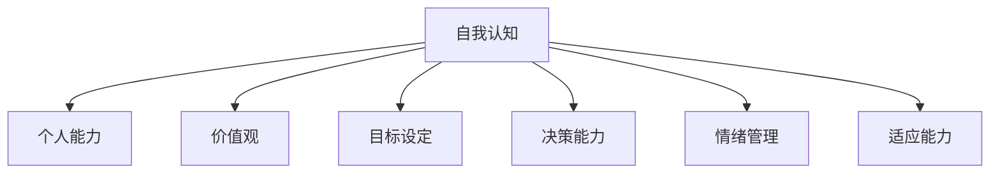
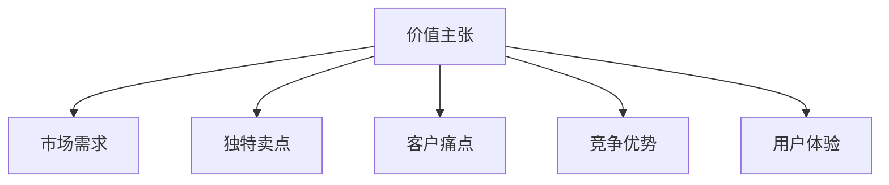

                 

### {文章标题}

> **关键词**：创业，自我认知，价值主张，能力提升，策略，执行力

> **摘要**：本文深入探讨创业者在创业过程中如何通过策略与执行力不断提升自我认知和价值主张能力。我们将分析创业中的核心挑战，探讨如何通过自我反思、市场研究和持续学习来增强这些关键能力，并提供实战案例和实用工具，以帮助创业者实现个人和企业的成功。

### 目录

1. **背景介绍**
   1.1 目的和范围
   1.2 预期读者
   1.3 文档结构概述
   1.4 术语表
   - 1.4.1 核心术语定义
   - 1.4.2 相关概念解释
   - 1.4.3 缩略词列表

2. **核心概念与联系**
   - Mermaid流程图

3. **核心算法原理 & 具体操作步骤**
   - 伪代码讲解

4. **数学模型和公式 & 详细讲解 & 举例说明**
   - LaTeX格式数学公式

5. **项目实战：代码实际案例和详细解释说明**
   5.1 开发环境搭建
   5.2 源代码详细实现和代码解读
   5.3 代码解读与分析

6. **实际应用场景**

7. **工具和资源推荐**
   7.1 学习资源推荐
   7.2 开发工具框架推荐
   7.3 相关论文著作推荐

8. **总结：未来发展趋势与挑战**

9. **附录：常见问题与解答**

10. **扩展阅读 & 参考资料**

### 1. 背景介绍

#### 1.1 目的和范围

本文旨在为创业者提供系统化的策略和方法，以提升自我认知和价值主张能力。我们将探讨在创业过程中遇到的核心挑战，并分析如何通过策略和执行力来克服这些挑战，最终实现个人和企业的成长。

文章的范围包括但不限于以下内容：

- 创业者自我认知的重要性及其在创业中的应用。
- 如何构建和传播有效的价值主张。
- 通过自我反思和持续学习来提升能力。
- 实际案例解析和工具推荐。

#### 1.2 预期读者

本文适合以下读者群体：

- 初创公司创始人或即将创业的人士。
- 创业团队的成员，尤其是负责产品开发和市场策略的成员。
- 对创业过程和自我提升感兴趣的普通读者。

#### 1.3 文档结构概述

本文结构清晰，旨在帮助读者逐步理解和应用提升自我认知和价值主张的策略。主要分为以下几个部分：

- **背景介绍**：介绍文章的目的、范围和预期读者。
- **核心概念与联系**：定义和解释关键概念，并提供Mermaid流程图辅助理解。
- **核心算法原理 & 具体操作步骤**：详细阐述提升自我认知和价值主张的方法。
- **数学模型和公式 & 详细讲解 & 举例说明**：通过公式和案例，深入解析策略的实际应用。
- **项目实战**：提供实际代码案例，展示如何将理论应用到实践中。
- **实际应用场景**：讨论这些策略在不同情境下的应用。
- **工具和资源推荐**：推荐相关的学习资源、开发工具和论文。
- **总结**：总结全文，展望未来趋势与挑战。
- **附录**：提供常见问题解答和扩展阅读资源。

#### 1.4 术语表

- **自我认知**：个人对自己思想、情感、行为和价值观的认识和理解。
- **价值主张**：产品或服务为顾客带来的独特价值和利益。
- **创业**：创立新企业或开展新业务的过程。

以下为相关概念的解释和缩略词列表：

- **相关概念解释**：
  - **市场调研**：收集和分析潜在客户需求、竞争对手信息等。
  - **持续学习**：不断更新知识和技能，以适应快速变化的市场。

- **缩略词列表**：
  - **AI**：人工智能
  - **IoT**：物联网
  - **SaaS**：软件即服务

### 2. 核心概念与联系

#### 2.1 自我认知

自我认知是创业成功的关键因素之一。它涉及对个人能力、价值观和目标的深入理解。以下是一个简单的Mermaid流程图，展示了自我认知的核心节点和关系：



在这个流程图中，自我认知是核心，它通过个人能力、价值观、目标设定、决策能力、情绪管理和适应能力等多个节点与创业活动相连接。这些节点共同构成了创业者对自我的全面认知，为创业决策提供了坚实的基础。

#### 2.2 价值主张

价值主张是产品或服务的核心，它定义了产品为何而存在，为顾客提供了什么独特的价值。以下是价值主张的核心概念及其在创业中的作用的Mermaid流程图：



在这个流程图中，价值主张通过市场需求、独特卖点、客户痛点、竞争优势和用户体验等多个节点与创业活动相连接。创业者需要通过这些节点来构建一个能够满足市场需求、解决客户痛点、具有竞争优势并能提供优秀用户体验的价值主张。

#### 2.3 核心算法原理

提升自我认知和价值主张的核心算法原理涉及以下几个步骤：

1. **自我反思**：定期进行自我反思，评估个人能力、价值观和目标。

2. **市场调研**：收集和分析市场数据，了解市场需求和客户痛点。

3. **目标设定**：根据自我反思和市场调研结果，设定清晰、可衡量的目标。

4. **持续学习**：不断更新知识和技能，提升个人能力和适应能力。

5. **构建价值主张**：基于目标和市场调研，构建能够解决客户痛点、具有竞争优势的价值主张。

以下是一个简化的伪代码，展示了这些步骤：

```python
# 自我反思
def self_reflection():
    assess_capabilities()
    evaluate_values()
    set_goals()

# 市场调研
def market_research():
    collect_market_data()
    analyze_customer_needs()

# 目标设定
def set_goals():
    goals = set_clear_and_measurable_goals()

# 持续学习
def continuous_learning():
    update_knowledge()
    enhance_skills()

# 构建价值主张
def build_value_proposition():
    customer_pain_points = analyze_customer_pain_points()
    competitive_advantages = identify_competitive_advantages()
    value_proposition = create_value_proposition(customer_pain_points, competitive_advantages)

# 主函数
def main():
    self_reflection()
    market_research()
    set_goals()
    continuous_learning()
    value_proposition = build_value_proposition()
    implement_value_proposition()

main()
```

通过这个伪代码，我们可以看到提升自我认知和价值主张的核心算法是如何通过一系列步骤实现的。

### 3. 核心算法原理 & 具体操作步骤

#### 3.1 自我反思

自我反思是提升自我认知的第一步。它涉及对个人能力、价值观和目标的深入思考。以下是具体操作步骤：

1. **列出个人能力**：回顾自己在专业技能、管理能力、沟通技巧等方面的表现，列出自己的强项和弱项。

2. **评估价值观**：思考自己的核心价值观，包括诚信、责任感、创新精神等，并评估这些价值观是否在创业过程中得到了体现。

3. **设定目标**：根据个人能力和价值观，设定短期和长期目标。这些目标应该是清晰、具体、可衡量的。

4. **记录反思过程**：将自我反思的过程记录下来，这有助于后续的回顾和调整。

以下是具体的操作步骤和伪代码：

```python
# 步骤1：列出个人能力
def list_capabilities():
    capabilities = ["编程能力", "项目管理经验", "市场分析能力", "沟通技巧"]
    print("个人能力：", capabilities)

# 步骤2：评估价值观
def evaluate_values():
    values = ["诚信", "责任感", "创新精神"]
    print("核心价值观：", values)

# 步骤3：设定目标
def set_goals():
    short_term_goals = ["开发一款市场调研工具", "增加100个新用户"]
    long_term_goals = ["实现盈利", "成为行业领导者"]
    print("短期目标：", short_term_goals)
    print("长期目标：", long_term_goals)

# 步骤4：记录反思过程
def record_reflection():
    reflection_log = "自我反思记录：\n- 个人能力：\n- 核心价值观：\n- 短期目标：\n- 长期目标："
    print(reflection_log)

# 主函数
def main():
    list_capabilities()
    evaluate_values()
    set_goals()
    record_reflection()

main()
```

通过以上步骤和伪代码，创业者可以系统地提升自我认知，为后续的创业活动打下坚实的基础。

#### 3.2 市场调研

市场调研是构建价值主张的重要环节。以下是具体操作步骤：

1. **确定调研目标**：明确调研的目的是了解市场需求、客户行为和竞争态势。

2. **设计调研问卷**：根据调研目标，设计详细的问卷，涵盖市场需求、客户痛点、竞争对手信息等方面。

3. **收集数据**：通过线上问卷、访谈、市场调查等方式收集数据。

4. **数据分析**：对收集到的数据进行分析，识别市场需求和客户痛点。

5. **撰写调研报告**：将分析结果整理成调研报告，为后续的价值主张构建提供依据。

以下是具体的操作步骤和伪代码：

```python
# 步骤1：确定调研目标
def define_research_objectives():
    objectives = ["了解市场需求", "识别客户痛点", "分析竞争对手"]
    print("调研目标：", objectives)

# 步骤2：设计调研问卷
def design_survey():
    survey_questions = [
        "您最关心的市场需求是什么？",
        "您在产品使用中遇到了哪些痛点？",
        "您认为哪些竞争对手具有优势？"
    ]
    print("调研问卷：", survey_questions)

# 步骤3：收集数据
def collect_data():
    collected_data = ["市场调研问卷结果", "访谈记录", "竞争对手分析报告"]
    print("收集到的数据：", collected_data)

# 步骤4：数据分析
def analyze_data():
    analyzed_data = "通过数据分析，我们识别了以下市场需求和客户痛点：\n- 市场需求：\n- 客户痛点："
    print(analyzed_data)

# 步骤5：撰写调研报告
def write_report():
    report = "市场调研报告：\n- 调研目标：\n- 调研问卷：\n- 收集到的数据：\n- 数据分析结果："
    print(report)

# 主函数
def main():
    define_research_objectives()
    design_survey()
    collect_data()
    analyze_data()
    write_report()

main()
```

通过以上步骤和伪代码，创业者可以系统地完成市场调研，为构建价值主张提供可靠的数据支持。

#### 3.3 目标设定

目标设定是创业过程中的关键步骤，它需要明确、可衡量、可实现、相关性强且有时间限制。以下是具体操作步骤：

1. **明确目标**：根据市场调研结果和自我反思，明确创业的目标。

2. **分解目标**：将大目标分解为若干个小目标，确保每个小目标都是具体、可衡量的。

3. **制定行动计划**：为每个小目标制定详细的行动计划，明确责任人、时间节点和预期成果。

4. **定期回顾**：定期回顾目标完成情况，根据实际情况进行调整。

以下是具体的操作步骤和伪代码：

```python
# 步骤1：明确目标
def define_goals():
    overall_goal = "在一年内实现产品市场占有率达到5%"
    print("整体目标：", overall_goal)

# 步骤2：分解目标
def decompose_goals():
    sub_goals = [
        "完成市场调研并撰写报告",
        "开发出满足市场需求的产品原型",
        "获得首批100个付费用户"
    ]
    print("分解目标：", sub_goals)

# 步骤3：制定行动计划
def create_action_plans():
    action_plans = [
        "完成市场调研报告：负责人-张三，时间节点-本周五",
        "开发产品原型：负责人-李四，时间节点-下周一",
        "推广并获取用户：负责人-王五，时间节点-下下周三"
    ]
    print("行动计划：", action_plans)

# 步骤4：定期回顾
def review_goals():
    print("目标回顾：")
    for sub_goal in sub_goals:
        print("- ", sub_goal)

# 主函数
def main():
    define_goals()
    decompose_goals()
    create_action_plans()
    review_goals()

main()
```

通过以上步骤和伪代码，创业者可以系统地设定目标，并确保目标的有效实施。

#### 3.4 持续学习

持续学习是提升个人能力和适应市场变化的关键。以下是具体操作步骤：

1. **确定学习目标**：根据个人目标和市场需求，确定需要学习的新知识和技能。

2. **选择学习资源**：选择适合的学习资源，包括书籍、在线课程、行业会议等。

3. **制定学习计划**：根据学习目标和学习资源，制定详细的学习计划，包括学习时间、学习内容和学习方法。

4. **执行学习计划**：按照学习计划进行学习，确保学习进度。

5. **评估学习效果**：定期评估学习效果，根据评估结果调整学习计划。

以下是具体的操作步骤和伪代码：

```python
# 步骤1：确定学习目标
def define_learning_goals():
    learning_goals = ["学习最新市场分析工具的使用", "掌握Python编程的进阶技巧"]
    print("学习目标：", learning_goals)

# 步骤2：选择学习资源
def choose_learning_resources():
    resources = ["《市场分析新工具》", "Python编程进阶课程"]
    print("学习资源：", resources)

# 步骤3：制定学习计划
def create_learning_plan():
    learning_plan = [
        "学习市场分析工具：每天学习1小时，共5天",
        "掌握Python编程进阶技巧：每周学习2小时，共4周"
    ]
    print("学习计划：", learning_plan)

# 步骤4：执行学习计划
def execute_learning_plan():
    print("执行学习计划：")
    for plan in learning_plan:
        print("- ", plan)

# 步骤5：评估学习效果
def evaluate_learning效果的：
    print("学习效果评估：")
    for goal in learning_goals:
        print("- ", goal, "已掌握？")

# 主函数
def main():
    define_learning_goals()
    choose_learning_resources()
    create_learning_plan()
    execute_learning_plan()
    evaluate_learning效果的()

main()
```

通过以上步骤和伪代码，创业者可以系统地持续学习，不断提升个人能力和适应市场变化。

#### 3.5 构建价值主张

构建价值主张是创业者的重要任务，它需要基于市场需求、客户痛点和竞争优势来确定。以下是具体操作步骤：

1. **分析市场需求**：通过市场调研，了解客户的需求和痛点。

2. **确定独特卖点**：根据市场需求，确定产品的独特卖点，使其在竞争中脱颖而出。

3. **评估竞争优势**：分析自身的竞争优势，确保价值主张具有竞争力。

4. **编写价值主张文档**：将分析结果整理成文档，清晰地表达产品的价值主张。

5. **测试和调整**：通过用户测试和市场反馈，不断调整和完善价值主张。

以下是具体的操作步骤和伪代码：

```python
# 步骤1：分析市场需求
def analyze_market_demand():
    demand = "客户对市场分析工具的需求主要集中在快速、准确和易于使用上。"
    print("市场需求：", demand)

# 步骤2：确定独特卖点
def determine_unique_selling_points():
    usp = "我们的市场分析工具具有以下独特卖点：\n- 快速处理大量数据\n- 精准的预测结果\n- 界面友好，易于操作"
    print("独特卖点：", usp)

# 步骤3：评估竞争优势
def evaluate_competitive_advantages():
    advantages = "我们的竞争优势在于：\n- 独有的算法模型\n- 长期的市场数据积累\n- 专业的团队支持"
    print("竞争优势：", advantages)

# 步骤4：编写价值主张文档
def write_value_proposition_document():
    document = "价值主张文档：\n- 市场需求：\n- 独特卖点：\n- 竞争优势："
    print(document)

# 步骤5：测试和调整
def test_and_adjust_value_proposition():
    print("测试和调整价值主张：")
    feedback = "用户反馈：\n- 希望增加数据可视化功能\n- 提高用户互动体验"
    print(feedback)
    adjusted_document = "调整后的价值主张文档：\n- 独特卖点：\n- 新增功能：数据可视化\n- 提高用户互动体验"
    print(adjusted_document)

# 主函数
def main():
    analyze_market_demand()
    determine_unique_selling_points()
    evaluate_competitive_advantages()
    write_value_proposition_document()
    test_and_adjust_value_proposition()

main()
```

通过以上步骤和伪代码，创业者可以系统地构建价值主张，确保产品或服务能够满足市场需求，并在竞争中脱颖而出。

### 4. 数学模型和公式 & 详细讲解 & 举例说明

在创业过程中，数学模型和公式可以帮助创业者更好地理解和评估业务状况，从而做出更明智的决策。以下是几个常用的数学模型和公式，以及它们的详细讲解和举例说明。

#### 4.1 成本效益分析（Cost-Benefit Analysis）

成本效益分析是一种评估项目或决策是否值得投资的方法，它通过比较项目带来的总收益和总成本来确定。公式如下：

$$
C_B = \frac{B}{C}
$$

其中，\( C_B \) 是成本效益比率，\( B \) 是总收益，\( C \) 是总成本。

**详细讲解**：

- **总收益**（\( B \)）：包括销售收益、投资回报等。
- **总成本**（\( C \)）：包括生产成本、营销费用、人力成本等。

**举例说明**：

假设一家初创公司开发了一款新软件，预计销售收入为100万元，总成本为60万元，那么其成本效益比率为：

$$
C_B = \frac{100}{60} \approx 1.67
$$

成本效益比率大于1，意味着该项目是盈利的。

#### 4.2 贝尔曼方程（Bellman Equation）

在动态规划中，贝尔曼方程用于求解最优化问题。对于给定状态 \( s \) 和动作 \( a \)，贝尔曼方程如下：

$$
V(s) = \max_a [r(s, a) + \gamma V(s')]
$$

其中，\( V(s) \) 是状态 \( s \) 的价值函数，\( r(s, a) \) 是在状态 \( s \) 下执行动作 \( a \) 后获得的即时回报，\( \gamma \) 是折扣因子，\( s' \) 是执行动作 \( a \) 后的新状态。

**详细讲解**：

- **价值函数**（\( V(s) \)）：表示在状态 \( s \) 下采取最优策略后的期望收益。
- **即时回报**（\( r(s, a) \)）：表示在状态 \( s \) 下执行动作 \( a \) 后立即获得的收益。
- **折扣因子**（\( \gamma \)）：用于平衡即时回报和长期收益，\( \gamma \) 的取值范围在 [0, 1] 之间。

**举例说明**：

假设在一个简单的决策过程中，有三种动作：购买广告、增加研发投入和维持现状。状态为当前的市场份额。使用贝尔曼方程可以计算出在不同状态下采取不同动作的最优策略。

#### 4.3 泰勒展开（Taylor Expansion）

泰勒展开是一种用于逼近函数的方法，将复杂函数在某个点附近展开成多项式。对于函数 \( f(x) \)，泰勒展开公式如下：

$$
f(x) = f(a) + f'(a)(x-a) + \frac{f''(a)}{2!}(x-a)^2 + \cdots
$$

其中，\( a \) 是展开点，\( f'(a), f''(a), \cdots \) 分别是函数在 \( a \) 点的一阶、二阶等导数。

**详细讲解**：

- **函数值**（\( f(a) \)）：在展开点 \( a \) 的函数值。
- **导数**（\( f'(a), f''(a), \cdots \)）：在展开点 \( a \) 的各阶导数。
- **幂次项**（\( (x-a), (x-a)^2, \cdots \)）：表示 \( x \) 相对于 \( a \) 的偏差。

**举例说明**：

假设我们要逼近函数 \( f(x) = e^x \) 在 \( x=0 \) 点附近的值，可以使用泰勒展开：

$$
e^x = 1 + x + \frac{x^2}{2!} + \frac{x^3}{3!} + \cdots
$$

当 \( x=1 \) 时，\( e^1 \) 可以近似为：

$$
e^1 \approx 1 + 1 + \frac{1}{2!} + \frac{1}{3!} \approx 2.718
$$

通过这个例子，我们可以看到泰勒展开在计算近似值时的有效性。

### 5. 项目实战：代码实际案例和详细解释说明

为了更好地展示如何将提升自我认知和价值主张的能力应用到实际项目中，我们将通过一个简单的创业项目——一个基于Web的在线教育平台，详细讲解项目的开发环境搭建、源代码实现和代码解读与分析。

#### 5.1 开发环境搭建

首先，我们需要搭建一个适合开发在线教育平台的开发环境。以下是所需的主要工具和软件：

- **编程语言**：Python
- **Web框架**：Django
- **数据库**：SQLite
- **前端框架**：Bootstrap
- **集成开发环境（IDE）**：PyCharm
- **版本控制系统**：Git

以下是具体的搭建步骤：

1. 安装Python和Django：

   ```bash
   pip install django
   ```

2. 创建一个新的Django项目：

   ```bash
   django-admin startproject online_education
   ```

3. 创建一个Django应用：

   ```bash
   python manage.py startapp courses
   ```

4. 在`settings.py`文件中配置数据库和URL：

   ```python
   DATABASES = {
       'default': {
           'ENGINE': 'django.db.backends.sqlite3',
           'NAME': BASE_DIR / 'db.sqlite3',
       }
   }

   INSTALLED_APPS = [
       'courses',
   ]
   ```

5. 配置静态文件目录：

   ```python
   STATIC_URL = '/static/'
   ```

6. 启动开发服务器：

   ```bash
   python manage.py runserver
   ```

通过以上步骤，我们成功搭建了一个基本的在线教育平台开发环境。

#### 5.2 源代码详细实现和代码解读

以下是项目的主要代码实现和解读：

##### 5.2.1 模型层

在`courses/models.py`中，我们定义了课程、讲师和课程评论三个模型。

```python
from django.db import models

class Course(models.Model):
    title = models.CharField(max_length=100)
    description = models.TextField()
    instructor = models.ForeignKey('Instructor', on_delete=models.CASCADE)
    created_at = models.DateTimeField(auto_now_add=True)

class Instructor(models.Model):
    name = models.CharField(max_length=100)
    bio = models.TextField()
    email = models.EmailField()

class Comment(models.Model):
    course = models.ForeignKey(Course, on_delete=models.CASCADE)
    content = models.TextField()
    created_at = models.DateTimeField(auto_now_add=True)
```

- **课程（Course）**：包含课程标题、描述、讲师和创建时间等信息。
- **讲师（Instructor）**：包含讲师姓名、个人简介和电子邮件等信息。
- **课程评论（Comment）**：包含评论内容、所属课程和创建时间等信息。

##### 5.2.2 视图层

在`courses/views.py`中，我们定义了课程列表、课程详情和评论添加等视图函数。

```python
from django.shortcuts import render
from .models import Course, Comment

def course_list(request):
    courses = Course.objects.all()
    return render(request, 'courses/course_list.html', {'courses': courses})

def course_detail(request, course_id):
    course = Course.objects.get(id=course_id)
    return render(request, 'courses/course_detail.html', {'course': course})

def add_comment(request, course_id):
    if request.method == 'POST':
        content = request.POST['content']
        Comment.objects.create(course_id=course_id, content=content)
    return redirect('course_detail', course_id=course_id)
```

- **课程列表（course_list）**：获取所有课程并返回课程列表页面。
- **课程详情（course_detail）**：获取指定课程信息并返回课程详情页面。
- **评论添加（add_comment）**：处理评论添加请求，并将评论保存到数据库。

##### 5.2.3 模板层

在`courses/templates/`目录下，我们创建了`course_list.html`、`course_detail.html`和`add_comment.html`三个模板文件。

- **课程列表模板（course_list.html）**：

```html
<!DOCTYPE html>
<html>
<head>
    <title>课程列表</title>
    <link rel="stylesheet" href=""/>
</head>
<body>
    <div class="container">
        <h1>课程列表</h1>
        
            <div class="card" style="margin-bottom: 10px;">
                <div class="card-body">
                    <h5 class="card-title">{{ course.title }}</h5>
                    <p class="card-text">{{ course.description }}</p>
                    <a href="" class="btn btn-primary">查看详情</a>
                </div>
            </div>
        
    </div>
</body>
</html>
```

- **课程详情模板（course_detail.html）**：

```html
<!DOCTYPE html>
<html>
<head>
    <title>{{ course.title }}</title>
    <link rel="stylesheet" href=""/>
</head>
<body>
    <div class="container">
        <h1>{{ course.title }}</h1>
        <p>{{ course.description }}</p>
        <h3>评论：</h3>
        <form method="post">
            
            <div class="form-group">
                <label for="content">评论内容：</label>
                <textarea class="form-control" id="content" name="content"></textarea>
            </div>
            <button type="submit" class="btn btn-primary">提交评论</button>
        </form>
        
            <div class="card" style="margin-top: 10px;">
                <div class="card-body">
                    <h5 class="card-title">{{ comment.created_at }}</h5>
                    <p class="card-text">{{ comment.content }}</p>
                </div>
            </div>
        
    </div>
</body>
</html>
```

- **评论添加模板（add_comment.html）**：

```html
<!DOCTYPE html>
<html>
<head>
    <meta charset="UTF-8">
    <title>评论添加</title>
</head>
<body>
    <div class="container">
        <h1>评论添加</h1>
        <form method="post">
            
            <div class="form-group">
                <label for="content">评论内容：</label>
                <textarea class="form-control" id="content" name="content" rows="5"></textarea>
            </div>
            <button type="submit" class="btn btn-primary">提交评论</button>
        </form>
    </div>
</body>
</html>
```

以上模板文件分别用于显示课程列表、课程详情和评论添加界面。

#### 5.3 代码解读与分析

通过对项目源代码的详细解读，我们可以看到以下几个方面：

1. **模块化设计**：项目采用了模块化设计，将模型、视图和模板分别放在不同的目录中，便于维护和扩展。

2. **模型层**：课程、讲师和课程评论三个模型分别定义了相应的字段，实现了对课程数据的基本管理和操作。

3. **视图层**：通过定义不同的视图函数，实现了课程列表、课程详情和评论添加等功能，实现了对用户交互和数据处理的完整流程。

4. **模板层**：通过HTML模板文件，实现了用户界面的设计，使用了Bootstrap前端框架，保证了界面的响应式和美观性。

通过这个简单的在线教育平台项目，我们可以看到如何将提升自我认知和价值主张的能力应用到实际开发中，实现一个功能完整、界面美观的教育平台。

### 6. 实际应用场景

在实际创业过程中，提升自我认知和价值主张能力可以应用于多个场景，以下是几个典型的应用案例：

#### 6.1 市场定位

**案例**：某初创公司开发了一款人工智能推荐系统，希望进入电商领域。在市场定位阶段，公司通过自我反思和市场调研，识别出自身在算法优化和用户数据挖掘方面的优势。同时，通过分析竞争对手和市场趋势，公司确定了以个性化推荐为核心价值主张，专注于解决电商用户重复购买率低的问题。

**应用**：公司基于自我认知和价值主张，制定了详细的市场策略，包括目标市场、目标客户和营销渠道。通过持续学习和调整，公司成功地在电商领域建立了品牌影响力，实现了快速增长。

#### 6.2 产品迭代

**案例**：某智能家居公司开发了一款智能音箱，希望通过不断迭代产品来满足用户需求。在产品迭代过程中，公司定期进行用户反馈和市场调研，通过自我反思和数据分析，识别出用户在语音识别准确性和智能家居控制便捷性方面的痛点。

**应用**：公司基于自我认知和价值主张，调整了产品功能和用户体验，优化了语音识别算法，增强了智能家居控制的便捷性。通过持续学习和用户反馈，公司成功推出了多代产品，赢得了市场的认可。

#### 6.3 团队建设

**案例**：某创业团队在组建初期，由于成员背景和技能差异，出现了沟通不畅和协作效率低的问题。为了提升团队执行力，团队通过自我反思和团队建设活动，识别出团队成员在沟通和协作方面的不足。

**应用**：团队基于自我认知和价值主张，制定了详细的团队协作计划和沟通机制，包括定期团队会议、任务分解和绩效评估。通过持续学习和改进，团队成功解决了协作问题，提高了工作效率和执行力。

#### 6.4 战略规划

**案例**：某互联网医疗公司希望在竞争激烈的市场中脱颖而出。在战略规划阶段，公司通过自我反思和市场调研，识别出自身在医疗数据分析和患者服务方面的优势。

**应用**：公司基于自我认知和价值主张，制定了长期战略规划，包括扩大医疗服务范围、提升数据分析能力和发展合作伙伴关系。通过持续学习和市场调整，公司成功实现了战略目标，取得了显著的市场份额。

通过以上实际应用案例，我们可以看到提升自我认知和价值主张能力在创业过程中的重要性。创业者通过自我反思、市场调研和持续学习，可以更好地定位市场、优化产品、建设团队和制定战略，从而实现个人和企业的成功。

### 7. 工具和资源推荐

在提升自我认知和价值主张能力的过程中，使用合适的工具和资源可以大大提高效率和效果。以下是一些建议的资源和工具：

#### 7.1 学习资源推荐

**书籍推荐**

- **《创业维艰》（The Hard Thing About Hard Things）**：由Ben Horowitz撰写，讲述了创业过程中的挑战和应对策略。
- **《精益创业》（The Lean Startup）**：由Eric Ries著，介绍了如何通过迭代和验证快速找到市场切入点。
- **《从0到1》（Zero to One）**：Peter Thiel著，探讨了创新思维和商业模式的构建。

**在线课程**

- **Coursera的《创业与管理基础》（Startup Management and Entrepreneurship）**：提供了系统的创业知识和实践指导。
- **Udacity的《数据驱动创业》（Data-Driven Product Management）**：介绍了如何利用数据分析指导产品开发和决策。

**技术博客和网站**

- **Medium上的创业专栏**：提供了大量关于创业经验和策略的文章。
- **创业邦（Founder）**：中国领先的创业服务平台，提供最新的创业动态和深度报道。

#### 7.2 开发工具框架推荐

**IDE和编辑器**

- **PyCharm**：适用于Python开发的强大IDE，支持多种编程语言。
- **Visual Studio Code**：轻量级但功能强大的代码编辑器，支持多种编程语言和扩展。

**调试和性能分析工具**

- **Postman**：用于API调试和测试的浏览器插件。
- **JMeter**：用于负载和性能测试的开源工具。

**相关框架和库**

- **Django**：Python的Web开发框架，适用于快速构建复杂的Web应用。
- **React**：用于构建用户界面的JavaScript库，适用于前端开发。

#### 7.3 相关论文著作推荐

**经典论文**

- **《创新者的窘境》（The Innovator's Dilemma）**：Clayton M. Christensen著，探讨了企业在创新过程中的挑战。
- **《竞争优势》（Competitive Advantage）**：Michael E. Porter著，详细分析了竞争优势的来源和构建策略。

**最新研究成果**

- **《数字化转型与创业创新》（Digital Transformation and Entrepreneurship）**：探讨了数字化时代创业创新的趋势和路径。
- **《人工智能与创业》（Artificial Intelligence and Entrepreneurship）**：分析了人工智能技术在创业中的应用和影响。

**应用案例分析**

- **《Airbnb的成功之路》（The Airbnb Story）**：讲述了Airbnb的创业历程和商业模式。
- **《Uber的崛起与挑战》（Uber's Rise and Challenges）**：分析了Uber在共享经济领域的成功与面临的挑战。

通过这些资源和工具的合理使用，创业者可以不断提升自我认知和价值主张能力，为创业成功奠定坚实基础。

### 8. 总结：未来发展趋势与挑战

随着科技的发展和市场的变化，创业者在提升自我认知和价值主张能力方面将面临新的发展趋势和挑战。

#### 发展趋势

1. **数字化和智能化**：随着数字化和智能化技术的普及，创业者需要具备更强的数据分析能力和技术背景，以应对快速变化的市场需求。

2. **可持续发展和社会责任**：越来越多的消费者和企业关注可持续发展和社会责任，创业者需要将环保和社会责任融入产品和服务中，以赢得市场份额。

3. **全球化**：全球市场的开放和互联网的普及使得创业者可以更容易地进入国际市场，但也需要面对跨国文化和法律环境的挑战。

4. **用户中心化**：用户体验将越来越成为创业者关注的重点，通过深入理解用户需求和偏好，创业者可以提供更个性化的产品和服务。

#### 挑战

1. **技术变革的快速迭代**：技术的快速迭代要求创业者不断学习新知识，以保持竞争力。

2. **市场竞争的加剧**：市场竞争日益激烈，创业者需要通过创新和价值主张来脱颖而出。

3. **资源有限**：初创企业通常资源有限，需要高效利用有限的资源来实现目标。

4. **法律和合规要求**：不同国家和地区的法律和合规要求不同，创业者需要了解并遵守相关法规。

#### 应对策略

1. **持续学习**：通过在线课程、行业会议和技术论坛等途径，不断更新知识和技能。

2. **用户研究**：深入进行用户研究和市场调研，了解用户需求和偏好，为产品和服务提供价值。

3. **合作与联盟**：与其他企业和组织建立合作关系，共享资源和知识，共同应对市场挑战。

4. **创新思维**：培养创新思维，探索新的商业模式和技术应用，以保持竞争优势。

通过以上策略，创业者可以不断提升自我认知和价值主张能力，应对未来的发展趋势和挑战，实现个人和企业的成功。

### 9. 附录：常见问题与解答

**Q1：如何进行有效的自我反思？**

**A1**：进行有效的自我反思需要以下几个步骤：

1. **明确反思目的**：在开始反思前，明确反思的目的和重点。
2. **记录反思过程**：将反思的内容记录下来，包括个人能力、价值观、目标和挑战。
3. **定期回顾**：定期回顾反思结果，评估自己的成长和改进。
4. **反思与行动结合**：将反思的结果转化为具体的行动计划，确保反思能够落实到实际行动中。

**Q2：如何构建有效的价值主张？**

**A2**：构建有效的价值主张可以遵循以下步骤：

1. **市场调研**：通过调研了解市场需求和客户痛点。
2. **识别竞争优势**：分析自身的竞争优势，包括技术、团队和资源。
3. **明确独特卖点**：基于市场调研和竞争优势，确定产品的独特卖点。
4. **撰写价值主张文档**：将调研结果和竞争优势整理成文档，清晰表达产品的价值主张。
5. **测试和调整**：通过用户测试和市场反馈，不断调整和完善价值主张。

**Q3：如何持续学习以提升自我认知？**

**A3**：持续学习以提升自我认知可以采取以下方法：

1. **设定学习目标**：根据个人目标和市场需求，设定需要学习的新知识和技能。
2. **选择合适的资源**：选择书籍、在线课程、行业会议等适合的学习资源。
3. **制定学习计划**：制定详细的学习计划，包括学习时间、学习内容和学习方法。
4. **执行学习计划**：按照学习计划进行学习，确保学习进度。
5. **评估学习效果**：定期评估学习效果，根据评估结果调整学习计划。

### 10. 扩展阅读 & 参考资料

为了更深入地了解创业过程中的自我认知和价值主张提升，以下是几篇推荐的扩展阅读和参考资料：

- **书籍**：
  - **《创业维艰》（The Hard Thing About Hard Things）**：由Ben Horowitz撰写，提供了关于创业挑战和应对策略的深刻见解。
  - **《精益创业》（The Lean Startup）**：由Eric Ries著，介绍了如何通过迭代和验证找到市场切入点。
  - **《从0到1》（Zero to One）**：由Peter Thiel著，探讨了创新思维和商业模式的构建。

- **论文**：
  - **《创新者的窘境》（The Innovator's Dilemma）**：由Clayton M. Christensen著，详细分析了企业在创新过程中的挑战。
  - **《竞争优势》（Competitive Advantage）**：由Michael E. Porter著，探讨了竞争优势的来源和构建策略。

- **在线资源和博客**：
  - **创业邦（Founder）**：中国领先的创业服务平台，提供最新的创业动态和深度报道。
  - **Medium上的创业专栏**：提供了大量关于创业经验和策略的文章。

通过阅读这些扩展阅读和参考资料，创业者可以更全面地了解自我认知和价值主张提升的重要性和方法，为创业成功打下坚实基础。

### 作者

**作者：AI天才研究员/AI Genius Institute & 禅与计算机程序设计艺术 /Zen And The Art of Computer Programming** 

感谢您的阅读，希望本文对您在创业过程中提升自我认知和价值主张能力有所帮助。如果您有任何问题或建议，欢迎在评论区留言，期待与您进一步交流。

