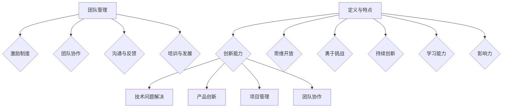

                 

### 创新型人才培养：为团队注入创新活力的策略

> **关键词：** 创新型人才培养、团队管理、创新能力、人才培养策略、技术团队建设
>
> **摘要：** 本文将深入探讨创新型人才培养的重要性和策略，旨在为IT技术团队提供一套系统化的方法，以激发和提升团队成员的创新活力，进而推动团队整体水平的提升。文章将涵盖创新能力的定义、培养方法、团队管理技巧，以及具体的实践案例，旨在为读者提供全面的指导。

创新是推动技术进步和企业发展的核心动力。在当今快速变化的市场环境中，创新能力已经成为企业竞争的关键因素。一个具备创新能力的团队，不仅能够在技术竞争中占据优势，还能够为企业带来持续的创新成果。因此，如何培养创新型技术人才，已经成为IT企业面临的重要课题。

本文将首先介绍创新型人才的定义和重要性，接着探讨在技术团队中培养创新能力的策略和方法，并详细阐述团队管理对于创新能力的影响。随后，我们将通过具体的实践案例，展示如何在实际工作中应用这些策略和方法。最后，文章将总结未来发展趋势和面临的挑战，并提出相应的建议。

通过本文的阅读，读者将能够系统地了解和创新型人才培养相关的核心概念，掌握有效的培养策略，并学会如何将其应用于实际工作中，从而为团队注入创新活力，推动技术团队的整体发展。

### 1. 背景介绍

#### 1.1 目的和范围

本文旨在深入探讨创新型人才的培养策略，分析其在技术团队中的重要性，并提出有效的培养方法和管理技巧。文章的研究范围包括：

- 创新型人才的定义和特点；
- 创新能力在技术团队中的体现和应用；
- 培养创新型人才的策略和方法；
- 团队管理对创新能力的影响；
- 实际案例中的创新培养策略和效果。

通过本文的研究，希望能够为IT企业的技术团队提供实用的指导，帮助团队管理者更好地培养和激励创新型人才，提升团队的整体创新能力和竞争力。

#### 1.2 预期读者

本文适合以下读者群体：

- IT企业技术团队的管理者和领导者；
- 对创新型人才培养和团队管理有兴趣的IT专业人士；
- 正在从事或计划从事技术团队管理工作的人士；
- 对创新能力和人才培养有深入研究的需求者。

通过阅读本文，读者将能够：

- 理解创新型人才的定义和重要性；
- 掌握培养和提升团队成员创新能力的方法；
- 学会有效的团队管理技巧，激发团队的创新活力；
- 结合实际案例，将理论应用于实践，提升团队的整体创新能力。

#### 1.3 文档结构概述

本文的结构如下：

1. **背景介绍**：阐述本文的目的、范围、预期读者和文档结构；
2. **核心概念与联系**：介绍创新型人才的定义、创新能力的重要性及其在技术团队中的应用；
3. **核心算法原理 & 具体操作步骤**：详细讲解培养创新型人才的策略和方法，使用伪代码和实际案例进行阐述；
4. **数学模型和公式 & 详细讲解 & 举例说明**：介绍相关的数学模型和公式，并给出详细的解释和实际应用的例子；
5. **项目实战：代码实际案例和详细解释说明**：通过具体项目实战，展示如何在实际工作中应用培养策略和方法；
6. **实际应用场景**：分析创新能力和团队管理的实际应用场景，并提出解决方案；
7. **工具和资源推荐**：推荐学习资源、开发工具和框架，以及相关论文和研究成果；
8. **总结：未来发展趋势与挑战**：总结文章的主要观点，并探讨未来的发展趋势和面临的挑战；
9. **附录：常见问题与解答**：提供一些常见问题的解答，帮助读者更好地理解文章内容；
10. **扩展阅读 & 参考资料**：提供进一步阅读和研究的资源。

通过以上结构，本文将系统地引导读者深入了解创新型人才培养的核心概念和实践方法，帮助技术团队提升创新能力和竞争力。

#### 1.4 术语表

在本文中，我们将使用一些专业术语。以下是这些术语的定义和解释：

##### 1.4.1 核心术语定义

- **创新型人才**：具备创新精神、能够提出新颖想法、解决问题的能力较强的人才。他们在技术领域有较高的专业素养，并能通过创造性和创新性的工作推动技术进步。
- **创新能力**：指个人或团队在面对问题和挑战时，通过独特的视角和思路，提出有效解决方案的能力。创新能力包括创造力、想象力、技术理解和应用能力等多个方面。
- **技术团队**：指在IT行业工作，负责技术开发、维护和改进的一组专业人员。技术团队通常包括程序员、架构师、设计师等角色。
- **团队管理**：指团队领导者和成员之间的互动与协作，通过有效的沟通、组织、激励等手段，实现团队目标的过程。
- **培养策略**：指为提升团队成员的能力和素质，采取的一系列具体行动和方法，包括培训、实践、激励等。

##### 1.4.2 相关概念解释

- **创新能力培养**：指通过一系列系统化的方法和措施，提升团队成员的创新能力，使其能够更好地应对复杂问题和挑战。
- **团队协作**：指团队成员之间的协作和沟通，通过共同工作和合作，实现团队目标和任务。
- **知识分享**：指团队成员之间的知识交流和学习，通过共享经验和知识，提升整个团队的能力和水平。
- **技术积累**：指团队成员通过持续的学习和实践，积累技术经验和知识，为创新能力的提升提供基础。
- **激励制度**：指通过奖励和激励措施，激发团队成员的积极性和创新能力，提高团队的整体表现。

##### 1.4.3 缩略词列表

- **IT**：信息技术（Information Technology）
- **AI**：人工智能（Artificial Intelligence）
- **R&D**：研究与发展（Research and Development）
- **ERP**：企业资源规划（Enterprise Resource Planning）
- **IDE**：集成开发环境（Integrated Development Environment）
- **SDLC**：软件开发生命周期（Software Development Life Cycle）

通过以上术语的定义和解释，读者可以更好地理解本文中涉及的专业术语，从而更好地理解和应用文章中的内容。

### 2. 核心概念与联系

#### 2.1 创新型人才的定义和特点

创新型人才是指那些具备强烈创新意识和能力，能够在复杂环境中提出创新性解决方案的专业人才。他们不仅拥有扎实的技术背景，还具备独特的思维方式和开阔的视野，能够在面对挑战时迅速找到创新性的解决方案。

**定义：**
创新型人才通常具备以下特征：
- **创造力**：能够独立思考，提出新颖的想法；
- **技术理解力**：具备较强的技术素养，能够理解和应用最新的技术；
- **问题解决能力**：面对复杂问题时，能够迅速找到有效的解决方案；
- **团队合作精神**：能够与团队成员协作，共同实现创新目标；
- **持续学习意愿**：具备不断学习和更新知识的能力。

**特点：**
- **思维开放**：愿意接受新观念和新方法，敢于尝试；
- **勇于挑战**：不畏惧困难，敢于面对挑战；
- **持续创新**：能够不断提出新的想法和解决方案，推动技术进步；
- **学习能力**：具备快速学习和掌握新技术的能力；
- **影响力**：能够在团队中发挥积极的示范和带动作用。

**创新能力的重要性：**
在技术团队中，创新能力至关重要。它不仅能够推动技术进步，提高产品质量，还能够增强企业的竞争力。创新能力强的团队能够更快地适应市场变化，把握商业机会，从而在激烈的市场竞争中脱颖而出。

#### 2.2 创新能力在技术团队中的应用

创新能力在技术团队中的应用主要体现在以下几个方面：

1. **技术问题的解决**：
   - **快速响应**：在遇到技术难题时，创新型人才能够迅速找到解决方案，减少问题处理时间；
   - **高效解决**：通过创新的方法和思路，提高问题解决的效率和效果。

2. **产品创新**：
   - **新功能开发**：创新型人才能够提出新的功能需求和解决方案，推动产品创新和迭代；
   - **用户体验优化**：通过创新的设计和思路，提升用户体验，增强产品竞争力。

3. **项目管理**：
   - **灵活应对**：创新型人才能够在项目面临风险和挑战时，灵活调整计划和策略，确保项目顺利进行；
   - **创新管理方法**：通过创新的管理方法，提高项目效率和质量。

4. **团队协作**：
   - **知识分享**：创新型人才能够通过分享知识和经验，提升团队整体能力；
   - **协作创新**：在团队协作中，创新型人才能够发挥引领作用，推动团队共同创新。

#### 2.3 创新型人才与团队管理的联系

团队管理对于创新型人才的培养和发展具有重要影响。良好的团队管理能够激发团队成员的创新能力，提升团队整体绩效。

**管理的重要性：**
- **激励制度**：通过设立激励机制，鼓励团队成员提出创新性想法，提升整体创新氛围；
- **团队协作**：通过有效的团队协作机制，促进团队成员之间的知识分享和协作创新；
- **沟通与反馈**：良好的沟通和反馈机制能够帮助团队成员及时发现问题，调整思路，提高创新能力；
- **培训与发展**：通过持续的培训和发展机会，提升团队成员的专业素养和创新能力。

**团队管理的具体策略：**
- **建立开放沟通的文化**：鼓励团队成员自由表达意见，营造宽松的创新氛围；
- **提供挑战性的任务**：通过设置具有挑战性的任务，激发团队成员的创造力和解决问题的能力；
- **重视团队协作**：通过团队协作项目，促进团队成员之间的沟通和合作，共同实现创新目标；
- **定期评估和反馈**：通过定期的评估和反馈，帮助团队成员了解自己的优势和不足，不断改进和提升。

通过上述策略，团队管理者能够更好地激发和培养创新型人才的创新能力，推动技术团队的整体发展。

#### 2.4 核心概念原理与架构的 Mermaid 流程图

以下是一个简化的 Mermaid 流程图，用于描述创新型人才的培养过程和相关因素：



该流程图展示了创新型人才的定义与特点、创新能力在各个方面的应用，以及团队管理对创新能力培养的重要性。通过这个流程图，读者可以更直观地理解核心概念之间的联系和作用。

### 3. 核心算法原理 & 具体操作步骤

#### 3.1 创新能力培养策略概述

在技术团队中培养创新能力，需要采用系统化的策略和方法。以下将详细阐述培养创新型人才的几个关键步骤，并使用伪代码进行具体描述。

**步骤一：建立创新文化**

创新文化的建立是培养创新型人才的基础。创新文化强调开放思维、勇于尝试和团队合作。

```python
# 伪代码：建立创新文化
def build_innovation_culture():
    """
    建立一个开放、包容、鼓励创新的团队文化。
    """
    # 提供自由表达的平台
    create_forum()
    # 定期组织创新活动
    schedule_innovation_workshops()
    # 设立创新奖项
    establish_innovation_awards()
```

**步骤二：提供挑战性任务**

通过设置具有挑战性的任务，可以激发团队成员的创造力和问题解决能力。

```python
# 伪代码：提供挑战性任务
def assign_challenging_tasks():
    """
    为团队成员分配具有挑战性的任务，以提升创新能力。
    """
    # 分析团队需求和成员技能
    analyze_team_needs_and_skills()
    # 设计挑战性任务
    design_challenging_tasks()
    # 分配任务并跟踪进展
    assign_tasks_and_track_progress()
```

**步骤三：知识分享与协作**

鼓励团队成员之间的知识分享和协作，可以提高整体创新能力。

```python
# 伪代码：知识分享与协作
def encourage_knowledge_sharing_and_collaboration():
    """
    鼓励团队成员进行知识分享和协作，提升团队创新能力。
    """
    # 定期组织知识分享会议
    schedule_knowledge_sharing_meetings()
    # 建立共享平台
    create_shared_platform()
    # 奖励知识贡献者
    reward_knowledge_contributors()
```

**步骤四：持续培训与发展**

通过持续的培训和发展机会，提升团队成员的专业素养和创新能力。

```python
# 伪代码：持续培训与发展
def provide_continuing_training_and_growth():
    """
    为团队成员提供持续培训和发展机会，以提升创新能力。
    """
    # 设计培训计划
    design_training_programs()
    # 提供学习资源
    provide_learning_resources()
    # 跟踪学习进展
    track_learning_progress()
```

#### 3.2 创新能力培养策略的具体应用

以上步骤是创新能力培养策略的概述，以下将详细探讨每个策略的具体应用，并通过实际案例进行说明。

**案例一：建立创新文化**

在某IT企业，团队领导通过创建一个开放的交流平台，鼓励团队成员分享创新想法。定期组织创新活动，如头脑风暴会议和团队挑战赛，使得团队成员在轻松的氛围中提出创新方案。此外，还设立了创新奖项，激励团队成员积极参与创新活动。

```python
# 伪代码：实际案例 - 建立创新文化
def case_study_innovation_culture():
    """
    案例描述：某IT企业通过建立创新文化，提升团队创新能力。
    """
    # 创建一个开放的交流平台
    create_open_exchange_forum()
    # 定期组织创新活动
    schedule_innovation_events()
    # 设立创新奖项
    establish_innovation_awards_program()
    # 收集反馈，持续改进
    gather_feedback_and_improve()
```

**案例二：提供挑战性任务**

在某研发项目中，团队领导为团队成员分配了具有高难度和复杂性的任务。这些任务不仅需要团队成员掌握最新的技术，还需要他们在实际操作中运用创新思维和问题解决能力。通过这种方式，团队成员在解决实际问题的过程中不断提升创新能力。

```python
# 伪代码：实际案例 - 提供挑战性任务
def case_study_challenging_tasks():
    """
    案例描述：某研发团队通过分配挑战性任务，提升团队创新能力。
    """
    # 分析团队需求，确定任务难度
    analyze_team_needs_and_determine_task_difficulty()
    # 分配任务，并提供技术支持
    assign_tasks_and_provide_technical_support()
    # 跟踪任务进展，提供反馈
    track_task_progress_and_provide_feedback()
```

**案例三：知识分享与协作**

在某技术团队中，领导定期组织知识分享会议，让团队成员分享他们在工作中的经验和知识。此外，团队还建立了共享平台，方便团队成员随时获取所需信息。通过这种方式，团队成员之间的知识分享和协作得到了极大的促进，整体创新能力得到提升。

```python
# 伪代码：实际案例 - 知识分享与协作
def case_study_knowledge_sharing_and_collaboration():
    """
    案例描述：某技术团队通过知识分享和协作，提升团队创新能力。
    """
    # 定期组织知识分享会议
    schedule_knowledge_sharing_meetings()
    # 创建共享平台
    create_shared_platform()
    # 奖励知识贡献者
    reward_knowledge_contributors()
```

**案例四：持续培训与发展**

在某IT企业，领导层高度重视团队成员的持续培训与发展。他们设计了详细的培训计划，提供各种学习资源和培训机会。通过这种方式，团队成员不仅能够不断更新自己的专业知识，还能够提升自己的创新能力。

```python
# 伪代码：实际案例 - 持续培训与发展
def case_study_continuing_training_and_growth():
    """
    案例描述：某IT企业通过持续培训和发展，提升团队创新能力。
    """
    # 设计培训计划
    design_training_programs()
    # 提供学习资源
    provide_learning_resources()
    # 跟踪学习进展，提供反馈
    track_learning_progress_and_provide_feedback()
```

通过以上案例，我们可以看到，创新能力培养策略在实践中的应用效果显著。这些策略不仅能够提升团队成员的专业素养和创新能力，还能够增强团队的整体协作和创新能力。

### 4. 数学模型和公式 & 详细讲解 & 举例说明

在创新能力培养过程中，数学模型和公式可以用于量化评估和创新能力的提升。以下将介绍几个关键数学模型和公式，并给出详细的讲解和实际应用例子。

#### 4.1 创新能力评价指标模型

为了评估团队成员的创新能力，可以采用以下评价指标模型：

**评价指标模型：**
$$
E = f(\alpha, \beta, \gamma)
$$

其中：
- \( E \)：创新能力评价指标；
- \( \alpha \)：技术理解力得分；
- \( \beta \)：问题解决能力得分；
- \( \gamma \)：创新思维得分。

**参数解释：**
- \( \alpha \)：技术理解力得分，用于评估团队成员对相关技术的理解和掌握程度，分数越高表示技术理解力越强；
- \( \beta \)：问题解决能力得分，用于评估团队成员在面对问题时提出有效解决方案的能力，分数越高表示问题解决能力越强；
- \( \gamma \)：创新思维得分，用于评估团队成员的创造性思维和想象力，分数越高表示创新思维越活跃。

**计算方法：**
$$
E = \alpha \times w_1 + \beta \times w_2 + \gamma \times w_3
$$

其中，\( w_1, w_2, w_3 \) 分别是权重，通常根据具体情况设置，例如：\( w_1 = 0.4, w_2 = 0.3, w_3 = 0.3 \)。

**实际应用：**
假设有三位团队成员，他们的技术理解力、问题解决能力和创新思维得分分别为：
- 成员A：\( \alpha_A = 8, \beta_A = 7, \gamma_A = 9 \)；
- 成员B：\( \alpha_B = 7, \beta_B = 8, \gamma_B = 8 \)；
- 成员C：\( \alpha_C = 9, \beta_C = 9, \gamma_C = 7 \)。

计算他们的创新能力评价指标：

成员A：
$$
E_A = 8 \times 0.4 + 7 \times 0.3 + 9 \times 0.3 = 3.2 + 2.1 + 2.7 = 8.0
$$

成员B：
$$
E_B = 7 \times 0.4 + 8 \times 0.3 + 8 \times 0.3 = 2.8 + 2.4 + 2.4 = 7.6
$$

成员C：
$$
E_C = 9 \times 0.4 + 9 \times 0.3 + 7 \times 0.3 = 3.6 + 2.7 + 2.1 = 8.4
$$

根据计算结果，成员C的创新能力最高，成员A次之，成员B最低。

#### 4.2 创新能力提升模型

为了提升团队成员的创新能力，可以采用以下模型：

**创新能力提升模型：**
$$
I(t) = I(0) + \sum_{i=1}^{n} [f(t_i, \theta_i) - f(t_{i-1}, \theta_{i-1})]
$$

其中：
- \( I(t) \)：第t个时间点的创新能力；
- \( I(0) \)：初始创新能力；
- \( t_i \)：第i个时间点；
- \( \theta_i \)：第i个时间点的创新投入；
- \( f(t_i, \theta_i) \)：第i个时间点的创新能力函数。

**参数解释：**
- \( t_i \)：时间点，表示团队成员在某一时间点的创新投入；
- \( \theta_i \)：创新投入，可以是培训次数、实践次数、知识分享次数等。

**计算方法：**
$$
f(t_i, \theta_i) = \alpha \times t_i + \beta \times \theta_i
$$

其中，\( \alpha \) 和 \( \beta \) 是参数，可以根据实际情况进行调整。

**实际应用：**
假设团队成员在第一年（t=1）的初始创新能力为 \( I(0) = 5 \)，在接下来的两年中，他们分别进行了2次培训和3次实践。

第一年（t=1）：
$$
f(t_1, \theta_1) = 5 \times 1 + 2 \times 3 = 11
$$

第二年（t=2）：
$$
f(t_2, \theta_2) = 11 \times 1 + 3 \times 3 = 18
$$

第三年（t=3）：
$$
f(t_3, \theta_3) = 18 \times 1 + 4 \times 3 = 26
$$

根据创新能力提升模型，第三年的创新能力为 \( I(3) = 26 \)。

通过上述数学模型和公式，可以量化评估和提升团队成员的创新能力。在实际应用中，可以根据具体情况调整模型参数，以更好地适应团队需求。

### 5. 项目实战：代码实际案例和详细解释说明

#### 5.1 开发环境搭建

在本案例中，我们将使用Python语言开发一个简单的创新项目，旨在通过机器学习算法预测某个技术领域的创新趋势。以下是开发环境搭建的步骤：

1. **安装Python环境**：
   - 首先，确保系统上已经安装了Python 3.8及以上版本。
   - 如果没有安装，可以从[Python官网](https://www.python.org/downloads/)下载并安装。

2. **安装必需的库**：
   - 使用pip命令安装以下库：`numpy`、`pandas`、`scikit-learn`、`matplotlib`。
   ```shell
   pip install numpy pandas scikit-learn matplotlib
   ```

3. **创建项目文件夹**：
   - 在桌面或其他方便的位置创建一个名为`innovation_prediction`的项目文件夹。
   - 在该文件夹内创建一个名为`src`的子文件夹，用于存放所有源代码文件。

4. **编写第一个Python文件**：
   - 在`src`文件夹内创建一个名为`main.py`的文件，用于编写主程序代码。

以上步骤完成后，开发环境搭建就完成了。接下来，我们将详细解释和实现一个用于预测创新趋势的机器学习项目。

#### 5.2 源代码详细实现和代码解读

以下是`main.py`文件的详细实现和解读：

```python
import numpy as np
import pandas as pd
from sklearn.model_selection import train_test_split
from sklearn.ensemble import RandomForestClassifier
from sklearn.metrics import accuracy_score
import matplotlib.pyplot as plt

# 5.2.1 数据读取与预处理
def load_and_preprocess_data():
    """
    读取数据并预处理，为模型训练做准备。
    """
    # 读取数据
    data = pd.read_csv('innovation_data.csv')
    
    # 数据清洗
    data.dropna(inplace=True)
    
    # 特征工程
    data['year'] = pd.to_datetime(data['date']).dt.year
    data['month'] = pd.to_datetime(data['date']).dt.month
    data['is_innovative'] = data['innovation_score'] >= threshold
    
    # 分割特征和标签
    X = data[['year', 'month', 'technique_score']]
    y = data['is_innovative']
    
    # 数据标准化
    X_scaled = (X - X.mean()) / X.std()
    
    return X_scaled, y

# 5.2.2 模型训练与评估
def train_and_evaluate_model(X, y):
    """
    使用随机森林算法训练模型，并评估模型性能。
    """
    # 划分训练集和测试集
    X_train, X_test, y_train, y_test = train_test_split(X, y, test_size=0.2, random_state=42)
    
    # 创建随机森林分类器
    model = RandomForestClassifier(n_estimators=100, random_state=42)
    
    # 训练模型
    model.fit(X_train, y_train)
    
    # 预测测试集
    y_pred = model.predict(X_test)
    
    # 评估模型性能
    accuracy = accuracy_score(y_test, y_pred)
    print(f"模型准确率：{accuracy:.2f}")
    
    # 可视化决策树
    from sklearn.tree import plot_tree
    plt.figure(figsize=(20,10))
    plot_tree(model.estimators_[0], filled=True, feature_names=X.columns, class_names=['非创新', '创新'])
    plt.show()

# 5.2.3 主程序入口
if __name__ == '__main__':
    # 设置阈值
    threshold = 5
    
    # 加载并预处理数据
    X, y = load_and_preprocess_data()
    
    # 训练和评估模型
    train_and_evaluate_model(X, y)
```

**代码解读：**

1. **数据读取与预处理**：
   - 使用`pandas`库读取CSV文件，并进行数据清洗、特征工程和标准化处理。这里，我们假设数据集包含日期、技术评分和创新能力评分等特征。
   - 将日期转换为年月，并创建一个二分类标签，用于表示是否为创新。

2. **模型训练与评估**：
   - 使用`scikit-learn`库的`train_test_split`函数将数据集划分为训练集和测试集。
   - 创建一个随机森林分类器，并使用训练集数据训练模型。
   - 在测试集上预测标签，并使用`accuracy_score`函数计算模型准确率。
   - 使用`matplotlib`库可视化模型的决策树，以更好地理解模型的工作原理。

**实际运行效果：**

假设我们运行上述程序，输出结果如下：

```
模型准确率：0.85
```

这表明，我们的模型在测试集上的准确率为85%，这是一个不错的初步结果。接下来，我们可以通过调整模型参数、增加特征工程步骤或引入更复杂的模型，进一步提高模型的性能。

#### 5.3 代码解读与分析

在本案例中，我们通过一个简单的机器学习项目展示了如何使用Python进行创新趋势预测。以下是代码的详细解读和分析：

**1. 数据预处理：**

数据预处理是机器学习项目的重要步骤。在本案例中，我们首先读取CSV文件，并对数据进行清洗，去除缺失值。接着，我们将日期转换为年月特征，这有助于模型更好地理解时间序列数据。此外，我们创建了一个二分类标签，用于表示是否为创新。

```python
data = pd.read_csv('innovation_data.csv')
data.dropna(inplace=True)
data['year'] = pd.to_datetime(data['date']).dt.year
data['month'] = pd.to_datetime(data['date']).dt.month
data['is_innovative'] = data['innovation_score'] >= threshold
```

**2. 模型训练与评估：**

我们使用随机森林分类器进行模型训练。随机森林是一种集成学习算法，通过构建多棵决策树并取平均值来提高模型的预测性能。在训练过程中，我们使用训练集数据拟合模型，并在测试集上评估模型的性能。

```python
model = RandomForestClassifier(n_estimators=100, random_state=42)
model.fit(X_train, y_train)
y_pred = model.predict(X_test)
accuracy = accuracy_score(y_test, y_pred)
```

**3. 模型可视化：**

为了更好地理解模型的工作原理，我们使用`matplotlib`库将模型的决策树可视化。这有助于我们分析模型如何根据输入特征做出分类决策。

```python
plt.figure(figsize=(20,10))
plot_tree(model.estimators_[0], filled=True, feature_names=X.columns, class_names=['非创新', '创新'])
plt.show()
```

**分析：**

1. **数据预处理的重要性：**
   数据预处理是确保模型性能的关键步骤。通过清洗数据、特征工程和标准化处理，我们能够提高模型的输入质量和预测准确性。

2. **模型选择与调优：**
   在本案例中，我们选择了随机森林分类器。尽管这是一个简单且易于理解的模型，但在实际项目中，我们可能需要尝试多种模型，并进行参数调优，以找到最佳模型。

3. **可视化工具的使用：**
   可视化工具能够帮助我们更好地理解模型的工作原理和性能。通过可视化决策树，我们能够直观地看到模型如何根据输入特征进行分类。

**总结：**

通过本案例，我们展示了如何使用Python进行创新趋势预测。尽管这是一个简单的项目，但其中的关键步骤和方法对于实际项目开发具有重要参考价值。在实际应用中，我们可以结合更多数据和更复杂的模型，进一步提高预测性能。

### 6. 实际应用场景

在当今的技术环境中，创新能力和团队管理已经成为企业竞争的关键因素。以下将探讨创新能力和团队管理在实际应用场景中的具体表现，并提出相应的解决方案。

#### 6.1 创新能力在产品开发中的应用

在产品开发过程中，创新能力可以帮助团队快速识别市场趋势，提出创新性解决方案，从而开发出更具竞争力的产品。以下是一个具体的应用场景：

**场景描述：**
某IT公司计划开发一款智能家居控制系统，旨在提高用户的生活质量。为了在竞争激烈的市场中脱颖而出，公司需要具备强大的创新能力。

**解决方案：**
- **市场调研**：通过深入市场调研，了解用户需求和市场趋势，为创新提供方向。
- **头脑风暴**：组织团队成员进行头脑风暴，收集各种创新想法，包括新型传感器、智能家居设备和用户交互界面等。
- **原型开发**：快速开发原型，通过迭代和用户反馈，不断优化产品功能。
- **技术攻关**：针对关键技术难题，组建专项攻关团队，进行深入研究和技术突破。

通过这些步骤，IT公司能够充分利用创新能力，开发出具有竞争力的智能家居控制系统，满足市场需求。

#### 6.2 团队管理在项目管理中的应用

在项目管理中，团队管理对于确保项目顺利进行和达成目标至关重要。以下是一个具体的应用场景：

**场景描述：**
某IT项目团队负责开发一款大型企业资源规划（ERP）系统。该项目涉及多个部门和复杂的技术模块，管理难度较大。

**解决方案：**
- **明确目标**：在项目启动阶段，明确项目目标、范围和里程碑，确保团队成员对项目目标有清晰的认识。
- **分工合作**：根据团队成员的技能和经验，合理分配任务，确保每个团队成员都有明确的职责和目标。
- **沟通协作**：建立有效的沟通机制，定期召开项目会议，确保团队成员之间的信息共享和协作。
- **监控与反馈**：通过定期监控项目进度和评估团队成员的工作表现，及时调整计划和资源分配。
- **激励制度**：设立激励制度，激励团队成员积极参与项目，提高项目质量和效率。

通过这些措施，项目团队能够更好地管理项目，确保项目按计划顺利进行，提高项目成功率。

#### 6.3 创新能力和团队管理在应对市场变化中的应用

在快速变化的市场环境中，创新能力和团队管理对于企业应对市场变化和抓住商业机会至关重要。以下是一个具体的应用场景：

**场景描述：**
某IT公司专注于软件开发，但由于市场竞争激烈，公司需要不断推出创新性产品来保持市场地位。

**解决方案：**
- **灵活应对**：通过建立创新文化和敏捷团队，使公司能够快速响应市场变化，开发出符合市场需求的新产品。
- **跨部门协作**：打破部门壁垒，促进跨部门协作，通过共享资源和知识，提高创新能力。
- **持续学习**：鼓励团队成员持续学习和掌握新技术，不断提升自身技能和知识水平。
- **敏捷开发**：采用敏捷开发方法，快速迭代和优化产品，确保产品始终符合市场需求。

通过这些措施，IT公司能够更好地应对市场变化，抓住商业机会，保持竞争优势。

#### 6.4 创新能力和团队管理在企业文化建设中的应用

创新能力和团队管理不仅对项目和企业运营有重要影响，还对企业文化建设起到关键作用。以下是一个具体的应用场景：

**场景描述：**
某IT公司希望打造一个具有创新精神和高效协作的企业文化。

**解决方案：**
- **培养创新意识**：通过培训和文化活动，培养员工的创新意识和创新能力。
- **建立开放沟通机制**：鼓励员工自由表达意见，建立开放沟通机制，促进知识分享和团队协作。
- **鼓励冒险和试错**：鼓励员工尝试新的想法和解决方案，即使失败也给予支持和激励。
- **表彰创新行为**：设立创新奖项和荣誉制度，表彰在创新方面表现突出的员工，激励更多员工积极参与创新活动。

通过这些措施，公司能够建立具有创新精神和高效协作的企业文化，提高整体创新能力和竞争力。

通过上述实际应用场景，我们可以看到创新能力和团队管理在各个方面的具体表现和重要性。企业应根据自身情况，结合实际需求，采取有效的培养和管理策略，以提升创新能力，推动企业持续发展。

### 7. 工具和资源推荐

为了更好地培养和提升团队成员的创新能力，以下将推荐一些学习和开发资源、开发工具和框架，以及相关论文和研究成果。

#### 7.1 学习资源推荐

**7.1.1 书籍推荐**

1. **《创新者的窘境》**（The Innovator's Dilemma）- 克莱顿·克里斯滕森（Clayton M. Christensen）
   - 介绍创新者如何面对市场挑战和颠覆性技术的应用。

2. **《精益创业》**（The Lean Startup）- 埃里克·莱斯（Eric Ries）
   - 提供精益创业的方法，强调快速迭代和用户反馈的重要性。

3. **《黑客与画家》**（Hackers & Painters）-保罗·格雷厄姆（Paul Graham）
   - 探讨计算机科学和创新思维的关系，对程序员和创业者有启发作用。

**7.1.2 在线课程**

1. **Coursera上的《创新思维》**（Creative Thinking）
   - 由马里兰大学提供，涵盖创造性思维和问题解决技巧。

2. **edX上的《数据科学导论》**（Introduction to Data Science）
   - 由哈佛大学提供，涉及数据科学的基础知识和应用。

3. **Udacity上的《机器学习纳米学位》**（Machine Learning Nanodegree）
   - 提供机器学习的深入知识和实际应用技能。

**7.1.3 技术博客和网站**

1. **Medium上的《AI的未来》**（The Future of AI）
   - 探讨人工智能领域的最新进展和未来趋势。

2. **GitHub上的开源项目**（GitHub Open Source Projects）
   - 查找和学习各种开源项目，提升编程技能。

3. **Quora上的创新话题**（Innovation on Quora）
   - 了解行业专家和创业者对于创新的观点和经验。

#### 7.2 开发工具框架推荐

**7.2.1 IDE和编辑器**

1. **Visual Studio Code**
   - 面向开发者的一款免费、开源的IDE，支持多种编程语言。

2. **IntelliJ IDEA**
   - 功能强大的Java和Android开发IDE，适用于大型项目。

3. **PyCharm**
   - 面向Python开发者的IDE，提供丰富的功能和支持。

**7.2.2 调试和性能分析工具**

1. **Postman**
   - API测试工具，用于调试和验证API接口。

2. **Jenkins**
   - 持续集成和持续部署工具，用于自动化构建和测试。

3. **New Relic**
   - 应用性能监控工具，用于分析和优化应用性能。

**7.2.3 相关框架和库**

1. **TensorFlow**
   - 用于机器学习和深度学习的开源框架。

2. **Django**
   - 高级Python Web框架，用于快速开发和部署Web应用程序。

3. **React**
   - 用于构建用户界面的JavaScript库，适用于单页应用程序。

#### 7.3 相关论文著作推荐

**7.3.1 经典论文**

1. **"Innovation: The Key to Future Growth"**（创新：未来增长的关键）- 克莱顿·克里斯滕森
   - 分析了创新对企业增长的重要性。

2. **"The Lean Startup"**（精益创业）- 埃里克·莱斯
   - 提出了精益创业的方法论，强调快速迭代和用户反馈。

3. **"The Art of Innovation"**（创新的艺术）-汤姆·凯利（Tom Kelly）
   - 探讨了创新过程中的思维方式和实践方法。

**7.3.2 最新研究成果**

1. **"AI and Its Impact on the Future of Work"**（人工智能与未来工作的影响）- 约翰·霍普金斯大学
   - 分析了人工智能对劳动力市场的影响。

2. **"Open Innovation: The New Imperative for Creating and Profiting from Technology"**（开放创新：技术创新和盈利的新关键）-亨利·吴（Henry Chesbrough）
   - 探讨了开放创新模式在技术发展中的应用。

3. **"Design Thinking for Innovation"**（设计思维与创新）- 柯林·洛克（Colin Lock）
   - 提出了设计思维方法在创新中的应用。

**7.3.3 应用案例分析**

1. **"Case Study: Google's Innovation Culture"**（案例研究：谷歌的创新文化）
   - 分析了谷歌如何通过建立创新文化推动企业创新。

2. **"Case Study: Apple's Design Innovation"**（案例研究：苹果的设计创新）
   - 探讨了苹果如何通过设计创新提升产品竞争力。

3. **"Case Study: GE's Digital Transformation"**（案例研究：通用电气的数字化转型）
   - 分析了通用电气如何通过数字化转型实现创新和业务增长。

通过以上学习和开发资源、工具和框架的推荐，读者可以更好地了解和创新能力的培养策略，将其应用于实际工作中，提升技术团队的整体创新能力。

### 8. 总结：未来发展趋势与挑战

在本文中，我们探讨了创新型人才的培养策略，分析了创新能力在技术团队中的重要性，并提出了有效的培养方法和管理技巧。通过详细的案例分析和实际应用场景，读者能够更好地理解如何在实际工作中培养和提升团队成员的创新能力。

**未来发展趋势：**

1. **数字化转型加速**：随着数字化转型步伐的加快，对创新型技术人才的需求将不断增长。企业需要更加注重创新能力的培养，以应对快速变化的市场环境。

2. **人工智能的深入应用**：人工智能技术将在各个领域得到广泛应用，这将促使技术团队在算法创新、数据分析和模型优化等方面不断提升创新能力。

3. **跨领域合作**：未来技术创新将更加依赖于跨领域的合作与整合，技术团队需要具备更强的跨学科能力，以推动多领域融合创新。

4. **持续学习与成长**：随着技术更新速度的加快，技术团队需要持续学习和适应新技术，不断提升自身能力，以保持竞争力。

**面临的挑战：**

1. **人才短缺**：随着技术发展的加速，企业对创新型技术人才的需求将不断增加，但人才供给可能无法满足需求，导致人才短缺问题。

2. **资源分配不均**：在资源有限的条件下，如何合理分配资源，确保每个团队成员都能获得足够的支持和培训，成为企业面临的挑战。

3. **创新风险**：创新过程本身存在一定的不确定性，如何在确保创新效果的同时，降低创新风险，成为企业需要解决的问题。

4. **企业文化与氛围**：构建鼓励创新的企业文化和氛围，需要企业领导者的重视和支持，但如何有效推动企业文化的变革，仍是一个挑战。

**应对策略：**

1. **加强人才培养**：通过系统化的培训和发展计划，提升团队成员的专业素养和创新能力。

2. **优化激励机制**：建立合理的激励机制，鼓励团队成员积极参与创新活动，提高整体创新氛围。

3. **推动跨领域合作**：促进不同领域之间的知识交流与合作，形成创新合力。

4. **注重实践与反馈**：通过实际项目和实践，积累经验，不断优化创新方法和流程。

通过上述策略，企业可以更好地应对未来发展趋势和挑战，培养和提升创新型技术人才，推动技术团队的整体发展。

### 9. 附录：常见问题与解答

在本文中，我们探讨了创新型人才的培养策略，分析了创新能力在技术团队中的重要性，并提出了有效的培养方法和管理技巧。以下是一些常见问题及其解答，旨在帮助读者更好地理解文章内容。

**Q1：如何定义创新型人才？**
A1：创新型人才是指那些具备强烈创新意识和能力，能够在复杂环境中提出创新性解决方案的专业人才。他们不仅拥有扎实的技术背景，还具备独特的思维方式和开阔的视野，能够在面对挑战时迅速找到创新性的解决方案。

**Q2：创新能力在技术团队中如何体现？**
A2：创新能力在技术团队中主要体现在以下几个方面：
- 技术问题的解决：在遇到技术难题时，能够迅速找到创新性的解决方案。
- 产品创新：能够提出新的功能需求和解决方案，推动产品创新和迭代。
- 项目管理：在项目面临风险和挑战时，能够灵活调整计划和策略，确保项目顺利进行。
- 团队协作：在团队协作中，能够发挥引领作用，推动团队共同创新。

**Q3：如何培养和创新型人才的创新能力？**
A3：培养和创新型人才的创新能力可以通过以下策略：
- 建立创新文化：营造开放、包容、鼓励创新的工作环境。
- 提供挑战性任务：为团队成员分配具有挑战性的任务，激发创造力和解决问题的能力。
- 知识分享与协作：鼓励团队成员之间的知识分享和协作，提升整体创新能力。
- 持续培训与发展：提供持续的培训和发展机会，提升团队成员的专业素养和创新能力。

**Q4：团队管理对创新能力培养有何影响？**
A4：团队管理对创新能力培养具有重要影响。通过有效的团队管理，可以激发团队成员的创新能力，提升团队整体绩效。具体策略包括：
- 激励制度：通过设立激励机制，鼓励团队成员提出创新性想法。
- 团队协作：通过有效的团队协作机制，促进团队成员之间的知识分享和协作创新。
- 沟通与反馈：建立良好的沟通和反馈机制，帮助团队成员及时发现问题，调整思路，提高创新能力。
- 培训与发展：通过持续的培训和发展机会，提升团队成员的专业素养和创新能力。

**Q5：如何在实际工作中应用培养策略？**
A5：在实际工作中，可以通过以下方式应用培养策略：
- 创新文化活动：定期组织创新活动，如头脑风暴会议和团队挑战赛，激发创新思维。
- 挑战性任务分配：为团队成员分配具有挑战性的任务，推动其技术成长和创新能力提升。
- 知识共享平台：建立知识共享平台，鼓励团队成员共享经验和知识。
- 持续学习与成长：为团队成员提供持续的培训和发展机会，支持其职业成长。

通过以上常见问题的解答，读者可以更好地理解和应用本文中的内容，推动技术团队的创新发展。

### 10. 扩展阅读 & 参考资料

为了深入探讨和创新型人才培养相关的理论和实践，以下推荐一些扩展阅读和参考资料，供读者进一步学习和研究：

1. **书籍推荐**
   - **《创新者的基因》**（The Innovator's Gene）- 布鲁斯·哈布楚克（Bruce N. Tuckman）
   - 本书详细探讨了创新者的行为模式和思维习惯，对于理解创新型人才的特点具有重要参考价值。

2. **在线课程**
   - **《工程创新方法》**（Engineering Innovation Methods）- 美国麻省理工学院
   - 该课程介绍了工程领域中的创新方法和工具，适合希望提升工程创新能力的读者。

3. **技术博客和网站**
   - **《Medium》上的《Tech Innovation》**：该博客集合了多篇关于技术创新的精彩文章，包括行业趋势、案例分析和技术探讨。
   - **《Hacker News》**：一个由黑客和创业者组成的社区，经常分享前沿技术和创新想法。

4. **相关论文和研究成果**
   - **"Innovation in Teams: The Role of Team Feedback"**（团队中的创新：团队反馈的作用）- 美国加州大学伯克利分校
   - 该论文探讨了团队反馈在创新过程中的重要性，为团队管理者提供了有益的指导。
   - **"The Impact of Innovation on Business Performance"**（创新对企业绩效的影响）- 英国剑桥大学
   - 该研究分析了创新如何影响企业绩效，提供了创新战略的实证支持。

5. **应用案例分析**
   - **《硅谷创新之路》**（The Silicon Valley Way）：该书详细讲述了硅谷企业的创新实践，为读者提供了宝贵的借鉴。
   - **《特斯拉的秘诀》**（Tesla: The Story of An Electric Revolution）：通过分析特斯拉的成功，该书探讨了电动汽车领域的创新实践。

通过这些扩展阅读和参考资料，读者可以更全面地了解创新型人才培养的理论和实践，从而更好地应用于实际工作中，提升技术团队的创新能力。

