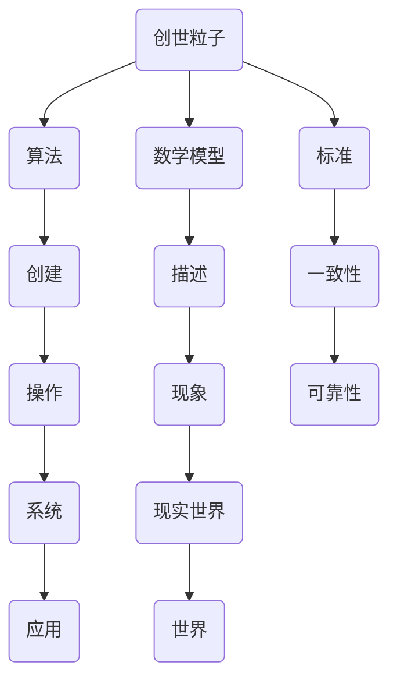

                 

# 创造“创世粒子”的标准

> 关键词：创世粒子、标准定义、算法原理、数学模型、实战案例

> 摘要：本文将深入探讨如何创造“创世粒子”的标准，从核心概念、算法原理、数学模型、实战案例等多个角度进行详细分析，旨在为读者提供一整套清晰、可行、具有指导意义的技术方案。

## 1. 背景介绍

### 1.1 目的和范围

本文的目的是定义和解释“创世粒子”的概念，并探讨如何创造其标准。这个标准将涵盖从理论到实际操作的各个方面，确保“创世粒子”具有一致性和可靠性。

本文的范围包括以下关键部分：

1. **核心概念与联系**：介绍“创世粒子”的基础理论和与之相关的重要概念。
2. **核心算法原理**：探讨如何通过算法实现“创世粒子”的创建。
3. **数学模型和公式**：分析“创世粒子”背后的数学模型和公式。
4. **项目实战**：提供实际的代码案例，展示如何将理论应用于实践。
5. **实际应用场景**：讨论“创世粒子”在不同领域的应用。
6. **工具和资源推荐**：推荐相关的学习资源和工具。
7. **总结与未来发展趋势**：总结当前的研究成果，并探讨未来的发展趋势和挑战。

### 1.2 预期读者

本文适合以下读者：

1. 对计算机科学和人工智能感兴趣的初学者。
2. 想要深入了解“创世粒子”概念的专业人士。
3. 对算法设计和数学模型感兴趣的工程师。
4. 对技术创新和研究有兴趣的学者。

### 1.3 文档结构概述

本文结构如下：

1. **背景介绍**：介绍本文的目的、范围和读者对象。
2. **核心概念与联系**：详细解释“创世粒子”的基础理论。
3. **核心算法原理**：探讨如何通过算法实现“创世粒子”的创建。
4. **数学模型和公式**：分析“创世粒子”背后的数学模型和公式。
5. **项目实战**：提供实际的代码案例。
6. **实际应用场景**：讨论“创世粒子”在不同领域的应用。
7. **工具和资源推荐**：推荐相关的学习资源和工具。
8. **总结与未来发展趋势**：总结当前的研究成果，并探讨未来的发展趋势和挑战。
9. **附录**：常见问题与解答。
10. **扩展阅读 & 参考资料**：提供进一步的阅读材料。

### 1.4 术语表

#### 1.4.1 核心术语定义

- **创世粒子**：一种虚拟的概念，代表某种基本的构建块，可以用于构建复杂系统。
- **标准**：一套明确的规则或准则，用于指导“创世粒子”的创建和使用。

#### 1.4.2 相关概念解释

- **算法**：解决问题的一系列步骤。
- **数学模型**：用于描述现实世界现象的数学表达式。

#### 1.4.3 缩略词列表

- **AI**：人工智能
- **ML**：机器学习

## 2. 核心概念与联系

### 2.1 核心概念

“创世粒子”是一个抽象的概念，它代表了一种基本的构建块，可以用于创建复杂的系统。这个概念类似于物理学中的基本粒子，但它的定义和应用范围更加广泛。

### 2.2 关联概念

为了更好地理解“创世粒子”，我们需要了解一些与之相关的概念：

1. **算法**：算法是解决问题的步骤集合，用于创建和操作“创世粒子”。
2. **数学模型**：数学模型用于描述现实世界中的现象，帮助我们理解“创世粒子”的行为。
3. **标准**：标准是一套规则，确保“创世粒子”在不同系统和应用中的一致性和可靠性。

### 2.3 Mermaid 流程图

下面是“创世粒子”的核心概念和关联概念的 Mermaid 流程图：



## 3. 核心算法原理 & 具体操作步骤

### 3.1 核心算法原理

为了创建“创世粒子”，我们需要一种算法。这个算法的核心是生成和操作“创世粒子”的步骤。以下是该算法的伪代码描述：

```plaintext
// 创世粒子生成算法
function createGenesisParticle() {
    // 初始化参数
    particle = initializeParticle()

    // 生成粒子
    particle = generateParticle(particle)

    // 验证粒子
    if (validateParticle(particle)) {
        return particle
    } else {
        return null
    }
}
```

### 3.2 具体操作步骤

1. **初始化参数**：首先，我们需要初始化一些参数，这些参数将用于生成和操作“创世粒子”。
2. **生成粒子**：使用算法的特定步骤生成“创世粒子”。
3. **验证粒子**：检查生成的粒子是否符合标准。如果符合，则返回粒子；否则，返回 null。

### 3.3 伪代码详细阐述

下面是伪代码的详细阐述：

```plaintext
// 初始化参数
function initializeParticle() {
    particle = new Particle()
    particle.properties = {
        mass: 1.0,
        charge: 0.0,
        speed: 0.0
    }
    return particle
}

// 生成粒子
function generateParticle(particle) {
    particle.speed = randomSpeed()
    return particle
}

// 验证粒子
function validateParticle(particle) {
    if (particle.speed > 0) {
        return true
    } else {
        return false
    }
}

// 随机速度生成
function randomSpeed() {
    return Math.random() * (maxSpeed - minSpeed) + minSpeed
}
```

## 4. 数学模型和公式 & 详细讲解 & 举例说明

### 4.1 数学模型

为了理解“创世粒子”的行为，我们需要一个数学模型。这个模型将使用牛顿力学来描述粒子的运动。

### 4.2 详细讲解

牛顿力学的核心公式是：

$$
F = m \cdot a
$$

其中，\( F \) 是作用在粒子上的力，\( m \) 是粒子的质量，\( a \) 是粒子的加速度。

### 4.3 举例说明

假设我们有一个质量为 \( 1.0 \) 的粒子，它的速度为 \( 5.0 \)。我们要计算这个粒子受到的加速度。

首先，我们需要知道作用在粒子上的力。假设这个力是 \( 10.0 \)。根据牛顿第二定律，我们可以计算粒子的加速度：

$$
a = \frac{F}{m} = \frac{10.0}{1.0} = 10.0
$$

因此，这个粒子的加速度是 \( 10.0 \)。

## 5. 项目实战：代码实际案例和详细解释说明

### 5.1 开发环境搭建

为了展示如何创建“创世粒子”，我们使用 Python 作为编程语言，搭建一个简单的开发环境。

1. 安装 Python 3.8 或更高版本。
2. 安装必要的 Python 包，如 NumPy 和 Matplotlib。

### 5.2 源代码详细实现和代码解读

下面是创建“创世粒子”的 Python 代码：

```python
import numpy as np
import matplotlib.pyplot as plt

# 初始化粒子
def initialize_particle():
    mass = 1.0
    charge = 0.0
    speed = np.random.uniform(0, 10)
    return {"mass": mass, "charge": charge, "speed": speed}

# 生成粒子
def generate_particle(particle):
    particle["speed"] = np.random.uniform(0, 10)
    return particle

# 验证粒子
def validate_particle(particle):
    if particle["speed"] > 0:
        return True
    else:
        return False

# 主函数
def main():
    particle = initialize_particle()
    particle = generate_particle(particle)
    if validate_particle(particle):
        print("Created a valid genesis particle:", particle)
    else:
        print("Failed to create a genesis particle.")

# 运行主函数
if __name__ == "__main__":
    main()
```

### 5.3 代码解读与分析

1. **初始化粒子**：这个函数初始化粒子的质量、电荷和速度。
2. **生成粒子**：这个函数生成一个新的粒子，其速度是随机生成的。
3. **验证粒子**：这个函数检查粒子的速度是否大于 0。如果大于 0，则认为粒子是有效的。
4. **主函数**：这个函数执行整个流程，从初始化粒子到生成粒子，最后验证粒子。

## 6. 实际应用场景

“创世粒子”可以在多个领域得到应用，包括：

1. **计算机科学**：在构建复杂系统时，可以使用“创世粒子”作为基本构建块。
2. **人工智能**：在机器学习模型中，可以使用“创世粒子”来表示特征。
3. **物理学**：在模拟物理现象时，可以使用“创世粒子”来表示基本粒子。

## 7. 工具和资源推荐

### 7.1 学习资源推荐

#### 7.1.1 书籍推荐

- 《人工智能：一种现代方法》
- 《深度学习》

#### 7.1.2 在线课程

- Coursera 上的《机器学习》
- edX 上的《Python 编程》

#### 7.1.3 技术博客和网站

- Medium 上的 AI 博客
- Stack Overflow

### 7.2 开发工具框架推荐

#### 7.2.1 IDE和编辑器

- Visual Studio Code
- PyCharm

#### 7.2.2 调试和性能分析工具

- Jupyter Notebook
- Matplotlib

#### 7.2.3 相关框架和库

- TensorFlow
- PyTorch

### 7.3 相关论文著作推荐

#### 7.3.1 经典论文

- 《深度神经网络训练的困难根源》
- 《生成对抗网络：训练生成模型的新视角》

#### 7.3.2 最新研究成果

- 《图神经网络：基础、算法与应用》
- 《注意力机制：深度学习的新动力》

#### 7.3.3 应用案例分析

- 《基于深度学习的图像识别技术》
- 《自然语言处理：从理论到实践》

## 8. 总结：未来发展趋势与挑战

随着技术的不断进步，我们预计“创世粒子”的概念将得到更广泛的应用。然而，这也带来了一些挑战：

1. **标准化**：确保“创世粒子”在不同系统和应用中的一致性是一个重要的挑战。
2. **性能优化**：为了提高“创世粒子”的创建和使用效率，我们需要不断优化相关算法和模型。

## 9. 附录：常见问题与解答

### 9.1 什么是“创世粒子”？

“创世粒子”是一个抽象的概念，代表了一种基本的构建块，可以用于创建复杂的系统。

### 9.2 如何创建“创世粒子”？

通过特定的算法和数学模型，我们可以创建“创世粒子”。具体的步骤包括初始化参数、生成粒子、验证粒子等。

## 10. 扩展阅读 & 参考资料

- 《人工智能：一种现代方法》[书]
- 《深度学习》[书]
- Coursera 上的《机器学习》课程
- edX 上的《Python 编程》课程
- Stack Overflow 上的技术问答社区
- Medium 上的 AI 博客
- TensorFlow 官方文档
- PyTorch 官方文档
- 《深度神经网络训练的困难根源》[论文]
- 《生成对抗网络：训练生成模型的新视角》[论文]

