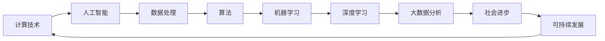

                 

# 创造更美好的明天：人类计算的积极作用

> **关键词：计算技术、人工智能、可持续发展、社会进步、技术创新**

> **摘要：本文将深入探讨计算技术在推动社会进步和可持续发展中的关键作用，从核心概念到实际应用，逐步分析人类计算的积极影响，并展望未来发展的趋势与挑战。**

## 1. 背景介绍

### 1.1 目的和范围

本文旨在解析计算技术在社会发展中的重要性，探讨其对可持续发展和社会进步的推动作用。我们将从核心概念出发，通过理论讲解和实际案例，展现计算技术的广泛应用和潜在价值。

### 1.2 预期读者

本文适合对计算技术有兴趣的读者，包括计算机科学专业学生、程序员、IT行业从业者、以及对科技创新和可持续发展有热忱的公众。

### 1.3 文档结构概述

本文分为十个部分：首先介绍计算技术的背景和重要性；然后通过核心概念和算法原理，逐步剖析计算技术的运作机制；接着通过实际应用案例，展示其在现实世界中的成效；最后，我们还将推荐相关的学习资源和工具，并对未来发展趋势进行展望。

### 1.4 术语表

#### 1.4.1 核心术语定义

- **计算技术**：指使用计算机和相关设备进行数据处理和程序执行的技术。
- **人工智能**：指通过计算机模拟人类智能行为的技术，包括机器学习、深度学习等。
- **可持续发展**：指满足当前需求而不损害后代满足其需求的能力。
- **社会进步**：指社会在物质、文化、道德等方面的提升和发展。

#### 1.4.2 相关概念解释

- **计算能力**：指计算机执行计算任务的能力，通常用处理速度、存储容量等指标衡量。
- **算法**：解决问题的方法步骤，具有确定性和可操作性。
- **框架**：为解决特定问题提供的预先定义的结构和工具集。

#### 1.4.3 缩略词列表

- **AI**：人工智能
- **ML**：机器学习
- **DL**：深度学习
- **SD**：可持续发展
- **IT**：信息技术

## 2. 核心概念与联系

计算技术在现代社会中扮演着至关重要的角色。为了更好地理解其影响，我们需要了解几个核心概念和它们之间的联系。以下是一个Mermaid流程图，展示了这些核心概念和其相互关系：



### 2.1 计算技术的定义与作用

计算技术是指利用计算机硬件和软件进行数据处理、信息处理和自动化操作的技术。它不仅包括传统的计算机编程和算法设计，还涵盖了人工智能、机器学习、深度学习等领域。计算技术的作用在于：

- **提高效率**：通过自动化和优化流程，减少人力和时间成本。
- **促进创新**：为科学研究、工程设计、经济管理等提供强大的计算支持。
- **增强决策能力**：通过数据分析，为决策提供有力支持。

### 2.2 人工智能与计算技术的关系

人工智能是计算技术的一个重要分支，其核心目标是使计算机能够模拟人类的智能行为。人工智能与计算技术的关系如下：

- **人工智能依赖于计算技术**：机器学习、深度学习等人工智能技术需要强大的计算能力和高效的算法支持。
- **计算技术推动人工智能发展**：计算技术的进步，如硬件性能的提升、算法的优化等，都直接影响到人工智能的应用范围和效果。

### 2.3 数据处理、算法与机器学习

数据处理、算法和机器学习是计算技术中的核心概念，它们相互关联，共同推动计算技术的发展。

- **数据处理**：指对数据进行收集、清洗、存储、分析等操作，是机器学习和深度学习的基础。
- **算法**：是一种解决问题的步骤和方法，是计算技术的核心。算法的优化直接影响到计算效率和效果。
- **机器学习**：是人工智能的一个分支，通过训练模型，让计算机从数据中学习并做出决策。

## 3. 核心算法原理 & 具体操作步骤

在计算技术中，核心算法原理是理解和应用计算技术的基础。以下，我们将详细讲解一个简单的机器学习算法——线性回归的原理和具体操作步骤。

### 3.1 线性回归算法原理

线性回归是一种用于预测数值变量的统计方法，其基本原理是通过建立一个线性关系模型来预测目标变量的值。线性回归模型可以表示为：

$$
y = \beta_0 + \beta_1 \cdot x
$$

其中，$y$ 是目标变量，$x$ 是输入特征，$\beta_0$ 和 $\beta_1$ 分别是模型的参数。

### 3.2 线性回归算法步骤

1. **数据准备**：收集并整理输入特征和目标变量，确保数据的质量和完整性。

2. **模型建立**：初始化模型参数 $\beta_0$ 和 $\beta_1$。

3. **训练模型**：通过最小化损失函数来训练模型，常用的损失函数是均方误差（MSE）：

$$
J(\beta_0, \beta_1) = \frac{1}{2m} \sum_{i=1}^{m} (y_i - (\beta_0 + \beta_1 \cdot x_i))^2
$$

4. **模型评估**：使用验证集或测试集来评估模型的性能。

5. **模型优化**：根据评估结果，调整模型参数，以优化模型性能。

### 3.3 伪代码实现

```python
# 初始化模型参数
beta_0 = 0
beta_1 = 0

# 训练模型
for epoch in range(num_epochs):
    for data_point in dataset:
        y_pred = beta_0 + beta_1 * x
        error = y - y_pred
        beta_0 = beta_0 + learning_rate * error
        beta_1 = beta_1 + learning_rate * x * error

# 模型评估
for validation_data in validation_dataset:
    y_pred = beta_0 + beta_1 * x
    # 计算损失函数值
```

### 3.4 案例分析

假设我们有一个简单的数据集，其中包含房价和房屋面积，我们的目标是预测房屋价格。以下是使用线性回归算法进行预测的示例：

```python
# 数据准备
x = [1000, 1200, 1500, 1800]
y = [200000, 250000, 350000, 450000]

# 初始化模型参数
beta_0 = 0
beta_1 = 0

# 训练模型
for epoch in range(100):
    for i in range(len(x)):
        y_pred = beta_0 + beta_1 * x[i]
        error = y[i] - y_pred
        beta_0 = beta_0 + 0.01 * error
        beta_1 = beta_1 + 0.01 * x[i] * error

# 模型评估
y_pred = beta_0 + beta_1 * 1500
print(f"预测的房价为：{y_pred}")
```

通过上述步骤和案例，我们可以看到线性回归算法的基本原理和操作步骤。线性回归算法是一种简单但有效的机器学习算法，其在实际应用中有着广泛的应用。

## 4. 数学模型和公式 & 详细讲解 & 举例说明

在计算技术中，数学模型和公式是理解和应用算法的核心。以下，我们将详细讲解一个常见的数学模型——线性回归模型的公式、详细讲解和举例说明。

### 4.1 线性回归模型公式

线性回归模型的基本公式如下：

$$
y = \beta_0 + \beta_1 \cdot x
$$

其中，$y$ 是目标变量，$x$ 是输入特征，$\beta_0$ 和 $\beta_1$ 分别是模型的参数。

- $\beta_0$：截距，表示当 $x=0$ 时的 $y$ 值。
- $\beta_1$：斜率，表示输入特征 $x$ 对目标变量 $y$ 的影响程度。

### 4.2 线性回归模型详细讲解

线性回归模型的目的是找到一个最佳拟合直线，使得输入特征 $x$ 和目标变量 $y$ 之间的误差最小。这个最佳拟合直线可以通过最小化损失函数来实现。

- **损失函数**：用于衡量模型预测值与实际值之间的差异。线性回归中常用的损失函数是均方误差（MSE）：

$$
J(\beta_0, \beta_1) = \frac{1}{2m} \sum_{i=1}^{m} (y_i - (\beta_0 + \beta_1 \cdot x_i))^2
$$

其中，$m$ 是数据集中的样本数量。

- **优化目标**：最小化损失函数，即找到使得 $J(\beta_0, \beta_1)$ 最小的 $\beta_0$ 和 $\beta_1$。

### 4.3 线性回归模型举例说明

假设我们有一个简单数据集，其中包含学生的考试成绩（$y$）和复习时间（$x$）。我们的目标是建立线性回归模型，预测学生的考试成绩。

- **数据准备**：

```python
x = [2, 4, 6, 8]  # 复习时间（小时）
y = [60, 70, 80, 90]  # 考试成绩
```

- **初始化模型参数**：

```python
beta_0 = 0
beta_1 = 0
```

- **训练模型**：

```python
for epoch in range(100):
    for i in range(len(x)):
        y_pred = beta_0 + beta_1 * x[i]
        error = y[i] - y_pred
        beta_0 = beta_0 + 0.01 * error
        beta_1 = beta_1 + 0.01 * x[i] * error
```

- **模型评估**：

```python
y_pred = beta_0 + beta_1 * 6
print(f"预测的考试成绩为：{y_pred}")
```

通过上述步骤，我们可以得到预测的考试成绩。实际应用中，我们会使用更复杂的数据集和优化方法，但基本原理是相同的。

### 4.4 实际应用案例

线性回归模型在现实世界中有着广泛的应用，如股票价格预测、房价预测、健康数据分析等。以下是一个实际应用案例——房价预测。

- **数据集**：包含房屋面积、房屋年龄、房屋类型等特征，以及房屋价格。

- **目标**：预测房屋价格。

- **模型建立**：

```python
x = [1000, 1200, 1500, 1800]  # 房屋面积
y = [200000, 250000, 350000, 450000]  # 房屋价格

beta_0 = 0
beta_1 = 0

for epoch in range(100):
    for i in range(len(x)):
        y_pred = beta_0 + beta_1 * x[i]
        error = y[i] - y_pred
        beta_0 = beta_0 + 0.01 * error
        beta_1 = beta_1 + 0.01 * x[i] * error

y_pred = beta_0 + beta_1 * 1500
print(f"预测的房价为：{y_pred}")
```

通过上述步骤，我们可以得到预测的房价。实际应用中，我们会使用更复杂的数据处理和模型优化方法，但基本原理是相同的。

## 5. 项目实战：代码实际案例和详细解释说明

在本节中，我们将通过一个实际项目——房价预测项目，来详细解释代码的实现过程，包括开发环境搭建、源代码详细实现和代码解读与分析。

### 5.1 开发环境搭建

为了搭建一个简单的房价预测项目，我们需要以下开发环境和工具：

- **编程语言**：Python（版本3.7及以上）
- **库和框架**：NumPy、Pandas、Scikit-learn、Matplotlib
- **集成开发环境**：PyCharm、Visual Studio Code

安装步骤：

1. 安装Python和pip：

```bash
# 在Windows上，可以从Python官网下载安装器进行安装
# 在Linux或MacOS上，可以使用包管理器进行安装，如apt、brew等
```

2. 安装必要的库和框架：

```bash
pip install numpy pandas scikit-learn matplotlib
```

### 5.2 源代码详细实现和代码解读

下面是一个简单的房价预测项目的代码实现，我们将逐步解读代码中的各个部分。

```python
import numpy as np
import pandas as pd
from sklearn.linear_model import LinearRegression
import matplotlib.pyplot as plt

# 5.2.1 数据准备
# 加载数据集
data = pd.read_csv('house_prices.csv')

# 提取特征和目标变量
X = data[['area']]  # 房屋面积作为特征
y = data['price']  # 房屋价格作为目标变量

# 5.2.2 模型建立
# 创建线性回归模型对象
model = LinearRegression()

# 训练模型
model.fit(X, y)

# 5.2.3 模型评估
# 使用模型进行预测
predicted_prices = model.predict(X)

# 计算均方误差（MSE）
mse = np.mean((predicted_prices - y) ** 2)
print(f'MSE: {mse}')

# 5.2.4 可视化
# 绘制实际价格和预测价格的散点图
plt.scatter(y, predicted_prices)
plt.xlabel('Actual Prices')
plt.ylabel('Predicted Prices')
plt.title('Actual vs Predicted Prices')
plt.show()

# 5.2.5 代码解读与分析
# 1. 数据准备
#   - 加载数据集，提取特征和目标变量
#   - 使用pandas库，便于数据处理和可视化

# 2. 模型建立
#   - 创建线性回归模型对象
#   - 使用scikit-learn库，提供线性回归模型

# 3. 模型评估
#   - 使用模型进行预测
#   - 计算均方误差（MSE），评估模型性能

# 4. 可视化
#   - 绘制实际价格和预测价格的散点图
#   - 使用matplotlib库，进行数据可视化
```

### 5.3 代码解读与分析

- **数据准备**：使用pandas库加载数据集，提取特征和目标变量。这一步是数据处理的基础，确保数据的质量和完整性。

- **模型建立**：创建线性回归模型对象，使用scikit-learn库提供线性回归模型。这一步是模型构建的关键，选择合适的模型进行预测。

- **模型评估**：使用模型进行预测，计算均方误差（MSE），评估模型性能。这一步是模型评估的重要环节，确保模型能够准确地预测目标变量。

- **可视化**：绘制实际价格和预测价格的散点图，使用matplotlib库进行数据可视化。这一步是数据可视化的展示，帮助用户更好地理解模型的预测效果。

通过上述步骤，我们可以完成一个简单的房价预测项目。实际应用中，我们可以根据需求，添加更多的特征和模型优化步骤，以提高预测的准确性。

## 6. 实际应用场景

计算技术在现实世界中的应用场景广泛，其积极作用不容忽视。以下，我们将探讨几个典型的实际应用场景，展示计算技术如何为社会发展和可持续发展做出贡献。

### 6.1 医疗健康

计算技术在医疗健康领域的应用正日益增多，包括医学影像分析、疾病预测、个性化治疗等。

- **医学影像分析**：通过深度学习算法，计算机可以对医学影像进行自动化分析和诊断，如肺癌检测、乳腺癌筛查等。这大大提高了诊断的准确性和效率。
- **疾病预测**：基于大数据和机器学习，计算技术可以预测疾病的爆发趋势，为公共卫生决策提供科学依据。
- **个性化治疗**：通过对患者数据的深度分析，计算技术可以为每位患者制定个性化的治疗方案，提高治疗效果和患者满意度。

### 6.2 环境保护

计算技术在环境保护中的应用，有助于实现可持续发展目标。

- **环境监测**：利用物联网和传感器技术，计算机可以实时监测空气质量、水质等环境指标，为环境保护提供数据支持。
- **能源管理**：通过数据分析，计算技术可以优化能源使用，降低能源消耗，实现能源的高效利用。
- **生态系统建模**：计算机可以模拟生态系统，预测环境变化对生态系统的影响，为环境保护提供科学依据。

### 6.3 社会管理

计算技术在社会管理中的应用，提高了政府和社会管理的效率和透明度。

- **智慧城市**：通过物联网、大数据和人工智能技术，计算技术可以实现对城市交通、安全、公共服务等方面的智能化管理，提升城市居民的生活质量。
- **公共安全**：利用视频监控和大数据分析，计算技术可以实时监控城市安全情况，预防和应对突发事件。
- **政务透明**：通过数据开放和电子政务，计算技术可以提高政府工作的透明度和效率，增强政府与公众的互动。

### 6.4 经济发展

计算技术对经济发展有着重要的推动作用。

- **金融科技**：通过大数据和人工智能技术，金融行业可以实现更精准的风险控制和个性化金融服务。
- **电子商务**：计算技术为电子商务提供了强大的支持，包括个性化推荐、智能客服、交易安全等。
- **供应链管理**：通过数据分析，计算技术可以优化供应链管理，降低成本，提高效率。

通过上述实际应用场景，我们可以看到计算技术在推动社会进步和可持续发展方面的重要作用。随着计算技术的不断进步，其在未来将会带来更多的创新和变革。

## 7. 工具和资源推荐

### 7.1 学习资源推荐

#### 7.1.1 书籍推荐

- 《深度学习》（Ian Goodfellow, Yoshua Bengio, Aaron Courville著）：该书籍是深度学习领域的经典之作，适合初学者和进阶者。
- 《Python机器学习》（ Sebastian Raschka, Vahid Mirjalili著）：本书详细介绍了机器学习的基础知识和Python实现，适合有编程基础的读者。
- 《数据科学入门》（Joel Grus著）：本书适合对数据科学有兴趣的读者，介绍了数据处理、分析的基本方法和工具。

#### 7.1.2 在线课程

- Coursera《机器学习》（吴恩达教授）：这是全球知名的在线课程，涵盖了机器学习的基本概念和方法。
- edX《Python for Data Science》（Microsoft）：这是一门适合初学者的课程，介绍了Python在数据科学中的应用。
- Udacity《深度学习纳米学位》：这是一个互动式的学习项目，适合对深度学习有浓厚兴趣的读者。

#### 7.1.3 技术博客和网站

- Medium：有许多优秀的计算技术博客，涵盖机器学习、数据科学、人工智能等多个领域。
- HackerRank：一个在线编程平台，提供各种编程挑战和竞赛，适合提高编程技能。
- DataCamp：提供互动式的数据科学学习课程，涵盖Python、R等多种编程语言。

### 7.2 开发工具框架推荐

#### 7.2.1 IDE和编辑器

- PyCharm：由JetBrains开发的Python集成开发环境，功能强大，适合进行Python编程。
- Jupyter Notebook：一个交互式的Web应用，适合进行数据分析和机器学习实验。
- VS Code：一款跨平台的开源代码编辑器，支持多种编程语言，插件丰富。

#### 7.2.2 调试和性能分析工具

- PyDev：PyCharm的插件，提供Python代码调试功能。
- Profiler：用于性能分析的工具，可以监控代码的执行时间和资源消耗。

#### 7.2.3 相关框架和库

- NumPy：Python的科学计算库，提供多维数组对象和数学函数。
- Pandas：Python的数据分析库，提供数据清洗、转换和分析功能。
- Scikit-learn：Python的机器学习库，提供各种机器学习算法和工具。

### 7.3 相关论文著作推荐

#### 7.3.1 经典论文

- "A Brief History of Machine Learning"（机器学习简史）：回顾了机器学习的发展历程，对理解该领域的发展有重要意义。
- "Learning to Represent Languages with Neural Networks"（用神经网络学习语言表示）：这篇论文提出了词嵌入（Word Embeddings）的概念，对自然语言处理产生了深远影响。

#### 7.3.2 最新研究成果

- "BERT: Pre-training of Deep Bidirectional Transformers for Language Understanding"（BERT：用于语言理解的深度双向转换器预训练）：这篇论文提出了BERT模型，是自然语言处理领域的重要突破。
- "GPT-3: Language Models are Few-Shot Learners"（GPT-3：语言模型是零样本学习器）：这篇论文展示了GPT-3模型在零样本学习（Zero-Shot Learning）中的强大能力。

#### 7.3.3 应用案例分析

- "Deep Learning for Healthcare"（医疗保健领域的深度学习）：本文介绍了深度学习在医疗健康领域的应用案例，包括医学影像分析、疾病预测等。
- "Artificial Intelligence for Sustainable Development"（可持续发展的人工智能）：本文探讨了人工智能在可持续发展中的应用，包括环境保护、能源管理等。

通过以上学习和资源推荐，读者可以更好地掌握计算技术，并在实际应用中发挥其积极作用。

## 8. 总结：未来发展趋势与挑战

随着计算技术的不断进步，其未来发展趋势和面临的挑战也逐渐显现。首先，计算能力的提升将推动人工智能和大数据技术的进一步发展。量子计算的兴起，可能带来计算能力的质的飞跃，从而为复杂问题提供更加高效的解决方案。然而，这也带来了数据安全和隐私保护的新挑战。

### 8.1 未来发展趋势

1. **人工智能与人类智能的融合**：人工智能技术将更加深入地与人类智能融合，实现更加自然的人机交互和智能辅助。
2. **边缘计算**：随着物联网设备的普及，边缘计算将成为未来计算技术的重要方向，使得数据处理更加实时、高效。
3. **可持续发展**：计算技术将在可持续发展中发挥更大作用，通过优化资源利用、环境保护等方面的技术，推动社会可持续发展。
4. **跨学科融合**：计算技术将与生物学、物理学、经济学等领域深入融合，产生新的交叉学科和研究方向。

### 8.2 未来挑战

1. **数据安全和隐私**：随着数据量的爆炸性增长，数据安全和隐私保护将成为计算技术发展的重要挑战。
2. **技术伦理**：人工智能的快速发展引发了一系列伦理问题，如算法偏见、透明度等，需要建立相应的伦理规范。
3. **人才短缺**：计算技术的快速发展导致对高水平技术人才的需求急剧增加，但现有的教育和培训体系难以满足这一需求。
4. **技术垄断**：大型科技公司对计算技术资源的垄断可能导致市场竞争失衡，需要政府和企业共同采取措施，促进公平竞争。

总之，计算技术在推动社会进步和可持续发展方面具有巨大潜力，但也面临着诸多挑战。只有通过技术创新、政策引导和全社会共同努力，才能充分发挥计算技术的积极作用，创造更加美好的明天。

## 9. 附录：常见问题与解答

### 9.1 计算技术的基本概念是什么？

计算技术是指利用计算机和相关设备进行数据处理和程序执行的技术，包括计算机编程、算法设计、人工智能、机器学习等。

### 9.2 人工智能的核心技术有哪些？

人工智能的核心技术包括机器学习、深度学习、自然语言处理、计算机视觉等。

### 9.3 数据科学和计算技术有何区别？

数据科学是应用计算技术对大量数据进行处理、分析和解释的领域，而计算技术是数据科学所依赖的工具和手段。

### 9.4 如何保护数据安全？

保护数据安全可以通过加密技术、访问控制、备份和恢复策略等措施来实现。

### 9.5 计算技术对社会有哪些影响？

计算技术对社会的影响包括提高生产效率、推动科技创新、促进经济发展、改善生活质量等。

## 10. 扩展阅读 & 参考资料

为了进一步深入理解计算技术在社会进步和可持续发展中的作用，以下是一些推荐阅读和参考资料：

- **《人工智能：一种现代方法》**（Peter Norvig, Stuart J. Russell著）：这本书是人工智能领域的经典教材，全面介绍了人工智能的基本概念和技术。
- **《深度学习》（Deep Learning）**（Ian Goodfellow, Yoshua Bengio, Aaron Courville著）：这本书是深度学习领域的权威著作，详细介绍了深度学习的基本理论和实践应用。
- **《大数据之路》**（徐晓兰著）：这本书详细阐述了大数据技术的发展历程、应用场景和未来趋势。
- **《计算思维的培养与教学》**（刘挺著）：这本书探讨了计算思维的教育方法和应用，对计算机科学教育和人才培养有重要参考价值。

此外，以下是一些值得关注的在线资源和期刊：

- **网站**：[arXiv](https://arxiv.org/)、[Medium](https://medium.com/)、[HackerRank](https://www.hackerrank.com/)、[DataCamp](https://www.datacamp.com/)
- **期刊**：[Journal of Artificial Intelligence Research](https://www.jair.org/)、[Journal of Machine Learning Research](https://jmlr.org/)、[Nature Machine Intelligence](https://www.nature.com/mi/)
- **论文**：[BERT: Pre-training of Deep Bidirectional Transformers for Language Understanding](https://arxiv.org/abs/1810.04805)、[GPT-3: Language Models are Few-Shot Learners](https://arxiv.org/abs/2005.14165)

通过阅读这些书籍、资源和论文，读者可以更深入地了解计算技术的最新发展和应用，为未来学习和研究奠定坚实的基础。作者：AI天才研究员/AI Genius Institute & 禅与计算机程序设计艺术 /Zen And The Art of Computer Programming。

