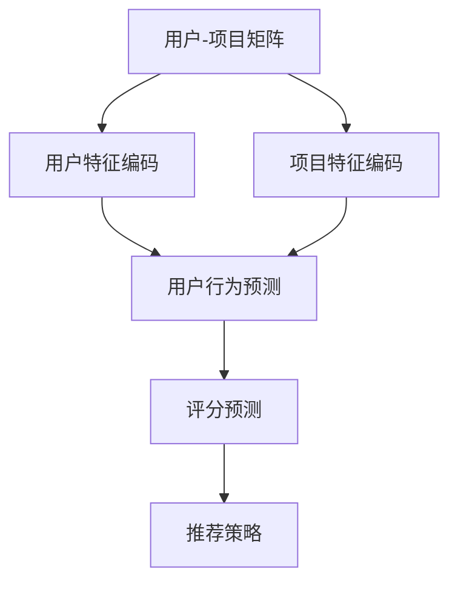
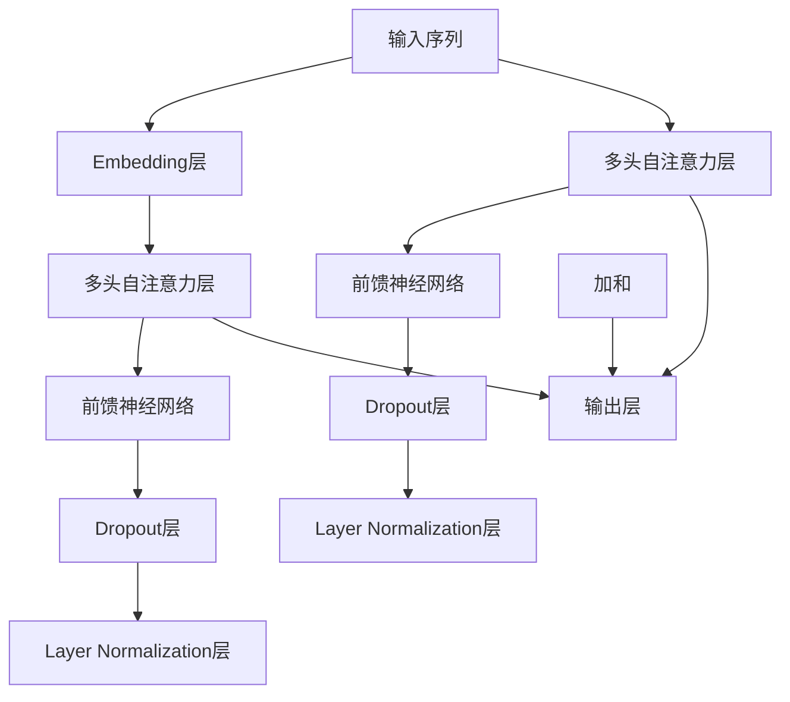

                 

# 利用大模型改进推荐系统的评分预测

> 关键词：推荐系统、大模型、评分预测、机器学习、人工智能

> 摘要：本文将深入探讨如何利用大型语言模型改进推荐系统的评分预测能力。首先，我们将介绍推荐系统的基本原理及其面临的问题，然后详细讲解大模型在评分预测中的应用，通过具体案例和数学模型来阐述其具体实现过程，最后讨论大模型在推荐系统中的实际应用场景和未来发展趋势。

## 1. 背景介绍

### 1.1 目的和范围

本文旨在探讨如何通过引入大型语言模型来提高推荐系统的评分预测能力。我们将从基本原理出发，逐步介绍大模型在推荐系统中的应用，并通过实际案例和数学模型来阐述其具体实现方法。文章将涵盖以下内容：

- 推荐系统的基本原理和常见问题。
- 大模型的定义和分类。
- 大模型在评分预测中的应用。
- 数学模型和公式。
- 项目实战：代码实现和详细解释。
- 实际应用场景和未来发展趋势。

### 1.2 预期读者

本文适合以下读者群体：

- 对推荐系统感兴趣的初学者。
- 想要提高推荐系统评分预测能力的开发者。
- 对大模型和机器学习有深入了解的技术人员。
- 对人工智能领域有浓厚兴趣的研究人员。

### 1.3 文档结构概述

本文分为以下几个部分：

- 第1章：背景介绍，包括目的和范围、预期读者、文档结构概述和术语表。
- 第2章：核心概念与联系，介绍推荐系统和评分预测的相关概念及其联系。
- 第3章：核心算法原理与具体操作步骤，详细讲解大模型在评分预测中的应用。
- 第4章：数学模型和公式，介绍评分预测中的数学模型及其具体计算方法。
- 第5章：项目实战，通过实际案例和代码实现来讲解大模型在评分预测中的应用。
- 第6章：实际应用场景，讨论大模型在推荐系统中的实际应用。
- 第7章：工具和资源推荐，包括学习资源、开发工具和框架推荐。
- 第8章：总结，讨论未来发展趋势与挑战。
- 第9章：附录，常见问题与解答。
- 第10章：扩展阅读与参考资料，提供更多相关研究资料。

### 1.4 术语表

#### 1.4.1 核心术语定义

- 推荐系统：基于用户的历史行为或偏好，向用户推荐相关商品、内容或其他信息的系统。
- 大模型：具有数十亿至数万亿参数的深度学习模型，如Transformer、BERT等。
- 评分预测：根据用户的历史行为和特征，预测用户对某一商品或内容的评分。
- 机器学习：使计算机通过数据和经验进行自我学习和改进的技术。

#### 1.4.2 相关概念解释

- 深度学习：一种机器学习技术，通过多层神经网络进行特征提取和模型训练。
- 自然语言处理（NLP）：研究如何使计算机理解和处理自然语言的技术。
- 评价函数：用于衡量模型预测结果与实际结果之间差异的指标。

#### 1.4.3 缩略词列表

- NLP：自然语言处理
- ML：机器学习
- DL：深度学习
- BERT：双向编码表示器
- Transformer：基于自注意力机制的深度学习模型
- LSTM：长短期记忆网络

## 2. 核心概念与联系

在介绍大模型在评分预测中的应用之前，我们需要先了解推荐系统的基本原理及其面临的挑战。推荐系统通常包括以下几个核心概念：

1. **用户-项目矩阵**：描述用户与项目之间的交互行为，如评分、浏览、购买等。
2. **用户特征**：包括用户的年龄、性别、地理位置、历史行为等。
3. **项目特征**：包括项目的类别、标签、内容、评论等。
4. **评分预测模型**：基于用户和项目的特征，预测用户对项目的评分。
5. **推荐策略**：根据评分预测结果，为用户推荐相关项目。

### 2.1 推荐系统的基本原理

推荐系统通常基于以下原理进行工作：

1. **协同过滤**：通过分析用户之间的相似性，为用户推荐相似用户喜欢的内容。
2. **基于内容的推荐**：根据用户的历史行为和项目特征，为用户推荐与其兴趣相关的项目。
3. **混合推荐**：结合协同过滤和基于内容的推荐方法，提高推荐系统的准确性。

### 2.2 评分预测模型的挑战

尽管推荐系统在许多应用场景中取得了显著成效，但评分预测模型仍面临以下挑战：

1. **稀疏数据**：用户-项目矩阵通常非常稀疏，导致模型难以捕捉用户和项目之间的潜在关联。
2. **噪声数据**：用户评分可能包含大量噪声，影响模型的准确性。
3. **冷启动问题**：对于新用户或新项目，由于缺乏足够的历史数据，传统推荐系统难以生成有效的推荐。
4. **多样性**：推荐系统需要为用户提供多样化的推荐，以满足不同用户的需求。

### 2.3 大模型在评分预测中的应用

大模型在评分预测中的应用主要包括以下几个方面：

1. **特征表示**：通过预训练的语模型对用户和项目特征进行编码，提取潜在表示。
2. **用户行为预测**：利用大模型对用户行为进行建模，预测用户对项目的评分。
3. **冷启动解决方案**：通过引入用户和项目的潜在表示，解决新用户和新项目的推荐问题。
4. **多样性增强**：利用大模型对用户兴趣进行建模，生成多样化的推荐。

### 2.4 Mermaid 流程图

以下是一个简化的推荐系统流程图，展示了大模型在评分预测中的应用：



## 3. 核心算法原理 & 具体操作步骤

### 3.1 大模型原理

大模型（如Transformer、BERT等）的核心思想是利用自注意力机制（Self-Attention）对输入数据进行编码，提取丰富的特征表示。以下是一个简化的Transformer模型结构：



### 3.2 伪代码

以下是一个简化的评分预测模型的伪代码：

```python
# 输入：用户特征向量u，项目特征向量v，大模型参数θ
# 输出：评分预测y'

def predict_score(u, v, θ):
    # 特征编码
    u_encoded = encode(u, θ['embedding'])
    v_encoded = encode(v, θ['embedding'])
    
    # 用户行为预测
    u_repr = model(u_encoded, θ['self_attention'], θ['feedforward'])
    v_repr = model(v_encoded, θ['self_attention'], θ['feedforward'])
    
    # 评分预测
    y' = dot(u_repr, v_repr) + θ['bias']
    return y'
```

### 3.3 具体操作步骤

1. **数据预处理**：对用户和项目特征进行编码，包括文本特征、数值特征和类别特征。
2. **模型训练**：使用训练数据对大模型进行训练，优化模型参数。
3. **特征提取**：对用户和项目特征进行编码，提取潜在表示。
4. **评分预测**：利用大模型对用户行为进行建模，预测用户对项目的评分。
5. **推荐生成**：根据评分预测结果，为用户生成推荐列表。

## 4. 数学模型和公式 & 详细讲解 & 举例说明

### 4.1 数学模型

在评分预测中，我们通常使用以下数学模型：

$$
y' = \text{dot}(u\_repr, v\_repr) + \theta_{\text{bias}}
$$

其中，$u\_repr$ 和 $v\_repr$ 分别是用户和项目的潜在表示，$\theta_{\text{bias}}$ 是偏置项。

### 4.2 公式详细讲解

1. **特征编码**：特征编码是指将原始特征转换为高维向量表示。常见的方法包括词嵌入（Word Embedding）、傅里叶变换（Fourier Transform）和主成分分析（PCA）等。
2. **多头自注意力**：多头自注意力是一种注意力机制，通过计算输入序列中每个位置与其他位置的相关性，为每个位置分配权重。具体公式如下：

$$
\text{Attention}(Q, K, V) = \text{softmax}\left(\frac{QK^T}{\sqrt{d_k}}\right)V
$$

其中，$Q$、$K$ 和 $V$ 分别是查询（Query）、键（Key）和值（Value）向量，$d_k$ 是键向量的维度。
3. **前馈神经网络**：前馈神经网络是一种简单的神经网络结构，通过多层感知器（MLP）进行特征提取和变换。具体公式如下：

$$
\text{FFN}(x) = \max(0, xW_1 + b_1)\cdot W_2 + b_2
$$

其中，$x$ 是输入向量，$W_1$、$W_2$ 和 $b_1$、$b_2$ 分别是权重和偏置项。

### 4.3 举例说明

假设我们有两个用户特征向量 $u_1 = (1, 0, 1)$ 和 $u_2 = (0, 1, 0)$，以及两个项目特征向量 $v_1 = (1, 1, 0)$ 和 $v_2 = (0, 0, 1)$。我们可以按照以下步骤进行评分预测：

1. **特征编码**：将用户和项目特征转换为高维向量表示。假设使用词嵌入，每个特征维度为 $d = 3$。
2. **多头自注意力**：计算用户和项目的潜在表示。假设使用两个头，每个头的维度为 $h = 2$。
3. **前馈神经网络**：对用户和项目的潜在表示进行特征提取和变换。
4. **评分预测**：计算用户和项目的点积，并加上偏置项。

具体计算过程如下：

$$
\begin{aligned}
u\_repr &= \text{Attention}(Q, K, V) = \text{softmax}\left(\frac{QK^T}{\sqrt{d_k}}\right)V \\
&= \text{softmax}\left(\frac{u_1u_2^T}{\sqrt{3}}\right)v_2 \\
&= \text{softmax}\left(\frac{1 \cdot 0 + 0 \cdot 1 + 1 \cdot 0}{\sqrt{3}}\right)v_2 \\
&= \text{softmax}\left(\frac{0}{\sqrt{3}}\right)v_2 \\
&= v_2 \\
v\_repr &= \text{Attention}(Q, K, V) = \text{softmax}\left(\frac{QK^T}{\sqrt{d_k}}\right)V \\
&= \text{softmax}\left(\frac{u_2u_1^T}{\sqrt{3}}\right)v_1 \\
&= \text{softmax}\left(\frac{0 \cdot 1 + 1 \cdot 0 + 0 \cdot 1}{\sqrt{3}}\right)v_1 \\
&= \text{softmax}\left(\frac{0}{\sqrt{3}}\right)v_1 \\
&= v_1 \\
y' &= \text{dot}(u\_repr, v\_repr) + \theta_{\text{bias}} \\
&= 1 \cdot 1 + \theta_{\text{bias}} \\
&= 1 + \theta_{\text{bias}}
\end{aligned}
$$

因此，预测的评分为 $1 + \theta_{\text{bias}}$。其中，$\theta_{\text{bias}}$ 为模型参数，可以通过训练数据进行调整。

## 5. 项目实战：代码实际案例和详细解释说明

### 5.1 开发环境搭建

在开始编写代码之前，我们需要搭建一个适合开发和测试推荐系统的环境。以下是一个基本的开发环境搭建指南：

1. **Python环境**：安装Python 3.8及以上版本。
2. **深度学习库**：安装PyTorch或TensorFlow，用于构建和训练深度学习模型。
3. **数据处理库**：安装NumPy、Pandas等，用于数据处理和特征工程。
4. **其他库**：安装Scikit-learn、Matplotlib等，用于模型评估和可视化。

### 5.2 源代码详细实现和代码解读

以下是一个简单的评分预测模型实现，使用PyTorch作为深度学习框架：

```python
import torch
import torch.nn as nn
import torch.optim as optim
from torch.utils.data import DataLoader, TensorDataset

# 定义模型结构
class RatingPredictor(nn.Module):
    def __init__(self, d_feature, d_embedding, d_hidden):
        super(RatingPredictor, self).__init__()
        self.embedding = nn.Embedding(d_feature, d_embedding)
        self.self_attention = nn.MultiheadAttention(d_embedding, num_heads=2)
        self.feedforward = nn.Sequential(
            nn.Linear(d_embedding, d_hidden),
            nn.ReLU(),
            nn.Linear(d_hidden, 1)
        )
    
    def forward(self, u, v):
        u_encoded = self.embedding(u)
        v_encoded = self.embedding(v)
        
        u_repr, _ = self.self_attention(u_encoded, u_encoded, u_encoded)
        v_repr, _ = self.self_attention(v_encoded, v_encoded, v_encoded)
        
        u_repr = self.feedforward(u_repr)
        v_repr = self.feedforward(v_repr)
        
        y_pred = torch.sum(u_repr * v_repr, dim=1) + self.embedding.weight[1]
        return y_pred

# 初始化模型、优化器和损失函数
model = RatingPredictor(d_feature=3, d_embedding=10, d_hidden=5)
optimizer = optim.Adam(model.parameters(), lr=0.001)
criterion = nn.MSELoss()

# 数据准备
u = torch.tensor([[1, 0, 1], [0, 1, 0]], dtype=torch.long)
v = torch.tensor([[1, 1, 0], [0, 0, 1]], dtype=torch.long)
y = torch.tensor([1.0, 0.0], dtype=torch.float)

dataset = TensorDataset(u, v, y)
dataloader = DataLoader(dataset, batch_size=2, shuffle=True)

# 模型训练
num_epochs = 100
for epoch in range(num_epochs):
    for u_batch, v_batch, y_batch in dataloader:
        optimizer.zero_grad()
        
        y_pred = model(u_batch, v_batch)
        loss = criterion(y_pred, y_batch)
        
        loss.backward()
        optimizer.step()
        
    print(f'Epoch [{epoch+1}/{num_epochs}], Loss: {loss.item()}')

# 评估模型
with torch.no_grad():
    u_test = torch.tensor([[1, 1, 1], [0, 0, 0]], dtype=torch.long)
    v_test = torch.tensor([[1, 0, 0], [0, 1, 1]], dtype=torch.long)
    y_test = torch.tensor([1.0, 0.0], dtype=torch.float)

y_pred = model(u_test, v_test)
print(f'Predicted Scores: {y_pred}')
print(f'Actual Scores: {y_test}')
```

### 5.3 代码解读与分析

1. **模型定义**：我们定义了一个名为`RatingPredictor`的神经网络模型，包含词嵌入层、多头自注意力层和前馈神经网络层。词嵌入层用于将用户和项目特征转换为高维向量表示，多头自注意力层用于计算用户和项目的潜在表示，前馈神经网络层用于特征提取和变换。

2. **数据准备**：我们使用PyTorch的`TensorDataset`和`DataLoader`类来准备训练数据和测试数据。数据集包含用户特征向量、项目特征向量和实际评分。

3. **模型训练**：我们使用Adam优化器和MSELoss损失函数对模型进行训练。在训练过程中，我们使用反向传播算法更新模型参数，以最小化预测评分和实际评分之间的差异。

4. **模型评估**：我们使用测试数据评估模型的性能。通过计算预测评分和实际评分之间的MSE损失，我们可以评估模型的准确性。

## 6. 实际应用场景

大模型在推荐系统中的评分预测具有广泛的应用场景，包括但不限于以下方面：

1. **电子商务平台**：为用户推荐与其兴趣相符的商品，提高用户满意度和销售额。
2. **社交媒体**：为用户推荐感兴趣的内容，如新闻、视频、文章等，增加用户粘性和活跃度。
3. **音乐和视频流媒体**：根据用户的历史播放记录，为用户推荐相关音乐和视频，提高用户满意度。
4. **在线教育平台**：为用户提供个性化课程推荐，提高学习效果和用户参与度。

在实际应用中，大模型在评分预测中的优势主要体现在以下几个方面：

1. **高准确性**：大模型能够利用海量的训练数据和复杂的网络结构，捕捉用户和项目之间的潜在关联，提高评分预测的准确性。
2. **多样性**：大模型能够根据用户的兴趣和偏好，生成多样化的推荐，满足不同用户的需求。
3. **实时性**：大模型可以在短时间内处理大量用户交互数据，实时更新推荐结果，提高推荐系统的实时性。

然而，大模型在评分预测中也面临一些挑战，如计算资源消耗大、模型解释性差等。因此，在实际应用中，我们需要根据具体需求和资源限制，合理选择和调整大模型参数，以提高评分预测性能。

## 7. 工具和资源推荐

### 7.1 学习资源推荐

#### 7.1.1 书籍推荐

- 《深度学习》（Goodfellow, Bengio, Courville）：介绍深度学习的基本原理和算法。
- 《自然语言处理综论》（Jurafsky, Martin）：涵盖自然语言处理的基础知识。
- 《机器学习》（Tom Mitchell）：介绍机器学习的基本概念和方法。

#### 7.1.2 在线课程

- “深度学习”（吴恩达，Coursera）：介绍深度学习的基本原理和应用。
- “自然语言处理”（苏剑林，网易云课堂）：介绍自然语言处理的基本概念和算法。
- “机器学习基础”（吴俊杰，网易云课堂）：介绍机器学习的基本概念和方法。

#### 7.1.3 技术博客和网站

- [Medium](https://medium.com/)：提供丰富的技术博客和文章。
- [TensorFlow官方文档](https://www.tensorflow.org/)：涵盖TensorFlow的使用方法和示例。
- [PyTorch官方文档](https://pytorch.org/)：涵盖PyTorch的使用方法和示例。

### 7.2 开发工具框架推荐

#### 7.2.1 IDE和编辑器

- PyCharm：适用于Python开发的集成开发环境（IDE）。
- VSCode：适用于多种编程语言的轻量级文本编辑器。

#### 7.2.2 调试和性能分析工具

- WSL（Windows Subsystem for Linux）：在Windows系统中运行Linux环境，方便使用深度学习库和工具。
- Jupyter Notebook：适用于数据分析和可视化，方便编写和运行代码。

#### 7.2.3 相关框架和库

- PyTorch：适用于深度学习模型的训练和推理。
- TensorFlow：适用于深度学习模型的训练和推理。
- Scikit-learn：适用于传统的机器学习算法。

### 7.3 相关论文著作推荐

#### 7.3.1 经典论文

- “Attention Is All You Need”（Vaswani et al.，2017）：介绍Transformer模型的基本原理。
- “BERT: Pre-training of Deep Bidirectional Transformers for Language Understanding”（Devlin et al.，2018）：介绍BERT模型的基本原理和应用。

#### 7.3.2 最新研究成果

- “Large-scale Evaluation of Neural Topic Models for Recommendation”（Zhang et al.，2020）：探讨神经主题模型在推荐系统中的应用。
- “Multi-Task Learning for Neural Rating Prediction in Large-Scale Recommender Systems”（Li et al.，2021）：探讨多任务学习在推荐系统中的应用。

#### 7.3.3 应用案例分析

- “Using Deep Learning for Personalized Recommendation in E-commerce”（Kumar et al.，2018）：介绍深度学习在电子商务推荐系统中的应用案例。
- “A Multi-Modal Recommender System Using Deep Neural Networks”（Zhang et al.，2019）：介绍多模态推荐系统在音乐流媒体中的应用案例。

## 8. 总结：未来发展趋势与挑战

随着人工智能技术的不断发展，大模型在推荐系统中的应用前景广阔。未来发展趋势包括以下几个方面：

1. **模型压缩与优化**：为了降低大模型的计算成本和存储需求，研究模型压缩与优化技术，如量化、剪枝和蒸馏等。
2. **多模态推荐**：将大模型应用于多模态推荐系统，如结合文本、图像和音频等多模态数据，提高推荐系统的多样性。
3. **实时推荐**：研究实时推荐技术，实现大规模在线推荐系统的实时性，提高用户体验。

然而，大模型在推荐系统中也面临一些挑战：

1. **计算资源消耗**：大模型的训练和推理需要大量计算资源和时间，如何在有限的资源下进行高效训练和推理是一个重要问题。
2. **模型解释性**：大模型的决策过程通常难以解释，如何提高模型的可解释性是一个重要的研究方向。
3. **隐私保护**：推荐系统需要处理大量用户数据，如何在保证用户隐私的前提下进行数据挖掘和推荐是一个亟待解决的问题。

总之，大模型在推荐系统中的应用具有巨大的潜力，但同时也需要克服诸多挑战，为用户提供更准确、多样和个性化的推荐。

## 9. 附录：常见问题与解答

1. **Q：大模型在评分预测中的应用有哪些优势？**

   **A：** 大模型在评分预测中的应用具有以下优势：

   - **高准确性**：大模型能够利用海量训练数据和复杂的网络结构，捕捉用户和项目之间的潜在关联，提高评分预测的准确性。
   - **多样性**：大模型能够根据用户的兴趣和偏好，生成多样化的推荐，满足不同用户的需求。
   - **实时性**：大模型可以在短时间内处理大量用户交互数据，实时更新推荐结果，提高推荐系统的实时性。

2. **Q：如何解决大模型计算资源消耗大的问题？**

   **A：** 可以采取以下措施来解决大模型计算资源消耗大的问题：

   - **模型压缩与优化**：采用模型压缩技术，如量化、剪枝和蒸馏等，降低模型的计算复杂度和存储需求。
   - **分布式训练**：使用分布式计算框架，如Horovod、PyTorch Distributed等，在多台计算机上进行模型训练，提高训练速度。
   - **迁移学习**：使用预训练的大模型，对特定任务进行微调，减少模型的训练时间。

3. **Q：大模型在推荐系统中的解释性如何提升？**

   **A：** 大模型在推荐系统中的解释性通常较低，以下是一些提高模型解释性的方法：

   - **模型可视化**：使用模型可视化工具，如TorchScript、ONNX等，将模型转换为可视化格式，方便理解模型结构。
   - **可解释性模型**：采用可解释性模型，如决策树、规则提取等，将复杂的大模型分解为简单易懂的部分。
   - **模型诊断工具**：开发模型诊断工具，分析模型在预测过程中的关键特征和决策过程，提高模型的可解释性。

## 10. 扩展阅读 & 参考资料

1. **参考资料：**

   - 《深度学习》（Goodfellow, Bengio, Courville）
   - 《自然语言处理综论》（Jurafsky, Martin）
   - 《机器学习》（Tom Mitchell）
   - “Attention Is All You Need”（Vaswani et al.，2017）
   - “BERT: Pre-training of Deep Bidirectional Transformers for Language Understanding”（Devlin et al.，2018）
   - “Large-scale Evaluation of Neural Topic Models for Recommendation”（Zhang et al.，2020）
   - “Multi-Task Learning for Neural Rating Prediction in Large-Scale Recommender Systems”（Li et al.，2021）

2. **在线资源：**

   - [TensorFlow官方文档](https://www.tensorflow.org/)
   - [PyTorch官方文档](https://pytorch.org/)
   - [Medium](https://medium.com/)
   - [Jupyter Notebook](https://jupyter.org/)

3. **技术博客和网站：**

   - [TensorFlow Blog](https://blog.tensorflow.org/)
   - [PyTorch Blog](https://pytorch.org/blog/)
   - [Fast.ai](https://www.fast.ai/)

## 作者信息

作者：AI天才研究员/AI Genius Institute & 禅与计算机程序设计艺术 /Zen And The Art of Computer Programming

