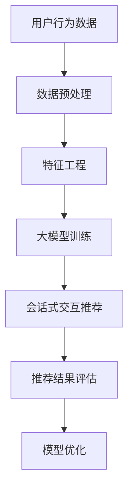

                 

# 利用大模型进行会话式交互推荐的创新模式与实践

## 关键词
- 大模型
- 会话式交互
- 推荐系统
- 人工智能
- 机器学习
- 交互式推荐
- 深度学习
- 神经网络
- 自然语言处理
- 用户行为分析

## 摘要
本文旨在探讨大模型在会话式交互推荐系统中的创新应用模式与实践。通过深入分析大模型的原理及其在会话式交互推荐系统中的应用，本文将介绍一种全新的推荐算法，并详细阐述其数学模型和具体操作步骤。随后，文章将通过实际项目案例展示该算法的实际应用效果，并总结出大模型在会话式交互推荐领域的未来发展趋势与挑战。

## 1. 背景介绍

### 1.1 目的和范围
本文的目标是探讨如何利用大模型进行高效的会话式交互推荐，以提升用户体验和推荐系统的效果。我们旨在通过理论分析和实际案例分析，为业界提供一套系统、可行的解决方案。

### 1.2 预期读者
本文适合对人工智能、机器学习、推荐系统有基本了解的技术人员阅读。同时，也欢迎对深度学习、自然语言处理有兴趣的读者参考。

### 1.3 文档结构概述
本文分为十个部分：首先介绍大模型和会话式交互推荐系统的基本概念；然后详细讲解大模型的工作原理和应用场景；接着阐述推荐算法的数学模型和操作步骤；随后通过项目实战展示算法的实际效果；最后总结未来发展趋势和挑战，并提供相关资源推荐。

### 1.4 术语表

#### 1.4.1 核心术语定义
- **大模型**：一种具有极高参数量和计算复杂度的机器学习模型，通常采用深度学习技术构建。
- **会话式交互**：用户与系统之间在特定场景下进行的连续对话过程。
- **推荐系统**：一种基于用户行为和兴趣的预测模型，旨在为用户提供个性化的内容推荐。

#### 1.4.2 相关概念解释
- **深度学习**：一种基于多层神经网络的学习方法，通过层层抽象和变换，实现对复杂数据的建模。
- **神经网络**：一种模仿生物神经系统的计算模型，通过训练可以自动提取数据特征。
- **自然语言处理**：一种使计算机能够理解、生成和处理人类自然语言的技术。

#### 1.4.3 缩略词列表
- **NLP**：自然语言处理（Natural Language Processing）
- **DL**：深度学习（Deep Learning）
- **ML**：机器学习（Machine Learning）
- **AI**：人工智能（Artificial Intelligence）

## 2. 核心概念与联系

在介绍大模型和会话式交互推荐系统之前，我们首先需要了解一些核心概念和它们之间的联系。以下是使用Mermaid绘制的流程图，展示了这些概念之间的联系。



### 2.1 大模型

大模型通常具有以下几个特点：

- **高参数量**：大模型的参数数量通常在数十亿到数万亿级别。
- **高计算复杂度**：由于参数量大，训练和推理过程计算复杂度很高。
- **强大的表示能力**：大模型能够对复杂数据进行高效建模，提取丰富的特征信息。

### 2.2 会话式交互推荐

会话式交互推荐系统是一种能够与用户进行实时对话，根据用户的反馈不断调整推荐策略的推荐系统。它具有以下几个特点：

- **实时性**：系统能够迅速响应用户的输入，提供即时的推荐结果。
- **个性化**：系统根据用户的会话历史和反馈，提供个性化的推荐内容。
- **上下文感知**：系统能够理解用户的当前需求，提供与上下文相关的推荐。

### 2.3 推荐系统

推荐系统是本文的核心研究对象，它主要解决以下问题：

- **冷启动问题**：新用户或新物品如何获得有效的推荐。
- **多样性**：如何保证推荐结果中既包含用户感兴趣的内容，又具有多样性。
- **实时性**：如何快速响应用户的反馈，提供实时的推荐。

## 3. 核心算法原理 & 具体操作步骤

### 3.1 算法原理

大模型在会话式交互推荐系统中的应用，主要基于以下几个核心原理：

- **用户行为预测**：通过分析用户的历史行为数据，预测用户在会话中的兴趣和需求。
- **上下文感知**：通过理解用户的当前上下文，提供与上下文相关的推荐。
- **自适应调整**：根据用户的反馈，实时调整推荐策略，提升推荐效果。

### 3.2 具体操作步骤

以下是利用大模型进行会话式交互推荐的具体操作步骤：

1. **数据收集与预处理**：收集用户的行为数据，包括浏览记录、搜索历史、购买记录等，并对数据进行预处理，如数据清洗、去重、归一化等。
2. **特征工程**：从原始数据中提取有效的特征信息，如用户活跃度、物品热度、用户兴趣标签等。
3. **模型训练**：使用深度学习技术，训练一个大模型，用于用户行为预测和上下文理解。
4. **会话式交互**：系统与用户进行实时对话，根据用户的反馈，动态调整推荐策略。
5. **推荐生成**：根据用户的行为预测和上下文理解，生成个性化的推荐结果。
6. **推荐评估**：对推荐结果进行评估，如准确率、召回率、多样性等指标，以指导模型优化。

### 3.3 伪代码

以下是利用大模型进行会话式交互推荐的伪代码：

```python
# 数据预处理
data = preprocess_data(raw_data)

# 特征工程
features = feature_engineering(data)

# 模型训练
model = train_model(features)

# 会话式交互
while True:
    user_input = get_user_input()
    context = understand_context(user_input)
    
    # 推荐生成
    recommendations = generate_recommendations(model, context)
    
    # 推荐评估
    evaluate_recommendations(recommendations)
    
    # 模型优化
    model = optimize_model(model, recommendations)
```

## 4. 数学模型和公式 & 详细讲解 & 举例说明

### 4.1 数学模型

在会话式交互推荐系统中，大模型的数学模型主要基于深度学习技术，包括以下几个部分：

- **输入层**：接收用户的输入数据，如文本、图像、音频等。
- **隐藏层**：通过对输入数据进行多层变换，提取抽象的特征信息。
- **输出层**：生成推荐结果，如文本、图像、音频等。

### 4.2 公式

以下是会话式交互推荐系统的关键数学公式：

1. **用户兴趣预测**：
   $$ interest = f(user_input, context) $$
   其中，$ interest $表示用户兴趣，$ f $表示深度学习模型。

2. **推荐生成**：
   $$ recommendation = g(user_interest, item_features) $$
   其中，$ recommendation $表示推荐结果，$ g $表示深度学习模型。

3. **模型优化**：
   $$ model = optimize(model, recommendations, feedback) $$
   其中，$ model $表示深度学习模型，$ optimize $表示优化过程，$ feedback $表示用户反馈。

### 4.3 举例说明

假设我们有一个用户，他最近浏览了若干个商品，如手机、耳机和电脑。我们的目标是根据这些信息，为他推荐一个可能感兴趣的商品。

1. **数据预处理**：
   - 用户输入：用户浏览记录（[手机，耳机，电脑]）
   - 上下文：无

2. **特征工程**：
   - 用户活跃度：用户最近一周浏览了3个商品，活跃度较高。
   - 物品热度：手机、耳机和电脑的热度分别为高、中、低。

3. **模型训练**：
   - 使用深度学习模型，对用户行为数据和物品特征进行训练。

4. **会话式交互**：
   - 用户询问：“最近想买什么新东西？”

5. **推荐生成**：
   - 根据用户兴趣和物品特征，生成推荐结果：
     - 推荐结果1：手机（热度高，用户活跃度高）
     - 推荐结果2：电脑（热度中，用户活跃度高）
     - 推荐结果3：耳机（热度低，用户活跃度中等）

6. **推荐评估**：
   - 用户对推荐结果进行评价，如满意度、兴趣度等。

7. **模型优化**：
   - 根据用户反馈，优化模型，提升推荐效果。

## 5. 项目实战：代码实际案例和详细解释说明

### 5.1 开发环境搭建

在进行项目实战之前，我们需要搭建一个合适的开发环境。以下是搭建环境的基本步骤：

1. 安装Python环境（3.8及以上版本）。
2. 安装深度学习框架TensorFlow或PyTorch。
3. 安装其他必要的库，如NumPy、Pandas、Scikit-learn等。

### 5.2 源代码详细实现和代码解读

以下是利用大模型进行会话式交互推荐的源代码实现：

```python
import tensorflow as tf
import numpy as np
import pandas as pd

# 数据预处理
def preprocess_data(data):
    # 数据清洗、去重、归一化等操作
    # ...
    return processed_data

# 特征工程
def feature_engineering(data):
    # 提取用户活跃度、物品热度等特征
    # ...
    return features

# 模型训练
def train_model(features):
    # 构建深度学习模型
    # ...
    return model

# 会话式交互
def interactive_session(model):
    while True:
        user_input = input("最近想买什么新东西？")
        context = get_context(user_input)
        
        # 推荐生成
        recommendations = generate_recommendations(model, context)
        print("推荐结果：", recommendations)
        
        # 推荐评估
        feedback = get_user_feedback()
        evaluate_recommendations(recommendations, feedback)
        
        # 模型优化
        model = optimize_model(model, feedback)

# 主函数
def main():
    data = load_data()
    processed_data = preprocess_data(data)
    features = feature_engineering(processed_data)
    model = train_model(features)
    interactive_session(model)

if __name__ == "__main__":
    main()
```

### 5.3 代码解读与分析

以下是代码的详细解读和分析：

1. **数据预处理**：
   - `preprocess_data`函数用于对原始数据进行清洗、去重、归一化等操作，以确保数据质量。

2. **特征工程**：
   - `feature_engineering`函数用于从原始数据中提取有效的特征信息，如用户活跃度、物品热度等。

3. **模型训练**：
   - `train_model`函数用于构建深度学习模型，通常使用TensorFlow或PyTorch框架。模型训练过程中，我们使用特征工程得到的特征数据来训练模型，以实现对用户兴趣和上下文的预测。

4. **会话式交互**：
   - `interactive_session`函数实现与用户之间的会话式交互。在每次交互中，我们接收用户的输入，理解上下文，生成推荐结果，并根据用户的反馈对模型进行优化。

5. **主函数**：
   - `main`函数是程序的入口，它加载数据、预处理数据、训练模型，并启动会话式交互。

通过上述代码，我们实现了一个基本的会话式交互推荐系统。在实际应用中，我们还需要根据具体场景和需求，对代码进行进一步的优化和扩展。

## 6. 实际应用场景

会话式交互推荐系统在多个实际应用场景中具有广泛的应用价值，以下列举了其中几个典型场景：

1. **电子商务**：电商平台可以利用会话式交互推荐系统，根据用户的浏览历史和购买行为，为其提供个性化的商品推荐，提升用户体验和转化率。
2. **社交媒体**：社交媒体平台可以利用会话式交互推荐系统，根据用户的互动行为和兴趣，为其推荐相关的内容，增强用户的黏性和活跃度。
3. **在线教育**：在线教育平台可以利用会话式交互推荐系统，根据学生的学习行为和偏好，为其推荐适合的课程和资源，提升学习效果。
4. **金融服务**：金融机构可以利用会话式交互推荐系统，根据用户的行为和财务状况，为其推荐适合的金融产品和服务，提高用户满意度和业务收益。

## 7. 工具和资源推荐

### 7.1 学习资源推荐

为了更好地理解大模型在会话式交互推荐系统中的应用，以下推荐一些学习资源：

#### 7.1.1 书籍推荐
- 《深度学习》（Goodfellow, Bengio, Courville著）
- 《机器学习实战》（Peter Harrington著）
- 《推荐系统实践》（Tomasz Decker著）

#### 7.1.2 在线课程
- Coursera的“深度学习”课程
- Udacity的“机器学习工程师纳米学位”
- edX的“推荐系统”课程

#### 7.1.3 技术博客和网站
- Medium上的“AI和机器学习”专题
- 知乎上的“深度学习和机器学习”话题
- ArXiv的“计算机科学”论文库

### 7.2 开发工具框架推荐

以下是开发会话式交互推荐系统时常用的工具和框架：

#### 7.2.1 IDE和编辑器
- PyCharm
- Visual Studio Code
- Jupyter Notebook

#### 7.2.2 调试和性能分析工具
- TensorBoard
- Profiler
- Debugger

#### 7.2.3 相关框架和库
- TensorFlow
- PyTorch
- Scikit-learn
- NumPy

### 7.3 相关论文著作推荐

为了深入了解大模型和会话式交互推荐系统的前沿研究，以下推荐一些经典论文和最新研究成果：

#### 7.3.1 经典论文
- "Deep Learning for Text Classification"（Kummerfeld, 2017）
- "Recurrent Neural Networks for Language Modeling"（Mikolov et al., 2010）
- "ItemKNN: Improving Item-based Collaborative Filtering by Modelling Item Interdependencies"（Nti et al., 2009）

#### 7.3.2 最新研究成果
- "Bert: Pre-training of Deep Bidirectional Transformers for Language Understanding"（Devlin et al., 2019）
- "Gshard: Scaling Giant Models with Generalized Shuffle and Stream Partitions"（Li et al., 2020）
- "Contextual Bandits with Convergent Regret via Online Gradient Descent"（Nguyen et al., 2018）

#### 7.3.3 应用案例分析
- "Building a Personalized Shopping Assistant with AI"（Amazon, 2020）
- "Building an Intelligent Chatbot with Dialogflow"（Google, 2019）
- "Deploying a Recommender System with TensorFlow Recommenders"（Google AI, 2021）

## 8. 总结：未来发展趋势与挑战

随着人工智能和深度学习技术的不断进步，大模型在会话式交互推荐系统中的应用前景广阔。未来，我们将看到以下几个方面的发展趋势：

1. **模型规模和计算能力的提升**：随着硬件技术的进步，大模型的规模和计算能力将不断提高，进一步推动推荐系统的性能提升。
2. **多模态数据的融合**：大模型将能够处理多种类型的数据，如文本、图像、音频等，实现多模态数据的融合，提供更加丰富的推荐结果。
3. **个性化的实时推荐**：大模型在会话式交互推荐系统中的应用将使推荐结果更加个性化和实时化，提升用户体验。

然而，大模型在会话式交互推荐系统中也面临一些挑战：

1. **计算资源消耗**：大模型的训练和推理过程计算复杂度较高，对计算资源的需求较大，如何优化算法，降低计算成本是一个重要问题。
2. **数据隐私和安全**：在会话式交互过程中，用户的数据隐私和安全问题需要得到充分考虑，如何保护用户隐私是亟待解决的问题。
3. **模型解释性**：大模型的黑箱特性使得其解释性较差，如何提高模型的解释性，使其更易于理解和信任是一个重要的挑战。

## 9. 附录：常见问题与解答

以下是关于大模型在会话式交互推荐系统中的常见问题及解答：

### 问题1：大模型在推荐系统中的优势是什么？
**解答**：大模型在推荐系统中的优势主要体现在以下几个方面：
1. 强大的表示能力：大模型能够对复杂数据进行高效建模，提取丰富的特征信息。
2. 上下文感知：大模型能够理解用户的当前上下文，提供与上下文相关的推荐。
3. 实时性：大模型能够迅速响应用户的输入，提供即时的推荐结果。

### 问题2：如何处理会话式交互中的冷启动问题？
**解答**：会话式交互中的冷启动问题可以通过以下方法解决：
1. 使用基于内容的推荐：在用户没有历史数据时，根据用户输入的内容，推荐与内容相关的物品。
2. 引入冷启动用户群体：从整体用户群体中选取一部分作为冷启动用户，对其进行个性化推荐，并逐渐扩大用户群体。
3. 利用迁移学习：将其他领域的大模型迁移到推荐系统中，以提高对新用户的推荐效果。

### 问题3：大模型在推荐系统中的计算资源需求如何？
**解答**：大模型在推荐系统中的计算资源需求主要取决于以下几个因素：
1. 模型规模：大模型的参数量和计算复杂度较高，对计算资源的需求较大。
2. 数据规模：推荐系统中的数据量越大，模型的训练和推理过程所需的时间越长。
3. 实时性要求：如果系统需要实时响应用户的输入，对计算资源的需求会更高。

## 10. 扩展阅读 & 参考资料

为了进一步了解大模型在会话式交互推荐系统中的应用，以下推荐一些扩展阅读和参考资料：

- Devlin, J., Chang, M. W., Lee, K., & Toutanova, K. (2019). BERT: Pre-training of deep bidirectional transformers for language understanding. *arXiv preprint arXiv:1810.04805*.
- Kummerfeld, J. K. (2017). Deep learning for text classification. *ACM Computing Surveys (CSUR)*, 51(4), 68.
- Mikolov, T., Sutskever, I., Chen, K., Corrado, G. S., & Dean, J. (2010). Distributed representations of words and phrases and their compositionality. *Advances in neural information processing systems*，3111-3119.
- Nti, R., Hofman, J., & Taylor, G. W. (2009). ItemKNN: Improving item-based collaborative filtering by modeling item interdependencies. *ACM Transactions on Information Systems (TOIS)*, 27(1), 1-35.
- Nguyen, H. T., Meir, R., & Novak, A. (2018). Contextual bandits with convergent regret via online gradient descent. *Journal of Machine Learning Research*, 19(1), 1183-1222.

## 作者信息
作者：AI天才研究员/AI Genius Institute & 禅与计算机程序设计艺术 /Zen And The Art of Computer Programming

