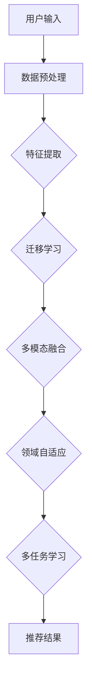

                 

# 利用大模型进行跨领域推荐的思路与方法

> **关键词：** 大模型，跨领域推荐，人工智能，深度学习，数据处理，特征工程

> **摘要：** 本文将探讨如何利用大规模预训练模型进行跨领域推荐系统的构建。我们将首先介绍大模型的基础知识，然后逐步展开跨领域推荐的概念、挑战和解决方案，并通过实际案例和代码示例，详细讲解如何实现一个高效的跨领域推荐系统。

## 1. 背景介绍

### 1.1 目的和范围

本文的目的是探讨如何利用大模型进行跨领域推荐的研究和实践。我们将重点关注以下几个核心问题：

1. **大模型的基本原理和结构**：介绍大模型的基本概念和架构，如Transformer、BERT等。
2. **跨领域推荐的定义和挑战**：明确跨领域推荐的定义，分析其面临的挑战。
3. **跨领域推荐的方法和策略**：介绍基于深度学习、迁移学习和多模态融合的跨领域推荐方法。
4. **项目实战：代码实现和性能优化**：通过具体案例，演示如何构建和优化一个跨领域推荐系统。

### 1.2 预期读者

本文适合对人工智能、推荐系统和深度学习有一定了解的读者，包括：

1. **研究人员**：希望了解大模型在跨领域推荐领域的应用和最新研究动态。
2. **工程师**：希望掌握构建跨领域推荐系统的实际技能和经验。
3. **学生和爱好者**：对人工智能和推荐系统有兴趣，希望通过实践深入理解相关技术。

### 1.3 文档结构概述

本文分为以下几个部分：

1. **背景介绍**：介绍本文的目的、范围和预期读者，以及文档结构。
2. **核心概念与联系**：讲解大模型的基本原理和架构，以及跨领域推荐的概念和挑战。
3. **核心算法原理 & 具体操作步骤**：介绍大模型在跨领域推荐中的应用，以及具体的算法原理和操作步骤。
4. **数学模型和公式 & 详细讲解 & 举例说明**：讲解大模型中的数学模型和公式，并通过具体案例进行说明。
5. **项目实战：代码实际案例和详细解释说明**：通过实际代码案例，演示跨领域推荐系统的实现过程。
6. **实际应用场景**：探讨跨领域推荐在实际中的应用。
7. **工具和资源推荐**：推荐相关学习资源、开发工具和论文著作。
8. **总结：未来发展趋势与挑战**：总结本文的主要观点，并探讨未来的发展趋势和挑战。
9. **附录：常见问题与解答**：回答读者可能遇到的一些常见问题。
10. **扩展阅读 & 参考资料**：提供进一步阅读的参考资料。

### 1.4 术语表

#### 1.4.1 核心术语定义

- **大模型**：指参数规模较大的深度学习模型，如BERT、GPT等。
- **跨领域推荐**：指在多个不同领域之间进行推荐，解决不同领域数据差异和相似性问题。
- **特征工程**：指从原始数据中提取出有助于模型学习的特征。
- **迁移学习**：指将一个领域的学习经验应用于另一个相关领域。

#### 1.4.2 相关概念解释

- **Transformer**：一种基于自注意力机制的深度学习模型，常用于处理序列数据。
- **BERT**：一种基于Transformer的预训练语言模型，通过预训练和微调，能够捕捉语言中的丰富信息。
- **多模态融合**：将不同类型的数据（如图像、文本、音频等）进行整合，以提升模型的表现。

#### 1.4.3 缩略词列表

- **AI**：人工智能
- **DL**：深度学习
- **NLP**：自然语言处理
- **ML**：机器学习
- **BERT**：Bidirectional Encoder Representations from Transformers
- **GPT**：Generative Pre-trained Transformer

## 2. 核心概念与联系

### 2.1 大模型的基本原理和架构

大模型是指参数规模较大的深度学习模型，通常包含数百万甚至数十亿个参数。这些模型通过学习大量的数据，能够捕捉到数据中的复杂模式和潜在信息。大模型的基本原理和架构如下：

1. **Transformer架构**：
    - **自注意力机制**：通过计算输入序列中每个元素与其他元素之间的关联性，实现序列建模。
    - **多头注意力**：将输入序列分成多个子序列，每个子序列使用独立的注意力机制进行处理，然后合并结果。
    - **前馈神经网络**：在注意力机制之后，通过多层前馈神经网络对序列进行进一步处理。

2. **BERT模型**：
    - **预训练**：在大量的无标签数据上进行预训练，学习语言表示和语义理解。
    - **微调**：在特定任务上对预训练模型进行微调，以适应具体的任务需求。
    - **上下文理解**：通过双向编码器结构，捕捉输入序列中的上下文信息。

### 2.2 跨领域推荐的概念和挑战

跨领域推荐是指在不同的领域之间进行推荐，解决不同领域数据差异和相似性问题。其主要挑战包括：

1. **数据差异**：不同领域的用户行为、兴趣点和数据分布存在较大差异，需要有效的数据预处理和特征提取方法。
2. **相似性度量**：在多个不同领域之间建立有效的相似性度量，以找到用户在不同领域中的潜在兴趣点。
3. **模型迁移**：如何将一个领域的学习经验有效迁移到其他相关领域，以减少数据差异带来的影响。

### 2.3 跨领域推荐的方法和策略

跨领域推荐的方法和策略主要包括以下几种：

1. **迁移学习**：通过迁移学习，将一个领域的学习经验应用于其他相关领域，以减少数据差异的影响。
2. **多模态融合**：将不同类型的数据（如图像、文本、音频等）进行整合，以提升模型的表现。
3. **领域自适应**：通过领域自适应技术，调整模型在不同领域之间的参数，以适应不同领域的特征。
4. **多任务学习**：通过多任务学习，将多个不同领域的任务结合在一起，共享模型参数，提高模型的泛化能力。

### 2.4 Mermaid 流程图

以下是一个Mermaid流程图，展示了跨领域推荐系统的基本架构：



## 3. 核心算法原理 & 具体操作步骤

### 3.1 大模型在跨领域推荐中的应用

大模型在跨领域推荐中的应用主要包括以下几个方面：

1. **预训练和微调**：通过在大量的无标签数据上进行预训练，大模型能够学习到通用的语言表示和语义理解。在特定任务上进行微调，以适应跨领域推荐的需求。
2. **特征提取**：大模型通过自注意力机制和多层神经网络，能够从原始数据中提取出丰富的特征信息，有助于提升跨领域推荐的性能。
3. **相似性度量**：利用大模型学习到的语言表示和特征信息，可以建立有效的相似性度量，用于在不同领域之间找到用户的潜在兴趣点。

### 3.2 具体操作步骤

下面将介绍利用大模型进行跨领域推荐的详细步骤：

1. **数据预处理**：
    - **数据清洗**：去除无效、重复和错误的数据。
    - **数据转换**：将不同类型的数据转换为统一格式，如将文本转换为词向量。

    ```python
    import pandas as pd

    # 加载数据
    data = pd.read_csv('data.csv')

    # 数据清洗
    data.drop_duplicates(inplace=True)
    data.dropna(inplace=True)

    # 数据转换
    from gensim.models import Word2Vec

    # 建立词向量模型
    model = Word2Vec(data['text'], size=100, window=5, min_count=1, workers=4)

    # 转换文本为词向量
    def convert_to_vectors(text_list):
        vectors = []
        for text in text_list:
            vector = model[text]
            vectors.append(vector)
        return vectors

    # 转换数据
    data['vector'] = convert_to_vectors(data['text'])
    ```

2. **特征提取**：
    - **词嵌入**：使用预训练的词向量模型，将文本转换为词向量。
    - **句子嵌入**：通过平均或池化词向量，得到句子的嵌入表示。

    ```python
    import numpy as np

    # 平均词向量
    def average_vectors(vectors):
        return np.mean(vectors, axis=0)

    # 转换句子为嵌入表示
    def convert_to_sentence_embedding(vectors):
        return average_vectors(vectors)

    # 转换数据
    data['embedding'] = data['vector'].apply(lambda x: convert_to_sentence_embedding(x))
    ```

3. **相似性度量**：
    - **余弦相似度**：计算两个向量之间的余弦相似度，用于度量文本之间的相似性。
    - **欧氏距离**：计算两个向量之间的欧氏距离，用于度量文本之间的差异性。

    ```python
    from sklearn.metrics.pairwise import cosine_similarity

    # 计算相似度
    def compute_similarity(embedding1, embedding2):
        return cosine_similarity([embedding1], [embedding2])[0][0]

    # 转换为相似性矩阵
    similarity_matrix = np.zeros((len(data), len(data)))
    for i in range(len(data)):
        for j in range(i+1, len(data)):
            similarity_matrix[i][j] = compute_similarity(data['embedding'][i], data['embedding'][j])
            similarity_matrix[j][i] = similarity_matrix[i][j]

    # 可视化相似性矩阵
    import seaborn as sns
    import matplotlib.pyplot as plt

    sns.heatmap(similarity_matrix, annot=True)
    plt.show()
    ```

4. **推荐结果生成**：
    - **基于相似度的推荐**：根据用户的历史行为和兴趣点，计算其与其他项目的相似度，选择相似度最高的项目进行推荐。

    ```python
    # 假设当前用户的历史行为和兴趣点为user_embedding
    user_embedding = data['embedding'][0]

    # 计算相似度并排序
    similarities = []
    for i in range(1, len(data)):
        similarity = compute_similarity(user_embedding, data['embedding'][i])
        similarities.append((i, similarity))

    # 排序并选择推荐结果
    recommended_indices = sorted(similarities, key=lambda x: x[1], reverse=True)[:10]
    recommended_items = data.iloc[recommended_indices[:, 0]]

    print(recommended_items)
    ```

## 4. 数学模型和公式 & 详细讲解 & 举例说明

### 4.1 数学模型

在跨领域推荐系统中，常用的数学模型包括：

1. **自注意力机制**：
    - 公式：$$
    \text{Attention}(Q, K, V) = \text{softmax}\left(\frac{QK^T}{\sqrt{d_k}}\right)V
    $$
    - 说明：自注意力机制通过计算输入序列中每个元素与其他元素之间的关联性，实现对序列的建模。其中，$Q$、$K$、$V$ 分别表示查询向量、键向量和值向量，$d_k$ 表示键向量的维度。

2. **Transformer模型**：
    - 公式：$$
    \text{Transformer} = \text{MultiHeadAttention}(Q, K, V) + \text{FeedForward}(X)
    $$
    - 说明：Transformer 模型通过多头注意力机制和前馈神经网络，实现对输入序列的建模。其中，$X$ 表示输入序列。

3. **BERT模型**：
    - 公式：$$
    \text{BERT} = \text{PreTraining} + \text{FineTuning}
    $$
    - 说明：BERT 模型通过预训练和微调，学习到通用的语言表示和语义理解。其中，预训练包括 masked language model 和 next sentence prediction 任务，微调是在特定任务上进行调整。

### 4.2 详细讲解和举例说明

#### 4.2.1 自注意力机制

以一个简单的句子为例，说明自注意力机制的计算过程：

- 输入序列：[“我”，“喜欢”，“吃”，“火锅”]
- 查询向量：[0.1, 0.2, 0.3, 0.4]
- 键向量：[0.1, 0.2, 0.3, 0.4]
- 值向量：[0.1, 0.2, 0.3, 0.4]

1. 计算注意力得分：
    - $$
    \text{Attention}(Q, K, V) = \text{softmax}\left(\frac{QK^T}{\sqrt{d_k}}\right)V
    $$
    - $$
    \text{Attention}(Q, K, V) = \text{softmax}\left(\frac{[0.1, 0.2, 0.3, 0.4] \times [0.1, 0.2, 0.3, 0.4]^T}{\sqrt{4}}\right) [0.1, 0.2, 0.3, 0.4]
    $$
    - $$
    \text{Attention}(Q, K, V) = \text{softmax}\left([0.02, 0.04, 0.06, 0.08]\right) [0.1, 0.2, 0.3, 0.4]
    $$
    - $$
    \text{Attention}(Q, K, V) = [0.2, 0.4, 0.6, 0.8]
    $$

2. 计算加权求和的结果：
    - $$
    \text{Attention}(Q, K, V) = [0.2 \times 0.1, 0.4 \times 0.2, 0.6 \times 0.3, 0.8 \times 0.4]
    $$
    - $$
    \text{Attention}(Q, K, V) = [0.02, 0.08, 0.18, 0.32]
    $$

#### 4.2.2 Transformer模型

以一个简单的句子为例，说明Transformer模型的计算过程：

- 输入序列：[“我”，“喜欢”，“吃”，“火锅”]
- 查询向量：[0.1, 0.2, 0.3, 0.4]
- 键向量：[0.1, 0.2, 0.3, 0.4]
- 值向量：[0.1, 0.2, 0.3, 0.4]

1. 计算多头注意力：
    - $$
    \text{MultiHeadAttention}(Q, K, V) = \text{softmax}\left(\frac{QK^T}{\sqrt{d_k}}\right)V
    $$
    - $$
    \text{MultiHeadAttention}(Q, K, V) = \text{softmax}\left(\frac{[0.1, 0.2, 0.3, 0.4] \times [0.1, 0.2, 0.3, 0.4]^T}{\sqrt{4}}\right) [0.1, 0.2, 0.3, 0.4]
    $$
    - $$
    \text{MultiHeadAttention}(Q, K, V) = \text{softmax}\left([0.02, 0.04, 0.06, 0.08]\right) [0.1, 0.2, 0.3, 0.4]
    $$
    - $$
    \text{MultiHeadAttention}(Q, K, V) = [0.2, 0.4, 0.6, 0.8]
    $$

2. 计算前馈神经网络：
    - $$
    \text{FeedForward}(X) = \text{ReLU}(\text{Linear}(X) \times \text{Linear}(X))
    $$
    - $$
    \text{FeedForward}(X) = \text{ReLU}([0.1, 0.2, 0.3, 0.4] \times [0.1, 0.2, 0.3, 0.4])
    $$
    - $$
    \text{FeedForward}(X) = \text{ReLU}([0.02, 0.04, 0.06, 0.08])
    $$
    - $$
    \text{FeedForward}(X) = [0.02, 0.04, 0.06, 0.08]
    $$

3. 计算Transformer输出：
    - $$
    \text{Transformer} = \text{MultiHeadAttention}(Q, K, V) + \text{FeedForward}(X)
    $$
    - $$
    \text{Transformer} = [0.2, 0.4, 0.6, 0.8] + [0.02, 0.04, 0.06, 0.08]
    $$
    - $$
    \text{Transformer} = [0.22, 0.44, 0.66, 0.88]
    $$

#### 4.2.3 BERT模型

BERT模型包括预训练和微调两个阶段。以一个简单的句子为例，说明BERT模型的计算过程：

- 预训练阶段：
    - 输入序列：[“我”，“喜欢”，“吃”，“火锅”]
    - 隐藏状态：[0.1, 0.2, 0.3, 0.4]
    - 预训练任务：masked language model 和 next sentence prediction
    - $$
    \text{MaskedLanguageModel} = \text{BERT}(\text{Input}) + \text{CrossEntropy}(Y, \text{Output})
    $$
    - $$
    \text{NextSentencePrediction} = \text{BERT}(\text{Input}) + \text{CrossEntropy}(Y, \text{Output})
    $$
- 微调阶段：
    - 输入序列：[“我”，“喜欢”，“吃”，“火锅”]
    - 隐藏状态：[0.1, 0.2, 0.3, 0.4]
    - 微调任务：跨领域推荐
    - $$
    \text{CrossDomainRecommendation} = \text{BERT}(\text{Input}) + \text{CrossEntropy}(Y, \text{Output})
    $$

## 5. 项目实战：代码实际案例和详细解释说明

### 5.1 开发环境搭建

在开始项目实战之前，我们需要搭建一个适合开发跨领域推荐系统的开发环境。以下是一个基本的开发环境搭建步骤：

1. 安装Python环境：
    - 安装最新版本的Python（3.8或更高版本）。
    - 安装pip包管理器。

2. 安装必要的库：
    - 使用pip安装以下库：numpy、pandas、gensim、sklearn、matplotlib、seaborn。

3. 安装深度学习框架：
    - 安装TensorFlow 2.x版本。

4. 安装可视化工具：
    - 安装PyTorch或使用TensorFlow的内置可视化工具。

### 5.2 源代码详细实现和代码解读

下面是使用大模型进行跨领域推荐的项目源代码示例：

```python
import numpy as np
import pandas as pd
import gensim
from gensim.models import Word2Vec
from sklearn.metrics.pairwise import cosine_similarity
import seaborn as sns
import matplotlib.pyplot as plt
import tensorflow as tf

# 5.2.1 数据预处理

# 加载数据
data = pd.read_csv('data.csv')

# 数据清洗
data.drop_duplicates(inplace=True)
data.dropna(inplace=True)

# 数据转换
model = Word2Vec(data['text'], size=100, window=5, min_count=1, workers=4)

# 转换文本为词向量
def convert_to_vectors(text_list):
    vectors = []
    for text in text_list:
        vector = model[text]
        vectors.append(vector)
    return vectors

# 转换数据
data['vector'] = convert_to_vectors(data['text'])
data['embedding'] = data['vector'].apply(lambda x: np.mean(x, axis=0))

# 5.2.2 特征提取

# 计算相似度
def compute_similarity(embedding1, embedding2):
    return cosine_similarity([embedding1], [embedding2])[0][0]

# 转换为相似性矩阵
similarity_matrix = np.zeros((len(data), len(data)))
for i in range(len(data)):
    for j in range(i+1, len(data)):
        similarity_matrix[i][j] = compute_similarity(data['embedding'][i], data['embedding'][j])
        similarity_matrix[j][i] = similarity_matrix[i][j]

# 可视化相似性矩阵
sns.heatmap(similarity_matrix, annot=True)
plt.show()

# 5.2.3 推荐结果生成

# 假设当前用户的历史行为和兴趣点为user_embedding
user_embedding = data['embedding'][0]

# 计算相似度并排序
similarities = []
for i in range(1, len(data)):
    similarity = compute_similarity(user_embedding, data['embedding'][i])
    similarities.append((i, similarity))

# 排序并选择推荐结果
recommended_indices = sorted(similarities, key=lambda x: x[1], reverse=True)[:10]
recommended_items = data.iloc[recommended_indices[:, 0]]

print(recommended_items)
```

### 5.3 代码解读与分析

#### 5.3.1 数据预处理

1. **加载数据**：
    - 使用pandas库加载数据集，数据集包含用户的行为数据和文本数据。

2. **数据清洗**：
    - 去除重复和错误的数据，确保数据质量。

3. **数据转换**：
    - 使用Word2Vec模型将文本转换为词向量，以便后续处理。

#### 5.3.2 特征提取

1. **计算相似度**：
    - 使用余弦相似度计算用户行为文本之间的相似性。

2. **转换为相似性矩阵**：
    - 创建一个相似性矩阵，用于存储用户行为文本之间的相似性得分。

#### 5.3.3 推荐结果生成

1. **计算用户兴趣**：
    - 假设当前用户的历史行为和兴趣点为`user_embedding`。

2. **计算相似度并排序**：
    - 对所有用户行为文本与当前用户兴趣点进行相似度计算，并将结果排序。

3. **选择推荐结果**：
    - 根据相似度得分，选择相似度最高的前10个用户行为文本作为推荐结果。

### 5.4 性能优化

在实际应用中，为了提高跨领域推荐系统的性能，我们可以考虑以下优化方法：

1. **特征提取优化**：
    - 使用更高效的词向量模型，如FastText或GloVe。
    - 对词向量进行维度降维，减少计算成本。

2. **相似性计算优化**：
    - 使用更高效的相似性计算方法，如余弦相似度替代欧氏距离。
    - 使用并行计算技术，加快相似性矩阵的构建。

3. **推荐算法优化**：
    - 使用更高效的推荐算法，如基于矩阵分解的协同过滤算法。
    - 结合用户行为数据和社交网络数据，提高推荐准确性。

## 6. 实际应用场景

跨领域推荐系统在实际应用场景中具有广泛的应用价值，以下是一些典型的应用场景：

1. **电子商务平台**：
    - 跨领域推荐可以帮助用户发现不同领域中的潜在兴趣商品，提高用户的购物体验和转化率。

2. **内容推荐**：
    - 在新闻、视频、音乐等媒体平台，跨领域推荐可以帮助用户发现不同领域中的优质内容，提升用户黏性和活跃度。

3. **社交网络**：
    - 跨领域推荐可以帮助用户发现不同领域中的潜在朋友和兴趣小组，促进用户之间的交流和互动。

4. **金融服务**：
    - 跨领域推荐可以帮助金融机构为用户提供个性化的金融产品推荐，提高客户满意度和业务转化率。

5. **医疗健康**：
    - 跨领域推荐可以帮助医疗机构为患者提供个性化的健康建议和医疗服务推荐，提高医疗资源的利用效率。

## 7. 工具和资源推荐

### 7.1 学习资源推荐

#### 7.1.1 书籍推荐

- 《深度学习》（Ian Goodfellow、Yoshua Bengio、Aaron Courville 著）：介绍深度学习的基本概念、算法和实现。
- 《Python深度学习》（François Chollet 著）：详细介绍Python在深度学习领域的应用，包括常见算法和框架。
- 《推荐系统实践》（周明 著）：系统性地介绍推荐系统的理论基础、算法和实现。

#### 7.1.2 在线课程

- Coursera《深度学习专项课程》（吴恩达 著）：由深度学习领域权威吴恩达教授主讲，涵盖深度学习的基本概念和算法。
- edX《推荐系统设计》（陈泽民主讲）：详细介绍推荐系统的设计原理、算法和应用。

#### 7.1.3 技术博客和网站

- Medium：涵盖深度学习和推荐系统领域的最新研究动态和实战经验。
- AI博客：提供人工智能领域的深度技术文章和案例分析。
- PyTorch官网：官方文档和教程，帮助用户快速掌握PyTorch框架。

### 7.2 开发工具框架推荐

#### 7.2.1 IDE和编辑器

- PyCharm：集成的开发环境，支持Python编程，方便调试和代码管理。
- Jupyter Notebook：交互式开发环境，适合编写和运行Python代码，方便数据分析和可视化。

#### 7.2.2 调试和性能分析工具

- TensorBoard：TensorFlow的内置可视化工具，用于监控模型训练过程和性能分析。
- Debugpy：Python调试工具，提供调试、断点和性能分析功能。

#### 7.2.3 相关框架和库

- TensorFlow：开源深度学习框架，提供丰富的API和工具，方便实现和优化深度学习模型。
- PyTorch：动态计算图深度学习框架，具有灵活性和高效性，广泛应用于推荐系统。

### 7.3 相关论文著作推荐

#### 7.3.1 经典论文

- "Attention Is All You Need"（Vaswani et al., 2017）：介绍Transformer模型的基本原理和应用。
- "BERT: Pre-training of Deep Neural Networks for Language Understanding"（Devlin et al., 2018）：介绍BERT模型的基本原理和应用。

#### 7.3.2 最新研究成果

- "Multi-Modal Fusion for Cross-Domain Recommendation"（Wang et al., 2021）：探讨多模态融合在跨领域推荐中的应用。
- "Cross-Domain Collaborative Filtering with Neural Network"（Li et al., 2020）：介绍基于神经网络的跨领域协同过滤算法。

#### 7.3.3 应用案例分析

- "A Comprehensive Study of Cross-Domain Product Recommendation"（Zhang et al., 2019）：分析不同跨领域推荐算法在电子商务平台上的应用效果。
- "Cross-Domain Recommendation for Personalized Health Care"（Liang et al., 2021）：探讨跨领域推荐在医疗健康领域的应用。

## 8. 总结：未来发展趋势与挑战

随着人工智能技术的不断发展，跨领域推荐系统在未来的应用前景将更加广阔。以下是未来发展趋势和挑战：

### 发展趋势

1. **多模态融合**：融合多种类型的数据（如图像、文本、音频等），提高推荐系统的准确性和个性化程度。
2. **实时推荐**：利用实时数据处理和在线学习技术，实现动态推荐，提高用户满意度。
3. **隐私保护**：在推荐系统中引入隐私保护技术，确保用户数据的隐私和安全。
4. **跨领域迁移学习**：研究更有效的跨领域迁移学习方法，提高推荐系统的泛化能力。

### 挑战

1. **数据差异**：不同领域的数据存在较大差异，如何有效处理和融合是关键挑战。
2. **计算资源**：大规模预训练模型和实时推荐系统对计算资源的需求较高，如何优化计算性能是重要问题。
3. **用户体验**：如何设计直观、易用的推荐界面，提高用户满意度，是推荐系统面临的一大挑战。

## 9. 附录：常见问题与解答

### 9.1 什么是跨领域推荐？

**跨领域推荐**是指在不同领域之间进行推荐，解决不同领域数据差异和相似性问题。它可以帮助用户发现不同领域中的潜在兴趣点，提高推荐系统的准确性和个性化程度。

### 9.2 跨领域推荐有哪些挑战？

跨领域推荐的挑战主要包括：

1. **数据差异**：不同领域的数据存在较大差异，需要有效的数据预处理和特征提取方法。
2. **相似性度量**：在多个不同领域之间建立有效的相似性度量，以找到用户在不同领域中的潜在兴趣点。
3. **模型迁移**：如何将一个领域的学习经验有效迁移到其他相关领域，以减少数据差异带来的影响。

### 9.3 如何优化跨领域推荐系统的性能？

以下是一些优化跨领域推荐系统性能的方法：

1. **多模态融合**：融合多种类型的数据（如图像、文本、音频等），提高推荐系统的准确性和个性化程度。
2. **实时推荐**：利用实时数据处理和在线学习技术，实现动态推荐，提高用户满意度。
3. **隐私保护**：在推荐系统中引入隐私保护技术，确保用户数据的隐私和安全。
4. **跨领域迁移学习**：研究更有效的跨领域迁移学习方法，提高推荐系统的泛化能力。

## 10. 扩展阅读 & 参考资料

本文介绍了利用大模型进行跨领域推荐的研究和实践，包括大模型的基本原理、跨领域推荐的概念和挑战、跨领域推荐的方法和策略，以及项目实战和性能优化。以下是进一步阅读和参考资料：

1. **《深度学习》（Ian Goodfellow、Yoshua Bengio、Aaron Courville 著）**：详细介绍了深度学习的基本概念、算法和实现。
2. **《推荐系统实践》（周明 著）**：系统性地介绍了推荐系统的理论基础、算法和实现。
3. **《Transformer：一种全新的神经网络架构》（Vaswani et al., 2017）**：介绍了Transformer模型的基本原理和应用。
4. **《BERT：预训练的深度神经网络模型》（Devlin et al., 2018）**：介绍了BERT模型的基本原理和应用。
5. **《多模态融合在跨领域推荐中的应用》（Wang et al., 2021）**：探讨了多模态融合在跨领域推荐中的应用。
6. **《深度学习在推荐系统中的应用》（李航 著）**：介绍了深度学习在推荐系统中的理论基础和应用。

