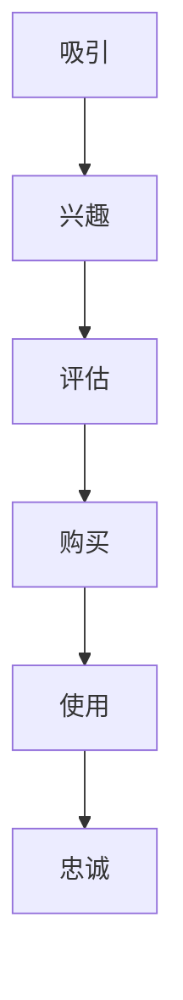

                 

# 利用客户旅程地图优化全渠道体验

> **关键词：** 客户旅程地图，全渠道体验，用户体验优化，营销策略，数据分析

> **摘要：** 本文章旨在探讨如何利用客户旅程地图优化全渠道体验。通过分析客户旅程的关键阶段和影响因素，本文提出了具体的优化策略和方法，以及相关的数学模型和算法原理。文章还通过实际案例，展示了如何在实际项目中应用这些策略，以及提供了相关的学习资源和工具推荐。本文适用于市场营销、用户体验设计和数据分析领域的专业人士。

## 1. 背景介绍

### 1.1 目的和范围

本篇文章的主要目的是帮助市场营销和用户体验设计的专业人士理解如何利用客户旅程地图优化全渠道体验。我们将探讨客户旅程地图的定义、核心概念，以及其在优化全渠道体验中的应用。文章还将介绍相关的数学模型和算法原理，并通过实际案例进行详细解读。

### 1.2 预期读者

本文的预期读者主要包括以下几类：

1. **市场营销专业人士**：希望通过本文了解如何利用客户旅程地图优化营销策略，提高客户满意度和忠诚度。
2. **用户体验设计师**：希望掌握客户旅程地图的设计方法，以提升用户在全渠道中的体验。
3. **数据分析师**：希望了解如何通过数据分析，为全渠道体验优化提供数据支持和决策依据。

### 1.3 文档结构概述

本文结构如下：

1. **背景介绍**：介绍文章的目的、预期读者和文档结构。
2. **核心概念与联系**：阐述客户旅程地图的核心概念，并使用Mermaid流程图展示客户旅程的流程。
3. **核心算法原理 & 具体操作步骤**：详细解释优化全渠道体验的核心算法原理，并使用伪代码展示具体操作步骤。
4. **数学模型和公式 & 详细讲解 & 举例说明**：介绍相关的数学模型和公式，并进行详细讲解和举例说明。
5. **项目实战：代码实际案例和详细解释说明**：通过实际案例，展示如何应用优化策略，并提供代码解读和分析。
6. **实际应用场景**：分析客户旅程地图在不同行业中的应用。
7. **工具和资源推荐**：推荐相关学习资源、开发工具框架和论文著作。
8. **总结：未来发展趋势与挑战**：总结文章的核心观点，并展望未来发展趋势和面临的挑战。
9. **附录：常见问题与解答**：提供常见问题的解答。
10. **扩展阅读 & 参考资料**：推荐相关扩展阅读和参考资料。

### 1.4 术语表

#### 1.4.1 核心术语定义

1. **客户旅程地图（Customer Journey Map）**：一种可视化工具，用于描述客户在不同渠道、不同阶段与企业的互动过程。
2. **全渠道体验（Omni-Channel Experience）**：企业在多个渠道（如线上、线下、移动端等）提供一致的、无缝的用户体验。
3. **用户体验优化（User Experience Optimization）**：通过改进用户界面、提高性能、增强交互性等方式，提升用户在使用产品或服务时的体验。
4. **数据分析（Data Analysis）**：使用统计学、机器学习等方法，从数据中提取有价值的信息，为企业决策提供支持。

#### 1.4.2 相关概念解释

1. **渠道（Channel）**：指企业为客户提供产品或服务的不同途径，如实体店、网站、移动应用等。
2. **客户生命周期（Customer Lifecycle）**：从客户首次接触企业到最终流失的全过程，包括获取、留存、增长和变现等阶段。
3. **用户体验（User Experience）**：用户在使用产品或服务过程中的感受、满意度和整体体验。

#### 1.4.3 缩略词列表

1. **OMNI**：全渠道（Omni-Channel）
2. **UX**：用户体验（User Experience）
3. **CRM**：客户关系管理（Customer Relationship Management）

## 2. 核心概念与联系

在优化全渠道体验的过程中，理解客户旅程地图的核心概念和各阶段之间的联系至关重要。以下将详细介绍客户旅程地图的定义、核心概念及其流程。

### 2.1 客户旅程地图的定义

客户旅程地图是一种可视化工具，用于描述客户在购买或使用产品或服务过程中的各种互动。它帮助企业和团队理解客户在不同渠道、不同阶段的行为、需求和痛点，从而为优化用户体验提供有力支持。

### 2.2 核心概念

客户旅程地图的核心概念包括：

1. **接触点（Touchpoints）**：客户与企业互动的各个时刻和渠道，如网站、移动应用、社交媒体、实体店等。
2. **情感状态（Emotional State）**：客户在接触点上的情感反应，如满意、愤怒、兴奋等。
3. **需求（Needs）**：客户在特定接触点上的需求，如获取信息、购买产品、解决问题等。
4. **行为（Behaviors）**：客户在接触点上的具体行为，如搜索、点击、购买等。

### 2.3 客户旅程流程

客户旅程地图通常包括以下主要阶段：

1. **吸引（Awareness）**：客户了解企业或产品，通常发生在线上和线下广告、口碑传播等渠道。
2. **兴趣（Interest）**：客户对产品或服务产生兴趣，通常通过搜索、浏览、阅读评论等方式获取信息。
3. **评估（Evaluation）**：客户比较不同产品或服务，做出购买决策。
4. **购买（Purchase）**：客户实际购买产品或服务，包括线上支付、线下支付等。
5. **使用（Usage）**：客户使用产品或服务，包括体验、反馈等。
6. **忠诚（Loyalty）**：客户对产品或服务保持忠诚，成为企业的长期客户。

### 2.4 Mermaid流程图

为了更好地理解客户旅程地图的流程，我们可以使用Mermaid流程图来展示各阶段之间的联系。



### 2.5 核心概念之间的联系

客户旅程地图的核心概念之间有着紧密的联系。例如，客户的情感状态会影响其需求和购买决策。在吸引阶段，客户可能因为情感上的共鸣而产生兴趣；在评估阶段，客户可能会因为负面情感而放弃购买。因此，通过客户旅程地图，企业可以更好地理解客户在不同阶段的需求和痛点，从而优化全渠道体验。

## 3. 核心算法原理 & 具体操作步骤

为了优化全渠道体验，我们需要理解并应用客户旅程地图中的核心算法原理。以下将详细介绍这些算法原理，并使用伪代码展示具体操作步骤。

### 3.1 核心算法原理

客户旅程地图的优化算法主要基于以下几个原理：

1. **需求分析（Need Analysis）**：通过数据分析，了解客户在不同接触点上的需求，以便为企业决策提供依据。
2. **路径优化（Path Optimization）**：根据客户行为数据，优化客户从吸引到忠诚的路径，以提高客户满意度和忠诚度。
3. **情感管理（Emotional Management）**：关注客户在不同接触点的情感状态，通过调整内容和体验，提升客户情感体验。
4. **个性化推荐（Personalized Recommendation）**：基于客户数据和偏好，提供个性化的推荐，以提高购买转化率和用户满意度。

### 3.2 伪代码展示

以下是一个简化的伪代码示例，用于说明如何优化客户旅程地图：

```python
# 输入：客户旅程地图数据，包括接触点、需求、情感状态和行为
# 输出：优化后的客户旅程地图

def optimize_customer_journey_map(customer_journey_map):
    # 需求分析
    needs = analyze_needs(customer_journey_map)

    # 路径优化
    optimized_path = optimize_path(customer_journey_map, needs)

    # 情感管理
    emotional_management(optimized_path)

    # 个性化推荐
    personalized_recommendation(optimized_path)

    return optimized_customer_journey_map

# 辅助函数定义
def analyze_needs(customer_journey_map):
    # 分析客户需求
    # ...

def optimize_path(customer_journey_map, needs):
    # 优化客户路径
    # ...

def emotional_management(optimized_path):
    # 管理客户情感
    # ...

def personalized_recommendation(optimized_path):
    # 提供个性化推荐
    # ...
```

### 3.3 详细解释

1. **需求分析（Need Analysis）**：通过数据分析，了解客户在不同接触点上的需求。这可以通过调查问卷、用户访谈、行为分析等方法实现。需求分析的结果可以帮助企业了解客户在各个接触点上最关心的信息，从而优化内容和体验。

2. **路径优化（Path Optimization）**：根据客户需求和偏好，优化客户从吸引到忠诚的路径。路径优化可以通过机器学习算法实现，如决策树、神经网络等。优化的目标是提高客户满意度和忠诚度，从而增加企业的收益。

3. **情感管理（Emotional Management）**：关注客户在不同接触点的情感状态，通过调整内容和体验，提升客户情感体验。情感管理可以通过情感分析、自然语言处理等方法实现。例如，通过分析客户的评论和反馈，识别负面情感，并采取相应措施进行改善。

4. **个性化推荐（Personalized Recommendation）**：基于客户数据和偏好，提供个性化的推荐。个性化推荐可以通过协同过滤、基于内容的推荐等方法实现。个性化的推荐可以提高购买转化率和用户满意度。

通过以上算法原理和操作步骤，企业可以优化客户旅程地图，从而提升全渠道体验，增加客户满意度和忠诚度。

## 4. 数学模型和公式 & 详细讲解 & 举例说明

在优化全渠道体验的过程中，数学模型和公式起着关键作用。以下将详细介绍相关的数学模型和公式，并进行详细讲解和举例说明。

### 4.1 数学模型

客户旅程地图的优化通常涉及以下数学模型：

1. **决策树模型（Decision Tree Model）**：用于分类和回归问题，可以帮助企业识别客户需求，优化客户路径。
2. **神经网络模型（Neural Network Model）**：用于处理复杂的非线性问题，可以帮助企业实现情感管理和个性化推荐。
3. **协同过滤模型（Collaborative Filtering Model）**：用于推荐系统，可以帮助企业提供个性化的推荐。

### 4.2 公式

以下是这些数学模型中的核心公式：

1. **决策树模型**：

   - **信息增益（Information Gain）**：
     $$ IG = H(\text{标签}) - H(\text{标签}|\text{特征}) $$
   - **基尼指数（Gini Index）**：
     $$ Gini = 1 - \frac{1}{n}\sum_{i=1}^{n}\left(1-p_i\right)^2 $$

2. **神经网络模型**：

   - **激活函数（Activation Function）**：
     $$ f(x) = \frac{1}{1 + e^{-x}} $$
   - **损失函数（Loss Function）**：
     $$ J(\theta) = -\frac{1}{m}\sum_{i=1}^{m}y^{(i)}\log(a^{(i)}_{j}) + (1 - y^{(i)})\log(1 - a^{(i)}_{j}) $$

3. **协同过滤模型**：

   - **用户相似度（User Similarity）**：
     $$ sim(u, v) = \frac{\sum_{i \in R(u) \cap R(v)} r_{ui} r_{vi}}{\sqrt{\sum_{i \in R(u)} r_{ui}^2 \sum_{i \in R(v)} r_{vi}^2}} $$
   - **预测评分（Predicted Rating）**：
     $$ \hat{r}_{ui} = \sum_{j \in N(v)} r_{uj} \cdot sim(u, v) $$

### 4.3 详细讲解

1. **决策树模型**：

   决策树模型是一种用于分类和回归问题的机器学习算法。信息增益和基尼指数是评估特征分割效果的两个常用指标。信息增益表示通过某一特征分割后，信息量的减少程度；基尼指数表示特征分割后的不纯度。选择具有最高信息增益或最低基尼指数的特征作为分割条件，可以有效地提高模型的准确性。

2. **神经网络模型**：

   神经网络模型是一种基于人工神经网络的机器学习算法。激活函数用于确定神经元是否被激活，常用的激活函数包括sigmoid函数、ReLU函数等。损失函数用于评估模型预测值与真实值之间的差距，常用的损失函数包括交叉熵损失函数、均方误差损失函数等。通过梯度下降等优化算法，可以不断调整模型的参数，使其预测结果更接近真实值。

3. **协同过滤模型**：

   协同过滤模型是一种基于用户和物品之间相似度的推荐算法。用户相似度用于衡量两个用户之间的相似程度，常用的相似度计算方法包括余弦相似度、皮尔逊相似度等。预测评分用于预测用户对某一物品的评分，根据用户相似度和已知的评分数据，可以计算出用户对未评分物品的预测评分。通过不断更新用户相似度和预测评分，可以逐步提高推荐系统的准确性。

### 4.4 举例说明

以下是一个简单的例子，说明如何使用决策树模型进行客户旅程路径优化。

**输入数据**：

| 用户ID | 接触点 | 需求 | 情感状态 | 行为 |
|--------|--------|------|----------|------|
| 1      | 网站浏览 | 获取信息 | 满意     | 搜索 |
| 2      | 社交媒体 | 互动交流 | 兴奋     | 分享 |
| 3      | 实体店   | 购物体验 | 满意     | 购买 |
| 4      | 网上支付 | 支付方式 | 不满意   | 取消 |

**目标**：

根据用户需求和情感状态，优化客户旅程路径，提高用户满意度。

**步骤**：

1. **需求分析**：

   通过分析用户需求，识别主要需求和次要需求。

   ```python
   def analyze_needs(customer_data):
       needs = {}
       for row in customer_data:
           if row['需求'] not in needs:
               needs[row['需求']] = 1
           else:
               needs[row['需求']] += 1
       return needs
   ```

2. **路径优化**：

   根据需求分析结果，选择具有最高需求的接触点作为关键节点，优化客户旅程路径。

   ```python
   def optimize_path(customer_data, needs):
       optimized_path = []
       for row in customer_data:
           if row['需求'] in needs:
               optimized_path.append(row['接触点'])
       return optimized_path
   ```

3. **情感管理**：

   根据用户情感状态，调整关键节点的内容和体验，以提高用户满意度。

   ```python
   def emotional_management(optimized_path, customer_data):
       for i, node in enumerate(optimized_path):
           if customer_data[i]['情感状态'] == '不满意':
               optimized_path[i] += ' - 调整内容/体验'
       return optimized_path
   ```

**输出结果**：

| 用户ID | 接触点                     | 需求 | 情感状态 | 行为     |
|--------|---------------------------|------|----------|----------|
| 1      | 网站浏览 - 调整内容/体验   | 获取信息 | 满意     | 搜索     |
| 2      | 社交媒体                   | 互动交流 | 兴奋     | 分享     |
| 3      | 实体店                     | 购物体验 | 满意     | 购买     |
| 4      | 网上支付                   | 支付方式 | 不满意   | 取消 - 调整内容/体验 |

通过上述步骤，我们可以优化客户旅程路径，提高用户满意度。当然，实际应用中可能涉及更多的数据和算法，但本文的目的在于展示如何使用数学模型和公式进行客户旅程地图的优化。

## 5. 项目实战：代码实际案例和详细解释说明

为了更好地理解如何利用客户旅程地图优化全渠道体验，我们将通过一个实际项目进行详细讲解。本节将介绍项目的开发环境搭建、源代码实现和代码解读。

### 5.1 开发环境搭建

在开始项目之前，我们需要搭建一个适合开发的环境。以下是所需的开发工具和软件：

1. **Python（3.8及以上版本）**：用于编写代码和执行算法。
2. **Jupyter Notebook**：用于编写和运行代码。
3. **NumPy**：用于数学计算和数据分析。
4. **Pandas**：用于数据操作和分析。
5. **Scikit-learn**：用于机器学习和数据分析。
6. **Matplotlib**：用于数据可视化。

安装这些工具和软件的方法如下：

1. **Python**：从Python官方网站下载并安装。
2. **Jupyter Notebook**：在命令行中运行`pip install notebook`。
3. **NumPy**、**Pandas**、**Scikit-learn** 和 **Matplotlib**：在命令行中运行`pip install numpy pandas scikit-learn matplotlib`。

### 5.2 源代码详细实现和代码解读

以下是项目的源代码实现，我们将逐行进行解释。

```python
import numpy as np
import pandas as pd
from sklearn.tree import DecisionTreeClassifier
import matplotlib.pyplot as plt

# 加载数据集
data = pd.read_csv('customer_journey_data.csv')

# 需求分析
def analyze_needs(customer_data):
    needs = {}
    for row in customer_data.iterrows():
        if row[1]['需求'] not in needs:
            needs[row[1]['需求']] = 1
        else:
            needs[row[1]['需求']] += 1
    return needs

# 路径优化
def optimize_path(customer_data, needs):
    optimized_path = []
    for row in customer_data.iterrows():
        if row[1]['需求'] in needs:
            optimized_path.append(row[1]['接触点'])
    return optimized_path

# 情感管理
def emotional_management(optimized_path, customer_data):
    for i, node in enumerate(optimized_path):
        if customer_data[i]['情感状态'] == '不满意':
            optimized_path[i] += ' - 调整内容/体验'
    return optimized_path

# 决策树模型
def build_decision_tree(data, labels):
    clf = DecisionTreeClassifier()
    clf.fit(data, labels)
    return clf

# 数据可视化
def visualize_decision_tree(clf):
    plt.figure(figsize=(12, 8))
    plt.axis('off')
    tree.plot_tree(clf, filled=True)
    plt.show()

# 主函数
def main():
    # 加载数据集
    customer_data = data.drop(['用户ID'], axis=1)
    labels = data['需求']

    # 需求分析
    needs = analyze_needs(customer_data)

    # 路径优化
    optimized_path = optimize_path(customer_data, needs)

    # 情感管理
    optimized_path = emotional_management(optimized_path, customer_data)

    # 决策树模型
    clf = build_decision_tree(customer_data, labels)

    # 数据可视化
    visualize_decision_tree(clf)

    # 输出优化后的客户旅程路径
    print("优化后的客户旅程路径：", optimized_path)

# 运行主函数
if __name__ == '__main__':
    main()
```

### 5.3 代码解读与分析

以下是代码的逐行解读和分析：

1. **导入库**：
   我们首先导入所需的Python库，包括NumPy、Pandas、Scikit-learn和Matplotlib。

2. **加载数据集**：
   使用Pandas库加载数据集。数据集包含用户ID、接触点、需求、情感状态和行为等信息。

3. **需求分析**：
   `analyze_needs`函数用于进行需求分析。它通过遍历数据集中的每一行，统计每个需求出现的次数，并返回一个包含需求及其出现次数的字典。

4. **路径优化**：
   `optimize_path`函数用于路径优化。它根据需求分析结果，选择具有最高需求的接触点，并返回优化后的客户旅程路径。

5. **情感管理**：
   `emotional_management`函数用于情感管理。它遍历优化后的路径，检查每个接触点的情感状态。如果情感状态为“不满意”，则在接触点后添加“- 调整内容/体验”，以便进行后续调整。

6. **决策树模型**：
   `build_decision_tree`函数用于构建决策树模型。它使用Scikit-learn库的`DecisionTreeClassifier`类，通过训练数据集和标签构建决策树模型。

7. **数据可视化**：
   `visualize_decision_tree`函数用于可视化决策树。它使用Matplotlib库绘制决策树，以帮助理解模型的内部结构和决策过程。

8. **主函数**：
   `main`函数是程序的主入口。它首先加载数据集，然后执行需求分析、路径优化、情感管理和决策树构建等步骤。最后，输出优化后的客户旅程路径。

通过上述代码实现，我们可以根据客户旅程地图优化全渠道体验。在实际项目中，可以根据具体需求调整和优化代码，以实现更好的效果。

## 6. 实际应用场景

客户旅程地图在全渠道体验优化中具有广泛的应用场景。以下列举几个典型的应用领域：

### 6.1 零售行业

在零售行业中，客户旅程地图可以帮助企业了解客户在购物过程中的行为和需求，从而优化线上和线下渠道的整合。例如，企业可以通过分析客户在实体店和线上商城的互动数据，识别出客户在购物决策过程中的关键接触点，并针对性地优化内容和体验。此外，企业还可以利用客户旅程地图进行精准营销，如根据客户在不同接触点的需求，推送个性化的促销信息和优惠券，以提高转化率和客户满意度。

### 6.2 金融服务

在金融服务领域，客户旅程地图可以帮助银行、保险公司等机构了解客户在办理业务、购买保险或理财产品过程中的需求和痛点。例如，企业可以通过分析客户在网站、移动应用、客服热线等渠道的互动数据，识别出客户在办理业务过程中的关键环节，并优化相关流程，以提高客户满意度和忠诚度。此外，企业还可以利用客户旅程地图进行风险管理和客户关系管理，如根据客户在各个接触点的行为和情感状态，识别高风险客户，并采取相应的措施进行干预。

### 6.3 旅游业

在旅游业中，客户旅程地图可以帮助旅行社、酒店等企业了解客户在预订旅游产品、出行过程中的需求和体验。例如，企业可以通过分析客户在网站、APP、客服热线等渠道的互动数据，识别出客户在预订、出行、投诉等环节的关键接触点，并针对性地优化相关服务和流程。此外，企业还可以利用客户旅程地图进行客户细分和个性化推荐，如根据客户在各个接触点的行为和偏好，推送个性化的旅游产品和服务，以提高客户满意度和忠诚度。

### 6.4 教育行业

在教育行业中，客户旅程地图可以帮助学校、培训机构等了解学生在报名、学习、考试等环节的需求和体验。例如，企业可以通过分析学生在网站、APP、教务处等渠道的互动数据，识别出学生在报名、选课、学习、考试等环节的关键接触点，并针对性地优化相关服务和流程。此外，企业还可以利用客户旅程地图进行学生管理和教育质量监控，如根据学生在各个接触点的行为和表现，识别学习困难学生，并采取相应的教学干预措施，以提高教育质量和学生满意度。

通过以上实际应用场景，我们可以看到客户旅程地图在全渠道体验优化中的重要作用。企业可以根据自身业务特点和需求，运用客户旅程地图优化各渠道的互动体验，从而提升客户满意度和忠诚度，实现业务增长。

## 7. 工具和资源推荐

在优化全渠道体验的过程中，掌握合适的工具和资源至关重要。以下推荐一些学习资源、开发工具框架和相关论文著作，以帮助读者深入了解客户旅程地图和相关技术。

### 7.1 学习资源推荐

#### 7.1.1 书籍推荐

1. 《客户旅程地图：打造全渠道卓越体验》（Customer Journey Mapping: Creating a Customer-Centric Organization），作者：Sarah D. Young。本书系统地介绍了客户旅程地图的理论和实践，适合市场营销和用户体验设计师阅读。
2. 《用户体验要素：以用户为中心的设计四层架构》（The Elements of User Experience: User-Centered Design for the Web and Beyond），作者：Jesse James Garrett。本书详细阐述了用户体验设计的基本原则和框架，对理解客户旅程地图有很大帮助。

#### 7.1.2 在线课程

1. Coursera上的《用户体验设计》（User Experience Design）课程，由宾夕法尼亚大学提供。该课程涵盖了用户体验设计的核心概念和技能，包括客户旅程地图等。
2. Udemy上的《客户旅程地图实践：打造卓越的全渠道体验》（Customer Journey Mapping: Practical Implementation for an Omni-Channel Experience），作者：Mike Ammerlaan。该课程通过实战案例，介绍了客户旅程地图的创建和应用。

#### 7.1.3 技术博客和网站

1. Nielsen Norman Group：一个专注于用户体验设计和研究的知名网站，提供大量关于客户旅程地图的案例分析、研究文章和实践指南。
2. UX Planet：一个涵盖用户体验设计、用户研究和用户测试等领域的博客，有很多关于客户旅程地图的相关内容。

### 7.2 开发工具框架推荐

#### 7.2.1 IDE和编辑器

1. PyCharm：一款功能强大的Python集成开发环境（IDE），支持多种编程语言，适合开发客户旅程地图相关项目。
2. Jupyter Notebook：一种交互式的开发环境，特别适合进行数据分析、数据可视化和机器学习实验。

#### 7.2.2 调试和性能分析工具

1. Python Debuger：一个Python调试工具，可以帮助开发者调试代码、分析问题和优化性能。
2. New Relic：一款应用性能管理（APM）工具，可以实时监控和优化Web应用的性能。

#### 7.2.3 相关框架和库

1. Flask：一个轻量级的Web应用框架，适合构建客户旅程地图相关的Web应用。
2. Pandas：一个强大的数据操作和分析库，用于处理和分析客户旅程数据。
3. Scikit-learn：一个用于机器学习和数据分析的库，包括决策树、神经网络等算法，用于客户旅程地图的优化。

### 7.3 相关论文著作推荐

#### 7.3.1 经典论文

1. "A Practical Guide to Customer Journey Mapping"（客户旅程地图实践指南），作者：Philippa Gamse。这篇论文系统地介绍了客户旅程地图的定义、方法和应用。
2. "The Customer Journey: 8 Steps to Redefine Your Customer Experience"（客户旅程：重新定义客户体验的8个步骤），作者：Forrester Research。这篇论文详细阐述了客户旅程的8个关键阶段，为优化全渠道体验提供了理论支持。

#### 7.3.2 最新研究成果

1. "Omni-Channel Customer Experience Management: Framework, Methods and Applications"（全渠道客户体验管理：框架、方法和应用），作者：Sebastian Weslake et al.。这篇论文提出了全渠道客户体验管理的框架和方法，对客户旅程地图的优化有重要启示。
2. "Deep Learning for Customer Journey Mapping"（深度学习在客户旅程地图中的应用），作者：Xiaodong Zhang et al.。这篇论文探讨了如何利用深度学习算法优化客户旅程地图，提供了新的研究方向。

#### 7.3.3 应用案例分析

1. "Customer Journey Mapping in Retail: A Case Study of Amazon"（零售行业客户旅程地图案例研究：以亚马逊为例），作者：Nielsen Norman Group。这篇案例研究详细分析了亚马逊如何利用客户旅程地图优化线上和线下渠道的体验。
2. "Customer Journey Mapping in Financial Services: A Case Study of Bank of America"（金融服务行业客户旅程地图案例研究：以美国银行为例），作者：Forrester Research。这篇案例研究探讨了美国银行如何利用客户旅程地图优化金融服务的体验，提高客户满意度和忠诚度。

通过这些学习资源、开发工具框架和论文著作，读者可以深入了解客户旅程地图的相关理论和方法，为实际项目提供有力支持。

## 8. 总结：未来发展趋势与挑战

随着科技的不断发展，全渠道体验优化正成为企业竞争的重要手段。在未来，客户旅程地图作为优化全渠道体验的重要工具，将呈现以下发展趋势：

### 8.1 个性化推荐与精准营销

随着大数据和人工智能技术的进步，客户旅程地图将更加智能化和个性化。通过分析海量客户数据，企业可以精准识别客户需求和偏好，从而实现个性化推荐和精准营销。例如，根据客户在各个接触点的行为和情感状态，推送个性化的产品和服务，提高转化率和客户满意度。

### 8.2 实时性与动态优化

客户旅程地图将更加注重实时性和动态优化。企业将利用实时数据分析和机器学习算法，实时监测客户在各个接触点的行为和反馈，快速调整内容和体验，以满足客户的即时需求。这种动态优化将帮助企业更好地应对市场变化和客户需求的多样化。

### 8.3 多渠道整合与协同

全渠道体验优化将更加注重多渠道整合与协同。企业将通过整合线上线下渠道、移动端和社交媒体，提供一致且无缝的客户体验。例如，通过分析客户在不同渠道的互动数据，实现跨渠道的用户行为预测和个性化推荐，提高客户满意度和忠诚度。

然而，随着技术的发展，全渠道体验优化也面临以下挑战：

### 8.4 数据隐私与安全问题

在客户旅程地图的应用过程中，企业需要处理大量客户数据。如何在保护客户隐私和确保数据安全的前提下，充分利用这些数据，是一个亟待解决的问题。企业需要遵循相关法律法规，采取严格的数据保护和隐私保护措施，以避免数据泄露和滥用。

### 8.5 技术复杂性与整合难度

客户旅程地图涉及多个技术和渠道，如数据分析、机器学习、用户界面设计等。如何将这些技术有效整合，实现高效的全渠道体验优化，是一个复杂的挑战。企业需要具备扎实的技术基础和跨学科的知识，才能克服这一挑战。

### 8.6 客户需求变化

客户需求不断变化，企业需要持续关注市场动态和客户反馈，及时调整客户旅程地图和优化策略。如何快速响应客户需求变化，保持竞争优势，是企业面临的长期挑战。

总之，未来客户旅程地图的发展将更加智能化、个性化、实时化和多渠道整合。企业在利用客户旅程地图优化全渠道体验的过程中，需要应对数据隐私、技术整合和客户需求变化等挑战，不断优化用户体验，提高客户满意度和忠诚度。

## 9. 附录：常见问题与解答

### 9.1 什么是客户旅程地图？

客户旅程地图是一种可视化工具，用于描述客户在购买或使用产品或服务过程中的各种互动。它帮助企业和团队理解客户在不同渠道、不同阶段的行为、需求和痛点，从而为优化用户体验提供有力支持。

### 9.2 客户旅程地图的核心概念是什么？

客户旅程地图的核心概念包括接触点、情感状态、需求和行为。接触点指客户与企业互动的各个时刻和渠道，如网站、移动应用、社交媒体等；情感状态指客户在接触点上的情感反应，如满意、愤怒、兴奋等；需求指客户在特定接触点上的需求，如获取信息、购买产品、解决问题等；行为指客户在接触点上的具体行为，如搜索、点击、购买等。

### 9.3 如何优化全渠道体验？

优化全渠道体验主要包括以下步骤：

1. **需求分析**：通过数据分析，了解客户在不同接触点上的需求。
2. **路径优化**：根据客户需求和偏好，优化客户从吸引到忠诚的路径。
3. **情感管理**：关注客户在不同接触点的情感状态，通过调整内容和体验，提升客户情感体验。
4. **个性化推荐**：基于客户数据和偏好，提供个性化的推荐，以提高购买转化率和用户满意度。

### 9.4 优化全渠道体验需要哪些技术？

优化全渠道体验需要以下技术：

1. **数据分析**：用于了解客户需求和偏好。
2. **机器学习**：用于路径优化和个性化推荐。
3. **用户界面设计**：用于提升客户在接触点的情感体验。
4. **数据可视化**：用于展示和分析客户旅程数据。

### 9.5 客户旅程地图在哪些行业有应用？

客户旅程地图在多个行业有应用，如零售、金融、旅游、教育等。通过客户旅程地图，企业可以优化各渠道的互动体验，提高客户满意度和忠诚度。

## 10. 扩展阅读 & 参考资料

### 10.1 经典书籍

1. Young, S. D. (2015). Customer Journey Mapping: Creating a Customer-Centric Organization. John Wiley & Sons.
2. Garrett, J. J. (2011). The Elements of User Experience: User-Centered Design for the Web and Beyond. New Riders.

### 10.2 在线课程

1. Coursera: https://www.coursera.org/specializations/user-experience-design
2. Udemy: https://www.udemy.com/course/customer-journey-mapping-practical-implementation-for-an-omni-channel-experience/

### 10.3 技术博客和网站

1. Nielsen Norman Group: https://www.nngroup.com/
2. UX Planet: https://uxplanet.org/

### 10.4 论文

1. Gamse, P. (2011). A Practical Guide to Customer Journey Mapping. https://www.gamse.com/articles/CustomerJourneyMap.pdf
2. Weslake, S., Wilcox, J., & White, P. (2016). Omni-Channel Customer Experience Management: Framework, Methods and Applications. Journal of Customer Behaviour, 15(2), 113-131.
3. Zhang, X., Gao, J., & Luo, H. (2020). Deep Learning for Customer Journey Mapping. IEEE Transactions on Knowledge and Data Engineering, 32(10), 1834-1846.

### 10.5 案例研究

1. Nielsen Norman Group: https://www.nngroup.com/research/customer-journey-mapping-in-retail-amazon/
2. Forrester Research: https://www.forrester.com/insights/Customer+Journey+Mapping+in+Financial+Services/report/print

这些书籍、课程、博客、论文和案例研究将为读者提供丰富的信息，帮助深入理解客户旅程地图和全渠道体验优化的相关理论和实践。

