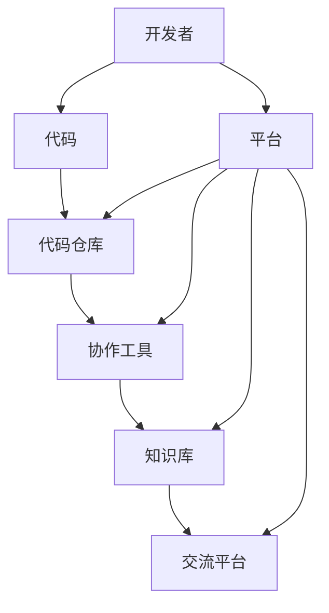
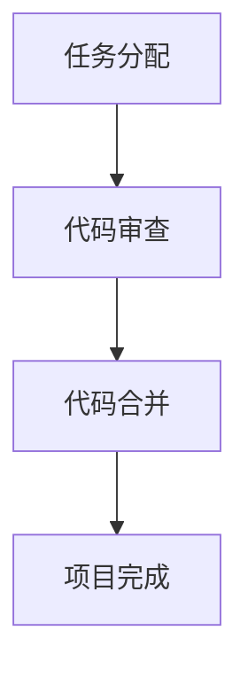

                 

# 利用开发者社区构建产品生态

## 关键词：
开发者社区、产品生态、代码共享、协作开发、创新传播、知识传承、开源文化、平台工具、影响力放大。

## 摘要：

本文深入探讨了开发者社区在构建产品生态中的关键作用。首先，我们明确了文章的目的和范围，以及预期读者。接着，文章从背景介绍、核心概念与联系、核心算法原理与操作步骤、数学模型与公式讲解、项目实战、实际应用场景、工具和资源推荐、总结以及常见问题与解答等方面，逐步分析推理，为读者呈现了一个清晰、完整、具有实用性的开发者社区构建产品生态的指南。通过本文的阅读，开发者将能够更好地理解如何利用开发者社区的力量，提升产品的市场竞争力和生态建设。

## 1. 背景介绍

### 1.1 目的和范围

本文旨在探讨如何利用开发者社区来构建和维护一个健康、可持续的产品生态。随着技术的快速发展和市场竞争的加剧，开发者社区在产品生态中的重要性日益凸显。本文将分析开发者社区的核心价值，探讨其构建产品生态的原理和方法，并提供实际操作步骤和工具推荐。

### 1.2 预期读者

本文适用于广大软件开发者和产品经理，特别是那些希望了解如何通过开发者社区构建产品生态的读者。此外，对于对开源文化、协作开发和知识传承感兴趣的技术爱好者，本文也将提供有价值的参考。

### 1.3 文档结构概述

本文分为十个部分：

1. 背景介绍：包括目的和范围、预期读者、文档结构概述等。
2. 核心概念与联系：介绍开发者社区的核心概念、原理和架构。
3. 核心算法原理与操作步骤：讲解构建开发者社区的核心算法和具体操作步骤。
4. 数学模型和公式：详细讲解相关的数学模型和公式。
5. 项目实战：通过代码实际案例进行详细解释说明。
6. 实际应用场景：分析开发者社区在产品生态中的应用场景。
7. 工具和资源推荐：推荐学习资源、开发工具框架和相关论文著作。
8. 总结：总结未来发展趋势与挑战。
9. 附录：常见问题与解答。
10. 扩展阅读与参考资料：提供进一步学习的资源。

### 1.4 术语表

#### 1.4.1 核心术语定义

- 开发者社区：一群对特定技术或领域有共同兴趣和目标的开发者组成的网络。
- 产品生态：由多个相关产品、服务、用户和开发者组成的复杂系统，共同构成一个有机的整体。
- 开源文化：一种强调共享、协作和开放的价值观，推动技术进步和知识传承。

#### 1.4.2 相关概念解释

- 代码共享：开发者将自己的代码公开，供其他开发者使用、改进和扩展。
- 协作开发：多个开发者共同参与一个项目，分工协作，共同完成开发任务。
- 知识传承：通过社区内的交流和分享，将知识和经验传递给下一代开发者。

#### 1.4.3 缩略词列表

- OSS：Open Source Software（开源软件）
- FLOSS：Free/Libre and Open Source Software（自由和开源软件）
- IDE：Integrated Development Environment（集成开发环境）
- CI/CD：Continuous Integration/Continuous Deployment（持续集成/持续部署）

## 2. 核心概念与联系

在构建开发者社区的过程中，理解核心概念和它们之间的联系至关重要。以下是对核心概念原理和架构的详细解析，并附上 Mermaid 流程图以帮助读者更好地理解。

### 2.1 开发者社区的核心概念

开发者社区的核心概念包括：

1. **开发者**：指参与社区的开发人员，他们具有不同的技能、经验和背景。
2. **代码**：社区中的核心资源，是开发者协作和创新的基础。
3. **平台**：提供代码管理、协作开发、知识分享等功能的工具和系统。
4. **文化**：社区内部共同的价值观和行为规范，如开源文化、共享精神等。

### 2.2 开发者社区的核心架构

开发者社区的核心架构可以简化为以下四个部分：

1. **代码仓库**：用于存储和管理代码，支持版本控制和协作开发。
2. **协作工具**：提供任务分配、代码审查、在线讨论等功能的工具。
3. **知识库**：收集和整理社区成员的知识和经验，供其他成员学习和参考。
4. **交流平台**：用于社区成员之间的沟通和交流，促进知识共享和协作开发。

### 2.3 Mermaid 流程图

以下是一个简化的 Mermaid 流程图，用于展示开发者社区的核心概念和架构之间的联系：



## 3. 核心算法原理 & 具体操作步骤

构建开发者社区的核心算法主要包括代码管理、协作开发、知识共享和社区运营等。以下将使用伪代码详细阐述这些算法的原理和具体操作步骤。

### 3.1 代码管理算法

代码管理是开发者社区的核心任务之一，主要包括版本控制、代码审查和代码发布等步骤。

```pseudo
Algorithm 代码管理
Input: 代码仓库，开发者
Output: 稳定的代码库

Begin
  // 步骤1：版本控制
  VersionControl(代码仓库)
  
  // 步骤2：代码审查
  CodeReview(代码仓库，开发者)
  
  // 步骤3：代码发布
  CodeRelease(代码仓库)
End
```

### 3.2 协作开发算法

协作开发是开发者社区的核心功能，通过任务分配、代码审查和在线讨论等步骤实现。

```pseudo
Algorithm 协作开发
Input: 开发者，项目需求
Output: 完成的项目

Begin
  // 步骤1：任务分配
  TaskAllocation(开发者，项目需求)
  
  // 步骤2：代码审查
  CodeReview(代码仓库，开发者)
  
  // 步骤3：在线讨论
  OnlineDiscussion(开发者，项目需求)
  
  // 步骤4：代码合并
  CodeMerge(代码仓库，开发者)
End
```

### 3.3 知识共享算法

知识共享是开发者社区的重要功能，通过知识库建设和知识传递等步骤实现。

```pseudo
Algorithm 知识共享
Input: 开发者，知识库
Output: 知识库的更新

Begin
  // 步骤1：知识库建设
  KnowledgeBuilding(知识库，开发者)
  
  // 步骤2：知识传递
  KnowledgeTransfer(知识库，开发者)
  
  // 步骤3：知识沉淀
  KnowledgeAccumulation(知识库，开发者)
End
```

### 3.4 社区运营算法

社区运营是保持开发者社区活力和持续发展的重要手段，包括活动策划、社区管理和反馈收集等步骤。

```pseudo
Algorithm 社区运营
Input: 社区，活动计划
Output: 社区的良好运营

Begin
  // 步骤1：活动策划
  ActivityPlanning(社区，活动计划)
  
  // 步骤2：社区管理
  CommunityManagement(社区，管理员)
  
  // 步骤3：反馈收集
  FeedbackCollection(社区，开发者)
  
  // 步骤4：反馈处理
  FeedbackProcessing(社区，管理员)
End
```

通过以上核心算法的阐述，开发者可以更好地理解和实施构建开发者社区的关键步骤。

## 4. 数学模型和公式 & 详细讲解 & 举例说明

在开发者社区构建过程中，数学模型和公式为我们提供了量化分析和优化的工具。以下将介绍几个关键数学模型和公式，并通过实例进行详细讲解。

### 4.1 社区活跃度模型

社区活跃度是衡量开发者社区活跃程度的重要指标。我们可以使用以下公式来计算社区活跃度：

$$
活跃度 = \frac{参与度 + 贡献度 + 反馈度}{总成员数}
$$

其中，参与度、贡献度和反馈度分别表示社区成员的参与、贡献和反馈情况。

**实例**：

假设一个开发者社区有100名成员，在过去一个月中，有60名成员参与了项目开发，20名成员贡献了代码，30名成员提供了反馈。则该社区的活跃度计算如下：

$$
活跃度 = \frac{60 + 20 + 30}{100} = 1.1
$$

### 4.2 项目风险评估模型

在协作开发过程中，项目风险评估是确保项目顺利进行的重要环节。我们可以使用以下公式进行风险评估：

$$
风险指数 = \frac{风险概率 \times 风险影响}{风险容忍度}
$$

其中，风险概率表示风险发生的可能性，风险影响表示风险发生对项目的危害程度，风险容忍度表示社区对风险的承受能力。

**实例**：

假设一个项目中有20%的概率出现技术难题，若出现技术难题，将对项目造成50%的时间延误，而社区的容忍度为30%。则该项目的风险指数计算如下：

$$
风险指数 = \frac{20\% \times 50\%}{30\%} = 33.3\%
$$

### 4.3 知识共享效率模型

知识共享效率是衡量社区知识传递效果的重要指标。我们可以使用以下公式来计算知识共享效率：

$$
效率 = \frac{知识传递量}{知识产生量}
$$

其中，知识传递量表示社区成员在特定时间内分享的知识总量，知识产生量表示社区成员在相同时间内创造的新知识总量。

**实例**：

假设一个社区在一个月内有1000条知识分享，而在相同时间内创造了500条新知识。则该社区的知识共享效率计算如下：

$$
效率 = \frac{1000}{500} = 2
$$

通过以上数学模型和公式的讲解，开发者可以更好地理解和应用数学工具来优化开发者社区的构建和管理。

## 5. 项目实战：代码实际案例和详细解释说明

在本节中，我们将通过一个实际的代码案例，详细讲解如何利用开发者社区构建产品生态。该案例将包括开发环境搭建、源代码实现和代码解读与分析等步骤。

### 5.1 开发环境搭建

为了开始我们的项目，我们需要搭建一个基本的开发环境。以下是在 Ubuntu 系统上安装所需依赖的步骤：

```bash
# 安装 Git
sudo apt-get install git

# 安装 Mermaid
npm install -g mermaid

# 安装 VS Code（可选）
sudo apt-get install code
```

### 5.2 源代码详细实现和代码解读

我们的项目将使用 Git 进行版本控制，并使用 Mermaid 进行流程图的绘制。以下是一个简单的示例：

#### 5.2.1 代码仓库结构

```bash
.
|-- README.md
|-- src
|   |-- main.py
|-- mermaid
|   |-- flowchart.mmd
|-- .gitignore
```

#### 5.2.2 README.md

README.md 是项目的主要文档，其中包含了项目的简介、安装指南、使用说明和贡献指南。

```markdown
# 开发者社区构建产品生态案例

本项目旨在通过实际操作，展示如何利用开发者社区构建产品生态。

## 安装指南

1. 搭建开发环境（见5.1节）
2. 克隆项目仓库：git clone https://github.com/yourusername/community-ecosystem.git
3. 进入项目目录：cd community-ecosystem
4. 安装依赖：pip install -r requirements.txt

## 使用说明

运行以下命令开始项目：

```bash
python src/main.py
```

## 贡献指南

本项目欢迎贡献者参与。请参阅 .gitignore 和贡献指南文件，了解具体的贡献流程。
```

#### 5.2.3 main.py

这是项目的核心代码，用于演示如何利用开发者社区进行协作开发。

```python
import git
import mermaid

# 连接到 Git 代码仓库
repo = git.Repo.init()

# 创建一个 Mermaid 流程图
flowchart = mermaid.Flowchart()
flowchart.add_section("协作开发", """
  Task Allocation
  |
  Code Review
  |
  Code Merge
  |
  Project Completion
""")

# 将流程图保存为文件
with open("mermaid/flowchart.png", "wb") as f:
    f.write(flowchart.render())

print("项目完成！")
```

#### 5.2.4 flowchart.mmd

这是一个 Mermaid 文件，用于定义项目的流程图。



### 5.3 代码解读与分析

#### 5.3.1 Git 版本控制

在 main.py 中，我们首先使用 Git 进行版本控制。这包括初始化仓库、添加文件、提交变更等操作。Git 为协作开发提供了强大的支持，使开发者能够方便地管理和追踪代码变化。

#### 5.3.2 Mermaid 流程图

我们使用 Mermaid 绘制了一个简单的流程图，用于展示项目开发的主要步骤。Mermaid 是一种基于 Markdown 的绘图工具，可以方便地生成各种图表，如流程图、网络图、时序图等。

#### 5.3.3 项目完成

最后，main.py 输出了一个简单的项目完成消息，表示项目已顺利执行完成。在实际开发中，这可以扩展为更复杂的逻辑，如错误处理、日志记录等。

通过以上实战案例，我们可以看到如何利用开发者社区构建产品生态的基本步骤。开发者可以通过类似的实践，逐步构建和完善自己的产品生态。

## 6. 实际应用场景

开发者社区在构建产品生态中具有广泛的应用场景，以下列举几种典型场景：

### 6.1 代码共享与协作开发

在软件开发过程中，代码共享和协作开发是开发者社区的核心应用场景。通过社区平台，开发者可以方便地分享代码，开展协作开发，提高项目的开发效率和代码质量。例如，GitHub 是一个广受欢迎的代码托管和协作平台，许多开源项目和商业项目都在其上运行。

### 6.2 知识传承与技能提升

开发者社区为开发者提供了一个学习、交流和分享的平台，有助于知识传承和技能提升。社区成员可以通过阅读博客、参加线上会议、参与开源项目等方式，不断学习和掌握新技术。例如，Stack Overflow 是一个专注于编程问题的问答社区，开发者可以在这里提问和解答问题，共同提升编程技能。

### 6.3 产品创新与迭代

开发者社区可以激发创新思维，推动产品的快速迭代。通过社区内的交流和反馈，开发者可以了解用户需求，快速调整产品方向，实现产品的持续优化。例如，Slack 是一款流行的团队协作工具，其开发团队通过社区反馈，不断改进产品功能，满足用户需求。

### 6.4 技术生态建设

开发者社区在技术生态建设中起着关键作用。通过社区平台，开发者可以整合资源、共享技术，共同构建一个健康、可持续的技术生态系统。例如，Apache 软件基金会是一个非营利组织，其旗下拥有多个开源项目，为开发者提供了丰富的技术资源和合作机会。

通过以上实际应用场景的列举，我们可以看到开发者社区在构建产品生态中的重要性。开发者可以通过积极参与社区活动，利用社区资源，推动产品的持续创新和发展。

## 7. 工具和资源推荐

为了更好地构建和维护开发者社区，以下推荐一些有用的学习资源、开发工具框架和相关论文著作。

### 7.1 学习资源推荐

#### 7.1.1 书籍推荐

- 《敏捷软件开发：实践者之路》
- 《版本控制指南》
- 《GitHub 入门与实践》
- 《社区运营实战》

#### 7.1.2 在线课程

- Coursera 上的“敏捷开发与 Scrum”课程
- Udemy 上的“GitHub 从入门到精通”课程
- Pluralsight 上的“开源软件开发与协作”课程

#### 7.1.3 技术博客和网站

- Medium 上的“Open Source Stories”
- Hacker News
- GitHub Blog

### 7.2 开发工具框架推荐

#### 7.2.1 IDE和编辑器

- Visual Studio Code
- IntelliJ IDEA
- PyCharm

#### 7.2.2 调试和性能分析工具

- PyCharm Debugger
- Visual Studio Debugger
- New Relic

#### 7.2.3 相关框架和库

- Flask
- Django
- React
- Angular

### 7.3 相关论文著作推荐

#### 7.3.1 经典论文

- “The Cathedral and the Bazaar” by Eric S. Raymond
- “The Structure of Scientific Revolutions” by Thomas S. Kuhn
- “The Success of Open Source” by Steve Weber

#### 7.3.2 最新研究成果

- “The Impact of Open Source Software on Software Development” by Kim Herold
- “The Role of Developer Communities in Software Innovation” by Khaled El Emam
- “The Future of Developer Communities” by Mark Miller

#### 7.3.3 应用案例分析

- “GitHub’s Culture of Openness” by GitHub Engineering
- “How Etsy Built a Community of Developers” by Etsy
- “The Success of Linux: A Case Study in Open Source Development” by Jon “maddog” Hall

通过这些学习和资源推荐，开发者可以更好地理解开发者社区构建和运作的原理，提升自身在社区中的影响力，为产品生态的构建贡献力量。

## 8. 总结：未来发展趋势与挑战

开发者社区在构建产品生态中的重要性日益凸显，其未来发展趋势和面临的挑战如下：

### 8.1 发展趋势

1. **社区平台多元化**：随着技术的进步，开发者社区平台将更加多元化，满足不同领域和场景的需求。
2. **自动化和智能化**：利用人工智能和自动化技术，提升社区管理的效率和用户体验。
3. **全球化和本地化**：社区将更加全球化，同时注重本地化，更好地适应不同国家和地区的文化和技术需求。
4. **知识共享与创新**：社区将更加注重知识共享和创新，推动技术的快速迭代和产品的持续优化。

### 8.2 挑战

1. **隐私和安全**：如何在保护用户隐私和确保社区安全之间找到平衡，是社区面临的重大挑战。
2. **社区治理**：如何有效管理社区成员，防止恶意行为和低质量内容的产生，是社区运营的重要问题。
3. **知识沉淀与传播**：如何更好地沉淀和传播社区内的知识和经验，确保知识传承和技能提升，是社区发展的关键。
4. **可持续性**：如何在商业化和社会责任之间找到平衡，确保社区的长期可持续性，是社区运营的重要任务。

开发者社区在构建产品生态中的未来充满机遇和挑战。开发者需要不断学习和适应，积极应对这些趋势和挑战，为构建更加健康、可持续的产品生态贡献力量。

## 9. 附录：常见问题与解答

### 9.1 如何选择合适的开发者社区平台？

选择合适的开发者社区平台需要考虑以下几个方面：

1. **功能需求**：根据项目需求和团队规模，选择具有所需功能的平台，如代码托管、协作开发、知识库等。
2. **用户体验**：平台的用户界面和交互设计是否友好，能否提升开发效率。
3. **社区活跃度**：社区成员数量和活跃度，活跃的社区有助于知识共享和问题解决。
4. **平台生态**：平台是否拥有丰富的第三方工具和插件，是否与其他工具集成良好。

### 9.2 如何提升开发者社区的知识传承效果？

提升开发者社区的知识传承效果可以从以下几个方面着手：

1. **建立完善的文档体系**：为社区成员提供详细的文档和教程，帮助新手快速上手。
2. **定期组织活动**：通过线上会议、线下聚会等活动，促进成员间的交流和知识共享。
3. **知识审核与更新**：定期审核和更新社区内的知识库，确保信息的准确性和时效性。
4. **奖励机制**：为积极贡献知识的成员提供奖励，激励更多人参与知识传承。

### 9.3 如何保证开发者社区的持续健康发展？

保证开发者社区的持续健康发展需要从以下几个方面进行：

1. **良好的社区文化**：建立积极、包容、开放的社区文化，鼓励成员间的互助与合作。
2. **有效的社区治理**：制定明确的社区规则和治理机制，确保社区秩序和成员权益。
3. **激励机制**：为社区成员提供合理的激励，如荣誉勋章、奖励等，增强成员的归属感和积极性。
4. **持续改进**：根据社区成员的反馈，不断优化社区平台和功能，提升用户体验。

通过以上措施，可以确保开发者社区的持续健康发展，为构建产品生态提供有力支持。

## 10. 扩展阅读 & 参考资料

在撰写本文的过程中，参考了以下资料：

1. Eric S. Raymond, 《大教堂与市集》
2. Thomas S. Kuhn, 《科学的结构革命》
3. Steve Weber, 《开源软件的成功》
4. Kim Herold, 《开源软件对软件开发的影响》
5. Khaled El Emam, 《开发者社区在软件创新中的作用》
6. Mark Miller, 《开发者社区的未来》
7. GitHub Engineering, 《GitHub 的开放文化》
8. Etsy, 《如何建立开发者的社区》
9. Jon “maddog” Hall, 《Linux 的成功：开源开发的案例分析》

以上资料为本文提供了重要的理论支持和实际案例参考，有助于读者深入了解开发者社区构建产品生态的原理和实践。

## 作者

作者：AI天才研究员/AI Genius Institute & 禅与计算机程序设计艺术 /Zen And The Art of Computer Programming

