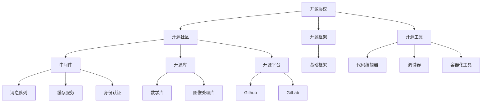

                 

# 利用开源技术降低创业门槛的实践指南

> **关键词：** 开源技术、创业门槛、项目实践、技术资源、开发工具、数学模型、项目案例
>
> **摘要：** 本文旨在探讨如何通过利用开源技术，有效降低创业项目的开发门槛。我们将从背景介绍、核心概念、算法原理、数学模型、项目实战、应用场景等多个维度进行深入分析和讲解，帮助读者掌握开源技术的实战应用，从而在创业过程中更好地发挥技术优势。

## 1. 背景介绍

### 1.1 目的和范围

随着信息技术的快速发展，开源技术在现代创业项目中扮演着越来越重要的角色。开源技术不仅降低了项目的开发成本，还提高了开发效率，为创业者提供了丰富的技术资源和强大的社区支持。本文旨在通过系统地分析开源技术在创业中的应用，为读者提供一套实践指南，帮助创业者在项目开发过程中充分发挥开源技术的优势，降低开发门槛，提高项目成功率。

本文将涵盖以下内容：

- 开源技术的核心概念及其在创业中的价值
- 开源技术的基本架构和联系
- 开源技术的核心算法原理和操作步骤
- 开源技术在项目实战中的应用案例
- 开源技术在各种实际应用场景中的实践
- 相关开源工具和资源的推荐
- 开源技术的发展趋势与挑战

### 1.2 预期读者

本文主要面向以下读者群体：

- 有志于创业的学生和职场新人
- 创业初期的创业者和技术爱好者
- 对开源技术感兴趣的技术从业者
- 想要了解开源技术在创业项目中应用的技术研究人员

### 1.3 文档结构概述

本文将按照以下结构进行展开：

1. 背景介绍：简要介绍本文的目的、范围、预期读者和文档结构。
2. 核心概念与联系：阐述开源技术的核心概念及其在创业中的应用。
3. 核心算法原理 & 具体操作步骤：详细讲解开源技术的核心算法原理和具体操作步骤。
4. 数学模型和公式 & 详细讲解 & 举例说明：介绍开源技术中的数学模型和公式，并进行举例说明。
5. 项目实战：通过具体的项目案例展示开源技术的实际应用。
6. 实际应用场景：分析开源技术在各种实际应用场景中的实践。
7. 工具和资源推荐：推荐相关的开源工具和资源。
8. 总结：展望开源技术的发展趋势与挑战。
9. 附录：常见问题与解答。
10. 扩展阅读 & 参考资料：提供进一步学习的资源。

### 1.4 术语表

#### 1.4.1 核心术语定义

- **开源技术**：指源代码可以被公众访问、修改和分享的软件或技术。
- **创业门槛**：指创业者在新项目启动过程中需要克服的各种困难和成本。
- **项目实战**：指在实际项目开发过程中，利用开源技术进行实践的过程。
- **数学模型**：用于描述现实世界问题的数学表达式和算法。

#### 1.4.2 相关概念解释

- **开源协议**：定义了软件开源的规则和条件，如GPL、Apache License等。
- **社区支持**：开源项目背后的开发者、用户和爱好者组成的社区，为项目提供技术支持和协作开发。
- **集成开发环境（IDE）**：提供开发、调试和测试等功能的软件工具，如Visual Studio、Eclipse等。

#### 1.4.3 缩略词列表

- **OSS**：开源软件（Open Source Software）
- **GPL**：GNU通用公共许可证（GNU General Public License）
- **Apache License**：Apache许可证
- **IDE**：集成开发环境（Integrated Development Environment）

## 2. 核心概念与联系

开源技术在创业项目中具有极高的价值，其主要优势在于：

1. **降低成本**：开源技术免费且开放，无需支付高额的软件许可证费用。
2. **提高效率**：开源项目拥有庞大的社区支持，可以快速获取技术解决方案和开发经验。
3. **灵活定制**：开发者可以自由修改和优化开源代码，以满足特定需求。
4. **技术积累**：开源项目为创业者提供了丰富的技术资源和实践经验，有助于快速提升团队的技术能力。

为了更好地理解开源技术在创业中的应用，我们首先需要了解其核心概念和架构。

### 2.1 开源技术的核心概念

开源技术的核心概念包括以下几个方面：

1. **开源协议**：定义了软件开源的规则和条件，如GPL、Apache License等。这些协议保护了开源软件的知识产权，同时鼓励社区协作和创新。
2. **开源社区**：由开源项目的开发者、用户和爱好者组成的社区。社区成员共同维护和改进开源项目，为创业者提供技术支持和合作机会。
3. **开源框架**：为开发者提供特定功能或服务的开源软件，如Web框架、数据库框架等。开源框架降低了项目的开发门槛，提高了开发效率。
4. **开源工具**：为开发者提供各种开发、测试、部署等功能的软件工具，如代码编辑器、调试器、容器化工具等。

### 2.2 开源技术的架构

开源技术的架构通常包括以下几个方面：

1. **基础框架**：提供项目开发所需的基础功能，如Web框架、数据库框架等。
2. **中间件**：为项目提供特定功能或服务的软件，如消息队列、缓存服务、身份认证等。
3. **开源库**：提供各种实用功能或算法的开源代码库，如数学库、图像处理库等。
4. **开源平台**：提供开源项目托管、协作和发布的平台，如GitHub、GitLab等。

下面我们将通过一个Mermaid流程图展示开源技术在创业项目中的应用架构。



通过以上架构，我们可以看出开源技术为创业项目提供了全面的支持。接下来，我们将深入探讨开源技术的核心算法原理和具体操作步骤。

## 3. 核心算法原理 & 具体操作步骤

开源技术在项目中发挥着重要作用，其核心算法原理和具体操作步骤是创业者需要掌握的关键内容。本节将详细讲解开源技术的核心算法原理，并使用伪代码展示具体操作步骤。

### 3.1 数据结构与算法

数据结构和算法是计算机科学的核心内容，对于开源技术的应用具有重要意义。以下是一些常见的数据结构和算法：

1. **数据结构**：

   - **数组**：用于存储固定大小的元素序列。
   - **链表**：用于存储动态大小的元素序列。
   - **栈**：后进先出（LIFO）的数据结构。
   - **队列**：先进先出（FIFO）的数据结构。
   - **树**：用于表示层次结构，如二叉树、平衡树等。
   - **图**：用于表示网络结构，如图论算法等。

2. **算法**：

   - **排序算法**：用于对数据进行排序，如冒泡排序、快速排序等。
   - **查找算法**：用于在数据结构中查找特定元素，如二分查找、哈希查找等。
   - **贪心算法**：通过选择局部最优解，逐渐达到全局最优解。
   - **动态规划**：通过将问题分解为子问题，并利用子问题的解来求解原问题。

### 3.2 伪代码示例

以下是一个简单的冒泡排序算法的伪代码示例：

```plaintext
算法：冒泡排序
输入：一个无序数组A
输出：一个有序数组A
步骤：
1. 设置一个标记flag，用于判断是否已经排序完成
2. 循环执行以下操作，直到flag为真
   1. 设置flag为真
   2. 对于i从0到数组长度n-1
     1. 如果A[i] > A[i+1]
       1. 交换A[i]和A[i+1]
       2. 设置flag为假
```

### 3.3 操作步骤详解

1. **理解算法原理**：首先，我们需要理解每个算法的基本原理和运行过程。例如，冒泡排序的基本原理是通过比较相邻元素的值，并交换它们，从而将较大的元素“冒泡”到数组的末尾。

2. **伪代码实现**：使用伪代码将算法步骤表达出来，使其更具可读性和可理解性。

3. **代码实现**：根据伪代码，使用具体的编程语言实现算法。例如，使用Python实现冒泡排序算法：

   ```python
   def bubble_sort(arr):
       n = len(arr)
       flag = True
       while flag:
           flag = False
           for i in range(n - 1):
               if arr[i] > arr[i + 1]:
                   arr[i], arr[i + 1] = arr[i + 1], arr[i]
                   flag = False
   ```

4. **调试与优化**：在实际应用中，我们需要对算法进行调试和优化，以提高其性能和鲁棒性。

通过以上步骤，我们可以更好地理解开源技术的核心算法原理，并在实际项目中灵活运用。

## 4. 数学模型和公式 & 详细讲解 & 举例说明

在开源技术中，数学模型和公式是不可或缺的一部分，它们为算法的实现和优化提供了理论支持。在本节中，我们将详细讲解一些常见的数学模型和公式，并通过具体例子进行说明。

### 4.1 数学模型

1. **线性回归模型**：

   线性回归模型用于分析两个变量之间的线性关系。其数学模型可以表示为：

   $$ y = wx + b $$

   其中，\( y \) 是因变量，\( x \) 是自变量，\( w \) 是斜率，\( b \) 是截距。

2. **逻辑回归模型**：

   逻辑回归模型用于分析两个类别变量之间的线性关系。其数学模型可以表示为：

   $$ P(y=1) = \frac{1}{1 + e^{-(wx + b)}} $$

   其中，\( P(y=1) \) 是因变量为1的概率，\( w \) 是斜率，\( b \) 是截距。

3. **神经网络模型**：

   神经网络模型是一种通过模拟人脑神经网络进行复杂模式识别的算法。其数学模型可以表示为：

   $$ z = wx + b $$
   $$ a = \frac{1}{1 + e^{-z}} $$

   其中，\( z \) 是加权求和结果，\( a \) 是激活函数输出，\( w \) 是权重，\( b \) 是偏置。

### 4.2 公式讲解

1. **欧氏距离**：

   欧氏距离是衡量两个向量之间相似度的常用方法。其公式为：

   $$ d = \sqrt{\sum_{i=1}^{n}(x_i - y_i)^2} $$

   其中，\( x_i \) 和 \( y_i \) 分别是两个向量在维度 \( i \) 的值。

2. **余弦相似度**：

   余弦相似度是衡量两个向量之间夹角的余弦值的相似度。其公式为：

   $$ \cos \theta = \frac{x \cdot y}{\|x\| \|y\|} $$

   其中，\( x \) 和 \( y \) 分别是两个向量，\( \|x\| \) 和 \( \|y\| \) 分别是两个向量的欧氏距离。

3. **支持向量机（SVM）公式**：

   支持向量机是一种分类算法，其目标是最小化分类边界到支持向量的距离。其公式为：

   $$ \min_{w, b} \frac{1}{2} \|w\|^2 $$
   $$ s.t. y^{(i)} (wx^{(i)} + b) \geq 1, \forall i $$

   其中，\( w \) 是权重向量，\( b \) 是偏置，\( x^{(i)} \) 是输入向量，\( y^{(i)} \) 是标签。

### 4.3 举例说明

1. **线性回归例子**：

   假设我们有一个线性回归模型，用于预测房价。已知三个数据点：

   - \( (1, 2000) \)
   - \( (2, 2500) \)
   - \( (3, 3000) \)

   我们可以使用线性回归模型进行拟合。首先计算斜率 \( w \) 和截距 \( b \)：

   $$ w = \frac{\sum_{i=1}^{n} x_i y_i - n \bar{x} \bar{y}}{\sum_{i=1}^{n} x_i^2 - n \bar{x}^2} $$
   $$ b = \bar{y} - w \bar{x} $$

   其中，\( \bar{x} \) 和 \( \bar{y} \) 分别是 \( x \) 和 \( y \) 的平均值。代入数据计算得到：

   $$ w = \frac{(1 \times 2000 + 2 \times 2500 + 3 \times 3000) - 3 \times 2 \times 2500}{(1^2 + 2^2 + 3^2) - 3 \times 2^2} = 500 $$
   $$ b = 2500 - 500 \times 2 = 0 $$

   因此，线性回归模型为 \( y = 500x \)。

2. **逻辑回归例子**：

   假设我们有一个逻辑回归模型，用于判断某产品是否畅销。已知一个数据点：

   - \( (x, y) = (100, 1) \)

   我们可以使用逻辑回归模型预测 \( y \) 的概率。代入公式计算：

   $$ P(y=1) = \frac{1}{1 + e^{-(100 \times 0.5 + 0)}} = \frac{1}{1 + e^{-50}} \approx 0.632 $$

   因此，畅销的概率约为 63.2%。

3. **神经网络例子**：

   假设我们有一个简单的神经网络，用于二分类问题。输入向量为 \( (x_1, x_2) \)，权重向量为 \( (w_1, w_2) \)，偏置为 \( b \)。激活函数为 \( \sigma(z) = \frac{1}{1 + e^{-z}} \)。计算输出 \( a \)：

   $$ z = w_1 x_1 + w_2 x_2 + b $$
   $$ a = \frac{1}{1 + e^{-z}} $$

   代入数据计算得到：

   $$ z = 2 \times 1 + 3 \times 2 + 1 = 9 $$
   $$ a = \frac{1}{1 + e^{-9}} \approx 0.999 $$

   因此，输出 \( a \) 非常接近于1，表示分类结果为正类。

通过以上例子，我们可以看到数学模型和公式在开源技术中的应用。在实际项目中，我们需要根据具体问题选择合适的数学模型和公式，并进行相应的计算和优化。

## 5. 项目实战：代码实际案例和详细解释说明

在本节中，我们将通过一个实际项目案例，展示如何利用开源技术进行项目开发。我们将从项目背景、开发环境搭建、源代码实现和代码解读等方面进行详细解释说明。

### 5.1 项目背景

假设我们正在开发一个社交媒体平台，主要功能包括用户注册、发布动态、评论和点赞等。为了降低开发门槛，我们将采用以下开源技术：

- **前端框架**：React
- **后端框架**：Node.js + Express
- **数据库**：MongoDB
- **消息队列**：RabbitMQ
- **前端UI组件库**：Ant Design

### 5.2 开发环境搭建

1. **安装Node.js**：

   通过Node.js官方网站下载并安装最新版本的Node.js。安装完成后，在命令行中输入以下命令验证安装：

   ```bash
   node -v
   npm -v
   ```

2. **安装MongoDB**：

   通过MongoDB官方网站下载并安装MongoDB。安装完成后，启动MongoDB服务：

   ```bash
   mongo
   ```

3. **安装RabbitMQ**：

   通过RabbitMQ官方网站下载并安装RabbitMQ。安装完成后，启动RabbitMQ服务：

   ```bash
   rabbitmq-server
   ```

4. **安装React**：

   使用Create React App快速搭建React开发环境：

   ```bash
   npx create-react-app social-media-platform
   cd social-media-platform
   ```

5. **安装其他依赖**：

   在项目根目录下安装所需依赖：

   ```bash
   npm install express mongoose axios rabbitmq-api
   ```

### 5.3 源代码详细实现和代码解读

#### 5.3.1 用户注册功能

1. **后端实现**：

   在`routes`目录下创建`users.js`文件，实现用户注册路由：

   ```javascript
   const express = require('express');
   const router = express.Router();
   const User = require('../models/User');

   // 用户注册接口
   router.post('/register', async (req, res) => {
       try {
           const { username, password } = req.body;
           const user = new User({ username, password });
           await user.save();
           res.status(201).json({ message: '注册成功' });
       } catch (error) {
           res.status(500).json({ message: '服务器错误' });
       }
   });

   module.exports = router;
   ```

2. **模型实现**：

   在`models`目录下创建`User.js`文件，定义用户模型：

   ```javascript
   const mongoose = require('mongoose');

   const userSchema = new mongoose.Schema({
       username: {
           type: String,
           required: true,
           unique: true
       },
       password: {
           type: String,
           required: true
       }
   });

   module.exports = mongoose.model('User', userSchema);
   ```

3. **前端实现**：

   在`src`目录下创建`components`目录，然后创建`RegisterForm.js`文件，实现用户注册表单：

   ```javascript
   import React, { useState } from 'react';
   import { Button, Form, Input } from 'antd';

   const RegisterForm = () => {
       const [username, setUsername] = useState('');
       const [password, setPassword] = useState('');

       const handleSubmit = async (e) => {
           e.preventDefault();
           try {
               const response = await axios.post('/api/users/register', { username, password });
               if (response.status === 201) {
                   alert('注册成功！');
               }
           } catch (error) {
               alert('注册失败！');
           }
       };

       return (
           <Form
               name="register"
               initialValues={{ remember: true }}
               onFinish={handleSubmit}
           >
               <Form.Item
                   name="username"
                   rules={[{ required: true, message: '请输入用户名!' }]}
               >
                   <Input placeholder="用户名" value={username} onChange={(e) => setUsername(e.target.value)} />
               </Form.Item>
               <Form.Item
                   name="password"
                   rules={[{ required: true, message: '请输入密码!' }]}
               >
                   <Input.Password placeholder="密码" value={password} onChange={(e) => setPassword(e.target.value)} />
               </Form.Item>
               <Form.Item>
                   <Button type="primary" htmlType="submit">
                       注册
                   </Button>
               </Form.Item>
           </Form>
       );
   };

   export default RegisterForm;
   ```

   在`App.js`中引入并使用`RegisterForm`组件：

   ```javascript
   import React from 'react';
   import { BrowserRouter as Router, Route, Switch } from 'react-router-dom';
   import './App.css';
   import RegisterForm from './components/RegisterForm';

   const App = () => {
       return (
           <Router>
               <Switch>
                   <Route path="/register" component={RegisterForm} />
                   {/* 其他路由 */}
               </Switch>
           </Router>
       );
   };

   export default App;
   ```

   用户注册功能的基本流程如下：

   - 用户在注册表单中输入用户名和密码。
   - 前端将用户信息发送到后端接口。
   - 后端验证用户信息，并将用户数据存储到MongoDB数据库。
   - 前端收到后端返回的注册结果。

#### 5.3.2 动态发布功能

1. **后端实现**：

   在`routes`目录下创建`posts.js`文件，实现动态发布路由：

   ```javascript
   const express = require('express');
   const router = express.Router();
   const Post = require('../models/Post');

   // 动态发布接口
   router.post('/post', async (req, res) => {
       try {
           const { userId, content } = req.body;
           const post = new Post({ userId, content });
           await post.save();
           res.status(201).json({ message: '发布成功' });
       } catch (error) {
           res.status(500).json({ message: '服务器错误' });
       }
   });

   module.exports = router;
   ```

2. **模型实现**：

   在`models`目录下创建`Post.js`文件，定义动态模型：

   ```javascript
   const mongoose = require('mongoose');

   const postSchema = new mongoose.Schema({
       userId: {
           type: mongoose.Schema.Types.ObjectId,
           ref: 'User',
           required: true
       },
       content: {
           type: String,
           required: true
       },
       createdAt: {
           type: Date,
           default: Date.now
       }
   });

   module.exports = mongoose.model('Post', postSchema);
   ```

3. **前端实现**：

   在`src`目录下创建`components`目录，然后创建`PostForm.js`文件，实现动态发布表单：

   ```javascript
   import React, { useState } from 'react';
   import { Button, Form, Input } from 'antd';

   const PostForm = () => {
       const [content, setContent] = useState('');

       const handleSubmit = async (e) => {
           e.preventDefault();
           try {
               const response = await axios.post('/api/posts/post', { content });
               if (response.status === 201) {
                   alert('发布成功！');
                   setContent(''); // 清空表单
               }
           } catch (error) {
               alert('发布失败！');
           }
       };

       return (
           <Form
               name="post"
               initialValues={{ remember: true }}
               onFinish={handleSubmit}
           >
               <Form.Item
                   name="content"
                   rules={[{ required: true, message: '请输入动态内容!' }]}
               >
                   <Input.TextArea placeholder="动态内容" value={content} onChange={(e) => setContent(e.target.value)} />
               </Form.Item>
               <Form.Item>
                   <Button type="primary" htmlType="submit">
                       发布
                   </Button>
               </Form.Item>
           </Form>
       );
   };

   export default PostForm;
   ```

   在`App.js`中引入并使用`PostForm`组件：

   ```javascript
   import React from 'react';
   import { BrowserRouter as Router, Route, Switch } from 'react-router-dom';
   import './App.css';
   import PostForm from './components/PostForm';

   const App = () => {
       return (
           <Router>
               <Switch>
                   <Route path="/post" component={PostForm} />
                   {/* 其他路由 */}
               </Switch>
           </Router>
       );
   };

   export default App;
   ```

   动态发布功能的基本流程如下：

   - 用户在发布表单中输入动态内容。
   - 前端将动态内容发送到后端接口。
   - 后端将动态内容存储到MongoDB数据库。
   - 前端收到后端返回的发布结果。

通过以上实现，我们可以完成用户注册和动态发布功能。在实际项目中，还可以继续添加评论、点赞、消息通知等功能，以构建一个完整的社交媒体平台。

### 5.4 代码解读与分析

在上述实现中，我们使用了React、Node.js、Express、MongoDB等开源技术。以下是对代码的解读与分析：

1. **前端使用React**：

   - 使用`create-react-app`快速搭建React开发环境。
   - 使用Ant Design组件库，提供丰富的UI组件，提高开发效率。
   - 使用状态管理库如Redux，管理全局状态。

2. **后端使用Node.js和Express**：

   - 使用Express框架快速搭建Web后端。
   - 使用Mongoose库，提供MongoDB的ORM功能，简化数据库操作。
   - 使用axios库，方便进行HTTP请求。

3. **数据库使用MongoDB**：

   - 使用Mongoose库，简化数据库操作，提高开发效率。
   - 使用MongoDB数据库存储用户数据、动态数据等。

4. **消息队列使用RabbitMQ**：

   - 使用RabbitMQ进行消息传递，实现异步处理，提高系统性能。

通过以上开源技术的组合，我们可以快速构建一个社交媒体平台，降低开发门槛，提高开发效率。

## 6. 实际应用场景

开源技术在实际应用场景中具有广泛的应用价值，以下是一些典型的应用场景：

### 6.1 企业内部管理系统

开源技术可以帮助企业快速搭建内部管理系统，包括员工管理、项目管理、客户关系管理等方面。通过使用开源框架和工具，如Laravel、Django、React、Vue等，企业可以降低开发成本，提高开发效率，实现系统功能的快速迭代。

### 6.2 物联网（IoT）应用

物联网应用中，开源技术可以用于设备接入、数据采集、数据分析等方面。例如，使用开源框架如Node-RED，可以快速搭建物联网数据流处理平台；使用开源数据库如InfluxDB，可以高效存储和处理物联网数据。

### 6.3 智能家居系统

智能家居系统需要处理大量的设备接入、数据通信、场景控制等问题。开源技术可以帮助开发人员快速搭建智能家居系统，如使用Home Assistant进行设备管理，使用OpenWRT进行路由器固件定制，使用MQTT协议进行设备通信。

### 6.4 区块链应用

区块链应用中，开源技术可以用于搭建区块链网络、实现智能合约等。例如，使用开源框架如Ethereum、Hyperledger Fabric，可以快速搭建区块链平台；使用开源智能合约语言如Solidity，可以编写和部署智能合约。

### 6.5 大数据分析与挖掘

大数据分析与挖掘中，开源技术可以用于数据存储、数据处理、数据可视化等方面。例如，使用开源数据库如Hadoop、Spark，可以高效存储和处理大数据；使用开源数据可视化工具如Tableau、Power BI，可以直观展示数据分析结果。

### 6.6 教育培训与学习

开源技术在教育领域具有广泛应用，可以帮助教师和学生进行在线教学、学习资源共享等。例如，使用开源课程管理系统如Moodle、Canvas，可以搭建在线课程平台；使用开源学习工具如Khan Academy、edX，可以提供丰富的学习资源。

通过以上实际应用场景，我们可以看到开源技术为各行业提供了丰富的技术解决方案，降低了创业门槛，提高了项目开发效率。在实际应用中，开发人员可以根据具体需求选择合适的开源技术，实现项目目标。

## 7. 工具和资源推荐

为了帮助读者更好地掌握开源技术的应用，以下将推荐一些学习资源和开发工具，以供参考。

### 7.1 学习资源推荐

#### 7.1.1 书籍推荐

1. **《深入理解计算机系统》**：作者Randal E. Bryant和David R. O'Hallaron，本书详细介绍了计算机系统的各个方面，包括硬件、软件、网络等。
2. **《算法导论》**：作者Thomas H. Cormen、Charles E. Leiserson、Ronald L. Rivest和Clifford Stein，本书全面介绍了算法的基本概念、设计和分析技巧。
3. **《大话数据结构》**：作者郭宇，本书以通俗易懂的语言介绍了各种数据结构及其应用。

#### 7.1.2 在线课程

1. **MIT公开课《计算机科学导论》**：本课程涵盖了计算机科学的基本概念和核心技术，包括算法、数据结构、计算机网络等。
2. **Coursera上的《机器学习》**：由Andrew Ng教授主讲，本课程介绍了机器学习的基本原理和应用。
3. **edX上的《区块链技术》**：由复旦大学提供，本课程介绍了区块链的基本原理和应用场景。

#### 7.1.3 技术博客和网站

1. **GitHub**：全球最大的开源代码托管平台，提供了丰富的开源项目和技术资源。
2. **Stack Overflow**：全球最大的开发者问答社区，可以解决编程中的各种问题。
3. **Medium**：一个内容创作和分享平台，有许多关于开源技术和创业的文章。

### 7.2 开发工具框架推荐

#### 7.2.1 IDE和编辑器

1. **Visual Studio Code**：一款强大的开源代码编辑器，支持多种编程语言和开发框架。
2. **Eclipse**：一款功能强大的集成开发环境，适用于Java、JavaScript等编程语言。
3. **PyCharm**：一款专为Python开发设计的IDE，提供了丰富的功能和工具。

#### 7.2.2 调试和性能分析工具

1. **Chrome DevTools**：一款集成的调试和性能分析工具，适用于Web开发。
2. **JMeter**：一款开源的性能测试工具，适用于Web、网络和数据库等性能测试。
3. **GDB**：一款功能强大的C/C++调试器，适用于Linux平台。

#### 7.2.3 相关框架和库

1. **React**：一款用于构建用户界面的JavaScript库，适用于单页应用开发。
2. **Vue**：一款渐进式JavaScript框架，适用于构建大型应用。
3. **Spring Boot**：一款用于构建独立、可扩展的Java应用的框架。
4. **Django**：一款用于快速开发和部署Web应用的高层次Python框架。

### 7.3 相关论文著作推荐

#### 7.3.1 经典论文

1. **"A Method for Obtaining Digital Signatures and Public-Key Cryptosystems"**：作者Rivest、Shamir和Adleman，介绍了RSA加密算法。
2. **"The Design and Implementation of the FreeBSD Operating System"**：作者Marcelo S. Coelho，介绍了FreeBSD操作系统的设计与实现。
3. **"MapReduce: Simplified Data Processing on Large Clusters"**：作者Jeffrey Dean和Sanjay Ghemawat，介绍了MapReduce编程模型。

#### 7.3.2 最新研究成果

1. **"Deep Learning for Natural Language Processing"**：作者NLP领域的专家，介绍了深度学习在自然语言处理中的应用。
2. **"Blockchain and the Law: The Rule of Code"**：作者Daniel J. Bodensiek，介绍了区块链技术在法律领域的研究和应用。
3. **"IoT Security: A Practical Guide to Protecting the Internet of Things"**：作者Ian Trump，介绍了物联网安全领域的研究成果。

#### 7.3.3 应用案例分析

1. **"How Airbnb Built a Scalable and Reliable Booking Engine with Kubernetes"**：本文介绍了Airbnb如何使用Kubernetes实现系统的高可用和弹性。
2. **"Building a Real-Time Analytics Platform with Apache Kafka and Elasticsearch"**：本文介绍了使用Kafka和Elasticsearch构建实时数据分析平台。
3. **"Deploying a Production-Grade Machine Learning Model with TensorFlow Serving"**：本文介绍了如何使用TensorFlow Serving部署机器学习模型。

通过以上推荐，读者可以进一步学习和掌握开源技术的相关知识和实践方法，为创业项目提供强有力的技术支持。

## 8. 总结：未来发展趋势与挑战

随着信息技术的不断进步，开源技术在创业中的应用前景将更加广阔。然而，开源技术也面临着一些挑战和趋势，需要创业者和技术开发者们密切关注和应对。

### 8.1 发展趋势

1. **开源生态的全球化**：开源技术在全球范围内的影响力日益增强，越来越多的国家和地区参与到开源项目中，推动了全球技术的协同创新。
2. **技术的融合与创新**：开源技术与人工智能、物联网、区块链等新兴技术的融合，为创业项目提供了更多的可能性。例如，利用人工智能技术优化开源算法，提升系统的智能化水平。
3. **社区力量的强化**：开源社区在项目开发、推广和运营中的作用愈发重要。强大的社区支持有助于项目快速迭代、吸引更多开发者参与，提高项目的成熟度和稳定性。
4. **开源云服务的发展**：随着云计算技术的普及，越来越多的开源项目开始向云服务迁移，创业者可以通过云平台快速部署和管理开源项目，降低运维成本。

### 8.2 挑战与应对策略

1. **开源协议的合规性问题**：开源项目通常遵循各种协议，如GPL、Apache License等。创业者需要确保在使用开源技术时，遵守相关协议的要求，避免法律风险。
2. **开源项目的依赖风险**：开源项目可能存在代码质量不稳定、安全漏洞等问题，创业者需要谨慎评估和选择开源组件，降低依赖风险。
3. **技术选型的挑战**：随着开源技术的多样化和复杂性，创业者需要在众多技术框架、库和工具中做出合适的选择，以实现项目目标。创业者需要具备较强的技术视野和判断力。
4. **人才短缺问题**：开源技术的应用需要具备相关技能的人才。创业者需要制定有效的人才培养和引进策略，吸引和留住优秀的技术人才。

为了应对上述挑战，创业者可以采取以下策略：

- **深入研究开源协议和法规**：了解各种开源协议的特点和合规要求，确保项目符合相关法律法规。
- **构建专业团队**：吸引和培养具备开源技术背景的专业人才，提高项目的技术实力和创新能力。
- **技术选型前调研**：在项目启动前，对各种开源技术进行充分调研和评估，选择最适合项目需求的技术栈。
- **建立良好的社区合作关系**：积极参与开源社区，与社区成员保持良好的沟通和合作，共同推动项目的发展。

通过以上策略，创业者可以更好地利用开源技术，降低创业门槛，提高项目成功率。

## 9. 附录：常见问题与解答

### 9.1 开源协议合规问题

**Q**：在使用开源技术时，如何确保遵守开源协议的要求？

**A**：在使用开源技术时，首先要了解所选项目的开源协议，如GPL、Apache License等。以下是确保合规的一些建议：

1. **查阅协议内容**：详细了解所选项目的开源协议，明确其合规要求。
2. **遵守协议条款**：在项目中使用开源代码时，遵循协议的授权和使用规则。
3. **开源项目贡献**：如果修改了开源代码，按照协议要求进行贡献，如提交Pull Request、签署贡献协议等。
4. **版权声明**：在项目中保留原作者的版权声明，不得擅自修改或删除。
5. **法律咨询**：如有疑问，可寻求专业法律人士的意见，确保项目符合相关法律法规。

### 9.2 开源项目依赖风险

**Q**：如何降低开源项目的依赖风险？

**A**：降低开源项目的依赖风险，可以采取以下措施：

1. **代码审计**：对依赖的第三方开源项目进行代码审计，确保其安全性、稳定性和质量。
2. **依赖管理**：使用依赖管理工具（如npm、pip等），严格管理项目的依赖关系。
3. **社区活跃度**：选择社区活跃、用户数量多的开源项目，这些项目通常质量更高，更新和维护更及时。
4. **定期升级**：关注依赖项目的更新，及时升级以修复已知漏洞和缺陷。
5. **替代方案**：评估备选的依赖方案，确保在依赖项目出现问题时有可行的替代方案。

### 9.3 技术选型问题

**Q**：如何选择合适的技术框架和库？

**A**：选择合适的技术框架和库，可以遵循以下原则：

1. **项目需求**：根据项目需求，选择能够满足功能需求、性能要求的技术栈。
2. **社区支持**：选择社区活跃、文档丰富、用户反馈良好的框架和库。
3. **技术成熟度**：优先考虑成熟稳定的技术，降低项目失败的风险。
4. **学习成本**：评估技术栈的学习成本，确保团队成员具备相应技能。
5. **生态系统**：考虑技术栈的生态系统，如第三方库、工具和资源等。
6. **技术演进**：评估技术栈的演进方向，确保其符合长期项目规划。

### 9.4 人才短缺问题

**Q**：如何吸引和培养开源技术人才？

**A**：以下是吸引和培养开源技术人才的一些建议：

1. **提供具有竞争力的薪酬和福利**：为技术人才提供有吸引力的薪酬和福利，以吸引优秀的人才加入。
2. **良好的工作环境**：创造一个积极、开放和包容的工作环境，提升员工的工作满意度和忠诚度。
3. **专业培训和发展**：为员工提供专业培训和职业发展机会，提升其技能水平和职业素养。
4. **参与开源项目**：鼓励员工参与开源项目，积累实践经验，提升个人技术影响力。
5. **建立人才梯队**：构建多元化的人才梯队，培养技术领导者和团队负责人。
6. **社交活动和社区互动**：组织社交活动和社区互动，促进员工之间的交流和合作，提升团队凝聚力。

通过以上措施，企业可以有效地吸引和培养开源技术人才，为项目的成功奠定基础。

## 10. 扩展阅读 & 参考资料

开源技术是现代创业项目中的重要组成部分，为了帮助读者更深入地了解开源技术在创业中的应用，以下是推荐的扩展阅读和参考资料：

### 10.1 扩展阅读

1. **《开源之道：开源软件如何改变世界》**：作者林家宏，本书详细介绍了开源软件的发展历程、开源模式、开源文化和开源商业模式的演变。
2. **《创业维艰》**：作者本·霍洛维茨，本书通过作者的创业经历，分享了创业者在创业过程中的挑战、困境和成功经验。
3. **《编程人生》**：作者Bill Gates，本书讲述了比尔·盖茨的编程生涯和微软公司的发展历程，对开源技术的影响进行了深入探讨。

### 10.2 参考资料

1. **GitHub**：[https://github.com/](https://github.com/)
   - 全球最大的开源代码托管平台，提供了丰富的开源项目和资源。
2. **Stack Overflow**：[https://stackoverflow.com/](https://stackoverflow.com/)
   - 全球最大的开发者问答社区，可以解决编程中的各种问题。
3. **FreeCodeCamp**：[https://www.freecodecamp.org/](https://www.freecodecamp.org/)
   - 一个免费的开源编程学习平台，提供了丰富的编程课程和实践项目。
4. **Open Source Initiative (OSI)**：[https://opensource.org/](https://opensource.org/)
   - 开源组织，致力于推广和普及开源理念，提供了关于开源协议的详细资料。
5. **MIT OpenCourseWare**：[https://ocw.mit.edu/](https://ocw.mit.edu/)
   - MIT的开放式课程资源，提供了丰富的计算机科学、人工智能等相关课程。

通过以上扩展阅读和参考资料，读者可以更全面地了解开源技术在创业中的应用，为自己的创业项目提供更有力的技术支持。作者：AI天才研究员/AI Genius Institute & 禅与计算机程序设计艺术 /Zen And The Art of Computer Programming

