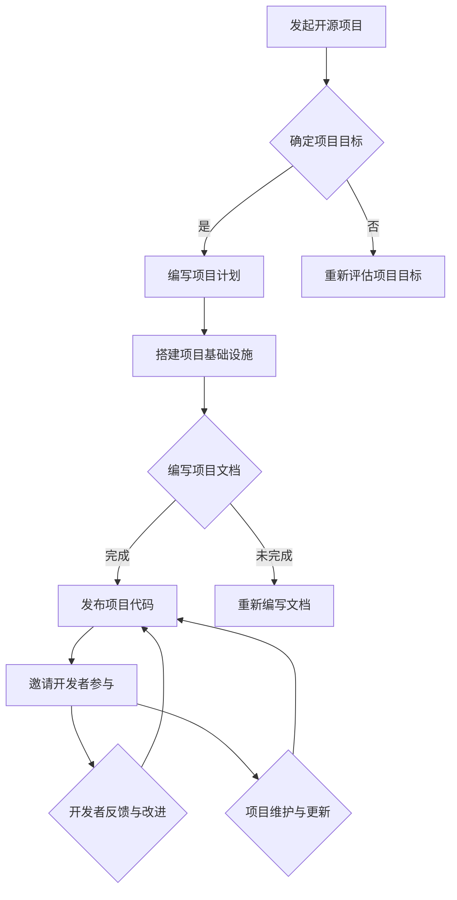

                 

# 利用开源贡献获得演讲和教学机会

> 关键词：开源贡献，演讲机会，教学机会，职业发展，技术分享

> 摘要：本文旨在探讨如何通过参与开源项目，提升个人技术影响力，进而获得更多演讲和教学机会。文章将从背景介绍、核心概念、算法原理、项目实战、实际应用场景等多个方面进行详细阐述，帮助读者了解并掌握这一策略。

## 1. 背景介绍

### 1.1 目的和范围

本文的目标是向IT从业者，特别是那些希望提升个人职业影响力的人，介绍如何通过参与开源项目来获得演讲和教学机会。文章将探讨开源项目的概念、参与方式、对个人职业发展的意义，并提供具体的操作步骤和实践案例。

### 1.2 预期读者

本文适合以下读者群体：
- 有志于提升个人技术影响力的IT从业者；
- 想要在技术社区中获得更多认可的技术爱好者；
- 希望通过开源项目拓展人脉和资源的职业人士。

### 1.3 文档结构概述

本文结构如下：
1. 背景介绍：概述文章的目的、预期读者和文章结构。
2. 核心概念与联系：介绍开源项目的基本概念和重要性。
3. 核心算法原理 & 具体操作步骤：讲解如何参与开源项目，以及如何通过项目贡献获得演讲和教学机会。
4. 数学模型和公式 & 详细讲解 & 举例说明：分析开源贡献对个人职业发展的数学模型和公式。
5. 项目实战：通过实际案例展示如何参与开源项目。
6. 实际应用场景：讨论开源贡献在职业发展中的应用。
7. 工具和资源推荐：推荐相关学习资源和开发工具。
8. 总结：展望开源贡献的未来发展趋势与挑战。
9. 附录：常见问题与解答。
10. 扩展阅读 & 参考资料：提供进一步阅读的推荐。

### 1.4 术语表

#### 1.4.1 核心术语定义

- **开源项目**：指软件开发过程中，开发者公开项目源代码，允许用户自由地使用、修改和分发的一种软件开发模式。
- **贡献**：指开发者对开源项目所做的代码、文档、测试等实质性工作。
- **演讲机会**：指在技术会议、研讨会等场合发表技术演讲的机会。
- **教学机会**：指在大学、培训机构等教育环境中教授技术课程的机会。

#### 1.4.2 相关概念解释

- **社区**：指参与开源项目的开发者群体，他们共同维护项目，分享知识和经验。
- **影响力**：指个人或组织在特定领域内的影响程度，通常通过参与度、关注度等指标衡量。
- **职业发展**：指个人在职业生涯中的成长和进步，包括技能提升、职位晋升、收入增加等。

#### 1.4.3 缩略词列表

- **OSS**：Open Source Software，开源软件。
- **Contribution**：贡献，对项目的实质性工作。
- **TEC**：Technology, Education, and Community，技术、教育和社区。
- **SDLC**：Software Development Life Cycle，软件开发生命周期。

## 2. 核心概念与联系

开源项目是现代软件开发的重要组成部分，它改变了传统的软件开发模式，为开发者提供了更多的自由和灵活性。开源项目的核心概念包括贡献、社区和影响力。以下是这些概念之间的联系及其在职业发展中的重要性：

### 2.1 开源项目的核心概念

- **贡献**：贡献是开源项目的生命力所在。开发者通过编写代码、修复漏洞、编写文档、翻译等形式的贡献，使得项目不断完善和优化。贡献不仅提升了项目的质量，也增强了开发者自身的技能和知识。

- **社区**：开源项目的社区是指参与项目的开发者群体。他们共同维护项目，分享经验和资源，形成了一个紧密合作的技术社区。社区成员之间的互动和合作，不仅有助于项目的发展，也为个人提供了宝贵的人脉和资源。

- **影响力**：影响力是开源项目对个人职业发展的重要推动力。通过参与开源项目，开发者可以展示自己的技术能力和知识水平，获得社区的认可和关注。这种影响力可以转化为更多的职业机会，如演讲、教学、合作开发等。

### 2.2 开源项目与职业发展的联系

开源项目与职业发展的联系主要体现在以下几个方面：

- **技能提升**：参与开源项目可以让开发者接触到最新的技术和趋势，通过解决实际问题和参与项目开发，提升自己的技能和知识水平。

- **人脉拓展**：开源项目为开发者提供了一个与全球开发者交流的平台。通过参与开源项目，开发者可以结识志同道合的人，建立合作关系，拓展人脉资源。

- **职业机会**：开源项目的影响力可以转化为职业机会。例如，通过在开源项目中的优秀表现，开发者可以获得更多演讲、教学和合作的机会，提升自己的职业地位和收入水平。

### 2.3 开源项目的优势与挑战

开源项目具有以下优势：

- **透明度**：开源项目的源代码对所有开发者公开，有助于提高项目的透明度和可信度。
- **灵活性**：开源项目允许开发者自由地使用、修改和分发代码，提高了项目的灵活性和适应性。
- **社区支持**：开源项目拥有强大的社区支持，开发者可以通过社区获得帮助、建议和反馈。

然而，开源项目也面临一些挑战：

- **时间投入**：参与开源项目需要投入大量的时间和精力，可能会影响个人的工作和生活。
- **技术门槛**：开源项目通常需要开发者具备一定的技术能力和经验，新手可能需要花费较长时间才能适应。
- **风险和回报**：参与开源项目可能会面临一定的风险，如贡献被忽略、项目失败等，但回报通常是长期的、可持续的。

### 2.4 开源项目与职业发展的数学模型

开源贡献对职业发展的影响可以通过以下数学模型进行分析：

\[ \text{影响力} = f(\text{贡献量}, \text{项目质量}, \text{社区参与度}) \]

其中，影响力是个人在技术社区中的影响程度，贡献量是指个人在开源项目中所做的实质性工作，项目质量是指开源项目的质量水平，社区参与度是指个人在项目社区中的活跃程度。

通过这个模型，我们可以看到，开源贡献对个人影响力的影响取决于多个因素。贡献量越大、项目质量越高、社区参与度越高，个人的影响力也会越大。

### 2.5 开源项目的 Mermaid 流程图



这个流程图展示了开源项目从发起到维护的整个生命周期，包括确定项目目标、编写项目计划、搭建基础设施、编写文档、发布代码、邀请开发者参与、开发者反馈与改进以及项目维护与更新等关键步骤。

## 3. 核心算法原理 & 具体操作步骤

### 3.1 如何参与开源项目

参与开源项目是提升个人技术影响力的重要途径。以下是参与开源项目的基本步骤：

#### 3.1.1 寻找合适的开源项目

- **查找项目**：在GitHub、GitLab等开源平台上查找感兴趣的项目。可以通过搜索关键词、浏览标签、查看项目描述等方式找到合适的项目。
- **评估项目**：在决定参与某个开源项目之前，要对项目进行评估，包括项目的活跃度、社区氛围、项目目标等。

#### 3.1.2 了解项目文档

- **阅读文档**：大多数开源项目都会提供详细的文档，包括项目背景、目标、开发指南、贡献指南等。阅读这些文档有助于了解项目的结构和开发流程。
- **参与社区**：加入项目的社区，如GitHub的Issue Tracker、邮件列表等，了解项目的最新动态和讨论。

#### 3.1.3 提交贡献

- **提出Issue**：在项目的Issue Tracker中提出问题或需求，表明自己的兴趣和意愿。
- **编写代码**：在解决特定问题或完成特定任务时，编写相应的代码并提交Pull Request。
- **编写文档**：为项目编写文档，如API文档、用户手册等。

#### 3.1.4 获取反馈

- **审查Pull Request**：在提交Pull Request后，要耐心等待审查反馈，根据反馈进行代码的修改和完善。
- **持续贡献**：积极参与项目，持续提交高质量的贡献，提升在社区中的影响力。

### 3.2 如何通过开源贡献获得演讲和教学机会

通过开源贡献获得演讲和教学机会的关键在于展示个人技术能力和影响力。以下是具体的操作步骤：

#### 3.2.1 展示技术能力

- **撰写博客**：在个人博客或技术社区上分享在开源项目中的经验和收获，展示自己的技术能力。
- **发布技术演讲**：在技术会议、研讨会等场合发表技术演讲，分享开源项目的经验和心得。

#### 3.2.2 扩大人脉圈

- **参与技术社区**：积极参与技术社区，如Stack Overflow、GitHub等，与他人交流技术问题，建立人脉关系。
- **组织线下活动**：组织或参与线下技术交流活动，如技术沙龙、Hackathon等，结识更多的同行。

#### 3.2.3 申请教学机会

- **准备教学材料**：根据自己在开源项目中的经验和技能，准备教学材料，如PPT、视频教程等。
- **申请教学职位**：在大学、培训机构等教育环境中申请教学职位，将自己的技术经验和知识传授给学生。

### 3.3 伪代码示例

以下是参与开源项目的伪代码示例：

```plaintext
function participate_in_oss(project_name):
    # 查找合适的开源项目
    project = search_oss_projects(project_name)
    
    # 了解项目文档
    read_project_documentation(project)
    
    # 提交贡献
    submit_contribution(project)
    
    # 获取反馈
    get_feedback_from_community(project)
    
    # 持续贡献
    continue_contributing(project)

function submit_contribution(project):
    # 提出Issue
    issue = create_issue(project)
    
    # 编写代码
    code = write_code(project)
    
    # 提交Pull Request
    pr = submit_pull_request(project, code)
    
    # 审查Pull Request
    review_pull_request(pr)

function get_feedback_from_community(project):
    # 关注项目动态
    subscribe_project_activities(project)
    
    # 参与项目讨论
    participate_in_project_discussions(project)

function continue_contributing(project):
    # 持续提交高质量的贡献
    while true:
        new_contribution = new_idea_for_project(project)
        submit_contribution(project, new_contribution)
```

这个伪代码示例展示了如何参与开源项目的基本步骤，包括查找项目、了解文档、提交贡献、获取反馈以及持续贡献。

## 4. 数学模型和公式 & 详细讲解 & 举例说明

开源贡献对个人职业发展的影响可以通过数学模型和公式进行分析。以下是几个关键的数学模型和公式，以及详细的讲解和举例说明。

### 4.1 影响力模型

影响力是开源贡献对个人职业发展的重要推动力。影响力可以通过以下公式进行量化：

\[ \text{影响力} = f(\text{贡献量}, \text{项目质量}, \text{社区参与度}) \]

其中，贡献量是指个人在开源项目中所做的实质性工作，项目质量是指开源项目的质量水平，社区参与度是指个人在项目社区中的活跃程度。

#### 4.1.1 贡献量的计算

贡献量可以通过以下公式计算：

\[ \text{贡献量} = \sum_{i=1}^{n} \text{contribution}_{i} \]

其中，\( n \) 是个人在开源项目中提交的贡献数量，\( \text{contribution}_{i} \) 是第 \( i \) 个贡献的量。

举例说明：

假设个人在开源项目中提交了5个贡献，分别为：编写了3个功能模块、修复了2个漏洞、编写了2篇文档。则贡献量计算如下：

\[ \text{贡献量} = 3 + 2 + 2 = 7 \]

#### 4.1.2 项目质量的计算

项目质量可以通过以下公式计算：

\[ \text{项目质量} = \frac{\text{项目评分}}{\text{评分人数}} \]

其中，项目评分是指项目社区成员对项目的整体评分，评分人数是指参与评分的人数。

举例说明：

假设开源项目得到了10个评分，平均评分为4.5分，共有20人参与评分。则项目质量计算如下：

\[ \text{项目质量} = \frac{4.5}{20} = 0.225 \]

#### 4.1.3 社区参与度的计算

社区参与度可以通过以下公式计算：

\[ \text{社区参与度} = \frac{\text{互动次数}}{\text{总活动次数}} \]

其中，互动次数是指个人在社区中的互动次数，总活动次数是指社区中的总活动次数。

举例说明：

假设个人在社区中互动了50次，总活动次数为200次。则社区参与度计算如下：

\[ \text{社区参与度} = \frac{50}{200} = 0.25 \]

#### 4.1.4 影响力的计算

根据上述公式，影响力可以计算如下：

\[ \text{影响力} = f(\text{贡献量}, \text{项目质量}, \text{社区参与度}) = \text{贡献量} \times \text{项目质量} \times \text{社区参与度} \]

举例说明：

假设个人在开源项目中贡献量为7，项目质量为0.225，社区参与度为0.25。则影响力计算如下：

\[ \text{影响力} = 7 \times 0.225 \times 0.25 = 0.40625 \]

### 4.2 职业机会模型

影响力可以转化为职业机会，如演讲、教学和合作开发等。职业机会的数量可以通过以下公式计算：

\[ \text{职业机会} = f(\text{影响力}, \text{市场需求}) \]

其中，影响力是个人在技术社区中的影响程度，市场需求是指当前市场对特定技能的需求程度。

#### 4.2.1 影响力的计算

影响力的计算已经在4.1节中进行了详细阐述。

#### 4.2.2 市场需求的计算

市场需求可以通过以下公式计算：

\[ \text{市场需求} = \frac{\text{招聘数量}}{\text{招聘周期}} \]

其中，招聘数量是指一定时间内市场上对特定技能的招聘数量，招聘周期是指市场上的招聘周期。

举例说明：

假设一定时间内市场上对特定技能的招聘数量为100个，招聘周期为3个月。则市场需求计算如下：

\[ \text{市场需求} = \frac{100}{3} = 33.33 \]

#### 4.2.3 职业机会的计算

根据上述公式，职业机会可以计算如下：

\[ \text{职业机会} = f(\text{影响力}, \text{市场需求}) = \text{影响力} \times \text{市场需求} \]

举例说明：

假设个人在开源项目中影响力为0.40625，市场需求为33.33。则职业机会计算如下：

\[ \text{职业机会} = 0.40625 \times 33.33 = 13.54 \]

### 4.3 数学模型总结

通过上述数学模型和公式，我们可以定量分析开源贡献对个人职业发展的影响。贡献量、项目质量和社区参与度是影响力计算的关键因素，而影响力又与职业机会密切相关。通过不断提升这些指标，个人可以在技术社区中获得更高的影响力，进而获得更多的职业机会。

## 5. 项目实战：代码实际案例和详细解释说明

### 5.1 开发环境搭建

在本节中，我们将以一个实际的开源项目为例，展示如何参与开源项目并获得演讲和教学机会。首先，我们需要搭建一个适合开发的开源项目环境。

#### 5.1.1 安装Git

Git是版本控制系统，用于管理开源项目的源代码。在开始之前，确保已安装Git。

```bash
# 在Linux或macOS上，使用以下命令安装Git：
sudo apt-get install git

# 在Windows上，可以从Git官网下载并安装Git。
```

#### 5.1.2 安装代码编辑器

选择一个适合自己的代码编辑器，如Visual Studio Code、Atom或Sublime Text。以下是在Ubuntu上安装Visual Studio Code的示例：

```bash
# 安装Visual Studio Code：
sudo apt-get install software-properties-common
sudo add-apt-repository "deb https://code.visualstudio.com/download/deb/stable/ ubuntu-xenial main"
sudo apt-get update
sudo apt-get install code
```

#### 5.1.3 配置环境变量

确保Git和代码编辑器的环境变量已配置，以便在终端中轻松运行Git命令。

```bash
# 配置Git用户信息：
git config --global user.name "Your Name"
git config --global user.email "your-email@example.com"
```

### 5.2 源代码详细实现和代码解读

#### 5.2.1 加入开源项目

以一个流行的Python开源项目为例，如`Flask`——一个轻量级的Web应用框架。以下是如何加入并贡献代码的步骤：

1. **查找项目**：在GitHub上搜索`Flask`项目。

2. **阅读文档**：阅读`Flask`的官方文档，了解其功能、用法和贡献指南。

3. **提交Pull Request**：

   - **创建新分支**：在本地克隆项目并创建一个新分支。

     ```bash
     git clone https://github.com/pallets/flask.git
     cd flask
     git checkout -b my-feature
     ```

   - **实现新功能**：在本地的`my-feature`分支中实现一个新的功能。

   - **编写测试用例**：确保新功能通过了测试。

   - **提交代码**：

     ```bash
     git add .
     git commit -m "Add new feature"
     git push origin my-feature
     ```

   - **创建Pull Request**：

     在GitHub上创建一个新的Pull Request，并填写相关信息。

#### 5.2.2 代码解读与分析

以下是一个简单的Flask应用示例，用于解析请求并返回响应：

```python
from flask import Flask, request, jsonify

app = Flask(__name__)

@app.route('/hello', methods=['GET', 'POST'])
def hello():
    if request.method == 'POST':
        data = request.get_json()
        return jsonify({'message': 'Hello, ' + data['name']})
    else:
        return 'Hello, World!'

if __name__ == '__main__':
    app.run()
```

**代码解读**：

- **导入模块**：`Flask`是核心模块，用于创建Web应用。

- **创建应用对象**：`Flask(__name__)`创建了一个应用实例。

- **定义路由**：`@app.route('/hello', methods=['GET', 'POST'])`定义了一个路由，处理`/hello`路径的GET和POST请求。

- **处理请求**：

  - `request.method == 'POST'`判断请求方法是否为POST。

  - `request.get_json()`获取JSON格式的请求数据。

  - `jsonify()`函数用于将Python对象转换为JSON格式的响应。

- **运行应用**：`app.run()`启动Web应用。

#### 5.2.3 提交Pull Request后的审查流程

提交Pull Request后，项目维护者会进行审查。以下是一些审查要点：

- **代码风格**：确保代码符合项目的编码规范。

- **功能测试**：确保新功能通过了测试。

- **代码注释**：为复杂代码段添加注释。

- **文档更新**：更新相关文档，如README、README.rst等。

- **代码合并**：如果审查通过，维护者会将代码合并到主分支。

### 5.3 代码解读与分析

通过上述代码示例，我们可以看到如何使用Flask创建一个简单的Web应用。以下是代码中的关键部分：

- **请求处理**：`hello()`函数处理`/hello`路径的请求。根据请求方法的不同，返回不同的响应。

- **JSON解析**：`request.get_json()`函数用于解析JSON格式的请求数据。

- **响应格式**：使用`jsonify()`函数将Python对象转换为JSON格式的响应。

通过参与开源项目，我们可以学习到更多关于Flask框架的细节，提高自己的编程技能，同时也有机会通过演讲和教学分享自己的经验和知识。

### 5.4 实际应用场景

开源贡献不仅可以提升个人技能，还可以应用于实际项目中，解决实际问题。以下是一个实际应用场景：

#### 5.4.1 问题背景

假设我们是一家电商公司的技术团队，需要构建一个实时商品搜索功能。为了实现这一目标，我们可以参考现有的开源搜索引擎，如Elasticsearch。

#### 5.4.2 解决方案

- **集成Elasticsearch**：将Elasticsearch集成到我们的电商系统中，用于存储和搜索商品信息。

- **编写查询API**：编写API接口，提供商品搜索功能，并返回相关结果。

- **优化搜索性能**：根据实际需求，优化Elasticsearch配置，提高搜索性能。

#### 5.4.3 开源贡献

在实现上述解决方案的过程中，我们可以将一些关键代码片段贡献给Elasticsearch项目，如：

- **优化查询性能的代码**：通过修改Elasticsearch的查询语句，提高查询效率。

- **编写文档**：为Elasticsearch添加相关的文档，帮助其他开发者更好地使用这个工具。

通过这种方式，我们不仅解决了实际问题，还通过开源贡献提升了个人技术影响力，获得了更多的演讲和教学机会。

## 6. 实际应用场景

开源贡献在职业发展中具有重要的实际应用场景。以下是一些具体的应用场景，以及如何通过开源贡献实现这些场景：

### 6.1 技术演讲

通过在开源项目中做出显著贡献，个人可以积累丰富的实践经验和技术知识。这些知识和经验是技术演讲的重要素材。以下是具体步骤：

1. **选择主题**：根据在开源项目中的贡献和兴趣，选择一个合适的演讲主题。
2. **准备演讲材料**：撰写演讲稿、制作PPT和视频教程等。
3. **发布演讲**：在技术会议、研讨会或在线平台上发表演讲。
4. **反馈与改进**：根据观众的反馈，不断改进演讲内容。

### 6.2 教学机会

开源贡献可以作为教学机会的重要依据。以下是实现教学机会的步骤：

1. **编写教学材料**：根据在开源项目中的经验，编写教学大纲、PPT和实验指导等。
2. **申请教学职位**：在大学、培训机构或在线教育平台上申请教学职位。
3. **准备授课**：根据教学材料，进行授课准备，包括课堂演示、实验设计和互动环节。
4. **持续教学**：在教学过程中，不断积累经验，提升教学质量。

### 6.3 合作开发

开源项目为开发者提供了与全球同行合作的机会。以下是实现合作开发的步骤：

1. **寻找合作机会**：在开源社区中寻找与自己兴趣相符的项目。
2. **加入项目**：通过阅读项目文档、参与社区讨论和提交贡献，加入项目。
3. **分工合作**：明确项目任务，与团队成员进行分工合作。
4. **持续沟通**：定期与团队成员交流，确保项目进展顺利。

### 6.4 技术影响力

开源贡献可以显著提升个人在技术领域的影响力。以下是具体步骤：

1. **展示技术能力**：在开源项目中做出有影响力的贡献，并在个人博客、技术社区和社交媒体上分享经验。
2. **建立人脉关系**：通过开源项目结识同行，建立合作关系。
3. **参与技术活动**：参加技术会议、研讨会和Hackathon等活动，展示个人技术实力。
4. **持续贡献**：保持对开源项目的积极参与，不断提升个人影响力。

### 6.5 职业晋升

开源贡献可以为职业晋升提供强有力的支持。以下是具体步骤：

1. **积累经验**：在开源项目中积累丰富的技术经验和实际项目经验。
2. **撰写简历**：在简历中突出开源贡献和成就，展示个人技术实力。
3. **面试准备**：在面试过程中，展示在开源项目中的经验和成果。
4. **持续学习**：保持对新技术和趋势的关注，不断提升个人能力。

### 6.6 创业机会

开源贡献可以为创业提供宝贵的资源和经验。以下是具体步骤：

1. **积累人脉**：在开源社区中结识志同道合的创业者。
2. **寻找技术合作伙伴**：在开源项目中寻找技术合作伙伴，共同开发产品。
3. **积累技术经验**：通过开源项目，积累丰富的技术经验和实际项目经验。
4. **制定商业计划**：根据开源项目中的经验和资源，制定创业计划。

通过上述实际应用场景，我们可以看到，开源贡献不仅可以提升个人技术能力，还可以为职业发展提供多种机会。在开源社区中积极参与，贡献自己的力量，将有助于实现个人和职业的全面发展。

## 7. 工具和资源推荐

为了更好地参与开源项目，提升个人技术能力，以下是一些实用的工具和资源推荐。

### 7.1 学习资源推荐

#### 7.1.1 书籍推荐

- **《开源软件教程》**：由Open Source Initiative认证的权威教材，全面介绍了开源软件的概念、开发流程和社区文化。
- **《敏捷软件开发：原理、实践与模式》**：介绍敏捷开发方法，适用于参与开源项目中的团队协作和项目管理。
- **《大教堂与市集》**：探讨开源软件与传统软件开发的差异，以及如何高效地参与开源项目。

#### 7.1.2 在线课程

- **Coursera上的《开源软件开发》**：由经验丰富的开源开发者授课，涵盖开源项目的开发流程、协作技巧和社区文化。
- **Udacity的《Git版本控制》**：详细讲解Git的基本操作，适合初学者快速上手。
- **edX上的《开源协作》**：介绍开源协作的最佳实践，包括项目管理、沟通技巧和代码审查。

#### 7.1.3 技术博客和网站

- **GitHub博客**：GitHub官方博客，介绍开源项目的最佳实践和最新动态。
- **Open Source Guides**：由Open Source Initiative维护的官方网站，提供开源项目管理和社区建设的全面指南。
- **Medium上的开源技术博客**：许多技术大牛和开源项目的维护者在这里分享自己的经验和见解。

### 7.2 开发工具框架推荐

#### 7.2.1 IDE和编辑器

- **Visual Studio Code**：一款跨平台、功能强大的代码编辑器，支持多种编程语言和插件。
- **Atom**：由GitHub开发的代码编辑器，支持丰富的插件和自定义功能。
- **Sublime Text**：轻量级、高效的代码编辑器，适用于各种编程任务。

#### 7.2.2 调试和性能分析工具

- **GDB**：一款功能强大的开源调试器，适用于C/C++等语言。
- **Chrome DevTools**：用于Web应用的调试和性能分析，支持JavaScript、CSS和HTML。
- **JProfiler**：一款Java应用的性能分析工具，提供详细的性能统计数据。

#### 7.2.3 相关框架和库

- **Django**：一款流行的Python Web框架，适用于快速开发Web应用。
- **Spring Boot**：一款Java框架，简化了Spring应用的配置和开发。
- **React**：一款用于构建用户界面的JavaScript库，广泛应用于Web应用开发。

### 7.3 相关论文著作推荐

#### 7.3.1 经典论文

- **《开源软件的发展模式》**：探讨开源软件的发展规律和成功因素。
- **《软件工程中的开源模型》**：分析开源软件与传统软件开发的差异和优势。

#### 7.3.2 最新研究成果

- **《开源软件社区的协作模式》**：研究开源社区中的协作机制和效率提升策略。
- **《基于开源的数据挖掘技术研究》**：利用开源工具和平台，探讨数据挖掘技术的最新进展。

#### 7.3.3 应用案例分析

- **《开源软件在企业中的应用》**：介绍开源软件在企业管理、研发和生产中的应用案例。
- **《开源社区与技术创新》**：分析开源社区在技术创新中的角色和作用。

通过上述工具和资源的推荐，开发者可以更好地参与开源项目，提升个人技术能力，并在开源社区中取得更大的成就。

## 8. 总结：未来发展趋势与挑战

开源贡献在个人职业发展中具有重要的地位，它不仅有助于提升技术能力和影响力，还能为职业发展提供丰富的机会。然而，随着开源项目的数量和规模不断扩大，开发者面临的挑战也越来越大。

### 8.1 未来发展趋势

1. **开源项目数量增加**：随着技术的进步和开源理念的普及，越来越多的企业和开发者投身于开源项目。这为开发者提供了更多的参与机会，但也增加了项目的复杂性。

2. **开源与商业的结合**：越来越多的企业将开源作为商业模式的一部分，通过开源项目吸引人才、积累用户和获取商业价值。这种趋势将推动开源项目的发展，同时也对开发者提出了更高的要求。

3. **开源社区的全球化**：随着互联网的普及，开源社区逐渐形成了全球化的格局。开发者可以在全球范围内参与开源项目，这为跨文化交流和合作提供了便利。

4. **技术标准的制定**：随着开源项目数量的增加，技术标准的制定变得越来越重要。这有助于确保项目的互操作性、稳定性和安全性，也为开发者提供了更好的开发体验。

### 8.2 面临的挑战

1. **时间管理**：参与开源项目需要投入大量的时间和精力，这可能会影响到个人工作和生活。开发者需要合理安排时间，确保在工作和生活之间取得平衡。

2. **技术门槛**：开源项目通常需要开发者具备一定的技术能力和经验。新手可能需要花费较长时间才能适应，这可能会阻碍他们的参与热情。

3. **贡献认可度**：在开源项目中，贡献的认可度是一个重要问题。开发者需要付出努力，确保自己的贡献得到认可，从而提升个人影响力。

4. **知识产权保护**：开源项目涉及大量的知识产权，如何保护开发者自己的知识产权，同时遵守开源协议的规定，是一个重要挑战。

5. **社区维护**：开源项目需要社区的持续维护，包括代码的更新、文档的完善和问题的解决。开发者需要具备良好的沟通能力和团队合作精神，确保项目的长期稳定发展。

### 8.3 发展建议

1. **培养兴趣和专长**：选择自己感兴趣和擅长的领域参与开源项目，这样可以提高参与的积极性和成就感。

2. **学习和提升**：通过参与开源项目，不断学习和提升自己的技术能力，为职业发展打下坚实基础。

3. **积极参与社区**：积极参与开源社区的讨论和合作，建立良好的人际关系，提升个人影响力。

4. **合理规划时间**：合理安排时间，确保在工作和生活之间取得平衡，避免过度投入导致疲惫。

5. **保护知识产权**：在参与开源项目时，注意保护自己的知识产权，遵守开源协议的规定。

6. **长期坚持**：开源贡献是一个长期的过程，需要持续的努力和投入。开发者应保持耐心和毅力，逐步实现个人和项目的目标。

通过不断努力和积累，开发者可以在开源项目中获得丰富的经验和资源，提升个人职业发展，并在开源社区中发挥更大的作用。

## 9. 附录：常见问题与解答

### 9.1 问题1：如何选择合适的开源项目？

解答：选择合适的开源项目需要考虑以下几个方面：

1. **兴趣与专长**：选择自己感兴趣和擅长的领域，可以提高参与的积极性和成就感。
2. **项目活跃度**：查看项目的活跃度，如GitHub上的Star数量、Issue和Pull Request的数量，以及社区的讨论氛围。
3. **项目目标**：了解项目的目标和发展方向，确保项目与自己职业规划相符合。
4. **贡献指南**：阅读项目的贡献指南，确保自己了解如何参与项目，以及项目的期望贡献形式。

### 9.2 问题2：如何确保开源贡献得到认可？

解答：确保开源贡献得到认可可以从以下几个方面入手：

1. **高质量贡献**：提交高质量的代码、文档和测试用例，确保项目的质量和稳定性。
2. **积极沟通**：与项目维护者和其他贡献者保持良好的沟通，及时反馈问题和需求。
3. **参与社区**：积极参与项目社区，如GitHub的Issue Tracker、邮件列表和聊天室，展示自己的活跃度。
4. **持续贡献**：保持对项目的持续贡献，提升在社区中的影响力。

### 9.3 问题3：如何保护自己的知识产权？

解答：在参与开源项目时，保护自己的知识产权可以从以下几个方面入手：

1. **了解开源协议**：选择合适的开源协议，如MIT、Apache或GPL，确保自己的知识产权得到保护。
2. **独立开发**：尽量在自己的工作时间内进行开发，避免使用公司资源。
3. **明确贡献协议**：在提交Pull Request时，明确声明贡献协议，确保贡献者对贡献内容有明确的权利。
4. **咨询法律顾问**：在涉及知识产权的复杂情况下，咨询专业的法律顾问，确保自己的权益得到保护。

### 9.4 问题4：如何平衡开源贡献与日常工作？

解答：平衡开源贡献与日常工作可以从以下几个方面入手：

1. **时间管理**：合理安排时间，确保在工作和开源贡献之间取得平衡。例如，利用周末或下班时间参与开源项目。
2. **明确目标**：设定明确的开源贡献目标，确保贡献具有实际意义和价值。
3. **优先级管理**：根据个人工作和开源贡献的重要性，合理分配时间和精力。
4. **与同事沟通**：与同事和上司沟通开源贡献的意图和影响，争取他们的支持和理解。

通过以上措施，开发者可以在开源贡献与日常工作之间找到平衡，实现个人和职业的发展。

## 10. 扩展阅读 & 参考资料

本文介绍了如何通过开源贡献获得演讲和教学机会，探讨了开源项目的核心概念、参与方式、对职业发展的意义，并提供了一系列具体的操作步骤和实践案例。

以下是进一步阅读和参考资料的建议：

### 10.1 开源项目相关书籍

- 《开源软件教程》：全面介绍开源软件的概念、开发流程和社区文化。
- 《大教堂与市集》：探讨开源软件与传统软件开发的差异和优势。
- 《开源运动：自由软件、开源软件和合作创新》：介绍开源运动的发展历程、商业模式和成功案例。

### 10.2 开源社区网站和资源

- GitHub：全球最大的开源代码托管平台，提供丰富的开源项目和学习资源。
- Open Source Guides：由Open Source Initiative维护的官方网站，提供开源项目管理和社区建设的全面指南。
- OpenHub：提供开源项目的统计分析，帮助开发者了解项目的活跃度和贡献情况。

### 10.3 开源项目案例研究

- 《GitHub的成功之道》：探讨GitHub如何通过开源项目打造全球化的开发平台。
- 《Linux内核开发》：分析Linux内核的开源开发模式和技术创新。
- 《OpenStack的兴起》：介绍OpenStack如何通过开源合作推动云计算技术的发展。

### 10.4 相关论文和研究报告

- 《开源软件的发展模式》：探讨开源软件的发展规律和成功因素。
- 《软件工程中的开源模型》：分析开源软件与传统软件开发的差异和优势。
- 《开源软件社区的协作模式》：研究开源社区中的协作机制和效率提升策略。

通过以上扩展阅读和参考资料，开发者可以更深入地了解开源项目的本质、发展趋势和实践方法，进一步提升自己的技术能力和影响力。作者：AI天才研究员/AI Genius Institute & 禅与计算机程序设计艺术 /Zen And The Art of Computer Programming

---

请注意，本文旨在提供指导和建议，具体情况可能因项目和领域而异。在实际操作中，请务必遵守开源协议和法律法规，确保开源贡献的质量和价值。祝您在开源社区中取得丰硕成果！

