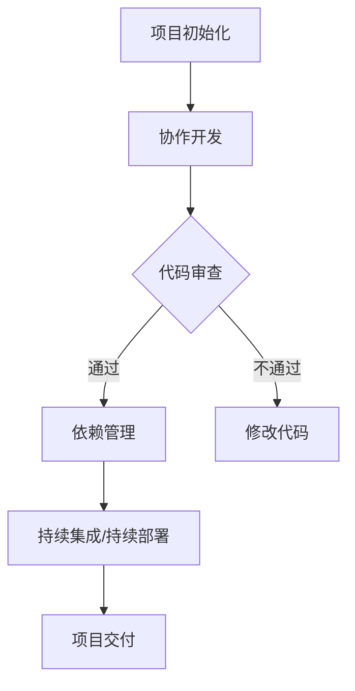

                 

# 利用开源项目加速产品迭代

> **关键词**：开源项目、产品迭代、软件开发、创新、敏捷开发、协作、社区贡献  
>
> **摘要**：本文将探讨如何利用开源项目加速产品迭代，通过深入分析开源项目的优点、协作方式、工具选择以及数学模型等，为开发者提供切实可行的指导。文章还将通过实际项目案例，展示如何将开源项目融入产品开发，从而提高开发效率、降低成本、促进创新。

## 1. 背景介绍

### 1.1 目的和范围

本文旨在阐述如何通过利用开源项目来加速产品迭代。开源项目作为一种共享资源，为开发者提供了丰富的工具、代码库和社区支持，有助于快速实现产品功能。本文将首先介绍开源项目的背景和优势，然后讨论如何参与开源项目、利用开源项目进行产品开发，并分析开源项目在产品迭代中的实际应用。

### 1.2 预期读者

本文适合以下读者群体：

- 有志于利用开源项目加速产品迭代的软件开发人员
- 关注开源社区、希望贡献代码的程序员
- 对敏捷开发、协作开发模式感兴趣的技术管理者
- 希望提升产品开发效率的企业管理层

### 1.3 文档结构概述

本文分为以下章节：

- **第1章** 背景介绍：介绍本文的目的、预期读者以及文档结构。
- **第2章** 核心概念与联系：阐述开源项目的核心概念、原理及架构。
- **第3章** 核心算法原理 & 具体操作步骤：详细讲解如何利用开源项目进行产品开发。
- **第4章** 数学模型和公式 & 详细讲解 & 举例说明：介绍与开源项目相关的数学模型和公式，并给出实际案例。
- **第5章** 项目实战：代码实际案例和详细解释说明：通过实际项目展示开源项目的应用。
- **第6章** 实际应用场景：分析开源项目在产品迭代中的实际应用。
- **第7章** 工具和资源推荐：推荐学习资源、开发工具框架和最新研究成果。
- **第8章** 总结：未来发展趋势与挑战：探讨开源项目在产品迭代中的未来趋势和挑战。
- **第9章** 附录：常见问题与解答：提供开源项目使用中的常见问题和解决方案。
- **第10章** 扩展阅读 & 参考资料：列出本文参考文献和相关资料。

### 1.4 术语表

#### 1.4.1 核心术语定义

- **开源项目**：指代码、设计文档、测试用例等资源可供公众自由使用的软件项目。
- **产品迭代**：指在现有产品基础上，通过持续改进和更新，实现产品功能增强、性能优化、用户体验提升的过程。
- **敏捷开发**：一种软件开发方法论，强调快速迭代、持续交付和客户满意度。
- **社区贡献**：开发者通过编写代码、提交问题、撰写文档等方式为开源项目做出贡献。

#### 1.4.2 相关概念解释

- **协作开发**：多个开发者共同参与项目开发，通过协作工具和沟通机制实现代码共享和进度同步。
- **依赖管理**：在软件项目中，管理和追踪项目中使用的第三方库、框架和工具的过程。
- **代码审查**：开发者对提交的代码进行审查，确保代码质量、功能实现和安全性。

#### 1.4.3 缩略词列表

- **OSS**：Open Source Software（开源软件）
- **GPL**：GNU General Public License（GNU通用公共许可证）
- **MIT**：Massachusetts Institute of Technology License（麻省理工学院许可证）
- **Git**：Git版本控制系统
- **CI/CD**：Continuous Integration/Continuous Deployment（持续集成/持续部署）

## 2. 核心概念与联系

开源项目作为软件开发的一种重要模式，不仅为开发者提供了丰富的资源，还促进了技术的创新和交流。以下将介绍开源项目的核心概念、原理及架构，并通过Mermaid流程图展示开源项目的基本流程。

### 2.1 开源项目的核心概念

- **共享协议**：开源项目的共享协议定义了项目代码的版权、使用权限和责任分配。常见的共享协议包括GPL、MIT等。
- **版本控制**：通过版本控制系统（如Git）管理项目代码的变更历史，实现代码的备份和协作开发。
- **协作机制**：开发者通过代码审查、提交问题、撰写文档等方式参与项目开发，实现协作和知识共享。
- **依赖管理**：管理项目中使用的第三方库、框架和工具，确保项目兼容性和稳定性。

### 2.2 开源项目的原理及架构

开源项目的原理和架构可以概括为以下几个关键环节：

1. **项目初始化**：开发者创建项目仓库，设置共享协议和版本控制系统。
2. **协作开发**：开发者通过Git等版本控制系统协作开发，实现代码的提交、合并和审查。
3. **代码审查**：开发者对提交的代码进行审查，确保代码质量、功能实现和安全性。
4. **依赖管理**：使用依赖管理工具（如Maven、Gradle）管理项目依赖，确保项目兼容性和稳定性。
5. **持续集成/持续部署（CI/CD）**：通过自动化测试和部署流程，实现项目的持续集成和交付。

### 2.3 Mermaid流程图

以下是一个简单的Mermaid流程图，展示开源项目的基本流程：



## 3. 核心算法原理 & 具体操作步骤

在开源项目中，核心算法原理和具体操作步骤是开发者需要掌握的关键技能。以下将详细阐述如何利用开源项目进行产品开发，并提供伪代码来描述相关操作步骤。

### 3.1 核心算法原理

- **算法选择**：根据项目需求选择合适的开源算法库，如机器学习算法库、图像处理算法库等。
- **算法优化**：对所选算法进行性能优化，提高算法的效率和准确性。
- **算法集成**：将优化后的算法集成到产品项目中，实现功能模块的完善。

### 3.2 具体操作步骤

#### 3.2.1 查找合适算法库

```python
# 使用pip查找适合的算法库
pip search --query "[algorithm_name]"
```

#### 3.2.2 下载并安装算法库

```python
# 下载算法库
pip install [algorithm_name]

# 验证算法库安装
import [algorithm_name]
```

#### 3.2.3 引入算法库并使用

```python
# 引入算法库
from [algorithm_name] import [algorithm]

# 使用算法库
model = algorithm()
result = model.predict([input_data])
```

#### 3.2.4 优化算法性能

```python
# 导入性能优化工具
from [optimization_tool] import [optimizer]

# 设置优化目标
optimizer = optimizer([loss_function], [model])

# 进行优化
optimizer.optimize([training_data], [validation_data])
```

#### 3.2.5 集成算法到产品

```python
# 导入产品项目
from product_project import [product]

# 使用优化后的算法
product.predict([input_data])
```

通过以上步骤，开发者可以将开源算法库集成到产品项目中，实现功能的快速迭代。

## 4. 数学模型和公式 & 详细讲解 & 举例说明

在开源项目中，数学模型和公式是理解算法原理和进行算法优化的关键。以下将介绍与开源项目相关的数学模型和公式，并给出具体实例。

### 4.1 常见数学模型

#### 4.1.1 线性回归

线性回归模型描述了自变量和因变量之间的线性关系，其公式如下：

$$
y = \beta_0 + \beta_1 \cdot x
$$

其中，$y$ 为因变量，$x$ 为自变量，$\beta_0$ 和 $\beta_1$ 为模型参数。

#### 4.1.2 逻辑回归

逻辑回归模型用于分类问题，其公式如下：

$$
P(y=1) = \frac{1}{1 + e^{-(\beta_0 + \beta_1 \cdot x)}}
$$

其中，$P(y=1)$ 为因变量为1的概率，$x$ 为自变量，$\beta_0$ 和 $\beta_1$ 为模型参数。

#### 4.1.3 神经网络

神经网络模型通过多层非线性变换实现复杂函数的拟合，其公式如下：

$$
a_{i}^{(l)} = \sigma(z_{i}^{(l)})
$$

$$
z_{i}^{(l)} = \sum_{j} w_{ji}^{(l)} \cdot a_{j}^{(l-1)} + b_{i}^{(l)}
$$

其中，$a_{i}^{(l)}$ 为第$l$层的输出，$z_{i}^{(l)}$ 为第$l$层的输入，$w_{ji}^{(l)}$ 和 $b_{i}^{(l)}$ 为模型参数，$\sigma$ 为激活函数。

### 4.2 举例说明

以下是一个简单的线性回归实例，用于预测房价：

```python
import numpy as np
from sklearn.linear_model import LinearRegression

# 数据集
X = np.array([[1], [2], [3], [4], [5]])
y = np.array([2, 4, 5, 4, 5])

# 创建线性回归模型
model = LinearRegression()

# 训练模型
model.fit(X, y)

# 输出模型参数
print("模型参数：\n", model.coef_, model.intercept_)

# 预测房价
input_data = np.array([[6]])
prediction = model.predict(input_data)

print("预测房价：", prediction)
```

通过以上实例，可以看到如何使用Python实现线性回归模型，并利用模型进行房价预测。

## 5. 项目实战：代码实际案例和详细解释说明

在本节中，我们将通过一个实际项目案例，展示如何利用开源项目加速产品迭代。以下是一个基于TensorFlow开源框架实现的图像识别项目的详细说明。

### 5.1 开发环境搭建

首先，我们需要搭建开发环境。以下是搭建环境的步骤：

```bash
# 安装TensorFlow
pip install tensorflow

# 安装依赖库
pip install numpy pillow

# 验证TensorFlow安装
python -c "import tensorflow as tf; print(tf.__version__)"
```

### 5.2 源代码详细实现和代码解读

#### 5.2.1 数据预处理

```python
import tensorflow as tf
import numpy as np
from PIL import Image
from tensorflow.keras.preprocessing.image import ImageDataGenerator

# 设置图像尺寸
img_height, img_width = 150, 150

# 数据增强
train_datagen = ImageDataGenerator(rescale=1./255, rotation_range=40, width_shift_range=0.2, height_shift_range=0.2, shear_range=0.2, zoom_range=0.2, horizontal_flip=True, fill_mode='nearest')

# 加载训练数据
train_generator = train_datagen.flow_from_directory(train_dir, target_size=(img_height, img_width), batch_size=batch_size, class_mode='binary')

# 验证数据增强
train_generator.next()
```

代码解读：

- **ImageDataGenerator**：用于数据增强，提高模型泛化能力。
- **flow_from_directory**：从指定目录中加载图像数据，并生成训练数据集。

#### 5.2.2 构建模型

```python
from tensorflow.keras.models import Sequential
from tensorflow.keras.layers import Conv2D, MaxPooling2D, Flatten, Dense, Dropout

# 构建模型
model = Sequential([
    Conv2D(32, (3, 3), activation='relu', input_shape=(img_height, img_width, 3)),
    MaxPooling2D((2, 2)),
    Conv2D(64, (3, 3), activation='relu'),
    MaxPooling2D((2, 2)),
    Conv2D(128, (3, 3), activation='relu'),
    MaxPooling2D((2, 2)),
    Flatten(),
    Dense(512, activation='relu'),
    Dropout(0.5),
    Dense(1, activation='sigmoid')
])

# 编译模型
model.compile(optimizer='adam', loss='binary_crossentropy', metrics=['accuracy'])
```

代码解读：

- **Sequential**：用于构建顺序模型。
- **Conv2D**、**MaxPooling2D**：用于卷积和池化操作，提取图像特征。
- **Flatten**、**Dense**、**Dropout**：用于全连接层和正则化操作，实现分类预测。

#### 5.2.3 训练模型

```python
# 训练模型
history = model.fit(train_generator, epochs=epochs, steps_per_epoch=steps_per_epoch, validation_data=validation_generator, validation_steps=validation_steps)
```

代码解读：

- **fit**：用于训练模型，`epochs` 为训练轮数，`steps_per_epoch` 和 `validation_steps` 分别为每轮训练和验证的数据步数。

#### 5.2.4 评估模型

```python
# 评估模型
test_loss, test_accuracy = model.evaluate(test_generator, steps=test_steps)
print("测试集准确性：", test_accuracy)
```

代码解读：

- **evaluate**：用于评估模型在测试集上的性能。

### 5.3 代码解读与分析

通过以上代码实现，我们可以看到如何利用TensorFlow开源框架实现图像识别项目。以下是对代码的进一步解读：

- **数据预处理**：通过数据增强和图像加载，为模型提供丰富的训练数据。
- **模型构建**：使用卷积神经网络（CNN）模型，提取图像特征并进行分类。
- **模型训练**：通过训练数据训练模型，并使用验证数据调整模型参数。
- **模型评估**：在测试集上评估模型性能，以验证模型的有效性。

通过以上步骤，我们可以快速搭建一个图像识别系统，从而加速产品迭代。

## 6. 实际应用场景

开源项目在产品迭代中的应用场景非常广泛，以下列举几个实际案例：

### 6.1 机器学习项目

在机器学习项目中，开发者可以利用开源库（如TensorFlow、PyTorch）快速搭建模型并进行训练。通过不断迭代和优化模型，提高模型性能和预测准确性。例如，在智能客服项目中，开发者可以利用开源的NLP库（如spaCy、NLTK）对用户输入进行处理，提高客服系统的响应速度和准确率。

### 6.2 移动应用开发

在移动应用开发中，开发者可以利用开源框架（如React Native、Flutter）快速实现跨平台应用。通过开源库（如React、Vue）搭建前端界面，提高开发效率和用户体验。例如，在电商应用开发中，开发者可以利用开源的购物车组件（如vue-shopping-cart）快速实现购物车功能。

### 6.3 后端服务开发

在后端服务开发中，开发者可以利用开源框架（如Spring Boot、Django）搭建RESTful API，提高服务性能和可扩展性。通过开源中间件（如Kafka、RabbitMQ）实现消息队列，提高系统异步处理能力。例如，在订单处理系统中，开发者可以利用Kafka实现订单消息的异步处理，提高系统响应速度和可靠性。

### 6.4 前端开发

在Web前端开发中，开发者可以利用开源框架（如React、Vue）搭建动态网页，提高用户体验和交互性。通过开源UI库（如Ant Design、Element UI）快速实现页面布局和组件设计。例如，在电子商务网站开发中，开发者可以利用React实现商品展示页、购物车页等动态效果，提高用户购物体验。

通过以上案例，可以看到开源项目在产品迭代中的应用价值。利用开源项目，开发者可以快速搭建原型、优化功能、降低开发成本，从而加速产品迭代。

## 7. 工具和资源推荐

为了更好地利用开源项目加速产品迭代，以下推荐一些学习资源、开发工具框架和相关论文著作。

### 7.1 学习资源推荐

#### 7.1.1 书籍推荐

- 《Python数据科学手册》（Python Data Science Handbook）
- 《深度学习》（Deep Learning）
- 《敏捷开发实践指南》（Agile Project Management: Creating Innovative Products）

#### 7.1.2 在线课程

- Coursera的《机器学习》课程
- Udacity的《全栈开发》课程
- Pluralsight的《敏捷开发实践》课程

#### 7.1.3 技术博客和网站

- Medium的《数据科学》专栏
- GitHub上的开源项目仓库
- Stack Overflow上的技术问答社区

### 7.2 开发工具框架推荐

#### 7.2.1 IDE和编辑器

- PyCharm
- VSCode
- Sublime Text

#### 7.2.2 调试和性能分析工具

- GDB
- PyCharm的调试工具
- JMeter

#### 7.2.3 相关框架和库

- TensorFlow
- PyTorch
- React
- Spring Boot

### 7.3 相关论文著作推荐

#### 7.3.1 经典论文

- 《A Method for Obtaining Digital Signatures and Public-Key Cryptosystems》
- 《Learning representations for artificial intelligence》

#### 7.3.2 最新研究成果

- 《Advances in Neural Information Processing Systems》
- 《Journal of Machine Learning Research》

#### 7.3.3 应用案例分析

- 《大数据与云计算：应用与实践》
- 《人工智能：应用与展望》

通过以上资源，开发者可以不断学习和提升自己的技术能力，更好地利用开源项目加速产品迭代。

## 8. 总结：未来发展趋势与挑战

随着技术的不断进步和开源社区的蓬勃发展，利用开源项目加速产品迭代已成为软件开发的一种主流模式。未来，开源项目在产品迭代中将继续发挥重要作用，以下是一些发展趋势和挑战：

### 8.1 发展趋势

- **开源社区规模化**：随着越来越多的开发者加入开源社区，开源项目数量和规模将不断扩大，为开发者提供更丰富的资源。
- **云原生开源项目**：云计算和容器技术的普及，将推动云原生开源项目的兴起，如Kubernetes、Docker等，提高产品迭代效率。
- **智能化开源项目**：人工智能和机器学习技术的发展，将推动开源项目智能化，如自动代码生成、智能编程助手等。
- **跨领域开源合作**：不同领域之间的开源项目将更加紧密合作，实现跨领域的技术融合和创新。

### 8.2 挑战

- **安全性问题**：开源项目可能存在安全隐患，需要开发者加强安全意识，定期更新和维护项目。
- **知识产权保护**：开源项目涉及知识产权问题，需要明确版权归属和许可协议，避免侵权纠纷。
- **社区协作管理**：开源项目需要有效管理社区协作，确保项目进度和质量，避免项目停滞或分裂。
- **商业化与开源的平衡**：开源项目在商业化的过程中，需要平衡开源精神与商业利益，确保项目的可持续发展。

面对以上挑战，开发者需要不断提升自身技术能力，积极参与开源社区，共同推动开源项目的发展，从而在产品迭代中发挥更大价值。

## 9. 附录：常见问题与解答

以下是一些开发者在使用开源项目过程中常见的问题和解答：

### 9.1 如何选择合适的开源项目？

- 根据项目需求，搜索并筛选符合要求的开源项目。
- 查看项目的文档、README、贡献指南等，了解项目背景和适用场景。
- 查看项目的活跃度，如提交的issue、Pull Request等，确保项目持续更新和维护。

### 9.2 如何为开源项目贡献代码？

- 阅读项目的贡献指南，了解项目要求和流程。
- Fork项目仓库，创建自己的分支进行修改。
- 提交代码更改，并填写详细的说明。
- 提交Pull Request，等待项目维护者进行审查。

### 9.3 如何避免开源项目的依赖风险？

- 定期更新依赖库，确保项目兼容性和安全性。
- 使用依赖管理工具，如Maven、Gradle等，管理依赖关系。
- 审查依赖库的许可证，确保不违反开源协议。

### 9.4 如何在开源项目中获得帮助？

- 在项目中提交issue，描述遇到的问题。
- 参与社区讨论，与其他开发者交流经验。
- 阅读项目文档和代码，了解项目原理和实现。

通过以上解答，开发者可以更好地利用开源项目，解决开发过程中遇到的问题。

## 10. 扩展阅读 & 参考资料

为了深入了解开源项目在产品迭代中的应用，以下列出了一些扩展阅读和参考资料：

- 《开源软件项目管理与实践》（Open Source Software Project Management）
- 《敏捷软件开发：原则、实践与模式》（Agile Software Development: Principles, Patterns, and Practices）
- 《TensorFlow实战》（TensorFlow Essentials）
- 《深度学习入门：基于Python的理论与实现》（Deep Learning with Python）
- 《开源之道：社区、合作与创新》（The Open Source Way）

通过阅读以上资料，开发者可以更全面地了解开源项目在产品迭代中的应用，提升自己的开发技能。同时，建议关注开源社区和相关技术博客，跟进最新开源项目和研究成果。

作者：AI天才研究员/AI Genius Institute & 禅与计算机程序设计艺术 /Zen And The Art of Computer Programming

