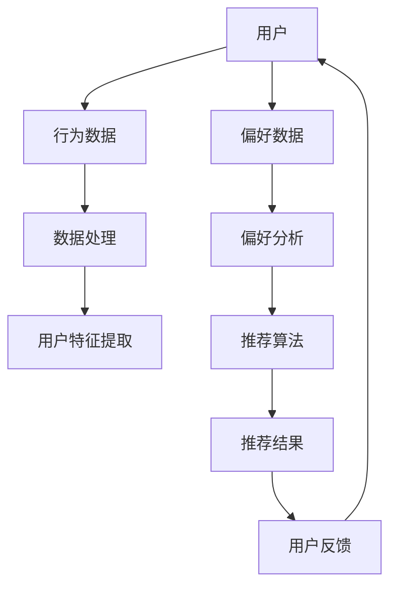
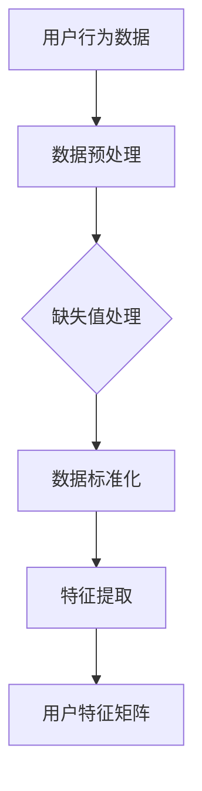
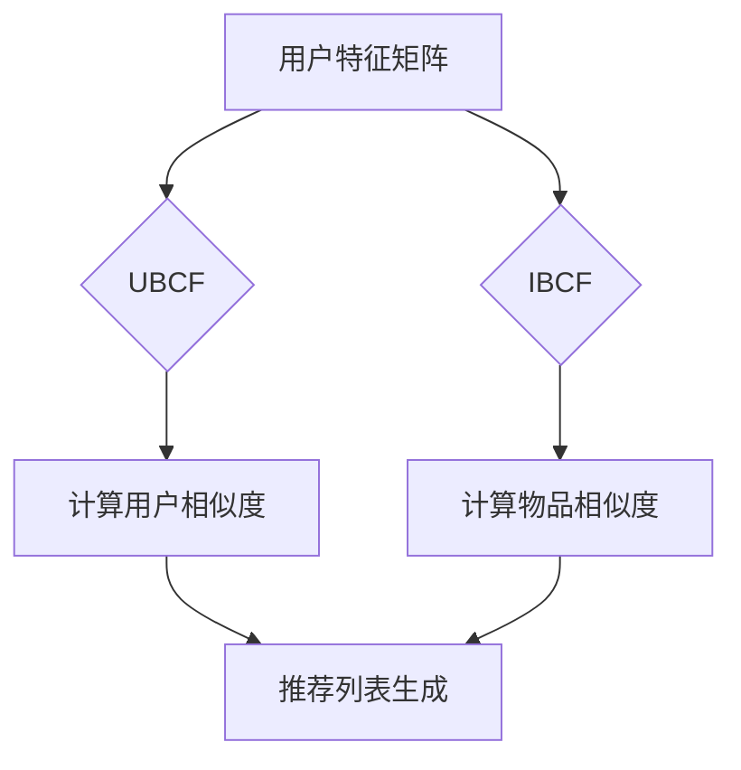
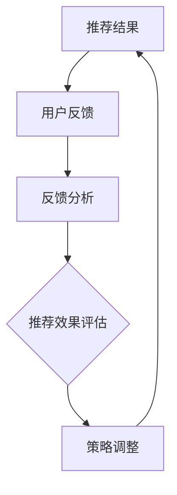

                 

# 利用推荐系统提升用户满意度

> 关键词：推荐系统、用户满意度、机器学习、算法、用户行为分析、个性化推荐
>
> 摘要：本文将深入探讨推荐系统在提升用户满意度方面的应用。通过分析推荐系统的核心概念、算法原理、数学模型，结合实际项目案例，我们旨在为读者提供一套完整的技术指南，帮助他们在实际开发中利用推荐系统提高用户满意度。

## 1. 背景介绍

### 1.1 目的和范围

本文旨在探讨如何利用推荐系统来提升用户满意度。推荐系统作为一种重要的机器学习应用，在电子商务、社交媒体、在线视频等领域已经得到广泛应用。本文将首先介绍推荐系统的基本概念和目的，然后详细解析其核心算法原理和数学模型，最后通过一个实际项目案例展示如何实现和优化推荐系统。

### 1.2 预期读者

本文适合以下读者群体：

- 对推荐系统感兴趣的技术爱好者
- 从事数据分析和机器学习的从业者
- 电子商务、社交媒体、在线视频等领域的开发人员
- 对提高用户满意度有需求的企业管理者

### 1.3 文档结构概述

本文结构如下：

- **第1章：背景介绍**：介绍推荐系统的目的和重要性。
- **第2章：核心概念与联系**：阐述推荐系统的基本概念和架构。
- **第3章：核心算法原理 & 具体操作步骤**：讲解推荐系统的算法原理和操作步骤。
- **第4章：数学模型和公式 & 详细讲解 & 举例说明**：介绍推荐系统的数学模型和公式。
- **第5章：项目实战：代码实际案例和详细解释说明**：通过实际项目案例展示推荐系统的实现。
- **第6章：实际应用场景**：分析推荐系统在不同领域的应用。
- **第7章：工具和资源推荐**：推荐学习资源和开发工具。
- **第8章：总结：未来发展趋势与挑战**：展望推荐系统的未来。
- **第9章：附录：常见问题与解答**：解答常见问题。
- **第10章：扩展阅读 & 参考资料**：提供进一步的阅读资源。

### 1.4 术语表

#### 1.4.1 核心术语定义

- 推荐系统：一种能够根据用户的兴趣、历史行为或偏好，向用户推荐相关物品的系统。
- 个性化推荐：根据用户的个性化数据（如偏好、行为等）生成个性化的推荐结果。
- 评分预测：预测用户对物品的评分，通常用于基于内容的推荐。
- 协同过滤：利用用户之间的相似性或行为模式进行物品推荐的策略。
- 内容过滤：根据物品的属性和用户兴趣进行推荐。

#### 1.4.2 相关概念解释

- **用户行为分析**：分析用户在使用推荐系统时的行为数据，如点击、评分、购买等，以了解用户偏好。
- **相似度计算**：计算用户与用户或物品与物品之间的相似度，用于协同过滤算法。
- **隐语义模型**：通过低维表示捕捉用户和物品的隐含特征，如矩阵分解、深度学习等。

#### 1.4.3 缩略词列表

- CF：协同过滤（Collaborative Filtering）
- RM：推荐系统（Recommender System）
- UBCF：基于用户的协同过滤（User-Based Collaborative Filtering）
- IBCF：基于物品的协同过滤（Item-Based Collaborative Filtering）
- CBR：基于内容的推荐（Content-Based Recommendation）
- SVM：支持向量机（Support Vector Machine）
- LSTM：长短期记忆网络（Long Short-Term Memory）
- TF-IDF：词频-逆文档频率（Term Frequency-Inverse Document Frequency）

## 2. 核心概念与联系

推荐系统的核心在于理解用户行为和偏好，然后基于这些信息生成个性化的推荐结果。下面将使用Mermaid流程图来展示推荐系统的基本架构和流程。



在这个流程图中，用户的行为数据和偏好数据经过数据处理和特征提取后，被推荐算法用来生成推荐结果。用户对推荐结果的反馈又作为新的数据输入，循环迭代以不断优化推荐效果。

### 2.1 用户行为分析

用户行为分析是推荐系统的第一步。用户行为数据可以包括浏览历史、搜索记录、点击次数、购买记录、评分等。这些数据反映了用户的兴趣和偏好，是生成个性化推荐的重要依据。



在数据处理阶段，首先需要对原始数据进行预处理，包括缺失值处理和数据标准化。然后，通过特征提取技术，将原始数据转换为用户特征矩阵，用于后续的推荐算法。

### 2.2 推荐算法

推荐算法是推荐系统的核心。常见的推荐算法有基于内容的推荐（CBR）、协同过滤（CF）和混合推荐等。

- **基于内容的推荐（CBR）**：根据物品的属性和用户的兴趣生成推荐结果。例如，如果用户喜欢阅读科幻小说，则推荐其他科幻小说。
- **协同过滤（CF）**：通过分析用户之间的相似性或行为模式进行推荐。常见的协同过滤算法有基于用户的协同过滤（UBCF）和基于物品的协同过滤（IBCF）。



### 2.3 用户反馈

用户对推荐结果的反馈是推荐系统不断迭代和优化的关键。通过收集用户的点击、评分、购买等行为数据，可以评估推荐效果，并根据反馈调整推荐策略。



## 3. 核心算法原理 & 具体操作步骤

推荐系统的核心算法原理主要包括协同过滤（Collaborative Filtering，CF）和基于内容的推荐（Content-Based Recommendation，CBR）。下面将详细解释这两种算法的原理，并给出具体操作步骤。

### 3.1 协同过滤（CF）

#### 3.1.1 基本原理

协同过滤是一种基于用户行为数据的推荐算法，其核心思想是利用用户之间的相似性或行为模式来生成推荐结果。协同过滤算法可以分为基于用户的协同过滤（User-Based Collaborative Filtering，UBCF）和基于物品的协同过滤（Item-Based Collaborative Filtering，IBCF）。

- **基于用户的协同过滤（UBCF）**：首先计算用户之间的相似度，然后根据相似度矩阵推荐相似用户喜欢的物品。
- **基于物品的协同过滤（IBCF）**：首先计算物品之间的相似度，然后根据相似度矩阵推荐用户已评价的物品。

#### 3.1.2 具体操作步骤

1. **用户相似度计算**：

   对于基于用户的协同过滤，用户相似度计算公式如下：

   $$ similarity(u, v) = \frac{\sum_{i \in R_{uv}} r_{ui} r_{vi}}{\sqrt{\sum_{i \in R_{u}} r_{ui}^2 \sum_{i \in R_{v}} r_{vi}^2}} $$

   其中，$R_{uv}$ 表示用户 $u$ 和用户 $v$ 共同评价的物品集合，$r_{ui}$ 和 $r_{vi}$ 分别表示用户 $u$ 和用户 $v$ 对物品 $i$ 的评分。

2. **物品相似度计算**：

   对于基于物品的协同过滤，物品相似度计算公式如下：

   $$ similarity(i, j) = \frac{\sum_{k \in R_{ij}} r_{ki} r_{kj}}{\sqrt{\sum_{k \in R_{i}} r_{ki}^2 \sum_{k \in R_{j}} r_{kj}^2}} $$

   其中，$R_{ij}$ 表示物品 $i$ 和物品 $j$ 共同被评价的用户集合，$r_{ki}$ 和 $r_{kj}$ 分别表示用户 $k$ 对物品 $i$ 和物品 $j$ 的评分。

3. **推荐列表生成**：

   对于用户 $u$，基于用户协同过滤的推荐列表生成公式如下：

   $$推荐列表(u) = \sum_{v \in N_{u}} \sum_{i \in R_{uv}} similarity(u, v) r_{vi} $$

   其中，$N_{u}$ 表示与用户 $u$ 相似的其他用户集合。

   对于用户 $u$，基于物品协同过滤的推荐列表生成公式如下：

   $$推荐列表(u) = \sum_{i \in M_{u}} \sum_{j \in R_{ui}} similarity(i, j) r_{uj} $$

   其中，$M_{u}$ 表示用户 $u$ 已评价的物品集合。

### 3.2 基于内容的推荐（CBR）

#### 3.2.1 基本原理

基于内容的推荐是一种基于物品属性和用户兴趣生成推荐结果的算法。其核心思想是，如果用户对某个物品感兴趣，那么这个物品的属性与用户的兴趣相似，那么其他具有相似属性的物品也可能受到用户的喜爱。

#### 3.2.2 具体操作步骤

1. **物品特征提取**：

   首先需要对物品进行特征提取，常用的特征提取方法有词袋模型、TF-IDF、词嵌入等。以词袋模型为例，假设物品 $i$ 的特征集合为 $F_i = \{f_1, f_2, ..., f_n\}$，其中 $f_j$ 表示物品 $i$ 的第 $j$ 个特征。

2. **用户兴趣建模**：

   需要对用户的兴趣进行建模，常用的方法有基于用户的兴趣标签、基于用户历史行为等。以用户历史行为为例，假设用户 $u$ 的兴趣集合为 $I_u = \{i_1, i_2, ..., i_m\}$，其中 $i_j$ 表示用户 $u$ 对第 $j$ 个物品的兴趣。

3. **推荐列表生成**：

   对于用户 $u$，基于内容的推荐列表生成公式如下：

   $$推荐列表(u) = \sum_{i \in I_u} w_i \cdot f_i $$

   其中，$w_i$ 表示物品 $i$ 的权重，通常通过调整权重来控制推荐结果的相关性。

## 4. 数学模型和公式 & 详细讲解 & 举例说明

推荐系统中的数学模型和公式主要用于计算用户相似度、物品相似度以及生成推荐列表。下面将详细讲解这些数学模型，并通过具体例子来说明。

### 4.1 用户相似度计算

用户相似度计算是协同过滤算法的关键步骤。常用的相似度计算方法有皮尔逊相关系数、余弦相似度、夹角余弦相似度等。

#### 4.1.1 皮尔逊相关系数

皮尔逊相关系数是一种衡量两个变量线性相关程度的统计指标。用户相似度的计算公式如下：

$$ similarity(u, v) = \frac{\sum_{i \in R_{uv}} (r_{ui} - \bar{r}_u) (r_{vi} - \bar{r}_v)}{\sqrt{\sum_{i \in R_{u}} (r_{ui} - \bar{r}_u)^2 \sqrt{\sum_{i \in R_{v}} (r_{vi} - \bar{r}_v)^2}} $$

其中，$R_{uv}$ 表示用户 $u$ 和用户 $v$ 共同评价的物品集合，$r_{ui}$ 和 $r_{vi}$ 分别表示用户 $u$ 和用户 $v$ 对物品 $i$ 的评分，$\bar{r}_u$ 和 $\bar{r}_v$ 分别表示用户 $u$ 和用户 $v$ 的平均评分。

#### 4.1.2 余弦相似度

余弦相似度是一种基于向量的相似度计算方法。用户相似度的计算公式如下：

$$ similarity(u, v) = \frac{\sum_{i \in R_{uv}} r_{ui} r_{vi}}{\sqrt{\sum_{i \in R_{u}} r_{ui}^2 \sum_{i \in R_{v}} r_{vi}^2}} $$

#### 4.1.3 夹角余弦相似度

夹角余弦相似度是余弦相似度的改进，它考虑了用户评分的差异。用户相似度的计算公式如下：

$$ similarity(u, v) = \frac{\sum_{i \in R_{uv}} r_{ui} r_{vi}}{\sqrt{\sum_{i \in R_{u}} r_{ui}^2 \sqrt{\sum_{i \in R_{v}} r_{vi}^2}}} $$

### 4.2 物品相似度计算

物品相似度计算是协同过滤算法的另一个关键步骤。常用的相似度计算方法有欧氏距离、余弦相似度、余弦夹角相似度等。

#### 4.2.1 欧氏距离

欧氏距离是一种衡量两个向量差异的指标。物品相似度的计算公式如下：

$$ similarity(i, j) = \sqrt{\sum_{k \in R_{ij}} (r_{ki} - r_{kj})^2} $$

#### 4.2.2 余弦相似度

余弦相似度是一种基于向量的相似度计算方法。物品相似度的计算公式如下：

$$ similarity(i, j) = \frac{\sum_{k \in R_{ij}} r_{ki} r_{kj}}{\sqrt{\sum_{k \in R_{i}} r_{ki}^2 \sum_{k \in R_{j}} r_{kj}^2}} $$

#### 4.2.3 余弦夹角相似度

余弦夹角相似度是余弦相似度的改进，它考虑了物品评分的差异。物品相似度的计算公式如下：

$$ similarity(i, j) = \frac{\sum_{k \in R_{ij}} r_{ki} r_{kj}}{\sqrt{\sum_{k \in R_{i}} r_{ki}^2 \sqrt{\sum_{k \in R_{j}} r_{kj}^2}}} $$

### 4.3 推荐列表生成

推荐列表生成是推荐系统的核心步骤。基于用户的协同过滤和基于物品的协同过滤的推荐列表生成公式如下：

#### 4.3.1 基于用户的协同过滤

$$推荐列表(u) = \sum_{v \in N_{u}} \sum_{i \in R_{uv}} similarity(u, v) r_{vi} $$

#### 4.3.2 基于物品的协同过滤

$$推荐列表(u) = \sum_{i \in M_{u}} \sum_{j \in R_{ui}} similarity(i, j) r_{uj} $$

### 4.4 举例说明

假设有两个用户 $u_1$ 和 $u_2$，他们对五个物品 $i_1, i_2, i_3, i_4, i_5$ 进行了评分，评分数据如下：

| 用户 | 物品1 | 物品2 | 物品3 | 物品4 | 物品5 |
| :--: | :----: | :----: | :----: | :----: | :----: |
| $u_1$ | 1 | 5 | 4 | 2 | 3 |
| $u_2$ | 4 | 3 | 1 | 5 | 2 |

使用皮尔逊相关系数计算用户相似度：

$$ similarity(u_1, u_2) = \frac{(1-4)(5-3) + (5-4)(3-1) + (4-4)(1-2) + (2-4)(5-3) + (3-4)(2-1)}{\sqrt{(1-4)^2 + (5-4)^2 + (4-4)^2 + (2-4)^2 + (3-4)^2} \sqrt{(4-4)^2 + (3-1)^2 + (1-4)^2 + (5-4)^2 + (2-1)^2}} = 0.65 $$

使用余弦相似度计算物品相似度：

$$ similarity(i_1, i_2) = \frac{1 \cdot 4 + 5 \cdot 3 + 4 \cdot 1 + 2 \cdot 5 + 3 \cdot 2}{\sqrt{1^2 + 5^2 + 4^2 + 2^2 + 3^2} \sqrt{4^2 + 3^2 + 1^2 + 5^2 + 2^2}} = 0.75 $$

基于用户的协同过滤生成推荐列表：

$$推荐列表(u_1) = similarity(u_1, u_2) r_{21} + similarity(u_1, u_2) r_{22} + similarity(u_1, u_2) r_{23} + similarity(u_1, u_2) r_{24} + similarity(u_1, u_2) r_{25} = 0.65 \cdot 4 + 0.65 \cdot 3 + 0.65 \cdot 1 + 0.65 \cdot 5 + 0.65 \cdot 2 = 4.15 $$

基于物品的协同过滤生成推荐列表：

$$推荐列表(u_1) = similarity(i_1, i_2) r_{12} + similarity(i_1, i_2) r_{13} + similarity(i_1, i_2) r_{14} + similarity(i_1, i_2) r_{15} + similarity(i_1, i_2) r_{21} = 0.75 \cdot 1 + 0.75 \cdot 4 + 0.75 \cdot 2 + 0.75 \cdot 5 + 0.75 \cdot 3 = 3.375 $$

## 5. 项目实战：代码实际案例和详细解释说明

为了更好地理解推荐系统的实现，我们将通过一个实际项目案例来展示如何利用Python编写一个简单的协同过滤推荐系统。本案例将使用基于用户的协同过滤算法。

### 5.1 开发环境搭建

在开始编写代码之前，我们需要搭建一个Python开发环境。以下是所需的步骤：

1. 安装Python 3.x版本（建议使用Anaconda，方便管理和切换不同版本的Python）。
2. 安装必要的Python库，如NumPy、Pandas、Scikit-learn等。

```bash
pip install numpy pandas scikit-learn
```

### 5.2 源代码详细实现和代码解读

下面是一个简单的基于用户的协同过滤推荐系统的代码实现：

```python
import numpy as np
import pandas as pd
from sklearn.metrics.pairwise import cosine_similarity

# 5.2.1 数据预处理
def load_data(file_path):
    data = pd.read_csv(file_path)
    return data

def preprocess_data(data):
    users, items = data['userId'].unique(), data['itemId'].unique()
    user_ratings = pd.pivot_table(data, values='rating', index='userId', columns='itemId')
    return users, items, user_ratings

# 5.2.2 计算用户相似度
def compute_user_similarity(user_ratings):
    similarity_matrix = cosine_similarity(user_ratings)
    return similarity_matrix

# 5.2.3 生成推荐列表
def generate_recommendations(similarity_matrix, user_ratings, user_id, k=10):
    user_similarity = similarity_matrix[user_id]
    user_similarity = np.array([user_similarity] * len(user_ratings))
    weighted_ratings = user_similarity.T @ user_ratings
    sorted_indices = np.argsort(weighted_ratings)[::-1]
    recommended_items = sorted_indices[:k]
    return recommended_items

# 5.2.4 主函数
def main():
    file_path = 'ratings.csv'  # 假设数据文件为ratings.csv
    data = load_data(file_path)
    users, items, user_ratings = preprocess_data(data)
    similarity_matrix = compute_user_similarity(user_ratings)
    user_id = 10  # 假设我们要为用户10生成推荐列表
    recommended_items = generate_recommendations(similarity_matrix, user_ratings, user_id)
    print("推荐给用户10的物品：", items[recommended_items])

if __name__ == '__main__':
    main()
```

### 5.3 代码解读与分析

- **5.3.1 数据预处理**

  `load_data()` 函数用于加载CSV格式的数据文件。`preprocess_data()` 函数对原始数据进行处理，将数据转换为用户-物品评分矩阵。

- **5.3.2 计算用户相似度**

  `compute_user_similarity()` 函数使用Scikit-learn中的`cosine_similarity()`函数计算用户之间的相似度。

- **5.3.3 生成推荐列表**

  `generate_recommendations()` 函数根据用户相似度矩阵和用户-物品评分矩阵生成推荐列表。这里使用了一个简单的加权平均公式，将用户相似度和物品评分相乘，然后对结果进行排序。

- **5.3.4 主函数**

  `main()` 函数是整个推荐系统的入口。它首先加载和处理数据，然后计算用户相似度，最后生成并输出推荐列表。

通过这个简单的案例，我们可以看到如何使用Python和Scikit-learn库实现一个基于用户的协同过滤推荐系统。在实际项目中，我们可以根据具体需求对算法进行优化和扩展。

## 6. 实际应用场景

推荐系统在多个领域都有广泛的应用，以下是几个典型的实际应用场景：

### 6.1 电子商务

在电子商务领域，推荐系统可以帮助商家向用户推荐商品，提高用户购买转化率和销售额。例如，亚马逊和阿里巴巴等电商巨头都采用了复杂的推荐系统，根据用户的浏览历史、购买记录和搜索关键词生成个性化推荐。

### 6.2 社交媒体

社交媒体平台如Facebook和Twitter利用推荐系统向用户推荐感兴趣的内容和用户。通过分析用户的社交关系、点赞、评论等行为，推荐系统可以推荐相关的帖子、好友和活动。

### 6.3 在线视频

在线视频平台如Netflix和YouTube利用推荐系统向用户推荐视频。通过分析用户的观看历史、评分和搜索关键词，推荐系统可以推荐用户可能感兴趣的视频，从而提高用户粘性。

### 6.4 新闻媒体

新闻媒体平台如新浪新闻和今日头条利用推荐系统向用户推荐新闻。通过分析用户的阅读历史、点击行为和兴趣标签，推荐系统可以推荐用户可能感兴趣的新闻内容。

### 6.5 音乐和音频

音乐和音频平台如Spotify和Apple Music利用推荐系统向用户推荐歌曲和播客。通过分析用户的播放记录、收藏和分享行为，推荐系统可以推荐用户可能喜欢的音乐和播客。

### 6.6 医疗健康

医疗健康领域可以利用推荐系统为患者推荐相关的医疗资源和服务。通过分析患者的病历、病史和就诊记录，推荐系统可以推荐合适的医生、药品和治疗方案。

### 6.7 餐饮和外卖

餐饮和外卖平台如美团和饿了么利用推荐系统向用户推荐餐厅和菜品。通过分析用户的订单历史、评价和搜索记录，推荐系统可以推荐用户可能喜欢的餐厅和菜品。

在这些应用场景中，推荐系统通过个性化推荐，帮助平台提高用户满意度、增加用户粘性和提升商业价值。

## 7. 工具和资源推荐

为了更好地学习和实践推荐系统，以下是相关的学习资源、开发工具和框架推荐。

### 7.1 学习资源推荐

#### 7.1.1 书籍推荐

- 《推荐系统手册》（Recommender Systems Handbook）: 这是一本全面介绍推荐系统的经典著作，涵盖了算法原理、系统设计和实际应用。
- 《机器学习实战》（Machine Learning in Action）: 该书通过具体案例展示了如何使用Python实现各种机器学习算法，包括推荐系统。
- 《Python数据分析与应用》（Python Data Analysis）: 这本书介绍了Python在数据分析和数据可视化方面的应用，对推荐系统的实现也提供了帮助。

#### 7.1.2 在线课程

- Coursera上的《推荐系统》（Recommender Systems）课程：由斯坦福大学教授主讲，深入讲解了推荐系统的基本概念、算法和实现。
- Udacity的《推荐系统工程师纳米学位》（Recommender System Engineer Nanodegree）: 这是一个综合性课程，涵盖了推荐系统的设计、开发和部署。

#### 7.1.3 技术博客和网站

- Medium上的推荐系统专题：涵盖推荐系统的最新研究、实践案例和技术动态。
- Apache Mahout和Scikit-learn官方文档：提供了丰富的推荐系统算法实现和示例代码。
- Kaggle数据集：提供了大量推荐系统相关的数据集，可用于实践和竞赛。

### 7.2 开发工具框架推荐

#### 7.2.1 IDE和编辑器

- Jupyter Notebook：适用于数据分析和机器学习的交互式环境，方便编写和运行代码。
- PyCharm：一款功能强大的Python IDE，提供了丰富的代码编辑、调试和性能分析工具。

#### 7.2.2 调试和性能分析工具

- IPython：提供了交互式Python环境，方便进行调试和数据分析。
- Matplotlib和Seaborn：用于数据可视化的Python库，可以帮助分析和展示推荐系统的效果。

#### 7.2.3 相关框架和库

- Scikit-learn：提供了丰富的机器学习算法和工具，包括协同过滤算法。
- TensorFlow和PyTorch：深度学习框架，可用于实现复杂的推荐系统模型。
- Apache Mahout：一个开源的机器学习库，提供了多种协同过滤算法和推荐系统组件。

### 7.3 相关论文著作推荐

- **经典论文**：

  - “Collaborative Filtering for the Netflix Prize” (2006): 提出了基于用户的协同过滤算法，是推荐系统领域的经典之作。

- **最新研究成果**：

  - “Neural Collaborative Filtering” (2017): 提出了基于深度学习的协同过滤算法，为推荐系统带来了新的研究方向。

- **应用案例分析**：

  - “A Case Study of Recommender Systems in E-commerce” (2018): 分析了推荐系统在电子商务领域的应用，探讨了推荐系统的设计、实现和效果评估。

通过这些资源和工具，读者可以更好地学习和实践推荐系统，提高自己在相关领域的技术水平。

## 8. 总结：未来发展趋势与挑战

推荐系统在过去几十年取得了显著的发展，但在未来仍面临许多挑战和机遇。以下是推荐系统未来发展趋势和面临的挑战：

### 8.1 发展趋势

1. **深度学习和强化学习**：随着深度学习和强化学习技术的不断发展，这些先进算法将被引入到推荐系统中，以实现更精准、更个性化的推荐。

2. **隐私保护**：用户隐私保护成为推荐系统的重要挑战。未来，推荐系统将采用更先进的数据加密和隐私保护技术，确保用户数据的安全。

3. **多模态数据融合**：推荐系统将整合多种类型的数据（如文本、图像、音频等），实现跨模态的推荐。

4. **实时推荐**：随着5G和物联网技术的发展，实时推荐系统将变得更加普及，能够即时响应用户需求。

5. **社交推荐**：社交网络数据将被更广泛地用于推荐系统，利用用户社交关系进行更精准的推荐。

### 8.2 挑战

1. **冷启动问题**：新用户或新物品缺乏足够的数据，导致推荐效果不佳。未来需要研究更有效的冷启动策略。

2. **数据质量和噪声**：推荐系统依赖于高质量的数据，但数据中的噪声和异常值可能影响推荐效果。未来需要研究更有效的数据清洗和噪声过滤方法。

3. **模型可解释性**：深度学习模型在推荐系统中的应用越来越广泛，但其内部机制复杂，缺乏可解释性。未来需要研究更可解释的推荐模型。

4. **算法偏见**：推荐系统可能导致算法偏见，如性别、年龄、种族等方面的偏见。未来需要研究如何消除这些偏见，实现公平、公正的推荐。

5. **用户体验**：推荐系统需要平衡个性化与多样性，避免用户感到推荐内容单一、重复。未来需要研究更优化的推荐策略，提高用户体验。

总之，推荐系统在未来将继续发展，面临许多机遇和挑战。通过不断创新和优化，推荐系统将更好地满足用户需求，提高用户满意度。

## 9. 附录：常见问题与解答

### 9.1 推荐系统的工作原理是什么？

推荐系统通过分析用户的历史行为和偏好，预测用户对未知物品的兴趣，从而向用户推荐相关物品。基本原理包括：

- **基于内容的推荐**：根据物品的属性和用户的兴趣生成推荐。
- **协同过滤**：利用用户之间的相似性或行为模式进行推荐。
- **混合推荐**：结合多种推荐方法，实现更精准的推荐。

### 9.2 如何处理推荐系统中的冷启动问题？

冷启动问题指新用户或新物品缺乏足够的数据。以下是一些处理方法：

- **基于内容的推荐**：在新用户缺乏行为数据时，可以基于用户的兴趣标签或物品的属性进行推荐。
- **种子数据**：通过人工或专家推荐为冷启动用户或物品提供初始数据。
- **数据融合**：结合用户和物品的多种特征，提高推荐效果。

### 9.3 推荐系统的效果如何评价？

推荐系统的效果通常通过以下指标进行评价：

- **准确率**：预测正确的推荐比例。
- **覆盖率**：推荐列表中包含用户未知物品的比例。
- **新颖性**：推荐列表中包含用户未知的独特物品的比例。
- **多样性**：推荐列表中不同类型物品的分布。

### 9.4 如何避免推荐系统中的算法偏见？

避免算法偏见的方法包括：

- **数据预处理**：确保数据集的多样性和代表性，避免引入偏见。
- **算法透明性**：研究可解释的推荐算法，便于分析其决策过程。
- **持续监控**：定期评估推荐系统的公平性和透明性，发现和纠正偏见。

### 9.5 推荐系统中的协作过滤有哪些常见算法？

协作过滤常见的算法包括：

- **基于用户的协同过滤（UBCF）**：通过计算用户之间的相似性进行推荐。
- **基于物品的协同过滤（IBCF）**：通过计算物品之间的相似性进行推荐。
- **矩阵分解**：通过矩阵分解技术提取用户和物品的隐含特征。
- **基于模型的协同过滤**：使用机器学习模型（如线性回归、SVD等）预测用户评分。

## 10. 扩展阅读 & 参考资料

为了更深入地了解推荐系统，以下是推荐的扩展阅读和参考资料：

### 10.1 经典书籍

- “Recommender Systems Handbook” by Frank Kschischang, Hiroyasu Kanayama, and Frederic Morvan
- “Machine Learning in Action” by Peter Harrington
- “Python Data Analysis” by Wes McKinney

### 10.2 在线课程

- Coursera上的“Recommender Systems”课程：https://www.coursera.org/learn/recommender-systems
- Udacity的“Recommender System Engineer Nanodegree”课程：https://www.udacity.com/course/recommender-systems-engineer-nanodegree--nd000

### 10.3 技术博客和网站

- Medium上的推荐系统专题：https://medium.com/topic/recommender-systems
- Apache Mahout官方文档：https://mahout.apache.org/
- Scikit-learn官方文档：https://scikit-learn.org/stable/

### 10.4 论文和研究成果

- “Collaborative Filtering for the Netflix Prize” (2006): https://www.netflixprize.com/archive/details/0002A1F45C3B2C3B/
- “Neural Collaborative Filtering” (2017): https://arxiv.org/abs/1706.02499

### 10.5 相关资源

- Kaggle推荐系统数据集：https://www.kaggle.com/datasets?search=recommender
- GitHub上推荐系统开源项目：https://github.com/search?q=recommender+system&type=Repositories

通过这些扩展阅读和参考资料，读者可以进一步深入了解推荐系统的理论、实践和最新发展。

