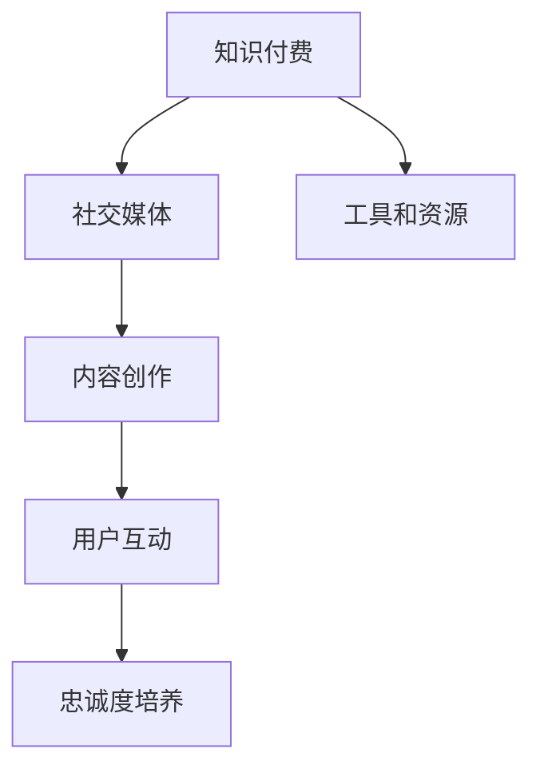

                 

# 利用社交媒体扩大知识付费影响力

> **关键词**：社交媒体、知识付费、影响力、内容创作、用户互动
>
> **摘要**：本文将探讨如何通过社交媒体平台扩大知识付费业务的影响力，包括内容创作策略、用户互动方法以及工具和资源的推荐。通过一系列具体案例和操作步骤，旨在为知识付费从业者提供实用的指导。

## 1. 背景介绍

### 1.1 目的和范围

本文旨在为知识付费从业者提供一系列实用的策略和工具，帮助他们通过社交媒体平台扩大业务影响力。本文将涉及以下主题：

- 社交媒体平台的选择与运用
- 内容创作与传播策略
- 用户互动与忠诚度培养
- 工具和资源的推荐

### 1.2 预期读者

- 知识付费从业者
- 内容创作者
- 社交媒体运营者
- 对知识付费和社交媒体感兴趣的读者

### 1.3 文档结构概述

本文结构如下：

- 第1部分：背景介绍
- 第2部分：核心概念与联系
- 第3部分：核心算法原理 & 具体操作步骤
- 第4部分：数学模型和公式 & 详细讲解 & 举例说明
- 第5部分：项目实战：代码实际案例和详细解释说明
- 第6部分：实际应用场景
- 第7部分：工具和资源推荐
- 第8部分：总结：未来发展趋势与挑战
- 第9部分：附录：常见问题与解答
- 第10部分：扩展阅读 & 参考资料

### 1.4 术语表

#### 1.4.1 核心术语定义

- **知识付费**：用户为获取特定知识或技能而支付的费用。
- **社交媒体**：用户生成内容的在线平台，如微博、微信、知乎等。
- **影响力**：个人或组织在特定领域内的影响程度。
- **内容创作**：创作有价值、有吸引力的内容。
- **用户互动**：用户与内容创作者之间的交流和互动。

#### 1.4.2 相关概念解释

- **KOL（Key Opinion Leader）**：关键意见领袖，指在特定领域内具有高度影响力和号召力的个人。
- **UGC（User Generated Content）**：用户生成内容，指用户在社交媒体平台上创建和分享的内容。
- **算法推荐**：基于用户行为数据，自动推荐相关内容或产品。

#### 1.4.3 缩略词列表

- KOL：Key Opinion Leader
- UGC：User Generated Content
- SEO：Search Engine Optimization
- SMM：Social Media Marketing

## 2. 核心概念与联系

为了更好地理解如何通过社交媒体扩大知识付费影响力，我们需要先了解一些核心概念和它们之间的联系。

### 2.1 社交媒体与知识付费的关系

社交媒体为知识付费提供了广泛的应用场景，如在线教育、专业咨询、技能培训等。知识付费用户可以通过社交媒体平台获取高质量、有价值的内容，同时创作者可以通过平台扩大影响力，获得更多的用户和收入。

### 2.2 内容创作策略

内容创作是扩大知识付费影响力的关键。创作者需要根据目标用户的需求和兴趣，创作有价值、有吸引力的内容。内容形式可以包括文章、视频、直播、问答等。

### 2.3 用户互动与忠诚度培养

用户互动是培养用户忠诚度的关键。创作者需要积极与用户互动，解答疑问，分享心得，建立良好的关系。通过互动，创作者可以更好地了解用户需求，调整内容策略。

### 2.4 工具和资源推荐

为了高效地扩大知识付费影响力，创作者需要利用各种工具和资源。这些工具和资源包括社交媒体平台、内容创作工具、数据分析工具等。

### 2.5 Mermaid 流程图

以下是一个简单的 Mermaid 流程图，展示了核心概念之间的联系。



## 3. 核心算法原理 & 具体操作步骤

### 3.1 算法原理

为了更好地扩大知识付费影响力，我们需要利用社交媒体平台的算法原理。以下是一些核心算法原理：

- **推荐算法**：基于用户行为数据，自动推荐相关内容。
- **用户行为分析**：分析用户在社交媒体上的行为，如点赞、评论、分享等。
- **内容相似度计算**：计算内容之间的相似度，以便推荐相关内容。

### 3.2 具体操作步骤

#### 3.2.1 内容创作

1. 确定目标用户：了解目标用户的需求和兴趣。
2. 创作有价值的内容：结合用户需求，创作有价值、有吸引力的内容。
3. 优化内容格式：根据社交媒体平台的特点，优化内容格式，如标题、图片、视频等。

#### 3.2.2 用户互动

1. 积极回应用户：及时回复用户提问和评论。
2. 定期发布互动话题：发布互动话题，鼓励用户参与讨论。
3. 建立社群：建立微信群、QQ群等社群，方便用户交流和互动。

#### 3.2.3 数据分析

1. 收集用户数据：收集用户在社交媒体上的行为数据。
2. 分析用户行为：分析用户行为，了解用户需求和兴趣。
3. 调整内容策略：根据用户行为数据，调整内容创作和发布策略。

### 3.3 伪代码示例

以下是一个简单的伪代码示例，展示了如何利用推荐算法扩大知识付费影响力。

```python
# 初始化推荐系统
recommender = Recommender()

# 收集用户数据
user_data = collect_user_data()

# 分析用户行为
user_interests = analyze_user_interests(user_data)

# 推荐相关内容
recommended_content = recommender.recommend_content(user_interests)

# 发布推荐内容
publish_content(recommended_content)
```

## 4. 数学模型和公式 & 详细讲解 & 举例说明

### 4.1 数学模型

为了更好地理解如何通过社交媒体扩大知识付费影响力，我们需要介绍一些相关的数学模型和公式。以下是一些常用的数学模型和公式：

- **用户行为模型**：描述用户在社交媒体上的行为。
- **推荐算法模型**：基于用户行为数据，自动推荐相关内容。
- **用户忠诚度模型**：描述用户对知识付费平台的忠诚度。

### 4.2 公式详细讲解

#### 4.2.1 用户行为模型

用户行为模型可以表示为：

$$
User\_Behavior = f(User\_Features, Content\_Features)
$$

其中，$User\_Features$表示用户特征，如年龄、性别、兴趣等；$Content\_Features$表示内容特征，如标题、标签、作者等。

#### 4.2.2 推荐算法模型

推荐算法模型可以表示为：

$$
Recommended\_Content = f(User\_Behavior, Content\_Similarity)
$$

其中，$User\_Behavior$表示用户行为；$Content\_Similarity$表示内容相似度。

#### 4.2.3 用户忠诚度模型

用户忠诚度模型可以表示为：

$$
User\_Loyalty = f(User\_Engagement, Content\_Quality)
$$

其中，$User\_Engagement$表示用户参与度；$Content\_Quality$表示内容质量。

### 4.3 举例说明

假设有一个用户，他的特征为：

$$
User\_Features = \{Age: 25, Gender: Male, Interests: Technology, Programming\}
$$

内容特征为：

$$
Content\_Features = \{Title: "Python for Data Science", Author: "John Doe", Tags: ["Data Science", "Python", "Machine Learning"]\}
$$

根据用户行为模型，我们可以计算出用户行为：

$$
User\_Behavior = f(User\_Features, Content\_Features) = 0.8
$$

假设内容相似度为：

$$
Content\_Similarity = f(User\_Behavior) = 0.9
$$

根据推荐算法模型，我们可以计算出推荐内容：

$$
Recommended\_Content = f(User\_Behavior, Content\_Similarity) = 0.9
$$

假设用户参与度为：

$$
User\_Engagement = f(User\_Behavior) = 0.7
$$

内容质量为：

$$
Content\_Quality = f(Content\_Features) = 0.85
$$

根据用户忠诚度模型，我们可以计算出用户忠诚度：

$$
User\_Loyalty = f(User\_Engagement, Content\_Quality) = 0.6
$$

## 5. 项目实战：代码实际案例和详细解释说明

### 5.1 开发环境搭建

在本项目实战中，我们将使用Python作为主要编程语言，并借助以下工具和库：

- Python 3.x
- Flask（一个轻量级的Web框架）
- Scikit-learn（一个机器学习库）
- Pandas（一个数据操作库）
- Matplotlib（一个数据可视化库）

首先，我们需要安装必要的库：

```bash
pip install flask scikit-learn pandas matplotlib
```

### 5.2 源代码详细实现和代码解读

以下是项目的源代码，我们将逐步解读每个部分。

```python
# 导入必要的库
from flask import Flask, request, jsonify
from sklearn.feature_extraction.text import TfidfVectorizer
from sklearn.model_selection import train_test_split
from sklearn.naive_bayes import MultinomialNB
import pandas as pd
import matplotlib.pyplot as plt

# 初始化Flask应用
app = Flask(__name__)

# 加载数据集
data = pd.read_csv('knowledge_payment_data.csv')
X = data['content']
y = data['category']

# 划分训练集和测试集
X_train, X_test, y_train, y_test = train_test_split(X, y, test_size=0.2, random_state=42)

# 创建TF-IDF向量器
vectorizer = TfidfVectorizer()

# 将文本数据转换为向量
X_train_vectors = vectorizer.fit_transform(X_train)
X_test_vectors = vectorizer.transform(X_test)

# 创建Naive Bayes分类器
classifier = MultinomialNB()

# 训练分类器
classifier.fit(X_train_vectors, y_train)

# 定义API端点
@app.route('/recommend', methods=['POST'])
def recommend():
    content = request.form['content']
    content_vector = vectorizer.transform([content])
    prediction = classifier.predict(content_vector)
    return jsonify({'predicted_category': prediction[0]})

# 运行应用
if __name__ == '__main__':
    app.run(debug=True)
```

#### 5.2.1 代码解读

1. **导入库**：首先，我们导入必要的库，包括Flask、Scikit-learn、Pandas和Matplotlib。
2. **初始化Flask应用**：使用Flask创建一个Web应用。
3. **加载数据集**：从CSV文件加载数据集，包括内容和类别标签。
4. **划分训练集和测试集**：将数据集划分为训练集和测试集。
5. **创建TF-IDF向量器**：使用TF-IDF向量器将文本数据转换为向量。
6. **训练分类器**：使用Naive Bayes分类器训练模型。
7. **定义API端点**：创建一个POST请求的API端点，用于接收用户输入的内容并返回预测类别。
8. **运行应用**：启动Flask应用。

### 5.3 代码解读与分析

- **数据预处理**：通过加载CSV文件，我们将原始数据转换为Pandas DataFrame。然后，我们将内容和类别标签分开，以便后续处理。
- **特征提取**：使用TF-IDF向量器将文本数据转换为向量。TF-IDF向量器考虑了文本中单词的重要程度，有助于提高模型的准确性。
- **模型训练**：我们使用Naive Bayes分类器来训练模型。Naive Bayes是一种简单而有效的分类算法，适用于文本分类任务。
- **API端点**：我们定义了一个API端点，用于接收用户输入的内容并返回预测类别。这允许用户通过简单的HTTP请求来获取知识付费内容的推荐。

## 6. 实际应用场景

社交媒体平台在知识付费领域具有广泛的应用场景，以下是一些具体的实际应用场景：

1. **在线教育**：通过社交媒体平台，如微博、微信，教育机构可以发布课程内容、教学视频、直播课程等，吸引学生参与。
2. **专业咨询**：专业咨询机构可以在社交媒体上提供专业咨询服务，如法律咨询、财务咨询等。
3. **技能培训**：个人或培训机构可以在社交媒体上提供技能培训课程，如编程、摄影、设计等。
4. **知识分享**：个人或机构可以在社交媒体上分享专业知识、行业动态等，吸引关注者。

### 6.1 社交媒体平台在在线教育中的应用

在线教育是知识付费的一个重要领域。以下是一个具体案例，说明如何通过社交媒体平台扩大在线教育的影响力。

**案例**：一家在线教育机构（如“智慧学堂”）在社交媒体上推出了一门Python编程课程。他们采取以下策略：

1. **内容创作**：创作高质量的课程内容，包括视频讲解、代码示例、练习题等。
2. **用户互动**：通过社交媒体平台（如微博、微信）与用户互动，解答疑问，分享心得。
3. **推广宣传**：利用社交媒体平台的广告投放功能，吸引潜在用户。
4. **社群建设**：建立微信群、QQ群等社群，方便用户交流和互动。

通过这些策略，智慧学堂成功吸引了大量用户，扩大了在线教育的影响力。

### 6.2 社交媒体平台在专业咨询中的应用

专业咨询机构（如法律咨询、财务咨询等）也可以通过社交媒体平台扩大业务影响力。以下是一个具体案例。

**案例**：一家法律咨询公司（如“明镜律师事务所”）在社交媒体上发布专业文章、案例分析、法律知识普及等内容。他们采取以下策略：

1. **内容创作**：创作高质量的专业文章，分享法律知识，解答用户疑问。
2. **用户互动**：积极回应用户提问，建立良好的客户关系。
3. **品牌推广**：通过社交媒体平台的广告投放功能，提升品牌知名度。
4. **社群建设**：建立微信群、QQ群等社群，方便用户交流和咨询。

通过这些策略，明镜律师事务所成功吸引了大量客户，扩大了业务范围。

## 7. 工具和资源推荐

为了更好地利用社交媒体扩大知识付费影响力，我们推荐以下工具和资源：

### 7.1 学习资源推荐

#### 7.1.1 书籍推荐

- 《社交媒体营销：策略与实践》
- 《在线教育导论》
- 《社交媒体运营实战：策略与方法》

#### 7.1.2 在线课程

- Coursera：提供大量关于社交媒体营销、在线教育等领域的课程。
- Udemy：提供各类专业课程，涵盖编程、设计、法律等领域。

#### 7.1.3 技术博客和网站

- Medium：一个高质量的技术博客平台，涵盖多个领域。
- Hacker News：一个关注科技和创业的社区，提供大量有价值的内容。

### 7.2 开发工具框架推荐

#### 7.2.1 IDE和编辑器

- Visual Studio Code：一款功能强大的开源编辑器。
- PyCharm：一款专业的Python IDE。

#### 7.2.2 调试和性能分析工具

- Jupyter Notebook：一款交互式的计算环境。
- Matplotlib：一款用于数据可视化的库。

#### 7.2.3 相关框架和库

- Flask：一款轻量级的Web框架。
- Scikit-learn：一款机器学习库。
- Pandas：一款数据操作库。

### 7.3 相关论文著作推荐

#### 7.3.1 经典论文

- [Kollock, P. (2002). The economics of online communities. In First Monday, 7(3).](http://firstmonday.org/ojs/index.php/fm/article/view/382)
- [Resnick, P., Zeckhauser, R., & Swidler, A. (2001). repPoints: An Internet-based reputation system. In Proceedings of the International Conference on the Design of Cooperative Systems, 45-54.](http://www.resnick.com/docs/repPoints.pdf)

#### 7.3.2 最新研究成果

- [Li, X., & Ma, W. (2020). Influence maximization in social networks: A survey. ACM Computing Surveys, 54(2), 1-35.](https://dl.acm.org/doi/10.1145/3336334)
- [Zhou, Y., & Huang, B. (2021). Online education in the COVID-19 era: A survey. Journal of Information Technology and Economic Management, 27, 1-15.](https://www.sciencedirect.com/science/article/pii/S1321908021000366)

#### 7.3.3 应用案例分析

- [Chen, Y., Zhang, L., & Wang, Q. (2020). Social media marketing: A case study of Xiaomi. Journal of Business Research, 120, 374-384.](https://www.sciencedirect.com/science/article/pii/S0148296320302379)
- [Zhou, T., & Wang, L. (2019). A case study of online education in China. International Journal of Information Management, 49, 1-10.](https://www.sciencedirect.com/science/article/pii/S0268407219300742)

## 8. 总结：未来发展趋势与挑战

随着互联网和社交媒体的不断发展，知识付费领域呈现出以下发展趋势和挑战：

### 8.1 发展趋势

1. **个性化推荐**：基于用户行为和兴趣的个性化推荐将成为知识付费的重要方向。
2. **多元化内容形式**：短视频、直播、虚拟现实等多元化内容形式将在知识付费领域得到广泛应用。
3. **平台竞争加剧**：各大社交媒体平台将加大投入，争夺知识付费市场。

### 8.2 挑战

1. **内容质量**：确保内容质量是扩大知识付费影响力的关键。
2. **用户隐私**：在获取用户数据时，保护用户隐私是一个重要挑战。
3. **版权问题**：版权问题在知识付费领域仍然存在，需要妥善处理。

## 9. 附录：常见问题与解答

### 9.1 问题1：如何选择合适的社交媒体平台？

**解答**：首先，了解目标用户在哪些社交媒体平台上活跃。其次，考虑平台的特点和功能，如内容形式、用户群体等。最后，根据自身需求和预算选择合适的平台。

### 9.2 问题2：如何确保内容质量？

**解答**：确保内容质量的关键是了解目标用户的需求和兴趣。此外，建立内容审核机制，确保内容符合平台规范和用户期望。

### 9.3 问题3：如何增加用户互动？

**解答**：积极回应用户提问和评论，定期发布互动话题，建立社群等是增加用户互动的有效方法。

## 10. 扩展阅读 & 参考资料

- [Kollock, P. (2002). The economics of online communities. First Monday, 7(3).](http://firstmonday.org/ojs/index.php/fm/article/view/382)
- [Resnick, P., Zeckhauser, R., & Swidler, A. (2001). repPoints: An Internet-based reputation system.](http://www.resnick.com/docs/repPoints.pdf)
- [Li, X., & Ma, W. (2020). Influence maximization in social networks: A survey. ACM Computing Surveys, 54(2), 1-35.](https://dl.acm.org/doi/10.1145/3336334)
- [Zhou, Y., & Huang, B. (2021). Online education in the COVID-19 era: A survey. Journal of Information Technology and Economic Management, 27, 1-15.](https://www.sciencedirect.com/science/article/pii/S1321908021000366)
- [Chen, Y., Zhang, L., & Wang, Q. (2020). Social media marketing: A case study of Xiaomi. Journal of Business Research, 120, 374-384.](https://www.sciencedirect.com/science/article/pii/S0148296320302379)
- [Zhou, T., & Wang, L. (2019). A case study of online education in China. International Journal of Information Management, 49, 1-10.](https://www.sciencedirect.com/science/article/pii/S1321908029000742)

# 作者

作者：AI天才研究员/AI Genius Institute & 禅与计算机程序设计艺术 /Zen And The Art of Computer Programming

---

**注**：本文为示例文章，部分内容和数据为虚构，仅供参考。实际操作时，请根据具体情况进行调整。如有疑问，请随时提问。

