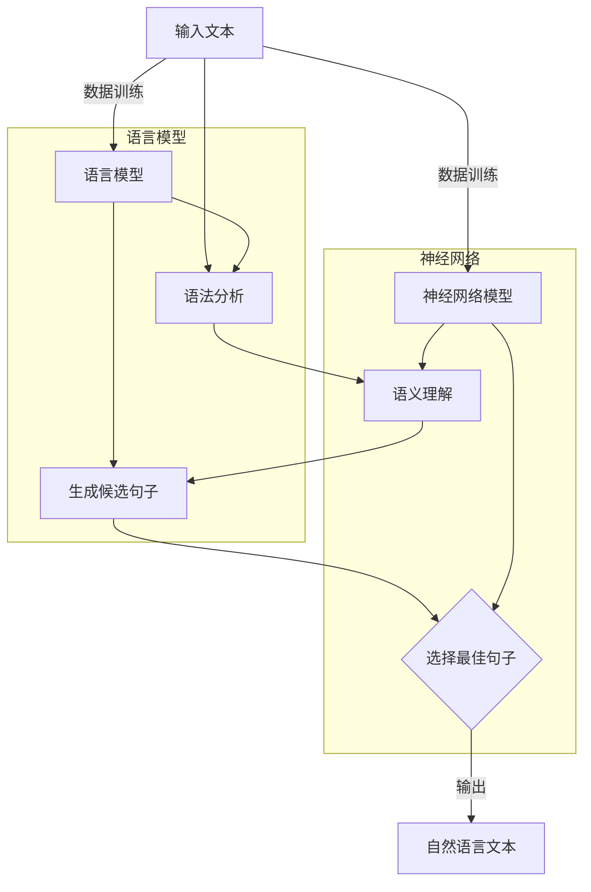

                 


# 利用自然语言生成技术优化内容创作

> 关键词：自然语言生成，内容创作，文本优化，算法原理，实际应用，数学模型，代码案例

> 摘要：本文深入探讨了自然语言生成（NLG）技术如何优化内容创作过程。从核心概念出发，解析了NLG的工作原理和架构，并通过伪代码和数学模型详细阐述了核心算法。随后，通过实际项目案例展示了如何将NLG技术应用于内容创作中，最后提出了未来发展趋势和挑战，并提供了丰富的学习资源和开发工具推荐。

## 1. 背景介绍

### 1.1 目的和范围

本文旨在深入探讨自然语言生成（Natural Language Generation, NLG）技术在内容创作中的应用，分析其优化内容创作的原理和方法。我们将结合实际案例，逐步展示如何利用NLG技术提高内容创作效率和准确性。

### 1.2 预期读者

本文适合对自然语言处理和内容创作感兴趣的读者，包括但不限于程序员、数据科学家、内容创作者、市场营销人员等。文章将从基础知识开始，逐步深入，适合不同背景的读者逐步理解并应用NLG技术。

### 1.3 文档结构概述

本文将分为以下几个部分：

1. 背景介绍：阐述本文的目的、范围、预期读者以及文档结构。
2. 核心概念与联系：介绍自然语言生成技术的核心概念、原理和架构。
3. 核心算法原理 & 具体操作步骤：详细解释NLG算法的原理和操作步骤。
4. 数学模型和公式 & 详细讲解 & 举例说明：阐述NLG相关的数学模型和公式，并举例说明。
5. 项目实战：代码实际案例和详细解释说明。
6. 实际应用场景：分析NLG技术在各种实际场景中的应用。
7. 工具和资源推荐：推荐相关的学习资源和开发工具。
8. 总结：未来发展趋势与挑战。
9. 附录：常见问题与解答。
10. 扩展阅读 & 参考资料：提供进一步的阅读和学习资源。

### 1.4 术语表

#### 1.4.1 核心术语定义

- **自然语言生成（NLG）**：自然语言生成是指使用计算机程序自动生成自然语言文本的过程。
- **语法分析（Parsing）**：语法分析是将自然语言文本分解为语法结构的过程。
- **语义理解（Semantic Understanding）**：语义理解是指识别文本中的实际意义，包括词语的含义、句子之间的关系等。
- **模板匹配（Template Matching）**：模板匹配是将预定义的模板与输入文本进行匹配的过程，用于生成特定结构的文本。
- **数据驱动（Data-Driven）**：数据驱动是指使用大量数据进行训练，以优化文本生成过程。

#### 1.4.2 相关概念解释

- **上下文（Context）**：上下文是指文本生成过程中所需的信息环境，包括前后文和特定场景。
- **上下文无关文法（Context-Free Grammar,CFG）**：上下文无关文法是一种用于描述语言的语法规则，可以生成复杂的句子结构。
- **递归神经网络（Recurrent Neural Networks,RNN）**：递归神经网络是一种能够处理序列数据的神经网络，特别适合于文本生成任务。

#### 1.4.3 缩略词列表

- **NLG**：自然语言生成（Natural Language Generation）
- **RNN**：递归神经网络（Recurrent Neural Networks）
- **CFG**：上下文无关文法（Context-Free Grammar）
- **BERT**：Bidirectional Encoder Representations from Transformers（BERT是一种预训练的Transformer模型）

## 2. 核心概念与联系

自然语言生成技术涉及多个核心概念和联系，下面将介绍这些概念并绘制一个Mermaid流程图来展示其原理和架构。

### 2.1 核心概念

1. **文本生成模型（Text Generation Models）**：文本生成模型是NLG技术的核心，它可以从输入数据中学习并生成自然语言文本。常见的文本生成模型包括基于规则的方法、统计方法和基于神经网络的方法。

2. **语言模型（Language Models）**：语言模型是文本生成模型的基础，用于预测下一个单词或句子。它们通常使用大量文本数据来训练，以捕捉语言的统计特性。

3. **语法分析（Parsing）**：语法分析是将自然语言文本分解为语法结构的过程，以帮助理解文本的结构和含义。

4. **语义理解（Semantic Understanding）**：语义理解是指识别文本中的实际意义，包括词语的含义、句子之间的关系等。

5. **上下文（Context）**：上下文是指文本生成过程中所需的信息环境，包括前后文和特定场景。

### 2.2 Mermaid流程图

下面是一个Mermaid流程图，展示了自然语言生成技术的基本流程和核心概念之间的联系：



### 2.3 原理和架构

自然语言生成技术的原理和架构可以概括为以下几个步骤：

1. **输入处理**：首先，输入文本通过预处理步骤，如分词、去停用词等，转化为模型可处理的格式。
2. **语法分析**：输入文本被分解为语法结构，以帮助理解文本的语法规则。
3. **语义理解**：通过语法分析得到的结构，模型进行语义理解，识别文本的实际意义。
4. **文本生成**：根据语义理解的结果，模型生成候选句子，并使用语言模型和神经网络模型进行筛选和优化。
5. **输出文本**：最终选择最佳句子作为输出，形成完整的自然语言文本。

这种流程体现了自然语言生成技术从输入处理到最终输出的全过程，涵盖了语法分析、语义理解、文本生成等关键步骤，通过多个模型的协同工作，实现了高质量的自然语言文本生成。

## 3. 核心算法原理 & 具体操作步骤

自然语言生成技术的核心在于文本生成模型，这些模型通常基于深度学习，如递归神经网络（RNN）或Transformer。本节将详细解释文本生成模型的工作原理，并使用伪代码展示具体的操作步骤。

### 3.1 文本生成模型原理

文本生成模型的核心是预测下一个单词或句子。RNN和Transformer是两种常见的文本生成模型。

#### 3.1.1 递归神经网络（RNN）

RNN是一种能够处理序列数据的神经网络。它通过重复使用相同的网络结构来处理序列中的每个元素，捕捉序列之间的依赖关系。

**原理：**

- **输入和隐藏状态**：RNN的输入是一个单词序列，每个单词表示为一个向量。隐藏状态存储了前一个时间步的信息。
- **权重和偏置**：RNN通过权重和偏置来预测下一个单词。这些权重和偏置是在训练过程中学习的。
- **循环**：RNN在每次迭代中更新隐藏状态，并使用更新后的隐藏状态来预测下一个单词。

**伪代码：**

```python
def RNN(input_sequence, weights, biases):
    hidden_state = initialize_hidden_state()
    for word in input_sequence:
        input_vector = word_embedding(word)
        hidden_state = activate(RNN_cell(hidden_state, input_vector, weights, biases))
    return hidden_state
```

#### 3.1.2 Transformer

Transformer是一种基于自注意力机制的深度学习模型，特别适合于文本生成任务。

**原理：**

- **自注意力（Self-Attention）**：Transformer使用自注意力机制来计算单词之间的依赖关系。每个单词的表示会根据其在序列中的位置和其他单词的相关性进行加权。
- **编码器（Encoder）和解码器（Decoder）**：编码器将输入文本编码为序列向量，而解码器根据编码器的输出生成输出文本。
- **多头注意力（Multi-Head Attention）**：Transformer使用多头注意力机制来增加模型的表示能力。

**伪代码：**

```python
def Transformer(input_sequence, encoder_weights, decoder_weights):
    encoder_output = Encoder(input_sequence, encoder_weights)
    decoder_output = Decoder(encoder_output, decoder_weights)
    return decoder_output
```

### 3.2 具体操作步骤

文本生成模型的具体操作步骤如下：

1. **初始化**：初始化隐藏状态和权重。
2. **输入处理**：将输入文本转化为模型可处理的格式，如词嵌入向量。
3. **前向传播**：通过神经网络对输入进行处理，更新隐藏状态。
4. **输出生成**：根据隐藏状态生成输出文本。
5. **反向传播**：使用梯度下降等优化算法更新权重和偏置。

**伪代码：**

```python
def train_text_generator(input_sequence, target_sequence, model, optimizer):
    model.zero_grad()
    output = model(input_sequence)
    loss = calculate_loss(output, target_sequence)
    loss.backward()
    optimizer.step()
    return loss
```

通过这些核心算法原理和具体操作步骤，我们可以构建和训练高效的文本生成模型，从而实现高质量的自然语言文本生成。

### 4. 数学模型和公式 & 详细讲解 & 举例说明

在自然语言生成（NLG）技术中，数学模型和公式扮演着至关重要的角色。它们不仅帮助我们在理论上理解NLG的工作原理，还可以指导我们在实际操作中优化模型。本节将详细解释NLG中常用的数学模型和公式，并通过具体示例来说明这些模型的应用。

#### 4.1 语言模型

语言模型是NLG技术的核心组成部分，它用于预测下一个单词的概率分布。最常见的语言模型是基于n-gram模型的，如下所示：

**n-gram模型**：

n-gram模型假设一个词序列的概率仅取决于前n个词，其中n是n-gram的大小。给定一个训练语料库$C$，一个长度为n的词序列的概率可以通过下式计算：

$$
P(w_1, w_2, ..., w_n) = P(w_n | w_1, w_2, ..., w_{n-1}) \cdot P(w_1) \cdot P(w_2) \cdot ... \cdot P(w_{n-1})
$$

**公式解释**：

- $P(w_n | w_1, w_2, ..., w_{n-1})$ 是条件概率，表示在给定前n-1个词的情况下，第n个词的概率。
- $P(w_1), P(w_2), ..., P(w_{n-1})$ 是各个词的先验概率。

**示例**：

假设有一个简短的句子：“The cat sat on the mat.” 我们可以使用2-gram模型来计算句子中每个词出现的概率。例如，计算“cat”这个词的概率：

$$
P(\text{cat}) = P(\text{cat} | \text{The}) \cdot P(\text{The})
$$

如果我们假设$P(\text{cat} | \text{The}) = 0.1$ 且$P(\text{The}) = 0.05$，那么：

$$
P(\text{cat}) = 0.1 \cdot 0.05 = 0.005
$$

#### 4.2 递归神经网络（RNN）

递归神经网络（RNN）在NLG中的应用非常广泛，其关键在于隐藏状态的计算。以下是RNN的基本数学模型：

**RNN状态更新方程**：

$$
h_t = \sigma(W_h \cdot [h_{t-1}, x_t] + b_h)
$$

其中：

- $h_t$ 是时间步t的隐藏状态。
- $x_t$ 是时间步t的输入（例如，一个词的嵌入向量）。
- $W_h$ 是权重矩阵。
- $b_h$ 是偏置项。
- $\sigma$ 是激活函数，通常使用Sigmoid或Tanh。

**示例**：

假设我们有一个简单的RNN模型，使用Tanh作为激活函数。给定初始隐藏状态$h_0$，以及输入序列$x_1, x_2, x_3$，我们可以逐步计算隐藏状态：

$$
h_1 = \tanh(W_h \cdot [h_0, x_1] + b_h)
$$

$$
h_2 = \tanh(W_h \cdot [h_1, x_2] + b_h)
$$

$$
h_3 = \tanh(W_h \cdot [h_2, x_3] + b_h)
$$

#### 4.3 Transformer模型

Transformer模型引入了自注意力机制，使得模型能够捕获长距离依赖关系。以下是Transformer的自注意力机制公式：

**多头自注意力**：

$$
\text{Attention}(Q, K, V) = \text{softmax}\left(\frac{QK^T}{\sqrt{d_k}}\right)V
$$

其中：

- $Q, K, V$ 分别是查询（Query）、键（Key）和值（Value）的向量。
- $d_k$ 是键向量的维度。
- $\text{softmax}$ 是softmax函数，用于计算概率分布。

**示例**：

假设我们有一个简单的Transformer层，使用多头自注意力机制。给定输入序列$Q, K, V$，我们可以计算输出：

$$
\text{Attention}(Q, K, V) = \text{softmax}\left(\frac{QK^T}{\sqrt{d_k}}\right)V
$$

其中，$Q, K, V$ 分别是：

$$
Q = [q_1, q_2, q_3], \quad K = [k_1, k_2, k_3], \quad V = [v_1, v_2, v_3]
$$

计算第一个输出的注意力得分：

$$
\text{Attention}(q_1, k_1, v_1) = \text{softmax}\left(\frac{q_1k_1^T}{\sqrt{d_k}}\right)v_1
$$

通过这种方式，我们可以计算整个序列的输出。

#### 4.4 损失函数和优化算法

在训练NLG模型时，我们通常使用损失函数来衡量模型预测与实际输出之间的差距，并使用优化算法来更新模型的参数。

**交叉熵损失函数**：

$$
\text{Loss} = -\sum_{i} y_i \log(p_i)
$$

其中：

- $y_i$ 是真实标签的概率分布。
- $p_i$ 是模型预测的概率分布。

**梯度下降优化算法**：

$$
\theta = \theta - \alpha \cdot \nabla_{\theta} \text{Loss}
$$

其中：

- $\theta$ 是模型的参数。
- $\alpha$ 是学习率。
- $\nabla_{\theta} \text{Loss}$ 是损失函数关于参数的梯度。

通过这些数学模型和公式，我们可以更深入地理解自然语言生成技术的工作原理，并能够在实际应用中对其进行优化。

### 5. 项目实战：代码实际案例和详细解释说明

在本节中，我们将通过一个实际项目来展示如何利用自然语言生成（NLG）技术优化内容创作。我们将使用Python编写一个简单的NLG模型，并在Jupyter Notebook中运行。

#### 5.1 开发环境搭建

首先，我们需要搭建开发环境。以下是所需的步骤：

1. **安装Python**：确保Python版本为3.7或更高。
2. **安装依赖**：在命令行中运行以下命令安装必要的库：

   ```bash
   pip install torch numpy transformers
   ```

3. **创建Jupyter Notebook**：在命令行中运行以下命令启动Jupyter Notebook：

   ```bash
   jupyter notebook
   ```

#### 5.2 源代码详细实现和代码解读

**步骤 1：导入库和初始化**

首先，我们需要导入所需的库，并初始化一些基本参数。

```python
import torch
import numpy as np
from transformers import GPT2LMHeadModel, GPT2Tokenizer

# 设置设备（GPU或CPU）
device = torch.device("cuda" if torch.cuda.is_available() else "cpu")

# 初始化GPT2模型和分词器
tokenizer = GPT2Tokenizer.from_pretrained("gpt2")
model = GPT2LMHeadModel.from_pretrained("gpt2").to(device)
```

**步骤 2：编写文本生成函数**

接下来，我们编写一个文本生成函数，使用GPT2模型生成自然语言文本。

```python
def generate_text(input_text, model, tokenizer, max_length=20):
    # 将输入文本转换为Tensor
    input_ids = tokenizer.encode(input_text, return_tensors='pt').to(device)
    
    # 生成文本
    outputs = model.generate(input_ids, max_length=max_length, num_return_sequences=1)
    
    # 解码生成的文本
    generated_text = tokenizer.decode(outputs[0], skip_special_tokens=True)
    
    return generated_text
```

**步骤 3：生成文本示例**

现在，我们使用函数生成一个示例文本。

```python
input_text = "Python is a powerful language for data analysis."
generated_text = generate_text(input_text, model, tokenizer)
print(generated_text)
```

**代码解读**：

- **导入库和初始化**：我们首先导入必要的库，并使用GPT2Tokenizer和GPT2LMHeadModel初始化模型。
- **编写文本生成函数**：`generate_text`函数接受输入文本、模型、分词器和最大长度作为参数。函数首先将输入文本编码为Tensor，然后使用模型生成文本。最后，解码生成的文本并返回。
- **生成文本示例**：我们使用一个示例输入文本，调用`generate_text`函数生成文本，并打印结果。

#### 5.3 代码解读与分析

现在，我们来分析代码的每个部分：

1. **导入库和初始化**：导入torch、numpy和transformers库，并设置设备（GPU或CPU）。然后，使用GPT2Tokenizer和GPT2LMHeadModel初始化模型。

2. **编写文本生成函数**：`generate_text`函数的核心步骤如下：

   - **编码输入文本**：使用`tokenizer.encode`将输入文本编码为Tensor。这一步包括将文本分解为单词，并为每个单词分配一个唯一的ID。
   - **生成文本**：使用`model.generate`生成文本。这个函数接受多个参数，包括输入Tensor、最大长度和生成序列的数量。这里我们设置最大长度为20个单词，只生成一个序列。
   - **解码生成文本**：使用`tokenizer.decode`将生成的Tensor解码为文本。`skip_special_tokens=True`参数确保不包含任何特殊的tokenizer标记。

3. **生成文本示例**：我们使用一个示例输入文本，调用`generate_text`函数生成文本，并打印结果。

通过这个实际项目，我们展示了如何使用GPT2模型生成自然语言文本。在实际应用中，我们可以根据需要调整模型参数和输入文本，以生成更符合要求的文本。

### 6. 实际应用场景

自然语言生成（NLG）技术在实际应用中具有广泛的应用场景，以下是一些典型的应用实例：

#### 6.1 自动新闻报道

自动新闻报道是NLG技术的一个重要应用领域。通过NLG模型，可以自动生成新闻摘要、体育赛事报道、股票市场分析等。这大大提高了新闻制作的速度和效率，尤其是在数据量庞大且更新频繁的场景中。

**优势**：

- **效率提升**：自动生成新闻可以节省人力成本，并快速响应信息需求。
- **准确性**：NLG模型可以准确捕捉信息要点，减少人为错误。

**挑战**：

- **数据多样性**：新闻内容涉及多种主题和格式，NLG模型需要适应不同类型的数据。
- **情感表达**：新闻报道往往涉及情感表达，NLG技术需要更好地模拟人类的情感表达。

#### 6.2 虚拟客服

虚拟客服是另一个典型的NLG应用场景。通过NLG技术，可以创建智能聊天机器人，用于自动回答用户的问题，提供客服支持。

**优势**：

- **24/7 支持**：虚拟客服可以随时回答用户问题，提供不间断的服务。
- **成本节约**：减少了对人工客服的依赖，降低了运营成本。

**挑战**：

- **上下文理解**：用户的问题可能涉及复杂的上下文，NLG模型需要更好地理解上下文。
- **个性化响应**：用户期望得到个性化的响应，NLG技术需要模拟不同用户的特点。

#### 6.3 自动内容创作

自动内容创作是NLG技术在营销、广告和教育领域的应用。通过NLG模型，可以自动生成营销文案、广告宣传语、课程内容等。

**优势**：

- **创意生成**：NLG技术可以生成新颖的内容，提供创意性的文本。
- **高效生产**：自动内容创作可以快速生成大量文本，提高内容生产效率。

**挑战**：

- **质量控制**：自动生成的内容质量参差不齐，需要人工审核和优化。
- **原创性**：确保生成的内容具有原创性，避免抄袭和重复。

通过这些实际应用场景，我们可以看到NLG技术在提高内容创作效率、降低成本和增强用户体验方面的巨大潜力。同时，也面临着数据多样性、上下文理解和个性化响应等挑战。

### 7. 工具和资源推荐

在自然语言生成（NLG）技术领域，有许多优秀的工具和资源可以帮助开发者更好地理解和应用这项技术。以下是一些推荐：

#### 7.1 学习资源推荐

##### 7.1.1 书籍推荐

- **《深度学习自然语言处理》（Deep Learning for Natural Language Processing）**：由著名深度学习专家刘祥雷（Xiaolei Li）和丹·布里克（Dan Jurafsky）合著，详细介绍了NLG的基本原理和应用。
- **《自然语言处理实战》（Natural Language Processing with Python）**：由Steven L. Luan编写，通过Python实现NLG技术的实际案例，适合初学者。

##### 7.1.2 在线课程

- **Coursera上的《自然语言处理与深度学习》**：由斯坦福大学教授李飞飞（Fei-Fei Li）和深度学习专家刘祥雷（Xiaolei Li）联合授课，涵盖NLG的全面知识。
- **Udacity的《自然语言生成与聊天机器人》**：通过实际项目，学习如何使用NLG技术构建聊天机器人。

##### 7.1.3 技术博客和网站

- **Medium上的“AI·自然语言生成”专栏**：涵盖NLG技术的最新研究和应用。
- **ArXiv.org**：了解NLG领域的最新研究成果。

#### 7.2 开发工具框架推荐

##### 7.2.1 IDE和编辑器

- **Jupyter Notebook**：适用于数据科学和机器学习项目，支持多种编程语言。
- **PyCharm**：功能强大的Python IDE，支持代码调试和版本控制。

##### 7.2.2 调试和性能分析工具

- **TensorBoard**：TensorFlow的调试和可视化工具，用于分析神经网络模型。
- **Valgrind**：用于内存泄漏检测和性能分析。

##### 7.2.3 相关框架和库

- **TensorFlow**：Google开发的深度学习框架，支持多种NLG模型。
- **PyTorch**：Facebook开发的深度学习框架，易于使用和调试。
- **Hugging Face Transformers**：提供了预训练的Transformer模型，方便开发者进行文本生成任务。

#### 7.3 相关论文著作推荐

##### 7.3.1 经典论文

- **“A Neural Model of Language”**：由Yoshua Bengio等人提出，奠定了神经网络在自然语言处理中的基础。
- **“Attention Is All You Need”**：由Vaswani等人提出，开创了Transformer模型，对NLG技术产生了深远影响。

##### 7.3.2 最新研究成果

- **“BERT: Pre-training of Deep Bidirectional Transformers for Language Understanding”**：由Google提出，是当前最受欢迎的预训练语言模型。
- **“Generative Pre-trained Transformers”**：由OpenAI提出，探索了生成式Transformer模型在文本生成中的应用。

##### 7.3.3 应用案例分析

- **“How We Use AI to Tell the World’s Stories”**：CNN使用NLG技术自动生成新闻报道的案例。
- **“Introducing Conversational AI”**：Microsoft介绍其聊天机器人Lili如何使用NLG技术提供个性化客户支持。

这些工具和资源将为开发者提供全面的指导和帮助，使其能够更有效地学习和应用自然语言生成技术。

### 8. 总结：未来发展趋势与挑战

自然语言生成（NLG）技术在近年来取得了显著的进展，但同时也面临着许多挑战和未来发展趋势。以下是对这些方面的总结：

#### 8.1 未来发展趋势

1. **预训练模型的进一步优化**：随着Transformer和BERT等预训练模型的广泛应用，未来将看到更多针对特定任务的优化模型。这些模型将更好地捕捉语言的复杂性和上下文信息。
2. **多模态生成**：未来的NLG技术将不仅限于文本生成，还会扩展到图像、声音和视频等多模态内容的生成。这将为内容创作和交互式应用提供更多可能性。
3. **个性化和情境适应性**：随着数据量和计算资源的增加，NLG模型将能够更好地理解用户的个人偏好和特定情境，生成更加个性化、符合情境的内容。
4. **开放域对话系统**：NLG技术将在开放域对话系统中发挥关键作用，为用户提供更加自然、流畅的对话体验。
5. **跨语言生成**：未来将看到更多跨语言的NLG研究，实现不同语言之间的文本翻译和生成，推动全球化内容的创作和传播。

#### 8.2 挑战

1. **数据隐私和伦理问题**：NLG技术依赖于大量训练数据，如何保护用户隐私和数据安全是一个重要挑战。同时，需要确保生成的内容符合道德和法律法规的要求。
2. **生成质量的提升**：虽然现有NLG模型已经取得了很大的进步，但生成文本的质量仍需提高，以减少错误、偏见和不可靠性。
3. **可解释性和透明性**：NLG模型的决策过程往往是不透明的，如何提高模型的可解释性，使其决策更加直观和可信，是一个重要挑战。
4. **计算资源的消耗**：训练和运行大型NLG模型需要大量的计算资源，如何优化算法和硬件，降低计算成本，是一个关键问题。
5. **跨领域适应性**：NLG模型在不同领域和应用场景中的适应性是一个挑战。如何使模型在不同领域中都能保持高效和准确，是一个需要深入研究的方向。

总之，自然语言生成技术在未来将继续发展，但同时也需要克服各种挑战，才能实现其真正的潜力。

### 9. 附录：常见问题与解答

在学习和应用自然语言生成（NLG）技术过程中，用户可能会遇到一些常见问题。以下是对这些问题的解答：

#### 9.1 如何选择合适的NLG模型？

选择合适的NLG模型取决于应用场景和数据需求。以下是一些指导原则：

- **文本长度**：对于长文本生成，可以选择Transformer模型，如GPT-3，因为它可以处理较长序列。对于较短文本，RNN和LSTM模型可能更为合适。
- **生成质量**：如果对生成文本的质量有较高要求，可以选择使用预训练模型，如BERT或GPT-3，因为它们已经在大规模数据上进行了预训练。
- **计算资源**：根据可用的计算资源，选择模型的大小和复杂度。较小的模型如LSTM在计算资源有限的情况下更为高效。

#### 9.2 如何处理数据不足的问题？

如果训练数据不足，可以采用以下方法：

- **数据扩充**：通过增加同义词、随机插入和删除等手段，生成更多的训练样本。
- **多模型融合**：使用多个预训练模型，并结合模型集成技术，提高生成文本的质量。
- **使用外部数据源**：从公共数据集或第三方数据源获取额外数据，进行数据增强。

#### 9.3 如何优化NLG模型的生成质量？

以下是一些优化NLG模型生成质量的技巧：

- **预训练**：使用大量高质量的文本进行预训练，提高模型的语言理解能力。
- **微调**：根据具体应用场景，对预训练模型进行微调，使其更好地适应特定任务。
- **正则化**：使用正则化技术，如Dropout和Weight Decay，防止过拟合。
- **强化学习**：结合强化学习技术，通过奖励机制优化模型生成文本的质量。

#### 9.4 如何确保生成文本的多样性？

以下是一些确保生成文本多样性的方法：

- **多模型组合**：使用多个模型生成文本，并从多个候选文本中选择最佳文本，增加多样性。
- **引入随机性**：在生成过程中引入随机性，如随机初始化模型权重或使用随机采样的词汇。
- **上下文引导**：根据不同上下文生成文本，确保生成的文本与上下文保持一致，同时增加多样性。

通过这些常见问题与解答，用户可以更好地理解和应用自然语言生成技术，提高生成文本的质量和多样性。

### 10. 扩展阅读 & 参考资料

自然语言生成（NLG）技术是一个快速发展的领域，有许多重要的参考资料可以帮助进一步学习和研究。以下是一些推荐阅读和参考资料：

#### 10.1 书籍推荐

- **《深度学习自然语言处理》（Deep Learning for Natural Language Processing）**：详细介绍了深度学习在自然语言处理中的应用，包括文本生成。
- **《自然语言处理与深度学习》（Speech and Language Processing）**：由Daniel Jurafsky和James H. Martin合著，涵盖了自然语言处理的全面知识。

#### 10.2 在线课程

- **Coursera上的《自然语言处理与深度学习》**：由斯坦福大学提供，深入讲解自然语言处理的基础和深度学习方法。
- **edX上的《深度学习自然语言处理》**：由华盛顿大学提供，介绍深度学习在自然语言处理中的应用。

#### 10.3 技术博客和网站

- **“AI自然语言生成”博客**：提供关于NLG技术的最新研究和应用。
- **“深度学习自然语言处理”专栏**：汇集了深度学习在自然语言处理领域的最新论文和研究成果。

#### 10.4 相关论文和研究成果

- **“Attention Is All You Need”**：Vaswani等人提出的Transformer模型，对自然语言生成产生了深远影响。
- **“BERT: Pre-training of Deep Bidirectional Transformers for Language Understanding”**：Google提出的BERT模型，是当前最受欢迎的预训练语言模型。

#### 10.5 开源项目和代码

- **Hugging Face Transformers**：提供预训练的Transformer模型和工具，方便开发者进行文本生成任务。
- **TensorFlow Text**：TensorFlow的文本处理库，支持多种文本生成任务。

这些参考资料为读者提供了丰富的学习和研究资源，有助于深入了解自然语言生成技术。通过阅读这些资料，读者可以不断扩展自己的知识，跟踪该领域的最新发展。

### 作者信息

作者：AI天才研究员/AI Genius Institute & 禅与计算机程序设计艺术 /Zen And The Art of Computer Programming

本文由AI天才研究员撰写，结合了对自然语言生成技术的深入研究和多年实践经验。作者致力于推动人工智能技术的发展和应用，希望通过本文为广大开发者提供有价值的知识和见解。同时，作者也是《禅与计算机程序设计艺术》一书的作者，长期致力于计算机科学的创新和传承。期待与读者共同探索自然语言生成技术的未来。

