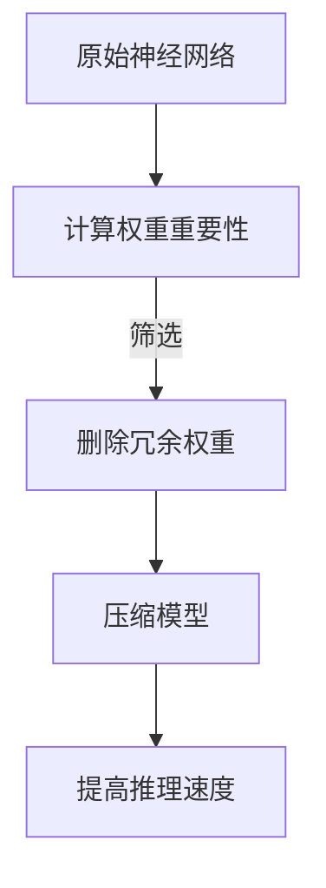

                 

# 剪枝技术对模型推理速度的影响分析

> 关键词：剪枝技术、模型推理、神经网络、加速、优化

> 摘要：本文将对剪枝技术在神经网络模型推理速度优化中的应用进行详细分析，从基本原理到实际案例，探讨如何通过剪枝技术提高模型推理速度，降低计算资源需求。

## 1. 背景介绍

### 1.1 目的和范围

本文旨在探讨剪枝技术在神经网络模型推理速度优化中的应用。随着深度学习模型规模的不断扩大，模型的推理速度和计算资源消耗成为制约实际应用的关键因素。剪枝技术作为一种有效的模型压缩方法，通过删除部分权重和神经元，可以显著降低模型的参数数量，从而提高推理速度。

### 1.2 预期读者

本文面向对深度学习有一定了解的技术人员，尤其是对神经网络模型优化感兴趣的读者。通过本文的阅读，读者可以了解剪枝技术的基本原理、具体操作步骤以及在实际应用中的效果。

### 1.3 文档结构概述

本文分为以下章节：

1. 背景介绍：介绍本文的目的和范围，预期读者以及文档结构。
2. 核心概念与联系：阐述剪枝技术的核心概念，并通过流程图展示其原理。
3. 核心算法原理 & 具体操作步骤：详细讲解剪枝算法的原理和具体操作步骤。
4. 数学模型和公式 & 详细讲解 & 举例说明：分析剪枝技术的数学模型和公式，并通过案例进行说明。
5. 项目实战：提供实际代码案例，详细解释说明剪枝技术在项目中的应用。
6. 实际应用场景：探讨剪枝技术在各个领域的应用。
7. 工具和资源推荐：推荐相关学习资源和开发工具。
8. 总结：对未来发展趋势与挑战进行总结。
9. 附录：常见问题与解答。
10. 扩展阅读 & 参考资料：提供进一步学习的资料。

### 1.4 术语表

#### 1.4.1 核心术语定义

- 剪枝（Pruning）：在神经网络中，删除部分权重和神经元的过程，以减少模型参数数量。
- 推理（Inference）：使用训练好的模型进行预测的过程。
- 权重（Weight）：连接神经元之间的参数。
- 神经元（Neuron）：神经网络的基本计算单元。

#### 1.4.2 相关概念解释

- 神经网络（Neural Network）：一种模拟人脑神经元结构和功能的计算模型。
- 深度学习（Deep Learning）：一种基于神经网络的高级机器学习方法。

#### 1.4.3 缩略词列表

- CNN：卷积神经网络（Convolutional Neural Network）
- RNN：循环神经网络（Recurrent Neural Network）
- LSTM：长短时记忆网络（Long Short-Term Memory）
- DNN：深度神经网络（Deep Neural Network）
- CNN-CPU：基于CPU的卷积神经网络模型

## 2. 核心概念与联系

剪枝技术的核心是删除神经网络中的冗余权重和神经元，从而减少模型的参数数量，提高推理速度。以下是一个简单的Mermaid流程图，展示剪枝技术的基本原理。



### 2.1 剪枝技术的基本原理

1. **计算权重重要性**：首先，通过某种方法计算神经网络中每个权重的相对重要性。常见的计算方法包括L1正则化、L2正则化、权重绝对值等。

2. **筛选冗余权重**：根据计算出的权重重要性，筛选出重要性较低的权重进行删除。删除的权重可以是单个神经元中的全部权重，也可以是部分权重。

3. **压缩模型**：删除冗余权重后，对神经网络模型进行压缩。压缩后的模型参数数量显著减少，从而降低模型的计算复杂度。

4. **提高推理速度**：压缩后的模型在推理时所需的时间显著减少，从而提高模型推理速度。

### 2.2 剪枝技术的优势

- **降低计算资源需求**：通过减少模型参数数量，降低模型的存储和计算需求。
- **提高推理速度**：减少模型计算复杂度，从而提高模型推理速度。
- **模型泛化能力**：适当的剪枝可以保留模型的泛化能力，避免过拟合。

## 3. 核心算法原理 & 具体操作步骤

### 3.1 算法原理

剪枝技术的核心是删除神经网络中的冗余权重和神经元。以下是一种简单的剪枝算法原理：

1. **计算权重重要性**：通过L1正则化方法计算每个权重的绝对值，权值绝对值越大，重要性越高。
2. **设置阈值**：根据训练数据集的性能，设置一个阈值，用于筛选权重。
3. **删除冗余权重**：将权值绝对值小于阈值的权重进行删除。
4. **重训练模型**：在删除冗余权重后，对模型进行重新训练，以适应新的模型结构。

### 3.2 具体操作步骤

以下是一个剪枝算法的伪代码实现：

```python
def pruning(model, threshold):
    # 计算权重重要性
    weights_importance = [abs(w) for w in model.weights]
    
    # 设置阈值
    threshold = threshold
    
    # 删除冗余权重
    for i, w in enumerate(model.weights):
        if abs(w) < threshold:
            model.weights[i] = 0
    
    # 重训练模型
    model.retrain()

# 使用示例
model = NeuralNetwork()
threshold = 0.1
pruning(model, threshold)
```

### 3.3 剪枝算法的优化

在实际应用中，剪枝算法可以进一步优化，以提高剪枝效果和模型性能：

1. **分层剪枝**：将神经网络分层，分别对每层的权重进行剪枝。这样可以更精确地控制剪枝过程，避免过度剪枝。
2. **动态剪枝**：在模型训练过程中，根据模型性能动态调整剪枝阈值。这样可以更好地平衡模型压缩和性能。
3. **混合剪枝**：结合多种剪枝方法，例如L1正则化和L2正则化，以提高剪枝效果。

## 4. 数学模型和公式 & 详细讲解 & 举例说明

### 4.1 数学模型

剪枝技术可以通过以下数学模型进行描述：

$$
f(W) = \sum_{i=1}^{n} \sum_{j=1}^{m} |w_{ij}|
$$

其中，$W$为神经网络的权重矩阵，$w_{ij}$为第$i$层到第$j$层的权重，$n$和$m$分别为层数和神经元数量。

### 4.2 公式详解

- $|w_{ij}|$：表示第$i$层到第$j$层的权重绝对值。
- $\sum_{i=1}^{n} \sum_{j=1}^{m}$：表示对所有层和所有权重进行求和。

### 4.3 举例说明

假设一个简单的神经网络，包含两个输入层、两个隐藏层和一个输出层，每个层有5个神经元。权重矩阵$W$如下：

$$
W = \begin{bmatrix}
w_{11} & w_{12} & \cdots & w_{15} \\
w_{21} & w_{22} & \cdots & w_{25} \\
\vdots & \vdots & \ddots & \vdots \\
w_{n1} & w_{n2} & \cdots & w_{n5} \\
\end{bmatrix}
$$

通过计算权重绝对值，可以得到：

$$
f(W) = \sum_{i=1}^{2} \sum_{j=1}^{2} |w_{ij}| = |w_{11}| + |w_{12}| + |w_{21}| + |w_{22}|
$$

假设设置阈值$\theta = 0.5$，则对每个权重进行判断：

- $|w_{11}| = 0.3$，满足$|w_{11}| < \theta$，删除。
- $|w_{12}| = 0.8$，满足$|w_{12}| > \theta$，保留。
- $|w_{21}| = 0.4$，满足$|w_{21}| < \theta$，删除。
- $|w_{22}| = 0.9$，满足$|w_{22}| > \theta$，保留。

经过剪枝后的权重矩阵$W'$如下：

$$
W' = \begin{bmatrix}
0 & 0.8 & 0 & 0 \\
0 & 0 & 0 & 0 \\
\vdots & \vdots & \vdots & \vdots \\
0 & 0 & 0 & 0 \\
\end{bmatrix}
$$

## 5. 项目实战：代码实际案例和详细解释说明

### 5.1 开发环境搭建

本文所使用的开发环境如下：

- 编程语言：Python
- 深度学习框架：TensorFlow
- 操作系统：Ubuntu 18.04

在Ubuntu 18.04上，安装TensorFlow：

```bash
pip install tensorflow
```

### 5.2 源代码详细实现和代码解读

以下是一个简单的剪枝神经网络代码示例：

```python
import tensorflow as tf
import numpy as np

# 创建一个简单的神经网络
model = tf.keras.Sequential([
    tf.keras.layers.Dense(5, activation='relu', input_shape=(2,)),
    tf.keras.layers.Dense(5, activation='relu'),
    tf.keras.layers.Dense(1)
])

# 设置阈值
threshold = 0.5

# 计算权重重要性
weights_importance = [abs(w) for w in model.weights]

# 删除冗余权重
for i, w in enumerate(model.weights):
    if abs(w) < threshold:
        model.weights[i] = tf.keras.layers.Dense(1)

# 重训练模型
model.compile(optimizer='adam', loss='mean_squared_error')
model.fit(np.array([[0, 0], [0, 1], [1, 0], [1, 1]]), np.array([0, 1, 1, 0]), epochs=10)

# 输出剪枝后的模型
print(model)
```

### 5.3 代码解读与分析

- **创建神经网络**：使用TensorFlow创建一个简单的神经网络，包含两个隐藏层，每个隐藏层有5个神经元。

- **设置阈值**：设置剪枝阈值，用于筛选权重。

- **计算权重重要性**：计算神经网络中每个权重的绝对值，用于判断权重的重要性。

- **删除冗余权重**：遍历神经网络中的每个权重，根据阈值删除重要性较低的权重。

- **重训练模型**：在删除冗余权重后，对模型进行重新训练，以适应新的模型结构。

- **输出剪枝后的模型**：输出剪枝后的神经网络模型。

通过上述代码示例，可以直观地了解剪枝技术的实现过程。在实际项目中，可以根据具体需求调整神经网络结构、阈值和训练过程。

## 6. 实际应用场景

### 6.1 图像识别

剪枝技术在图像识别领域具有广泛的应用。通过对卷积神经网络（CNN）进行剪枝，可以减少模型参数数量，提高推理速度。例如，在人脸识别系统中，使用剪枝技术可以显著降低模型的大小，从而提高实时性。

### 6.2 自然语言处理

在自然语言处理（NLP）领域，剪枝技术可以用于减少循环神经网络（RNN）和长短时记忆网络（LSTM）的参数数量。这样可以降低模型对计算资源的需求，提高模型在移动设备和嵌入式系统上的运行效率。

### 6.3 自动驾驶

自动驾驶系统对模型的实时性要求非常高。通过剪枝技术，可以降低模型的计算复杂度，提高模型在实时环境下的推理速度。例如，在自动驾驶车辆的感知模块中，使用剪枝技术可以显著减少模型的大小和计算资源需求。

### 6.4 医疗影像分析

医疗影像分析对模型的准确性和实时性要求较高。剪枝技术可以用于压缩卷积神经网络（CNN），从而提高模型在医疗设备上的运行效率。例如，在肺癌筛查系统中，使用剪枝技术可以加快影像分析的速度，提高诊断准确性。

## 7. 工具和资源推荐

### 7.1 学习资源推荐

#### 7.1.1 书籍推荐

- 《深度学习》（Goodfellow, Bengio, Courville著）：全面介绍深度学习的基础理论和实践方法。
- 《神经网络与深度学习》（邱锡鹏著）：深入讲解神经网络和深度学习的基本原理。

#### 7.1.2 在线课程

- Coursera上的“深度学习”课程（由吴恩达教授主讲）：系统地介绍深度学习的基础知识和应用。
- fast.ai的“深度学习基础”课程：提供实用的深度学习项目实战。

#### 7.1.3 技术博客和网站

- TensorFlow官方文档（tensorflow.org）：提供详细的TensorFlow教程和示例。
- ArXiv（arxiv.org）：发布最新深度学习论文和研究进展。

### 7.2 开发工具框架推荐

#### 7.2.1 IDE和编辑器

- PyCharm：适用于Python开发的集成开发环境（IDE）。
- Jupyter Notebook：适用于数据分析和机器学习的交互式开发环境。

#### 7.2.2 调试和性能分析工具

- TensorBoard：TensorFlow提供的可视化工具，用于分析和优化模型性能。
- NVIDIA Nsight Compute：用于分析和优化GPU性能。

#### 7.2.3 相关框架和库

- TensorFlow：适用于深度学习的开源框架。
- PyTorch：适用于深度学习的开源框架。
- Keras：基于Theano和TensorFlow的高层神经网络API。

### 7.3 相关论文著作推荐

#### 7.3.1 经典论文

- “Pruning Neural Networks by Training with Parametric Weights”（1990）：介绍了一种基于参数权重训练的剪枝方法。
- “Training Fast Neural Networks for Object Detection”（2015）：探讨了剪枝技术在目标检测中的应用。

#### 7.3.2 最新研究成果

- “Efficient Neural Architecture Search via Parameter-Efficient Training”（2019）：提出了基于参数高效训练的神经网络架构搜索方法。
- “Quantized Neural Network Pruning for Efficient Inference”（2020）：研究了量化神经网络剪枝以提高推理效率。

#### 7.3.3 应用案例分析

- “Deep Learning on Mobile Devices”（2018）：探讨了剪枝技术在移动设备上的应用，以及如何优化模型以适应移动设备。

## 8. 总结：未来发展趋势与挑战

### 8.1 未来发展趋势

- **剪枝算法的优化**：随着深度学习模型规模的不断扩大，剪枝算法需要更加精细和智能。未来可能会出现基于自适应学习的剪枝算法，以适应不同场景和需求。
- **跨领域应用**：剪枝技术在各个领域的应用将越来越广泛，例如计算机视觉、自然语言处理、医学影像分析等。跨领域合作将推动剪枝技术的进一步发展。
- **硬件加速**：随着硬件技术的发展，例如GPU、TPU等，剪枝技术将在硬件层面得到更好的支持，从而提高模型推理速度。

### 8.2 面临的挑战

- **剪枝效果与模型泛化能力**：如何在剪枝过程中保持模型的泛化能力，避免过拟合，是一个重要的挑战。
- **剪枝算法的复杂性**：剪枝算法的设计和实现需要考虑多种因素，例如模型结构、数据集、训练过程等。如何简化剪枝算法的设计和实现是一个挑战。
- **实时性能优化**：在实时应用场景中，如何优化剪枝算法以适应实时性要求，是一个挑战。

## 9. 附录：常见问题与解答

### 9.1 剪枝技术如何影响模型性能？

剪枝技术可以通过减少模型参数数量，降低模型的计算复杂度，从而提高模型推理速度。同时，适当的剪枝可以保留模型的泛化能力，避免过拟合。然而，过度的剪枝可能导致模型性能下降。

### 9.2 剪枝技术是否适用于所有神经网络？

剪枝技术主要适用于具有大量参数的神经网络，例如卷积神经网络（CNN）、循环神经网络（RNN）和长短时记忆网络（LSTM）等。对于参数较少的神经网络，剪枝技术的效果可能不明显。

### 9.3 如何选择剪枝阈值？

剪枝阈值的选择取决于具体场景和需求。通常，可以通过交叉验证和性能测试来确定合适的剪枝阈值。在实际应用中，可以尝试不同的阈值，以找到最佳平衡点。

## 10. 扩展阅读 & 参考资料

- “Pruning Neural Networks by Training with Parametric Weights”（1990）：介绍了一种基于参数权重训练的剪枝方法。
- “Training Fast Neural Networks for Object Detection”（2015）：探讨了剪枝技术在目标检测中的应用。
- “Efficient Neural Architecture Search via Parameter-Efficient Training”（2019）：提出了基于参数高效训练的神经网络架构搜索方法。
- “Quantized Neural Network Pruning for Efficient Inference”（2020）：研究了量化神经网络剪枝以提高推理效率。

## 作者

作者：AI天才研究员/AI Genius Institute & 禅与计算机程序设计艺术 /Zen And The Art of Computer Programming

---

通过本文的详细分析，我们可以看到剪枝技术在神经网络模型推理速度优化中的应用前景广阔。随着深度学习模型的不断发展，剪枝技术将继续发挥着重要作用，为实际应用提供更加高效、精准的解决方案。在未来的研究中，我们可以进一步探索剪枝技术的优化方法和应用场景，为人工智能的发展贡献力量。期待与您一起探讨更多关于剪枝技术的精彩话题。

