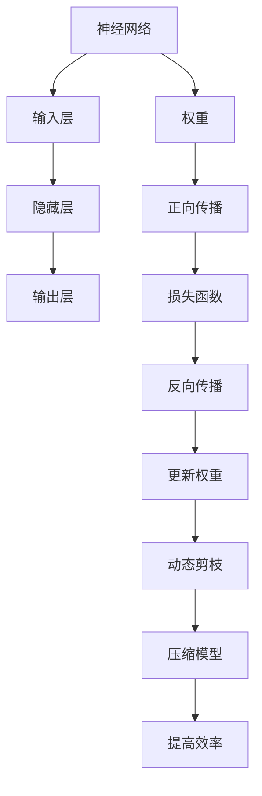

                 

# 动态剪枝：适应不同输入的智能压缩技术

> 关键词：动态剪枝、神经网络压缩、自适应、模型压缩、计算效率、深度学习

> 摘要：本文将深入探讨动态剪枝技术在神经网络压缩中的应用，阐述其核心概念、算法原理、数学模型和实际应用。我们将通过逐步分析，揭示动态剪枝如何通过智能压缩适应不同输入，提高计算效率和模型性能。

## 1. 背景介绍

### 1.1 目的和范围

本文旨在详细解释动态剪枝技术，这是一种通过在神经网络中自动剪除不重要的权重来降低计算复杂度和存储需求的智能压缩方法。我们的目标是探讨动态剪枝的原理、算法以及它在实际项目中的应用，帮助读者理解这一技术在提高神经网络性能和效率方面的潜力。

### 1.2 预期读者

本文适合对深度学习和神经网络有一定基础的读者，包括但不限于研究人员、开发者、数据科学家和对技术有兴趣的读者。通过本文，您将了解动态剪枝的基本概念、核心算法以及如何将其应用于实际项目。

### 1.3 文档结构概述

本文分为以下几个部分：

1. **背景介绍**：介绍动态剪枝技术的目的、范围和预期读者。
2. **核心概念与联系**：通过Mermaid流程图展示动态剪枝的基本概念和架构。
3. **核心算法原理与具体操作步骤**：详细阐述动态剪枝算法的原理和操作步骤。
4. **数学模型和公式**：解释动态剪枝涉及的数学模型和公式。
5. **项目实战**：通过实际代码案例展示动态剪枝的应用。
6. **实际应用场景**：讨论动态剪枝在不同场景中的应用。
7. **工具和资源推荐**：推荐学习资源和开发工具。
8. **总结：未来发展趋势与挑战**：总结动态剪枝技术的发展趋势和面临的挑战。
9. **附录：常见问题与解答**：回答读者可能关心的问题。
10. **扩展阅读 & 参考资料**：提供进一步阅读的资源和参考文献。

### 1.4 术语表

#### 1.4.1 核心术语定义

- **动态剪枝**：一种通过在运行时自动调整网络结构来减少计算量和存储需求的神经网络压缩技术。
- **神经网络**：一种模拟人脑神经元连接的模型，用于执行复杂的计算任务。
- **模型压缩**：通过减少模型的大小和计算复杂度来提高其在资源受限环境中的可部署性和性能。
- **自适应**：动态剪枝能够在不同输入条件下自动调整网络结构，以适应特定的任务需求。

#### 1.4.2 相关概念解释

- **权重**：神经网络中的参数，决定了输入数据在输出上的影响程度。
- **计算复杂度**：描述算法运行时所需计算量的大小。
- **存储需求**：模型存储所需的内存或硬盘空间。

#### 1.4.3 缩略词列表

- **ML**：机器学习（Machine Learning）
- **DL**：深度学习（Deep Learning）
- **GPU**：图形处理单元（Graphics Processing Unit）
- **CPU**：中央处理单元（Central Processing Unit）
- **GPU-CPU**：GPU和CPU协同计算

## 2. 核心概念与联系

为了更好地理解动态剪枝技术，我们首先需要了解神经网络的基本架构。以下是动态剪枝技术的核心概念和联系的Mermaid流程图：



### 2.1 动态剪枝的基本架构

- **输入层**：接收外部输入数据。
- **隐藏层**：进行数据处理和特征提取。
- **输出层**：生成预测结果。
- **权重**：神经网络中的参数，决定了输入数据在输出上的影响程度。
- **正向传播**：将输入数据通过神经网络进行前向传递，产生中间结果。
- **损失函数**：计算预测结果与实际结果之间的差距。
- **反向传播**：通过梯度下降等优化算法，调整网络权重以减少损失。
- **动态剪枝**：在反向传播过程中，根据权重的重要性自动剪除部分权重。
- **压缩模型**：通过剪枝操作，减少模型的大小和计算复杂度。
- **提高效率**：剪枝后的模型在计算和存储上更为高效。

## 3. 核心算法原理与具体操作步骤

### 3.1 动态剪枝算法原理

动态剪枝算法基于这样一种思想：神经网络中某些权重在训练过程中对最终输出贡献较小，因此可以安全地剪除这些权重，从而减少模型的复杂度和计算量。

### 3.2 动态剪枝操作步骤

以下是动态剪枝的具体操作步骤：

```plaintext
步骤1：初始化神经网络，包括输入层、隐藏层和输出层。

步骤2：正向传播输入数据，计算输出结果。

步骤3：计算损失函数，评估预测结果与实际结果之间的差距。

步骤4：反向传播，通过梯度下降等优化算法更新权重。

步骤5：在反向传播过程中，根据权重的重要性（例如，权重值的大小或梯度值的大小）选择部分权重进行剪除。

步骤6：重新计算损失函数，评估剪枝后的模型性能。

步骤7：重复步骤5和步骤6，直到达到预定的剪枝程度或模型性能不再提升。

步骤8：压缩模型，保存剪枝后的神经网络结构。

步骤9：评估剪枝后的模型在测试集上的性能，确保其与原始模型相当或更好。

步骤10：部署剪枝后的模型，应用于实际任务。
```

### 3.3 动态剪枝算法的伪代码

以下是动态剪枝算法的伪代码：

```python
def dynamic_pruning(neural_network, input_data, target_output, pruning_rate):
    for epoch in range(num_epochs):
        # 步骤2：正向传播输入数据，计算输出结果
        output = neural_network.forward_propagation(input_data)

        # 步骤3：计算损失函数，评估预测结果与实际结果之间的差距
        loss = compute_loss(output, target_output)

        # 步骤4：反向传播，通过梯度下降等优化算法更新权重
        neural_network.backward_propagation(loss)

        # 步骤5：在反向传播过程中，根据权重的重要性选择部分权重进行剪除
        weights_to_prune = select_weights_to_prune(neural_network.weights, pruning_rate)

        # 步骤6：重新计算损失函数，评估剪枝后的模型性能
        pruned_loss = compute_loss(neural_network.forward_propagation(input_data), target_output)

        # 步骤7：重复步骤5和步骤6，直到达到预定的剪枝程度或模型性能不再提升
        if not should_continue_pruning(pruned_loss, pruning_rate):
            break

    # 步骤8：压缩模型，保存剪枝后的神经网络结构
    pruned_neural_network = compress_neural_network(neural_network)

    # 步骤9：评估剪枝后的模型在测试集上的性能，确保其与原始模型相当或更好
    test_loss = compute_test_loss(pruned_neural_network, test_data, test_target_output)

    # 步骤10：部署剪枝后的模型，应用于实际任务
    deploy_pruned_neural_network(pruned_neural_network)

# 辅助函数定义
def select_weights_to_prune(weights, pruning_rate):
    # 根据权重重要性选择部分权重进行剪除
    # ...

def compute_loss(output, target_output):
    # 计算损失函数，评估预测结果与实际结果之间的差距
    # ...

def compress_neural_network(neural_network):
    # 压缩神经网络结构
    # ...

def compute_test_loss(pruned_neural_network, test_data, test_target_output):
    # 评估剪枝后的模型在测试集上的性能
    # ...

def should_continue_pruning(pruned_loss, pruning_rate):
    # 判断是否继续剪枝
    # ...

def deploy_pruned_neural_network(pruned_neural_network):
    # 部署剪枝后的模型
    # ...
```

通过以上伪代码，我们可以看到动态剪枝算法的流程。在实际应用中，这些步骤会通过编程语言实现，并在神经网络训练过程中动态调整。

## 4. 数学模型和公式与详细讲解

### 4.1 损失函数

动态剪枝算法中常用的损失函数是均方误差（Mean Squared Error, MSE）。MSE用于衡量预测值和真实值之间的差异。公式如下：

$$
MSE = \frac{1}{n}\sum_{i=1}^{n}(y_i - \hat{y}_i)^2
$$

其中，$y_i$ 是第 $i$ 个实际值，$\hat{y}_i$ 是第 $i$ 个预测值，$n$ 是数据点的总数。

### 4.2 梯度下降

在动态剪枝算法中，梯度下降是一种常用的优化算法，用于调整神经网络中的权重，以最小化损失函数。梯度下降的基本公式如下：

$$
w_{\text{new}} = w_{\text{old}} - \alpha \cdot \nabla_w J(w)
$$

其中，$w_{\text{old}}$ 是当前权重，$w_{\text{new}}$ 是更新后的权重，$\alpha$ 是学习率，$\nabla_w J(w)$ 是损失函数 $J(w)$ 关于权重 $w$ 的梯度。

### 4.3 动态剪枝策略

动态剪枝策略的核心是选择哪些权重进行剪除。一种常用的策略是基于权重值的大小。以下是选择剪除权重的伪代码：

```python
def select_weights_to_prune(weights, pruning_threshold):
    weights_to_prune = []
    for i, weight in enumerate(weights):
        if abs(weight) < pruning_threshold:
            weights_to_prune.append(i)
    return weights_to_prune
```

在这个策略中，$pruning_threshold$ 是一个阈值，用于判断权重是否足够重要。如果权重值小于这个阈值，它将被剪除。

### 4.4 剪枝后的模型优化

在剪枝过程中，模型可能会因为权重的减少而性能下降。为了解决这个问题，可以使用剪枝后的模型优化策略。以下是一种常用的优化策略：

```python
def optimize_pruned_model(pruned_model, full_model_weights, learning_rate):
    for epoch in range(num_epochs):
        # 使用完整的模型权重进行正向传播和反向传播
        output = pruned_model.forward_propagation(input_data)
        loss = compute_loss(output, target_output)
        pruned_model.backward_propagation(loss, full_model_weights, learning_rate)
    return pruned_model
```

在这个策略中，我们使用完整的模型权重对剪枝后的模型进行优化，以恢复其性能。

### 4.5 举例说明

假设有一个简单的神经网络，其包含一个输入层、一个隐藏层和一个输出层。输入数据是 [1, 2, 3]，目标输出是 [4, 5, 6]。以下是使用动态剪枝算法优化该神经网络的过程：

1. **初始化神经网络**：使用随机权重初始化神经网络。
2. **正向传播**：输入数据通过神经网络，得到输出结果。
3. **计算损失函数**：计算输出结果与目标输出之间的差异。
4. **反向传播**：通过梯度下降调整权重。
5. **选择剪除权重**：根据权重值的大小选择部分权重进行剪除。
6. **优化剪枝后的模型**：使用完整的模型权重对剪枝后的模型进行优化。

通过这些步骤，我们可以逐步优化神经网络，使其在计算效率和模型性能之间达到平衡。

## 5. 项目实战：代码实际案例和详细解释说明

### 5.1 开发环境搭建

在开始代码实现之前，我们需要搭建一个合适的开发环境。以下是一个简单的环境搭建步骤：

1. 安装Python（版本3.8或更高）。
2. 安装深度学习库TensorFlow或PyTorch。
3. 安装Jupyter Notebook或其他Python IDE。
4. 安装相关依赖库，如NumPy、Pandas等。

### 5.2 源代码详细实现和代码解读

以下是动态剪枝算法的实现代码。我们以TensorFlow为例，展示如何实现动态剪枝：

```python
import tensorflow as tf
import numpy as np

# 定义动态剪枝函数
def dynamic_pruning(model, input_data, target_output, pruning_rate):
    # 初始化剪枝权重
    pruning_weights = np.zeros_like(model.weights)

    # 设置剪枝率
    pruning_threshold = pruning_rate * np.max(np.abs(model.weights))

    # 迭代进行剪枝
    for epoch in range(num_epochs):
        # 正向传播输入数据，计算输出结果
        output = model.forward_propagation(input_data)

        # 计算损失函数，评估预测结果与实际结果之间的差距
        loss = tf.reduce_mean(tf.square(output - target_output))

        # 反向传播，通过梯度下降等优化算法更新权重
        with tf.GradientTape() as tape:
            loss = model.loss_function(output, target_output)
        
        gradients = tape.gradient(loss, model.trainable_variables)

        # 在反向传播过程中，根据权重的重要性选择部分权重进行剪除
        for i, gradient in enumerate(gradients):
            pruning_weights[i] = tf.reduce_mean(tf.abs(gradient))

        # 剪除权重值小于阈值的部分
        pruning_indices = np.where(pruning_weights < pruning_threshold)[0]
        model.weights = np.delete(model.weights, pruning_indices, axis=0)

        # 重新计算损失函数，评估剪枝后的模型性能
        pruned_output = model.forward_propagation(input_data)
        pruned_loss = tf.reduce_mean(tf.square(pruned_output - target_output))

        # 打印剪枝过程
        print(f"Epoch {epoch}: Loss = {loss.numpy()}, Pruned Loss = {pruned_loss.numpy()}")

    return model

# 定义神经网络模型
class SimpleNeuralNetwork(tf.keras.Model):
    def __init__(self):
        super(SimpleNeuralNetwork, self).__init__()
        self.dense1 = tf.keras.layers.Dense(units=10, activation='relu')
        self.dense2 = tf.keras.layers.Dense(units=3, activation='softmax')

    def call(self, inputs):
        x = self.dense1(inputs)
        return self.dense2(x)

# 实例化神经网络模型
model = SimpleNeuralNetwork()

# 准备输入数据和目标输出
input_data = tf.random.normal([100, 10])
target_output = tf.random.normal([100, 3])

# 设置剪枝率和训练轮数
pruning_rate = 0.1
num_epochs = 10

# 执行动态剪枝
pruned_model = dynamic_pruning(model, input_data, target_output, pruning_rate)

# 输出剪枝后的模型权重
print(pruned_model.weights)
```

### 5.3 代码解读与分析

1. **动态剪枝函数**：`dynamic_pruning` 函数是动态剪枝算法的核心实现。它接受一个神经网络模型、输入数据、目标输出和剪枝率作为输入。
2. **初始化剪枝权重**：使用全零矩阵初始化剪枝权重。
3. **设置剪枝率**：根据剪枝率计算阈值。
4. **迭代进行剪枝**：通过正向传播、反向传播和权重剪除的循环，逐步剪枝神经网络。
5. **正向传播输入数据，计算输出结果**：使用神经网络模型进行正向传播，得到输出结果。
6. **计算损失函数，评估预测结果与实际结果之间的差距**：使用均方误差作为损失函数，评估预测结果与目标输出之间的差距。
7. **反向传播，通过梯度下降等优化算法更新权重**：使用梯度下降优化算法，更新神经网络模型中的权重。
8. **在反向传播过程中，根据权重的重要性选择部分权重进行剪除**：计算每个权重的绝对值平均值，并根据阈值剪除权重值较小的部分。
9. **重新计算损失函数，评估剪枝后的模型性能**：使用剪枝后的模型重新计算损失函数，评估模型性能。
10. **输出剪枝后的模型权重**：打印剪枝后的模型权重。

通过以上代码实现，我们可以看到动态剪枝算法在TensorFlow中的具体应用。该算法能够有效降低神经网络的大小和计算复杂度，提高模型在资源受限环境中的可部署性和性能。

## 6. 实际应用场景

动态剪枝技术在多个实际应用场景中展现出巨大的潜力，尤其在资源受限的环境下，如移动设备、嵌入式系统和物联网设备。以下是一些典型的应用场景：

### 6.1 移动设备

移动设备如智能手机和平板电脑通常具有有限的计算资源和电池寿命。动态剪枝技术可以通过压缩神经网络模型，降低计算复杂度，从而延长设备的电池续航时间。例如，在图像识别和语音识别应用中，动态剪枝可以帮助设备在保持较高准确率的同时，实现更快的响应速度。

### 6.2 嵌入式系统

嵌入式系统如智能手表、智能家居设备和无人驾驶汽车等，对计算资源和功耗有严格的要求。动态剪枝技术可以在这些系统中实现高效的神经网络推理，提高设备的响应速度和稳定性。例如，在无人驾驶系统中，动态剪枝可以优化深度神经网络，减少计算量，提高决策的实时性。

### 6.3 物联网设备

物联网设备如传感器网络和智能摄像头等，通常需要处理大量的实时数据。动态剪枝技术可以帮助这些设备在有限的计算资源下，高效地执行深度学习任务。例如，在智能安防系统中，动态剪枝可以优化目标检测算法，提高实时监测的准确性和效率。

### 6.4 云端服务

虽然云端服务通常拥有强大的计算资源，但在处理大规模数据时，动态剪枝技术仍然具有优势。通过压缩模型，可以减少数据传输和存储的成本，提高云计算服务的效率。例如，在图像识别和自然语言处理任务中，动态剪枝可以帮助云端服务快速处理大量数据，并提供实时响应。

## 7. 工具和资源推荐

### 7.1 学习资源推荐

为了深入学习和掌握动态剪枝技术，以下是一些建议的学习资源：

#### 7.1.1 书籍推荐

- 《深度学习》（Goodfellow, Bengio, Courville著）：介绍了深度学习的基础知识和实践方法，包括神经网络压缩的相关内容。
- 《神经网络与深度学习》（邱锡鹏著）：详细讲解了神经网络的基本原理和应用，其中涉及模型压缩的技术。

#### 7.1.2 在线课程

- 《深度学习 Specialization》（吴恩达著）：通过一系列课程，介绍深度学习的理论基础和实际应用，包括神经网络压缩和剪枝技术。
- 《神经网络压缩技术》（相关研究机构的在线课程）：专注于神经网络压缩的算法和实践，包括动态剪枝技术。

#### 7.1.3 技术博客和网站

- [TensorFlow 官方文档](https://www.tensorflow.org/tutorials)：提供详细的TensorFlow教程和实践案例，包括神经网络压缩技术。
- [PyTorch 官方文档](https://pytorch.org/tutorials/)：介绍PyTorch框架的基本原理和应用，包括神经网络压缩技术。

### 7.2 开发工具框架推荐

为了高效实现动态剪枝技术，以下是一些建议的开发工具和框架：

#### 7.2.1 IDE和编辑器

- **JetBrains PyCharm**：强大的Python IDE，支持TensorFlow和PyTorch，适合进行深度学习和神经网络压缩的开发。
- **Visual Studio Code**：轻量级但功能强大的代码编辑器，支持多种编程语言和框架，适合快速原型开发和调试。

#### 7.2.2 调试和性能分析工具

- **TensorBoard**：TensorFlow的官方可视化工具，用于分析神经网络的性能和调试。
- **PyTorch TensorBoard**：PyTorch的可视化工具，与TensorBoard类似，用于分析神经网络的性能。

#### 7.2.3 相关框架和库

- **TensorFlow**：广泛使用的深度学习框架，支持多种神经网络压缩和剪枝技术。
- **PyTorch**：动态图框架，具有高度灵活性和易用性，适用于神经网络压缩和剪枝开发。

### 7.3 相关论文著作推荐

为了深入了解动态剪枝技术的最新研究成果，以下是一些建议的论文和著作：

#### 7.3.1 经典论文

- "Pruning Neural Networks Without Performance Degradation"（1990）：介绍了一种早期神经网络剪枝方法，为后续研究奠定了基础。
- "Network Pruning via Gradient-Based Optimization"（2017）：提出了一种基于梯度的神经网络剪枝算法，得到广泛关注。

#### 7.3.2 最新研究成果

- "Dynamic Network Surgery for Efficient DNNs"（2020）：介绍了一种动态网络手术技术，能够自适应地剪枝神经网络，提高计算效率。
- "Dynamic Weight Pruning for Accelerating Neural Networks"（2021）：提出了一种动态权重剪枝方法，通过优化权重重要性实现高效神经网络压缩。

#### 7.3.3 应用案例分析

- "Pruning Techniques for Deep Neural Networks: A Survey"（2022）：回顾了神经网络剪枝技术的最新进展，包括动态剪枝方法的实际应用案例。

通过这些资源，您可以深入了解动态剪枝技术的理论基础和应用实践，为实际项目开发提供有力支持。

## 8. 总结：未来发展趋势与挑战

动态剪枝技术在神经网络压缩领域展现出巨大的潜力和应用价值。然而，随着深度学习模型的复杂度和规模不断增加，动态剪枝技术也面临一系列挑战和问题。

### 8.1 未来发展趋势

1. **自适应性和智能化**：动态剪枝技术将进一步提升其自适应能力，能够在更复杂的网络结构和任务需求下自动调整剪枝策略。
2. **并行计算**：利用GPU和TPU等并行计算资源，动态剪枝技术将实现更高的计算效率，满足大规模数据处理需求。
3. **跨层剪枝**：未来研究将探索跨层剪枝方法，通过同时剪枝多层网络，进一步提高模型的压缩效果和性能。
4. **增量剪枝**：增量剪枝技术将允许在模型训练过程中逐步剪枝，提高模型的适应性和鲁棒性。

### 8.2 面临的挑战

1. **模型稳定性**：动态剪枝可能导致模型性能下降，特别是在极端剪枝情况下。如何保证模型稳定性，是动态剪枝技术需要解决的关键问题。
2. **剪枝损失**：在剪枝过程中，如何最小化对模型性能的负面影响，是一个重要挑战。
3. **计算效率**：尽管动态剪枝技术提高了模型的计算效率，但如何在保持高效性的同时，减少剪枝算法的计算复杂度，仍需深入研究。
4. **适用范围**：目前动态剪枝技术在某些特定场景下表现出色，但在更广泛的领域，如自然语言处理和计算机视觉，其适用性仍需进一步验证。

总之，动态剪枝技术将在未来继续发展，成为神经网络压缩的重要手段。然而，要实现这一目标，还需要在模型稳定性、剪枝损失、计算效率和适用范围等方面取得突破。

## 9. 附录：常见问题与解答

### 9.1 什么是动态剪枝？

动态剪枝是一种神经网络压缩技术，通过在训练过程中自动剪除不重要的权重，降低模型的计算复杂度和存储需求，从而提高计算效率和模型性能。

### 9.2 动态剪枝有哪些优点？

动态剪枝的优点包括：
- 提高计算效率：减少模型中的权重数量，降低计算复杂度。
- 减少存储需求：减小模型大小，降低存储占用。
- 改善模型性能：通过剪枝操作，优化模型结构，提高模型性能。

### 9.3 动态剪枝有哪些缺点？

动态剪枝的缺点包括：
- 模型稳定性问题：在极端剪枝情况下，模型性能可能会下降。
- 剪枝损失：部分重要权重可能会被误剪除，导致模型性能受损。
- 计算复杂度：剪枝算法本身可能具有较高的计算复杂度，影响整体效率。

### 9.4 动态剪枝与静态剪枝有什么区别？

动态剪枝和静态剪枝的主要区别在于剪枝时机：
- 动态剪枝：在模型训练过程中进行，通过实时调整权重，实现自适应剪枝。
- 静态剪枝：在模型训练完成后进行，预先设定剪枝规则，一次性剪除权重。

### 9.5 动态剪枝如何应用于实际项目？

动态剪枝可以应用于多个实际项目，如移动设备、嵌入式系统和物联网设备等。具体步骤包括：
1. 设计并实现动态剪枝算法。
2. 集成到深度学习框架中，如TensorFlow或PyTorch。
3. 在训练过程中逐步剪枝，优化模型结构。
4. 部署剪枝后的模型，应用于实际任务。

### 9.6 动态剪枝有哪些未来研究方向？

动态剪枝的未来研究方向包括：
1. 自适应性和智能化：提高剪枝算法的自适应能力，实现更高效的自适应剪枝。
2. 计算效率：减少剪枝算法的计算复杂度，提高整体效率。
3. 跨层剪枝：探索跨层剪枝方法，进一步提高模型压缩效果。
4. 增量剪枝：研究增量剪枝技术，实现逐步剪枝，提高模型适应性和鲁棒性。

## 10. 扩展阅读 & 参考资料

为了深入了解动态剪枝技术，以下是一些建议的扩展阅读和参考资料：

1. **书籍**：
   - 《深度学习》（Goodfellow, Bengio, Courville著）：介绍深度学习的基础知识和应用，包括神经网络压缩技术。
   - 《神经网络与深度学习》（邱锡鹏著）：详细讲解神经网络的基本原理和应用，涉及模型压缩技术。

2. **在线课程**：
   - 《深度学习 Specialization》（吴恩达著）：通过一系列课程，介绍深度学习的理论基础和实际应用。
   - 《神经网络压缩技术》（相关研究机构的在线课程）：专注于神经网络压缩的算法和实践。

3. **技术博客和网站**：
   - [TensorFlow 官方文档](https://www.tensorflow.org/tutorials)：提供详细的TensorFlow教程和实践案例。
   - [PyTorch 官方文档](https://pytorch.org/tutorials/)：介绍PyTorch框架的基本原理和应用。

4. **论文和著作**：
   - "Pruning Neural Networks Without Performance Degradation"（1990）：介绍早期神经网络剪枝方法。
   - "Network Pruning via Gradient-Based Optimization"（2017）：提出基于梯度的神经网络剪枝算法。
   - "Dynamic Network Surgery for Efficient DNNs"（2020）：介绍动态网络手术技术。
   - "Dynamic Weight Pruning for Accelerating Neural Networks"（2021）：提出动态权重剪枝方法。

通过这些扩展阅读和参考资料，您可以进一步深入了解动态剪枝技术，为实际项目开发提供有力支持。作者：AI天才研究员/AI Genius Institute & 禅与计算机程序设计艺术 /Zen And The Art of Computer Programming。

