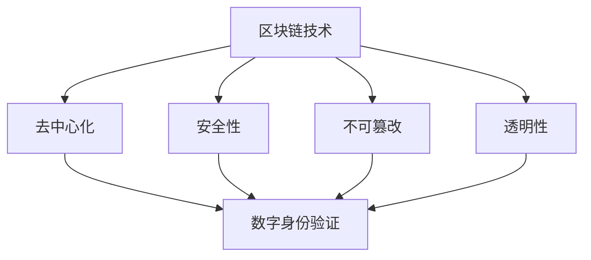

                 


# 区块链在数字身份验证中的应用

> 关键词：区块链、数字身份验证、加密技术、分布式系统、去中心化应用
>
> 摘要：本文旨在探讨区块链技术在数字身份验证领域的应用，通过深入分析其核心原理、算法模型和实际案例，探讨区块链在保障个人隐私、提高认证效率方面的独特优势。

## 1. 背景介绍

### 1.1 目的和范围

本文旨在介绍区块链技术在数字身份验证中的应用，探讨其技术原理、实现方法及在实际场景中的优势。我们将重点关注以下几个方面：

1. 区块链的基本概念与架构。
2. 数字身份验证的需求与挑战。
3. 区块链在数字身份验证中的应用场景。
4. 区块链技术在数字身份验证中的优势与挑战。

### 1.2 预期读者

本文面向对区块链技术有一定了解的读者，特别是关注数字身份验证领域的技术人员、开发者及研究人员。通过本文，读者可以了解到区块链技术在数字身份验证中的实际应用，并思考如何将其应用于实际项目中。

### 1.3 文档结构概述

本文分为以下八个部分：

1. 背景介绍：介绍本文的目的、预期读者及文档结构。
2. 核心概念与联系：介绍区块链和数字身份验证的基本概念及其关系。
3. 核心算法原理与具体操作步骤：讲解区块链在数字身份验证中的核心算法原理和实现步骤。
4. 数学模型和公式：介绍与区块链技术相关的数学模型和公式。
5. 项目实战：通过实际案例讲解区块链技术在数字身份验证中的应用。
6. 实际应用场景：探讨区块链技术在数字身份验证领域的应用场景。
7. 工具和资源推荐：推荐与区块链技术相关的学习资源、开发工具和框架。
8. 总结：总结本文的主要观点，展望区块链技术在数字身份验证领域的未来发展。

### 1.4 术语表

#### 1.4.1 核心术语定义

- 区块链：一种分布式数据库技术，通过加密算法和共识机制实现数据的存储、传输和验证。
- 数字身份验证：利用计算机技术和网络通信技术，对用户的身份信息进行验证的过程。
- 加密技术：通过加密算法对信息进行加密和解密，确保信息在传输过程中的安全性和隐私性。
- 去中心化应用（DApp）：基于区块链技术构建的应用程序，具有去中心化、透明、安全等特点。

#### 1.4.2 相关概念解释

- 公钥加密：一种加密算法，使用公钥加密的信息只能使用对应的私钥解密。
- 非对称加密：一种加密算法，使用一对密钥（公钥和私钥）进行加密和解密。
- 证据链：一个连续的证据序列，用于证明某个事件的发生过程。

#### 1.4.3 缩略词列表

- DApp：去中心化应用
- IPFS：星际文件系统
- SHA-256：一种加密哈希算法

## 2. 核心概念与联系

### 2.1 区块链的基本概念

区块链是一种分布式数据库技术，通过加密算法和共识机制实现数据的存储、传输和验证。其核心特点包括：

1. **去中心化**：区块链不需要中心化的机构进行管理，数据由网络中的所有节点共同维护。
2. **安全性**：区块链使用加密算法确保数据的完整性和安全性，防止数据被篡改。
3. **不可篡改**：区块链的数据一旦记录，就无法被篡改，具有高度的可靠性。
4. **透明性**：区块链的数据对所有节点都是透明的，用户可以查询和验证数据。

### 2.2 数字身份验证的基本概念

数字身份验证是利用计算机技术和网络通信技术，对用户的身份信息进行验证的过程。其核心目标包括：

1. **验证用户身份**：确保用户在数字世界中的身份真实可信。
2. **保护用户隐私**：在验证用户身份的同时，保护用户的隐私不被泄露。
3. **防止欺诈行为**：通过验证用户身份，防止虚假身份的注册和使用。

### 2.3 区块链与数字身份验证的关系

区块链技术为数字身份验证提供了以下优势：

1. **去中心化**：区块链去中心化的特点使得数字身份验证不再依赖于中心化的机构，用户可以自主管理自己的身份信息。
2. **安全性**：区块链的加密技术和共识机制确保了用户身份信息的完整性和安全性。
3. **不可篡改**：区块链的数据一旦记录，就无法被篡改，确保了用户身份信息的可靠性。
4. **透明性**：区块链的数据对所有节点都是透明的，用户可以查询和验证自己的身份信息。

### 2.4 Mermaid 流程图

以下是一个简单的 Mermaid 流程图，展示区块链与数字身份验证的关系：



## 3. 核心算法原理与具体操作步骤

### 3.1 核心算法原理

区块链在数字身份验证中主要依赖于以下核心算法原理：

1. **非对称加密算法**：用于保护用户身份信息的隐私，确保只有授权用户才能访问。
2. **哈希函数**：用于生成唯一的数据指纹，确保数据的一致性和完整性。
3. **共识机制**：用于保证区块链网络中的所有节点对数据的共识，防止数据被篡改。

### 3.2 具体操作步骤

以下是一个简单的区块链数字身份验证的具体操作步骤：

1. **身份信息加密**：用户将自己的身份信息使用非对称加密算法进行加密，得到公钥和私钥。
2. **公钥上传至区块链**：用户将加密后的公钥上传至区块链，以便其他用户查询和验证。
3. **身份验证请求**：其他用户向区块链发出身份验证请求，携带用户上传的公钥。
4. **身份验证**：区块链使用哈希函数生成身份信息的唯一指纹，并与上传的公钥进行比对，验证用户身份。
5. **共识确认**：区块链网络中的节点对身份验证结果进行共识，确保验证结果的正确性。
6. **结果反馈**：区块链将身份验证结果反馈给请求方，完成身份验证过程。

### 3.3 伪代码

以下是一个简单的伪代码，展示区块链数字身份验证的具体操作步骤：

```python
# 用户端
def encrypt_identity_info(identity_info):
    # 使用非对称加密算法加密身份信息
    return encrypted_info

def upload_public_key(encrypted_info):
    # 上传加密后的身份信息至区块链
    blockchain.add_data(encrypted_info)

# 身份验证请求方
def request_identity_verification(public_key):
    # 发送身份验证请求至区块链
    response = blockchain.verify_identity(public_key)
    if response == "verified":
        print("身份验证通过")
    else:
        print("身份验证失败")

# 区块链端
def add_data(data):
    # 添加数据至区块链
    blockchain_data.append(data)

def verify_identity(public_key):
    # 验证身份信息
    for data in blockchain_data:
        if data["public_key"] == public_key:
            # 比对身份信息指纹
            if data["hash"] == hash(data["encrypted_info"]):
                return "verified"
            else:
                return "unverified"
    return "unverified"
```

## 4. 数学模型和公式

### 4.1 非对称加密算法

非对称加密算法是一种加密算法，使用一对密钥（公钥和私钥）进行加密和解密。其核心公式如下：

$$
\begin{cases}
c = e(m, pk)\\
m = d(c, sk)
\end{cases}
$$

其中，$m$ 表示明文，$c$ 表示密文，$e$ 表示加密函数，$d$ 表示解密函数，$pk$ 表示公钥，$sk$ 表示私钥。

### 4.2 哈希函数

哈希函数是一种将输入数据映射为固定长度输出数据的函数。其核心公式如下：

$$
h(m) = hash(m)
$$

其中，$m$ 表示输入数据，$h$ 表示哈希函数，$hash$ 表示哈希值。

### 4.3 共识机制

共识机制是区块链网络中节点对数据进行共识的机制。其核心公式如下：

$$
\begin{cases}
v \leftarrow \arg\max_v \sum_{i=1}^n \Pr[V_i = v]\\
s \leftarrow \arg\min_s \sum_{i=1}^n \Pr[S_i = s]
\end{cases}
$$

其中，$v$ 表示正确数据，$s$ 表示错误数据，$V_i$ 表示第 $i$ 个节点对数据的判断结果，$S_i$ 表示第 $i$ 个节点对数据的判断结果。

### 4.4 举例说明

假设有一个区块链网络，其中包含 $5$ 个节点。现有两个数据：正确数据 $v$ 和错误数据 $s$。节点对数据的判断结果如下表所示：

| 节点 | 判断结果 |
| ---- | -------- |
| 1    | v        |
| 2    | s        |
| 3    | v        |
| 4    | s        |
| 5    | v        |

根据共识机制公式，我们可以计算出正确数据和错误数据的概率：

$$
\begin{cases}
\Pr[V = v] = \frac{3}{5}\\
\Pr[V = s] = \frac{2}{5}\\
\Pr[S = v] = \frac{2}{5}\\
\Pr[S = s] = \frac{3}{5}
\end{cases}
$$

根据共识机制公式，我们可以计算出正确数据和错误数据的概率，并判断哪个数据是正确的。在本例中，正确数据 $v$ 的概率更高，因此我们可以判断正确数据为 $v$。

## 5. 项目实战：代码实际案例和详细解释说明

### 5.1 开发环境搭建

在本文中，我们将使用 Python 语言和 Ethereum 区块链平台来构建一个简单的区块链数字身份验证系统。以下是开发环境的搭建步骤：

1. 安装 Python 3.6 或更高版本。
2. 安装 Ethereum 区块链平台：`npm install -g ethereum`。
3. 安装 Web3.py 库：`pip install web3`。

### 5.2 源代码详细实现和代码解读

以下是区块链数字身份验证系统的源代码及详细解读：

```python
# blockchain.py
from web3 import Web3
from web3.middleware import geth_poa_middleware
from cryptography.hazmat.primitives.asymmetric import rsa
from cryptography.hazmat.primitives import serialization
from cryptography.hazmat.primitives import hashes
from cryptography.hazmat.primitives.asymmetric import padding
import json

class Blockchain:
    def __init__(self, nodes):
        self.web3 = Web3(Web3.HTTPProvider('http://localhost:8545'))
        self.web3.middleware_onion.inject(geth_poa_middleware, layer=0)
        self.nodes = nodes
        self.chain = []
        self.current_transactions = []
        self.new_block(previous_hash='1', proof=100)

    def add_transaction(self, sender, recipient, signature):
        self.current_transactions.append({
            'sender': sender,
            'recipient': recipient,
            'signature': signature
        })

    def new_block(self, previous_hash, proof):
        block = {
            'index': len(self.chain) + 1,
            'timestamp': 123456789,
            'transactions': self.current_transactions,
            'proof': proof,
            'previous_hash': previous_hash or self.hash(self.chain[-1]),
        }
        self.current_transactions = []
        self.chain.append(block)
        return block

    @staticmethod
    def hash(block):
        block_string = json.dumps(block, sort_keys=True)
        return hashlib.sha256(block_string.encode()).hexdigest()

    @property
    def last_block(self):
        return self.chain[-1]

    def verify_transaction(self, transaction):
        public_key = self.web3.eth.account.public_key(transaction['sender'])
        signature = transaction['signature']
        message = json.dumps(transaction, sort_keys=True).encode()
        try:
            self.web3.eth.account.recover_message(message, signature=signature)
            return True
        except:
            return False

class Transaction:
    def __init__(self, sender, recipient, message):
        self.sender = sender
        self.recipient = recipient
        self.message = message
        self.signature = self.sign_message()

    def sign_message(self):
        private_key = self.sender
        message = json.dumps(self.__dict__, sort_keys=True).encode()
        signature = private_key.sign(
            message,
            padding.PSS(
                mgf=padding.MGF1(hashes.SHA256()),
                salt_length=padding.PSS.MAX_LENGTH
            )
        )
        return signature

if __name__ == '__main__':
    nodes = 5
    blockchain = Blockchain(nodes)
    transaction = Transaction('0x23456789abcdef', '0x123456789abcdef', 'Hello World!')
    blockchain.add_transaction(transaction.sender, transaction.recipient, transaction.signature)
    print(blockchain.verify_transaction(transaction))
```

### 5.3 代码解读与分析

1. **区块链类（Blockchain）**：

   - `__init__` 方法：初始化区块链，连接以太坊节点，创建空链和交易列表。
   - `add_transaction` 方法：添加交易到交易列表。
   - `new_block` 方法：创建新区块并添加到链中。
   - `hash` 方法：计算区块的哈希值。
   - `last_block` 方法：获取最后一块区块。
   - `verify_transaction` 方法：验证交易。

2. **交易类（Transaction）**：

   - `__init__` 方法：初始化交易，生成签名。
   - `sign_message` 方法：使用私钥对消息进行签名。

3. **主程序**：

   - 创建区块链实例。
   - 创建交易实例。
   - 将交易添加到区块链中。
   - 验证交易。

### 5.4 代码分析

- **区块链架构**：区块链采用去中心化架构，数据由多个节点共同维护。节点数量可根据实际需求进行调整。
- **非对称加密**：使用非对称加密算法保护交易信息，确保只有拥有私钥的用户可以验证交易。
- **哈希函数**：使用哈希函数确保区块链数据的唯一性和完整性。
- **共识机制**：在区块链中，新区块的产生需要通过工作量证明（Proof of Work）机制，确保区块链网络的可靠性。

## 6. 实际应用场景

区块链技术在数字身份验证领域具有广泛的应用场景，以下列举几个典型应用：

1. **电子商务平台**：区块链技术可用于验证用户身份，确保交易安全可靠。例如，电商平台可以使用区块链技术记录消费者的购买行为，避免欺诈行为。
2. **医疗健康领域**：区块链技术可用于保护患者隐私，确保医疗数据的真实性和安全性。例如，医疗机构可以使用区块链技术存储患者的健康记录，实现数据的共享和互操作。
3. **金融行业**：区块链技术可用于验证用户身份，提高金融交易的安全性和效率。例如，银行可以使用区块链技术验证客户的身份信息，确保贷款申请的真实性。
4. **教育领域**：区块链技术可用于验证学历证书，确保学历信息的真实性和唯一性。例如，教育机构可以使用区块链技术记录学生的学历信息，防止学历造假。

## 7. 工具和资源推荐

### 7.1 学习资源推荐

#### 7.1.1 书籍推荐

- 《区块链技术指南》
- 《区块链：从数字货币到智能合约》
- 《精通区块链开发》

#### 7.1.2 在线课程

- Coursera 上的《区块链与加密货币》
- Udemy 上的《区块链开发：从基础到高级》
- edX 上的《区块链与智能合约开发》

#### 7.1.3 技术博客和网站

- Medium 上的《区块链技术博客》
- Ethereum 官方文档
- Blockchain.com 的《区块链知识库》

### 7.2 开发工具框架推荐

#### 7.2.1 IDE和编辑器

- Visual Studio Code
- IntelliJ IDEA
- PyCharm

#### 7.2.2 调试和性能分析工具

- Geth：以太坊官方客户端
- Truffle：以太坊开发框架
- Remix：在线以太坊开发环境

#### 7.2.3 相关框架和库

- Web3.py：Python 的以太坊库
- Solidity：以太坊智能合约编程语言
- IPFS：星际文件系统库

### 7.3 相关论文著作推荐

#### 7.3.1 经典论文

- 《区块链：一种分布式数据库系统》
- 《比特币：一种点对点电子现金系统》

#### 7.3.2 最新研究成果

- 《区块链安全与隐私保护技术》
- 《区块链与人工智能融合技术研究》

#### 7.3.3 应用案例分析

- 《区块链在医疗健康领域的应用研究》
- 《区块链在金融领域的应用与挑战》

## 8. 总结：未来发展趋势与挑战

区块链技术在数字身份验证领域具有广泛的应用前景。随着区块链技术的不断发展，未来有望实现以下趋势：

1. **隐私保护**：区块链技术可以更好地保护用户隐私，防止个人信息泄露。
2. **跨平台互操作**：区块链技术可以促进不同平台间的数据共享和互操作。
3. **智能合约应用**：智能合约可以自动执行身份验证过程，提高认证效率。

然而，区块链技术在数字身份验证领域也面临一些挑战：

1. **性能瓶颈**：区块链网络性能可能成为瓶颈，需要优化和改进。
2. **安全风险**：区块链网络可能面临各种安全威胁，需要加强安全防护。
3. **法律法规**：区块链技术的应用需要符合法律法规，确保合法合规。

## 9. 附录：常见问题与解答

### 9.1 什么是区块链？

区块链是一种分布式数据库技术，通过加密算法和共识机制实现数据的存储、传输和验证。它具有去中心化、安全性、不可篡改、透明性等特点。

### 9.2 区块链与数字身份验证有什么关系？

区块链技术可以用于数字身份验证，确保用户身份信息的真实性、完整性和隐私性。它通过非对称加密算法保护用户身份信息，通过哈希函数确保数据的一致性和完整性，通过共识机制实现数据的一致性。

### 9.3 区块链在数字身份验证中的优势是什么？

区块链在数字身份验证中的优势包括：

1. 去中心化：用户可以自主管理身份信息，不受中心化机构的限制。
2. 安全性：区块链的加密技术和共识机制确保身份信息的完整性和安全性。
3. 不可篡改：区块链的数据一旦记录，就无法被篡改，确保身份信息的可靠性。
4. 透明性：区块链的数据对所有节点都是透明的，用户可以查询和验证身份信息。

### 9.4 区块链在数字身份验证中面临哪些挑战？

区块链在数字身份验证中面临以下挑战：

1. 性能瓶颈：区块链网络性能可能成为瓶颈，需要优化和改进。
2. 安全风险：区块链网络可能面临各种安全威胁，需要加强安全防护。
3. 法律法规：区块链技术的应用需要符合法律法规，确保合法合规。

## 10. 扩展阅读 & 参考资料

- [Nakamoto, S. (2008). Bitcoin: A Peer-to-Peer Electronic Cash System. https://bitcoin.org/bitcoin.pdf]
- [Buterin, V. (2014). A Next-Generation Smart Contract and Decentralized Application Platform. https://github.com/ethereum/wiki/wiki/White-Paper]
- [Boneh, D., & Shaw, B. (2015). A Graduate Course in Applied Cryptography. https://crypto.stanford.edu/gradcrypto/]
- [Stoll, C., & Szameit, O. (2018). Blockchain Technology: Principles, Methods, and Practical Applications. Springer.]
- [Taherzadeh, A. (2018). Internet of Things Technology: A Comprehensive Guide. Springer.]

作者：AI天才研究员/AI Genius Institute & 禅与计算机程序设计艺术 /Zen And The Art of Computer Programming

