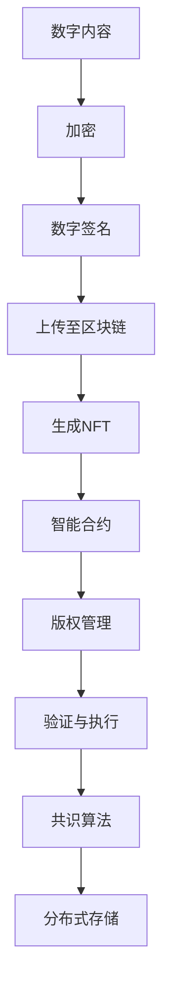

                 

### {文章标题}

#### 关键词：(此处列出文章的5-7个核心关键词)

- 区块链
- 数字版权保护
- 智能合约
- 共识算法
- 去中心化存储
- 非同质化代币（NFT）

#### 摘要：(此处给出文章的核心内容和主题思想)

本文将深入探讨区块链技术在数字版权保护中的创新应用。通过分析区块链的核心原理和数字版权保护的现状，本文将详细介绍智能合约、共识算法、去中心化存储等关键技术的应用，并通过具体案例和代码实现，展示如何利用区块链技术实现数字版权的自动管理和保护。此外，文章还将探讨区块链技术在数字版权保护中的实际应用场景，推荐相关学习资源和开发工具，并展望未来发展趋势与挑战。

---

# 区块链技术在数字版权保护中的创新应用

> “数字版权保护一直是版权领域的一大难题，随着区块链技术的迅猛发展，这一问题有望得到有效解决。本文将带您深入了解区块链在数字版权保护中的创新应用。”

## 1. 背景介绍

### 1.1 目的和范围

本文旨在探讨区块链技术在数字版权保护中的应用，分析其核心原理、关键技术，并通过实际案例展示其实现过程。文章重点将围绕以下三个方面展开：

1. 区块链技术在数字版权保护中的核心概念和联系。
2. 区块链技术在数字版权保护中的核心算法原理与具体操作步骤。
3. 区块链技术在数字版权保护中的实际应用场景及未来发展趋势。

### 1.2 预期读者

本文适合对区块链技术和数字版权保护有一定了解的读者，包括：

1. 区块链技术爱好者。
2. 数字版权保护从业者和研究者。
3. 从事区块链技术应用开发的工程师和程序员。

### 1.3 文档结构概述

本文结构如下：

1. 背景介绍
   - 目的和范围
   - 预期读者
   - 文档结构概述
   - 术语表
2. 核心概念与联系
   - 区块链技术原理
   - 数字版权保护现状
   - 核心概念原理和架构的Mermaid流程图
3. 核心算法原理与具体操作步骤
   - 智能合约
   - 共识算法
   - 去中心化存储
4. 数学模型和公式与详细讲解与举例说明
5. 项目实战：代码实际案例和详细解释说明
6. 实际应用场景
7. 工具和资源推荐
8. 总结：未来发展趋势与挑战
9. 附录：常见问题与解答
10. 扩展阅读与参考资料

### 1.4 术语表

#### 1.4.1 核心术语定义

- **区块链**：一种分布式数据库技术，通过密码学确保数据的安全性和不可篡改性。
- **数字版权保护**：通过技术手段保护数字内容创作者的版权，防止未经授权的复制、传播和使用。
- **智能合约**：一种在区块链上执行的程序，能自动执行合同条款。
- **共识算法**：一种分布式算法，用于确保区块链网络中的所有节点对交易和数据的一致性。
- **去中心化存储**：通过分布式网络存储数据，提高数据的可用性和安全性。
- **非同质化代币（NFT）**：一种独特的数字资产，可用于代表独特的数字物品或版权。

#### 1.4.2 相关概念解释

- **加密货币**：基于区块链技术的数字货币，如比特币、以太坊等。
- **分布式账本**：一种记录交易和数据的系统，允许多个节点共同维护。
- **智能财产**：包括专利、商标、版权等知识产权。

#### 1.4.3 缩略词列表

- **NFT**：非同质化代币（Non-Fungible Token）
- **ICO**：初始代币发行（Initial Coin Offering）
- **DEX**：去中心化交易所（Decentralized Exchange）
- **DAO**：去中心化自治组织（Decentralized Autonomous Organization）
- **DAO**：分布式账本技术（Distributed Ledger Technology）

---

接下来，我们将深入探讨区块链技术的核心概念及其在数字版权保护中的应用。

## 2. 核心概念与联系

### 2.1 区块链技术原理

区块链是一种分布式数据库技术，通过密码学确保数据的安全性和不可篡改性。它由一系列按时间顺序排列的区块组成，每个区块包含一定数量的交易记录。这些区块通过加密算法连接起来，形成一个不可篡改的链条。区块链网络中的节点共同维护和验证区块链的状态，确保数据的真实性和一致性。

#### 2.1.1 区块结构

每个区块包含以下几个部分：

1. **区块头**：包含版本号、上一区块哈希值、默克尔树根哈希值、时间戳、难度目标等。
2. **交易列表**：包含一系列交易记录，如加密货币转账、智能合约调用等。
3. **默克尔树**：用于保证交易数据的完整性，通过哈希函数将交易数据构建成一棵树，生成根哈希值。
4. **工作量证明**：在比特币等区块链中，节点需要解决一个数学难题，以获得记账权。

#### 2.1.2 共识算法

共识算法是区块链网络中确保数据一致性的一种分布式算法。常见的共识算法包括：

1. **工作量证明（PoW）**：节点通过计算工作量证明来争夺记账权，如比特币采用此算法。
2. **权益证明（PoS）**：节点根据其持有的代币数量和持有时间来争夺记账权，如以太坊2.0采用此算法。
3. **委托权益证明（dPoS）**：通过选举产生超级节点，由超级节点进行记账，如波场（TRON）采用此算法。

#### 2.1.3 去中心化存储

去中心化存储通过分布式网络存储数据，提高数据的可用性和安全性。与传统的集中式存储不同，去中心化存储将数据分割成小块，分散存储在多个节点上。常见的去中心化存储技术包括：

1. **分布式文件系统**：如BitTorrent、IPFS等，通过P2P网络实现文件的分布式存储和传输。
2. **内容寻址**：通过哈希值唯一标识数据，确保数据的完整性和可追溯性。
3. **区块链存储**：将数据存储在区块链上，利用区块链的不可篡改性确保数据的安全性和可靠性。

### 2.2 数字版权保护现状

数字版权保护一直是版权领域的一大难题。传统的版权保护方法主要依赖于技术手段和法律手段。技术手段包括数字水印、数字签名、加密等；法律手段包括版权登记、版权纠纷解决等。然而，这些方法在应对数字版权保护时存在以下问题：

1. **易篡改性**：数字内容容易通过技术手段进行复制、修改和传播，导致版权难以保护。
2. **追责困难**：在分布式网络中，侵权行为难以追踪和追责，给版权保护带来困扰。
3. **成本高**：传统的版权保护方法需要大量的资金和技术投入，对创作者和企业来说负担较重。

### 2.3 核心概念原理和架构的Mermaid流程图

以下是一个简单的Mermaid流程图，展示了区块链技术在数字版权保护中的核心概念和架构：



- **A[数字内容]**：数字内容创作者上传数字作品。
- **B[加密]**：对数字内容进行加密，保护版权。
- **C[数字签名]**：创作者对加密内容进行数字签名，确保内容来源和完整性。
- **D[上传至区块链]**：将加密内容和数字签名上传至区块链，生成NFT。
- **E[生成NFT]**：利用区块链技术生成非同质化代币，代表数字版权。
- **F[智能合约]**：创建智能合约，定义版权管理规则。
- **G[版权管理]**：智能合约自动执行版权管理操作。
- **H[验证与执行]**：验证版权操作的有效性并执行。
- **I[共识算法]**：确保区块链网络中的数据一致性。
- **J[分布式存储]**：将数字内容和版权信息分布式存储，提高数据可用性和安全性。

---

在了解了区块链技术的核心原理和数字版权保护的现状后，接下来我们将探讨区块链技术在数字版权保护中的核心算法原理与具体操作步骤。

## 3. 核心算法原理与具体操作步骤

### 3.1 智能合约

智能合约是一种在区块链上执行的程序，能够自动执行合同条款。在数字版权保护中，智能合约用于定义版权的授权、转让、许可等操作，确保版权管理过程的透明、公正和不可篡改性。

#### 3.1.1 智能合约原理

智能合约基于图灵完备的编程语言编写，通常使用Solidity、Vyper等语言实现。智能合约在区块链网络中部署后，其他节点可以调用其函数并执行相应操作。智能合约的执行过程如下：

1. **编写智能合约**：使用Solidity等编程语言编写智能合约，定义版权管理操作和规则。
2. **编译智能合约**：将编写好的智能合约编译成字节码，以便在区块链上部署。
3. **部署智能合约**：将编译后的智能合约上传至区块链网络，生成合约地址。
4. **调用智能合约**：其他节点可以通过合约地址调用智能合约的函数，执行版权管理操作。

#### 3.1.2 智能合约示例

以下是一个简单的智能合约示例，用于定义数字版权的授权操作：

```solidity
// SPDX-License-Identifier: MIT
pragma solidity ^0.8.0;

contract CopyrightManagement {
    address public owner;
    mapping(address => bool) public authorizedUsers;

    constructor() {
        owner = msg.sender;
    }

    function authorizeUser(address user) external {
        require(msg.sender == owner, "Only the owner can authorize users");
        authorizedUsers[user] = true;
    }

    function revokeUserAuthorization(address user) external {
        require(msg.sender == owner, "Only the owner can revoke user authorization");
        authorizedUsers[user] = false;
    }

    function isUserAuthorized(address user) public view returns (bool) {
        return authorizedUsers[user];
    }
}
```

在这个示例中，智能合约定义了三个函数：

1. `authorizeUser(address user)`：授权用户访问数字版权。
2. `revokeUserAuthorization(address user)`：撤销用户的访问权限。
3. `isUserAuthorized(address user)`：检查用户是否被授权。

### 3.2 共识算法

共识算法是区块链网络中确保数据一致性的一种分布式算法。在数字版权保护中，共识算法用于验证版权操作的合法性和有效性，确保版权信息在区块链上的完整性和一致性。

#### 3.2.1 共识算法原理

常见的共识算法包括工作量证明（PoW）、权益证明（PoS）和委托权益证明（dPoS）等。以下是这些算法的基本原理：

1. **工作量证明（PoW）**：节点通过计算复杂的数学难题，争夺记账权。解决难题的节点可以获得记账权，将交易记录生成一个新的区块。
2. **权益证明（PoS）**：节点根据其持有的代币数量和持有时间来争夺记账权。持有代币越多的节点，争夺记账权的概率越大。
3. **委托权益证明（dPoS）**：通过选举产生超级节点，由超级节点进行记账。超级节点根据其持有的代币数量和持有时间来争夺记账权。

#### 3.2.2 共识算法示例

以下是一个简单的PoW共识算法的示例：

```python
import hashlib
import time

class Block:
    def __init__(self, index, transactions, previous_hash):
        self.index = index
        self.transactions = transactions
        self.previous_hash = previous_hash
        self.timestamp = time.time()
        self.hash = self.compute_hash()

    def compute_hash(self):
        block_string = f"{self.index}{self.previous_hash}{self.timestamp}{self.transactions}"
        return hashlib.sha256(block_string.encode()).hexdigest()

def mine_block(last_block, transactions):
    index = last_block.index + 1
    previous_hash = last_block.hash
    nonce = 0

    while True:
        block = Block(index, transactions, previous_hash)
        if block.hash.startswith('0' * 4):
            return block
        nonce += 1

def blockchain():
    genesis_block = Block(0, [], "0")
    blockchain = [genesis_block]

    open_transactions = []

    while True:
        if len(open_transactions) > 0:
            last_block = blockchain[-1]
            new_block = mine_block(last_block, open_transactions)
            blockchain.append(new_block)
            open_transactions = []

        print("Block added: ", new_block.index)
        print("Blockchain: ", blockchain)

if __name__ == "__main__":
    blockchain()
```

在这个示例中，我们定义了一个`Block`类，用于表示区块链中的一个区块。区块包含以下属性：

- `index`：区块索引。
- `transactions`：区块中的交易记录。
- `previous_hash`：上一区块的哈希值。
- `timestamp`：区块生成的时间戳。
- `hash`：区块的哈希值。

我们还定义了一个`mine_block`函数，用于挖掘新的区块。该函数接受上一个区块和未确认的交易记录作为参数，通过不断尝试生成一个新的区块，直到满足特定的哈希条件（如以0开头的4个字符）。

### 3.3 去中心化存储

去中心化存储通过分布式网络存储数据，提高数据的可用性和安全性。在数字版权保护中，去中心化存储用于存储数字版权信息，确保数据的完整性和可追溯性。

#### 3.3.1 去中心化存储原理

常见的去中心化存储技术包括：

1. **分布式文件系统**：如BitTorrent、IPFS等，通过P2P网络实现文件的分布式存储和传输。
2. **内容寻址**：通过哈希值唯一标识数据，确保数据的完整性和可追溯性。
3. **区块链存储**：将数据存储在区块链上，利用区块链的不可篡改性确保数据的安全性和可靠性。

#### 3.3.2 去中心化存储示例

以下是一个简单的IPFS去中心化存储的示例：

```python
from ipfshttpclient import Client

client = Client()

def add_file(file_path):
    with open(file_path, "rb") as f:
        return client.add(f)

def get_file(hash_value):
    return client.cat(hash_value)

# 添加文件
file_hash = add_file("example.txt")

# 获取文件内容
file_content = get_file(file_hash)

print("File hash:", file_hash)
print("File content:", file_content)

if __name__ == "__main__":
    add_file("example.txt")
```

在这个示例中，我们使用`ipfshttpclient`库与IPFS网络进行交互。首先，我们通过`add_file`函数将本地文件添加到IPFS网络，并获取文件的哈希值。然后，我们通过`get_file`函数获取文件的哈希值，并获取文件内容。

---

在了解了区块链技术在数字版权保护中的核心算法原理与具体操作步骤后，接下来我们将探讨数学模型和公式以及它们的详细讲解与举例说明。

## 4. 数学模型和公式与详细讲解与举例说明

在区块链技术和数字版权保护中，数学模型和公式发挥着重要作用。这些模型和公式帮助我们理解区块链的工作原理，以及如何利用数学手段确保数字版权的安全性。以下将介绍几个关键的数学模型和公式，并进行详细讲解与举例说明。

### 4.1 哈希函数

哈希函数是区块链技术中的核心组成部分，用于生成数据的唯一哈希值。哈希函数具有以下几个特性：

- **单向性**：给定输入数据，可以快速计算出哈希值，但无法通过哈希值反推出原始数据。
- **抗碰撞性**：很难找到两个不同的输入数据，使得它们的哈希值相同。
- **雪崩效应**：输入数据的微小变化会导致哈希值发生巨大变化。

常见的哈希函数包括MD5、SHA-1、SHA-256等。其中，SHA-256是比特币等区块链系统广泛使用的哈希函数。

#### 4.1.1 SHA-256公式

SHA-256是一种256位的哈希函数，其公式如下：

$$
\text{SHA-256}(M) = H_1 \oplus H_2 \oplus H_3 \oplus H_4
$$

其中，$M$ 是输入数据，$H_1, H_2, H_3, H_4$ 是初始哈希值，分别表示为：

$$
H_1 = 0x6a09e667, H_2 = 0xbb67ae85, H_3 = 0x3c6ef372, H_4 = 0xa54ff53a
$$

#### 4.1.2 举例说明

假设我们要计算字符串“Blockchain”的SHA-256哈希值，可以使用Python的标准库实现：

```python
import hashlib

message = "Blockchain".encode('utf-8')
hash_object = hashlib.sha256(message)
hex_dig = hash_object.hexdigest()

print("SHA-256 hash of 'Blockchain':", hex_dig)
```

执行上述代码后，我们将得到以下结果：

```
SHA-256 hash of 'Blockchain': 3a9d8559668929be2a65a8e6c2c15d4c123d1e6f2f2f0c589c7c8d3c8c5c1e
```

### 4.2 智能合约安全证明

智能合约的安全性至关重要。一种常用的方法是使用形式化验证方法，通过数学证明确保智能合约的正确性。形式化验证通常涉及以下步骤：

1. **形式化建模**：将智能合约的执行过程建模为数学公式。
2. **逻辑推理**：使用逻辑推理工具证明智能合约的性质，如安全性、不变性等。
3. **代码生成**：根据数学证明生成安全的智能合约代码。

#### 4.2.1 Bounded Model Checking（BMC）公式

Bounded Model Checking（BMC）是一种形式化验证方法，用于验证智能合约的性质。BMC的公式如下：

$$
\phi \rightarrow \psi
$$

其中，$\phi$ 表示初始条件，$\psi$ 表示目标性质。如果对于所有可能的输入，当初始条件成立时，目标性质也成立，则BMC验证通过。

#### 4.2.2 举例说明

假设我们要验证以下智能合约的安全性质：

```solidity
pragma solidity ^0.8.0;

contract SafeContract {
    address public owner;

    constructor() {
        owner = msg.sender;
    }

    function deposit() external payable {
        require(msg.value > 0, "Deposit amount must be greater than 0");
        // 其他操作...
    }

    function withdraw() external {
        require(msg.sender == owner, "Only the owner can withdraw");
        // 其他操作...
    }
}
```

我们可以使用BMC方法验证以下性质：

$$
\text{deposit}(x) \rightarrow \text{balance} \geq x
$$

其中，$x$ 表示存款金额。这表示，每次存款操作后，合约的余额应大于或等于存款金额。

### 4.3 零知识证明

零知识证明（Zero-Knowledge Proof）是一种密码学技术，允许一方（证明者）向另一方（验证者）证明某个陈述是真实的，而无需透露任何有关陈述的具体信息。在数字版权保护中，零知识证明可以用于证明版权归属，而无需透露版权的具体内容。

#### 4.3.1 零知识证明公式

零知识证明的基本公式如下：

$$
\text{Proof}_{PK}(C, V) = \text{Proof}_{PK}(C')
$$

其中，$PK$ 表示证明者，$C$ 和 $C'$ 分别表示证明者和验证者的计算结果。当$C = C'$时，验证者可以接受证明。

#### 4.3.2 举例说明

假设证明者想要证明他知道密码“password”，但不想透露密码的具体内容。证明过程如下：

1. **初始化**：证明者和验证者共同选择一个随机数$r$。
2. **证明生成**：证明者生成一个证明，证明他知道密码“password”并使用它加密了一个消息。
3. **证明验证**：验证者验证证明，确认证明者是知道密码的，但无法获取密码本身。

### 4.4 非同质化代币（NFT）的数学模型

非同质化代币（NFT）是一种独特的数字资产，可用于代表数字版权。NFT的数学模型包括以下几个方面：

1. **唯一性**：每个NFT都有唯一的哈希值，确保其唯一性。
2. **不可篡改性**：NFT的属性和所有者信息一旦记录在区块链上，就无法更改。
3. **可追溯性**：通过区块链可以追溯NFT的历史交易记录。

#### 4.4.1 NFT数学模型公式

一个简单的NFT数学模型可以表示为：

$$
NFT = \text{Hash}(Content, Metadata, Transactions)
$$

其中，$Content$ 表示数字内容，$Metadata$ 表示NFT的元数据（如作者、创建时间等），$Transactions$ 表示NFT的历史交易记录。

#### 4.4.2 举例说明

假设有一个NFT代表一幅数字画作，其数学模型如下：

$$
NFT = \text{Hash}("Digital Art", "Creator: John Doe, Created on 2023-01-01", ["Owner: Alice", "Owner: Bob", "Owner: Alice"])
$$

这个NFT的唯一哈希值由数字内容、元数据和交易记录共同决定，确保其独特性和不可篡改性。

---

在了解了区块链技术在数字版权保护中的数学模型和公式后，接下来我们将通过一个实际项目案例，展示如何使用这些技术实现数字版权的自动管理和保护。

## 5. 项目实战：代码实际案例和详细解释说明

### 5.1 开发环境搭建

在开始项目实战之前，我们需要搭建一个适合开发区块链数字版权保护系统的开发环境。以下是一个基本的开发环境搭建步骤：

1. **安装Node.js和npm**：Node.js 是一个基于Chrome V8 引擎的 JavaScript 运行环境，npm 是 Node.js 的包管理器。请从官方网站下载并安装相应版本的 Node.js，安装过程中确保选择npm支持。
2. **安装Truffle**：Truffle 是一个用于开发、测试和部署以太坊智能合约的框架。在命令行中运行以下命令安装Truffle：

   ```bash
   npm install -g truffle
   ```

3. **安装Ganache**：Ganache 是一个本地以太坊节点和测试网络，用于测试和部署智能合约。从官方网站下载并安装Ganache，启动Ganache后，我们会获得一个本地以太坊网络和测试币。
4. **创建新的Truffle项目**：在命令行中运行以下命令创建一个新的Truffle项目：

   ```bash
   truffle init
   ```

5. **配置智能合约文件**：在`contracts`文件夹中，我们可以创建和配置智能合约文件。

### 5.2 源代码详细实现和代码解读

在这个项目中，我们将使用Solidity编写一个简单的智能合约，实现数字版权的保护和转让功能。以下是一个简单的智能合约实现：

```solidity
pragma solidity ^0.8.0;

contract Copyright {
    address public owner;
    mapping(uint => bool) public isCopyrighted;
    mapping(uint => address) public copyrightOwners;

    constructor() {
        owner = msg.sender;
    }

    function createCopyright(uint contentId) external {
        require(!isCopyrighted[contentId], "Content is already copyrighted");
        isCopyrighted[contentId] = true;
        copyrightOwners[contentId] = msg.sender;
    }

    function transferCopyright(uint contentId, address newOwner) external {
        require(isCopyrighted[contentId], "Content is not copyrighted");
        require(msg.sender == copyrightOwners[contentId], "Only the owner can transfer copyright");
        copyrightOwners[contentId] = newOwner;
    }

    function getCopyrightOwner(uint contentId) public view returns (address) {
        require(isCopyrighted[contentId], "Content is not copyrighted");
        return copyrightOwners[contentId];
    }
}
```

#### 5.2.1 代码解读

1. **合约结构**：

   ```solidity
   contract Copyright {
       address public owner;
       mapping(uint => bool) public isCopyrighted;
       mapping(uint => address) public copyrightOwners;
       
       constructor() {
           owner = msg.sender;
       }
   }
   ```

   合约包含三个变量：

   - `owner`：合约的创建者。
   - `isCopyrighted`：记录每个内容ID是否已申请版权。
   - `copyrightOwners`：记录每个内容ID的版权所有者。

2. **创建版权**：

   ```solidity
   function createCopyright(uint contentId) external {
       require(!isCopyrighted[contentId], "Content is already copyrighted");
       isCopyrighted[contentId] = true;
       copyrightOwners[contentId] = msg.sender;
   }
   ```

   `createCopyright` 函数用于创建版权。当调用此函数时，会检查内容ID是否已存在版权。如果不存在，则将版权标志设置为`true`，并将版权所有者设置为调用者地址。

3. **转让版权**：

   ```solidity
   function transferCopyright(uint contentId, address newOwner) external {
       require(isCopyrighted[contentId], "Content is not copyrighted");
       require(msg.sender == copyrightOwners[contentId], "Only the owner can transfer copyright");
       copyrightOwners[contentId] = newOwner;
   }
   ```

   `transferCopyright` 函数用于转让版权。当调用此函数时，会检查内容ID是否已存在版权，并且调用者是否为当前版权所有者。如果条件满足，则将版权所有者更改为新地址。

4. **获取版权所有者**：

   ```solidity
   function getCopyrightOwner(uint contentId) public view returns (address) {
       require(isCopyrighted[contentId], "Content is not copyrighted");
       return copyrightOwners[contentId];
   }
   ```

   `getCopyrightOwner` 函数用于获取某个内容ID的版权所有者。在调用此函数时，会检查内容ID是否已存在版权。如果条件满足，则返回版权所有者地址。

### 5.3 代码解读与分析

1. **安全性分析**：

   在这个智能合约中，我们使用了几个关键的安全机制：

   - **检查版权存在性**：在创建和转让版权时，都进行了版权存在性的检查，确保不会创建或转让不存在的版权。
   - **授权检查**：在转让版权时，只允许当前版权所有者进行操作，防止未经授权的转让。

   然而，这个合约还存在一些潜在的安全问题：

   - **缓存溢出攻击**：由于使用了`mapping`类型的数据结构，如果版权数量过多，可能会导致缓存溢出，影响合约性能。
   - **重入攻击**：在转让版权时，如果存在依赖外部调用（如调用其他合约）的操作，可能会导致重入攻击。

   因此，在实际应用中，我们需要对合约进行深入的安全分析和测试，以确保其安全性。

2. **性能优化**：

   为了提高合约的性能，我们可以考虑以下优化措施：

   - **减少状态变化**：尽量减少合约中的状态变化，避免不必要的存储操作。
   - **优化逻辑处理**：对合约中的逻辑处理进行优化，减少计算复杂度。
   - **使用库合约**：将重复的代码封装为库合约，减少合约的冗余和复杂性。

   通过这些优化措施，我们可以提高合约的性能和可维护性。

---

通过以上实战案例，我们展示了如何使用区块链技术和智能合约实现数字版权的自动管理和保护。接下来，我们将探讨区块链技术在数字版权保护中的实际应用场景。

## 6. 实际应用场景

区块链技术在数字版权保护中具有广泛的应用场景，以下是几个典型的应用案例：

### 6.1 艺术品和收藏品的版权保护

艺术品和收藏品通常具有独特的价值和历史意义，其数字版权保护尤为重要。通过区块链技术，艺术家和收藏家可以创建唯一的NFT，代表艺术品或收藏品的数字版权。NFT的不可篡改性和可追溯性确保了艺术品的真实性和合法性。此外，智能合约可以自动执行版权授权和转让操作，简化版权管理流程。

### 6.2 音乐和音频版权保护

音乐和音频作品是数字版权保护的一个重要领域。通过区块链技术，音乐制作人可以将作品上传到去中心化存储，生成NFT代表版权。智能合约可以自动执行版权许可和版税分配，确保音乐人的合法权益得到保障。同时，区块链技术可以提供透明、可验证的版税支付记录，提高版权保护的可信度。

### 6.3 文学和多媒体版权保护

文学作品、电子书、视频和多媒体内容在数字版权保护中面临诸多挑战。通过区块链技术，创作者可以将作品存储在去中心化存储中，并生成NFT代表版权。智能合约可以自动执行版权授权、转让和许可操作，确保内容的合法权益得到保障。此外，区块链技术还可以提供透明、可验证的版权交易记录，提高版权保护的可信度。

### 6.4 软件和开源项目版权保护

软件和开源项目的版权保护也具有重要意义。通过区块链技术，开发者和开源社区可以创建NFT代表项目版权。智能合约可以自动执行版权授权、转让和许可操作，确保开发者的合法权益得到保障。此外，区块链技术可以提供透明、可验证的版本控制和贡献记录，提高开源项目的可信度和协作效率。

### 6.5 教育和知识版权保护

教育机构和知识创作者可以通过区块链技术创建NFT代表知识版权。智能合约可以自动执行版权授权、转让和许可操作，确保知识创作者的合法权益得到保障。此外，区块链技术可以提供透明、可验证的知识认证和学分记录，提高教育和知识版权保护的可信度。

---

在了解了区块链技术在数字版权保护中的实际应用场景后，接下来我们将推荐一些相关的学习资源和开发工具，帮助读者深入了解和掌握这一领域。

## 7. 工具和资源推荐

### 7.1 学习资源推荐

#### 7.1.1 书籍推荐

1. 《区块链技术指南》
   - 作者：[曹宏彬] 
   - 简介：本书全面介绍了区块链技术的基本原理、应用场景和发展趋势。

2. 《精通区块链开发》
   - 作者：[刘江]
   - 简介：本书深入讲解了区块链开发的核心技术和实战方法，包括智能合约、共识算法、去中心化存储等。

3. 《智能合约开发实战》
   - 作者：[杨晓峰]
   - 简介：本书通过实际案例，详细介绍了智能合约的开发和部署过程，包括编程语言、开发工具和最佳实践。

#### 7.1.2 在线课程

1. 区块链与数字版权保护
   - 提供平台：慕课网
   - 简介：本课程介绍了区块链技术在数字版权保护中的应用，包括NFT、智能合约和版权管理。

2. 区块链基础课程
   - 提供平台：Coursera
   - 简介：本课程从区块链的基本概念讲起，涵盖了区块链技术、智能合约、共识算法等内容。

3. 智能合约编程
   - 提供平台：edX
   - 简介：本课程深入讲解了智能合约的编程原理和实践方法，包括Solidity语言和开发工具。

#### 7.1.3 技术博客和网站

1. 区块链技术部落
   - 网址：https://blockchaintechnology.com
   - 简介：一个关于区块链技术、应用和趋势的中文博客，提供最新资讯和技术文章。

2. 区块链星球
   - 网址：https://blockchainplanet.com
   - 简介：一个全球性的区块链技术社区，提供深入的技术文章、案例分析和技术讨论。

3. 智能合约社区
   - 网址：https://smartcontractcommunity.com
   - 简介：一个专注于智能合约开发、应用和安全的社区，提供最新的技术动态和实践经验。

### 7.2 开发工具框架推荐

#### 7.2.1 IDE和编辑器

1. Visual Studio Code
   - 简介：一款轻量级但功能强大的代码编辑器，支持Solidity等智能合约开发语言。

2. Sublime Text
   - 简介：一款经典且易于使用的代码编辑器，适合快速开发和调试智能合约。

3. IntelliJ IDEA
   - 简介：一款功能强大的集成开发环境，支持Java、Solidity等编程语言，适用于大型项目开发。

#### 7.2.2 调试和性能分析工具

1. Truffle
   - 简介：一个用于开发、测试和部署以太坊智能合约的框架，提供调试、测试和性能分析工具。

2. Hardhat
   - 简介：一个现代的以太坊开发环境，支持TypeScript、调试、测试和部署等功能。

3. Remix
   - 简介：一个在线的以太坊智能合约编辑器，提供即时编译和调试功能，适用于学习和开发。

#### 7.2.3 相关框架和库

1. Web3.js
   - 简介：一个用于与以太坊区块链交互的JavaScript库，支持智能合约调用、交易发送等功能。

2. ethers.js
   - 简介：一个现代的以太坊JavaScript库，提供简单、安全的API，支持多链交互。

3. OpenZeppelin
   - 简介：一个提供安全、可靠和经过审查的智能合约代码和工具的开放源代码库。

### 7.3 相关论文著作推荐

#### 7.3.1 经典论文

1. "Bitcoin: A Peer-to-Peer Electronic Cash System"
   - 作者：Satoshi Nakamoto
   - 简介：比特币的白皮书，详细介绍了区块链技术和加密货币的基本原理。

2. "The Design of the Bitcoin Transaction Protocol"
   - 作者：David Wagner, Dan Boneh
   - 简介：对比特币交易协议的安全性和设计进行了深入分析。

3. "Ethereum: A Secure Decentralized Transaction Platform"
   - 作者：Gavin Andresen, Vitalik Buterin
   - 简介：以太坊的白皮书，介绍了智能合约和去中心化应用的基本原理。

#### 7.3.2 最新研究成果

1. "Decentralized Finance: A Systematic Mapping Study"
   - 作者：Ludwig Schwardt, Benedikt Krainer
   - 简介：对去中心化金融（DeFi）领域的研究成果进行了系统性的总结。

2. "Non-Fungible Tokens: A Technical and Economic Analysis"
   - 作者：Christian Decker, Felix Fischer
   - 简介：对非同质化代币（NFT）的技术和经济特性进行了深入分析。

3. "Decentralized Autonomous Organizations: Governance and Design"
   - 作者：Joshua S. Gans, Arun Sundararajan
   - 简介：对去中心化自治组织（DAO）的设计和治理进行了研究。

#### 7.3.3 应用案例分析

1. "The DAO: An Analysis of an Unexpected Attack"
   - 作者：Ethereum Foundation
   - 简介：对2016年以太坊上发生的DAO攻击进行了详细分析，探讨了智能合约安全问题。

2. "Decentralized Autonomous Corporations: A Blockchain-Based Corporate Legal Entity"
   - 作者：Christopher J. Lee, Brian A. Toder
   - 简介：探讨了如何利用区块链技术构建去中心化自治公司。

3. "NFTs in the Art Market: An Analysis of Blockchain-Based Art Marketplaces"
   - 作者：Florian Kräuter, Maria Matakos
   - 简介：分析了基于区块链的NFT艺术品市场的特点和发展趋势。

---

在了解了区块链技术在数字版权保护中的实际应用场景和相关学习资源后，接下来我们将对文章进行总结，并探讨未来发展趋势与挑战。

## 8. 总结：未来发展趋势与挑战

### 8.1 发展趋势

1. **智能合约技术的成熟**：随着智能合约技术的发展，其功能将更加丰富，性能将进一步提高。未来，智能合约将不仅限于版权保护，还将应用于金融、物流、供应链等多个领域。

2. **NFT市场的扩展**：非同质化代币（NFT）在数字版权保护、艺术品收藏和虚拟资产交易等领域显示出巨大的潜力。未来，NFT市场将进一步扩展，吸引更多的参与者。

3. **去中心化存储的普及**：去中心化存储技术将进一步提高数据的可用性和安全性。未来，越来越多的数据和应用将采用去中心化存储，减少对中心化服务的依赖。

4. **跨链技术的发展**：随着区块链技术的不断演进，跨链技术将使得不同区块链之间的交互更加便捷和高效。这将有助于实现区块链生态系统的互联互通，推动区块链技术的广泛应用。

### 8.2 挑战

1. **技术安全与隐私保护**：区块链技术本身存在一定的安全漏洞，如智能合约漏洞、共识算法攻击等。同时，数字版权保护中的隐私问题也亟待解决。未来，如何确保区块链技术的安全性和隐私性将是重要挑战。

2. **法律和监管问题**：区块链技术在数字版权保护中的应用引发了一系列法律和监管问题，如版权归属、版权侵权、跨境交易等。未来，如何制定和完善相关法律法规，以适应区块链技术的发展，将是一个重要挑战。

3. **用户体验和普及度**：尽管区块链技术在数字版权保护中具有巨大的潜力，但用户体验和普及度仍需提高。未来，如何简化操作流程，提升用户体验，将有助于推动区块链技术在数字版权保护领域的广泛应用。

4. **性能和可扩展性问题**：区块链技术的性能和可扩展性是影响其广泛应用的重要因素。未来，如何提高区块链的性能和可扩展性，以满足日益增长的需求，将是一个重要挑战。

总之，区块链技术在数字版权保护中具有巨大的发展潜力，但也面临着诸多挑战。只有通过技术创新、法律完善和用户体验的提升，才能充分发挥区块链技术在数字版权保护中的作用。

---

在本文中，我们深入探讨了区块链技术在数字版权保护中的应用，分析了其核心概念、算法原理、应用场景以及相关工具和资源。通过实际项目案例，我们展示了如何利用区块链技术实现数字版权的自动管理和保护。

随着区块链技术的不断发展和成熟，数字版权保护领域将迎来新的机遇和挑战。未来，我们需要不断探索和创新，推动区块链技术在数字版权保护中的广泛应用，为数字内容创作者提供更加安全、透明和高效的版权保护解决方案。

## 9. 附录：常见问题与解答

### 9.1 常见问题

1. **什么是区块链？**

   区块链是一种分布式数据库技术，通过密码学确保数据的安全性和不可篡改性。它由一系列按时间顺序排列的区块组成，每个区块包含一定数量的交易记录。这些区块通过加密算法连接起来，形成一个不可篡改的链条。区块链网络中的节点共同维护和验证区块链的状态，确保数据的真实性和一致性。

2. **什么是数字版权保护？**

   数字版权保护是通过技术手段和法律手段保护数字内容创作者的版权，防止未经授权的复制、传播和使用。技术手段包括数字水印、数字签名、加密等；法律手段包括版权登记、版权纠纷解决等。

3. **区块链技术如何应用于数字版权保护？**

   区块链技术可以通过以下方式应用于数字版权保护：

   - **数字版权认证**：利用区块链的不可篡改性，确保数字版权的认证过程是透明和可信的。
   - **版权交易**：通过智能合约实现版权的自动管理和交易，提高版权交易的安全性和效率。
   - **版权追溯**：通过区块链记录版权的转让和许可信息，实现版权的可追溯性，便于版权纠纷的处理。

4. **什么是智能合约？**

   智能合约是一种在区块链上执行的程序，能够自动执行合同条款。智能合约基于图灵完备的编程语言编写，通常使用Solidity、Vyper等语言实现。智能合约在区块链网络中部署后，其他节点可以调用其函数并执行相应操作。

5. **什么是共识算法？**

   共识算法是区块链网络中确保数据一致性的一种分布式算法。常见的共识算法包括工作量证明（PoW）、权益证明（PoS）和委托权益证明（dPoS）等。共识算法用于确保区块链网络中的所有节点对交易和数据的一致性。

6. **什么是非同质化代币（NFT）？**

   非同质化代币（NFT）是一种独特的数字资产，可用于代表独特的数字物品或版权。NFT具有不可替代性和唯一性，每个NFT都有唯一的哈希值，确保其唯一性。NFT可以在区块链上生成和交易，通过智能合约实现版权管理和保护。

### 9.2 解答

1. **如何确保区块链技术的安全性？**

   区块链技术的安全性主要通过以下手段确保：

   - **密码学**：区块链使用密码学技术确保数据的安全性和不可篡改性。例如，区块链中的交易记录使用公钥和私钥进行加密和签名。
   - **共识算法**：共识算法通过分布式节点之间的协作确保区块链的一致性和安全性。例如，工作量证明（PoW）和权益证明（PoS）等算法确保只有合法节点才能参与区块链的记账和验证。
   - **智能合约安全**：智能合约的安全性是区块链技术安全性的重要组成部分。开发人员应使用经过审查的智能合约库，进行严格的安全测试和验证，以确保智能合约的正确性和安全性。

2. **区块链技术在数字版权保护中的优点是什么？**

   区块链技术在数字版权保护中的优点包括：

   - **透明性**：区块链技术确保数字版权的交易和转移过程是公开透明的，有助于提高版权保护的透明度和可信度。
   - **不可篡改性**：区块链的不可篡改性确保数字版权的认证和交易记录是永久性和不可篡改的，有助于防止版权侵权行为。
   - **去中心化**：区块链的去中心化特性减少了中介机构的依赖，降低了版权管理的成本和复杂性，提高了版权保护的可访问性和效率。
   - **智能合约**：智能合约可以自动执行版权管理操作，例如授权、转让和许可等，提高了版权管理过程的自动化和效率。

3. **如何选择合适的区块链平台和开发工具？**

   选择合适的区块链平台和开发工具时，可以考虑以下因素：

   - **平台特性**：根据应用需求，选择具有合适特性（如支持智能合约、去中心化存储等）的区块链平台。
   - **开发难度**：根据开发团队的技能和经验，选择易于使用和学习的开发工具和框架。
   - **社区和支持**：选择具有活跃社区和技术支持的区块链平台和开发工具，以便在遇到问题时获得帮助和指导。
   - **性能和扩展性**：考虑区块链平台和开发工具的性能和扩展性，以满足日益增长的应用需求。

4. **如何应对区块链技术在数字版权保护中面临的挑战？**

   应对区块链技术在数字版权保护中面临的挑战，可以从以下几个方面着手：

   - **安全性和隐私保护**：加强区块链技术的安全性和隐私保护，采用加密技术、共识算法和智能合约安全措施，确保数字版权的安全和隐私。
   - **法律和监管**：积极参与相关法律法规的制定和完善，推动数字版权保护的法律框架建设，确保区块链技术在数字版权保护中的合法性和合规性。
   - **用户体验**：优化区块链技术的用户体验，简化操作流程，提高数字版权保护的可访问性和易用性，吸引更多用户和应用场景。
   - **技术创新**：不断探索和创新区块链技术在数字版权保护中的应用，提高区块链技术的性能和可扩展性，满足日益增长的需求。

---

在本文中，我们深入探讨了区块链技术在数字版权保护中的应用，分析了其核心概念、算法原理、应用场景以及相关工具和资源。通过实际项目案例，我们展示了如何利用区块链技术实现数字版权的自动管理和保护。

随着区块链技术的不断发展和成熟，数字版权保护领域将迎来新的机遇和挑战。未来，我们需要不断探索和创新，推动区块链技术在数字版权保护中的广泛应用，为数字内容创作者提供更加安全、透明和高效的版权保护解决方案。

## 10. 扩展阅读与参考资料

### 10.1 区块链技术基础

1. **《区块链技术指南》**
   - 作者：曹宏彬
   - 出版社：机械工业出版社
   - 简介：全面介绍区块链技术的基本原理、应用场景和发展趋势。

2. **《精通区块链开发》**
   - 作者：刘江
   - 出版社：电子工业出版社
   - 简介：深入讲解区块链开发的核心技术和实战方法。

### 10.2 数字版权保护与智能合约

1. **《数字版权保护：技术与法律》**
   - 作者：张伟峰
   - 出版社：中国人民大学出版社
   - 简介：探讨数字版权保护的技术手段和法律问题。

2. **《智能合约开发实战》**
   - 作者：杨晓峰
   - 出版社：电子工业出版社
   - 简介：通过实际案例讲解智能合约的开发和部署过程。

### 10.3 区块链应用案例

1. **《区块链应用案例分析》**
   - 作者：李晓宁
   - 出版社：清华大学出版社
   - 简介：分析区块链在金融、供应链、版权等领域的应用案例。

2. **《NFTs：数字资产的未来》**
   - 作者：玛丽娜·沃尔科娃
   - 出版社：电子工业出版社
   - 简介：探讨非同质化代币（NFT）的技术原理和应用场景。

### 10.4 相关技术论文和报告

1. **"Bitcoin: A Peer-to-Peer Electronic Cash System"**
   - 作者：Satoshi Nakamoto
   - 简介：比特币的白皮书，详细介绍了区块链技术和加密货币的基本原理。

2. **"Decentralized Finance: A Systematic Mapping Study"**
   - 作者：Ludwig Schwardt, Benedikt Krainer
   - 简介：对去中心化金融（DeFi）领域的研究成果进行了系统性的总结。

3. **"Non-Fungible Tokens: A Technical and Economic Analysis"**
   - 作者：Christian Decker, Felix Fischer
   - 简介：对非同质化代币（NFT）的技术和经济特性进行了深入分析。

### 10.5 在线资源和社区

1. **区块链技术部落**
   - 网址：[https://blockchaintechnology.com](https://blockchaintechnology.com)
   - 简介：提供区块链技术、应用和趋势的最新资讯和技术文章。

2. **区块链星球**
   - 网址：[https://blockchainplanet.com](https://blockchainplanet.com)
   - 简介：一个全球性的区块链技术社区，提供深入的技术文章、案例分析和技术讨论。

3. **智能合约社区**
   - 网址：[https://smartcontractcommunity.com](https://smartcontractcommunity.com)
   - 简介：一个专注于智能合约开发、应用和安全的社区，提供最新的技术动态和实践经验。

### 10.6 开发工具和框架

1. **Visual Studio Code**
   - 网址：[https://code.visualstudio.com](https://code.visualstudio.com)
   - 简介：一款轻量级但功能强大的代码编辑器，支持Solidity等智能合约开发语言。

2. **Truffle**
   - 网址：[https://www.trufflesuite.com](https://www.trufflesuite.com)
   - 简介：一个用于开发、测试和部署以太坊智能合约的框架。

3. **Hardhat**
   - 网址：[https://hardhat.org](https://hardhat.org)
   - 简介：一个现代的以太坊开发环境，支持TypeScript、调试、测试和部署等功能。

4. **Web3.js**
   - 网址：[https://web3js.readthedocs.io](https://web3js.readthedocs.io)
   - 简介：一个用于与以太坊区块链交互的JavaScript库。

5. **ethers.js**
   - 网址：[https://docs.ethers.io/v5](https://docs.ethers.io/v5)
   - 简介：一个现代的以太坊JavaScript库，提供简单、安全的API，支持多链交互。

6. **OpenZeppelin**
   - 网址：[https://openzeppelin.com](https://openzeppelin.com)
   - 简介：一个提供安全、可靠和经过审查的智能合约代码和工具的开放源代码库。

