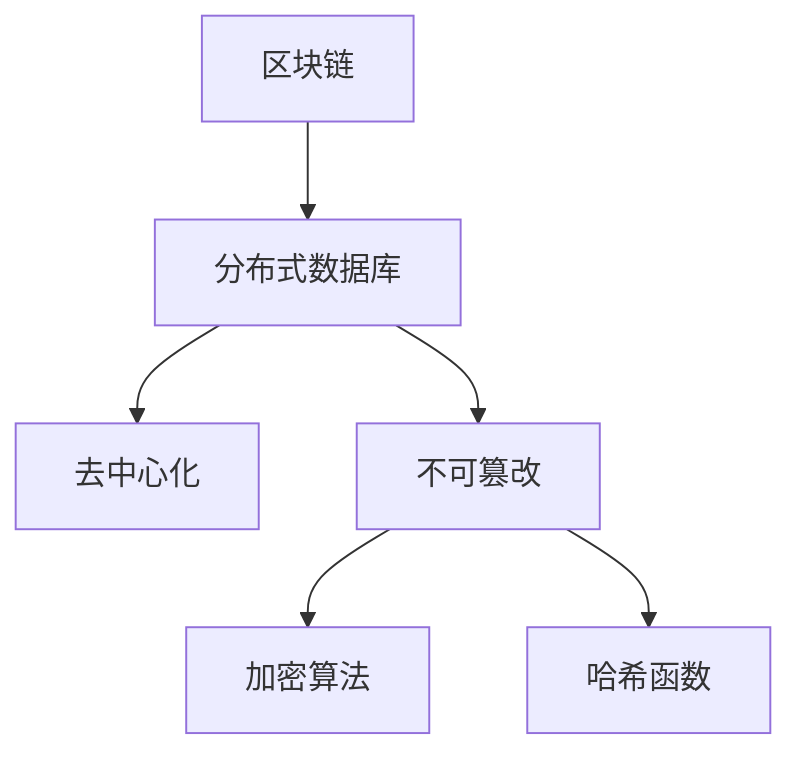
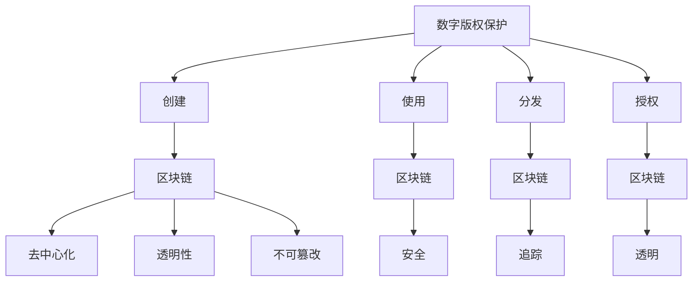
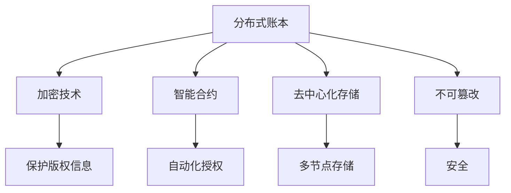

                 

# 区块链技术在数字版权保护中的创新应用

## 关键词
区块链、数字版权保护、加密、智能合约、去中心化、版权追踪、透明性、安全

## 摘要
本文将探讨区块链技术在数字版权保护中的应用。通过详细分析区块链的基本原理和特性，以及其在数字版权保护中的创新应用，我们将揭示区块链如何为版权持有者提供一种更高效、更安全的版权管理方法。文章将涵盖从核心概念到实际应用的各个方面，为读者提供对这一前沿技术的深入理解。

## 1. 背景介绍

### 1.1 目的和范围
本文旨在介绍区块链技术在数字版权保护领域的创新应用，探讨其优势和应用场景，并对未来发展趋势进行展望。文章内容将涵盖区块链的基本原理、数字版权保护的现状和挑战、区块链在版权保护中的实际应用案例，以及相关的数学模型和算法。

### 1.2 预期读者
本篇文章面向对区块链技术和数字版权保护有一定了解的IT专业人士、研究人员和学生。读者应该对基本的计算机科学概念和区块链技术有所了解，以便更好地理解文章的内容。

### 1.3 文档结构概述
本文分为十个部分，首先介绍区块链技术和数字版权保护的基本概念，然后深入分析区块链在版权保护中的具体应用，最后讨论未来发展趋势和挑战，并提供相关的学习资源和工具推荐。

### 1.4 术语表

#### 1.4.1 核心术语定义
- **区块链（Blockchain）**：一种分布式数据库技术，通过加密算法和共识机制确保数据的不可篡改性和透明性。
- **数字版权保护（Digital Copyright Protection）**：防止数字内容被未经授权复制、分发和使用的一系列技术和策略。
- **智能合约（Smart Contract）**：运行在区块链上的自执行合同，其条款和操作条件被编码为计算机程序。
- **去中心化（Decentralization）**：权力和信息分布在整个网络中，而非集中在中央机构。
- **版权追踪（Copyright Tracking）**：跟踪数字内容的创建、分发和授权过程。

#### 1.4.2 相关概念解释
- **加密（Encryption）**：将数据转换为无法解读的形式，只有具备正确密钥的人才能解密。
- **共识机制（Consensus Mechanism）**：网络中的所有节点就数据的一致性达成共识的一种算法。
- **透明性（Transparency）**：区块链上的所有交易都是公开的，可以被任何人验证。

#### 1.4.3 缩略词列表
- **DLP**：数字版权保护
- **BC**：区块链
- **SCP**：智能合约
- **IP**：知识产权

## 2. 核心概念与联系

区块链技术在数字版权保护中的应用，离不开对其基本原理和架构的深入理解。以下将介绍区块链的基本概念及其与数字版权保护之间的联系。

### 2.1 区块链基本概念
区块链是一种分布式数据库技术，其核心特点是去中心化和不可篡改性。区块链上的数据以块的形式存储，每个块包含一定数量的交易记录，并通过加密算法和哈希函数确保数据的安全性和完整性。

#### Mermaid 流程图


### 2.2 数字版权保护与区块链
数字版权保护涉及对数字内容的创建、使用、分发和授权的管理。区块链技术提供了一种新的解决方案，利用其去中心化、透明性和不可篡改的特性，有效解决了数字版权保护中的几个关键问题：

#### Mermaid 流程图


### 2.3 核心概念原理与架构
区块链在数字版权保护中的应用，涉及多个核心概念和架构：

- **分布式账本**：区块链上的每个节点都保存完整的账本副本，确保数据的透明性和不可篡改性。
- **加密技术**：通过加密算法保护版权信息，确保只有授权用户能够访问。
- **智能合约**：实现自动化的版权授权和支付流程，确保交易的透明性和不可篡改性。
- **去中心化存储**：将版权文件存储在多个节点上，防止版权内容被单一节点控制或删除。

#### Mermaid 流程图


## 3. 核心算法原理 & 具体操作步骤

### 3.1 加密算法原理
在区块链技术中，加密算法是确保数据安全的重要手段。以下是常见的加密算法原理：

#### RSA加密算法原理
```plaintext
输入：明文消息m、大素数p、大素数q、公钥e、私钥d
输出：密文c

1. 计算公钥e和私钥d：
   n = p * q
   φ(n) = (p-1) * (q-1)
   e 与 φ(n)互质，计算d，使得 (e * d) ≡ 1 (mod φ(n))

2. 加密：
   c = m^e mod n

3. 解密：
   m = c^d mod n
```

### 3.2 智能合约操作步骤
智能合约是区块链技术在数字版权保护中的核心应用。以下是智能合约的基本操作步骤：

```plaintext
1. 编写智能合约代码，定义版权信息的变量和方法。
2. 将智能合约代码部署到区块链网络中，生成合约地址。
3. 发布版权信息，将版权信息写入区块链。
4. 通过合约方法实现版权的授权、转让和撤回。
5. 触发支付操作，确保授权交易的透明性和安全性。
6. 查询版权信息，验证版权的合法性和授权状态。
```

### 3.3 区块链交易流程
区块链交易是版权信息在区块链上记录和验证的过程。以下是区块链交易的基本流程：

```plaintext
1. 用户发起版权信息上链请求，将版权信息打包成交易。
2. 交易广播到区块链网络，所有节点接收并验证交易。
3. 节点通过共识机制达成一致，将交易记录在区块链上。
4. 交易记录在区块链上永久保存，不可篡改。
5. 用户可以通过区块链查询版权信息，验证版权状态。
```

## 4. 数学模型和公式 & 详细讲解 & 举例说明

### 4.1 密码学公式

#### RSA加密算法中的公式
- 公钥：(n, e)
- 私钥：(n, d)

加密公式：\( c = m^e \mod n \)

解密公式：\( m = c^d \mod n \)

#### 整数分解公式
- 素数分解：\( n = p \times q \)

### 4.2 智能合约中的数学模型

#### 智能合约参数计算

- 合约地址：通过SHA-256哈希算法生成，确保地址的唯一性。
- 权限管理：通过访问控制列表（ACL）实现，定义用户的权限。

```latex
ACL = \{ u_1, u_2, ..., u_n \} \\
权限(u_i, action) = \{ allow, deny \}
```

#### 智能合约执行条件

- 调用合约方法：根据输入参数和权限控制执行相应操作。

```latex
if (权限(用户, 操作) == allow) \\
    执行操作 \\
else \\
    抛出异常
```

### 4.3 举例说明

#### RSA加密算法举例

输入：明文消息 \( m = 123 \)，大素数 \( p = 61 \)，大素数 \( q = 53 \)，公钥 \( e = 17 \)

计算：
- \( n = p \times q = 61 \times 53 = 3233 \)
- \( φ(n) = (p-1) \times (q-1) = 60 \times 52 = 3120 \)
- \( d = 7 \)（通过计算得到，满足 \( e \times d \mod φ(n) = 1 \)）

加密：\( c = m^e \mod n = 123^{17} \mod 3233 = 1559 \)

解密：\( m = c^d \mod n = 1559^7 \mod 3233 = 123 \)

#### 智能合约举例

合约地址：通过SHA-256计算得到 `0x1234567890abcdef1234567890abcdef`

智能合约方法：
- `publishRights`: 发布版权信息
- `authorize`: 授权操作
- `revokeRights`: 撤回版权

权限控制：
- 用户A有权发布和授权版权信息
- 用户B只能查询版权信息

## 5. 项目实战：代码实际案例和详细解释说明

### 5.1 开发环境搭建

在进行区块链技术在数字版权保护中的实际应用开发之前，首先需要搭建一个适合的开发环境。以下是搭建环境的步骤：

1. 安装Go语言开发环境：Go语言是一种适用于区块链开发的语言，具有高效的性能和简单的语法。
   ```bash
   sudo apt-get install golang-go
   ```

2. 安装Node.js和npm：Node.js是一个基于Chrome V8引擎的JavaScript运行环境，用于前端开发。npm是Node.js的包管理器。
   ```bash
   sudo apt-get install nodejs
   sudo apt-get install npm
   ```

3. 安装区块链框架：以Ethereum为例，Ethereum是一个流行的区块链框架，支持智能合约的开发和部署。
   ```bash
   npm install -g solc
   npm install -g truffle
   ```

4. 创建项目文件夹：在本地创建一个项目文件夹，用于存放所有代码和配置文件。
   ```bash
   mkdir blockchain-digital-copyright
   cd blockchain-digital-copyright
   ```

5. 配置版本控制系统：使用Git进行版本控制和协作开发。
   ```bash
   git init
   ```

### 5.2 源代码详细实现和代码解读

以下是一个简单的Ethereum智能合约示例，用于实现数字版权保护的基本功能。

```solidity
// SPDX-License-Identifier: MIT
pragma solidity ^0.8.0;

contract DigitalCopyright {

    // 定义版权信息结构体
    struct Copyright {
        string title;
        string author;
        address owner;
        mapping(address => bool) authorizedUsers;
    }

    // 存储所有版权信息
    mapping(string => Copyright) public copyrights;

    // 添加版权信息
    function addCopyright(string memory _title, string memory _author) public {
        copyrights[_title] = Copyright({
            title: _title,
            author: _author,
            owner: msg.sender,
            authorizedUsers: mapping(address => bool)
        });
    }

    // 授权用户
    function authorizeUser(string memory _title, address _user) public {
        require(msg.sender == copyrights[_title].owner, "Only the owner can authorize users");
        copyrights[_title].authorizedUsers[_user] = true;
    }

    // 撤回授权
    function revokeAuthorization(string memory _title, address _user) public {
        require(msg.sender == copyrights[_title].owner, "Only the owner can revoke authorizations");
        copyrights[_title].authorizedUsers[_user] = false;
    }

    // 查询版权信息
    function getCopyrightInfo(string memory _title) public view returns (string memory, string memory, address, mapping(address => bool) memory) {
        return (copyrights[_title].title, copyrights[_title].author, copyrights[_title].owner, copyrights[_title].authorizedUsers);
    }
}
```

#### 代码解读与分析

1. **版权信息结构体**：`Copyright` 结构体用于存储版权的基本信息，包括标题、作者、版权所有者以及授权用户列表。

2. **版权信息添加**：`addCopyright` 函数允许版权所有者添加新的版权信息到区块链。

3. **授权用户**：`authorizeUser` 函数允许版权所有者将特定用户的授权标记设置为真，从而允许用户访问或操作相关版权信息。

4. **撤回授权**：`revokeAuthorization` 函数允许版权所有者将特定用户的授权标记设置为假，从而撤销其访问权限。

5. **查询版权信息**：`getCopyrightInfo` 函数允许任何用户查询特定版权信息，包括标题、作者、所有者和授权用户列表。

### 5.3 代码解读与分析

1. **权限控制**：在智能合约中，权限控制是确保安全性和合法性的重要机制。通过要求调用者必须是版权所有者，确保了授权和撤销授权操作的合法性。

2. **数据结构**：使用`mapping`数据结构存储授权用户列表，使得快速查询和更新授权状态成为可能。

3. **安全性**：智能合约使用以太坊的Solidity语言编写，通过编译器进行静态分析，以确保代码的安全性和正确性。

4. **可扩展性**：尽管此示例智能合约仅实现了基本功能，但可以通过扩展版权信息结构体和增加新的方法来支持更复杂的版权管理需求。

## 6. 实际应用场景

区块链技术在数字版权保护中的实际应用场景广泛，以下列举几个典型的应用实例：

### 6.1 音乐版权管理
音乐版权管理是区块链技术在数字版权保护中最早且最常见的应用之一。通过区块链技术，音乐创作者可以轻松地管理其作品的版权信息，确保其版权得到有效保护。例如，一个基于区块链的音乐平台可以自动记录每次音乐播放、下载和分享的行为，从而确保音乐版权持有者获得应得的收益。

### 6.2 文学作品版权管理
文学作品版权保护同样面临诸多挑战，如版权纠纷、侵权盗版等。区块链技术可以提供一种透明、不可篡改的版权登记和管理方法。作家可以通过智能合约与出版社、图书馆和其他利益相关者建立版权关系，实现自动化授权和支付。

### 6.3 影视版权管理
随着流媒体服务的兴起，影视版权管理变得更加复杂。区块链技术可以帮助制片方和版权持有者确保其作品在分发过程中不被非法复制和传播。例如，通过智能合约和加密技术，电影可以在流媒体平台上进行安全的发布和授权。

### 6.4 艺术品版权认证
艺术品版权认证是另一个重要的应用场景。区块链可以提供一种透明、可靠的认证方式，确保艺术品的所有权和历史记录得到记录和保护。艺术家和收藏家可以轻松验证艺术品的真实性和合法性，防止伪造和篡改。

### 6.5 跨境版权交易
区块链技术还可以促进跨境版权交易。通过区块链，版权持有者可以轻松地与全球范围内的合作伙伴进行版权交易，减少中介环节，提高交易效率和透明度。此外，区块链上的智能合约可以实现自动化的支付和结算，降低交易成本。

## 7. 工具和资源推荐

### 7.1 学习资源推荐

#### 7.1.1 书籍推荐
- 《精通区块链：核心技术、架构和应用》
- 《区块链革命：颠覆传统行业的新技术》
- 《数字版权保护：法律、技术和策略》

#### 7.1.2 在线课程
- Coursera上的《区块链技术基础》
- Udacity的《区块链工程师》
- edX上的《智能合约与区块链开发》

#### 7.1.3 技术博客和网站
- Medium上的《区块链与数字版权保护》
- Bitcoin.com的《数字版权保护与区块链技术》
- CoinDesk的《区块链技术与应用》

### 7.2 开发工具框架推荐

#### 7.2.1 IDE和编辑器
- Visual Studio Code
- Eclipse
- IntelliJ IDEA

#### 7.2.2 调试和性能分析工具
- Remix IDE：适用于Solidity合约的在线IDE。
- Truffle：用于智能合约开发和测试的框架。
- Ganache：一个本地以太坊节点，用于测试智能合约。

#### 7.2.3 相关框架和库
- Web3.js：用于与以太坊区块链交互的JavaScript库。
- Solidity：用于编写以太坊智能合约的高级编程语言。
- Truffle Suite：提供智能合约开发、测试和部署的工具集。

### 7.3 相关论文著作推荐

#### 7.3.1 经典论文
- 《区块链：一个分布式数据库的视角》
- 《智能合约：去中心化应用的安全基础》
- 《数字版权保护：区块链技术的应用》

#### 7.3.2 最新研究成果
- 《区块链技术在版权保护中的应用研究》
- 《基于区块链的数字版权管理解决方案》
- 《区块链与人工智能在版权保护中的协同应用》

#### 7.3.3 应用案例分析
- 《区块链技术在音乐版权管理中的应用》
- 《区块链在艺术品市场中的实践与探索》
- 《区块链在电子书版权保护中的应用案例》

## 8. 总结：未来发展趋势与挑战

区块链技术在数字版权保护领域的应用正处于快速发展阶段。随着技术的不断成熟和应用场景的不断扩大，区块链有望成为数字版权管理的重要工具。以下是一些未来发展趋势和挑战：

### 8.1 发展趋势
- **去中心化版权管理**：区块链技术的去中心化特性将使得版权管理更加透明、公正，减少传统版权管理中的中介环节。
- **智能合约自动化**：智能合约将进一步普及，实现版权的自动化授权、支付和纠纷解决，提高管理效率。
- **版权保护技术的整合**：区块链技术将与人工智能、大数据等前沿技术相结合，提供更加智能化、高效的版权保护解决方案。
- **跨境版权交易**：区块链技术将为全球范围内的版权交易提供便捷、安全的平台，促进全球文化产业的繁荣。

### 8.2 挑战
- **技术成熟度**：区块链技术尚处于发展初期，其性能、稳定性等方面仍需进一步提升。
- **法律和监管**：数字版权保护涉及复杂的法律和监管问题，需要法律法规的完善和监管体系的建立。
- **用户接受度**：区块链技术在普通用户中的普及度较低，需要加强用户教育和引导。
- **技术安全性**：区块链系统面临多种安全威胁，需要持续改进和加强安全措施。

## 9. 附录：常见问题与解答

### 9.1 区块链技术在数字版权保护中的优势是什么？
- **去中心化**：减少了传统版权管理中的中介环节，提高了透明度和公正性。
- **不可篡改性**：确保了版权信息的真实性和完整性。
- **自动化**：智能合约实现了版权的自动化授权、支付和纠纷解决。

### 9.2 区块链技术在数字版权保护中的挑战有哪些？
- **技术成熟度**：区块链技术尚处于发展初期，性能和稳定性需提升。
- **法律和监管**：缺乏完善的法律法规和监管体系。
- **用户接受度**：普通用户对区块链技术的接受度较低。
- **安全性**：面临多种安全威胁，需加强安全措施。

### 9.3 如何在区块链上实现数字版权保护？
- **版权信息登记**：将版权信息登记在区块链上，确保其不可篡改性。
- **智能合约应用**：通过智能合约实现版权的授权、支付和纠纷解决。
- **加密技术**：使用加密技术保护版权信息的安全。

## 10. 扩展阅读 & 参考资料

- 《区块链：从数字货币到分布式数据库》
- 《智能合约：设计与实现》
- 《数字版权保护：法律、技术和策略》

### 参考资料
- Ethereum官网：[https://ethereum.org/](https://ethereum.org/)
- Bitcoin.com：[https://www.bitcoin.com/](https://www.bitcoin.com/)
- CoinDesk：[https://www.coindesk.com/](https://www.coindesk.com/)

## 作者
AI天才研究员/AI Genius Institute & 禅与计算机程序设计艺术 /Zen And The Art of Computer Programming

