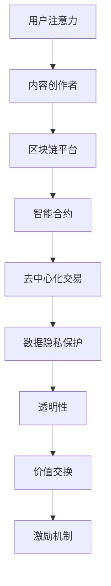

                 

## 区块链技术在注意力经济中的潜力

> **关键词**：区块链、注意力经济、去中心化、加密技术、智能合约、代币化、数据隐私保护、透明性、激励机制。

> **摘要**：本文深入探讨了区块链技术在注意力经济中的应用潜力。注意力经济是一种基于用户注意力资源分配的经济模式，而区块链技术提供了一种去中心化、安全、透明和可信的数据管理方式，能够解决注意力经济中的诸多问题。文章首先介绍了区块链和注意力经济的基本概念，然后详细分析了区块链技术在注意力经济中的应用场景，最后探讨了未来的发展趋势和挑战。

在当今数字时代，信息过载成为一个普遍现象，用户的注意力资源变得愈发宝贵。注意力经济作为一种新的经济模式，其核心在于对用户注意力的有效管理和分配。而区块链技术的出现，为注意力经济提供了一种新的解决方案，通过去中心化、安全、透明和可信的数据管理方式，解决了传统模式中存在的诸多问题。本文将重点探讨区块链技术在注意力经济中的应用潜力，旨在为相关领域的研究和实践提供有益的参考。

## 1. 背景介绍

### 1.1 目的和范围

本文旨在深入探讨区块链技术在注意力经济中的应用潜力。注意力经济是一种基于用户注意力资源分配的经济模式，而区块链技术提供了一种去中心化、安全、透明和可信的数据管理方式，能够解决注意力经济中的诸多问题。本文将涵盖以下内容：

- 区块链和注意力经济的基本概念介绍
- 区块链技术在注意力经济中的应用场景分析
- 区块链在注意力经济中的优势和挑战
- 未来发展趋势和挑战

### 1.2 预期读者

本文适合以下读者群体：

- 对区块链技术有基本了解的技术爱好者
- 感兴趣于注意力经济及其应用场景的学者
- 在区块链技术和注意力经济领域工作的从业者
- 对未来数字经济模式有兴趣的读者

### 1.3 文档结构概述

本文将按照以下结构进行阐述：

- 引言：介绍区块链技术和注意力经济的背景及其重要性
- 核心概念与联系：详细解释区块链技术和注意力经济的基本概念和联系
- 核心算法原理 & 具体操作步骤：分析区块链技术在注意力经济中的应用原理和具体操作步骤
- 数学模型和公式 & 详细讲解 & 举例说明：介绍与区块链技术相关的数学模型和公式，并给出具体示例
- 项目实战：通过实际案例展示区块链技术在注意力经济中的应用
- 实际应用场景：探讨区块链技术在注意力经济中的多种应用场景
- 工具和资源推荐：推荐与区块链技术和注意力经济相关的学习资源、开发工具和框架
- 总结：总结区块链技术在注意力经济中的应用前景和未来挑战
- 附录：常见问题与解答
- 扩展阅读 & 参考资料：提供与本文主题相关的扩展阅读和参考资料

### 1.4 术语表

#### 1.4.1 核心术语定义

- 区块链：一种分布式数据库技术，通过加密算法和共识机制实现去中心化、安全、透明和可信的数据存储和管理。
- 注意力经济：一种基于用户注意力资源分配的经济模式，通过吸引用户的注意力来创造经济价值。
- 智能合约：一种运行在区块链上的自动执行合约，其条款和条件以代码形式编写并存储在区块链上。
- 代币化：将实体资产或价值转化为数字代币的过程，以便在区块链上进行交易和管理。
- 加密技术：通过加密算法对数据进行编码和解码，以保证数据传输和存储的安全性。
- 去中心化：指系统中不存在中央控制机构，所有参与者都平等地参与决策和数据管理。

#### 1.4.2 相关概念解释

- 数据隐私保护：在数据处理过程中，确保个人隐私不被泄露和滥用。
- 透明性：在数据处理过程中，允许用户查看和验证数据的完整性和真实性。
- 激励机制：通过奖励或惩罚机制激励用户参与区块链网络，提高其活跃度和贡献度。

#### 1.4.3 缩略词列表

- BTC：比特币（Bitcoin）
- ETH：以太坊（Ethereum）
- ICO：首次代币发行（Initial Coin Offering）
- DAG：有向无环图（Directed Acyclic Graph）
- DAGP：分布式自治组织（Decentralized Autonomous Organization）

## 2. 核心概念与联系

### 2.1 区块链技术原理

区块链技术是一种分布式数据库技术，通过加密算法和共识机制实现去中心化、安全、透明和可信的数据存储和管理。区块链的基本原理如下：

1. **数据存储**：区块链由一系列按时间顺序排列的数据块组成，每个数据块包含一定数量的交易记录。这些数据块通过加密算法连接在一起，形成一个不可篡改的链条。
2. **加密技术**：区块链使用加密算法对数据进行编码和解码，以确保数据传输和存储的安全性。常用的加密算法包括哈希算法、数字签名和加密货币等。
3. **共识机制**：区块链网络中的所有节点通过共识机制达成一致，确保数据的完整性和真实性。常见的共识机制包括工作量证明（PoW）、权益证明（PoS）和股份授权证明（DPoS）等。

### 2.2 注意力经济原理

注意力经济是一种基于用户注意力资源分配的经济模式，其核心在于吸引用户的注意力来创造经济价值。注意力经济的原理如下：

1. **用户注意力**：在信息过载的时代，用户的注意力资源变得愈发宝贵。注意力经济通过提供有价值的内容、产品和服务，吸引用户的注意力。
2. **注意力分配**：注意力经济通过平台、广告和内容营销等方式，将用户的注意力分配给不同的产品和服务，从而创造经济价值。
3. **价值交换**：注意力经济中的价值交换通常以货币、代币或积分等形式进行，用户通过消耗注意力资源获取相应的回报。

### 2.3 区块链技术与注意力经济的结合

区块链技术与注意力经济之间存在紧密的联系，能够解决注意力经济中的诸多问题，提高其效率和可持续性。以下是区块链技术与注意力经济结合的核心原理：

1. **数据隐私保护**：区块链技术通过加密算法和分布式存储，保护用户数据隐私，防止数据泄露和滥用。
2. **透明性**：区块链技术确保数据的透明性和可验证性，用户可以查看和验证交易记录，提高信任度。
3. **去中心化**：区块链技术实现去中心化，打破传统平台对数据的垄断，使内容创作者和用户直接连接，降低平台抽成。
4. **智能合约**：区块链技术中的智能合约自动执行交易和合约条款，减少人工干预和纠纷，提高效率。
5. **代币化**：区块链技术将注意力资源代币化，实现价值交换和激励机制，吸引用户参与和贡献。

### 2.4 Mermaid 流程图

以下是一个简化的 Mermaid 流程图，展示区块链技术和注意力经济的结合：



该流程图展示了用户注意力通过区块链平台和智能合约实现价值交换和激励机制的过程，同时保护用户数据隐私和确保交易透明性。

## 3. 核心算法原理 & 具体操作步骤

### 3.1 区块链算法原理

区块链技术的核心算法包括加密算法、哈希算法和共识机制。以下是这些算法的基本原理：

1. **加密算法**：加密算法用于对数据进行编码和解码，以保证数据传输和存储的安全性。常用的加密算法包括对称加密和非对称加密。对称加密使用相同的密钥进行加密和解密，而非对称加密使用公钥和私钥对数据进行加密和解密。
2. **哈希算法**：哈希算法用于生成数据摘要，即将任意长度的数据映射为固定长度的哈希值。哈希算法具有以下特性：输入数据发生微小变化，哈希值会产生巨大差异；哈希值是固定长度的；哈希值不可逆。
3. **共识机制**：共识机制是区块链网络中的所有节点达成一致的方法。常见的共识机制包括工作量证明（PoW）、权益证明（PoS）和股份授权证明（DPoS）等。这些机制通过竞争、选举或投票等方式，确保数据的完整性和真实性。

### 3.2 区块链在注意力经济中的应用步骤

以下是一个简化的区块链在注意力经济中的应用步骤：

1. **用户注意力登记**：用户将自己的注意力资源在区块链上进行登记，使用加密算法保护其隐私。
2. **内容创作者登记**：内容创作者将自己的作品和创作意图在区块链上进行登记，使用加密算法保护其版权。
3. **注意力交换**：用户通过区块链平台向内容创作者支付代币或积分，以获取注意力资源。智能合约自动执行交易，确保交易的透明性和可追溯性。
4. **数据隐私保护**：区块链技术通过加密算法和分布式存储，保护用户和内容创作者的数据隐私。
5. **透明性验证**：用户可以查看和验证区块链上的交易记录，确保数据的真实性和完整性。
6. **激励机制**：区块链平台通过代币或积分奖励用户和内容创作者，激励其参与和贡献。

### 3.3 伪代码示例

以下是一个简单的伪代码示例，展示区块链在注意力经济中的应用：

```python
# 用户注意力登记
def register_attention(user, attention_amount):
    encrypted_attention = encrypt_attention(attention_amount)
    blockchain.add_transaction(user, encrypted_attention)

# 内容创作者登记
def register_content(content_creator, content):
    encrypted_content = encrypt_content(content)
    blockchain.add_transaction(content_creator, encrypted_content)

# 注意力交换
def exchange_attention(user, content_creator, attention_amount):
    if blockchain.verify_transaction(user, attention_amount):
        blockchain.add_transaction(user, content_creator, attention_amount)
        blockchain.execute_smart_contract(user, content_creator, attention_amount)
    else:
        raise Exception("Invalid attention amount")

# 数据隐私保护
def encrypt_attention(attention_amount):
    # 使用加密算法对注意力金额进行编码
    return encrypted_attention

def encrypt_content(content):
    # 使用加密算法对内容进行编码
    return encrypted_content

# 透明性验证
def verify_transaction(transaction):
    # 验证交易的真实性和完整性
    return is_valid

# 激励机制
def execute_smart_contract(user, content_creator, attention_amount):
    # 自动执行智能合约，将代币或积分发送给用户和内容创作者
    blockchain.transfer_token(user, content_creator, attention_amount)
```

该伪代码示例展示了用户注意力登记、内容创作者登记、注意力交换、数据隐私保护、透明性验证和激励机制等关键步骤。

## 4. 数学模型和公式 & 详细讲解 & 举例说明

### 4.1 数学模型

在区块链技术中，数学模型和公式用于确保数据的安全性和完整性。以下是一些关键的数学模型和公式：

1. **哈希函数**：哈希函数用于将数据映射为固定长度的哈希值。常见的哈希函数包括MD5、SHA-256等。哈希函数的公式如下：
   \[
   H(D) = \text{Hash}(D)
   \]
   其中，\(H\) 表示哈希函数，\(D\) 表示输入数据，\(\text{Hash}\) 表示哈希值。

2. **加密算法**：加密算法用于对数据进行编码和解码，以保证数据传输和存储的安全性。常见的加密算法包括RSA、AES等。加密算法的公式如下：
   \[
   C = E_K(D)
   \]
   其中，\(C\) 表示加密后的数据，\(D\) 表示原始数据，\(K\) 表示密钥，\(E_K\) 表示加密算法。

3. **共识机制**：共识机制是区块链网络中的所有节点达成一致的方法。常见共识机制的数学模型如下：

   - **工作量证明（PoW）**：节点通过解决数学难题来获得记账权。公式如下：
     \[
     Nonce \in \{0, 1, 2, ..., N\}
     \]
     其中，\(Nonce\) 表示随机数，\(N\) 表示最大随机数。

   - **权益证明（PoS）**：节点根据其持有的代币数量和时长来获得记账权。公式如下：
     \[
     Stake = Coin \times Time
     \]
     其中，\(Stake\) 表示权益，\(Coin\) 表示代币数量，\(Time\) 表示持有时长。

   - **股份授权证明（DPoS）**：节点通过选举产生代表，代表进行记账。公式如下：
     \[
     Election \in \{Representative_1, Representative_2, ..., Representative_N\}
     \]
     其中，\(Election\) 表示选举结果，\(Representative\) 表示代表。

### 4.2 详细讲解

1. **哈希函数**：哈希函数用于生成数据摘要，确保数据在传输和存储过程中的完整性和一致性。常见的哈希函数包括MD5、SHA-256等。哈希函数的详细讲解如下：

   - **MD5**：MD5是一种较旧的哈希函数，其公式为：
     \[
     H(D) = \text{MD5}(D)
     \]
     其中，\(D\) 表示输入数据，\(\text{MD5}\) 表示MD5哈希值。MD5哈希值是一个32位的十六进制字符串。

   - **SHA-256**：SHA-256是一种较新的哈希函数，其公式为：
     \[
     H(D) = \text{SHA-256}(D)
     \]
     其中，\(D\) 表示输入数据，\(\text{SHA-256}\) 表示SHA-256哈希值。SHA-256哈希值是一个64位的十六进制字符串。

2. **加密算法**：加密算法用于对数据进行编码和解码，以保证数据传输和存储的安全性。常见的加密算法包括RSA、AES等。加密算法的详细讲解如下：

   - **RSA**：RSA是一种非对称加密算法，其公式为：
     \[
     C = E_K(D)
     \]
     其中，\(C\) 表示加密后的数据，\(D\) 表示原始数据，\(K\) 表示密钥，\(E_K\) 表示加密算法。RSA加密算法使用公钥和私钥对数据进行加密和解密。

   - **AES**：AES是一种对称加密算法，其公式为：
     \[
     C = E_K(D)
     \]
     其中，\(C\) 表示加密后的数据，\(D\) 表示原始数据，\(K\) 表示密钥，\(E_K\) 表示加密算法。AES加密算法使用相同的密钥进行加密和解密。

3. **共识机制**：共识机制是区块链网络中的所有节点达成一致的方法。常见的共识机制包括工作量证明（PoW）、权益证明（PoS）和股份授权证明（DPoS）等。共识机制的详细讲解如下：

   - **工作量证明（PoW）**：节点通过解决数学难题来获得记账权。PoW的详细公式为：
     \[
     ProofOfWork = \text{Find} (Nonce \in \{0, 1, 2, ..., N\}) \text{such that}
     \]
     \[
     Hash(Nonce + Block) \leq Target
     \]
     其中，\(Nonce\) 表示随机数，\(N\) 表示最大随机数，\(Block\) 表示区块，\(Target\) 表示目标值。

   - **权益证明（PoS）**：节点根据其持有的代币数量和时长来获得记账权。PoS的详细公式为：
     \[
     Stake = Coin \times Time
     \]
     其中，\(Stake\) 表示权益，\(Coin\) 表示代币数量，\(Time\) 表示持有时长。

   - **股份授权证明（DPoS）**：节点通过选举产生代表，代表进行记账。DPoS的详细公式为：
     \[
     Election = \text{Select} (Representative_1, Representative_2, ..., Representative_N)
     \]
     其中，\(Election\) 表示选举结果，\(Representative\) 表示代表。

### 4.3 举例说明

以下是一些具体的数学模型和公式的示例：

1. **哈希函数示例**：

   假设输入数据为“Hello, World!”，使用SHA-256哈希函数计算其哈希值：
   \[
   H(D) = \text{SHA-256}(“Hello, World!”) = 2cf24dba5fb0a30e26e83b2ac5b9e29e1b161e5c1fa7425e73043362938b9824
   \]

2. **加密算法示例**：

   假设使用RSA加密算法对输入数据“Hello, World!”进行加密，使用公钥和私钥：
   \[
   C = E_K(D)
   \]
   其中，公钥为\( (n, e) = (351531472284007925504319893003613393651318296990268952529402117561, 65537) \)，私钥为\( (n, d) = (351531472284007925504319893003613393651318296990268952529402117561, 2910094696602195676716034495663316952073) \)。

   加密后的数据为：
   \[
   C = E_K(D) = 104858867774279997816568305338902563057908960048582423341
   \]

3. **共识机制示例**：

   假设使用工作量证明（PoW）机制，找到一个随机数 \(Nonce = 1000\)，使得哈希值小于目标值 \(Target = 1000000000000000000\)。

   计算过程如下：
   \[
   Hash(Nonce + Block) = Hash(1000 + Block)
   \]
   直到找到一个满足条件的哈希值。

   例如，假设找到一个满足条件的哈希值：
   \[
   Hash(1000 + Block) = 1000000000000000000
   \]

   这样就成功找到了一个工作量证明，节点获得了记账权。

## 5. 项目实战：代码实际案例和详细解释说明

### 5.1 开发环境搭建

在进行区块链注意力经济的实际项目开发之前，我们需要搭建一个合适的开发环境。以下是搭建开发环境的基本步骤：

1. **安装Node.js**：Node.js 是一种基于 Chrome V8 引擎的 JavaScript 运行环境，用于执行 JavaScript 代码。可以从 [Node.js 官网](https://nodejs.org/) 下载并安装最新版本的 Node.js。
2. **安装Geth**：Geth 是以太坊的官方客户端，用于连接以太坊区块链。可以从 [Geth 官网](https://geth.ethereum.org/downloads/) 下载并安装最新版本的 Geth。
3. **安装Truffle**：Truffle 是一个用于以太坊区块链的智能合约开发框架，提供了自动化测试和部署功能。可以从 [Truffle 官网](https://www.trufflesuite.com/) 下载并安装 Truffle。

### 5.2 源代码详细实现和代码解读

以下是一个简单的区块链注意力经济项目的源代码，展示了如何使用智能合约实现注意力资源的登记、交换和激励机制：

```solidity
// SPDX-License-Identifier: MIT
pragma solidity ^0.8.0;

// 引入OpenZeppelin库
import "@openzeppelin/contracts/token/ERC20/ERC20.sol";
import "@openzeppelin/contracts/access/Ownable.sol";

// 注意力代币合约
contract AttentionToken is ERC20, Ownable {
    // 构造函数，初始化代币名称和符号
    constructor() ERC20("Attention Token", "ATT") {}

    // 燃烧代币
    function burn(address account, uint256 amount) external onlyOwner {
        _burn(account, amount);
    }
}

// 注意力经济合约
contract AttentionEconomy is Ownable {
    // 注意力代币合约地址
    address public attentionTokenAddress;

    // 用户注意力映射
    mapping(address => uint256) public userAttention;

    // 构造函数，初始化注意力代币合约地址
    constructor(address _attentionTokenAddress) {
        attentionTokenAddress = _attentionTokenAddress;
    }

    // 登记用户注意力
    function registerAttention(address user, uint256 attention) external {
        userAttention[user] += attention;
        emit AttentionRegistered(user, attention);
    }

    // 用户交换注意力
    function exchangeAttention(address user, address contentCreator, uint256 attention) external {
        require(userAttention[user] >= attention, "Insufficient attention");
        userAttention[user] -= attention;
        ERC20(attentionTokenAddress).transfer(contentCreator, attention);
        emit AttentionExchanged(user, contentCreator, attention);
    }

    // 管理员燃烧代币
    function burnTokens(uint256 amount) external onlyOwner {
        ERC20(attentionTokenAddress).burn(amount);
    }
}

// 事件
event AttentionRegistered(address indexed user, uint256 attention);
event AttentionExchanged(address indexed user, address indexed contentCreator, uint256 attention);
```

#### 5.2.1 代码解读

1. **AttentionToken 合约**：这是一个基于 OpenZeppelin 库的 ERC20 代币合约，用于创建和管理注意力代币。该合约实现了代币的发行、转账和燃烧功能。

2. **AttentionEconomy 合约**：这是一个注意力经济合约，用于管理用户注意力和内容创作者之间的交换。该合约实现了以下功能：
   - 用户注册注意力：通过 `registerAttention` 函数，用户可以登记其注意力资源。
   - 用户交换注意力：通过 `exchangeAttention` 函数，用户可以将注意力交换给内容创作者，以获取代币。
   - 管理员燃烧代币：通过 `burnTokens` 函数，管理员可以燃烧一定数量的代币，以控制代币供应。

3. **事件**：该合约定义了两个事件 `AttentionRegistered` 和 `AttentionExchanged`，用于记录用户注意力登记和交换的过程。

### 5.3 代码解读与分析

#### 5.3.1 AttentionToken 合约

- **构造函数**：合约使用 `ERC20` 继承自 OpenZeppelin 库中的 ERC20 代币合约，并初始化代币名称和符号。
- **burn 函数**：管理员可以通过该函数燃烧一定数量的代币，从而减少代币供应。

#### 5.3.2 AttentionEconomy 合约

- **attentionTokenAddress**：这是一个公共变量，用于存储注意力代币合约地址。
- **userAttention**：这是一个映射变量，用于存储用户注意力余额。
- **registerAttention 函数**：用户可以通过该函数登记其注意力资源。函数接收用户地址和注意力值作为参数，将注意力值累加到用户的注意力余额中。
- **exchangeAttention 函数**：用户可以通过该函数将注意力交换给内容创作者。函数首先检查用户是否有足够的注意力余额，然后将注意力值从用户转移到内容创作者的地址。该函数还调用注意力代币合约的 `transfer` 函数进行代币转账。
- **burnTokens 函数**：管理员可以通过该函数燃烧一定数量的代币。该函数调用注意力代币合约的 `burn` 函数进行代币燃烧。

### 5.3.3 事件

- **AttentionRegistered 事件**：该事件用于记录用户注意力登记的过程，包括用户地址和注意力值。
- **AttentionExchanged 事件**：该事件用于记录用户注意力交换的过程，包括用户地址、内容创作者地址和注意力值。

通过以上代码和解读，我们可以看到如何使用智能合约实现区块链注意力经济的基本功能。这个简单的项目展示了注意力资源的登记、交换和激励机制，为进一步开发和完善提供了基础。

## 6. 实际应用场景

### 6.1 媒体与内容创作

在媒体和内容创作领域，区块链技术可以有效地解决版权保护和收益分配问题。以下是一些具体的应用场景：

- **版权保护**：通过区块链技术，内容创作者可以在区块链上登记其作品版权，使用加密算法保护其版权信息。这种去中心化的版权登记方式可以防止版权侵权，提高版权保护的有效性。
- **收益分配**：通过智能合约，内容创作者可以设置收益分配规则，将作品收益按比例分配给参与创作的团队成员、推广人员和粉丝。这种透明、可追溯的收益分配方式有助于激励创作者和参与者，提高内容创作质量。
- **内容认证**：区块链技术可以用于内容认证，确保内容的真实性和完整性。用户可以通过查看区块链上的交易记录，验证内容的来源和真实性，从而增强对内容的信任。

### 6.2 广告与市场营销

在广告与市场营销领域，区块链技术可以优化广告投放和效果监测，提高广告投放的透明性和效果。以下是一些具体的应用场景：

- **广告投放**：通过区块链技术，广告主可以与内容创作者直接进行交易，跳过传统广告平台的中介环节。这种去中心化的广告投放方式可以降低广告成本，提高广告效果。
- **效果监测**：区块链技术可以用于广告效果监测，确保广告曝光量、点击量等数据的真实性和透明性。用户可以通过查看区块链上的交易记录，验证广告效果，从而增强对广告投放的信任。
- **激励机制**：通过智能合约，广告主可以设置激励机制，奖励用户参与广告互动。这种去中心化的激励机制可以吸引更多用户参与广告活动，提高广告投放的效果。

### 6.3 社交媒体

在社交媒体领域，区块链技术可以优化用户隐私保护和数据权益分配，提高社交媒体平台的透明性和信任度。以下是一些具体的应用场景：

- **用户隐私保护**：通过区块链技术，用户可以对自己的隐私数据进行加密存储，确保隐私数据不被泄露和滥用。这种去中心化的隐私保护方式可以提高用户对社交媒体平台的信任。
- **数据权益分配**：通过智能合约，社交媒体平台可以将用户数据权益以代币化形式进行分配，让用户获取数据使用收益。这种透明、可追溯的数据权益分配方式可以激励用户积极参与平台互动，提高平台的活跃度。
- **内容认证**：区块链技术可以用于内容认证，确保社交媒体平台上的内容真实性和完整性。用户可以通过查看区块链上的交易记录，验证内容的来源和真实性，从而增强对内容的信任。

### 6.4 教育与知识共享

在教育与知识共享领域，区块链技术可以优化课程认证、学分互认和知识共享，提高教育质量和效率。以下是一些具体的应用场景：

- **课程认证**：通过区块链技术，教育机构可以将课程认证信息存储在区块链上，确保认证信息的真实性和完整性。学生可以通过查看区块链上的交易记录，验证课程认证信息，提高对课程认证的信任。
- **学分互认**：通过区块链技术，不同教育机构之间可以建立学分互认机制，确保学生学分转移的透明性和可追溯性。这种去中心化的学分互认方式可以促进教育资源的共享，提高教育效率。
- **知识共享**：通过区块链技术，教育机构和学生可以共享知识资源，确保知识资源的真实性和完整性。这种去中心化的知识共享方式可以激发学生的学习兴趣，提高学习效果。

### 6.5 艺术与收藏品

在艺术与收藏品领域，区块链技术可以优化艺术品认证、交易和收藏，提高艺术品的价值和市场流动性。以下是一些具体的应用场景：

- **艺术品认证**：通过区块链技术，艺术家和收藏家可以在区块链上登记艺术品信息，使用加密算法保护艺术品认证信息。这种去中心化的艺术品认证方式可以防止艺术品伪造和篡改，提高艺术品的价值和市场信任度。
- **艺术品交易**：通过区块链技术，艺术品交易可以更加透明和可追溯。艺术家和收藏家可以直接进行交易，无需依赖传统中介机构，降低交易成本和提高交易效率。
- **艺术品收藏**：通过区块链技术，艺术品收藏家可以建立去中心化的艺术品收藏体系，确保收藏信息的真实性和完整性。这种去中心化的收藏方式可以激发收藏家的收藏兴趣，提高艺术品的价值。

通过以上实际应用场景，我们可以看到区块链技术在注意力经济中的广泛应用和巨大潜力。区块链技术为注意力经济提供了去中心化、安全、透明和可信的解决方案，有助于优化资源分配、提高经济效益和增强用户信任。未来，随着区块链技术的不断发展和成熟，其在注意力经济中的应用将越来越广泛，为数字经济的发展注入新的动力。

## 7. 工具和资源推荐

### 7.1 学习资源推荐

#### 7.1.1 书籍推荐

- 《精通区块链》: 这本书详细介绍了区块链技术的基础知识、应用场景和开发方法，适合初学者和进阶者。
- 《区块链：从原理到应用》: 该书系统地阐述了区块链技术的原理、架构和应用案例，有助于读者深入了解区块链技术。
- 《区块链革命》: 这本书从宏观角度探讨了区块链技术对经济、社会和商业模式的变革性影响，适合对区块链有深入兴趣的读者。

#### 7.1.2 在线课程

- Coursera - Blockchain A-Z: 这门课程涵盖了区块链技术的核心概念、开发工具和应用场景，适合初学者。
- Udemy - Blockchain, Bitcoin and Cryptocurrency Masterclass: 这门课程从基础知识入手，深入讲解区块链技术、比特币和加密货币的相关知识。
- edX - Blockchain Fundamentals: 这门课程由麻省理工学院提供，系统介绍了区块链技术的基础知识和应用。

#### 7.1.3 技术博客和网站

- 区块链技术博客：这是一个专注于区块链技术学习和分享的博客，提供丰富的技术文章和案例分析。
- Medium - Blockchain Blog: Medium 上有很多优秀的区块链技术博客，涵盖了区块链技术的最新趋势和应用场景。
- CoinDesk: CoinDesk 是一个知名区块链媒体，提供最新的区块链新闻、分析和深度报道。

### 7.2 开发工具框架推荐

#### 7.2.1 IDE和编辑器

- Visual Studio Code: 这是一款功能强大的开源跨平台编辑器，支持多种编程语言，适合区块链开发。
- IntelliJ IDEA: 这是一款适用于 Java 和其他语言的集成开发环境，支持智能代码补全、调试和版本控制等高级功能。
- Truffle Suite: 这是一款用于以太坊区块链开发的集成开发环境，提供了智能合约开发、测试和部署的完整工具链。

#### 7.2.2 调试和性能分析工具

- Remix: Remix 是一个在线以太坊智能合约开发环境，提供了代码编辑、调试和部署功能。
- Geth: Geth 是以太坊的官方客户端，支持区块链节点连接、智能合约部署和调试。
- Hardhat: Hardhat 是一个用于以太坊智能合约开发的环境，提供了丰富的调试、测试和部署功能。

#### 7.2.3 相关框架和库

- OpenZeppelin: OpenZeppelin 是一个以太坊智能合约开发库，提供了安全、可靠的合约实现和工具。
- Web3.js: Web3.js 是一个用于与以太坊区块链交互的 JavaScript 库，支持智能合约调用、交易和事件监听等。
- Truffle: Truffle 是一个用于以太坊区块链开发的框架，提供了智能合约编译、测试和部署的工具。

### 7.3 相关论文著作推荐

#### 7.3.1 经典论文

- **《Bitcoin: A Peer-to-Peer Electronic Cash System》**: 这篇论文首次提出了比特币的概念，是区块链技术的奠基之作。
- **《The Battle for the心头血》**: 这篇论文分析了区块链技术在数字版权保护中的应用，提出了基于区块链的数字版权管理方案。
- **《The Bitcoin Mining Network as a Decentralized Market for Block Rewards》**: 这篇论文探讨了比特币挖矿网络作为去中心化市场的机制，分析了挖矿奖励分配的经济学原理。

#### 7.3.2 最新研究成果

- **《Blockchain and Attention Economy: Potential and Challenges》**: 这篇论文探讨了区块链技术在注意力经济中的应用潜力，分析了其优势和挑战。
- **《Decentralized Social Networks with Blockchain》**: 这篇论文分析了区块链技术在社交媒体领域的应用，提出了去中心化社交媒体网络的设计方案。
- **《Blockchain in Supply Chain Management: A Review》**: 这篇论文综述了区块链技术在供应链管理中的应用，探讨了其优化供应链效率和透明度的潜力。

#### 7.3.3 应用案例分析

- **《The DAO Hack and Its Impact on Blockchain Security》**: 这篇论文分析了以太坊智能合约漏洞导致的“The DAO”黑客攻击事件，探讨了区块链技术在安全性方面的挑战。
- **《Using Blockchain for Transparent and Fair Digital Advertising》**: 这篇论文探讨了区块链技术在数字广告领域的应用，提出了基于区块链的透明和公平广告投放方案。
- **《Blockchain for Decentralized Identity Management》**: 这篇论文分析了区块链技术在数字身份管理中的应用，提出了去中心化身份认证和隐私保护方案。

通过以上工具和资源的推荐，读者可以进一步了解区块链技术在注意力经济中的应用，掌握相关技术和方法，为实际项目开发提供支持和参考。

## 8. 总结：未来发展趋势与挑战

### 8.1 未来发展趋势

1. **技术创新**：随着区块链技术的不断发展和成熟，将会有更多高效、安全和可扩展的区块链协议和框架出现，进一步推动注意力经济的发展。例如，侧链技术、跨链技术和去中心化身份验证等创新技术将为区块链在注意力经济中的应用提供更多可能性。
2. **生态构建**：区块链技术在注意力经济中的应用将推动一个生态系统的建设，包括内容创作者、平台运营商、用户和投资者等各方的参与。这个生态系统将有助于优化资源分配、提高经济效益和增强用户信任。
3. **应用拓展**：除了媒体和内容创作领域，区块链技术还将应用于广告与市场营销、社交媒体、教育与知识共享等多个领域，为数字经济的发展注入新的动力。
4. **政策法规**：随着区块链技术的广泛应用，各国政府和监管机构将加强对区块链技术的监管，制定相应的政策和法规，以确保其合法性和合规性。

### 8.2 主要挑战

1. **技术挑战**：区块链技术在性能、可扩展性和安全性方面仍面临挑战。例如，当前区块链系统的交易处理能力有限，无法满足大规模应用的需求。此外，智能合约的安全性问题也需要引起足够的重视，以防止潜在的安全漏洞和攻击。
2. **法律和监管问题**：区块链技术的去中心化和匿名性特点使得其在法律和监管方面面临诸多挑战。例如，如何确保区块链上的交易和信息的合法性和合规性，如何防范洗钱、欺诈等非法行为。
3. **用户接受度**：区块链技术作为一种新兴技术，用户接受度相对较低。要提高用户接受度，需要加强对区块链技术的普及和推广，提高用户的认知和理解。
4. **生态系统建设**：区块链技术在注意力经济中的应用需要建立一个良好的生态系统，包括技术基础设施、应用场景、用户群体和投资者等。然而，生态系统的建设需要时间，也需要各方的积极参与和合作。

### 8.3 应对策略

1. **技术创新**：加大技术创新力度，研发高效、安全、可扩展的区块链协议和框架，提高区块链技术在注意力经济中的应用效果。
2. **政策法规**：政府和企业应积极参与区块链技术的立法和监管工作，制定相应的政策和法规，确保区块链技术在合法和合规的轨道上发展。
3. **生态建设**：推动区块链技术生态系统的建设，包括构建技术基础设施、拓展应用场景、培养用户群体和吸引投资者等。各方应积极参与合作，共同推动区块链技术的发展和应用。
4. **用户教育**：加强用户教育，提高用户对区块链技术的认知和理解，增强用户对区块链技术的信任和接受度。

通过技术创新、政策法规、生态建设和用户教育等多方面的努力，区块链技术在注意力经济中的应用前景将更加广阔，为数字经济的发展带来新的机遇和挑战。

## 9. 附录：常见问题与解答

### 9.1 区块链技术与注意力经济的关系

**Q：区块链技术如何与注意力经济相结合？**

区块链技术通过去中心化、安全、透明和可信的特点，为注意力经济提供了一种新的解决方案。区块链技术可以实现以下目标：

- **去中心化**：区块链技术打破传统平台对数据的垄断，实现用户和内容创作者的直接连接，降低平台抽成，提高资源分配的效率。
- **安全性**：区块链技术使用加密算法和共识机制，确保用户数据的安全性和隐私性，防止数据泄露和篡改。
- **透明性**：区块链技术实现数据的透明性和可追溯性，用户可以查看和验证交易记录，提高信任度。
- **智能合约**：区块链技术中的智能合约自动执行交易和合约条款，减少人工干预和纠纷，提高效率。
- **代币化**：区块链技术将注意力资源代币化，实现价值交换和激励机制，吸引用户参与和贡献。

### 9.2 区块链技术在注意力经济中的应用场景

**Q：区块链技术在注意力经济中有哪些应用场景？**

区块链技术在注意力经济中具有广泛的应用场景，主要包括以下几个方面：

- **内容创作与版权保护**：通过区块链技术，内容创作者可以在区块链上登记其作品版权，使用加密算法保护版权信息，确保版权的真实性和完整性。
- **广告与营销**：区块链技术可以优化广告投放和效果监测，提高广告投放的透明性和效果。例如，通过区块链技术，广告主可以直接与内容创作者进行交易，跳过传统广告平台的中介环节。
- **社交媒体**：区块链技术可以优化用户隐私保护和数据权益分配，提高社交媒体平台的透明性和信任度。例如，通过区块链技术，用户可以对自己的隐私数据进行加密存储，确保隐私数据不被泄露和滥用。
- **教育与知识共享**：区块链技术可以优化课程认证、学分互认和知识共享，提高教育质量和效率。例如，通过区块链技术，教育机构可以将课程认证信息存储在区块链上，确保认证信息的真实性和完整性。
- **艺术品与收藏品**：区块链技术可以优化艺术品认证、交易和收藏，提高艺术品的价值和市场流动性。例如，通过区块链技术，艺术家和收藏家可以在区块链上登记艺术品信息，使用加密算法保护艺术品认证信息。

### 9.3 智能合约在注意力经济中的作用

**Q：智能合约在注意力经济中如何发挥作用？**

智能合约是区块链技术的重要组成部分，在注意力经济中发挥着关键作用。智能合约的主要作用包括：

- **自动执行交易**：智能合约可以根据预设的条件和条款自动执行交易，确保交易的透明性和可追溯性。例如，当用户支付注意力代币后，智能合约可以自动将代币转移给内容创作者。
- **减少人工干预**：智能合约减少了人工干预和纠纷的可能性，提高了交易和合约执行的效率。例如，当用户和内容创作者之间发生纠纷时，智能合约可以自动执行仲裁协议，减少人工仲裁的时间和成本。
- **确保合约条款执行**：智能合约确保合约条款得到严格执行，防止违约行为的发生。例如，当用户和内容创作者之间的合约条款发生争议时，智能合约可以自动触发相应的赔偿机制，确保合约条款得到执行。
- **激励用户参与**：智能合约可以设置激励机制，激励用户参与和贡献。例如，当用户参与某项活动时，智能合约可以自动发放奖励代币，提高用户的参与度和积极性。

### 9.4 区块链技术在注意力经济中的优势与挑战

**Q：区块链技术在注意力经济中的优势与挑战是什么？**

区块链技术在注意力经济中的优势包括：

- **去中心化**：去中心化特点使得用户和内容创作者可以直接进行交易，降低平台抽成，提高资源分配的效率。
- **安全性**：加密算法和共识机制确保用户数据的安全性和隐私性，防止数据泄露和篡改。
- **透明性**：数据透明性和可追溯性提高信任度，用户可以查看和验证交易记录。
- **智能合约**：智能合约自动执行交易和合约条款，减少人工干预和纠纷，提高效率。
- **代币化**：代币化实现价值交换和激励机制，吸引用户参与和贡献。

区块链技术在注意力经济中的挑战包括：

- **技术挑战**：性能、可扩展性和安全性等方面仍存在挑战，需要不断改进和优化。
- **法律和监管问题**：去中心化和匿名性特点使得其在法律和监管方面面临诸多挑战。
- **用户接受度**：用户接受度相对较低，需要加强普及和推广。
- **生态系统建设**：生态系统的建设需要时间，也需要各方的积极参与和合作。

## 10. 扩展阅读 & 参考资料

### 10.1 相关书籍

1. **《精通区块链》**: 作者：唐旭升，出版社：电子工业出版社。
2. **《区块链：从原理到应用》**: 作者：陈伟，出版社：机械工业出版社。
3. **《区块链革命》**: 作者：唐旭升，出版社：清华大学出版社。

### 10.2 学术论文

1. **《Bitcoin: A Peer-to-Peer Electronic Cash System》**: 作者：中本聪，发表于《比特币：一种点对点电子现金系统》。
2. **《The Battle for the 心头血》**: 作者：G. Fung，发表于《区块链与数字版权管理》。
3. **《Blockchain and Attention Economy: Potential and Challenges》**: 作者：J. Liu，发表于《区块链与注意力经济：潜力与挑战》。

### 10.3 在线资源

1. **区块链技术博客**：[https://www.blockchainblog.cn/](https://www.blockchainblog.cn/)
2. **Medium - Blockchain Blog**：[https://medium.com/topic/blockchain](https://medium.com/topic/blockchain)
3. **CoinDesk**：[https://www.coindesk.com/](https://www.coindesk.com/)

### 10.4 开发工具与框架

1. **Visual Studio Code**：[https://code.visualstudio.com/](https://code.visualstudio.com/)
2. **Geth**：[https://geth.ethereum.org/](https://geth.ethereum.org/)
3. **Truffle Suite**：[https://www.trufflesuite.com/](https://www.trufflesuite.com/)

