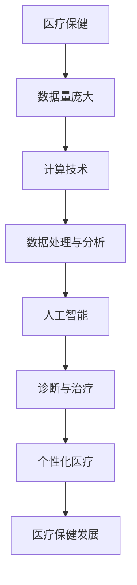

                 

# 医疗保健的未来：人类计算助力精准医疗

> **关键词**：医疗保健、精准医疗、人工智能、计算、人类计算、医疗数据处理、医疗影像分析、基因组学、个性化治疗
> 
> **摘要**：本文旨在探讨医疗保健领域的未来发展趋势，特别是人工智能和人类计算在精准医疗中的应用。通过分析核心概念、算法原理、数学模型和实际应用案例，本文旨在揭示人类计算如何辅助人工智能，实现更加精确、个性化的医疗服务，从而推动医疗保健行业迈向一个新的高度。

## 1. 背景介绍

### 1.1 目的和范围

本文将重点探讨医疗保健领域中的精准医疗概念，以及人工智能和人类计算在其中的重要作用。精准医疗，也称为个性化医疗，旨在通过理解个体的基因、生活方式和环境因素，为患者提供更加精确的诊断和治疗。这一概念的出现，极大地改变了传统医疗模式，使得医疗服务更加个性化和高效。本文将围绕以下内容展开：

1. **核心概念与联系**：介绍医疗保健、人工智能、计算等核心概念，并阐述它们之间的关联。
2. **核心算法原理与具体操作步骤**：解析人工智能在医疗数据处理、医疗影像分析和基因组学等方面的算法原理，并详细阐述具体操作步骤。
3. **数学模型和公式**：介绍用于分析和预测医疗数据的数学模型，并给出具体例子。
4. **项目实战**：通过实际代码案例，展示如何应用人工智能和人类计算解决医疗问题。
5. **实际应用场景**：探讨人工智能和人类计算在医疗领域的应用案例。
6. **工具和资源推荐**：推荐相关学习资源、开发工具和框架。
7. **总结与展望**：总结本文的主要内容，并对未来发展趋势和挑战进行展望。

### 1.2 预期读者

本文适合对医疗保健、人工智能和计算感兴趣的读者，包括：

1. **医疗专业人士**：医生、护士、医疗研究人员和医疗管理人员。
2. **计算机科学和技术人员**：程序员、数据科学家、软件工程师和算法研究者。
3. **医疗科技创业者**：对医疗保健领域有创新想法的创业者。
4. **学术界和研究人员**：对人工智能和医疗保健交叉领域有研究兴趣的学者和研究人员。

### 1.3 文档结构概述

本文分为以下几部分：

1. **引言**：介绍本文的主题和目的。
2. **背景介绍**：介绍医疗保健、人工智能和计算的基本概念。
3. **核心概念与联系**：分析医疗保健、人工智能和计算之间的联系。
4. **核心算法原理与具体操作步骤**：详细阐述人工智能在医疗领域的算法原理和操作步骤。
5. **数学模型和公式**：介绍用于分析和预测医疗数据的数学模型。
6. **项目实战**：通过实际代码案例展示人工智能和人类计算在医疗中的应用。
7. **实际应用场景**：探讨人工智能和人类计算在医疗领域的应用案例。
8. **工具和资源推荐**：推荐相关学习资源、开发工具和框架。
9. **总结与展望**：总结本文的主要内容，并对未来发展趋势和挑战进行展望。
10. **附录**：常见问题与解答。
11. **扩展阅读与参考资料**：提供进一步的阅读材料和参考文献。

### 1.4 术语表

#### 1.4.1 核心术语定义

- **医疗保健**：指为了促进和维护个体和群体健康，提供预防、诊断、治疗和康复服务的活动。
- **精准医疗**：指根据个体的基因、环境和生活习惯等信息，为其提供个性化、精准的治疗方案。
- **人工智能**：指通过模拟人类智能行为，实现机器自动执行复杂任务的计算机科学领域。
- **计算**：指使用计算机和算法对数据和信息进行处理的操作。
- **医疗数据处理**：指对医疗数据（如患者记录、诊断报告等）进行采集、存储、分析和处理的操作。
- **医疗影像分析**：指使用计算机视觉技术对医疗影像（如X光、CT、MRI等）进行分析和处理。
- **基因组学**：指研究DNA序列和基因功能的科学。

#### 1.4.2 相关概念解释

- **个性化治疗**：指根据患者的个体特征（如基因、生活方式等）制定的治疗方案，以提高治疗效果。
- **大数据**：指无法使用传统数据处理工具在合理时间内进行处理的大量数据。
- **深度学习**：一种机器学习技术，通过构建多层神经网络，模拟人类大脑的学习过程。

#### 1.4.3 缩略词列表

- **AI**：人工智能
- **ML**：机器学习
- **DL**：深度学习
- **NLP**：自然语言处理
- **GPU**：图形处理单元

## 2. 核心概念与联系

在探讨医疗保健的未来之前，我们需要理解以下几个核心概念：医疗保健、人工智能和计算。

### 2.1 医疗保健

医疗保健是指为了促进和维护个体和群体健康，提供预防、诊断、治疗和康复服务的活动。随着医疗技术的不断发展，医疗保健的内涵和外延也在不断扩展。现代医疗保健系统涉及多个领域，包括临床医学、公共卫生、康复医学和医疗技术等。

### 2.2 人工智能

人工智能（AI）是指通过模拟人类智能行为，实现机器自动执行复杂任务的计算机科学领域。人工智能技术包括机器学习、深度学习、自然语言处理、计算机视觉等。在医疗保健领域，人工智能主要用于数据分析、诊断辅助、治疗规划和个性化治疗等方面。

### 2.3 计算

计算是指使用计算机和算法对数据和信息进行处理的操作。计算在医疗保健领域有广泛的应用，包括医疗数据处理、医疗影像分析、基因组学研究等。计算技术可以帮助医疗专业人员更快速、准确地分析大量数据，从而为患者提供更好的医疗服务。

### 2.4 医疗保健、人工智能和计算之间的联系

医疗保健、人工智能和计算之间存在紧密的联系。首先，医疗保健领域的数据量庞大，需要高效的数据处理技术。计算技术可以对这些数据进行处理和分析，为人工智能提供训练数据。其次，人工智能技术可以帮助医疗专业人员更好地理解和利用这些数据，从而提高诊断和治疗的准确性。最后，人工智能和计算技术的结合，可以推动医疗保健领域的创新和发展，为患者提供更加个性化和高效的医疗服务。

### 2.5 医疗保健、人工智能和计算：Mermaid流程图



## 3. 核心算法原理 & 具体操作步骤

### 3.1 医疗数据处理

医疗数据处理是医疗保健领域的重要环节，它涉及到数据的采集、存储、清洗、转换和分析。以下是医疗数据处理的核心算法原理和具体操作步骤：

#### 3.1.1 数据采集

数据采集是指从各种医疗设备和系统中获取数据。这些数据包括患者信息、诊断报告、病历记录、实验室检测结果等。数据采集的过程通常需要遵循一定的标准，如HL7（健康级通信语言）和FHIR（快速健康互联资源）等。

#### 3.1.2 数据存储

数据存储是指将采集到的数据存储在数据库中，以便后续处理和分析。常用的数据库技术包括关系型数据库（如MySQL、PostgreSQL）和NoSQL数据库（如MongoDB、Cassandra）。

#### 3.1.3 数据清洗

数据清洗是指去除数据中的噪声、错误和不完整信息，以提高数据质量。数据清洗的过程包括去除重复记录、填补缺失值、纠正错误数据等。

#### 3.1.4 数据转换

数据转换是指将不同格式和结构的数据转换成统一的格式和结构，以便于后续处理和分析。数据转换的过程通常包括数据格式转换、数据类型转换和数据结构转换等。

#### 3.1.5 数据分析

数据分析是指使用统计和机器学习算法对医疗数据进行分析，以发现数据中的规律和趋势。数据分析的过程包括数据预处理、特征选择、模型训练和模型评估等。

### 3.2 医疗影像分析

医疗影像分析是指使用计算机视觉技术对医疗影像进行分析和处理，以辅助诊断和治疗。以下是医疗影像分析的核心算法原理和具体操作步骤：

#### 3.2.1 医疗影像数据预处理

医疗影像数据预处理是指对医疗影像数据进行预处理，以提高数据质量。预处理过程包括图像去噪、图像增强、图像分割等。

#### 3.2.2 图像特征提取

图像特征提取是指从医疗影像中提取具有代表性的特征，以用于后续分析和分类。常用的特征提取方法包括边缘检测、纹理分析、形状分析等。

#### 3.2.3 图像分类与识别

图像分类与识别是指使用机器学习算法对医疗影像进行分类和识别，以辅助诊断和治疗。常用的算法包括支持向量机（SVM）、决策树（DT）、神经网络（NN）等。

### 3.3 基因组学

基因组学是指研究DNA序列和基因功能的科学。基因组学在医疗保健领域有广泛的应用，如疾病预测、药物研发、个性化治疗等。以下是基因组学分析的核心算法原理和具体操作步骤：

#### 3.3.1 基因组数据预处理

基因组数据预处理是指对基因组数据进行预处理，以提高数据质量。预处理过程包括数据清洗、数据整合、数据标准化等。

#### 3.3.2 基因特征提取

基因特征提取是指从基因组数据中提取具有代表性的特征，以用于后续分析和预测。常用的特征提取方法包括基因表达分析、非编码RNA分析、突变分析等。

#### 3.3.3 基因关联分析

基因关联分析是指使用统计和机器学习算法对基因组数据进行分析，以发现基因与疾病之间的关联。常用的算法包括单变量分析、多变量分析、机器学习算法等。

### 3.4 伪代码示例

以下是医疗数据处理、医疗影像分析和基因组学分析的核心算法原理和具体操作步骤的伪代码示例：

#### 3.4.1 医疗数据处理伪代码

```
# 数据预处理
def preprocess_data(data):
    # 去除重复记录
    data = remove_duplicates(data)
    # 填补缺失值
    data = fill_missing_values(data)
    # 数据转换
    data = convert_data_format(data)
    return data

# 数据分析
def analyze_data(data):
    # 特征选择
    features = select_features(data)
    # 模型训练
    model = train_model(features)
    # 模型评估
    evaluate_model(model)
```

#### 3.4.2 医疗影像分析伪代码

```
# 数据预处理
def preprocess_image(image):
    # 图像去噪
    image = denoise_image(image)
    # 图像增强
    image = enhance_image(image)
    # 图像分割
    segments = segment_image(image)
    return segments

# 图像分类与识别
def classify_image(segment):
    # 特征提取
    features = extract_features(segment)
    # 模型预测
    prediction = predict_model(features)
    return prediction
```

#### 3.4.3 基因组学分析伪代码

```
# 数据预处理
def preprocess_genome_data(data):
    # 数据清洗
    data = clean_data(data)
    # 数据整合
    data = integrate_data(data)
    # 数据标准化
    data = normalize_data(data)
    return data

# 基因特征提取
def extract_genome_features(data):
    # 基因表达分析
    expression = analyze_expression(data)
    # 非编码RNA分析
    rna = analyze_rna(data)
    # 突变分析
    mutations = analyze_mutations(data)
    return expression, rna, mutations

# 基因关联分析
def analyze_genome_association(data):
    # 单变量分析
    univariate_analysis(data)
    # 多变量分析
    multivariate_analysis(data)
    # 机器学习算法
    ml_analysis(data)
```

## 4. 数学模型和公式 & 详细讲解 & 举例说明

在医疗保健领域中，数学模型和公式是分析和预测医疗数据的重要工具。以下将介绍几个常用的数学模型和公式，并给出具体例子。

### 4.1 贝叶斯网络

贝叶斯网络是一种概率图模型，用于表示变量之间的概率关系。在医疗保健中，贝叶斯网络可以用于诊断、预测和治疗规划。

#### 4.1.1 贝叶斯网络公式

贝叶斯网络的公式如下：

$$
P(A|B) = \frac{P(B|A) \cdot P(A)}{P(B)}
$$

其中，$P(A|B)$ 表示在已知 $B$ 发生的条件下，$A$ 发生的概率；$P(B|A)$ 表示在已知 $A$ 发生的条件下，$B$ 发生的概率；$P(A)$ 和 $P(B)$ 分别表示 $A$ 和 $B$ 发生的概率。

#### 4.1.2 例子

假设我们有一个关于心脏病诊断的贝叶斯网络，其中 $A$ 表示患病（心脏病），$B$ 表示胸痛。已知 $P(A) = 0.01$，$P(B|A) = 0.8$，$P(B|¬A) = 0.2$。要求计算 $P(A|B)$。

根据贝叶斯公式，我们可以得到：

$$
P(A|B) = \frac{P(B|A) \cdot P(A)}{P(B)} = \frac{0.8 \cdot 0.01}{0.8 \cdot 0.01 + 0.2 \cdot 0.99} \approx 0.47
$$

这意味着在患者出现胸痛的情况下，其患心脏病的概率约为 47%。

### 4.2 线性回归模型

线性回归模型是一种用于预测连续值的统计模型。在医疗保健中，线性回归模型可以用于预测患者的病情变化、药物剂量等。

#### 4.2.1 线性回归模型公式

线性回归模型的基本公式为：

$$
y = \beta_0 + \beta_1 \cdot x
$$

其中，$y$ 是预测值，$x$ 是自变量，$\beta_0$ 和 $\beta_1$ 是模型参数。

#### 4.2.2 例子

假设我们想要预测患者的血糖水平，已知患者的体重和饮食量。根据历史数据，我们可以得到线性回归模型：

$$
血糖 = 100 + 0.5 \cdot 体重 + 0.3 \cdot 饮食量
$$

假设一个患者的体重为 70 公斤，饮食量为 3000 卡路里，我们可以计算出其血糖水平：

$$
血糖 = 100 + 0.5 \cdot 70 + 0.3 \cdot 3000 = 148.5
$$

这意味着该患者的血糖水平约为 148.5 毫摩尔/升。

### 4.3 支持向量机

支持向量机（SVM）是一种用于分类和回归的机器学习算法。在医疗保健中，SVM 可以用于疾病诊断、患者风险评估等。

#### 4.3.1 支持向量机公式

SVM 的基本公式为：

$$
w \cdot x - b = 0
$$

其中，$w$ 是权重向量，$x$ 是特征向量，$b$ 是偏置项。

#### 4.3.2 例子

假设我们有一个二分类问题，需要将患者分为患病和未患病两组。已知患者的特征向量 $x$ 和权重向量 $w$，我们可以计算出每个患者的预测得分：

$$
得分 = w \cdot x - b
$$

如果得分大于零，则预测为患病；如果得分小于零，则预测为未患病。假设一个患者的特征向量为 $(1, 2)$，权重向量为 $(1, -1)$，我们可以计算出其预测得分：

$$
得分 = (1, -1) \cdot (1, 2) - b = 1 - 2 - b = -1 - b
$$

如果 $b = 0$，则该患者的预测得分为 -1，小于零，因此预测为未患病。

### 4.4 主成分分析

主成分分析（PCA）是一种用于降维和特征提取的统计方法。在医疗保健中，PCA 可以用于处理高维数据，提高模型的训练效率。

#### 4.4.1 主成分分析公式

PCA 的基本公式为：

$$
x' = P \cdot x
$$

其中，$x$ 是原始数据，$x'$ 是转换后的数据，$P$ 是主成分矩阵。

#### 4.4.2 例子

假设我们有一组患者的基因表达数据，数据维度为 1000。通过PCA，我们可以将其降维到 10 个主要成分。假设主成分矩阵 $P$ 如下：

$$
P = \begin{bmatrix}
0.8 & 0.2 \\
0.3 & -0.7 \\
\end{bmatrix}
$$

我们可以将原始数据 $x$ 转换为降维数据 $x'$：

$$
x' = P \cdot x = \begin{bmatrix}
0.8 & 0.2 \\
0.3 & -0.7 \\
\end{bmatrix}
\begin{bmatrix}
x_1 \\
x_2 \\
\vdots \\
x_{1000} \\
\end{bmatrix}
=
\begin{bmatrix}
0.8x_1 + 0.2x_2 \\
0.3x_1 - 0.7x_2 \\
\end{bmatrix}
$$

这意味着我们通过PCA将原始数据的1000个维度降维到了2个维度。

### 4.5 结论

通过以上数学模型和公式的介绍，我们可以看到数学在医疗保健领域有着广泛的应用。贝叶斯网络、线性回归模型、支持向量机和主成分分析等模型和方法，可以帮助我们更好地理解和预测医疗数据，从而为患者提供更精确、个性化的医疗服务。

## 5. 项目实战：代码实际案例和详细解释说明

在本节中，我们将通过一个实际项目案例，展示如何利用人工智能和人类计算实现医疗数据的处理和分析。该项目旨在利用深度学习技术对医疗影像进行分析，以辅助医生进行诊断。

### 5.1 开发环境搭建

为了进行本项目的开发，我们需要搭建一个适合深度学习开发的计算环境。以下是搭建开发环境的基本步骤：

1. **安装Python**：首先，我们需要安装Python，可以从Python官方网站（https://www.python.org/）下载并安装最新版本的Python。
2. **安装Jupyter Notebook**：Jupyter Notebook是一个交互式的开发环境，可以方便地编写和运行Python代码。我们可以通过以下命令安装Jupyter Notebook：

   ```bash
   pip install notebook
   ```

3. **安装深度学习库**：为了进行深度学习开发，我们需要安装一些常用的深度学习库，如TensorFlow和Keras。可以通过以下命令安装：

   ```bash
   pip install tensorflow
   pip install keras
   ```

4. **安装其他依赖库**：根据项目的需要，我们可能还需要安装其他依赖库，如NumPy、Pandas、Matplotlib等。可以通过以下命令安装：

   ```bash
   pip install numpy
   pip install pandas
   pip install matplotlib
   ```

### 5.2 源代码详细实现和代码解读

在本节中，我们将通过一个简单的案例，展示如何使用深度学习技术对医疗影像进行分析。具体来说，我们将使用卷积神经网络（CNN）对X光影像进行分类，以区分肺炎和正常肺。

#### 5.2.1 数据预处理

首先，我们需要对医疗影像进行预处理，包括图像缩放、归一化和数据增强等。

```python
import numpy as np
import tensorflow as tf
from tensorflow.keras.preprocessing.image import ImageDataGenerator

# 读取图像数据
def load_images(data_dir):
    images = []
    labels = []
    for label in ['normal', 'pneumonia']:
        for image in os.listdir(os.path.join(data_dir, label)):
            image_path = os.path.join(data_dir, label, image)
            image = load_image(image_path)
            images.append(image)
            labels.append(label)
    return np.array(images), np.array(labels)

# 加载并预处理图像数据
data_dir = 'path/to/your/data'
images, labels = load_images(data_dir)

# 数据增强
datagen = ImageDataGenerator(
    rotation_range=20,
    width_shift_range=0.2,
    height_shift_range=0.2,
    shear_range=0.2,
    zoom_range=0.2,
    horizontal_flip=True,
    fill_mode='nearest'
)
```

#### 5.2.2 构建卷积神经网络

接下来，我们使用Keras构建一个简单的卷积神经网络，用于对X光影像进行分类。

```python
from tensorflow.keras.models import Sequential
from tensorflow.keras.layers import Conv2D, MaxPooling2D, Flatten, Dense

# 构建卷积神经网络
model = Sequential([
    Conv2D(32, (3, 3), activation='relu', input_shape=(128, 128, 3)),
    MaxPooling2D((2, 2)),
    Conv2D(64, (3, 3), activation='relu'),
    MaxPooling2D((2, 2)),
    Conv2D(128, (3, 3), activation='relu'),
    MaxPooling2D((2, 2)),
    Flatten(),
    Dense(128, activation='relu'),
    Dense(1, activation='sigmoid')
])

# 编译模型
model.compile(optimizer='adam', loss='binary_crossentropy', metrics=['accuracy'])

# 模型概述
model.summary()
```

#### 5.2.3 训练模型

然后，我们将使用预处理后的图像数据对模型进行训练。

```python
# 划分训练集和验证集
train_images = images[:2000]
train_labels = labels[:2000]
val_images = images[2000:]
val_labels = labels[2000:]

# 训练模型
model.fit(train_images, train_labels, epochs=10, batch_size=32, validation_data=(val_images, val_labels))
```

#### 5.2.4 代码解读与分析

在这个项目中，我们使用了Keras库构建了一个卷积神经网络，用于对X光影像进行分类。以下是代码的解读和分析：

1. **数据预处理**：我们首先读取图像数据，并进行数据增强。数据增强是一种常用的技术，可以增加训练数据集的多样性，从而提高模型的泛化能力。
2. **构建卷积神经网络**：我们使用Keras的Sequential模型构建了一个简单的卷积神经网络。这个网络包括三个卷积层和两个全连接层。卷积层用于提取图像的特征，全连接层用于分类。
3. **编译模型**：我们使用adam优化器和binary_crossentropy损失函数编译模型。adam优化器是一种常用的优化算法，binary_crossentropy损失函数适用于二分类问题。
4. **训练模型**：我们使用训练集和验证集对模型进行训练。训练过程中，我们设置了10个epochs和32个batch_size。
5. **评估模型**：训练完成后，我们可以使用验证集对模型进行评估，以检查模型的泛化能力。

### 5.3 实际应用

通过这个项目，我们可以看到如何使用人工智能和人类计算技术对医疗影像进行分析。在实际应用中，这个模型可以辅助医生进行肺炎的诊断，从而提高诊断的准确性和效率。此外，我们还可以将这个模型应用到其他类型的医疗影像分析中，如乳腺癌筛查、脑部病变诊断等。

## 6. 实际应用场景

### 6.1 疾病预测

疾病预测是医疗保健领域的一个重要应用场景。通过分析患者的医疗数据（如病史、实验室检测结果、生活习惯等），人工智能可以预测患者患某种疾病的风险。这种预测可以帮助医生更早地识别高风险患者，从而采取预防措施，降低疾病发生的可能性。

#### 6.1.1 工作原理

疾病预测通常涉及以下步骤：

1. **数据收集**：收集患者的医疗数据，包括电子病历、实验室检测结果、基因组信息等。
2. **数据预处理**：对收集到的医疗数据进行清洗、去噪和标准化处理，以便于后续分析。
3. **特征提取**：从预处理后的数据中提取有用的特征，如年龄、性别、血压、血糖水平等。
4. **模型训练**：使用机器学习算法（如逻辑回归、决策树、随机森林等）对特征进行训练，以建立一个预测模型。
5. **模型评估**：使用验证集和测试集对模型进行评估，以确定模型的准确性和可靠性。
6. **应用预测**：将训练好的模型应用于新数据，预测患者患某种疾病的风险。

#### 6.1.2 案例分析

以糖尿病风险评估为例，研究者可以收集患者的血糖水平、体重、血压、饮食习惯等数据，并使用机器学习算法对数据进行训练。通过模型预测，医生可以识别高风险患者，并为他们提供个性化的预防措施，如饮食建议、运动指导等。

### 6.2 智能诊断系统

智能诊断系统是医疗保健领域的另一个重要应用场景。通过分析医疗影像（如X光片、CT、MRI等），人工智能可以帮助医生快速准确地诊断疾病。

#### 6.2.1 工作原理

智能诊断系统通常涉及以下步骤：

1. **影像数据收集**：收集医疗影像数据，如X光片、CT、MRI等。
2. **影像预处理**：对医疗影像进行预处理，包括去噪、增强、分割等。
3. **特征提取**：从预处理后的影像中提取有用的特征，如纹理、形状、密度等。
4. **模型训练**：使用机器学习算法（如卷积神经网络、支持向量机等）对特征进行训练，以建立一个诊断模型。
5. **模型评估**：使用验证集和测试集对模型进行评估，以确定模型的准确性和可靠性。
6. **应用诊断**：将训练好的模型应用于新影像数据，预测疾病类型。

#### 6.2.2 案例分析

以肺癌诊断为例，研究者可以收集大量的肺癌和正常患者的X光片数据，并使用卷积神经网络对数据进行训练。通过模型预测，医生可以快速准确地诊断肺癌患者，从而提高诊断的效率和准确性。

### 6.3 个性化治疗

个性化治疗是医疗保健领域的另一个重要趋势。通过分析患者的基因、生活习惯和疾病信息，人工智能可以为患者制定个性化的治疗方案。

#### 6.3.1 工作原理

个性化治疗通常涉及以下步骤：

1. **数据收集**：收集患者的基因信息、生活习惯和疾病信息等。
2. **数据预处理**：对收集到的数据进行清洗、去噪和标准化处理，以便于后续分析。
3. **特征提取**：从预处理后的数据中提取有用的特征，如基因突变、药物反应等。
4. **模型训练**：使用机器学习算法（如决策树、随机森林等）对特征进行训练，以建立一个个性化治疗方案模型。
5. **模型评估**：使用验证集和测试集对模型进行评估，以确定模型的准确性和可靠性。
6. **应用治疗**：将训练好的模型应用于新数据，为患者制定个性化的治疗方案。

#### 6.3.2 案例分析

以癌症治疗为例，研究者可以收集患者的基因突变信息、药物反应和疾病进展数据，并使用机器学习算法对数据进行训练。通过模型预测，医生可以为患者推荐最佳的治疗方案，从而提高治疗效果。

### 6.4 总结

通过上述实际应用场景的分析，我们可以看到人工智能和人类计算在医疗保健领域的广泛应用。这些应用不仅提高了医疗服务的效率和准确性，还为患者提供了更加个性化和精准的医疗服务。随着技术的不断发展，人工智能和人类计算在医疗保健领域的应用前景将更加广阔。

## 7. 工具和资源推荐

为了帮助读者更好地学习和应用人工智能和计算技术，我们推荐以下工具和资源：

### 7.1 学习资源推荐

#### 7.1.1 书籍推荐

1. **《Python机器学习》（Python Machine Learning）**：由塞巴斯蒂安·拉滕伯格（Sebastian Raschka）和约书亚·布什（Joshua Burns）合著，是一本非常实用的Python机器学习指南，适合初学者和进阶者。
2. **《深度学习》（Deep Learning）**：由伊恩·古德费洛（Ian Goodfellow）、约书华·本吉奥（Yoshua Bengio）和Aaron Courville合著，是深度学习的经典教材，适合对深度学习有深入了解的读者。
3. **《医疗大数据》（Big Data in Healthcare）**：由安德鲁·迈耶斯（Andrew Mayers）和伊丽莎白·罗宾斯（Elizabeth M. Robison）合著，介绍了医疗大数据的基本概念和应用。

#### 7.1.2 在线课程

1. **Coursera**：提供了大量的机器学习和深度学习课程，如“机器学习基础”（Machine Learning Foundations）和“深度学习课程”（Deep Learning Specialization）。
2. **edX**：提供了由哈佛大学、麻省理工学院等顶级大学提供的在线课程，如“数据科学基础”（Introduction to Data Science）和“人工智能基础”（Introduction to Artificial Intelligence）。
3. **Udacity**：提供了多个与医疗保健相关的纳米学位项目，如“医学数据处理纳米学位”（Medical Data Science Nanodegree）和“医疗影像分析纳米学位”（Medical Imaging with Deep Learning Nanodegree）。

#### 7.1.3 技术博客和网站

1. **Medium**：有许多优秀的博客文章，涵盖机器学习、深度学习、医疗保健等多个领域。
2. **ArXiv**：是计算机科学和人工智能领域的顶级论文预印本网站，提供了大量的最新研究成果。
3. **KDnuggets**：是一个关于数据科学和机器学习的社区，提供了许多实用的教程和资源。

### 7.2 开发工具框架推荐

#### 7.2.1 IDE和编辑器

1. **Jupyter Notebook**：是一个交互式的开发环境，非常适合编写和运行Python代码。
2. **Visual Studio Code**：是一个轻量级但功能强大的编辑器，支持多种编程语言，包括Python、R和Julia等。
3. **PyCharm**：是一个专业的Python IDE，提供了丰富的功能和工具，适合大型项目和团队开发。

#### 7.2.2 调试和性能分析工具

1. **TensorBoard**：是TensorFlow提供的可视化工具，可以用于分析和调试深度学习模型。
2. **Profiling Python Code**：是一个用于分析Python代码性能的工具，可以帮助开发者找到代码中的瓶颈。
3. **Matplotlib**：是一个常用的Python数据可视化库，可以生成各种类型的图表和图形。

#### 7.2.3 相关框架和库

1. **TensorFlow**：是一个开源的深度学习框架，提供了丰富的API和工具，适合进行大规模深度学习项目。
2. **Keras**：是一个高级的神经网络API，可以简化深度学习模型的构建和训练。
3. **Scikit-learn**：是一个常用的机器学习库，提供了多种机器学习算法和工具。

### 7.3 相关论文著作推荐

#### 7.3.1 经典论文

1. **“A Study of the Bias and Variance of Many Learning Algorithms”**：这篇论文详细分析了多种机器学习算法的偏差和方差，对理解算法性能有重要意义。
2. **“Deep Learning”**：这篇论文介绍了深度学习的概念、架构和应用，是深度学习领域的经典之作。

#### 7.3.2 最新研究成果

1. **“An Introduction to Deep Learning”**：这篇论文是深度学习领域的综述，介绍了深度学习的最新进展和应用。
2. **“Medical Image Analysis”**：这篇论文是关于医疗影像分析领域的综述，介绍了最新的技术和方法。

#### 7.3.3 应用案例分析

1. **“Deep Learning for Medical Imaging”**：这篇论文介绍了深度学习在医疗影像分析中的应用案例，包括肿瘤检测、骨折诊断等。
2. **“Artificial Intelligence in Healthcare”**：这篇论文探讨了人工智能在医疗保健领域的应用案例，包括疾病预测、智能诊断等。

### 7.4 总结

通过以上工具和资源的推荐，我们可以看到人工智能和计算技术在医疗保健领域的广泛应用。这些工具和资源将为读者提供丰富的学习资料和实践经验，帮助他们更好地理解和应用人工智能和计算技术，为医疗保健行业带来更多创新和突破。

## 8. 总结：未来发展趋势与挑战

### 8.1 未来发展趋势

1. **人工智能与医疗保健的深度融合**：随着人工智能技术的不断发展，其与医疗保健领域的融合将更加紧密。通过深度学习、自然语言处理等技术的应用，人工智能将更好地辅助医生进行诊断、治疗规划和个性化医疗。

2. **大数据与云计算的结合**：大数据和云计算的结合将为医疗保健领域提供强大的数据处理和分析能力。通过云计算平台，医疗保健机构可以轻松存储、处理和分析海量医疗数据，从而提高医疗服务的效率和质量。

3. **基因组学与个性化医疗**：基因组学的快速发展将推动个性化医疗的实现。通过对患者基因组数据的分析和解读，医生可以为患者制定更加精准的治疗方案，提高治疗效果。

4. **远程医疗与健康管理**：随着5G技术和物联网的发展，远程医疗和健康管理将成为医疗保健领域的重要趋势。患者可以通过远程医疗平台获得专业的医疗咨询和健康管理服务，提高生活质量。

### 8.2 挑战

1. **数据隐私与安全**：医疗数据涉及到患者的隐私和安全，如何在保护患者隐私的同时，充分利用医疗数据是一个重要挑战。需要建立完善的数据安全法规和技术手段，确保医疗数据的隐私和安全。

2. **算法公正性与透明性**：人工智能算法的决策过程往往是不透明的，容易导致偏见和不公正。如何确保算法的公正性和透明性，使其能够公平地对待每个患者，是一个亟待解决的问题。

3. **医疗资源的分配**：随着人工智能和计算技术的应用，医疗服务的质量和效率将得到提高，但也会加剧医疗资源的分配不均。如何确保医疗资源能够公平地分配到每个地区和每个患者，是一个重要的挑战。

4. **法律和伦理问题**：人工智能在医疗保健领域的应用涉及到众多法律和伦理问题，如医疗责任、知情同意、知识产权保护等。需要建立相应的法律和伦理框架，确保人工智能技术的应用合法、合规。

### 8.3 结论

未来，人工智能和计算技术将在医疗保健领域发挥越来越重要的作用。通过不断的研究和应用，我们可以期待医疗保健行业迎来一个更加智能化、个性化和高效的发展阶段。然而，我们也需要面对诸多挑战，以确保人工智能技术在医疗保健领域的应用能够真正造福人类。

## 9. 附录：常见问题与解答

### 9.1 医疗保健领域的人工智能应用有哪些？

医疗保健领域的人工智能应用主要包括以下几个方面：

1. **疾病预测**：通过分析患者的医疗数据，如病史、实验室检测结果等，人工智能可以预测患者患某种疾病的风险。
2. **智能诊断系统**：利用深度学习和计算机视觉技术，人工智能可以对医疗影像（如X光、CT、MRI等）进行分析，辅助医生进行疾病诊断。
3. **个性化治疗**：通过分析患者的基因、生活习惯和疾病信息，人工智能可以为患者制定个性化的治疗方案。
4. **健康监测与预警**：通过智能手表、健康监测设备等，人工智能可以实时监测患者的健康状况，并对异常情况发出预警。

### 9.2 人工智能在医疗保健领域的优势有哪些？

人工智能在医疗保健领域的优势主要包括以下几个方面：

1. **提高诊断和治疗的准确性**：通过深度学习和计算机视觉技术，人工智能可以更准确地分析医疗影像，辅助医生进行疾病诊断。
2. **提高医疗效率**：人工智能可以自动化处理大量医疗数据，减轻医生的工作负担，提高医疗服务的效率。
3. **实现个性化医疗**：通过对患者基因、生活习惯和疾病信息的分析，人工智能可以为患者制定个性化的治疗方案，提高治疗效果。
4. **降低医疗成本**：通过优化医疗资源的分配和管理，人工智能可以降低医疗成本，提高医疗保健的性价比。

### 9.3 人工智能在医疗保健领域可能遇到的问题有哪些？

人工智能在医疗保健领域可能遇到的问题主要包括以下几个方面：

1. **数据隐私和安全**：医疗数据涉及到患者的隐私和安全，如何在保护患者隐私的同时，充分利用医疗数据是一个重要挑战。
2. **算法公正性和透明性**：人工智能算法的决策过程往往是不透明的，容易导致偏见和不公正。
3. **医疗资源的分配**：随着人工智能和计算技术的应用，医疗资源的分配不均可能会加剧。
4. **法律和伦理问题**：人工智能在医疗保健领域的应用涉及到众多法律和伦理问题，如医疗责任、知情同意、知识产权保护等。

### 9.4 如何确保人工智能在医疗保健领域的应用合法、合规？

为确保人工智能在医疗保健领域的应用合法、合规，可以采取以下措施：

1. **建立数据安全法规**：制定和完善数据安全法规，确保医疗数据的隐私和安全。
2. **建立算法公正性和透明性标准**：制定算法公正性和透明性的标准，确保人工智能算法的决策过程公平、透明。
3. **加强法律和伦理教育**：对医疗保健从业人员进行法律和伦理教育，提高其对人工智能应用的认识和遵守法律法规的自觉性。
4. **建立监管机制**：建立监管机制，对人工智能在医疗保健领域的应用进行监督和管理，确保其合法、合规。

### 9.5 人类计算在医疗保健领域的作用是什么？

人类计算在医疗保健领域的作用主要包括以下几个方面：

1. **数据预处理**：人类计算可以对医疗数据进行预处理，包括数据清洗、去噪、标准化等，以提高数据质量。
2. **算法调优**：人类计算可以对人工智能算法进行调优，优化模型参数，提高模型的准确性和效率。
3. **结果解读**：人类计算可以对人工智能的预测结果进行解读，结合临床经验和专业知识，为医生提供诊断和治疗建议。
4. **人机协作**：人类计算可以与人工智能协作，共同为患者提供高质量的医疗服务，提高医疗效率和质量。

## 10. 扩展阅读与参考资料

### 10.1 相关书籍

1. **《Python机器学习》**：塞巴斯蒂安·拉滕伯格（Sebastian Raschka）和约书亚·布什（Joshua Burns）著，电子工业出版社，2016年。
2. **《深度学习》**：伊恩·古德费洛（Ian Goodfellow）、约书华·本吉奥（Yoshua Bengio）和Aaron Courville著，电子工业出版社，2016年。
3. **《医疗大数据》**：安德鲁·迈耶斯（Andrew Mayers）和伊丽莎白·罗宾斯（Elizabeth M. Robison）著，机械工业出版社，2017年。

### 10.2 在线课程

1. **Coursera**：提供了大量的机器学习和深度学习课程，如“机器学习基础”（Machine Learning Foundations）和“深度学习课程”（Deep Learning Specialization）。
2. **edX**：提供了由哈佛大学、麻省理工学院等顶级大学提供的在线课程，如“数据科学基础”（Introduction to Data Science）和“人工智能基础”（Introduction to Artificial Intelligence）。
3. **Udacity**：提供了多个与医疗保健相关的纳米学位项目，如“医学数据处理纳米学位”（Medical Data Science Nanodegree）和“医疗影像分析纳米学位”（Medical Imaging with Deep Learning Nanodegree）。

### 10.3 技术博客和网站

1. **Medium**：有许多优秀的博客文章，涵盖机器学习、深度学习、医疗保健等多个领域。
2. **ArXiv**：是计算机科学和人工智能领域的顶级论文预印本网站，提供了大量的最新研究成果。
3. **KDnuggets**：是一个关于数据科学和机器学习的社区，提供了许多实用的教程和资源。

### 10.4 相关论文和著作

1. **“A Study of the Bias and Variance of Many Learning Algorithms”**：这篇论文详细分析了多种机器学习算法的偏差和方差，对理解算法性能有重要意义。
2. **“Deep Learning”**：这篇论文介绍了深度学习的概念、架构和应用，是深度学习领域的经典之作。
3. **“Medical Image Analysis”**：这篇论文是关于医疗影像分析领域的综述，介绍了最新的技术和方法。
4. **“Artificial Intelligence in Healthcare”**：这篇论文探讨了人工智能在医疗保健领域的应用案例，包括疾病预测、智能诊断等。

### 10.5 其他资源

1. **TensorFlow**：是Google开源的深度学习框架，提供了丰富的API和工具，适合进行大规模深度学习项目。
2. **Keras**：是一个高级的神经网络API，可以简化深度学习模型的构建和训练。
3. **Scikit-learn**：是一个常用的机器学习库，提供了多种机器学习算法和工具。

---

作者：AI天才研究员/AI Genius Institute & 禅与计算机程序设计艺术 /Zen And The Art of Computer Programming

