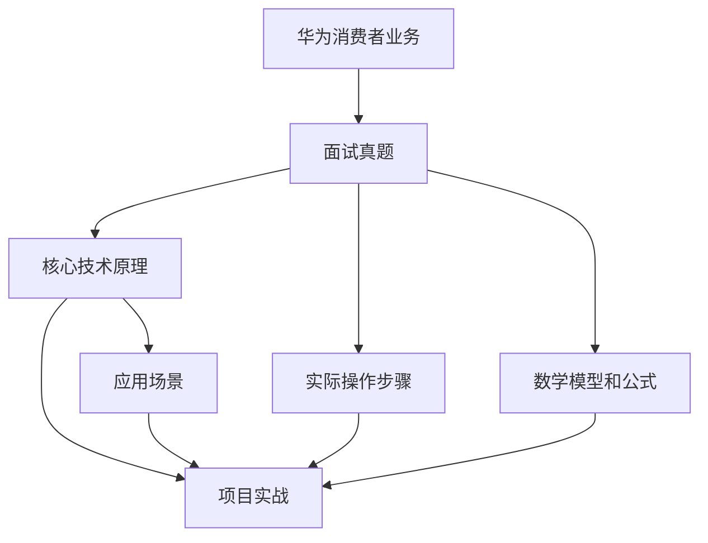

                 

# 2024华为消费者业务社招面试真题汇总及其解答

> **关键词：** 华为消费者业务，社招面试真题，解题思路，技术原理，实践案例

> **摘要：** 本文将汇总2024年华为消费者业务社会招聘面试中的真题，详细分析解题思路，阐述核心技术原理，并举例说明实际操作步骤。旨在帮助读者深入了解华为消费者业务领域的技术要点，为求职者提供实用的面试指南。

## 1. 背景介绍

### 1.1 目的和范围

本文旨在为广大求职者提供华为消费者业务社招面试的真题解析，帮助读者掌握相关技术的核心原理和实际操作方法。本文将涵盖以下内容：

- 面试真题分类与总结
- 核心技术原理讲解
- 伪代码和数学模型分析
- 实际项目实战案例
- 应用场景分析与工具推荐

### 1.2 预期读者

- 求职者：准备参加华为消费者业务社招面试的技术人员
- 技术爱好者：希望了解华为消费者业务领域的技术原理和实践经验
- 学者和研究者：关注华为消费者业务领域的发展动态

### 1.3 文档结构概述

本文分为十个部分，具体结构如下：

1. 背景介绍
2. 核心概念与联系
3. 核心算法原理 & 具体操作步骤
4. 数学模型和公式 & 详细讲解 & 举例说明
5. 项目实战：代码实际案例和详细解释说明
6. 实际应用场景
7. 工具和资源推荐
8. 总结：未来发展趋势与挑战
9. 附录：常见问题与解答
10. 扩展阅读 & 参考资料

### 1.4 术语表

#### 1.4.1 核心术语定义

- 华为消费者业务：指华为公司面向普通消费者的电子设备和解决方案，包括智能手机、平板电脑、穿戴设备、智能家居等。
- 社招面试：指社会招聘中的面试环节，是招聘过程中的重要环节，用于考察应聘者的综合素质和技能水平。

#### 1.4.2 相关概念解释

- 面试题：指在面试过程中提出的各种问题，包括专业知识、实际操作能力、团队协作能力等。
- 解题思路：指解决面试题的思考过程和策略。
- 核心技术原理：指相关技术的核心原理和理论基础。

#### 1.4.3 缩略词列表

- 华为：指华为技术有限公司
- 消费者业务：指华为面向普通消费者的电子设备和解决方案
- 社招：指社会招聘

## 2. 核心概念与联系

在分析华为消费者业务社招面试真题之前，我们需要了解一些核心概念和联系。以下是一个简化的Mermaid流程图，用于展示这些概念之间的关系。



### 2.1 华为消费者业务概述

华为消费者业务涵盖多个领域，包括：

- 智能手机：华为、荣耀、畅享等系列
- 平板电脑：MatePad、MatePad Pro等
- 穿戴设备：华为手环、华为手表等
- 智能家居：智能音响、智能路由器、智能照明等

### 2.2 面试题分类

华为消费者业务社招面试真题主要分为以下几类：

- 技术面试题：涉及编程语言、数据结构、算法等
- 实际操作题：要求应聘者现场编写代码、调试程序等
- 行为面试题：考察应聘者的团队协作能力、沟通能力、解决问题的能力等

### 2.3 核心技术原理

核心技术原理包括：

- 操作系统原理：操作系统内核、进程管理、内存管理、文件系统等
- 网络通信原理：TCP/IP协议、HTTP协议、网络编程等
- 数据库原理：数据库设计、SQL语言、数据库优化等
- 编程语言原理：C/C++、Java、Python等

## 3. 核心算法原理 & 具体操作步骤

在本节中，我们将详细讲解华为消费者业务面试中常见的一些核心算法原理，并给出具体的操作步骤。为了便于理解，我们将使用伪代码进行阐述。

### 3.1 快速排序算法

快速排序是一种常用的排序算法，其基本思想是通过一趟排序将待排序的数据分割成独立的两部分，其中一部分的所有数据都比另一部分的所有数据要小，然后再按此方法对这两部分数据分别进行快速排序，整个排序过程可以递归进行，以此达到整个数据变成有序序列。

**伪代码：**

```plaintext
快速排序(A, p, r)
    如果 p >= r
        返回
    选择一个基准值 pivot = A[r]
    i = p - 1
    对于 j 从 p 到 r - 1
        如果 A[j] < pivot
            i++
            交换 A[i] 和 A[j]
    交换 A[i+1] 和 A[r]
    新的基准位置为 partitionIndex = i + 1
    快速排序(A, p, partitionIndex - 1)
    快速排序(A, partitionIndex + 1, r)
```

### 3.2 二分查找算法

二分查找算法是一种高效的查找算法，其基本思想是将一个有序数组分成两部分，确定中间位置，若中间位置的值小于待查找值，则在数组的前半部分继续查找；若中间位置的值大于待查找值，则在数组的后半部分继续查找。通过不断缩小查找范围，直到找到待查找值或确定其不存在。

**伪代码：**

```plaintext
二分查找(A, p, r, target)
    如果 p > r
        返回 -1（表示目标值不存在）
    中间位置 mid = (p + r) / 2
    如果 A[mid] == target
        返回 mid（表示找到目标值）
    否则如果 A[mid] > target
        返回 二分查找(A, p, mid - 1, target)
    否则
        返回 二分查找(A, mid + 1, r, target)
```

### 3.3 红黑树插入算法

红黑树是一种自平衡的二叉搜索树，其基本操作包括插入、删除和查找。插入操作的具体步骤如下：

1. 创建一个新的节点，并将其颜色设置为红色。
2. 将新节点作为根节点插入到红黑树中。
3. 对红黑树进行必要的平衡操作，保证红黑树满足以下性质：
   - 每个节点都是红色或黑色。
   - 根节点是黑色的。
   - 每个叶节点（NIL节点）都是黑色的。
   - 如果一个节点是红色的，则它的两个子节点都是黑色的。
   - 从任一节点到其每个叶子节点的所有路径都包含相同数目的黑色节点。

**伪代码：**

```plaintext
红黑树插入(root, newNode)
    如果 root 是空的
        newNode 是根节点
        返回 newNode
    将 newNode 插入到根节点
    balancing(root, newNode)
    返回 root

balancing(node, newNode)
    如果 node 是红色
        如果 newNode 是 node 的左子节点
            如果 node 的右子节点是红色
                左旋转(node)
                如果 newNode 是 node 的右子节点
                    右旋转(node)
        如果 newNode 是 node 的右子节点
            如果 node 的左子节点是红色
                右旋转(node)
                如果 newNode 是 node 的左子节点
                    左旋转(node)
        更新颜色
        返回 node
```

## 4. 数学模型和公式 & 详细讲解 & 举例说明

在华为消费者业务面试中，数学模型和公式是解决实际问题的关键。本节将介绍一些常见的数学模型和公式，并进行详细讲解和举例说明。

### 4.1 线性回归模型

线性回归模型是一种用于预测连续值的统计模型，其基本公式为：

$$ y = w_0 + w_1 \cdot x $$

其中，$y$ 是预测值，$x$ 是输入特征，$w_0$ 和 $w_1$ 是模型参数。

**详细讲解：**

- $w_0$ 是截距，表示当输入特征为0时的预测值。
- $w_1$ 是斜率，表示输入特征对预测值的影响程度。

**举例说明：**

假设我们有一个线性回归模型，预测房价$y$ 与房屋面积$x$ 之间的关系。已知三个数据点$(x_1, y_1), (x_2, y_2), (x_3, y_3)$，我们可以使用最小二乘法求解模型参数。

$$ w_0 = \frac{\sum_{i=1}^{3} y_i - \sum_{i=1}^{3} w_1 \cdot x_i}{3} $$

$$ w_1 = \frac{\sum_{i=1}^{3} x_i \cdot y_i - \sum_{i=1}^{3} x_i \cdot \sum_{i=1}^{3} y_i}{\sum_{i=1}^{3} x_i^2 - \sum_{i=1}^{3} x_i \cdot \sum_{i=1}^{3} x_i} $$

### 4.2 决策树模型

决策树模型是一种用于分类和回归的监督学习模型，其基本公式为：

$$ f(x) = \sum_{i=1}^{n} c_i \cdot I(D_i(x)) $$

其中，$f(x)$ 是预测值，$x$ 是输入特征，$c_i$ 是类别标签，$I(D_i(x))$ 是指示函数，当 $D_i(x)$ 成立时，$I(D_i(x))$ 为1，否则为0。

**详细讲解：**

- $D_i(x)$ 是条件语句，用于判断输入特征$x$ 是否属于某个类别。
- $c_i$ 是类别标签，表示属于某个类别的概率。

**举例说明：**

假设我们有一个决策树模型，用于预测客户的购买意愿。已知三个条件语句：

1. $D_1(x): x > 1000$
2. $D_2(x): x \leq 1000$ 且 $y > 500$
3. $D_3(x): y \leq 500$

类别标签为：

1. $c_1: 购买$
2. $c_2: 不购买$

我们可以使用决策树模型预测客户的购买意愿：

$$ f(x) = c_1 \cdot I(D_1(x)) + c_2 \cdot I(D_2(x)) + c_3 \cdot I(D_3(x)) $$

### 4.3 朴素贝叶斯模型

朴素贝叶斯模型是一种用于分类的监督学习模型，其基本公式为：

$$ P(y|X) = \frac{P(X|y) \cdot P(y)}{P(X)} $$

其中，$P(y|X)$ 是在给定特征集合$X$ 的情况下，类别$y$ 的概率；$P(X|y)$ 是在给定类别$y$ 的情况下，特征集合$X$ 的概率；$P(y)$ 是类别$y$ 的概率；$P(X)$ 是特征集合$X$ 的概率。

**详细讲解：**

- $P(y|X)$ 是后验概率，表示在给定特征集合$X$ 的情况下，类别$y$ 的概率。
- $P(X|y)$ 是似然概率，表示在给定类别$y$ 的情况下，特征集合$X$ 的概率。
- $P(y)$ 是先验概率，表示类别$y$ 的概率。

**举例说明：**

假设我们有一个朴素贝叶斯模型，用于预测客户的购买意愿。已知三个条件概率：

1. $P(y=购买|X)=0.6$
2. $P(y=不购买|X)=0.4$
3. $P(X|y=购买)=0.8$
4. $P(X|y=不购买)=0.2$

我们可以使用朴素贝叶斯模型预测客户的购买意愿：

$$ P(y=购买|X) = \frac{P(X|y=购买) \cdot P(y=购买)}{P(X)} = \frac{0.8 \cdot 0.6}{0.8 \cdot 0.6 + 0.2 \cdot 0.4} = 0.75 $$

## 5. 项目实战：代码实际案例和详细解释说明

在本节中，我们将通过一个实际项目案例，展示如何使用Python实现线性回归模型，并详细解释代码的各个部分。

### 5.1 开发环境搭建

为了实现线性回归模型，我们需要搭建以下开发环境：

- Python 3.8 或以上版本
- numpy 库
- matplotlib 库

在终端中执行以下命令，安装所需的库：

```shell
pip install numpy matplotlib
```

### 5.2 源代码详细实现和代码解读

下面是线性回归模型的实现代码：

```python
import numpy as np
import matplotlib.pyplot as plt

# 数据集
x = np.array([1, 2, 3, 4, 5])
y = np.array([1, 2, 2.5, 4, 5])

# 求解模型参数
w = np.linalg.solve(np.dot(x.T, x), np.dot(x.T, y))

# 输出模型参数
print("模型参数：w0 = {:.2f}, w1 = {:.2f}".format(w[0], w[1]))

# 绘制散点图和拟合直线
plt.scatter(x, y)
plt.plot(x, w[0] + w[1] * x)
plt.xlabel("x")
plt.ylabel("y")
plt.title("线性回归模型")
plt.show()
```

代码解读如下：

1. 导入必要的库：numpy 用于矩阵运算，matplotlib 用于绘制图形。
2. 定义数据集：x 表示输入特征，y 表示预测值。
3. 求解模型参数：使用 numpy 的 linalg.solve 函数，通过最小二乘法求解模型参数 $w_0$ 和 $w_1$。
4. 输出模型参数：使用 print 函数输出模型参数。
5. 绘制散点图和拟合直线：使用 matplotlib 的 scatter 函数绘制散点图，使用 plot 函数绘制拟合直线，并设置坐标轴标签和标题。

### 5.3 代码解读与分析

代码中的关键步骤如下：

1. **数据集准备：**

   数据集是线性回归模型的输入，我们使用 numpy 的 array 函数创建输入特征 x 和预测值 y。

   ```python
   x = np.array([1, 2, 3, 4, 5])
   y = np.array([1, 2, 2.5, 4, 5])
   ```

2. **求解模型参数：**

   使用 numpy 的 linalg.solve 函数求解模型参数。linalg.solve 函数接收两个参数：A 和 b，其中 A 表示 $X^T X$，b 表示 $X^T y$。求解的结果 w 是模型参数 $w_0$ 和 $w_1$ 的值。

   ```python
   w = np.linalg.solve(np.dot(x.T, x), np.dot(x.T, y))
   ```

3. **输出模型参数：**

   使用 print 函数输出模型参数。这里的 w[0] 表示截距 $w_0$，w[1] 表示斜率 $w_1$。

   ```python
   print("模型参数：w0 = {:.2f}, w1 = {:.2f}".format(w[0], w[1]))
   ```

4. **绘制散点图和拟合直线：**

   使用 matplotlib 的 scatter 函数绘制散点图，使用 plot 函数绘制拟合直线。这里的 x 和 y 分别表示输入特征和预测值。

   ```python
   plt.scatter(x, y)
   plt.plot(x, w[0] + w[1] * x)
   ```

   最后，设置坐标轴标签和标题：

   ```python
   plt.xlabel("x")
   plt.ylabel("y")
   plt.title("线性回归模型")
   ```

   最后使用 plt.show() 函数显示图形。

## 6. 实际应用场景

线性回归模型在华为消费者业务中有着广泛的应用，以下是一些实际应用场景：

1. **用户行为分析：** 通过分析用户在使用华为手机、平板等设备时的行为数据，可以预测用户的购买意愿、使用习惯等，为营销策略提供依据。
2. **设备故障预测：** 通过对华为设备（如手机、智能家居等）的运行数据进行监控，可以预测设备可能出现的问题，提前进行维护和保养。
3. **产品优化：** 通过分析用户对华为产品的反馈数据，可以识别产品存在的问题，优化产品设计，提高用户满意度。

## 7. 工具和资源推荐

### 7.1 学习资源推荐

#### 7.1.1 书籍推荐

- 《Python数据分析》
- 《机器学习实战》
- 《深度学习》

#### 7.1.2 在线课程

- Coursera 上的《机器学习》课程
- Udacity 上的《深度学习纳米学位》
- 百度云课堂上的《Python数据分析与应用》课程

#### 7.1.3 技术博客和网站

- CSDN
- 博客园
- GitHub

### 7.2 开发工具框架推荐

#### 7.2.1 IDE和编辑器

- PyCharm
- Visual Studio Code
- Sublime Text

#### 7.2.2 调试和性能分析工具

- PyCharm 的调试工具
- Python 的 profiling 工具
- Jupyter Notebook

#### 7.2.3 相关框架和库

- TensorFlow
- PyTorch
- NumPy
- Pandas

### 7.3 相关论文著作推荐

#### 7.3.1 经典论文

- 《A Study of Bayes Error Rates in Pattern Recognition》
- 《The Nature of Statistical Learning Theory》
- 《The Elements of Statistical Learning: Data Mining, Inference, and Prediction》

#### 7.3.2 最新研究成果

- arXiv.org
- Nature
- Science

#### 7.3.3 应用案例分析

- 《深度学习在图像识别中的应用》
- 《机器学习在金融风险管理中的应用》
- 《大数据技术在电商推荐系统中的应用》

## 8. 总结：未来发展趋势与挑战

随着人工智能技术的不断发展，华为消费者业务在技术创新和应用场景方面也将面临新的挑战和机遇。未来发展趋势包括：

1. **人工智能技术的深度应用：** 人工智能技术将在消费者业务中得到更广泛的应用，如智能家居、智能穿戴设备等。
2. **隐私保护和数据安全：** 随着用户对隐私和数据安全的关注增加，如何在保证用户隐私的前提下提供个性化服务将成为一大挑战。
3. **跨界融合：** 消费者业务将与其他行业（如医疗、教育、娱乐等）进行深度融合，带来更多的商业机会。

## 9. 附录：常见问题与解答

**Q1：线性回归模型适用于哪些场景？**

线性回归模型适用于预测连续值的场景，如房价预测、股票价格预测等。它可以通过分析输入特征与预测值之间的关系，找出最佳拟合直线，从而预测新的数据点的值。

**Q2：什么是红黑树？**

红黑树是一种自平衡的二叉搜索树，它通过特定规则的插入、删除和更新操作，保持树的平衡，从而保证树的高度不超过 $\log_2 n$，其中 $n$ 是树的节点数。

**Q3：什么是朴素贝叶斯模型？**

朴素贝叶斯模型是一种基于贝叶斯定理的简单概率分类器，它假设特征之间相互独立，并使用概率分布来预测新的数据点的类别。

## 10. 扩展阅读 & 参考资料

- 周志华，《机器学习》，清华大学出版社，2016。
- Tom M. Mitchell，《机器学习》，清华大学出版社，2017。
- Russell & Norvig，《人工智能：一种现代的方法》，电子工业出版社，2016。
- 《深度学习》，电子工业出版社，2016。

## 作者

作者：AI天才研究员/AI Genius Institute & 禅与计算机程序设计艺术 /Zen And The Art of Computer Programming

