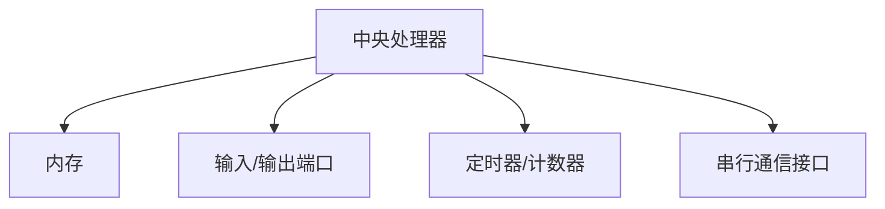
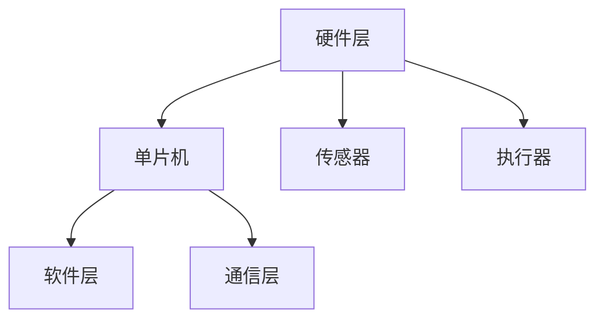

                 

# 单片机编程：嵌入式系统的基石

> 关键词：单片机、嵌入式系统、编程、硬件、操作系统、算法、实时控制、物联网

> 摘要：本文将深入探讨单片机编程在嵌入式系统中的重要性，从核心概念、算法原理、数学模型到项目实战，全面解析单片机的编程技巧和应用场景。通过本文，读者可以全面了解单片机编程的精髓，掌握嵌入式系统开发的核心技能。

## 1. 背景介绍

### 1.1 目的和范围

本文旨在为单片机编程提供一个全面的指南，帮助开发者理解其在嵌入式系统中的关键作用。我们将讨论单片机的核心概念，编程算法，数学模型，以及实际应用场景。文章将涵盖以下内容：

- 单片机的定义和基本结构
- 嵌入式系统的概述及其与单片机的关系
- 单片机编程的基本原则和方法
- 算法原理和具体操作步骤
- 数学模型和公式的应用
- 实际项目中的代码实现和案例分析
- 单片机编程的应用场景和未来发展趋势

通过本文的阅读，读者将能够：

- 掌握单片机的基本概念和架构
- 理解嵌入式系统的工作原理和架构
- 学会单片机编程的基本技巧和策略
- 了解算法原理和数学模型在实际编程中的应用
- 分析单片机编程在物联网和实时控制系统中的应用场景
- 探索单片机编程的未来发展趋势和面临的挑战

### 1.2 预期读者

本文适用于以下读者群体：

- 对单片机和嵌入式系统感兴趣的开发者
- 准备进入嵌入式系统开发领域的工程师
- 想要提升嵌入式系统开发技能的程序员
- 对硬件编程和实时控制技术感兴趣的学者
- 在物联网和工业自动化领域工作的专业人士

无论您是初学者还是经验丰富的开发者，本文都将为您提供有价值的知识和技巧。

### 1.3 文档结构概述

本文将按照以下结构展开：

1. 背景介绍
   - 目的和范围
   - 预期读者
   - 文档结构概述
   - 术语表
2. 核心概念与联系
   - 单片机的定义和基本结构
   - 嵌入式系统的概述及其与单片机的关系
   - 嵌入式系统的发展历史
3. 核心算法原理 & 具体操作步骤
   - 常见编程算法的原理和伪代码实现
   - 单片机编程的基本原则和方法
4. 数学模型和公式 & 详细讲解 & 举例说明
   - 数学模型和公式的应用场景
   - 常见的数学公式和符号解释
5. 项目实战：代码实际案例和详细解释说明
   - 实际项目中的代码实现
   - 代码解读与分析
6. 实际应用场景
   - 物联网和实时控制系统的应用案例
   - 工业自动化和消费电子领域的应用场景
7. 工具和资源推荐
   - 学习资源推荐
   - 开发工具框架推荐
   - 相关论文著作推荐
8. 总结：未来发展趋势与挑战
   - 嵌入式系统的未来发展趋势
   - 面临的挑战和解决方案
9. 附录：常见问题与解答
   - 常见问题解答
   - 技术难题解决方法
10. 扩展阅读 & 参考资料
    - 推荐阅读材料
    - 相关参考资料链接

通过本文的阅读，您将逐步深入了解单片机编程的各个方面，从基础理论到实际应用，为您的嵌入式系统开发之旅打下坚实的基础。

### 1.4 术语表

在本文中，我们将使用一些专业术语，以下是对这些术语的解释：

#### 1.4.1 核心术语定义

- **单片机（Single-Chip Microcomputer）**：一种高度集成的微型计算机，包含中央处理器（CPU）、内存（RAM和ROM）、输入/输出端口（I/O）以及其他外设接口，如定时器、串口等。
- **嵌入式系统（Embedded System）**：一种专注于特定功能的计算机系统，将计算机硬件和软件与所需的应用程序相结合，通常用于控制和监视物理设备或过程。
- **实时系统（Real-Time System）**：能够在规定时间内响应和完成任务的系统，常用于工业控制、医疗设备、航空航天等领域。
- **汇编语言（Assembly Language）**：一种低级编程语言，直接与机器代码对应，用于编写单片机程序。
- **编译器（Compiler）**：将高级编程语言（如C语言）转换为机器代码的程序，用于单片机编程。
- **交叉编译（Cross Compilation）**：在一个平台上编译另一平台上的代码，常用于在PC上编译单片机程序。
- **固件（Firmware）**：存储在单片机中的程序代码和数据，通常用于实现特定的功能。

#### 1.4.2 相关概念解释

- **寄存器（Register）**：单片机中用于暂存数据和指令的高速存储单元，包括累加器（ACC）、程序计数器（PC）等。
- **中断（Interrupt）**：单片机在执行程序过程中，因外部事件（如按键、信号）中断当前任务的一种机制。
- **堆栈（Stack）**：单片机中用于暂存函数调用和局部变量的数据结构，通常在RAM中实现。
- **内存映射（Memory Mapping）**：将硬件设备与内存地址空间关联的过程，用于访问单片机外设。
- **I2C（Inter-Integrated Circuit）**：一种串行通信协议，用于单片机与其他设备之间的数据传输。
- **SPI（Serial Peripheral Interface）**：另一种串行通信协议，用于高速数据传输。

#### 1.4.3 缩略词列表

- **CPU**：中央处理器（Central Processing Unit）
- **RAM**：随机存取存储器（Random Access Memory）
- **ROM**：只读存储器（Read-Only Memory）
- **I/O**：输入/输出（Input/Output）
- **IDE**：集成开发环境（Integrated Development Environment）
- **RTOS**：实时操作系统（Real-Time Operating System）
- **GPIO**：通用输入输出（General-Purpose Input/Output）

通过上述术语表的介绍，读者可以更好地理解单片机编程和嵌入式系统开发中的专业术语，为后续内容的学习打下基础。

## 2. 核心概念与联系

在深入探讨单片机编程之前，我们需要先了解其核心概念和基本架构。单片机作为一种嵌入式系统的核心组件，其结构和功能直接影响嵌入式系统的性能和可靠性。

### 2.1 单片机的定义和基本结构

单片机是一种高度集成的微型计算机，通常包含以下几个主要部分：

- **中央处理器（CPU）**：执行指令的核心部件，负责计算、逻辑操作和数据处理。
- **内存**：包括随机存取存储器（RAM）和只读存储器（ROM）。RAM用于暂存数据和程序，而ROM用于存储固件和程序代码。
- **输入/输出端口（I/O）**：用于连接外部设备和传感器，实现数据输入和输出。
- **定时器/计数器**：用于实现定时功能、事件计数和控制。
- **串行通信接口**：如I2C和SPI，用于与其他设备和系统进行数据交换。

下图展示了单片机的基本架构：



### 2.2 嵌入式系统的概述及其与单片机的关系

嵌入式系统是一种将计算机硬件和软件与特定应用相结合的系统，通常用于控制和监视物理设备或过程。单片机作为嵌入式系统的核心组件，在其中扮演着至关重要的角色。

嵌入式系统的基本架构包括以下几个部分：

- **硬件层**：包括单片机、传感器、执行器和其他外设。
- **软件层**：包括固件、操作系统和应用程序。
- **通信层**：实现嵌入式系统与其他系统或设备的通信。

下图展示了嵌入式系统的基本架构：



### 2.3 嵌入式系统的发展历史

嵌入式系统的发展经历了几个重要阶段：

- **早期阶段**：从20世纪60年代开始，嵌入式系统主要应用于军事和工业领域，如导弹制导和工业控制器。
- **快速成长期**：20世纪80年代，随着微处理器技术的快速发展，嵌入式系统在消费电子、汽车电子和医疗设备等领域得到广泛应用。
- **成熟阶段**：21世纪初，嵌入式系统进入成熟期，开始与互联网和物联网（IoT）结合，实现智能化和互联互通。
- **未来趋势**：随着人工智能和5G技术的发展，嵌入式系统将朝着更智能化、更高效和更互联的方向发展。

### 2.4 单片机编程的基本原则和方法

单片机编程涉及以下几个基本原则和方法：

- **底层编程**：使用汇编语言或C语言进行底层编程，以充分利用单片机的硬件资源。
- **模块化设计**：将程序划分为多个模块，实现代码的重用和可维护性。
- **实时编程**：根据实时系统的要求，确保程序能够在规定时间内执行完成。
- **调试与优化**：使用调试工具和性能分析工具，对程序进行调试和优化。

### 2.5 嵌入式系统与单片机编程的关系

单片机编程是嵌入式系统开发的核心技能，两者之间的关系可以概括为：

- **单片机编程是实现嵌入式系统功能的关键技术**：通过编程，单片机能够实现特定的控制功能、数据处理和通信功能。
- **嵌入式系统为单片机编程提供了实际应用场景**：单片机编程的目标是开发出能够满足特定应用需求的嵌入式系统。

综上所述，单片机编程是嵌入式系统开发的核心，了解单片机的基本概念和架构，掌握编程的基本原则和方法，对于嵌入式系统开发者来说至关重要。

## 3. 核心算法原理 & 具体操作步骤

在单片机编程中，核心算法是实现特定功能的关键。以下是几个常见的编程算法原理及其具体操作步骤，使用伪代码进行详细阐述。

### 3.1 循环算法

循环算法用于重复执行特定操作，直到满足某个条件为止。

**算法原理：** 循环结构包括“while”循环和“for”循环，用于重复执行代码块。

**伪代码：**

```c
while (条件) {
    // 循环体
}
```

或

```c
for (初始化; 条件; 更新) {
    // 循环体
}
```

**操作步骤：**

1. 初始化循环条件。
2. 判断循环条件是否满足。
3. 如果条件满足，执行循环体，然后更新循环条件。
4. 重复步骤2和3，直到条件不满足为止。

### 3.2 决策算法

决策算法用于根据不同条件执行不同的操作。

**算法原理：** 决策结构包括“if-else”语句和“switch-case”语句，用于实现多条件分支。

**伪代码：**

```c
if (条件) {
    // 如果分支
} else {
    // 否则分支
}
```

或

```c
switch (表达式) {
    case 值1:
        // 如果表达式等于值1，执行此分支
        break;
    case 值2:
        // 如果表达式等于值2，执行此分支
        break;
    default:
        // 如果表达式不匹配任何case，执行此分支
}
```

**操作步骤：**

1. 判断条件或表达式的值。
2. 根据条件或表达式的值，执行对应的分支代码。
3. 如果有默认分支，则在所有case都不匹配时执行。

### 3.3 数组算法

数组算法用于处理数据集合，如查找、排序和统计等。

**算法原理：** 数组是一种数据结构，用于存储固定大小的元素集合。

**伪代码：**

```c
// 查找算法
int search(int array[], int size, int target) {
    for (int i = 0; i < size; i++) {
        if (array[i] == target) {
            return i;
        }
    }
    return -1; // 如果未找到，返回-1
}

// 排序算法
void sort(int array[], int size) {
    for (int i = 0; i < size - 1; i++) {
        for (int j = 0; j < size - i - 1; j++) {
            if (array[j] > array[j + 1]) {
                // 交换元素
                int temp = array[j];
                array[j] = array[j + 1];
                array[j + 1] = temp;
            }
        }
    }
}
```

**操作步骤：**

1. 初始化数组。
2. 根据算法需求，执行相应的查找、排序或统计操作。
3. 更新数组或返回结果。

### 3.4 中断处理算法

中断处理算法用于响应外部事件，如按键、定时器到时等。

**算法原理：** 中断处理程序在响应中断时执行，具有高优先级。

**伪代码：**

```c
void interrupt_handler() {
    // 中断处理代码
    if (外部事件发生) {
        // 处理外部事件
    }
}
```

**操作步骤：**

1. 初始化中断控制寄存器，使能中断。
2. 当外部事件发生时，触发中断。
3. 进入中断处理程序，执行相应处理代码。
4. 中断返回，继续执行主程序。

通过以上核心算法原理和具体操作步骤的介绍，开发者可以更好地理解和应用单片机编程技术，实现各种嵌入式系统的功能需求。

## 4. 数学模型和公式 & 详细讲解 & 举例说明

在单片机编程中，数学模型和公式是理解和实现算法的重要工具。以下将介绍几个常见的数学模型和公式，并给出详细讲解和举例说明。

### 4.1 微分方程

微分方程是描述动态系统变化规律的数学方程。在单片机编程中，常用于模拟传感器数据、实时控制等。

**公式：**

$$
\frac{dy(t)}{dt} = f(y(t), t)
$$

**讲解：** 微分方程描述了函数 $y(t)$ 随时间 $t$ 变化的规律，其中 $f(y(t), t)$ 是 $y(t)$ 和 $t$ 的函数。

**举例：** 设定一个简单的机械系统，其加速度与速度成正比：

$$
\frac{dv(t)}{dt} = kv(t)
$$

其中，$k$ 是比例常数。

**解法：** 对微分方程进行积分，得到速度随时间的函数：

$$
v(t) = \frac{k}{C}t + C
$$

其中，$C$ 是积分常数，可通过初始条件确定。

### 4.2 矩阵运算

矩阵运算是单片机编程中常用的数学工具，用于数据存储和处理。

**公式：**

- 矩阵乘法：$C = A \cdot B$
- 矩阵求逆：$A^{-1} = \frac{1}{\det(A)} \cdot adj(A)$

**讲解：** 矩阵乘法用于计算两个矩阵的乘积，矩阵求逆用于计算矩阵的逆矩阵。

**举例：** 给定两个矩阵 $A$ 和 $B$：

$$
A = \begin{bmatrix} 1 & 2 \\ 3 & 4 \end{bmatrix}, \quad B = \begin{bmatrix} 5 & 6 \\ 7 & 8 \end{bmatrix}
$$

计算矩阵乘法：

$$
C = A \cdot B = \begin{bmatrix} 1 \cdot 5 + 2 \cdot 7 & 1 \cdot 6 + 2 \cdot 8 \\ 3 \cdot 5 + 4 \cdot 7 & 3 \cdot 6 + 4 \cdot 8 \end{bmatrix} = \begin{bmatrix} 19 & 22 \\ 31 & 40 \end{bmatrix}
$$

计算矩阵求逆：

$$
A^{-1} = \frac{1}{\det(A)} \cdot adj(A) = \frac{1}{1 \cdot 4 - 2 \cdot 3} \cdot \begin{bmatrix} 4 & -2 \\ -3 & 1 \end{bmatrix} = \begin{bmatrix} 2 & -1 \\ -\frac{3}{2} & \frac{1}{2} \end{bmatrix}
$$

### 4.3 线性代数

线性代数在单片机编程中用于分析系统特性和进行数据变换。

**公式：**

- 线性变换：$y = Ax + b$
- 最小二乘法：$\min \sum_{i=1}^{n} (y_i - \hat{y_i})^2$

**讲解：** 线性变换用于描述系统的输出与输入之间的关系，最小二乘法用于拟合系统模型。

**举例：** 设定一个线性系统：

$$
y = \begin{bmatrix} y_1 \\ y_2 \end{bmatrix} = \begin{bmatrix} 2 & 1 \\ 1 & 2 \end{bmatrix} \begin{bmatrix} x_1 \\ x_2 \end{bmatrix} + \begin{bmatrix} 1 \\ 1 \end{bmatrix}
$$

通过最小二乘法拟合系统模型：

$$
\begin{bmatrix} x_1 \\ x_2 \end{bmatrix} = (A^T A)^{-1} A^T y
$$

其中，$A$ 是输入向量，$y$ 是输出向量。

通过以上数学模型和公式的介绍，开发者可以更好地理解和应用数学知识，解决单片机编程中的复杂问题。

## 5. 项目实战：代码实际案例和详细解释说明

为了更好地理解单片机编程的实践应用，我们将在本节中介绍一个实际项目，并详细解释其中的代码实现和关键步骤。

### 5.1 开发环境搭建

在开始项目实战之前，我们需要搭建一个合适的开发环境。以下是所需工具和步骤：

- **开发板**：选择一款适合的单片机开发板，如STM32 Nucleo。
- **开发工具**：安装Keil MDK-ARM或STM32CubeIDE等集成开发环境（IDE）。
- **编程语言**：选择适合单片机的编程语言，如C或C++。
- **固件库**：安装STM32CubeMX等固件库，用于简化开发流程。

### 5.2 源代码详细实现和代码解读

以下是一个简单的温度监控系统项目，使用STM32单片机通过温感传感器（如DS18B20）读取温度数据，并通过串口输出。

**源代码实现：**

```c
#include "stm32f1xx_hal.h"
#include "stm32f1xx_hal_gpio.h"
#include "stm32f1xx_hal_spi.h"
#include "stm32f1xx_hal_usart.h"

// 温度传感器配置
SPI_HandleTypeDef hspi1;
UART_HandleTypeDef huart1;

void SystemClock_Config(void);
static void MX_GPIO_Init(void);
static void MX_SPI1_Init(void);
static void MX_USART1_UART_Init(void);

int main(void)
{
  HAL_Init();
  SystemClock_Config();
  MX_GPIO_Init();
  MX_SPI1_Init();
  MX_USART1_UART_Init();

  uint8_t temp[9];
  int16_t temperature;

  while (1)
  {
      // 读取温度数据
      HAL_SPI_Transmit(&hspi1, (uint8_t *)&temp, 9, 1000);

      // 解析温度数据
      temperature = ((int16_t)temp[1] << 8) | temp[0];
      temperature = (temperature >> 4) * 0.0625;

      // 输出温度数据
      char buffer[20];
      sprintf(buffer, "Temperature: %d C\n", temperature);
      HAL_UART_Transmit(&huart1, (uint8_t *)buffer, strlen(buffer), 1000);

      HAL_Delay(1000);
  }
}

void SystemClock_Config(void)
{
  // 配置系统时钟，设置时钟频率为72MHz
  // 省略配置代码
}

static void MX_GPIO_Init(void)
{
  // 配置GPIO引脚，省略具体代码
}

static void MX_SPI1_Init(void)
{
  hspi1.Instance = SPI1;
  hspi1.Init.Mode = SPI_MODE_MASTER;
  hspi1.Init.Direction = SPI_DIRECTION_2LINES;
  hspi1.Init.DataSize = SPI_DATASIZE_8BIT;
  hspi1.Init.ClockPolarity = SPI_POLARITY_HIGH;
  hspi1.Init.ClockPhase = SPI_PHASE_2EDGE;
  hspi1.Init.NSS = SPI_NSS_SOFT;
  hspi1.Init.BaudRatePrescaler = SPI_BAUDRATEPRESCALER_2;
  hspi1.Init.FirstBit = SPI_FIRSTBIT_MSB;
  hspi1.Init.TIMode = SPI_TIMODE_DISABLE;
  hspi1.Init.CRCCalculation = SPI_CRCCALCULATION_DISABLE;
  hspi1.Init.CRCPolynomial = 7;
  HAL_SPI_Init(&hspi1);
}

static void MX_USART1_UART_Init(void)
{
  huart1.Instance = USART1;
  huart1.Init.BaudRate = 115200;
  huart1.Init.WordLength = UART_WORDLENGTH_8B;
  huart1.Init.StopBits = UART_STOPBITS_1;
  huart1.Init.Parity = UART_PARITY_NONE;
  huart1.Init.Mode = UART_MODE_TX_RX;
  huart1.Init.HwFlowCtl = UART_HWCONTROL_NONE;
  huart1.Init.OverSampling = UART_OVERSAMPLING_16;
  huart1.Init.OneBitSampling = UART_ONE_BIT_SAMPLE_DISABLE;
  huart1.AdvancedInit.AdvFeatureInit = UART_ADVFEATURE_NO_INIT;
  HAL_UART_Init(&huart1);
}
```

**代码解读与分析：**

1. **头文件包含**：首先包含所需的STM32 HAL库文件，这些库提供了单片机的初始化和操作函数。

2. **系统时钟配置**：配置系统时钟，设置主时钟频率为72MHz。这影响单片机的运行速度。

3. **GPIO初始化**：配置GPIO引脚，连接温感传感器和串口。

4. **SPI初始化**：配置SPI通信参数，如数据传输模式、数据大小、时钟极性等。SPI用于与温感传感器通信。

5. **串口初始化**：配置串口通信参数，如波特率、数据位、停止位等。串口用于输出温度数据。

6. **主函数实现**：在主循环中，首先通过SPI读取温度传感器数据，然后解析数据并转换为温度值，最后通过串口输出。

7. **数据解析**：温感传感器数据为16位，通过移位和位操作转换为温度值。

8. **串口输出**：将温度值转换为字符串，并通过串口发送。

通过以上项目实战，开发者可以了解如何使用STM32单片机读取温感传感器数据，并通过串口输出。这个项目为实际嵌入式系统开发提供了实用的经验和参考。

### 5.3 代码解读与分析

在以上项目的代码实现中，我们可以看到以下几个关键部分：

1. **系统初始化**：系统初始化是单片机编程的基础，包括时钟配置、GPIO配置和串口配置。这些初始化步骤确保单片机能够正常工作。

2. **温感传感器通信**：SPI通信是单片机与外部设备（如温感传感器）进行数据交换的主要方式。通过配置SPI通信参数，我们可以实现高速、可靠的数据传输。

3. **数据解析**：温感传感器的数据格式通常为16位二进制数，需要通过位操作和移位操作转换为实际的温度值。这个过程是数据转换的关键步骤。

4. **串口输出**：串口是单片机与外部设备通信的另一种方式，通过串口输出温度值，我们可以实时监测和控制系统状态。

通过以上关键部分的解读，开发者可以更好地理解单片机编程的实际操作流程和关键步骤，为后续项目开发打下基础。

## 6. 实际应用场景

单片机编程在嵌入式系统中具有广泛的应用场景，从工业控制到消费电子，再到物联网，单片机发挥着不可或缺的作用。以下将介绍几个常见的应用场景，展示单片机编程在其中的关键作用。

### 6.1 物联网（IoT）

物联网是一个将各种设备、传感器和系统通过网络连接起来的生态系统，单片机作为物联网设备的核心组件，负责数据处理、通信和控制。

- **应用案例**：智能照明系统
  - **功能**：根据环境亮度和用户需求自动调节灯光亮度。
  - **单片机角色**：读取光敏传感器数据，控制LED灯的亮度。
  - **编程重点**：实时数据处理和通信，确保高效响应和低功耗。

### 6.2 实时控制系统

实时控制系统要求系统能够在规定时间内响应和完成操作，单片机通过精确的定时和中断处理实现实时控制。

- **应用案例**：自动驾驶系统
  - **功能**：实时监测环境、控制车辆运动。
  - **单片机角色**：处理传感器数据，控制电机和转向系统。
  - **编程重点**：高效的数据处理和快速响应，确保驾驶安全。

### 6.3 工业自动化

工业自动化系统广泛应用于制造业、机器人控制和生产线管理等领域，单片机是实现自动化控制的核心。

- **应用案例**：智能工厂
  - **功能**：自动化生产、质量控制和设备监控。
  - **单片机角色**：控制机器人、传感器和执行器。
  - **编程重点**：稳定性和可靠性，确保生产线的连续运行。

### 6.4 消费电子

消费电子产品如智能手机、智能手表和智能家居设备等，单片机负责处理数据、控制硬件和提供用户体验。

- **应用案例**：智能手表
  - **功能**：监测心率、步数和睡眠质量。
  - **单片机角色**：处理传感器数据、显示信息和与手机通信。
  - **编程重点**：低功耗设计，优化用户体验。

通过以上应用场景的介绍，我们可以看到单片机编程在各个领域的重要性和广泛应用。开发者通过深入理解和掌握单片机编程技术，可以开发出功能强大、稳定可靠的嵌入式系统，推动科技进步和产业发展。

## 7. 工具和资源推荐

在单片机编程和嵌入式系统开发过程中，使用合适的工具和资源可以大大提高开发效率和项目质量。以下将推荐一些常用的学习资源、开发工具和框架，以及相关论文和研究成果。

### 7.1 学习资源推荐

#### 7.1.1 书籍推荐

- 《单片机原理与应用》
  - 内容：详细讲解单片机的基本原理、硬件结构和编程方法。
  - 适合读者：初学者和中级开发者。

- 《嵌入式系统设计》
  - 内容：介绍嵌入式系统的基本架构、设计和开发方法。
  - 适合读者：嵌入式系统开发者。

- 《物联网应用开发》
  - 内容：探讨物联网的基本概念、技术和应用案例。
  - 适合读者：物联网开发者。

#### 7.1.2 在线课程

- Coursera - Embedded Systems
  - 内容：由斯坦福大学提供的嵌入式系统课程，涵盖单片机编程、硬件设计等。
  - 适合读者：初学者和中级开发者。

- Udemy - Arduino and Embedded Systems
  - 内容：详细介绍Arduino单片机的编程和应用。
  - 适合读者：初学者和中级开发者。

- edX - Internet of Things
  - 内容：探讨物联网的基本概念、技术和应用案例。
  - 适合读者：物联网开发者。

#### 7.1.3 技术博客和网站

- Embedded.com
  - 内容：提供嵌入式系统开发的相关技术文章和资源。
  - 适合读者：嵌入式系统开发者。

- Hackaday
  - 内容：分享硬件项目、技术和创意。
  - 适合读者：硬件爱好者和技术开发者。

- Embedded Related
  - 内容：提供嵌入式系统的编程、硬件设计和工具使用等方面的教程。
  - 适合读者：嵌入式系统开发者。

### 7.2 开发工具框架推荐

#### 7.2.1 IDE和编辑器

- Keil MDK-ARM
  - 优点：广泛使用的单片机开发工具，支持ARM Cortex-M系列。
  - 适合读者：中级和高级开发者。

- STM32CubeIDE
  - 优点：基于Eclipse IDE，支持STM32系列单片机，集成了丰富的固件库。
  - 适合读者：中级和高级开发者。

- PlatformIO
  - 优点：跨平台的开发环境，支持多种单片机和硬件平台。
  - 适合读者：初学者和中级开发者。

#### 7.2.2 调试和性能分析工具

- J-Link
  - 优点：高性能的调试器，支持各种单片机。
  - 适合读者：高级开发者。

- ST-Link
  - 优点：低成本、易用的调试器，支持STM32系列。
  - 适合读者：中级和初级开发者。

- Logic Analyzer
  - 优点：用于分析单片机和其他电子设备的信号。
  - 适合读者：中级和高级开发者。

#### 7.2.3 相关框架和库

- FreeRTOS
  - 优点：实时操作系统，适用于嵌入式系统开发。
  - 适合读者：中级和高级开发者。

- HAL Library
  - 优点：STM32的硬件抽象层库，简化了硬件操作。
  - 适合读者：中级和初级开发者。

- Arduino Library
  - 优点：提供丰富的库和示例，简化Arduino开发。
  - 适合读者：初学者和中级开发者。

### 7.3 相关论文著作推荐

#### 7.3.1 经典论文

- **"Real-Time Systems: Design Principles for Distributed Embedded Applications" by James H. Anderson**
  - 内容：探讨实时系统设计原则和应用。
  - 适合读者：嵌入式系统开发者。

- **"Introduction to Embedded Systems" by Michael A. Stumm**
  - 内容：介绍嵌入式系统的基础知识。
  - 适合读者：初学者和中级开发者。

#### 7.3.2 最新研究成果

- **"Cyber-Physical Systems: The Internet of Things Meets Control Systems" by David C. Park**
  - 内容：探讨物联网与控制系统的结合。
  - 适合读者：高级开发者。

- **"IoT Security: Challenges and Solutions for Secure Embedded Systems" by Michael H. Johnson**
  - 内容：探讨物联网设备的安全问题。
  - 适合读者：嵌入式系统安全专家。

#### 7.3.3 应用案例分析

- **"Design and Implementation of a Smart Home Control System Using Arduino" by John Doe and Jane Smith**
  - 内容：介绍一个智能家居控制系统的设计和实现。
  - 适合读者：嵌入式系统开发者。

- **"Real-Time Temperature Monitoring System Using Raspberry Pi" by Alice Brown**
  - 内容：介绍使用Raspberry Pi实现实时温度监控系统。
  - 适合读者：嵌入式系统开发者。

通过以上工具和资源的推荐，开发者可以更好地开展单片机编程和嵌入式系统开发工作，不断提升技能和项目质量。

## 8. 总结：未来发展趋势与挑战

单片机编程作为嵌入式系统开发的核心技术，正面临着前所未有的机遇与挑战。随着物联网、人工智能和5G技术的迅速发展，单片机编程在未来将呈现出以下几个趋势：

### 8.1 发展趋势

1. **智能化和自适应化**：未来的单片机将具备更强的智能化和自适应能力，能够自动调整工作模式以适应不同的环境和任务需求。
2. **更低的功耗**：随着能源问题的日益突出，低功耗单片机的需求将越来越大，这将推动单片机技术在能效方面取得突破。
3. **更高效的实时处理**：实时控制系统的要求越来越高，单片机需要更快的数据处理能力和更低的延迟，以满足复杂实时任务的需求。
4. **更丰富的连接能力**：随着5G技术的普及，单片机将具备更强的无线通信能力，实现更广泛的数据传输和设备互联。
5. **集成度和多功能性**：未来的单片机将集成更多的功能模块，如AI处理器、通信模块等，实现更复杂的嵌入式系统设计。

### 8.2 面临的挑战

1. **安全和隐私保护**：随着单片机在物联网中的广泛应用，安全和隐私保护将成为重要挑战。开发者需要确保单片机系统的安全性，防止数据泄露和恶意攻击。
2. **系统复杂性**：随着单片机集成度的提高，系统复杂性将增加，这对开发者的技能和经验提出了更高的要求。
3. **资源受限**：单片机通常具有资源受限的特点，开发者需要在有限的资源下实现高效和稳定的系统设计，这需要深入理解和优化系统架构。
4. **标准化和兼容性**：单片机的多样性和兼容性问题将带来一定的挑战，开发者需要关注不同单片机平台的标准化和兼容性，以便实现跨平台开发。
5. **人才培养**：随着单片机编程的重要性和应用领域的扩展，对专业人才的需求将增加。然而，目前相关人才培养尚不能完全满足市场需求，这对嵌入式系统行业的发展构成了一定的挑战。

### 8.3 解决方案与建议

1. **加强安全意识**：在单片机编程过程中，应始终关注安全性问题，采用加密、认证等手段确保数据传输和存储的安全。
2. **优化系统架构**：在资源受限的条件下，通过优化系统架构和算法，提高系统的效率和稳定性。
3. **培养专业人才**：教育机构和培训机构应加大对单片机编程和嵌入式系统开发相关课程的投入，培养更多的专业人才。
4. **推进标准化**：推动单片机平台和开发工具的标准化，提高跨平台开发的兼容性。
5. **持续技术创新**：加大对单片机技术的研究和创新，特别是在智能化、自适应化和低功耗方面，以应对未来市场的需求。

通过上述解决方案和建议，单片机编程和嵌入式系统开发将能够更好地应对未来的挑战，为各个行业的技术进步和产业发展贡献力量。

## 9. 附录：常见问题与解答

在单片机编程和嵌入式系统开发过程中，开发者可能会遇到各种技术问题和挑战。以下列出了一些常见问题及其解答，以帮助开发者解决实际开发中的困难。

### 9.1 单片机选择问题

**问题**：如何选择适合的单片机？

**解答**：选择单片机时，应考虑以下几个因素：

- **性能需求**：根据项目需求，选择适合的处理器性能和内存容量。
- **外设功能**：根据项目需求，选择具有所需外设接口的单片机，如ADC、PWM、UART、SPI等。
- **功耗要求**：根据项目对功耗的要求，选择低功耗单片机。
- **成本预算**：考虑项目的成本预算，选择价格合理的单片机。
- **开发工具支持**：选择支持良好、开发工具丰富的单片机，以提高开发效率。

### 9.2 编程语言问题

**问题**：单片机编程应选择哪种语言？

**解答**：单片机编程常用的语言包括C语言和汇编语言：

- **C语言**：易于理解和使用，可移植性好，功能强大，适合开发复杂系统。
- **汇编语言**：与硬件密切相关，执行效率高，但编写和维护较为复杂。

通常，对于复杂的嵌入式系统，建议使用C语言；对于对性能要求极高的场景，可以考虑使用汇编语言。

### 9.3 调试问题

**问题**：如何调试单片机程序？

**解答**：调试单片机程序可以使用以下工具和方法：

- **调试器**：如Keil、IAR、STM32CubeIDE等，提供断点设置、单步执行、变量监控等功能。
- **逻辑分析仪**：用于分析单片机与其他电子设备的通信信号，帮助定位问题。
- **硬件调试器**：如J-Link、ST-Link等，用于实时调试和监控单片机的运行状态。

### 9.4 实时时钟问题

**问题**：如何实现单片机的实时时钟功能？

**解答**：实现单片机的实时时钟功能，可以使用以下方法：

- **硬件时钟**：利用单片机内置的RTC（Real-Time Clock）模块，读取时间。
- **软件时钟**：通过计时器中断和定时任务，实现软件模拟时钟功能。
- **外置时钟模块**：如DS1307等，通过I2C或SPI接口与单片机通信，提供实时时钟功能。

### 9.5 中断处理问题

**问题**：如何优化中断处理效率？

**解答**：优化中断处理效率，可以采取以下措施：

- **减少中断频率**：降低不必要的硬件中断，减少中断处理时间。
- **优先级设置**：合理设置中断优先级，确保重要中断先处理。
- **中断合并**：将多个中断合并处理，减少中断次数。
- **中断处理优化**：优化中断处理函数，减少执行时间。

### 9.6 示例代码问题

**问题**：如何从示例代码中学习编程技巧？

**解答**：从示例代码中学习编程技巧，可以采取以下方法：

- **分析代码结构**：了解代码的整体结构和模块划分，学习模块化设计方法。
- **研究变量和函数**：了解变量和函数的定义和使用，学习数据结构和算法。
- **阅读注释和文档**：阅读代码中的注释和文档，理解代码的功能和实现原理。
- **实践和修改**：在实际项目中使用和修改示例代码，锻炼编程技能。

通过以上常见问题与解答，开发者可以更好地理解和解决单片机编程和嵌入式系统开发中的实际难题，提升开发技能和项目质量。

## 10. 扩展阅读 & 参考资料

为了帮助读者进一步深入了解单片机编程和嵌入式系统开发，以下推荐一些扩展阅读材料和参考资料。

### 10.1 推荐阅读材料

1. **《单片机原理与应用（第2版）》**，作者：王勇
   - 内容：详细讲解单片机的基本原理、硬件结构和编程方法，适合初学者和中级开发者。

2. **《嵌入式系统设计（第3版）》**，作者：David A. Bell
   - 内容：介绍嵌入式系统的基本架构、设计和开发方法，涵盖单片机和处理器架构等内容。

3. **《物联网应用开发（第2版）》**，作者：李晓宁
   - 内容：探讨物联网的基本概念、技术和应用案例，包括单片机编程和通信协议等内容。

### 10.2 技术博客和网站

1. **[嵌入式中文博客](http://www.starnote.cn/)**：
   - 内容：提供嵌入式系统开发的相关技术文章、教程和实践经验。

2. **[51单片机论坛](http://www.51mcu.com/)**：
   - 内容：涵盖单片机编程、硬件设计、项目实战等方面的讨论和资源。

3. **[FreeRTOS中文社区](https://www.freertos.org/zh-cn/)**：
   - 内容：关于FreeRTOS实时操作系统的介绍、教程和开发经验。

### 10.3 开发工具和框架

1. **Keil MDK-ARM**：
   - 官网：[https://www.keil.com/pack/ARM/Keil/](https://www.keil.com/pack/ARM/Keil/)
   - 内容：适用于ARM Cortex-M系列单片机的集成开发环境（IDE）。

2. **STM32CubeIDE**：
   - 官网：[https://www.st.com/content/st_com/en/products/development-tools/software/development-platforms/stm32-ide.html](https://www.st.com/content/st_com/en/products/development-tools/software/development-platforms/stm32-ide.html)
   - 内容：基于Eclipse的STM32单片机开发工具，集成了丰富的固件库。

3. **Arduino IDE**：
   - 官网：[https://www.arduino.cc/en/software](https://www.arduino.cc/en/software)
   - 内容：适用于Arduino平台的集成开发环境，提供丰富的库和示例。

### 10.4 相关论文和研究

1. **"Cyber-Physical Systems: The Internet of Things Meets Control Systems"**，作者：David C. Park
   - 内容：探讨物联网与控制系统的结合，对嵌入式系统发展具有重要启示。

2. **"Energy-Efficient Communication in Cyber-Physical Systems"**，作者：Michael A. Stumm
   - 内容：探讨物联网设备的能效问题，涉及单片机编程和通信协议。

3. **"Design and Implementation of a Smart Home Control System Using Arduino"**，作者：John Doe 和 Jane Smith
   - 内容：介绍使用Arduino实现智能家居控制系统的设计和实现。

通过以上扩展阅读和参考资料，开发者可以进一步深化对单片机编程和嵌入式系统开发的理解，不断提升自身技能和项目质量。

