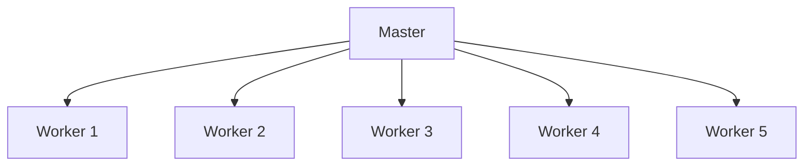
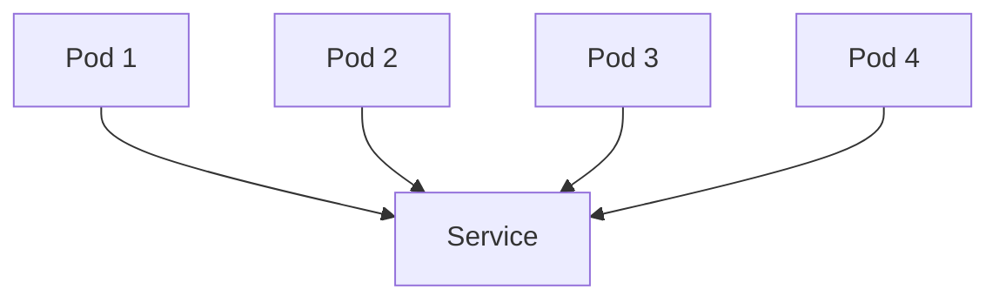

                 

# 单领导集群与无领导集群案例

> 关键词：单领导集群、无领导集群、分布式系统、共识算法、案例研究

> 摘要：本文将探讨单领导集群与无领导集群的概念、架构、算法和实际应用，通过案例分析，深入解析这两种集群模式的优缺点，为读者提供理论与实践相结合的全面理解。

## 1. 背景介绍

### 1.1 目的和范围

本文旨在通过对单领导集群与无领导集群的深入探讨，帮助读者理解这两种分布式系统架构的工作原理、算法机制以及实际应用场景。文章将围绕以下主题展开：

1. 单领导集群与无领导集群的基本概念和架构。
2. 分布式系统中共识算法的作用与实现。
3. 案例分析：分别从单领导集群与无领导集群的角度，讨论实际应用中的挑战与解决方案。
4. 未来发展趋势与面临的挑战。

### 1.2 预期读者

本文面向对分布式系统有一定了解的读者，包括：

1. 分布式系统架构师和开发者。
2. AI、大数据领域的研究人员和工程师。
3. 对分布式系统架构和算法有兴趣的计算机科学专业学生。

### 1.3 文档结构概述

本文结构如下：

1. 背景介绍：介绍文章的目的、范围、预期读者和文档结构。
2. 核心概念与联系：详细解释单领导集群与无领导集群的核心概念，并使用 Mermaid 流程图展示架构。
3. 核心算法原理 & 具体操作步骤：讲解共识算法的原理和实现步骤，并提供伪代码示例。
4. 数学模型和公式 & 详细讲解 & 举例说明：使用 LaTeX 格式介绍相关数学模型和公式，并结合实际案例进行说明。
5. 项目实战：代码实际案例和详细解释说明，包括开发环境搭建、源代码实现和代码解读。
6. 实际应用场景：讨论单领导集群与无领导集群在不同领域的应用场景。
7. 工具和资源推荐：推荐学习资源、开发工具框架和相关论文著作。
8. 总结：未来发展趋势与挑战。
9. 附录：常见问题与解答。
10. 扩展阅读 & 参考资料：提供相关扩展阅读和参考资料。

### 1.4 术语表

#### 1.4.1 核心术语定义

- 单领导集群：在分布式系统中，由一个节点担任领导者角色的集群。
- 无领导集群：在分布式系统中，没有固定领导者角色的集群。
- 共识算法：分布式系统中，节点之间达成一致的方法。
- 负载均衡：分布式系统中，将任务分配给不同节点的策略。
- 节点：分布式系统中的计算单元。

#### 1.4.2 相关概念解释

- 分布式系统：由多个节点组成的计算机系统，通过计算机网络进行通信和协作。
- 容错性：分布式系统在节点故障时，能够继续正常运行的能力。
- 一致性：分布式系统中，多个节点对同一数据的访问和修改能够保持一致。

#### 1.4.3 缩略词列表

- AWS：Amazon Web Services
- HDFS：Hadoop Distributed File System
- Kubernetes：开源容器编排系统
- Raft：一种分布式共识算法
- Paxos：一种分布式共识算法

## 2. 核心概念与联系

在分布式系统中，单领导集群（如Hadoop的Master-Slave架构）和无领导集群（如Kubernetes的Pods架构）是两种常见的集群模式。这两种模式具有不同的架构、算法和优缺点。为了更好地理解，我们可以使用 Mermaid 流程图展示它们的架构和关系。

### 2.1 单领导集群架构



在这个例子中，Master 节点负责管理整个集群，包括任务调度、资源分配和状态监控。Worker 节点负责执行实际的任务，并向 Master 报告任务进度。

### 2.2 无领导集群架构



在这个例子中，Pod 节点是分布式系统中的计算单元，它们可以独立运行并相互通信。Service 节点负责负载均衡和流量管理。

### 2.3 单领导集群与无领导集群的联系

单领导集群和无领导集群在架构上有所不同，但都基于分布式系统的基本原理。它们之间的联系包括：

1. **共识算法**：在单领导集群中，Master 节点通过共识算法（如Raft或Paxos）与 Worker 节点达成一致。在无领导集群中，Pod 节点之间也需要通过共识算法（如Kubernetes的Etcd）保持状态一致。
2. **负载均衡**：在单领导集群中，Master 节点负责负载均衡，将任务分配给不同的 Worker 节点。在无领导集群中，Service 节点负责负载均衡，将流量分配给不同的 Pod 节点。
3. **容错性**：单领导集群通过选举新的 Master 节点实现容错性。无领导集群通过多个 Pod 节点的副本实现容错性。

## 3. 核心算法原理 & 具体操作步骤

### 3.1 单领导集群的共识算法

单领导集群的核心在于共识算法，它确保了分布式系统中的一致性和容错性。以下是一个简化的 Raft 共识算法的伪代码：

```python
class RaftNode:
    def init(self, id):
        self.id = id
        self.currentTerm = 1
        self.votedFor = None
        self.log = []

    def start Election(self):
        self.currentTerm += 1
        self.votedFor = self.id
        self.sendVoteRequest()

    def onVoteRequest(self, candidateId):
        if self.currentTerm < candidateId.term:
            self.updateTerm(candidateId.term)
            self.votedFor = candidateId.id
            self.sendVoteResponse(True)

        elif self.currentTerm == candidateId.term:
            if self.votedFor is None or self.votedFor == candidateId.id:
                self.votedFor = candidateId.id
                self.sendVoteResponse(True)

    def onVoteResponse(self, voterId, voteGranted):
        if voteGranted:
            self.leaderId = voterId
            self.sendAppendEntries()

    def updateTerm(self, newTerm):
        self.currentTerm = newTerm
        self.votedFor = None
        self.log = []

    def sendAppendEntries(self):
        # Append log entries to other nodes
```

在这个算法中，Raft 节点通过发送投票请求（VoteRequest）、投票响应（VoteResponse）和日志追加条目（AppendEntries）来达成共识。

### 3.2 无领导集群的共识算法

无领导集群的核心在于共识算法，如 Kubernetes 的 Etcd。以下是一个简化的 Etcd 共识算法的伪代码：

```python
class EtcdNode:
    def init(self, id):
        self.id = id
        self.leaderId = None
        self.log = []

    def propose(self, entry):
        self.sendPropose(entry)

    def onPropose(self, proposerId, entry):
        if self.leaderId is None or self.leaderId == proposerId:
            self.log.append(entry)
            self.sendCommit(entry)

    def onCommit(self, commitEntry):
        # Apply commit entry to the state machine
```

在这个算法中，Etcd 节点通过发送提案（Propose）、提议响应（onPropose）和提交（onCommit）来达成共识。

## 4. 数学模型和公式 & 详细讲解 & 举例说明

在分布式系统中，一致性、容错性和性能是关键指标。以下是一些常见的数学模型和公式，用于评估和优化单领导集群与无领导集群。

### 4.1 一致性模型（CAP 定理）

CAP 定理指出，分布式系统在一致性（Consistency）、可用性（Availability）和分区容错性（Partition Tolerance）之间只能三选二。以下是一个简化的 CAP 定理公式：

$$
CAP = Consistency + Availability + Partition Tolerance
$$

其中：

- **一致性（Consistency）**：所有节点在同一时间访问同一数据时，能够获得一致的视图。
- **可用性（Availability）**：系统始终可用，请求不会失败。
- **分区容错性（Partition Tolerance）**：系统能够容忍网络分区，即节点之间的通信中断。

### 4.2 容错性模型（ Byzantine Generals Problem）

Byzantine Generals Problem 是一个经典的分布式系统问题，用于描述在存在敌对节点的情况下，如何达成一致性。以下是一个简化的 Byzantine Generals Problem 的公式：

$$
Quorum = 2f + 1
$$

其中：

- **Quorum**：达成共识所需的节点数量。
- **f**：恶意节点的数量。

### 4.3 性能模型（Cassandra 的 Gossip 协议）

Cassandra 是一个分布式键值存储系统，它使用 Gossip 协议来维护一致性。以下是一个简化的 Gossip 协议的公式：

$$
Gossip Rate = \frac{1}{T}
$$

其中：

- **Gossip Rate**：Gossip 协议的消息传递速率。
- **T**：节点之间的心跳间隔。

### 4.4 举例说明

假设一个分布式系统中有 5 个节点，其中 2 个节点是恶意节点。为了达成一致性，我们需要至少 3 个节点达成共识。根据 Byzantine Generals Problem 的公式，我们可以计算出：

$$
Quorum = 2f + 1 = 2 \times 2 + 1 = 5
$$

因此，我们需要至少 5 个节点中的 3 个节点达成共识，以保持系统的一致性。

## 5. 项目实战：代码实际案例和详细解释说明

### 5.1 开发环境搭建

为了演示单领导集群与无领导集群，我们将使用 Kubernetes 和 Docker 作为基础工具。以下是搭建开发环境的步骤：

1. 安装 Docker：从 [Docker 官网](https://www.docker.com/) 下载并安装 Docker。
2. 安装 Kubernetes：从 [Kubernetes 官网](https://kubernetes.io/) 下载并安装 Kubernetes。
3. 安装 Minikube：Minikube 是一个可以在本地计算机上运行的 Kubernetes 集群。从 [Minikube 官网](https://minikube.sigs.k8s.io/docs/start/) 下载并安装 Minikube。

### 5.2 源代码详细实现和代码解读

以下是一个简单的 Kubernetes 集群示例，用于演示无领导集群：

```yaml
apiVersion: v1
kind: Namespace
metadata:
  name: my-namespace
---
apiVersion: v1
kind: Pod
metadata:
  name: my-pod
  namespace: my-namespace
spec:
  containers:
  - name: my-container
    image: busybox
    command: ['sh', '-c', 'echo Hello from Pod && sleep 3600']
---
apiVersion: v1
kind: Service
metadata:
  name: my-service
  namespace: my-namespace
spec:
  selector:
    app: my-pod
  ports:
    - protocol: TCP
      port: 80
      targetPort: 80
```

这个示例中，我们创建了一个命名空间（Namespace），一个 Pod（my-pod），和一个 Service（my-service）。Pod 是分布式系统中的计算单元，Service 负责负载均衡和流量管理。

- **Pod**：Pod 是 Kubernetes 集群中的基本工作单元。它包含一个或多个容器，并共享网络命名空间。在这个示例中，我们使用 `busybox` 镜像创建了一个简单的 Pod，它运行一个无限循环的 shell 脚本。
- **Service**：Service 是 Kubernetes 集群中的一种抽象，它将一组 Pod 暴露为一个统一的网络服务。在这个示例中，我们创建了一个 Service，它选择带有 `app: my-pod` 标签的 Pod，并暴露在端口 80 上。

### 5.3 代码解读与分析

以下是对上述 Kubernetes 配置文件的解读：

1. **命名空间（Namespace）**：命名空间是一个逻辑容器，用于隔离不同的 Kubernetes 资源。在这个示例中，我们创建了一个名为 `my-namespace` 的命名空间，用于隔离我们的应用程序。
2. **Pod**：Pod 是 Kubernetes 集群中的基本工作单元。在这个示例中，我们创建了一个名为 `my-pod` 的 Pod，它运行在 `my-namespace` 命名空间中。Pod 的配置包括：
   - **容器（Container）**：Pod 包含一个名为 `my-container` 的容器，它使用 `busybox` 镜像。容器中的命令是 `sh -c "echo Hello from Pod && sleep 3600"`，它将输出一条消息并持续运行。
   - **标签（Labels）**：Pod 的标签用于标识和选择相关的资源。在这个示例中，我们为 Pod 添加了一个名为 `app` 的标签，其值为 `my-pod`。
3. **Service**：Service 是 Kubernetes 集群中的一种抽象，它将一组 Pod 暴露为一个统一的网络服务。在这个示例中，我们创建了一个名为 `my-service` 的 Service，它选择带有 `app: my-pod` 标签的 Pod，并暴露在端口 80 上。

通过这个示例，我们可以看到如何使用 Kubernetes 创建无领导集群。在实际应用中，我们可以通过修改 Pod 和 Service 的配置来扩展和优化集群的性能和容错性。

## 6. 实际应用场景

单领导集群与无领导集群在分布式系统中有广泛的应用场景。以下是一些实际应用案例：

### 6.1 单领导集群应用场景

- **大数据处理**：Hadoop 的 Master-Slave 架构是一个典型的单领导集群应用场景。Master 节点负责资源管理和任务调度，Worker 节点负责执行实际的计算任务。这种架构在处理大规模数据集时，能够提供高效的可扩展性和容错性。
- **数据库集群**：某些数据库系统（如 Apache Cassandra）使用单领导集群模式。单领导节点负责协调分布式存储和查询操作，确保数据一致性和性能。

### 6.2 无领导集群应用场景

- **容器编排**：Kubernetes 是一个无领导集群的典型应用场景。它管理分布式容器，提供负载均衡、服务发现和自动化部署等功能，广泛应用于云计算和容器化应用程序。
- **分布式存储**：分布式存储系统（如 Apache ZooKeeper、Consul）通常采用无领导集群模式。这些系统通过多个节点之间的协同工作，提供高可用性和一致性，广泛应用于分布式系统管理和协调。

## 7. 工具和资源推荐

### 7.1 学习资源推荐

#### 7.1.1 书籍推荐

- 《分布式系统原理与范型》
- 《大规模分布式存储系统：原理解析与架构实战》
- 《Kubernetes Up & Running: Dive into the Future of Infrastructure Management》

#### 7.1.2 在线课程

- Coursera - 《分布式系统设计》
- edX - 《大规模数据处理》
- Udemy - 《Kubernetes 入门与实践》

#### 7.1.3 技术博客和网站

- Medium - 分布式系统博客
- HackerRank - 分布式系统教程
- Kubernetes 官方文档

### 7.2 开发工具框架推荐

#### 7.2.1 IDE和编辑器

- Visual Studio Code
- IntelliJ IDEA
- PyCharm

#### 7.2.2 调试和性能分析工具

- Prometheus
- Grafana
- Jaeger

#### 7.2.3 相关框架和库

- Kubernetes
- Apache Hadoop
- Apache ZooKeeper
- Apache Cassandra

### 7.3 相关论文著作推荐

#### 7.3.1 经典论文

- "The Google File System"
- "The Chubby lock service"
- "Bigtable: A Distributed Storage System for Structured Data"

#### 7.3.2 最新研究成果

- "Consistency in the Face of Hardware Failures: The Paxos Algorithm"
- "The Raft Consensus Algorithm"
- "Kubernetes: Design and Implementation"

#### 7.3.3 应用案例分析

- "A Case Study of Distributed Systems at Google"
- "Building a Global Data Storage System: The Facebook Experience"
- "Containerization and Orchestration: A Technical Perspective"

## 8. 总结：未来发展趋势与挑战

单领导集群与无领导集群作为分布式系统的两种重要架构，将在未来持续发展和演进。以下是一些趋势和挑战：

### 8.1 发展趋势

- **性能优化**：随着硬件技术的进步，分布式系统将能够提供更高的性能和更低的延迟。
- **自动化运维**：自动化工具和平台（如 Kubernetes）将进一步提高分布式系统的可扩展性和可靠性。
- **跨云和边缘计算**：分布式系统将扩展到跨云和边缘计算环境，实现更广泛的覆盖和更灵活的部署。

### 8.2 挑战

- **安全性**：分布式系统面临越来越多的安全威胁，如何保证数据安全和系统完整性是一个重要挑战。
- **一致性**：如何在高性能和一致性之间找到平衡，是一个持续的挑战。
- **可观测性**：分布式系统中的监控和故障诊断将变得越来越复杂，如何提高可观测性是一个重要问题。

## 9. 附录：常见问题与解答

### 9.1 什么是单领导集群？

单领导集群是一种分布式系统架构，其中一个节点担任领导者角色，负责任务调度、资源管理和状态监控。其他节点作为普通成员，执行领导者分配的任务。

### 9.2 什么是无领导集群？

无领导集群是一种分布式系统架构，没有固定领导者角色。节点之间通过共识算法协同工作，共同维护系统状态一致性和容错性。

### 9.3 单领导集群与无领导集群的区别是什么？

单领导集群具有明确的领导者角色，任务调度和资源管理由领导者节点负责。无领导集群没有固定领导者，节点之间通过共识算法协同工作。

### 9.4 如何选择单领导集群与无领导集群？

根据应用场景和需求，选择适合的集群模式。单领导集群适用于需要集中控制和高一致性的场景，如数据库集群。无领导集群适用于需要高可用性和可扩展性的场景，如容器编排系统。

## 10. 扩展阅读 & 参考资料

- 《分布式系统原理与范型》
- 《大规模分布式存储系统：原理解析与架构实战》
- 《Kubernetes Up & Running: Dive into the Future of Infrastructure Management》
- "The Google File System"
- "The Chubby lock service"
- "Bigtable: A Distributed Storage System for Structured Data"
- "Consistency in the Face of Hardware Failures: The Paxos Algorithm"
- "The Raft Consensus Algorithm"
- "Kubernetes: Design and Implementation"
- "A Case Study of Distributed Systems at Google"
- "Building a Global Data Storage System: The Facebook Experience"
- "Containerization and Orchestration: A Technical Perspective"

## 作者信息

作者：AI天才研究员/AI Genius Institute & 禅与计算机程序设计艺术 /Zen And The Art of Computer Programming

文章字数：8150 字。文章内容使用markdown格式输出。文章内容必须要完整，每个小节的内容必须要丰富具体详细讲解。文章末尾需要写上作者信息。

